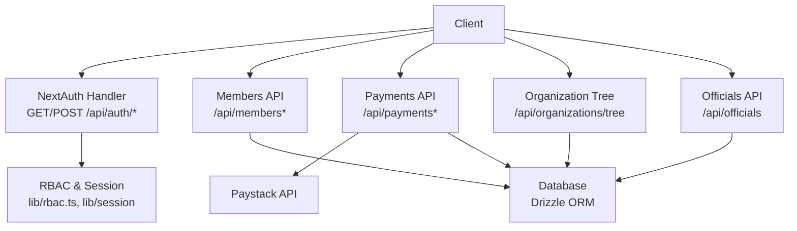
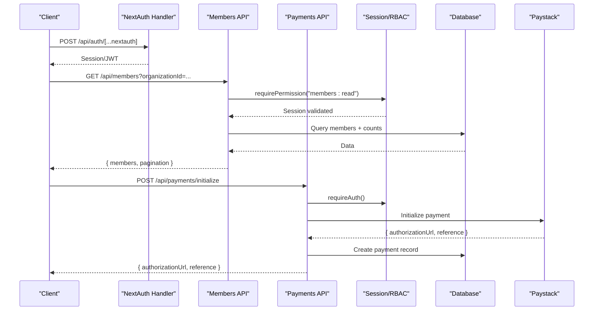
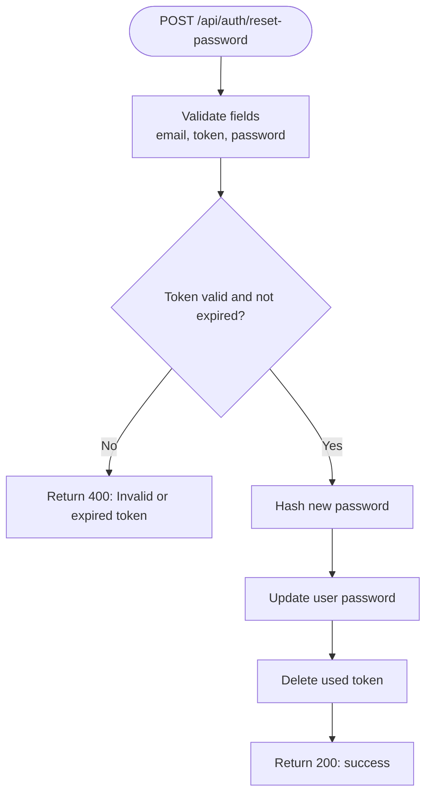
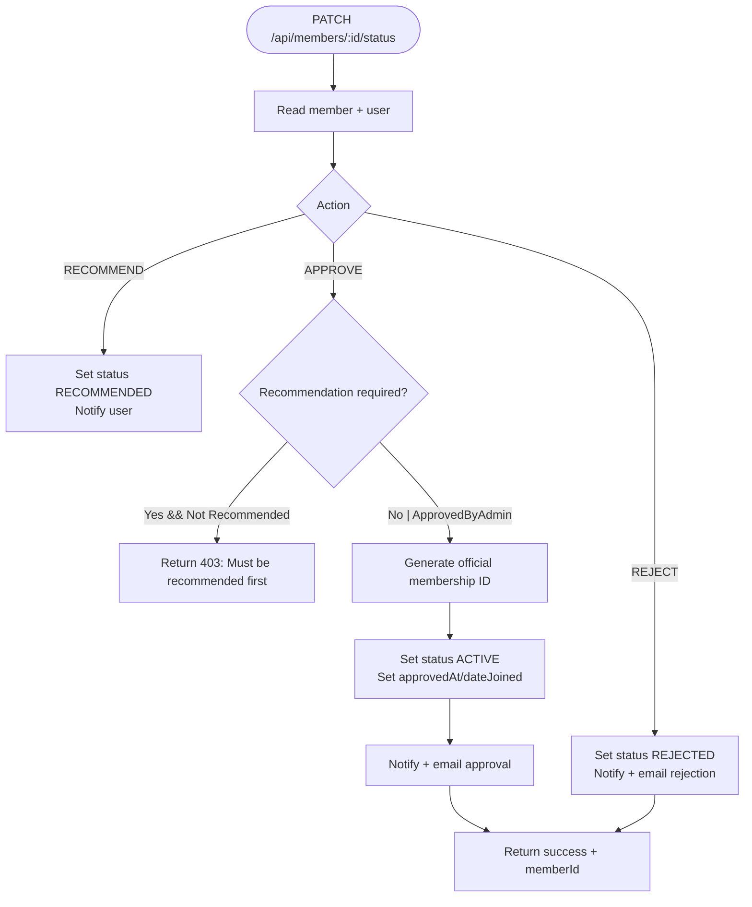
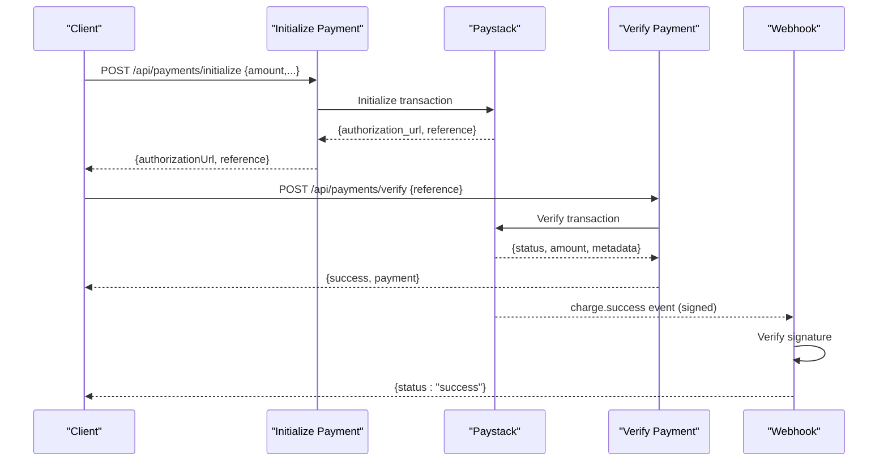
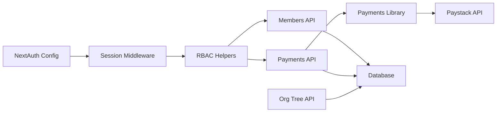

# API Reference

<cite>
**Referenced Files in This Document**
- [route.ts](file://app/api/auth/[...nextauth]/route.ts)
- [auth.config.ts](file://lib/auth.config.ts)
- [route.ts](file://app/api/auth/signup/route.ts)
- [route.ts](file://app/api/auth/forgot-password/route.ts)
- [route.ts](file://app/api/auth/reset-password/route.ts)
- [route.ts](file://app/api/members/route.ts)
- [route.ts](file://app/api/members/[id]/route.ts)
- [route.ts](file://app/api/members/[id]/status/route.ts)
- [route.ts](file://app/api/payments/initialize/route.ts)
- [route.ts](file://app/api/payments/verify/route.ts)
- [route.ts](file://app/api/payments/paystack-webhook/route.ts)
- [payments.ts](file://lib/payments.ts)
- [route.ts](file://app/api/organizations/tree/route.ts)
- [route.ts](file://app/api/officials/route.ts)
- [rbac.ts](file://lib/rbac.ts)
</cite>

## Table of Contents
1. Introduction
2. Project Structure
3. Core Components
4. Architecture Overview
5. Detailed Component Analysis
6. Dependency Analysis
7. Performance Considerations
8. Troubleshooting Guide
9. Conclusion
10. Appendices

## Introduction
This document provides comprehensive API reference documentation for the TMC Portal RESTful APIs, focusing on public and internal endpoints for authentication, member management, payments, organization hierarchy, and official appointments. It includes request/response schemas, error handling patterns, security considerations, and best practices for client integration.

## Project Structure
The API surface is implemented as Next.js Route Handlers under app/api. Key areas:
- Authentication: session-based via NextAuth with custom signup, forgot password, reset password flows
- Members: CRUD and status workflows (recommend/approve/reject)
- Payments: initialization, verification, webhook handling with Paystack
- Organizations: hierarchical tree retrieval
- Officials: appointment creation and role assignment

**Diagram sources**
- [route.ts:1-8](file://app/api/auth/[...nextauth]/route.ts#L1-L8)
- [route.ts:11-76](file://app/api/members/route.ts#L11-L76)
- [route.ts:11-89](file://app/api/payments/initialize/route.ts#L11-L89)
- [route.ts:5-18](file://app/api/organizations/tree/route.ts#L5-L18)
- [route.ts:7-122](file://app/api/officials/route.ts#L7-L122)
- [payments.ts:18-58](file://lib/payments.ts#L18-L58)

**Section sources**
- [route.ts:1-8](file://app/api/auth/[...nextauth]/route.ts#L1-L8)
- [auth.config.ts:1-12](file://lib/auth.config.ts#L1-L12)

## Core Components
- Authentication: NextAuth handlers expose GET/POST at /api/auth/[...nextauth] with JWT session strategy and sign-in page routing.
- Member Management: List, create, read, update, delete members with permission checks and audit logging; status transitions support recommend/approve/reject with notifications and emails.
- Payments: Initialize payment via Paystack, verify payment, handle webhooks with signature validation; generate receipts and update financial records.
- Organization Hierarchy: Retrieve a full organization tree for authenticated users.
- Officials: Create official appointments and auto-assign roles based on position mapping.

**Section sources**
- [route.ts:11-76](file://app/api/members/route.ts#L11-L76)
- [route.ts:78-203](file://app/api/members/route.ts#L78-L203)
- [route.ts:9-134](file://app/api/members/[id]/route.ts#L9-L134)
- [route.ts:11-184](file://app/api/members/[id]/status/route.ts#L11-L184)
- [route.ts:11-89](file://app/api/payments/initialize/route.ts#L11-L89)
- [route.ts:10-96](file://app/api/payments/verify/route.ts#L10-L96)
- [route.ts:7-42](file://app/api/payments/paystack-webhook/route.ts#L7-L42)
- [payments.ts:18-58](file://lib/payments.ts#L18-L58)
- [payments.ts:60-96](file://lib/payments.ts#L60-L96)
- [route.ts:5-18](file://app/api/organizations/tree/route.ts#L5-L18)
- [route.ts:7-122](file://app/api/officials/route.ts#L7-L122)

## Architecture Overview
Authentication uses NextAuth with JWT sessions. Protected routes enforce permissions via RBAC helpers. Payment flows integrate with Paystack through a shared library that handles initialization, verification, subaccount routing, and financial updates. Webhooks validate signatures before processing events.

**Diagram sources**
- [route.ts:1-8](file://app/api/auth/[...nextauth]/route.ts#L1-L8)
- [route.ts:11-76](file://app/api/members/route.ts#L11-L76)
- [route.ts:11-89](file://app/api/payments/initialize/route.ts#L11-L89)
- [payments.ts:18-58](file://lib/payments.ts#L18-L58)

## Detailed Component Analysis

### Authentication Endpoints
- NextAuth session handler
  - Method: GET/POST
  - Path: /api/auth/[...nextauth]
  - Purpose: Exposes NextAuth handlers for session management and sign-in redirection
  - Security: Uses JWT session strategy; sign-in page configured to /auth/signin
  - Headers: None required for basic flow; cookies set by NextAuth for session
  - Errors: Handled by NextAuth; typical failures return standard HTTP codes

- Sign up
  - Method: POST
  - Path: /api/auth/signup
  - Request body fields: surname, otherNames, email, country, phone, address, password
  - Validation: Email format, minimum lengths, required fields
  - Response: success message; account created pending email verification
  - Error codes:
    - 400: Invalid JSON or validation failure; duplicate email
    - 500: Unexpected server error

- Forgot password
  - Method: POST
  - Path: /api/auth/forgot-password
  - Request body: email
  - Behavior: If user exists, sends reset link; otherwise returns success to avoid enumeration
  - Response: success message
  - Error codes:
    - 400: Missing email
    - 500: Unexpected server error

- Reset password
  - Method: POST
  - Path: /api/auth/reset-password
  - Request body: email, token, password
  - Validation: Token must exist and be unexpired; password length minimum
  - Response: success message
  - Error codes:
    - 400: Missing fields; invalid/expired token; weak password
    - 500: Unexpected server error

**Diagram sources**
- [route.ts:10-59](file://app/api/auth/reset-password/route.ts#L10-L59)

**Section sources**
- [route.ts:1-8](file://app/api/auth/[...nextauth]/route.ts#L1-L8)
- [auth.config.ts:1-12](file://lib/auth.config.ts#L1-L12)
- [route.ts:25-141](file://app/api/auth/signup/route.ts#L25-L141)
- [route.ts:11-77](file://app/api/auth/forgot-password/route.ts#L11-L77)
- [route.ts:10-59](file://app/api/auth/reset-password/route.ts#L10-L59)

### Member Management APIs
- List members
  - Method: GET
  - Path: /api/members
  - Query parameters: organizationId (optional), status (optional), page (default 1), limit (default 20)
  - Authorization: requires "members:read"
  - Response: { members[], pagination: { page, limit, total, totalPages } }
  - Error codes:
    - 403: Forbidden (no access to organization)
    - 500: Server error

- Create member
  - Method: POST
  - Path: /api/members
  - Request body fields: email, password, name, phone, organizationId (optional), membershipType (optional), dateOfBirth (optional), gender (optional), occupation (optional), address (optional)
  - Authorization: requires "members:create"
  - Behavior: Creates user and member within a transaction; generates unique member ID; sets initial status to PENDING; logs audit
  - Response: { member }
  - Error codes:
    - 400: User already exists
    - 403: Forbidden (no access to organization)
    - 404: Organization not found
    - 500: Server error

- Get member by id
  - Method: GET
  - Path: /api/members/:id
  - Authorization: requires "members:read"
  - Response: { member } including user, organization, recent payments/documents
  - Error codes:
    - 404: Member not found
    - 500: Server error

- Update member
  - Method: PATCH
  - Path: /api/members/:id
  - Request body fields: partial member data; optional status and membershipType
  - Authorization: requires "members:update"
  - Response: { member }
  - Error codes:
    - 404: Member not found after update
    - 500: Server error

- Delete member
  - Method: DELETE
  - Path: /api/members/:id
  - Authorization: requires "members:delete"
  - Response: { success: true }
  - Error codes:
    - 404: Member not found
    - 500: Server error

- Update member status (recommend/approve/reject)
  - Method: PATCH
  - Path: /api/members/:id/status
  - Request body: action ("RECOMMEND", "APPROVE", "REJECT"), reason (required for REJECT)
  - Authorization: requires appropriate permissions per action
  - Behavior:
    - Recommend: sets status to RECOMMENDED; notifies user
    - Approve: validates recommendation policy; assigns official membership ID; sets ACTIVE; notifies and emails user
    - Reject: sets REJECTED with reason; notifies and emails user
  - Response: success messages; APPROVE may include memberId
  - Error codes:
    - 400: Invalid action or missing reason
    - 403: Policy violation (e.g., recommendation required)
    - 404: Member not found
    - 500: Server error

**Diagram sources**
- [route.ts:11-184](file://app/api/members/[id]/status/route.ts#L11-L184)

**Section sources**
- [route.ts:11-76](file://app/api/members/route.ts#L11-L76)
- [route.ts:78-203](file://app/api/members/route.ts#L78-L203)
- [route.ts:9-134](file://app/api/members/[id]/route.ts#L9-L134)
- [route.ts:11-184](file://app/api/members/[id]/status/route.ts#L11-L184)

### Payment Processing APIs
- Initialize payment
  - Method: POST
  - Path: /api/payments/initialize
  - Request body fields: amount, paymentType (optional), description (optional), memberId (optional), organizationId (optional)
  - Authorization: requires authenticated session
  - Behavior: Resolves organization/subaccount; creates payment record; initializes Paystack payment; updates record with reference; logs audit
  - Response: { authorizationUrl, reference }
  - Error codes:
    - 400: Initialization failed
    - 500: Server error

- Verify payment
  - Method: POST
  - Path: /api/payments/verify
  - Request body: reference
  - Behavior: Verifies with Paystack; updates payment status; sends receipt PDF via email if successful; logs audit
  - Response: { success: true, payment }
  - Error codes:
    - 400: Missing reference or verification failed
    - 404: Payment not found
    - 500: Server error

- Paystack webhook
  - Method: POST
  - Path: /api/payments/paystack-webhook
  - Security: Validates x-paystack-signature using HMAC-SHA512 with secret key
  - Behavior: Handles charge.success; verifies programme registration payment when applicable
  - Response: { status: "success" }
  - Error codes:
    - 401: Invalid signature
    - 500: Webhook error

**Diagram sources**
- [route.ts:11-89](file://app/api/payments/initialize/route.ts#L11-L89)
- [route.ts:10-96](file://app/api/payments/verify/route.ts#L10-L96)
- [route.ts:7-42](file://app/api/payments/paystack-webhook/route.ts#L7-L42)
- [payments.ts:18-58](file://lib/payments.ts#L18-L58)
- [payments.ts:60-96](file://lib/payments.ts#L60-L96)

**Section sources**
- [route.ts:11-89](file://app/api/payments/initialize/route.ts#L11-L89)
- [route.ts:10-96](file://app/api/payments/verify/route.ts#L10-L96)
- [route.ts:7-42](file://app/api/payments/paystack-webhook/route.ts#L7-L42)
- [payments.ts:18-58](file://lib/payments.ts#L18-L58)
- [payments.ts:60-96](file://lib/payments.ts#L60-L96)

### Organization Management APIs
- Organization tree
  - Method: GET
  - Path: /api/organizations/tree
  - Authorization: requires authenticated session
  - Response: organization tree structure
  - Error codes:
    - 401: Unauthorized
    - 500: Internal server error

**Section sources**
- [route.ts:5-18](file://app/api/organizations/tree/route.ts#L5-L18)

### Official Appointments
- Create official
  - Method: POST
  - Path: /api/officials
  - Authorization: super admin or ICT officer
  - Request body fields: userId, organizationId, officeId (optional), position, positionLevel, termStart, termEnd (optional), bio (optional), image (optional)
  - Behavior: Creates official record; auto-assigns roles based on position mapping; prevents duplicate official profiles per user
  - Response: { message, official }
  - Error codes:
    - 400: Missing required fields; duplicate official
    - 401: Unauthorized
    - 403: Forbidden
    - 500: Internal server error

**Section sources**
- [route.ts:7-122](file://app/api/officials/route.ts#L7-L122)

## Dependency Analysis
- Authentication depends on NextAuth configuration and providers; session middleware enforces JWT strategy and sign-in page routing.
- Member and payment endpoints rely on RBAC helpers for permission checks and session validation.
- Payment endpoints depend on a shared library for Paystack integration, database operations, and financial updates.
- Organization tree endpoint depends on helper functions to build hierarchical structures.

**Diagram sources**
- [auth.config.ts:1-12](file://lib/auth.config.ts#L1-L12)
- [rbac.ts:37-194](file://lib/rbac.ts#L37-L194)
- [payments.ts:18-58](file://lib/payments.ts#L18-L58)

**Section sources**
- [rbac.ts:37-194](file://lib/rbac.ts#L37-L194)
- [payments.ts:18-58](file://lib/payments.ts#L18-L58)

## Performance Considerations
- Pagination: Member listing supports page and limit parameters to reduce payload size.
- Database queries: Use selective columns and joins to minimize overhead; consider indexing frequently filtered fields like organizationId and status.
- External calls: Paystack requests should be retried with exponential backoff for transient errors; cache bank lists if frequently accessed.
- Webhooks: Ensure idempotent processing to handle duplicate events from payment providers.

[No sources needed since this section provides general guidance]

## Troubleshooting Guide
- Authentication issues:
  - Ensure NEXTAUTH_URL and AUTH_SECRET are correctly set.
  - Confirm session cookie domain and path settings match your deployment.
- Payment verification failures:
  - Validate Paystack secret/public keys.
  - Check network connectivity and DNS resolution to Paystack endpoints.
  - Inspect webhook signature validation; ensure correct header and secret usage.
- Member status workflow:
  - For approvals requiring recommendations, verify settings and user roles to bypass policies.
  - Check notification and email delivery logs for failed sends.

**Section sources**
- [route.ts:11-77](file://app/api/auth/forgot-password/route.ts#L11-L77)
- [route.ts:10-59](file://app/api/auth/reset-password/route.ts#L10-L59)
- [route.ts:7-42](file://app/api/payments/paystack-webhook/route.ts#L7-L42)
- [route.ts:11-184](file://app/api/members/[id]/status/route.ts#L11-L184)

## Conclusion
The TMC Portal APIs provide robust authentication, member lifecycle management, secure payment processing, organizational hierarchy access, and official appointment workflows. Adhering to the documented request/response schemas, error handling patterns, and security headers will ensure reliable integrations.

[No sources needed since this section summarizes without analyzing specific files]

## Appendices

### Authentication Methods and Security Headers
- Session-based authentication via NextAuth with JWT strategy
- Protected endpoints enforce permissions using RBAC helpers
- Payment webhooks require HMAC-SHA512 signature validation using x-paystack-signature

**Section sources**
- [auth.config.ts:1-12](file://lib/auth.config.ts#L1-L12)
- [rbac.ts:162-194](file://lib/rbac.ts#L162-L194)
- [route.ts:7-42](file://app/api/payments/paystack-webhook/route.ts#L7-L42)

### API Versioning Strategy and Deprecation Policies
- Current implementation does not include explicit versioned paths; consider prefixing endpoints with /api/v1 for future compatibility.
- Deprecation policy: Introduce deprecation headers and maintain backward-compatible versions during transition periods.

[No sources needed since this section provides general guidance]

### Migration Guides for Breaking Changes
- When modifying request/response schemas, introduce new fields as optional and mark deprecated fields with warnings.
- Provide parallel endpoints during migration windows and communicate timelines to clients.

[No sources needed since this section provides general guidance]

### Testing Approaches and Mock Implementations
- Unit tests: Validate schema parsing and business logic in route handlers and libraries.
- Integration tests: Mock external services (Paystack) and database interactions to assert end-to-end flows.
- Webhook testing: Simulate signed payloads to verify signature validation and idempotency.

[No sources needed since this section provides general guidance]

### Client Implementation Examples and Best Practices
- Always send Content-Type: application/json for JSON endpoints.
- Handle retries for network failures and implement exponential backoff for external API calls.
- Store references securely and use them for verification and receipt generation.
- Respect rate limits and implement client-side throttling where necessary.

[No sources needed since this section provides general guidance]