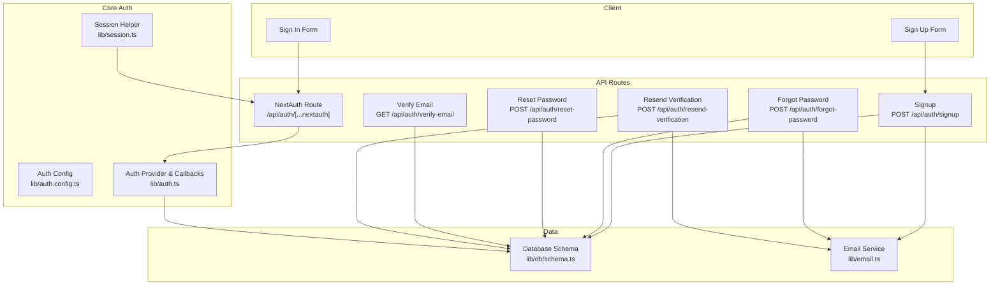
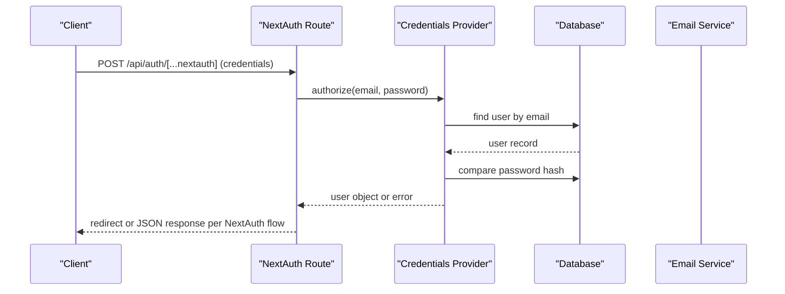
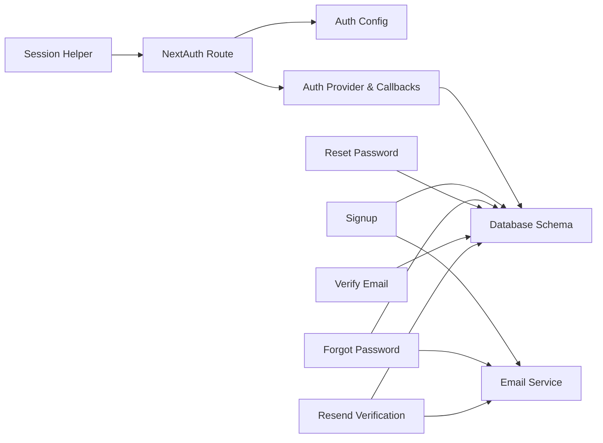

# Authentication & Session APIs

<cite>
**Referenced Files in This Document**
- [route.ts](file://app/api/auth/[...nextauth]/route.ts)
- [auth.config.ts](file://lib/auth.config.ts)
- [auth.ts](file://lib/auth.ts)
- [signup route.ts](file://app/api/auth/signup/route.ts)
- [forgot-password route.ts](file://app/api/auth/forgot-password/route.ts)
- [reset-password route.ts](file://app/api/auth/reset-password/route.ts)
- [verify-email route.ts](file://app/api/auth/verify-email/route.ts)
- [resend-verification route.ts](file://app/api/auth/resend-verification/route.ts)
- [session.ts](file://lib/session.ts)
- [next-auth.d.ts](file://types/next-auth.d.ts)
- [schema.ts](file://lib/db/schema.ts)
- [signin-form.tsx](file://components/auth/signin-form.tsx)
- [signup-form.tsx](file://components/auth/signup-form.tsx)
- [email.ts](file://lib/email.ts)
- [proxy.ts](file://proxy.ts)
</cite>

## Table of Contents
1. Introduction
2. Project Structure
3. Core Components
4. Architecture Overview
5. Detailed Component Analysis
6. Dependency Analysis
7. Performance Considerations
8. Troubleshooting Guide
9. Conclusion

## Introduction
This document provides comprehensive API documentation for authentication and session management endpoints under /api/auth/*. It covers user registration, login via credentials, password reset, email verification, and session handling using NextAuth v5 with JWT strategy. It also documents the custom credentials provider implementation, token structure, multi-tenant context (roles, permissions, organization), client-side flows, security considerations, and troubleshooting techniques.

## Project Structure
Authentication is implemented as a combination of:
- NextAuth v5 route handler at /api/auth/[...nextauth]
- Custom REST endpoints for signup, forgot-password, reset-password, verify-email, resend-verification
- Server-side session retrieval helper
- Client components that call NextAuth client methods and REST endpoints
- Database schema for users, sessions, accounts, and verification tokens



**Diagram sources**
- [route.ts:1-8](file://app/api/auth/[...nextauth]/route.ts#L1-L8)
- [auth.config.ts:1-12](file://lib/auth.config.ts#L1-L12)
- [auth.ts:131-257](file://lib/auth.ts#L131-L257)
- [signup route.ts:25-141](file://app/api/auth/signup/route.ts#L25-L141)
- [forgot-password route.ts:11-77](file://app/api/auth/forgot-password/route.ts#L11-L77)
- [reset-password route.ts:10-59](file://app/api/auth/reset-password/route.ts#L10-L59)
- [verify-email route.ts:7-63](file://app/api/auth/verify-email/route.ts#L7-L63)
- [resend-verification route.ts:8-67](file://app/api/auth/resend-verification/route.ts#L8-L67)
- [session.ts:1-16](file://lib/session.ts#L1-L16)
- [schema.ts:84-146](file://lib/db/schema.ts#L84-L146)
- [email.ts:21-92](file://lib/email.ts#L21-L92)

**Section sources**
- [route.ts:1-8](file://app/api/auth/[...nextauth]/route.ts#L1-L8)
- [auth.config.ts:1-12](file://lib/auth.config.ts#L1-L12)
- [auth.ts:131-257](file://lib/auth.ts#L131-L257)
- [schema.ts:84-146](file://lib/db/schema.ts#L84-L146)

## Core Components
- NextAuth v5 integration:
  - Route handler exposes GET/POST handlers for standard OAuth/credentials flows.
  - Configuration sets JWT session strategy, sign-in page, and trustHost.
- Custom Credentials Provider:
  - Validates email/password, enforces email verification, and returns minimal user payload.
  - Enriches JWT with roles, permissions, membership/official profiles, and super-admin flag.
- Session helper:
  - Provides server-side session access compatible with NextAuth v5.
- Token and session augmentation:
  - Types extend next-auth Session and JWT to include roles, permissions, org context, and impersonation fields.

Key responsibilities:
- Registration: create user, hash password, generate verification token, send email.
- Login: validate credentials, build JWT with enriched claims, set session.
- Password reset: issue time-bound token, allow secure password update.
- Email verification: validate token, mark user verified, clean up token.
- Resend verification: regenerate token and email when needed.

**Section sources**
- [auth.config.ts:1-12](file://lib/auth.config.ts#L1-L12)
- [auth.ts:131-257](file://lib/auth.ts#L131-L257)
- [session.ts:1-16](file://lib/session.ts#L1-L16)
- [next-auth.d.ts:21-74](file://types/next-auth.d.ts#L21-L74)

## Architecture Overview
The system uses NextAuth v5 with a JWT session strategy. The credentials provider validates users against the database and enriches the JWT with role and permission data. Custom endpoints handle lifecycle events like signup, password reset, and email verification. A proxy middleware protects dashboard routes and redirects unauthenticated users.



**Diagram sources**
- [route.ts:1-8](file://app/api/auth/[...nextauth]/route.ts#L1-L8)
- [auth.ts:146-183](file://lib/auth.ts#L146-L183)

**Section sources**
- [proxy.ts:1-51](file://proxy.ts#L1-L51)

## Detailed Component Analysis

### Authentication Endpoints

#### POST /api/auth/signup
- Purpose: Create a new user account, hash password, generate verification token, and send verification email.
- Request body:
  - surname: string (required)
  - otherNames: string (required)
  - email: string (required, valid email)
  - country: string (required)
  - phone: string (required)
  - address: string (required)
  - password: string (required, min length enforced)
- Response:
  - Success: { success: true, message: "Account created..." }
  - Validation error: 400 with error details
  - Duplicate email: 400 with error message
  - Server error: 500 with error message
- Behavior:
  - Hashes password before storage
  - Creates verification token with expiry
  - Sends verification email via email service
  - Logs audit event on successful signup

**Section sources**
- [signup route.ts:15-141](file://app/api/auth/signup/route.ts#L15-L141)
- [email.ts:21-92](file://lib/email.ts#L21-L92)

#### POST /api/auth/forgot-password
- Purpose: Initiate password reset by issuing a time-bound token and sending an email.
- Request body:
  - email: string (required)
- Response:
  - Success: { success: true, message: "...reset link has been sent." } even if user not found (to avoid enumeration)
  - Server error: 500
- Behavior:
  - Generates token with 1-hour expiry
  - Stores token in verification_tokens
  - Sends reset email with link

**Section sources**
- [forgot-password route.ts:11-77](file://app/api/auth/forgot-password/route.ts#L11-L77)

#### POST /api/auth/reset-password
- Purpose: Reset user password using a valid, non-expired token.
- Request body:
  - email: string (required)
  - token: string (required)
  - password: string (required, min length enforced)
- Response:
  - Success: { success: true, message: "Password reset successful..." }
  - Invalid/expired token: 400
  - Missing fields: 400
  - Server error: 500
- Behavior:
  - Verifies token exists and is not expired
  - Hashes new password and updates user
  - Deletes used token

**Section sources**
- [reset-password route.ts:10-59](file://app/api/auth/reset-password/route.ts#L10-L59)

#### GET /api/auth/verify-email?token=...&email=...
- Purpose: Verify user email using a valid token.
- Query parameters:
  - token: string (required)
  - email: string (required)
- Response:
  - Success: { success: true }
  - Invalid/expired token: 400
  - Server error: 500
- Behavior:
  - Finds matching non-expired token
  - Sets user emailVerified timestamp
  - Deletes used token

**Section sources**
- [verify-email route.ts:7-63](file://app/api/auth/verify-email/route.ts#L7-L63)

#### POST /api/auth/resend-verification
- Purpose: Reissue a verification email for unverified users.
- Request body:
  - email: string (required)
- Response:
  - Success: { message: "Verification email sent" }
  - User not found: 404
  - Already verified: 400
  - Server error: 500
- Behavior:
  - Checks user existence and verification status
  - Deletes existing tokens for the email
  - Creates new token with 24-hour expiry
  - Sends verification email

**Section sources**
- [resend-verification route.ts:8-67](file://app/api/auth/resend-verification/route.ts#L8-L67)

### NextAuth v5 Integration and Credentials Flow

#### NextAuth Route Handler
- Exposes GET/POST for standard auth flows.
- Uses configuration from lib/auth.config.ts and providers/callbacks from lib/auth.ts.

**Section sources**
- [route.ts:1-8](file://app/api/auth/[...nextauth]/route.ts#L1-L8)
- [auth.config.ts:1-12](file://lib/auth.config.ts#L1-L12)

#### Custom Credentials Provider
- Validates email/password presence
- Looks up user by email
- Enforces email verification
- Compares password hash
- Returns minimal user object for JWT population

**Section sources**
- [auth.ts:146-183](file://lib/auth.ts#L146-L183)

#### JWT Population and Session Augmentation
- Enriches JWT with:
  - Roles and permissions derived from RBAC tables
  - Membership and official profile identifiers
  - Super-admin flag based on jurisdiction level
- Supports impersonation flow via session actions:
  - Impersonate target user (admin only)
  - Revert to original admin
- Session callback mirrors JWT claims into session.user

**Section sources**
- [auth.ts:33-129](file://lib/auth.ts#L33-L129)
- [auth.ts:189-251](file://lib/auth.ts#L189-L251)
- [next-auth.d.ts:21-74](file://types/next-auth.d.ts#L21-L74)

### Client-Side Authentication Flows

#### Sign In
- Uses next-auth/react signIn("credentials", ...) with redirect disabled to handle errors gracefully.
- On success, navigates to dashboard and refreshes route state.

**Section sources**
- [signin-form.tsx:20-65](file://components/auth/signin-form.tsx#L20-L65)

#### Sign Up
- Validates form locally (including password strength).
- Calls POST /api/auth/signup.
- Redirects to verification page after success.

**Section sources**
- [signup-form.tsx:68-140](file://components/auth/signup-form.tsx#L68-L140)

### Multi-Tenant Session Handling
- Sessions include:
  - roles: array of role objects with jurisdictionLevel and organization context
  - permissions: flattened set of granted permission codes
  - memberId/memberOrganizationId/memberStatus: member profile context
  - officialId/officialOrganizationId/officialLevel/state: official profile context
  - isSuperAdmin: boolean for system-level access
- Proxy middleware redirects authenticated users to appropriate dashboards based on role/profile.

**Section sources**
- [next-auth.d.ts:21-74](file://types/next-auth.d.ts#L21-L74)
- [proxy.ts:23-40](file://proxy.ts#L23-L40)

### Data Models and Relationships
- Users table stores identity and optional password.
- Sessions table tracks session tokens and expiration.
- Verification tokens store transient tokens for email verification and password resets.

```mermaid
erDiagram
USERS {
varchar id PK
varchar name
varchar email
timestamp emailVerified
varchar image
varchar password
varchar phone
varchar country
varchar address
timestamp createdAt
timestamp updatedAt
}
SESSIONS {
varchar sessionToken PK
varchar userId FK
timestamp expires
}
VERIFICATION_TOKENS {
varchar identifier
varchar token
timestamp expires
compositePK (identifier, token)
}
USERS ||--o{ SESSIONS : "has many"
```

**Diagram sources**
- [schema.ts:84-146](file://lib/db/schema.ts#L84-L146)

**Section sources**
- [schema.ts:84-146](file://lib/db/schema.ts#L84-L146)

## Dependency Analysis
- NextAuth route depends on auth config and provider callbacks.
- Credentials provider depends on database schema and bcrypt for password hashing.
- Signup, forgot-password, reset-password, verify-email, and resend-verification depend on database and email service.
- Session helper depends on NextAuth export for server-side session retrieval.
- Client forms depend on next-auth/react and UI components.



**Diagram sources**
- [route.ts:1-8](file://app/api/auth/[...nextauth]/route.ts#L1-L8)
- [auth.config.ts:1-12](file://lib/auth.config.ts#L1-L12)
- [auth.ts:131-257](file://lib/auth.ts#L131-L257)
- [signup route.ts:25-141](file://app/api/auth/signup/route.ts#L25-L141)
- [forgot-password route.ts:11-77](file://app/api/auth/forgot-password/route.ts#L11-L77)
- [reset-password route.ts:10-59](file://app/api/auth/reset-password/route.ts#L10-L59)
- [verify-email route.ts:7-63](file://app/api/auth/verify-email/route.ts#L7-L63)
- [resend-verification route.ts:8-67](file://app/api/auth/resend-verification/route.ts#L8-L67)
- [session.ts:1-16](file://lib/session.ts#L1-L16)

**Section sources**
- [auth.ts:131-257](file://lib/auth.ts#L131-L257)
- [email.ts:21-92](file://lib/email.ts#L21-L92)

## Performance Considerations
- Use JWT strategy to minimize server-side session lookups; rely on signed tokens for stateless validation.
- Ensure database indexes on frequently queried fields such as users.email and verification_tokens.identifier/token.
- Avoid heavy operations in JWT callbacks; precompute and cache where possible.
- Rate limiting should be applied at the API layer (e.g., per IP) for sensitive endpoints like signup, forgot-password, and reset-password.
- Email sending is asynchronous-friendly; consider queuing for high volume.

[No sources needed since this section provides general guidance]

## Troubleshooting Guide

Common issues and resolutions:
- Invalid or expired verification token:
  - Ensure token matches both identifier and email and is not past expiry.
  - Use resend-verification to obtain a fresh token.
- Email not received:
  - Check email service configuration and logs.
  - Confirm NEXTAUTH_URL is correct for generating links.
- Sign-in fails with credentials error:
  - Verify user exists, has a password set, and email is verified.
  - Confirm password hashing algorithm matches stored hashes.
- Session not available server-side:
  - Ensure NextAuth v5 session helper is used correctly.
  - Validate that cookies are enabled and domain/path settings match your deployment.
- Dashboard redirection unexpected:
  - Review proxy logic and role/profile fields in session.

Debugging tips:
- Log request payloads and responses for API endpoints.
- Inspect JWT contents in browser dev tools to verify roles and permissions.
- Check database records for users, sessions, and verification_tokens consistency.
- Use audit logs to trace user actions during signup and password reset.

**Section sources**
- [verify-email route.ts:7-63](file://app/api/auth/verify-email/route.ts#L7-L63)
- [resend-verification route.ts:8-67](file://app/api/auth/resend-verification/route.ts#L8-L67)
- [email.ts:21-92](file://lib/email.ts#L21-L92)
- [auth.ts:146-183](file://lib/auth.ts#L146-L183)
- [session.ts:1-16](file://lib/session.ts#L1-L16)
- [proxy.ts:1-51](file://proxy.ts#L1-L51)

## Security Considerations
- Password hashing:
  - Passwords are hashed before storage using bcrypt with appropriate cost factor.
- Token security:
  - Verification tokens have short expiries (1 hour for reset, 24 hours for verification).
  - Tokens are single-use and deleted after successful verification or password reset.
- CSRF protection:
  - NextAuth handles CSRF for its flows; ensure same-site cookie policies and trusted origins are configured.
- Rate limiting:
  - Implement rate limiting on signup, forgot-password, reset-password, and verify-email endpoints to prevent abuse.
- Authorization:
  - Enforce role-based access control using roles and permissions embedded in JWT/session.
  - Use proxy middleware to protect dashboard routes and redirect unauthenticated users.
- Email safety:
  - Do not reveal whether an email exists during forgot-password; return generic success messages.

**Section sources**
- [signup route.ts:51-83](file://app/api/auth/signup/route.ts#L51-L83)
- [forgot-password route.ts:19-44](file://app/api/auth/forgot-password/route.ts#L19-L44)
- [reset-password route.ts:22-48](file://app/api/auth/reset-password/route.ts#L22-L48)
- [verify-email route.ts:17-43](file://app/api/auth/verify-email/route.ts#L17-L43)
- [proxy.ts:14-21](file://proxy.ts#L14-L21)

## Conclusion
The authentication system combines NextAuth v5 with custom REST endpoints to provide a robust, secure, and extensible solution for user registration, login, password reset, and email verification. JWT-based sessions carry rich multi-tenant context (roles, permissions, organization), enabling fine-grained authorization. Proper security practices—password hashing, token expirations, CSRF handling, and rate limiting—are essential to maintain integrity and protect user accounts.