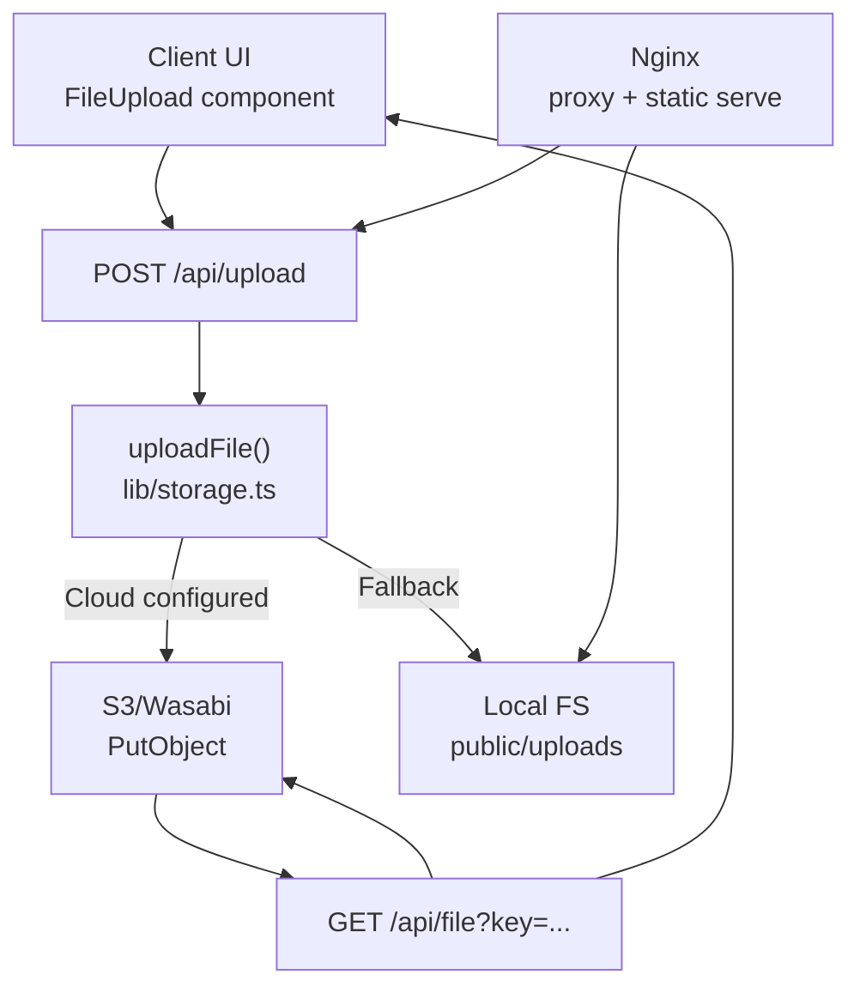
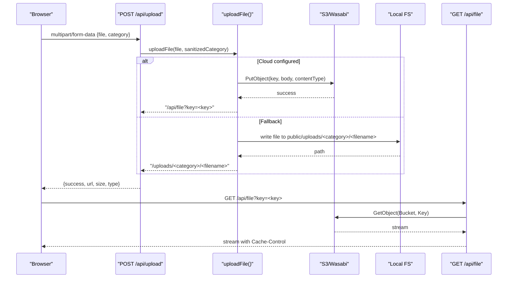
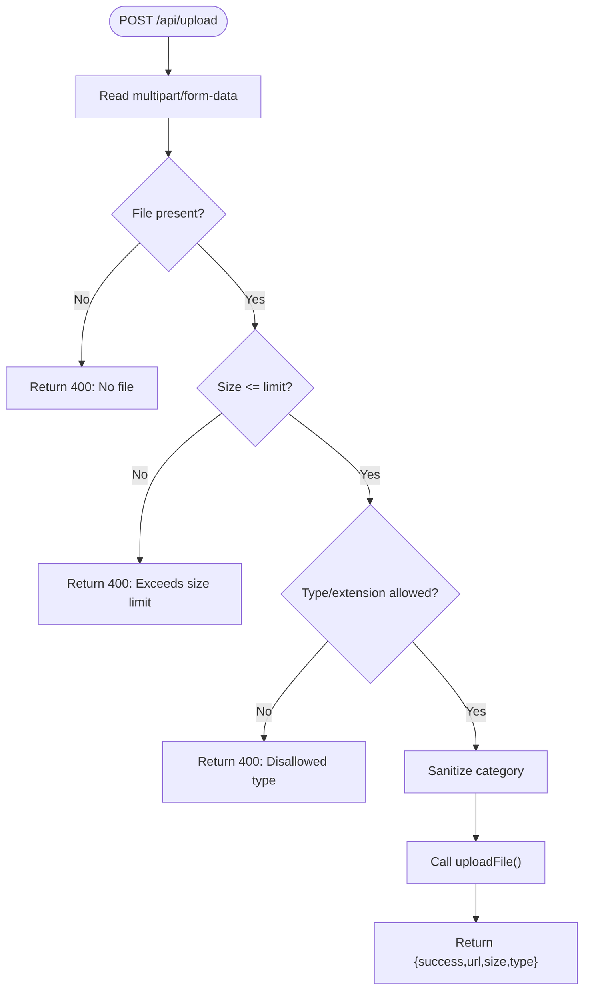
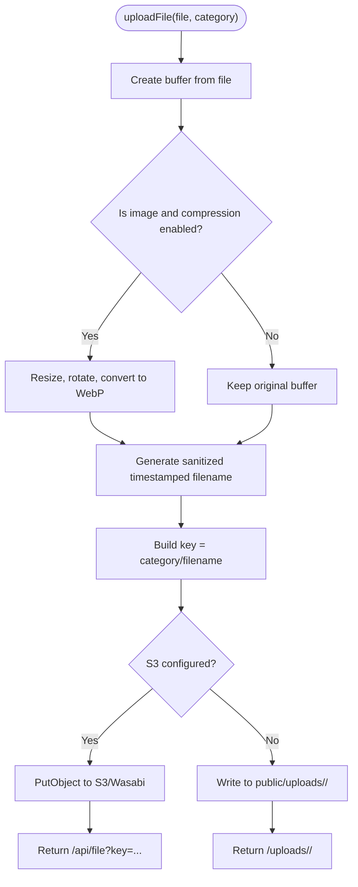
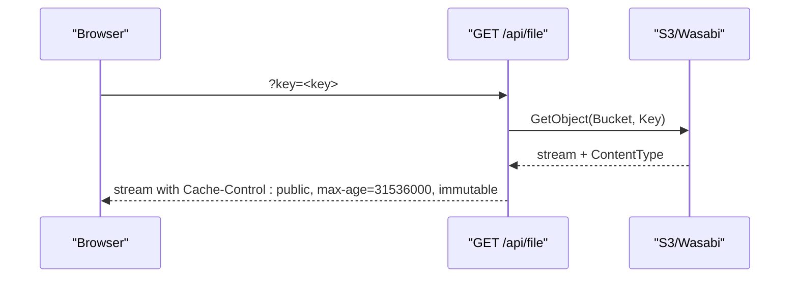
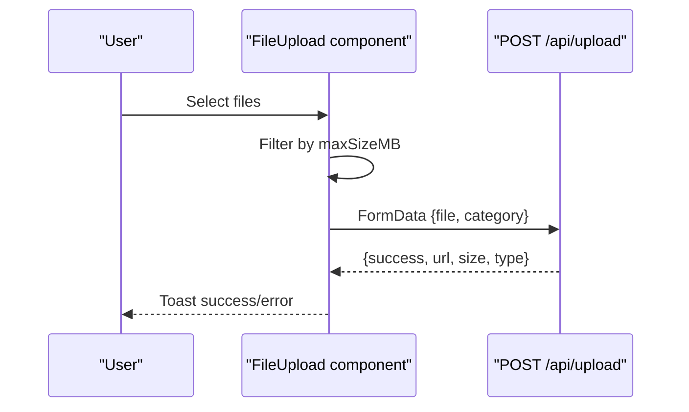
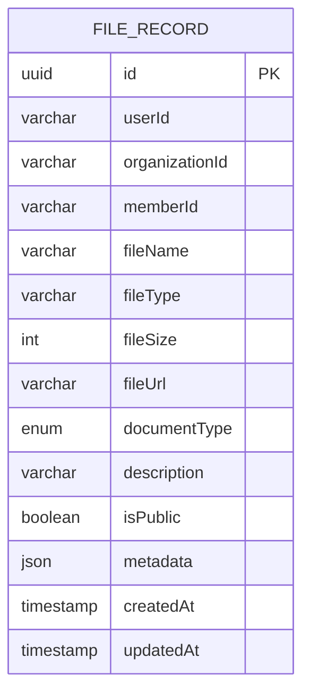
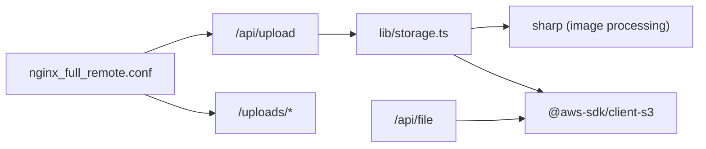

# File & Media APIs

<cite>
**Referenced Files in This Document**
- [route.ts](file://app/api/upload/route.ts)
- [route.ts](file://app/api/file/route.ts)
- [storage.ts](file://lib/storage.ts)
- [file-upload.tsx](file://components/ui/file-upload.tsx)
- [schema.ts](file://lib/db/schema.ts)
- [nginx_full_remote.conf](file://nginx_full_remote.conf)
- [update_nginx.sh](file://update_nginx.sh)
- [sw.ts](file://app/sw.ts)
</cite>

## Table of Contents
1. [Introduction](#introduction)
2. [Project Structure](#project-structure)
3. [Core Components](#core-components)
4. [Architecture Overview](#architecture-overview)
5. [Detailed Component Analysis](#detailed-component-analysis)
6. [Dependency Analysis](#dependency-analysis)
7. [Performance Considerations](#performance-considerations)
8. [Troubleshooting Guide](#troubleshooting-guide)
9. [Conclusion](#conclusion)
10. [Appendices](#appendices)

## Introduction
This document provides comprehensive API documentation for file upload and media management endpoints in the project. It covers:
- Uploading files with validation, size limits, and category handling
- Processing images (compression and format conversion)
- Retrieving stored files via a secure proxy endpoint
- Cloud storage integration patterns (AWS S3/Wasabi) and local fallback
- Caching headers and CDN considerations
- Metadata and organizational structure for media assets
- Security considerations around file type validation and access control
- Performance techniques for large uploads and bandwidth optimization

## Project Structure
The file and media functionality is implemented across server routes, a shared storage utility, and a reusable client-side upload component. The key pieces are:
- Upload endpoint: handles multipart form data, validates inputs, and delegates to storage
- Storage utility: compresses images, chooses cloud or local storage, and returns URLs
- File retrieval endpoint: streams content from cloud storage with caching headers
- Client upload component: builds FormData, sets categories, and reports progress/errors
- Nginx configuration: proxies requests and serves static uploads with cache headers
- Service worker: runtime caching strategy for app assets

**Diagram sources**
- [route.ts:4-65](file://app/api/upload/route.ts#L4-L65)
- [storage.ts:25-99](file://lib/storage.ts#L25-L99)
- [route.ts:22-60](file://app/api/file/route.ts#L22-L60)
- [file-upload.tsx:22-142](file://components/ui/file-upload.tsx#L22-L142)
- [nginx_full_remote.conf:27-49](file://nginx_full_remote.conf#L27-L49)

**Section sources**
- [route.ts:4-65](file://app/api/upload/route.ts#L4-L65)
- [storage.ts:25-99](file://lib/storage.ts#L25-L99)
- [route.ts:22-60](file://app/api/file/route.ts#L22-L60)
- [file-upload.tsx:22-142](file://components/ui/file-upload.tsx#L22-L142)
- [nginx_full_remote.conf:27-49](file://nginx_full_remote.conf#L27-L49)

## Core Components
- Upload API: Accepts multipart/form-data with a file and optional category; enforces size and type restrictions; sanitizes category; calls storage utility; returns URL, size, and type.
- Storage Utility: Compresses images (resize, EXIF rotation, WebP conversion), generates unique filenames, writes to cloud or local storage, and returns a stable URL.
- File Retrieval API: Streams files from cloud storage with appropriate Content-Type and long-lived cache headers.
- Client Upload Component: Builds FormData, auto-detects category based on MIME type, supports single/multiple uploads, and surfaces errors via toast notifications.

**Section sources**
- [route.ts:4-65](file://app/api/upload/route.ts#L4-L65)
- [storage.ts:25-99](file://lib/storage.ts#L25-L99)
- [route.ts:22-60](file://app/api/file/route.ts#L22-L60)
- [file-upload.tsx:22-142](file://components/ui/file-upload.tsx#L22-L142)

## Architecture Overview
The system uses a Next.js API route layer to handle uploads and retrieval, a shared storage abstraction that supports both cloud (S3/Wasabi) and local filesystem backends, and a client component for user interactions. Images are optimized on upload to reduce bandwidth and storage costs. Retrieval goes through a proxy endpoint that streams content from the backend storage with caching headers suitable for CDNs.

**Diagram sources**
- [route.ts:4-65](file://app/api/upload/route.ts#L4-L65)
- [storage.ts:25-99](file://lib/storage.ts#L25-L99)
- [route.ts:22-60](file://app/api/file/route.ts#L22-L60)

## Detailed Component Analysis

### Upload Endpoint: POST /api/upload
- Purpose: Accept uploaded files, validate size and type, sanitize category, and persist via storage utility.
- Inputs:
  - file: binary file from multipart/form-data
  - category: string (default "others"; sanitized to allow safe subdirectories)
- Validation:
  - Size limit enforced (e.g., 50MB)
  - Allowed MIME types include images, audio, video, PDF, text, office documents, archives
  - Allowed extensions checked as a secondary safeguard
- Behavior:
  - Sanitizes category to prevent directory traversal while allowing slashes for subfolders
  - Delegates to storage utility which may compress images and choose backend
  - Returns JSON with success flag, URL, size, and type
- Error handling:
  - Returns 400 for invalid input or size/type violations
  - Returns 500 on unexpected server errors

**Diagram sources**
- [route.ts:4-65](file://app/api/upload/route.ts#L4-L65)

**Section sources**
- [route.ts:4-65](file://app/api/upload/route.ts#L4-L65)

### Storage Utility: uploadFile(file, category)
- Purpose: Normalize and optimize files, then store them either to cloud storage (S3/Wasabi) or local filesystem.
- Image processing:
  - If image and compression not skipped, resizes to max 1920x1080 without enlargement, rotates by EXIF, converts to WebP at quality 80
  - Updates final content type and extension accordingly
- Naming and keys:
  - Generates timestamped filename with sanitized base name
  - Constructs key as category/filename
- Backend selection:
  - If S3 credentials and bucket are configured, uploads to cloud and returns a proxy URL (/api/file?key=...)
  - Otherwise, writes to local directory public/uploads/<category>/ and returns a relative path
- Error handling:
  - Logs and throws on cloud upload failures
  - Gracefully falls back to local storage if cloud is unavailable

**Diagram sources**
- [storage.ts:25-99](file://lib/storage.ts#L25-L99)

**Section sources**
- [storage.ts:25-99](file://lib/storage.ts#L25-L99)

### File Retrieval Endpoint: GET /api/file
- Purpose: Stream stored files securely from cloud storage with proper headers.
- Parameters:
  - key: object key in storage (e.g., category/filename)
- Behavior:
  - Validates presence of key and storage configuration
  - Retrieves object from S3/Wasabi and streams it to the client
  - Sets Content-Type from source metadata and long-lived immutable cache header
- Error handling:
  - Returns 400 if key missing
  - Returns 500 if storage not configured
  - Returns 404 if file not found
  - Returns 500 on internal errors

**Diagram sources**
- [route.ts:22-60](file://app/api/file/route.ts#L22-L60)

**Section sources**
- [route.ts:22-60](file://app/api/file/route.ts#L22-L60)

### Client Upload Component: FileUpload
- Purpose: Reusable React component to trigger uploads, build FormData, set categories, and handle feedback.
- Features:
  - Supports single and multiple file uploads
  - Auto-detects category based on MIME type (images, audio, video, documents)
  - Enforces client-side size limit and shows toast messages
  - Sends POST to configurable endpoint (default /api/upload)
  - Handles errors and resets input after completion
- Integration:
  - Uses fetch to send multipart/form-data
  - On success, invokes callbacks with returned URLs and original files

**Diagram sources**
- [file-upload.tsx:22-142](file://components/ui/file-upload.tsx#L22-L142)
- [route.ts:4-65](file://app/api/upload/route.ts#L4-L65)

**Section sources**
- [file-upload.tsx:22-142](file://components/ui/file-upload.tsx#L22-L142)

### Data Model and Metadata
- The application includes a database schema for tracking uploaded files with fields such as fileName, fileType, fileSize, fileUrl, documentType, description, isPublic, and metadata. This enables tagging and organization of media assets beyond the raw storage key.

**Diagram sources**
- [schema.ts:398-409](file://lib/db/schema.ts#L398-L409)

**Section sources**
- [schema.ts:398-409](file://lib/db/schema.ts#L398-L409)

## Dependency Analysis
- Upload route depends on storage utility for persistence and processing.
- Storage utility depends on environment variables for cloud configuration and uses sharp for image optimization.
- File retrieval route directly interacts with S3/Wasabi using AWS SDK.
- Nginx config proxies requests to the Node process and can serve static uploads with caching headers.
- Service worker provides runtime caching for app assets, not directly for uploaded media.

**Diagram sources**
- [route.ts:4-65](file://app/api/upload/route.ts#L4-L65)
- [storage.ts:25-99](file://lib/storage.ts#L25-L99)
- [route.ts:22-60](file://app/api/file/route.ts#L22-L60)
- [nginx_full_remote.conf:27-49](file://nginx_full_remote.conf#L27-L49)

**Section sources**
- [route.ts:4-65](file://app/api/upload/route.ts#L4-L65)
- [storage.ts:25-99](file://lib/storage.ts#L25-L99)
- [route.ts:22-60](file://app/api/file/route.ts#L22-L60)
- [nginx_full_remote.conf:27-49](file://nginx_full_remote.conf#L27-L49)

## Performance Considerations
- Image optimization:
  - Automatic resize to 1920x1080, EXIF rotation, and conversion to WebP reduces bandwidth and storage usage.
  - Compression can be disabled via an environment variable when needed.
- Caching:
  - File retrieval endpoint sets long-lived immutable cache headers suitable for CDNs.
  - Nginx can serve static uploads with expires and immutable headers to offload origin traffic.
- Bandwidth management:
  - Enforce size limits at the API level to avoid large payloads.
  - Use streaming responses for retrieval to minimize memory usage.
- CDN integration:
  - Configure CDN to cache immutable assets served by the file retrieval endpoint or static uploads.
  - Ensure correct Content-Type headers propagate through the CDN.

[No sources needed since this section provides general guidance]

## Troubleshooting Guide
- Upload fails with 400:
  - Missing file field in multipart/form-data
  - File exceeds size limit
  - Disallowed MIME type or extension
- Upload fails with 500:
  - Unexpected error during upload or storage operations
- File retrieval returns 400:
  - Missing key parameter
- File retrieval returns 500:
  - S3/Wasabi not configured (credentials or bucket missing)
- File retrieval returns 404:
  - Object key does not exist in storage
- Local fallback issues:
  - Ensure public/uploads directory exists and is writable
  - Verify Nginx alias/proxy for /uploads paths

**Section sources**
- [route.ts:4-65](file://app/api/upload/route.ts#L4-L65)
- [route.ts:22-60](file://app/api/file/route.ts#L22-L60)
- [nginx_full_remote.conf:27-49](file://nginx_full_remote.conf#L27-L49)

## Conclusion
The file and media APIs provide a robust pipeline for uploading, optimizing, storing, and retrieving files with support for cloud backends and local fallbacks. Image compression and caching headers improve performance, while validation and sanitization enhance security. For advanced needs like virus scanning, fine-grained access control, and chunked uploads, consider extending the current endpoints with additional middleware and services.

[No sources needed since this section summarizes without analyzing specific files]

## Appendices

### API Reference Summary
- POST /api/upload
  - Request: multipart/form-data with file and optional category
  - Response: JSON { success, url, size, type }
  - Errors: 400 (validation), 500 (server error)
- GET /api/file?key=<key>
  - Response: Streamed file with Content-Type and Cache-Control headers
  - Errors: 400 (missing key), 404 (not found), 500 (config/internal error)

**Section sources**
- [route.ts:4-65](file://app/api/upload/route.ts#L4-L65)
- [route.ts:22-60](file://app/api/file/route.ts#L22-L60)

### Environment Variables
- WASABI_REGION or AWS_REGION
- WASABI_BUCKET_NAME or AWS_BUCKET_NAME
- WASABI_ACCESS_KEY_ID or AWS_ACCESS_KEY_ID
- WASABI_SECRET_ACCESS_KEY or AWS_SECRET_ACCESS_KEY
- WASABI_ENDPOINT or AWS_ENDPOINT
- SKIP_IMAGE_COMPRESSION (optional)

**Section sources**
- [storage.ts:6-23](file://lib/storage.ts#L6-L23)
- [route.ts:4-20](file://app/api/file/route.ts#L4-L20)

### Nginx Configuration Notes
- Proxy pass to the Node process for API routes
- Optional static serving for /uploads with cache headers
- Ensure client_max_body_size accommodates large uploads

**Section sources**
- [nginx_full_remote.conf:27-49](file://nginx_full_remote.conf#L27-L49)
- [update_nginx.sh:1-35](file://update_nginx.sh#L1-L35)