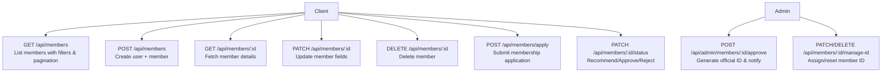
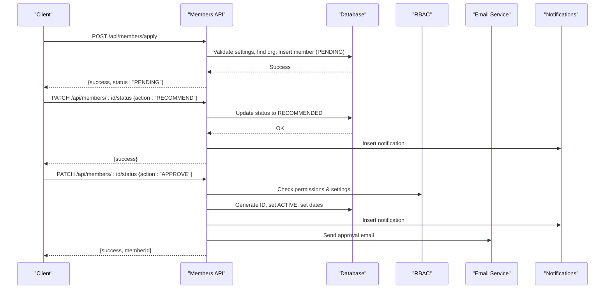
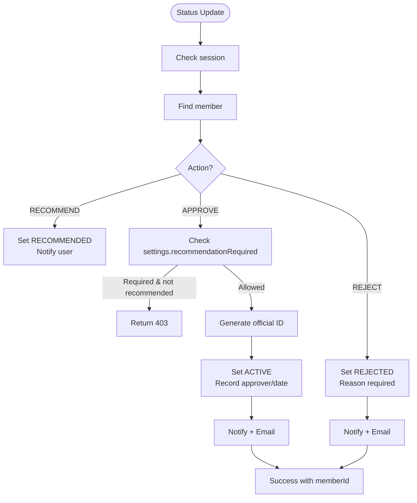
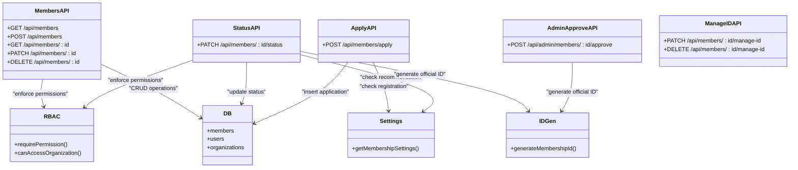

# Member Management APIs

<cite>
**Referenced Files in This Document**
- [members route](file://app/api/members/route.ts)
- [member by id route](file://app/api/members/[id]/route.ts)
- [apply membership route](file://app/api/members/apply/route.ts)
- [status management route](file://app/api/members/[id]/status/route.ts)
- [admin approve route](file://app/api/admin/members/[id]/approve/route.ts)
- [manage member ID route](file://app/api/members/[id]/manage-id/route.ts)
- [RBAC v2 module](file://lib/rbac-v2.ts)
- [database schema](file://lib/db/schema.ts)
- [membership ID generator](file://lib/id-generator.ts)
- [membership settings actions](file://lib/actions/settings.ts)
- [membership ID action](file://lib/actions/membership-id.ts)
</cite>

## Table of Contents
1. [Introduction](#introduction)
2. [Project Structure](#project-structure)
3. [Core Components](#core-components)
4. [Architecture Overview](#architecture-overview)
5. [Detailed Component Analysis](#detailed-component-analysis)
6. [Dependency Analysis](#dependency-analysis)
7. [Performance Considerations](#performance-considerations)
8. [Troubleshooting Guide](#troubleshooting-guide)
9. [Conclusion](#conclusion)

## Introduction
This document provides detailed API documentation for member management endpoints under /api/members/* and related admin approval endpoints. It covers CRUD operations, status management, application processing, verification workflows, and permission requirements. It also outlines data models, validation rules, error handling patterns, and examples for search, filtering, and pagination. Where bulk operations are not exposed via dedicated REST endpoints, this document describes the available patterns and limitations based on the codebase.

## Project Structure
Member-related API routes are implemented as Next.js Server Routes:
- List and create members: app/api/members/route.ts
- Get, update, delete a member: app/api/members/[id]/route.ts
- Submit membership application: app/api/members/apply/route.ts
- Update member status (recommend/approve/reject): app/api/members/[id]/status/route.ts
- Admin approve endpoint: app/api/admin/members/[id]/approve/route.ts
- Manage member ID (assign/reset): app/api/members/[id]/manage-id/route.ts

**Diagram sources**
- [members route:11-76](file://app/api/members/route.ts#L11-L76)
- [members route:78-201](file://app/api/members/route.ts#L78-L201)
- [member by id route:9-49](file://app/api/members/[id]/route.ts#L9-L49)
- [member by id route:52-98](file://app/api/members/[id]/route.ts#L52-L98)
- [member by id route:100-132](file://app/api/members/[id]/route.ts#L100-L132)
- [apply membership route:48-203](file://app/api/members/apply/route.ts#L48-L203)
- [status management route:11-183](file://app/api/members/[id]/status/route.ts#L11-L183)
- [admin approve route:11-84](file://app/api/admin/members/[id]/approve/route.ts#L11-L84)
- [manage member ID route:8-45](file://app/api/members/[id]/manage-id/route.ts#L8-L45)

**Section sources**
- [members route:11-201](file://app/api/members/route.ts#L11-L201)
- [member by id route:9-132](file://app/api/members/[id]/route.ts#L9-L132)
- [apply membership route:48-203](file://app/api/members/apply/route.ts#L48-L203)
- [status management route:11-183](file://app/api/members/[id]/status/route.ts#L11-L183)
- [admin approve route:11-84](file://app/api/admin/members/[id]/approve/route.ts#L11-L84)
- [manage member ID route:8-45](file://app/api/members/[id]/manage-id/route.ts#L8-L45)

## Core Components
- Authentication and authorization: Session-based checks and RBAC enforcement using requirePermission and jurisdictional access controls.
- Data model: Members table with status, membership type, dates, metadata, and relations to users and organizations.
- Validation: Zod schema for membership applications; server-side checks for duplicates and configuration flags.
- Workflows: Application submission, recommendation, approval, rejection, and ID generation with notifications and emails.

Key responsibilities:
- GET /api/members: list with organization scoping, status filter, pagination.
- POST /api/members: create user and member in a transaction, generate member ID, audit log.
- GET/PATCH/DELETE /api/members/:id: read, update, delete with audit logging.
- POST /api/members/apply: validate application, check registration enabled, assign organization, persist with PENDING status.
- PATCH /api/members/:id/status: recommend, approve (with optional recommendation requirement), reject; send notifications and emails.
- POST /api/admin/members/:id/approve: legacy admin approve flow that generates ID and notifies.
- PATCH/DELETE /api/members/:id/manage-id: assign or reset member ID with uniqueness checks.

**Section sources**
- [RBAC v2 module:141-165](file://lib/rbac-v2.ts#L141-L165)
- [RBAC v2 module:313-337](file://lib/rbac-v2.ts#L313-L337)
- [database schema:247-256](file://lib/db/schema.ts#L247-L256)
- [apply membership route:11-46](file://app/api/members/apply/route.ts#L11-L46)
- [status management route:75-135](file://app/api/members/[id]/status/route.ts#L75-L135)

## Architecture Overview
The member management system enforces role-based access control and jurisdiction-scoped permissions. Applications can be submitted publicly when enabled, then reviewed through a multi-step workflow (PENDING → RECOMMENDED → ACTIVE or REJECTED). Approval may require a recommendation depending on system settings. Notifications and emails are sent upon key lifecycle events.

**Diagram sources**
- [apply membership route:48-203](file://app/api/members/apply/route.ts#L48-L203)
- [status management route:49-135](file://app/api/members/[id]/status/route.ts#L49-L135)
- [RBAC v2 module:313-337](file://lib/rbac-v2.ts#L313-L337)

## Detailed Component Analysis

### List Members
- Endpoint: GET /api/members
- Purpose: Retrieve paginated list of members with optional organization and status filters.
- Authorization: Requires members:read permission; organization scoping enforced via canAccessOrganization.
- Query parameters:
  - organizationId: Filter by organization (requires access).
  - status: Filter by member status enum.
  - page: Page number (default 1).
  - limit: Items per page (default 20).
- Response:
  - members: Array of member objects including nested user and organization summaries.
  - pagination: { page, limit, total, totalPages }.
- Error handling: Returns 403 if forbidden; 500 on server errors.

Example usage pattern:
- Fetch members for current session’s organization with default pagination.
- Filter by status "PENDING" for review queues.
- Paginate through results using page and limit.

**Section sources**
- [members route:11-76](file://app/api/members/route.ts#L11-L76)
- [RBAC v2 module:170-213](file://lib/rbac-v2.ts#L170-L213)

### Create Member
- Endpoint: POST /api/members
- Purpose: Create a new user and member record within a transaction.
- Authorization: Requires members:create permission and valid organization access.
- Request body fields:
  - email, password, name, phone (required)
  - organizationId (optional; defaults to session organization)
  - membershipType (optional; default REGULAR)
  - dateOfBirth, gender, occupation, address (optional)
- Business logic:
  - Checks duplicate email.
  - Hashes password.
  - Generates unique member ID based on organization code and count.
  - Inserts user and member in a transaction; returns created member with relations.
  - Creates audit log entry.
- Response: 201 with member object.
- Errors: 400 for existing user; 404 if organization missing; 403 if forbidden; 500 on failure.

**Section sources**
- [members route:78-201](file://app/api/members/route.ts#L78-L201)

### Get Member
- Endpoint: GET /api/members/:id
- Purpose: Retrieve full member details including recent payments and documents.
- Authorization: Requires members:read permission.
- Response: Member object with nested user, organization, payments (limited), documents (limited).
- Errors: 404 if not found; 500 on server errors.

**Section sources**
- [member by id route:9-49](file://app/api/members/[id]/route.ts#L9-L49)

### Update Member
- Endpoint: PATCH /api/members/:id
- Purpose: Update member profile fields and optionally change status or membership type.
- Authorization: Requires members:update permission.
- Request body: Partial member fields; supports status and membershipType updates.
- Behavior: Updates timestamp; logs audit event; returns updated member.
- Errors: 404 if not found after update; 500 on server errors.

**Section sources**
- [member by id route:52-98](file://app/api/members/[id]/route.ts#L52-L98)

### Delete Member
- Endpoint: DELETE /api/members/:id
- Purpose: Remove a member record.
- Authorization: Requires members:delete permission.
- Behavior: Deletes member; logs audit event.
- Errors: 404 if not found; 500 on server errors.

**Section sources**
- [member by id route:100-132](file://app/api/members/[id]/route.ts#L100-L132)

### Membership Application
- Endpoint: POST /api/members/apply
- Purpose: Submit a membership application for a logged-in user.
- Authorization: Requires authenticated session.
- Validation: Uses Zod schema for extensive personal and demographic fields.
- Business logic:
  - Checks if public registration is enabled via membership settings.
  - Ensures user has no existing application.
  - Resolves target organization by branch/LGA/state hierarchy with fallbacks.
  - Persists application with status PENDING and rich metadata.
- Response: { success: true, status: "PENDING", message }.
- Errors: 401 unauthorized; 403 registration closed; 400 duplicate application; 500 configuration errors.

**Section sources**
- [apply membership route:11-46](file://app/api/members/apply/route.ts#L11-L46)
- [apply membership route:48-203](file://app/api/members/apply/route.ts#L48-L203)
- [membership settings actions:110-143](file://lib/actions/settings.ts#L110-L143)

### Status Management (Recommend/Approve/Reject)
- Endpoint: PATCH /api/members/:id/status
- Purpose: Change application status through workflow actions.
- Authorization: Session required; detailed checks per action.
- Actions:
  - RECOMMEND: Sets status to RECOMMENDED; records recommender and timestamp; notifies user.
  - APPROVE: Validates recommendation requirement via settings; generates official membership ID; sets ACTIVE; records approver and date; notifies and emails user.
  - REJECT: Requires reason; sets status REJECTED; notifies and emails user.
- Response: Success messages with optional memberId on approval.
- Errors: 400 invalid action or missing reason; 403 bypass restrictions; 404 member not found; 500 server errors.

**Diagram sources**
- [status management route:11-183](file://app/api/members/[id]/status/route.ts#L11-L183)
- [membership settings actions:110-143](file://lib/actions/settings.ts#L110-L143)

**Section sources**
- [status management route:11-183](file://app/api/members/[id]/status/route.ts#L11-L183)

### Admin Approve Endpoint
- Endpoint: POST /api/admin/members/:id/approve
- Purpose: Legacy admin approval flow that generates an official membership ID and sends notifications/email.
- Authorization: Requires admin/super-admin role (session-based check).
- Behavior: Generates ID via membership ID action; inserts notification; sends approval email.
- Response: { success: true, memberId, message }.
- Errors: 401 unauthorized; 500 server errors.

**Section sources**
- [admin approve route:11-84](file://app/api/admin/members/[id]/approve/route.ts#L11-L84)
- [membership ID action:1-40](file://lib/actions/membership-id.ts#L1-L40)

### Manage Member ID
- Endpoint: PATCH /api/members/:id/manage-id
- Purpose: Assign a custom member ID to a member.
- Authorization: Requires admin role.
- Validation: Ensures uniqueness across members.
- Response: { success: true, message }.
- Errors: 400 missing ID; 409 conflict; 500 server errors.

- Endpoint: DELETE /api/members/:id/manage-id
- Purpose: Reset member ID to a temporary value.
- Authorization: Requires admin role.
- Behavior: Replaces ID with a temporary format to satisfy uniqueness constraints.
- Response: { success: true, message }.
- Errors: 500 server errors.

**Section sources**
- [manage member ID route:8-45](file://app/api/members/[id]/manage-id/route.ts#L8-L45)
- [manage member ID route:47-75](file://app/api/members/[id]/manage-id/route.ts#L47-L75)

## Dependency Analysis
- RBAC integration: All endpoints enforce session checks and permission requirements. Jurisdiction-based access ensures users can only operate within permitted organizations.
- Database schema: Members table defines core fields and enums for status and membership types. Relations to users and organizations provide context.
- ID generation: Official IDs follow a structured format derived from country/state codes and sequential numbering.
- Settings: Membership registration and recommendation requirements are configurable via system settings.

**Diagram sources**
- [members route:11-201](file://app/api/members/route.ts#L11-L201)
- [status management route:11-183](file://app/api/members/[id]/status/route.ts#L11-L183)
- [apply membership route:48-203](file://app/api/members/apply/route.ts#L48-L203)
- [admin approve route:11-84](file://app/api/admin/members/[id]/approve/route.ts#L11-L84)
- [manage member ID route:8-45](file://app/api/members/[id]/manage-id/route.ts#L8-L45)
- [RBAC v2 module:141-165](file://lib/rbac-v2.ts#L141-L165)
- [membership settings actions:110-143](file://lib/actions/settings.ts#L110-L143)
- [membership ID generator:12-39](file://lib/id-generator.ts#L12-L39)

**Section sources**
- [RBAC v2 module:141-165](file://lib/rbac-v2.ts#L141-L165)
- [database schema:247-256](file://lib/db/schema.ts#L247-L256)
- [membership ID generator:12-39](file://lib/id-generator.ts#L12-L39)
- [membership settings actions:110-143](file://lib/actions/settings.ts#L110-L143)

## Performance Considerations
- Pagination: Use page and limit query parameters to avoid large payloads. The list endpoint returns total counts for efficient UI pagination.
- Selective joins: Endpoints fetch only necessary relations (e.g., limited payments/documents) to reduce overhead.
- Bulk operations: No dedicated bulk import/export endpoints exist for members in the API layer. Export functionality is implemented in dashboard pages via direct database queries; consider exposing similar endpoints if needed.
- Indexing: Ensure indexes on frequently filtered columns (organizationId, status, createdAt) to optimize list and filter performance.

[No sources needed since this section provides general guidance]

## Troubleshooting Guide
Common issues and recovery strategies:
- Unauthorized: Missing or invalid session. Ensure authentication headers and session validity.
- Forbidden: Insufficient permissions or organization access. Verify RBAC roles and jurisdiction alignment.
- Duplicate email: Creating a member with an existing email. Use a different email or update existing user.
- Registration closed: Public membership registration disabled. Enable via system settings or contact admin.
- Recommendation required: Approving without prior recommendation when configured. Recommend first or adjust settings.
- Missing reason: Rejecting without providing a reason. Include reason in request body.
- ID conflicts: Assigning a non-unique member ID. Choose a unique ID or let system generate one.

Error response patterns:
- 400: Validation errors or business rule violations (e.g., missing fields, duplicate entries).
- 401: Unauthorized due to missing session.
- 403: Forbidden due to insufficient permissions or configuration restrictions.
- 404: Resource not found.
- 409: Conflict (e.g., duplicate member ID).
- 500: Internal server errors; check logs for stack traces.

**Section sources**
- [members route:73-76](file://app/api/members/route.ts#L73-L76)
- [member by id route:47-49](file://app/api/members/[id]/route.ts#L47-L49)
- [apply membership route:203-221](file://app/api/members/apply/route.ts#L203-L221)
- [status management route:176-183](file://app/api/members/[id]/status/route.ts#L176-L183)
- [admin approve route:77-84](file://app/api/admin/members/[id]/approve/route.ts#L77-L84)
- [manage member ID route:39-45](file://app/api/members/[id]/manage-id/route.ts#L39-L45)

## Conclusion
The member management APIs provide comprehensive support for creating, reading, updating, and deleting members, along with robust application processing and status workflows. Permissions and jurisdictional controls ensure secure access, while configurable settings allow flexible operational policies. For bulk operations, current implementations rely on dashboard-level exports; extending the API with dedicated bulk endpoints would improve scalability and automation.

[No sources needed since this section summarizes without analyzing specific files]