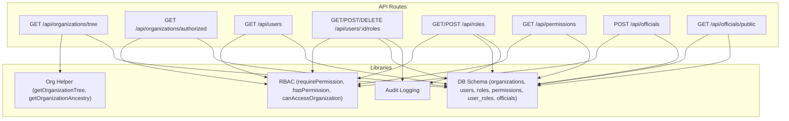
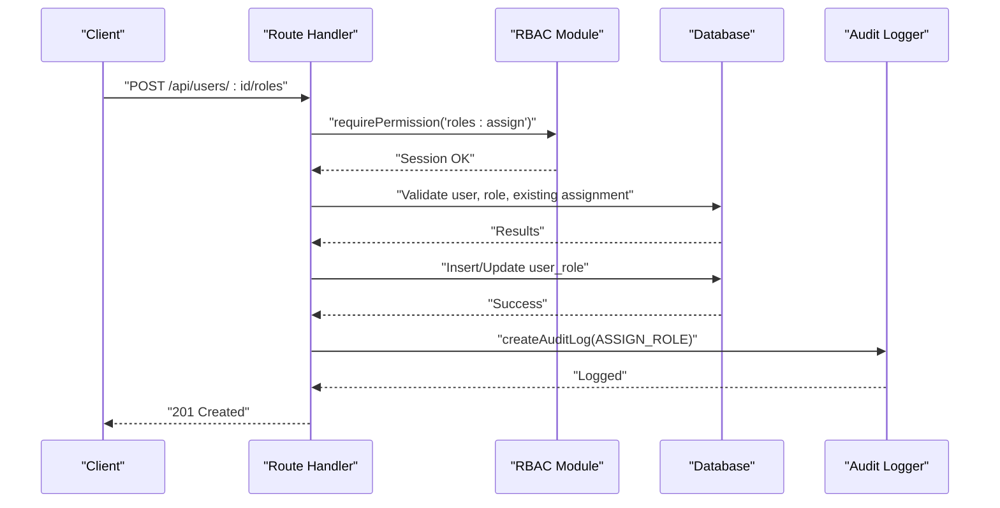
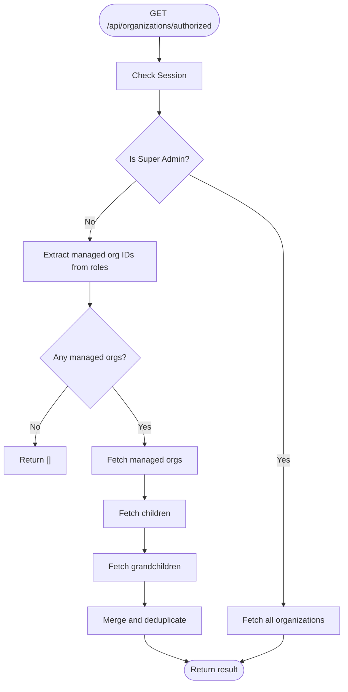
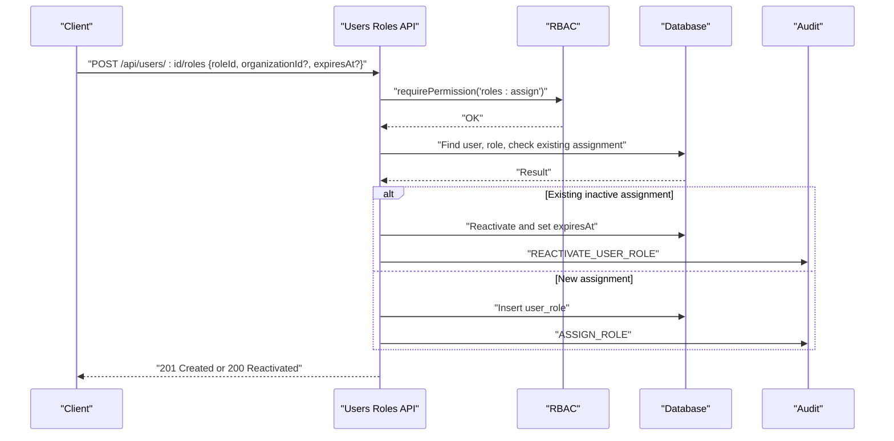
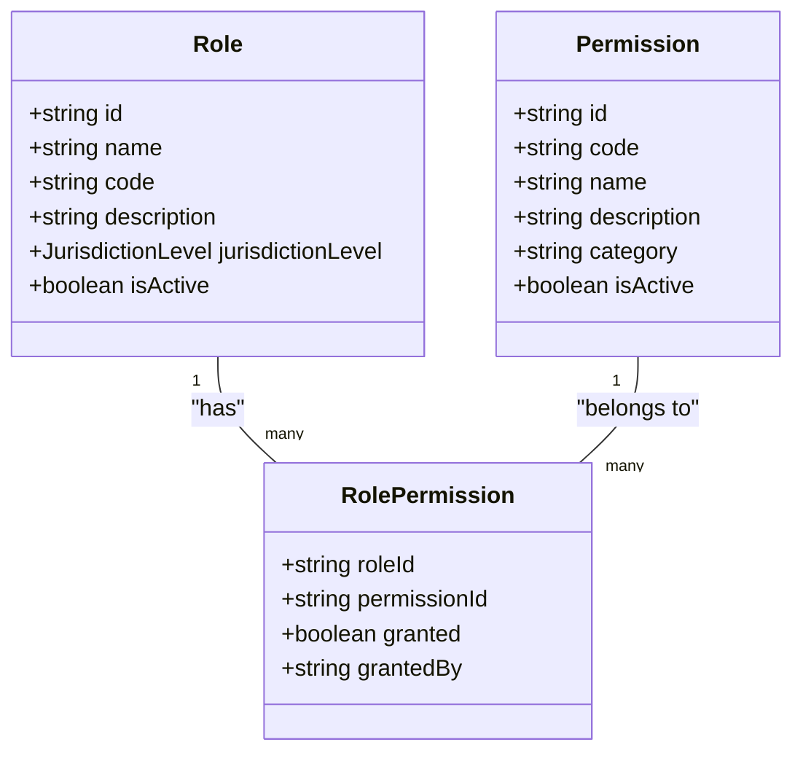
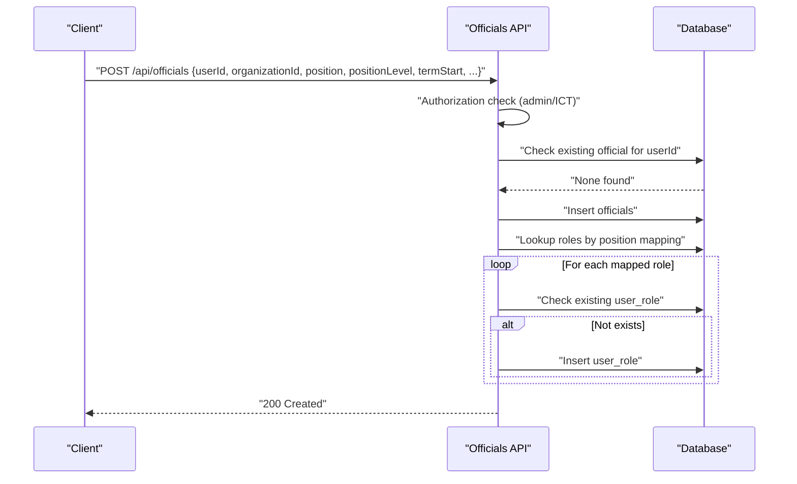
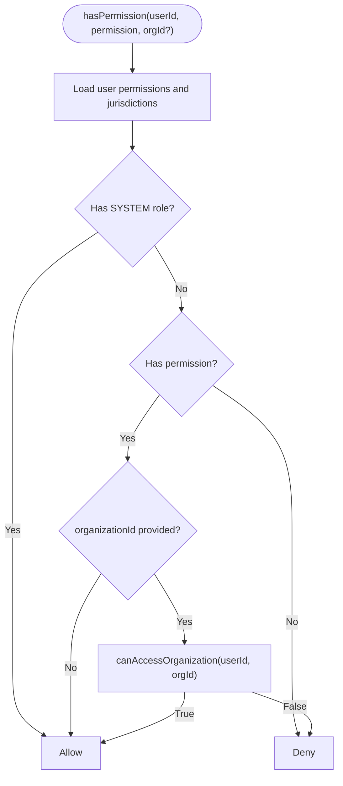
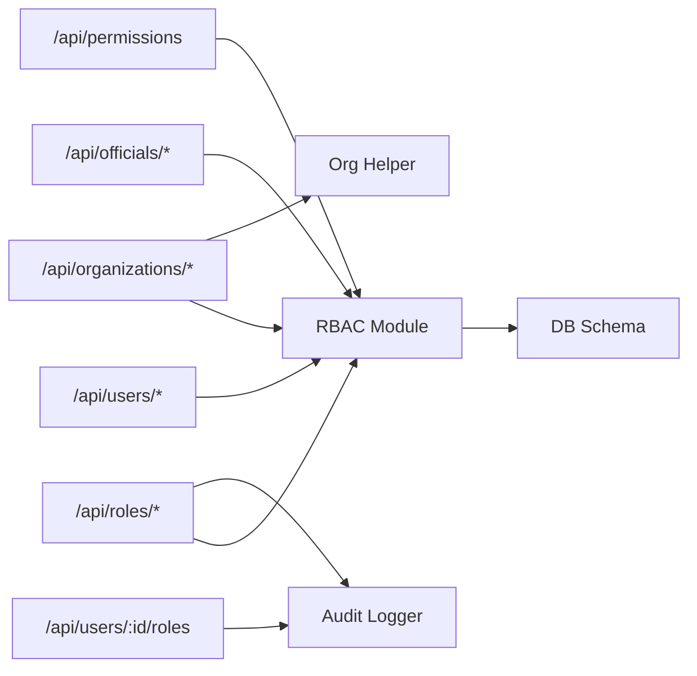

# Organization & User APIs

<cite>
**Referenced Files in This Document**
- [route.ts](file://app/api/organizations/tree/route.ts)
- [route.ts](file://app/api/organizations/authorized/route.ts)
- [route.ts](file://app/api/users/route.ts)
- [route.ts](file://app/api/users/[id]/roles/route.ts)
- [route.ts](file://app/api/roles/route.ts)
- [route.ts](file://app/api/permissions/route.ts)
- [route.ts](file://app/api/officials/route.ts)
- [route.ts](file://app/api/officials/public/route.ts)
- [rbac-v2.ts](file://lib/rbac-v2.ts)
- [org-helper.ts](file://lib/org-helper.ts)
- [schema.ts](file://lib/db/schema.ts)
- [audit.ts](file://lib/audit.ts)
</cite>

## Table of Contents
1. Introduction
2. Project Structure
3. Core Components
4. Architecture Overview
5. Detailed Component Analysis
6. Dependency Analysis
7. Performance Considerations
8. Troubleshooting Guide
9. Conclusion

## Introduction
This document provides comprehensive API documentation for organization and user management endpoints with a focus on:
- Hierarchical organization structures and jurisdiction-aware access control
- User administration, role assignment, and permission management
- Official appointment APIs to assign officials to positions within organizations
- RBAC system APIs for roles, permissions, and enforcement
- Multi-tenancy considerations, data isolation across organizations, and cross-jurisdiction operations
- Security implications and audit logging requirements

The APIs are implemented as Next.js Route Handlers backed by Drizzle ORM and a centralized RBAC module that enforces permissions and jurisdictional boundaries.

## Project Structure
The relevant endpoints are organized under app/api and use server-side session handling and RBAC checks. Supporting libraries include RBAC logic, organization tree utilities, and audit logging.

**Diagram sources**
- [route.ts:1-19](file://app/api/organizations/tree/route.ts#L1-L19)
- [route.ts:1-67](file://app/api/organizations/authorized/route.ts#L1-L67)
- [route.ts:1-57](file://app/api/users/route.ts#L1-L57)
- [route.ts:1-208](file://app/api/users/[id]/roles/route.ts#L1-L208)
- [route.ts:1-120](file://app/api/roles/route.ts#L1-L120)
- [route.ts:1-42](file://app/api/permissions/route.ts#L1-L42)
- [route.ts:1-122](file://app/api/officials/route.ts#L1-L122)
- [route.ts:1-47](file://app/api/officials/public/route.ts#L1-L47)
- [rbac-v2.ts:1-361](file://lib/rbac-v2.ts#L1-L361)
- [org-helper.ts:1-118](file://lib/org-helper.ts#L1-L118)
- [schema.ts:148-350](file://lib/db/schema.ts#L148-L350)
- [audit.ts:1-74](file://lib/audit.ts#L1-L74)

**Section sources**
- [route.ts:1-19](file://app/api/organizations/tree/route.ts#L1-L19)
- [route.ts:1-67](file://app/api/organizations/authorized/route.ts#L1-L67)
- [route.ts:1-57](file://app/api/users/route.ts#L1-L57)
- [route.ts:1-208](file://app/api/users/[id]/roles/route.ts#L1-L208)
- [route.ts:1-120](file://app/api/roles/route.ts#L1-L120)
- [route.ts:1-42](file://app/api/permissions/route.ts#L1-L42)
- [route.ts:1-122](file://app/api/officials/route.ts#L1-L122)
- [route.ts:1-47](file://app/api/officials/public/route.ts#L1-L47)
- [rbac-v2.ts:1-361](file://lib/rbac-v2.ts#L1-L361)
- [org-helper.ts:1-118](file://lib/org-helper.ts#L1-L118)
- [schema.ts:148-350](file://lib/db/schema.ts#L148-L350)
- [audit.ts:1-74](file://lib/audit.ts#L1-L74)

## Core Components
- Organization Tree API: Returns the full hierarchical structure of organizations (National → State → Local Government → Branch).
- Authorized Organizations API: Returns organizations visible to the current user based on roles and jurisdiction.
- Users API: Lists users with pagination and search; requires read permission.
- User Roles API: Assigns, retrieves, and deactivates roles for users with audit logging.
- Roles API: Creates roles with jurisdiction level and attaches permissions.
- Permissions API: Lists all permissions grouped by category.
- Officials API: Appoints officials to positions and auto-assigns roles based on position mapping.
- Public Officials API: Reads active officials optionally filtered by organization and level.

Key security and multi-tenancy behaviors:
- All mutating endpoints enforce authentication and RBAC via requirePermission or explicit checks.
- Jurisdiction-aware access control ensures users can only operate within their authorized scope.
- Audit logs record critical administrative actions such as role assignments and role creation.

**Section sources**
- [route.ts:1-19](file://app/api/organizations/tree/route.ts#L1-L19)
- [route.ts:1-67](file://app/api/organizations/authorized/route.ts#L1-L67)
- [route.ts:1-57](file://app/api/users/route.ts#L1-L57)
- [route.ts:1-208](file://app/api/users/[id]/roles/route.ts#L1-L208)
- [route.ts:1-120](file://app/api/roles/route.ts#L1-L120)
- [route.ts:1-42](file://app/api/permissions/route.ts#L1-L42)
- [route.ts:1-122](file://app/api/officials/route.ts#L1-L122)
- [route.ts:1-47](file://app/api/officials/public/route.ts#L1-L47)
- [rbac-v2.ts:1-361](file://lib/rbac-v2.ts#L1-L361)
- [audit.ts:1-74](file://lib/audit.ts#L1-L74)

## Architecture Overview
The system uses a layered architecture:
- API Layer: Next.js route handlers handle HTTP requests, validate sessions, enforce RBAC, and orchestrate business logic.
- Business Logic Layer: RBAC module computes effective permissions and jurisdictional access; org helper builds trees and ancestry paths.
- Data Layer: Drizzle ORM queries against MySQL schema entities (users, organizations, roles, permissions, user_roles, officials).
- Audit Layer: Centralized audit logging records administrative actions.

**Diagram sources**
- [route.ts:1-208](file://app/api/users/[id]/roles/route.ts#L1-L208)
- [rbac-v2.ts:313-337](file://lib/rbac-v2.ts#L313-L337)
- [audit.ts:17-34](file://lib/audit.ts#L17-L34)

## Detailed Component Analysis

### Organization Management APIs
- GET /api/organizations/tree
  - Purpose: Retrieve the full hierarchical organization tree.
  - Authentication: Requires session.
  - Response: Nested structure of National → State → Local Government → Branch.
  - Notes: Uses org helper to build tree from flat organization list.

- GET /api/organizations/authorized
  - Purpose: Return organizations accessible to the current user based on roles and jurisdiction.
  - Authentication: Requires session.
  - Behavior:
    - Super admin sees all organizations.
    - Other users see managed organizations plus immediate children and grandchildren (current implementation).
  - Notes: For deeper hierarchies, consider recursive traversal.

**Diagram sources**
- [route.ts:1-67](file://app/api/organizations/authorized/route.ts#L1-L67)

**Section sources**
- [route.ts:1-19](file://app/api/organizations/tree/route.ts#L1-L19)
- [route.ts:1-67](file://app/api/organizations/authorized/route.ts#L1-L67)
- [org-helper.ts:38-98](file://lib/org-helper.ts#L38-L98)

### User Administration APIs
- GET /api/users
  - Purpose: List users with optional search and pagination.
  - Authentication: Requires session and "users:read" permission.
  - Query params: q (search), page, limit.
  - Response: Paginated list of users with active roles included.

- GET /api/users/:id/roles
  - Purpose: Retrieve active roles assigned to a specific user, including permissions per role.
  - Authentication: Requires session and "users:read".
  - Response: Array of user roles with associated role and permission details.

- POST /api/users/:id/roles
  - Purpose: Assign a role to a user, optionally scoped to an organization with expiration.
  - Authentication: Requires session and "roles:assign".
  - Validation: Ensures user and role exist; prevents duplicate active assignments; reactivates inactive assignments if requested.
  - Side effects: Creates audit log entry for assignment or reactivation.

- DELETE /api/users/:id/roles?userRoleId=...
  - Purpose: Deactivate a user role (soft delete).
  - Authentication: Requires session and "roles:assign".
  - Validation: Verifies ownership of the user role; returns forbidden if mismatched.
  - Side effects: Creates audit log entry for removal.

**Diagram sources**
- [route.ts:1-208](file://app/api/users/[id]/roles/route.ts#L1-L208)
- [rbac-v2.ts:313-337](file://lib/rbac-v2.ts#L313-L337)
- [audit.ts:17-34](file://lib/audit.ts#L17-L34)

**Section sources**
- [route.ts:1-57](file://app/api/users/route.ts#L1-L57)
- [route.ts:1-208](file://app/api/users/[id]/roles/route.ts#L1-L208)

### Role-Based Access Control (RBAC) APIs
- GET /api/roles
  - Purpose: List active roles with attached permissions and counts.
  - Authentication: Requires session and "roles:read".
  - Response: Roles with rolePermissions and _count.userRoles.

- POST /api/roles
  - Purpose: Create a new role with jurisdiction level and optional permissions.
  - Authentication: Requires session and "roles:create".
  - Validation: Enforces unique code and required fields.
  - Side effects: Inserts role and role_permissions within a transaction; creates audit log.

- GET /api/permissions
  - Purpose: List all permissions grouped by category.
  - Authentication: Requires session and "roles:read".
  - Query params: category (optional filter).

**Diagram sources**
- [schema.ts:304-350](file://lib/db/schema.ts#L304-L350)

**Section sources**
- [route.ts:1-120](file://app/api/roles/route.ts#L1-L120)
- [route.ts:1-42](file://app/api/permissions/route.ts#L1-L42)
- [schema.ts:304-350](file://lib/db/schema.ts#L304-L350)

### Official Appointment APIs
- POST /api/officials
  - Purpose: Appoint an official to a position within an organization.
  - Authentication: Requires session; enforces admin/ICT officer authorization.
  - Validation: Required fields include userId, organizationId, position, positionLevel, termStart.
  - Behavior:
    - Prevents duplicate official profiles per user.
    - Creates official record.
    - Auto-assigns roles based on position mapping (e.g., Secretary → ORG_ADMIN, SECRETARY).
  - Side effects: Inserts user_roles where applicable.

- GET /api/officials/public
  - Purpose: Read active officials, optionally filtered by organization and level.
  - Response: Includes user name, organization name and level, position details.

**Diagram sources**
- [route.ts:1-122](file://app/api/officials/route.ts#L1-L122)

**Section sources**
- [route.ts:1-122](file://app/api/officials/route.ts#L1-L122)
- [route.ts:1-47](file://app/api/officials/public/route.ts#L1-L47)
- [schema.ts:273-302](file://lib/db/schema.ts#L273-L302)

### RBAC Enforcement Patterns
- Session-based checks: requirePermission(session, permission, organizationId?) throws unauthorized/forbidden when missing.
- Permission resolution: getUserPermissions aggregates active roles, permissions, and jurisdictions for a user.
- Jurisdiction checks: canAccessOrganization validates whether a user’s roles allow access to a target organization based on hierarchy and role jurisdiction levels.
- Role checks: hasRole verifies presence of a specific role code for a user, optionally scoped to an organization.

**Diagram sources**
- [rbac-v2.ts:141-165](file://lib/rbac-v2.ts#L141-L165)
- [rbac-v2.ts:170-213](file://lib/rbac-v2.ts#L170-L213)

**Section sources**
- [rbac-v2.ts:47-136](file://lib/rbac-v2.ts#L47-L136)
- [rbac-v2.ts:141-213](file://lib/rbac-v2.ts#L141-L213)
- [rbac-v2.ts:264-308](file://lib/rbac-v2.ts#L264-L308)
- [rbac-v2.ts:313-358](file://lib/rbac-v2.ts#L313-L358)

## Dependency Analysis
- API routes depend on:
  - Session handling for authentication
  - RBAC module for authorization and jurisdiction checks
  - Database schema for entities and relationships
  - Audit logger for compliance and traceability
- Organization tree depends on org helper to assemble hierarchical nodes
- Officials endpoint depends on roles mapping and user_roles insertion

**Diagram sources**
- [route.ts:1-57](file://app/api/users/route.ts#L1-L57)
- [route.ts:1-120](file://app/api/roles/route.ts#L1-L120)
- [route.ts:1-122](file://app/api/officials/route.ts#L1-L122)
- [route.ts:1-67](file://app/api/organizations/authorized/route.ts#L1-L67)
- [route.ts:1-42](file://app/api/permissions/route.ts#L1-L42)
- [rbac-v2.ts:1-361](file://lib/rbac-v2.ts#L1-L361)
- [org-helper.ts:1-118](file://lib/org-helper.ts#L1-L118)
- [audit.ts:1-74](file://lib/audit.ts#L1-L74)

**Section sources**
- [route.ts:1-57](file://app/api/users/route.ts#L1-L57)
- [route.ts:1-120](file://app/api/roles/route.ts#L1-L120)
- [route.ts:1-122](file://app/api/officials/route.ts#L1-L122)
- [route.ts:1-67](file://app/api/organizations/authorized/route.ts#L1-L67)
- [route.ts:1-42](file://app/api/permissions/route.ts#L1-L42)
- [rbac-v2.ts:1-361](file://lib/rbac-v2.ts#L1-L361)
- [org-helper.ts:1-118](file://lib/org-helper.ts#L1-L118)
- [audit.ts:1-74](file://lib/audit.ts#L1-L74)

## Performance Considerations
- Organization tree retrieval loads all organizations into memory and constructs the tree client-side; consider caching or paginating large datasets.
- Authorized organizations endpoint currently fetches up to three levels (managed, children, grandchildren); for deeper hierarchies, implement recursive traversal or use database-level aggregation.
- User listing supports pagination and search; ensure indexes on frequently queried columns (name, email).
- RBAC permission checks perform joins and aggregations; cache user permissions in session or short-lived store to reduce repeated queries.
- Officials public endpoint performs left joins; add appropriate indexes on organizationId and positionLevel for faster filtering.

[No sources needed since this section provides general guidance]

## Troubleshooting Guide
Common issues and resolutions:
- Unauthorized responses:
  - Ensure valid session is present before calling protected endpoints.
  - Verify required permissions are granted to the user’s roles.
- Forbidden errors:
  - Confirm the user has the necessary role codes and jurisdictional access for the target organization.
- Duplicate role assignment:
  - If attempting to assign an already active role, the API returns a conflict; reactivate an inactive assignment instead.
- Official appointment failures:
  - Validate required fields and ensure the user does not already have an official profile.
  - Check role mapping for the position to ensure roles exist and are active.
- Audit logging:
  - Non-critical failures in audit logging do not block operations; check logs for discrepancies.

**Section sources**
- [route.ts:1-208](file://app/api/users/[id]/roles/route.ts#L1-L208)
- [route.ts:1-122](file://app/api/officials/route.ts#L1-L122)
- [audit.ts:17-34](file://lib/audit.ts#L17-L34)

## Conclusion
The Organization & User APIs provide robust capabilities for managing hierarchical organizations, administering users, assigning roles and permissions, and appointing officials with jurisdiction-aware access control. The RBAC module centralizes permission evaluation and enforces multi-tenancy boundaries, while audit logging ensures accountability for administrative actions. For production deployments, consider enhancing recursive organization traversal, optimizing RBAC caching, and expanding query indexes to support scale and performance.

[No sources needed since this section summarizes without analyzing specific files]