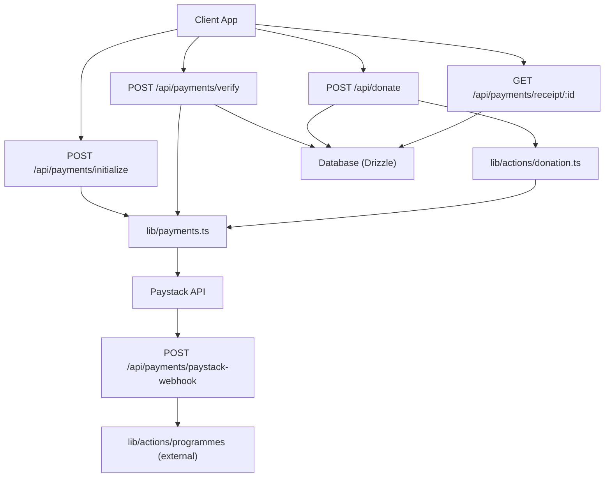
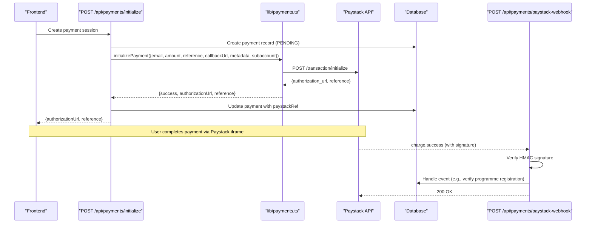
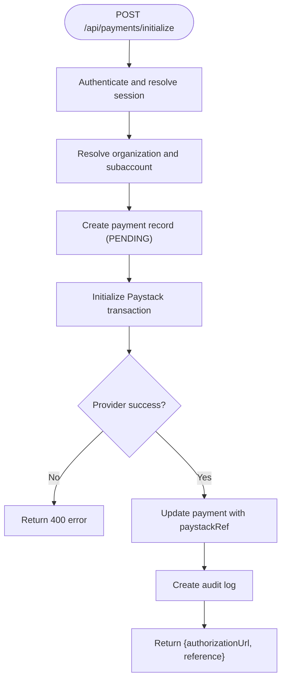
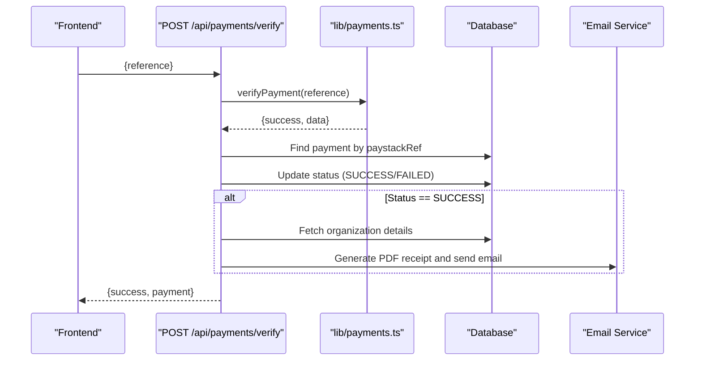
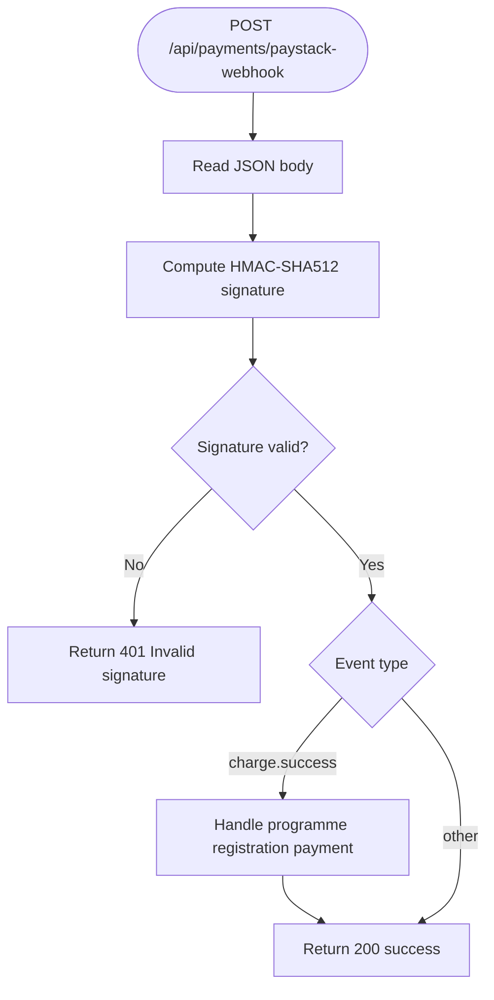
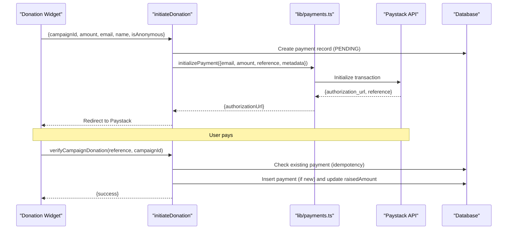
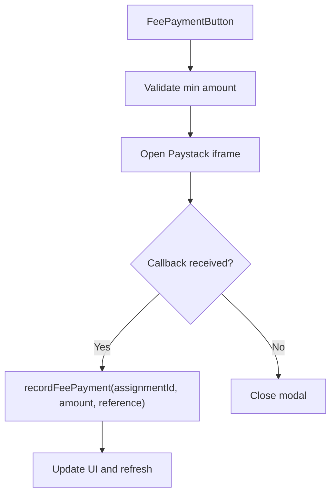
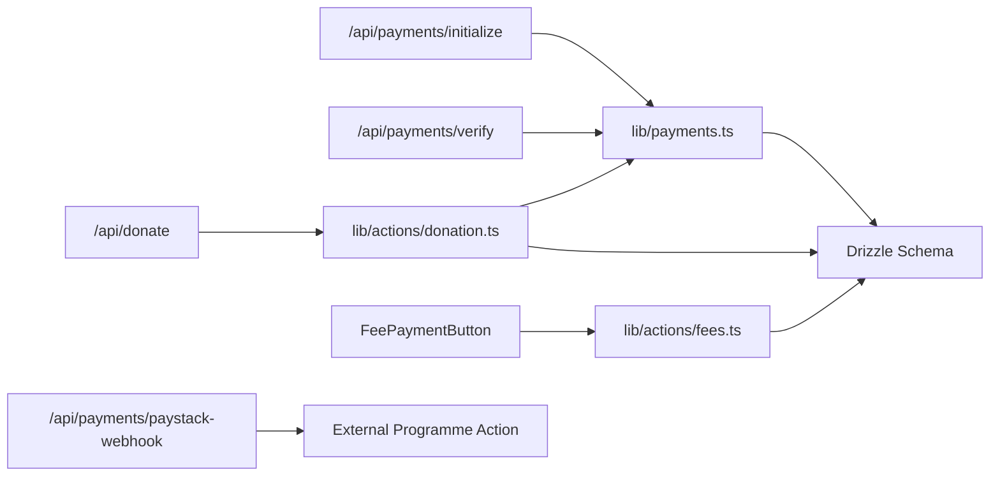
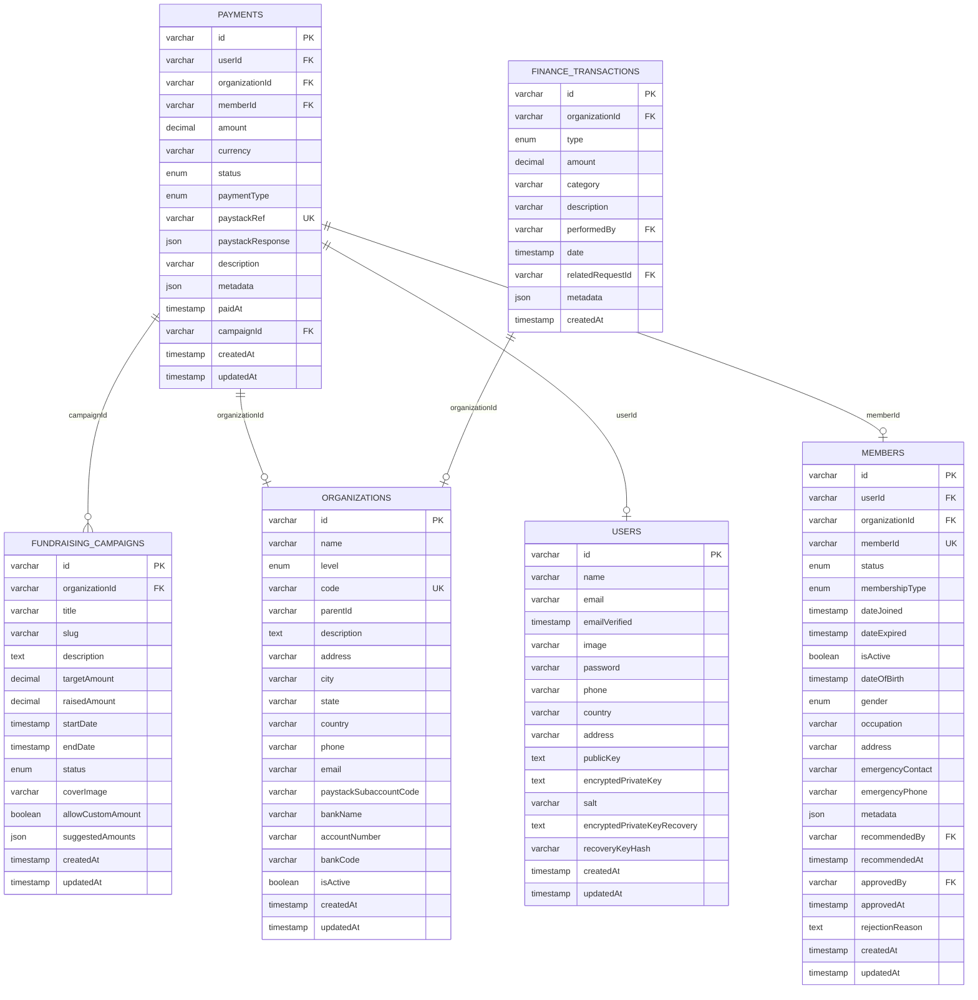

# Payment & Financial APIs

<cite>
**Referenced Files in This Document**
- [initialize route](file://app/api/payments/initialize/route.ts)
- [paystack webhook route](file://app/api/payments/paystack-webhook/route.ts)
- [verify route](file://app/api/payments/verify/route.ts)
- [receipt route](file://app/api/payments/receipt/[id]/route.ts)
- [donate route](file://app/api/donate/route.ts)
- [payments library](file://lib/payments.ts)
- [fee payment button component](file://components/finance/fee-payment-button.tsx)
- [donation actions](file://lib/actions/donation.ts)
- [fees actions](file://lib/actions/fees.ts)
- [database schema](file://lib/db/schema.ts)
</cite>

## Table of Contents
1. [Introduction](#introduction)
2. [Project Structure](#project-structure)
3. [Core Components](#core-components)
4. [Architecture Overview](#architecture-overview)
5. [Detailed Component Analysis](#detailed-component-analysis)
6. [Dependency Analysis](#dependency-analysis)
7. [Performance Considerations](#performance-considerations)
8. [Troubleshooting Guide](#troubleshooting-guide)
9. [Conclusion](#conclusion)
10. [Appendices](#appendices)

## Introduction
This document provides detailed API documentation for payment processing and financial management endpoints focused on transaction handling, payment verification, webhook callbacks from Paystack, donation campaigns, and fee collection. It covers:
- Payment initialization to create sessions and generate authorization URLs
- Payment verification and receipt generation
- Webhook signature verification and event handling
- Donation campaign flows with contribution tracking
- Fee collection for membership fees, program fees, and organizational charges
- Security considerations, PCI compliance guidance, and sensitive data handling
- Error handling patterns and idempotency strategies

## Project Structure
The payment system is implemented as Next.js API routes under app/api, with shared logic in lib/payments.ts and domain-specific server actions in lib/actions. Frontend components integrate the Paystack inline SDK to initiate payments.

**Diagram sources**
- [initialize route:11-85](file://app/api/payments/initialize/route.ts#L11-L85)
- [verify route:10-92](file://app/api/payments/verify/route.ts#L10-L92)
- [donate route:6-63](file://app/api/donate/route.ts#L6-L63)
- [receipt route:8-68](file://app/api/payments/receipt/[id]/route.ts#L8-L68)
- [payments library:18-96](file://lib/payments.ts#L18-L96)
- [paystack webhook route:7-41](file://app/api/payments/paystack-webhook/route.ts#L7-L41)

**Section sources**
- [initialize route:11-85](file://app/api/payments/initialize/route.ts#L11-L85)
- [verify route:10-92](file://app/api/payments/verify/route.ts#L10-L92)
- [donate route:6-63](file://app/api/donate/route.ts#L6-L63)
- [receipt route:8-68](file://app/api/payments/receipt/[id]/route.ts#L8-L68)
- [payments library:18-96](file://lib/payments.ts#L18-L96)
- [paystack webhook route:7-41](file://app/api/payments/paystack-webhook/route.ts#L7-L41)

## Core Components
- Payment Initialization: Creates a payment record, initializes a Paystack transaction, and returns an authorization URL for client-side checkout. Supports routing funds to jurisdiction subaccounts via organization settings.
- Payment Verification: Verifies a transaction by reference against Paystack, updates local payment status, generates and emails receipts, and logs audit events.
- Webhooks: Validates Paystack webhook signatures using HMAC-SHA512 and processes specific events such as successful charges for programme registrations.
- Donation Campaigns: Server action to initialize donations tied to fundraising campaigns, update raised amounts on success, and verify payments.
- Fee Collection: UI-driven flow to collect membership or program fees with minimum amount enforcement, optional extra contributions recorded as donations, and backend recording of payments.

**Section sources**
- [initialize route:11-85](file://app/api/payments/initialize/route.ts#L11-L85)
- [verify route:10-92](file://app/api/payments/verify/route.ts#L10-L92)
- [paystack webhook route:7-41](file://app/api/payments/paystack-webhook/route.ts#L7-L41)
- [donation actions:20-88](file://lib/actions/donation.ts#L20-L88)
- [fee payment button:32-88](file://components/finance/fee-payment-button.tsx#L32-L88)

## Architecture Overview
The system follows a clear separation between API routes (orchestration), shared libraries (Paystack integration and database operations), and frontend components (client-side Paystack integration).

**Diagram sources**
- [initialize route:11-85](file://app/api/payments/initialize/route.ts#L11-L85)
- [payments library:18-58](file://lib/payments.ts#L18-L58)
- [paystack webhook route:7-41](file://app/api/payments/paystack-webhook/route.ts#L7-L41)

## Detailed Component Analysis

### Payment Initialization Endpoint
- Method: POST
- Path: /api/payments/initialize
- Authentication: Requires authenticated session; resolves user and organization context
- Request body fields:
  - amount: number (in Naira)
  - paymentType: string (defaults to MEMBERSHIP_FEE)
  - description: string (optional)
  - memberId: string (optional; defaults to session member)
  - organizationId: string (optional; defaults to session organization)
- Behavior:
  - Resolves target organization and optional Paystack subaccount code
  - Creates a payment record with PENDING status
  - Initializes Paystack transaction with email, amount (converted to kobo), reference, callback URL, metadata, and subaccount
  - Updates payment record with Paystack reference
  - Returns authorizationUrl and reference to redirect client to Paystack
- Error handling:
  - Returns 400 on provider errors
  - Returns 500 on unexpected server errors

**Diagram sources**
- [initialize route:11-85](file://app/api/payments/initialize/route.ts#L11-L85)
- [payments library:18-58](file://lib/payments.ts#L18-L58)

**Section sources**
- [initialize route:11-85](file://app/api/payments/initialize/route.ts#L11-L85)
- [payments library:18-58](file://lib/payments.ts#L18-L58)

### Payment Verification Endpoint
- Method: POST
- Path: /api/payments/verify
- Request body fields:
  - reference: string (Paystack transaction reference)
- Behavior:
  - Calls Paystack to verify transaction status
  - Locates local payment by paystackRef
  - Updates payment status to SUCCESS or FAILED based on provider response
  - On success, generates PDF receipt and sends email attachment to payer
  - Logs audit event for verification
- Error handling:
  - Returns 400 if reference missing or verification fails
  - Returns 404 if payment not found
  - Gracefully handles receipt generation/email failures without failing verification

**Diagram sources**
- [verify route:10-92](file://app/api/payments/verify/route.ts#L10-L92)
- [payments library:60-96](file://lib/payments.ts#L60-L96)

**Section sources**
- [verify route:10-92](file://app/api/payments/verify/route.ts#L10-L92)
- [payments library:60-96](file://lib/payments.ts#L60-L96)

### Paystack Webhook Endpoint
- Method: POST
- Path: /api/payments/paystack-webhook
- Security:
  - Validates x-paystack-signature using HMAC-SHA512 with secret key
  - Rejects invalid signatures with 401
- Event handling:
  - Processes charge.success events
  - For programme registration payments, triggers verification logic via external action
- Error handling:
  - Logs errors and returns 500 on exceptions

**Diagram sources**
- [paystack webhook route:7-41](file://app/api/payments/paystack-webhook/route.ts#L7-L41)

**Section sources**
- [paystack webhook route:7-41](file://app/api/payments/paystack-webhook/route.ts#L7-L41)

### Donation Campaign APIs
- Server Action: initiateDonation
  - Validates input (campaignId, amount, email, name, isAnonymous)
  - Creates payment record linked to campaign
  - Initializes Paystack transaction with campaign metadata
  - Returns authorizationUrl for client-side checkout
- Verification: verifyCampaignDonation
  - Verifies payment via Paystack
  - Idempotent check to avoid duplicate records
  - Records payment and updates campaign raisedAmount
- Frontend Integration:
  - Donation widget calls server action and verifies payment on success

**Diagram sources**
- [donation actions:20-88](file://lib/actions/donation.ts#L20-L88)
- [donation actions:91-138](file://lib/actions/donation.ts#L91-L138)
- [payments library:18-58](file://lib/payments.ts#L18-L58)

**Section sources**
- [donation actions:20-88](file://lib/actions/donation.ts#L20-L88)
- [donation actions:91-138](file://lib/actions/donation.ts#L91-L138)

### Fee Collection Endpoints
- Client Flow:
  - FeePaymentButton enforces minimum amount and collects optional extra contributions
  - Uses Paystack inline SDK with subaccount routing to jurisdiction
  - On callback, records payment via server action
- Backend Recording:
  - Server action records fee payment and can handle additional contributions
  - Integrates with finance transactions and reporting

**Diagram sources**
- [fee payment button:32-88](file://components/finance/fee-payment-button.tsx#L32-L88)
- [fees actions:38-101](file://lib/actions/fees.ts#L38-L101)

**Section sources**
- [fee payment button:32-88](file://components/finance/fee-payment-button.tsx#L32-L88)
- [fees actions:38-101](file://lib/actions/fees.ts#L38-L101)

### Receipt Generation Endpoint
- Method: GET
- Path: /api/payments/receipt/:id
- Authorization: Requires authenticated session; enforces ownership or admin access
- Behavior:
  - Retrieves payment and associated organization/user
  - Generates PDF receipt for successful payments
  - Returns downloadable PDF with appropriate headers
- Error handling:
  - Returns 401 if unauthorized
  - Returns 403 if not owner/admin
  - Returns 400 if payment not successful
  - Returns 404 if payment not found

**Section sources**
- [receipt route:8-68](file://app/api/payments/receipt/[id]/route.ts#L8-L68)

## Dependency Analysis
Key dependencies and relationships:
- API routes depend on lib/payments.ts for Paystack integration and database operations
- Donation and fee flows use server actions that call lib/payments.ts and interact with Drizzle ORM
- Webhook handler validates signatures and delegates to external programme verification logic
- Database schema defines core entities: payments, fundraising_campaigns, finance_transactions, organizations, users, members

**Diagram sources**
- [initialize route:11-85](file://app/api/payments/initialize/route.ts#L11-L85)
- [verify route:10-92](file://app/api/payments/verify/route.ts#L10-L92)
- [donation actions:20-88](file://lib/actions/donation.ts#L20-L88)
- [fees actions:38-101](file://lib/actions/fees.ts#L38-L101)
- [payments library:18-96](file://lib/payments.ts#L18-L96)
- [paystack webhook route:7-41](file://app/api/payments/paystack-webhook/route.ts#L7-L41)

**Section sources**
- [payments library:18-96](file://lib/payments.ts#L18-L96)
- [database schema:352-391](file://lib/db/schema.ts#L352-L391)

## Performance Considerations
- Amount conversion: Ensure amounts are correctly converted to kobo when calling Paystack to avoid rounding issues
- Subaccount routing: Use organization-level subaccount codes to route funds efficiently to jurisdictions
- Receipt generation: Generate PDFs asynchronously where possible to reduce latency on verification endpoints
- Webhook processing: Keep webhook handlers lightweight; delegate heavy processing to background jobs if needed
- Database queries: Leverage indexes on paystackRef and campaignId for fast lookups

[No sources needed since this section provides general guidance]

## Troubleshooting Guide
Common issues and recovery strategies:
- Invalid webhook signature:
  - Ensure PAYSTACK_SECRET_KEY is set and matches Paystack configuration
  - Recompute HMAC-SHA512 over the exact JSON payload
- Payment verification failures:
  - Confirm reference exists and matches paystackRef in database
  - Retry verification with exponential backoff if Paystack API is transiently unavailable
- Duplicate payments:
  - Implement idempotency checks before inserting payment records
  - Use unique constraints on paystackRef to prevent duplicates
- Receipt generation errors:
  - Log and ignore non-critical errors to avoid blocking verification
  - Provide fallback mechanisms to download receipts later
- Fee payment recording:
  - Validate minimum amounts and ensure assignment IDs are correct
  - Refresh UI after successful recording to reflect updated state

**Section sources**
- [paystack webhook route:7-41](file://app/api/payments/paystack-webhook/route.ts#L7-L41)
- [verify route:10-92](file://app/api/payments/verify/route.ts#L10-L92)
- [fee payment button:32-88](file://components/finance/fee-payment-button.tsx#L32-L88)

## Conclusion
The payment and financial system integrates Paystack for secure transaction processing, supports donation campaigns and fee collection, and provides robust verification and receipt generation. Webhook signature validation ensures secure callbacks, while database schema and server actions maintain consistent financial records. Adhering to security best practices and implementing idempotency will enhance reliability and compliance.

[No sources needed since this section summarizes without analyzing specific files]

## Appendices

### Data Models

**Diagram sources**
- [database schema:352-391](file://lib/db/schema.ts#L352-L391)
- [database schema:84-105](file://lib/db/schema.ts#L84-L105)
- [database schema:149-188](file://lib/db/schema.ts#L149-L188)
- [database schema:247-271](file://lib/db/schema.ts#L247-L271)

### Security and Compliance Notes
- PCI DSS: Do not store cardholder data locally; rely on Paystack’s hosted checkout and iframe
- Secrets management: Store PAYSTACK_SECRET_KEY and NEXT_PUBLIC_PAYSTACK_PUBLIC_KEY securely in environment variables
- Signature verification: Always validate webhook signatures using HMAC-SHA512
- Access control: Enforce authentication and authorization for all financial endpoints
- Sensitive data: Avoid logging sensitive payloads; sanitize logs and responses

[No sources needed since this section provides general guidance]

### Idempotency Patterns
- Use unique constraints on paystackRef to prevent duplicate payments
- Check for existing payments before inserting new records during verification
- Implement retry logic with idempotency keys for external API calls

[No sources needed since this section provides general guidance]