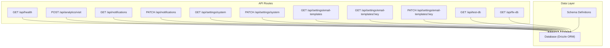
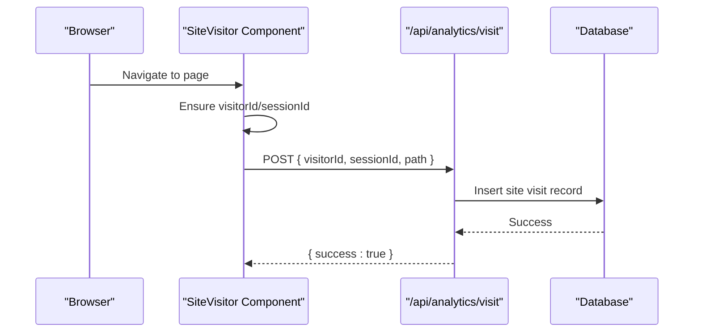
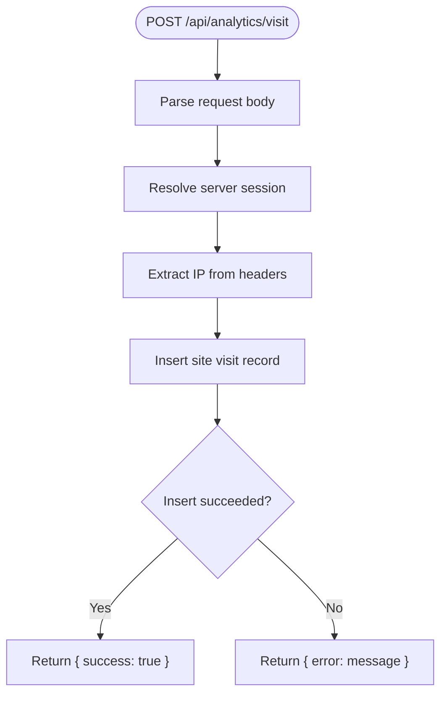
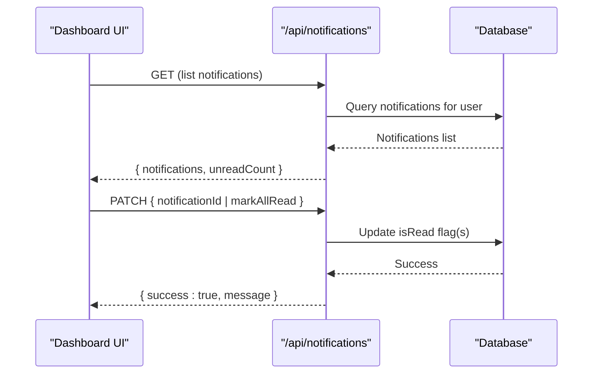
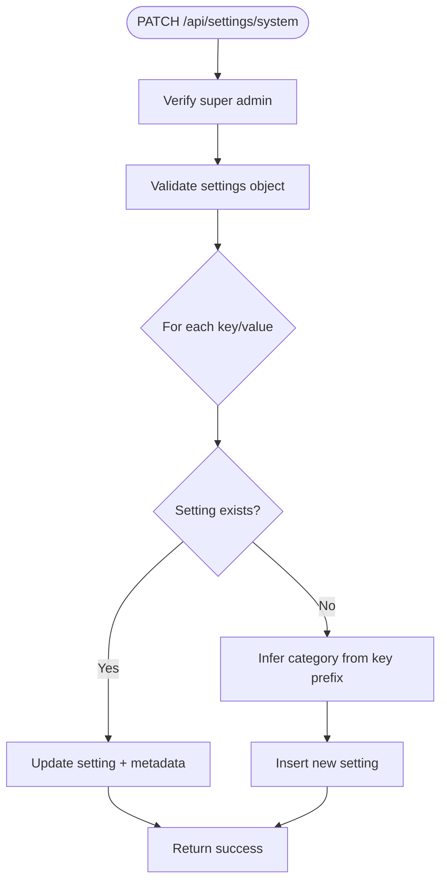
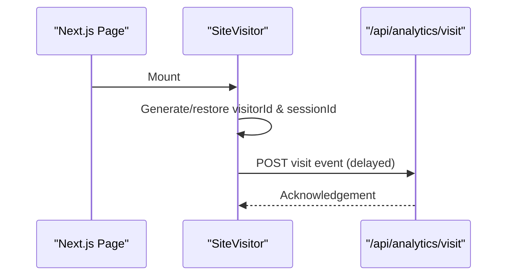
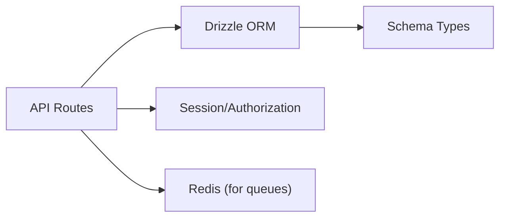

# System & Utility APIs

<cite>
**Referenced Files in This Document**
- [route.ts](file://app/api/health/route.ts)
- [route.ts](file://app/api/analytics/visit/route.ts)
- [site-visitor.tsx](file://components/analytics/site-visitor.tsx)
- [route.ts](file://app/api/notifications/route.ts)
- [route.ts](file://app/api/settings/system/route.ts)
- [route.ts](file://app/api/settings/email-templates/route.ts)
- [route.ts](file://app/api/settings/email-templates/[key]/route.ts)
- [route.ts](file://app/api/test-db/route.ts)
- [route.ts](file://app/api/fix-db/route.ts)
- [schema.ts](file://lib/db/schema.ts)
- [redis.ts](file://lib/redis.ts)
</cite>

## Table of Contents
1. Introduction
2. Project Structure
3. Core Components
4. Architecture Overview
5. Detailed Component Analysis
6. Dependency Analysis
7. Performance Considerations
8. Troubleshooting Guide
9. Conclusion

## Introduction
This document provides detailed API documentation for system monitoring, analytics, notifications, and utility endpoints that support operational health checks, usage analytics, system administration tools, and settings management. It covers:
- Health check endpoints to verify service availability and database connectivity
- Analytics endpoints to collect site visits and user engagement metrics
- Notification system APIs for listing and managing notification read status
- Settings management endpoints for system configuration and email templates
- Debugging utilities and diagnostic endpoints for administrators
- Guidance on rate limiting, caching strategies, and performance considerations for high-frequency calls

## Project Structure
The relevant endpoints are implemented as Next.js Route Handlers under app/api and supported by shared data models and utilities.

**Diagram sources**
- [route.ts:1-6](file://app/api/health/route.ts#L1-L6)
- [route.ts:1-33](file://app/api/analytics/visit/route.ts#L1-L33)
- [route.ts:1-74](file://app/api/notifications/route.ts#L1-L74)
- [route.ts:1-90](file://app/api/settings/system/route.ts#L1-L90)
- [route.ts:1-27](file://app/api/settings/email-templates/route.ts#L1-L27)
- [route.ts:1-63](file://app/api/settings/email-templates/[key]/route.ts#L1-L63)
- [route.ts:1-16](file://app/api/test-db/route.ts#L1-L16)
- [route.ts:1-56](file://app/api/fix-db/route.ts#L1-L56)
- [schema.ts:1-200](file://lib/db/schema.ts#L1-L200)

**Section sources**
- [route.ts:1-6](file://app/api/health/route.ts#L1-L6)
- [route.ts:1-33](file://app/api/analytics/visit/route.ts#L1-L33)
- [route.ts:1-74](file://app/api/notifications/route.ts#L1-L74)
- [route.ts:1-90](file://app/api/settings/system/route.ts#L1-L90)
- [route.ts:1-27](file://app/api/settings/email-templates/route.ts#L1-L27)
- [route.ts:1-63](file://app/api/settings/email-templates/[key]/route.ts#L1-L63)
- [route.ts:1-16](file://app/api/test-db/route.ts#L1-L16)
- [route.ts:1-56](file://app/api/fix-db/route.ts#L1-L56)
- [schema.ts:1-200](file://lib/db/schema.ts#L1-L200)

## Core Components
- Health Check: Simple endpoint returning service status for uptime monitors.
- Analytics Visit: Client-side component posts page views with visitor/session identifiers and optional user context.
- Notifications: List user notifications and mark them as read (single or all).
- System Settings: Read and update key-value system settings with category-based organization; requires super admin.
- Email Templates: Retrieve and update email templates by template key; requires super admin.
- Database Diagnostics: Test DB connectivity and a safe cleanup utility for specific test records.

**Section sources**
- [route.ts:1-6](file://app/api/health/route.ts#L1-L6)
- [route.ts:1-33](file://app/api/analytics/visit/route.ts#L1-L33)
- [route.ts:1-74](file://app/api/notifications/route.ts#L1-L74)
- [route.ts:1-90](file://app/api/settings/system/route.ts#L1-L90)
- [route.ts:1-27](file://app/api/settings/email-templates/route.ts#L1-L27)
- [route.ts:1-63](file://app/api/settings/email-templates/[key]/route.ts#L1-L63)
- [route.ts:1-16](file://app/api/test-db/route.ts#L1-L16)
- [route.ts:1-56](file://app/api/fix-db/route.ts#L1-L56)

## Architecture Overview
The system exposes REST-like endpoints using Next.js route handlers. Most endpoints interact with the database via Drizzle ORM and enforce authentication/authorization where required. The analytics flow includes a client-side component that tracks visits and sends them to the server.

**Diagram sources**
- [site-visitor.tsx:1-70](file://components/analytics/site-visitor.tsx#L1-L70)
- [route.ts:1-33](file://app/api/analytics/visit/route.ts#L1-L33)

## Detailed Component Analysis

### Health Check
- Endpoint: GET /api/health
- Purpose: Verify application availability for uptime monitors and load balancers.
- Response: JSON object indicating status.
- Notes: No authentication required; suitable for public probes.

**Section sources**
- [route.ts:1-6](file://app/api/health/route.ts#L1-L6)

### Database Connectivity Diagnostic
- Endpoint: GET /api/test-db
- Purpose: Validate database connectivity and basic query execution.
- Behavior: Executes a minimal query and returns a plain text response indicating success or error details.
- Notes: Intended for diagnostics; consider restricting access in production.

**Section sources**
- [route.ts:1-16](file://app/api/test-db/route.ts#L1-L16)

### Safe Cleanup Utility
- Endpoint: GET /api/fix-db
- Purpose: Safely remove specific test records matching strict criteria to avoid accidental deletions.
- Behavior: Queries for exact matches and deletes one by one, returning counts and IDs.
- Notes: Use with caution; ensure only intended environments expose this endpoint.

**Section sources**
- [route.ts:1-56](file://app/api/fix-db/route.ts#L1-L56)

### Analytics: Site Visits
- Endpoint: POST /api/analytics/visit
- Purpose: Record site visits including visitor ID, session ID, path, user ID (if authenticated), user agent, and IP.
- Request Body:
  - visitorId: string
  - sessionId: string
  - path: string (optional; defaults to "/")
- Response: JSON success indicator.
- Authentication: Optional user context is attached if available.
- Data Model: Uses siteVisits table from schema.

**Diagram sources**
- [route.ts:1-33](file://app/api/analytics/visit/route.ts#L1-L33)

**Section sources**
- [route.ts:1-33](file://app/api/analytics/visit/route.ts#L1-L33)
- [schema.ts:1-200](file://lib/db/schema.ts#L1-L200)

### Notifications
- Endpoints:
  - GET /api/notifications
  - PATCH /api/notifications
- Purpose:
  - List recent notifications for the authenticated user with unread count.
  - Mark a single notification or all notifications as read.
- Authentication: Requires an authenticated session.
- Response:
  - GET: Array of notifications and unreadCount.
  - PATCH: Confirmation message based on action.

**Diagram sources**
- [route.ts:1-74](file://app/api/notifications/route.ts#L1-L74)

**Section sources**
- [route.ts:1-74](file://app/api/notifications/route.ts#L1-L74)

### System Settings Management
- Endpoints:
  - GET /api/settings/system?category=...
  - PATCH /api/settings/system
- Purpose:
  - Retrieve system settings as key-value pairs, optionally filtered by category.
  - Update existing settings or insert new ones with inferred categories based on key prefixes.
- Authentication: Requires super admin.
- Categories: EMAIL, NOTIFICATION, GENERAL (inferred from key prefix).
- Response:
  - GET: { settings: { key: value } }
  - PATCH: { success: true }

**Diagram sources**
- [route.ts:1-90](file://app/api/settings/system/route.ts#L1-L90)

**Section sources**
- [route.ts:1-90](file://app/api/settings/system/route.ts#L1-L90)

### Email Templates Management
- Endpoints:
  - GET /api/settings/email-templates
  - GET /api/settings/email-templates/:key
  - PATCH /api/settings/email-templates/:key
- Purpose:
  - List all email templates with parsed variables.
  - Retrieve a specific template by key.
  - Update subject/body content for a template.
- Authentication: Requires super admin.
- Response:
  - GET list: { templates: [...] }
  - GET by key: { template: {...} }
  - PATCH: { success: true }

**Section sources**
- [route.ts:1-27](file://app/api/settings/email-templates/route.ts#L1-L27)
- [route.ts:1-63](file://app/api/settings/email-templates/[key]/route.ts#L1-L63)

### Client-Side Analytics Integration
- Component: SiteVisitor
- Behavior:
  - Ensures persistent visitorId and session management with timeout.
  - Skips tracking for API routes and static assets.
  - Posts visit events to /api/analytics/visit with a small delay to avoid blocking rendering.

**Diagram sources**
- [site-visitor.tsx:1-70](file://components/analytics/site-visitor.tsx#L1-L70)
- [route.ts:1-33](file://app/api/analytics/visit/route.ts#L1-L33)

**Section sources**
- [site-visitor.tsx:1-70](file://components/analytics/site-visitor.tsx#L1-L70)

## Dependency Analysis
- Shared dependencies:
  - Database: Drizzle ORM used across endpoints for queries and mutations.
  - Schema: Centralized type-safe definitions for tables and enums.
  - Redis: Connection configured for background jobs (e.g., queues); not directly used by these endpoints but available for future scaling.

**Diagram sources**
- [schema.ts:1-200](file://lib/db/schema.ts#L1-L200)
- [redis.ts:1-9](file://lib/redis.ts#L1-L9)

**Section sources**
- [schema.ts:1-200](file://lib/db/schema.ts#L1-L200)
- [redis.ts:1-9](file://lib/redis.ts#L1-L9)

## Performance Considerations
- Rate Limiting:
  - Implement per-IP or per-user rate limits at the gateway or middleware layer for high-frequency endpoints like analytics and notifications polling.
  - For analytics, consider batching or debouncing client-side requests to reduce payload volume.
- Caching Strategies:
  - Cache GET /api/notifications and GET /api/settings/system responses with short TTLs for non-super-admin contexts where appropriate.
  - Use Redis to cache frequent reads (e.g., system settings) and invalidate on updates.
- Database Optimization:
  - Ensure indexes on frequently queried columns (e.g., userId in notifications, createdAt for ordering).
  - Use pagination for large result sets (e.g., notifications list).
- Background Processing:
  - Offload heavy operations (e.g., sending emails, processing analytics aggregates) to background workers using the Redis-backed queue connection.
- Observability:
  - Add request tracing and structured logging for analytics and settings endpoints to detect bottlenecks.

[No sources needed since this section provides general guidance]

## Troubleshooting Guide
- Health Checks:
  - If /api/health fails, verify application process and environment variables.
- Database Diagnostics:
  - Use /api/test-db to confirm connectivity and permissions.
  - Review error messages returned for connection issues.
- Safe Cleanup:
  - Use /api/fix-db to remove specific test records when necessary; verify criteria match exactly before running.
- Notifications:
  - If notifications do not appear, confirm user session and database rows exist for the user.
  - Use PATCH to mark as read and verify updates reflect in subsequent GET calls.
- Settings:
  - Ensure super admin session for GET/PATCH on system settings and email templates.
  - Validate key prefixes to infer correct categories when inserting new settings.

**Section sources**
- [route.ts:1-6](file://app/api/health/route.ts#L1-L6)
- [route.ts:1-16](file://app/api/test-db/route.ts#L1-L16)
- [route.ts:1-56](file://app/api/fix-db/route.ts#L1-L56)
- [route.ts:1-74](file://app/api/notifications/route.ts#L1-L74)
- [route.ts:1-90](file://app/api/settings/system/route.ts#L1-L90)
- [route.ts:1-27](file://app/api/settings/email-templates/route.ts#L1-L27)
- [route.ts:1-63](file://app/api/settings/email-templates/[key]/route.ts#L1-L63)

## Conclusion
These system and utility APIs provide essential capabilities for monitoring, analytics, notifications, and settings management. They are designed to be straightforward to integrate while allowing for secure, scalable operation through proper authentication, caching, rate limiting, and background processing. Administrators can leverage diagnostic endpoints to maintain system health and perform safe maintenance tasks.

[No sources needed since this section summarizes without analyzing specific files]