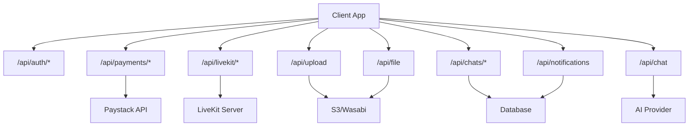
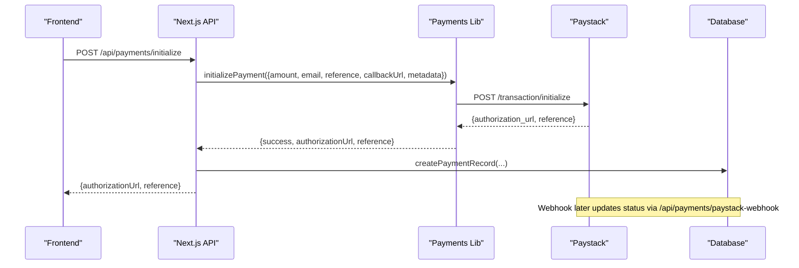
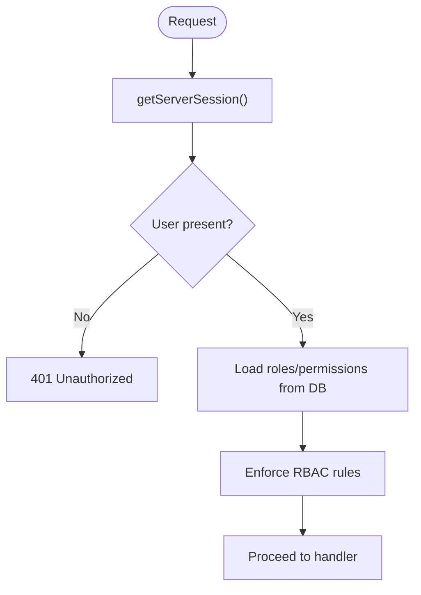
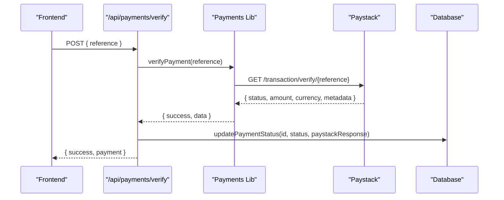
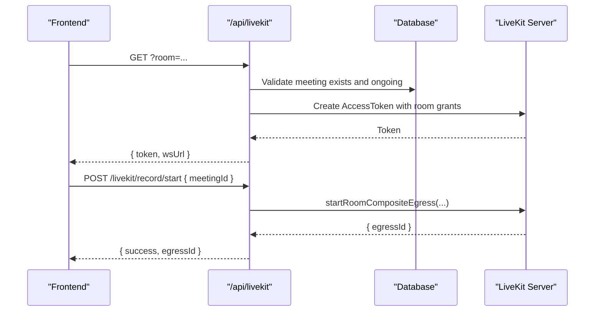
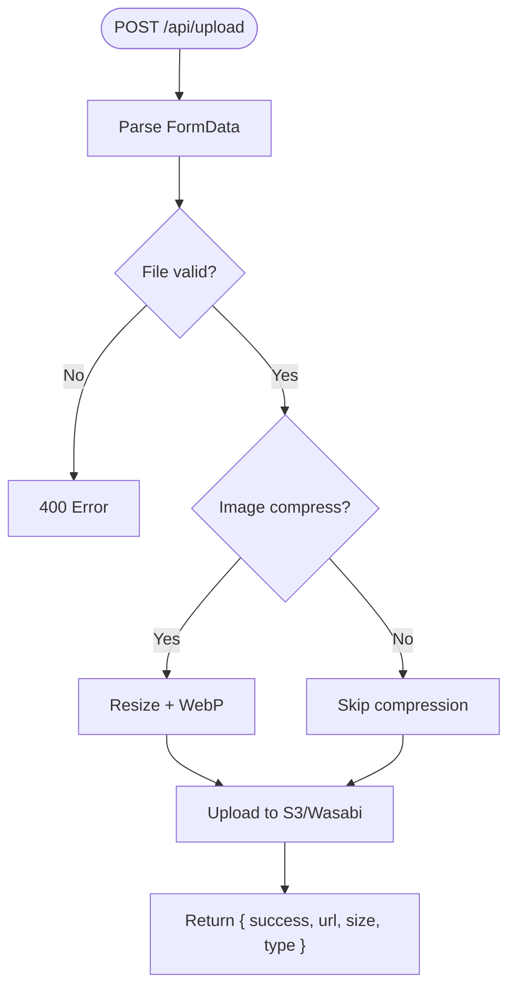
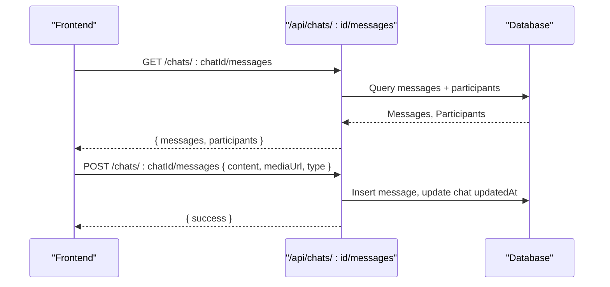
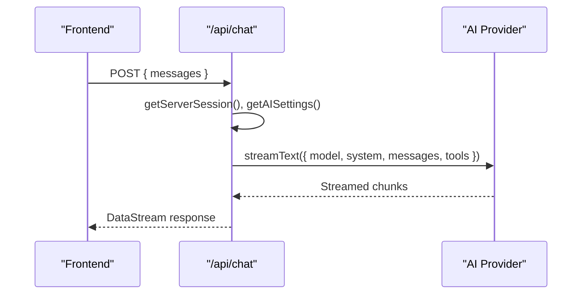
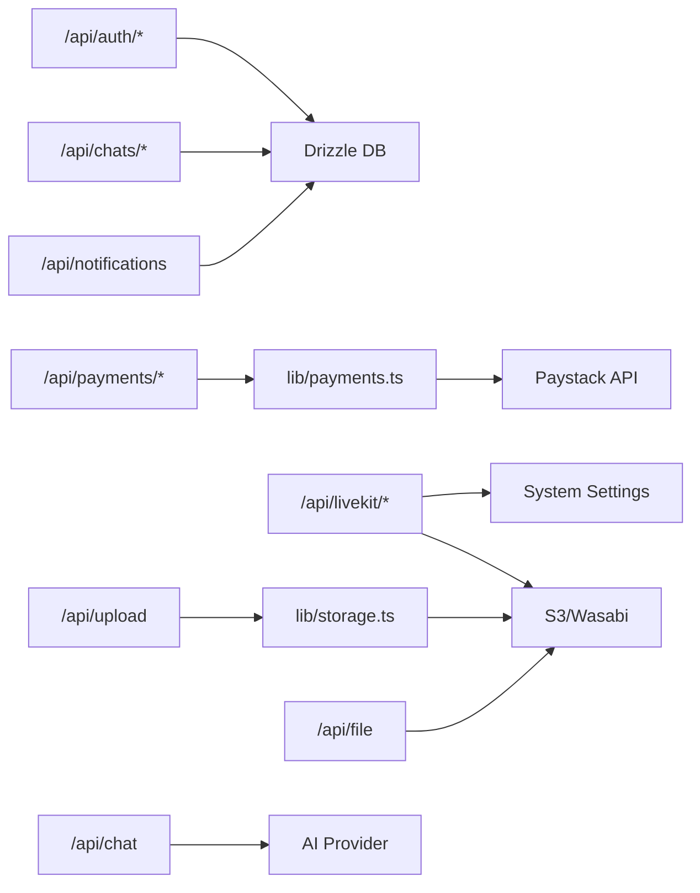

# API Architecture & Integration Patterns

<cite>
**Referenced Files in This Document**
- [route.ts](file://app/api/payments/initialize/route.ts)
- [route.ts](file://app/api/payments/paystack-webhook/route.ts)
- [route.ts](file://app/api/payments/verify/route.ts)
- [payments.ts](file://lib/payments.ts)
- [route.ts](file://app/api/livekit/route.ts)
- [route.ts](file://app/api/livekit/record/start/route.ts)
- [route.ts](file://app/api/upload/route.ts)
- [storage.ts](file://lib/storage.ts)
- [route.ts](file://app/api/file/route.ts)
- [route.ts](file://app/api/chats/route.ts)
- [route.ts](file://app/api/chats/[chatId]/messages/route.ts)
- [route.ts](file://app/api/chat/route.ts)
- [route.ts](file://app/api/auth/[...nextauth]/route.ts)
- [auth.ts](file://lib/auth.ts)
- [email.ts](file://lib/email.ts)
- [notifications route.ts](file://app/api/notifications/route.ts)
</cite>

## Table of Contents
1. Introduction
2. Project Structure
3. Core Components
4. Architecture Overview
5. Detailed Component Analysis
6. Dependency Analysis
7. Performance Considerations
8. Troubleshooting Guide
9. Conclusion

## Introduction
This document describes the TMC Portal’s RESTful API architecture and third-party integrations. It focuses on:
- API routes under app/api/ with consistent error handling and response formats
- Payment processing via Paystack, including webhook handling and transaction verification
- LiveKit video conferencing integration for real-time meetings and recordings
- File storage integration with AWS S3/Wasabi for media uploads and cloud storage
- Chat system using HTTP APIs (with WebSocket-ready patterns) for real-time messaging
- External service integrations such as email providers
- Security, authentication, rate limiting, and monitoring strategies

## Project Structure
The API is implemented as Next.js Route Handlers under app/api/. Key domains include:
- Authentication: /api/auth/[...nextauth]
- Payments: /api/payments/* (initialize, verify, paystack-webhook)
- LiveKit: /api/livekit/* (token generation, recording start/stop)
- Storage: /api/upload (upload), /api/file (secure proxy download)
- Chat: /api/chats/* (list/create chats, messages per chat), /api/chat (AI assistant streaming)
- Notifications: /api/notifications (read/unread management)

**Diagram sources**
- [route.ts:11-89](file://app/api/payments/initialize/route.ts#L11-L89)
- [route.ts:7-40](file://app/api/payments/paystack-webhook/route.ts#L7-L40)
- [route.ts:10-92](file://app/api/payments/verify/route.ts#L10-L92)
- [route.ts:9-110](file://app/api/livekit/route.ts#L9-L110)
- [route.ts:9-80](file://app/api/livekit/record/start/route.ts#L9-L80)
- [route.ts:4-64](file://app/api/upload/route.ts#L4-L64)
- [route.ts:22-59](file://app/api/file/route.ts#L22-L59)
- [route.ts:14-206](file://app/api/chats/route.ts#L14-L206)
- [route.ts:79-131](file://app/api/chats/[chatId]/messages/route.ts#L79-L131)
- [route.ts:12-94](file://app/api/chat/route.ts#L12-L94)
- [route.ts:7-74](file://app/api/notifications/route.ts#L7-L74)

**Section sources**
- [route.ts:11-89](file://app/api/payments/initialize/route.ts#L11-L89)
- [route.ts:7-40](file://app/api/payments/paystack-webhook/route.ts#L7-L40)
- [route.ts:10-92](file://app/api/payments/verify/route.ts#L10-L92)
- [route.ts:9-110](file://app/api/livekit/route.ts#L9-L110)
- [route.ts:9-80](file://app/api/livekit/record/start/route.ts#L9-L80)
- [route.ts:4-64](file://app/api/upload/route.ts#L4-L64)
- [route.ts:22-59](file://app/api/file/route.ts#L22-L59)
- [route.ts:14-206](file://app/api/chats/route.ts#L14-L206)
- [route.ts:79-131](file://app/api/chats/[chatId]/messages/route.ts#L79-L131)
- [route.ts:12-94](file://app/api/chat/route.ts#L12-L94)
- [route.ts:7-74](file://app/api/notifications/route.ts#L7-L74)

## Core Components
- Authentication and Session Management: NextAuth v5 with Drizzle adapter; JWT-based sessions enriched with roles, permissions, and membership data.
- Payments: Initialize payment flows, verification endpoints, and webhook handling for Paystack events.
- LiveKit: Token issuance for room access and recording egress control to S3-compatible storage.
- Storage: Secure upload pipeline with image compression and S3/Wasabi fallback to local storage.
- Chat: Chat list creation, message persistence, and an AI-assisted streaming chat endpoint.
- Notifications: Read/unread management for user notifications.

**Section sources**
- [route.ts:1-8](file://app/api/auth/[...nextauth]/route.ts#L1-L8)
- [auth.ts:131-256](file://lib/auth.ts#L131-L256)
- [route.ts:11-89](file://app/api/payments/initialize/route.ts#L11-L89)
- [route.ts:7-40](file://app/api/payments/paystack-webhook/route.ts#L7-L40)
- [route.ts:10-92](file://app/api/payments/verify/route.ts#L10-L92)
- [payments.ts:18-96](file://lib/payments.ts#L18-L96)
- [route.ts:9-110](file://app/api/livekit/route.ts#L9-L110)
- [route.ts:9-80](file://app/api/livekit/record/start/route.ts#L9-L80)
- [route.ts:4-64](file://app/api/upload/route.ts#L4-L64)
- [storage.ts:25-99](file://lib/storage.ts#L25-L99)
- [route.ts:22-59](file://app/api/file/route.ts#L22-L59)
- [route.ts:14-206](file://app/api/chats/route.ts#L14-L206)
- [route.ts:79-131](file://app/api/chats/[chatId]/messages/route.ts#L79-L131)
- [route.ts:12-94](file://app/api/chat/route.ts#L12-L94)
- [route.ts:7-74](file://app/api/notifications/route.ts#L7-L74)

## Architecture Overview
The API follows a layered approach:
- Route handlers enforce authentication and authorization, validate inputs, and orchestrate business logic.
- Domain libraries encapsulate external integrations (payments, storage, email).
- Database interactions use Drizzle ORM for type-safe queries.
- External services are integrated via HTTP clients (Paystack, LiveKit, Resend).

**Diagram sources**
- [route.ts:11-89](file://app/api/payments/initialize/route.ts#L11-L89)
- [payments.ts:18-58](file://lib/payments.ts#L18-L58)

**Section sources**
- [route.ts:11-89](file://app/api/payments/initialize/route.ts#L11-L89)
- [payments.ts:18-58](file://lib/payments.ts#L18-L58)

## Detailed Component Analysis

### Authentication and Authorization
- NextAuth v5 handler at /api/auth/[...nextauth] delegates to configured auth provider(s).
- JWT session includes roles, permissions, jurisdiction level, member/official profiles, and impersonation context.
- RBAC checks can be applied in route handlers using session.user fields.

**Diagram sources**
- [auth.ts:131-256](file://lib/auth.ts#L131-L256)

**Section sources**
- [route.ts:1-8](file://app/api/auth/[...nextauth]/route.ts#L1-L8)
- [auth.ts:131-256](file://lib/auth.ts#L131-L256)

### Payments Integration (Paystack)
Endpoints:
- POST /api/payments/initialize
  - Request body: amount, paymentType, description, memberId, organizationId
  - Response: { authorizationUrl, reference }
  - Behavior: Creates payment record, initializes Paystack, returns authorization URL
- POST /api/payments/verify
  - Request body: { reference }
  - Response: { success, payment } or error
  - Behavior: Verifies with Paystack, updates status, sends receipt email if successful
- POST /api/payments/paystack-webhook
  - Validates signature using HMAC-SHA512 with secret key
  - Handles charge.success events for programme registration verification

**Diagram sources**
- [route.ts:10-92](file://app/api/payments/verify/route.ts#L10-L92)
- [payments.ts:60-96](file://lib/payments.ts#L60-L96)

**Section sources**
- [route.ts:11-89](file://app/api/payments/initialize/route.ts#L11-L89)
- [route.ts:10-92](file://app/api/payments/verify/route.ts#L10-L92)
- [route.ts:7-40](file://app/api/payments/paystack-webhook/route.ts#L7-L40)
- [payments.ts:18-96](file://lib/payments.ts#L18-L96)

### LiveKit Video Conferencing
Endpoints:
- GET /api/livekit?room=...&guestName=...
  - Generates token with room grants based on admin status and meeting state
  - Returns { token, wsUrl }
- POST /api/livekit/record/start
  - Starts room composite egress to S3-compatible storage
  - Returns { success, egressId }

**Diagram sources**
- [route.ts:9-110](file://app/api/livekit/route.ts#L9-L110)
- [route.ts:9-80](file://app/api/livekit/record/start/route.ts#L9-L80)

**Section sources**
- [route.ts:9-110](file://app/api/livekit/route.ts#L9-L110)
- [route.ts:9-80](file://app/api/livekit/record/start/route.ts#L9-L80)

### File Storage (AWS S3/Wasabi)
Endpoints:
- POST /api/upload
  - Accepts multipart form with file and category
  - Validates size and MIME types/extensions
  - Uploads to S3/Wasabi or falls back to local storage
  - Returns { success, url, size, type }
- GET /api/file?key=...
  - Streams files securely from S3/Wasabi via server-side proxy

**Diagram sources**
- [route.ts:4-64](file://app/api/upload/route.ts#L4-L64)
- [storage.ts:25-99](file://lib/storage.ts#L25-L99)

**Section sources**
- [route.ts:4-64](file://app/api/upload/route.ts#L4-L64)
- [storage.ts:25-99](file://lib/storage.ts#L25-L99)
- [route.ts:22-59](file://app/api/file/route.ts#L22-L59)

### Chat System (HTTP-based, WebSocket-ready)
Endpoints:
- GET /api/chats
  - Lists user’s chats with participants and last message
- POST /api/chats
  - Creates 1-on-1 or group chats with validation and limits
- GET /api/chats/:chatId/messages
  - Retrieves messages for a chat with sender info
- POST /api/chats/:chatId/messages
  - Sends a message (text/media) and updates chat timestamp

**Diagram sources**
- [route.ts:79-131](file://app/api/chats/[chatId]/messages/route.ts#L79-L131)
- [route.ts:14-206](file://app/api/chats/route.ts#L14-L206)

**Section sources**
- [route.ts:14-206](file://app/api/chats/route.ts#L14-L206)
- [route.ts:79-131](file://app/api/chats/[chatId]/messages/route.ts#L79-L131)

### AI-Assisted Streaming Chat
Endpoint:
- POST /api/chat
  - Streams responses from configured AI model with optional tools
  - Supports anonymous usage with disabled tool access

**Diagram sources**
- [route.ts:12-94](file://app/api/chat/route.ts#L12-L94)

**Section sources**
- [route.ts:12-94](file://app/api/chat/route.ts#L12-L94)

### Email Integrations
- sendEmail supports Resend provider with logging and attachments
- Templates cover welcome, verification, payments, meetings, certificates, and more

**Section sources**
- [email.ts:21-92](file://lib/email.ts#L21-L92)
- [email.ts:95-421](file://lib/email.ts#L95-L421)

### Notifications
Endpoints:
- GET /api/notifications
  - Returns recent notifications and unread count
- PATCH /api/notifications
  - Marks single or all notifications as read

**Section sources**
- [notifications route.ts:7-74](file://app/api/notifications/route.ts#L7-L74)

## Dependency Analysis
Key dependencies and coupling:
- Route handlers depend on lib/payments, lib/storage, lib/email, and database schema
- Authentication depends on NextAuth and Drizzle adapter
- LiveKit endpoints depend on settings retrieval and S3 configuration
- Chat endpoints depend on Drizzle models for chats, messages, and participants

**Diagram sources**
- [auth.ts:131-256](file://lib/auth.ts#L131-L256)
- [payments.ts:18-96](file://lib/payments.ts#L18-L96)
- [storage.ts:25-99](file://lib/storage.ts#L25-L99)
- [route.ts:9-110](file://app/api/livekit/route.ts#L9-L110)
- [route.ts:9-80](file://app/api/livekit/record/start/route.ts#L9-L80)
- [route.ts:4-64](file://app/api/upload/route.ts#L4-L64)
- [route.ts:22-59](file://app/api/file/route.ts#L22-L59)
- [route.ts:14-206](file://app/api/chats/route.ts#L14-L206)
- [route.ts:12-94](file://app/api/chat/route.ts#L12-L94)
- [notifications route.ts:7-74](file://app/api/notifications/route.ts#L7-L74)

**Section sources**
- [payments.ts:18-96](file://lib/payments.ts#L18-L96)
- [storage.ts:25-99](file://lib/storage.ts#L25-L99)
- [route.ts:9-110](file://app/api/livekit/route.ts#L9-L110)
- [route.ts:4-64](file://app/api/upload/route.ts#L4-L64)
- [route.ts:14-206](file://app/api/chats/route.ts#L14-L206)
- [route.ts:12-94](file://app/api/chat/route.ts#L12-L94)
- [notifications route.ts:7-74](file://app/api/notifications/route.ts#L7-L74)

## Performance Considerations
- Image compression reduces bandwidth and storage costs; configurable via environment variable
- Chat listing uses a pragmatic query strategy to avoid expensive group-wise max operations; consider indexing createdAt for messages
- LiveKit egress writes directly to S3/Wasabi to minimize server memory pressure
- Payment verification and webhook handling should be idempotent; ensure retries do not duplicate financial records
- Use caching headers for static assets served via /api/file when appropriate

[No sources needed since this section provides general guidance]

## Troubleshooting Guide
Common issues and resolutions:
- Authentication failures: Ensure email verified and password set; check JWT callbacks for role/permission population
- Payment verification errors: Confirm Paystack secret key and reference; handle non-success statuses gracefully
- LiveKit misconfiguration: Verify livekit_url, api_key, api_secret in system settings or environment variables
- Upload failures: Validate file size and MIME types; confirm S3/Wasabi credentials and bucket policy
- Chat permission errors: Verify user membership in chat participants before reading/writing messages
- Email delivery: Check Resend API key and logs; in dev mode, emails are logged instead of sent

**Section sources**
- [auth.ts:131-256](file://lib/auth.ts#L131-L256)
- [route.ts:10-92](file://app/api/payments/verify/route.ts#L10-L92)
- [route.ts:9-110](file://app/api/livekit/route.ts#L9-L110)
- [route.ts:4-64](file://app/api/upload/route.ts#L4-L64)
- [route.ts:79-131](file://app/api/chats/[chatId]/messages/route.ts#L79-L131)
- [email.ts:21-92](file://lib/email.ts#L21-L92)

## Conclusion
The TMC Portal API integrates robust authentication, secure payments, real-time conferencing, scalable storage, and messaging capabilities. The design emphasizes clear separation of concerns, strong validation, and resilient error handling. For production, implement rate limiting, comprehensive monitoring, and audit logging across all critical endpoints.

[No sources needed since this section summarizes without analyzing specific files]