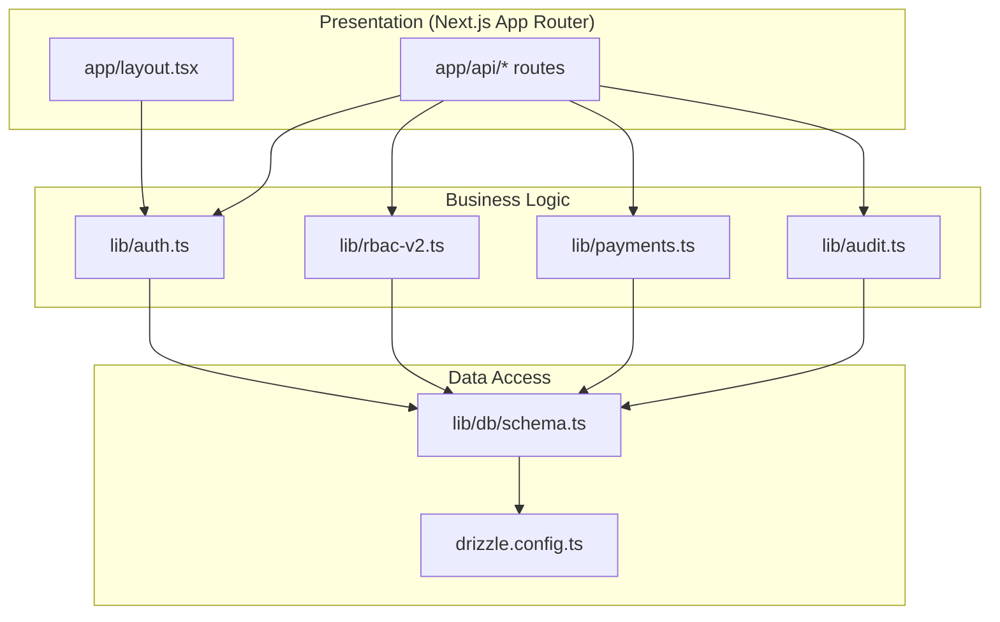
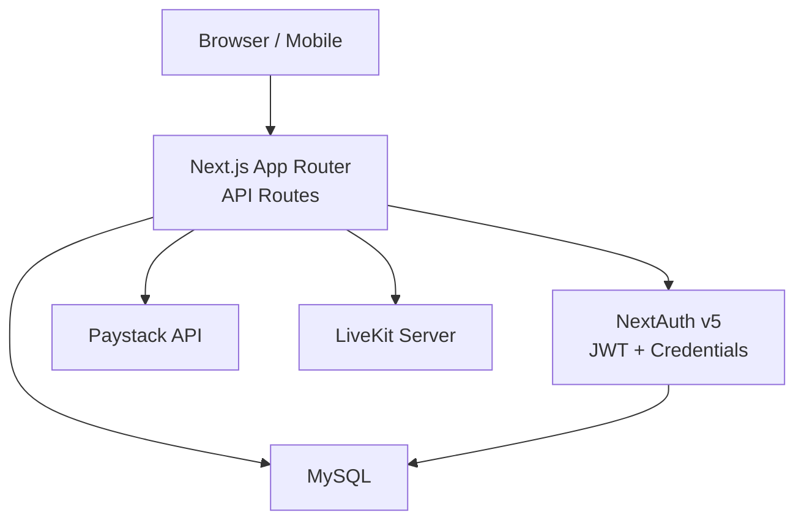
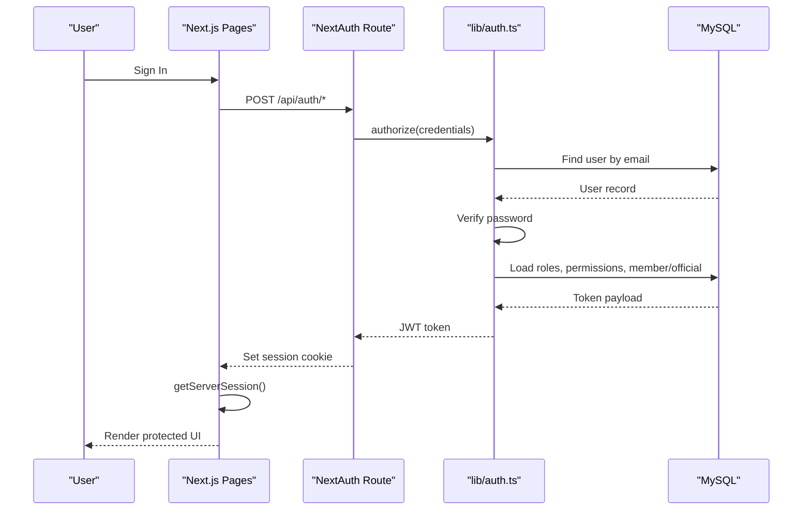
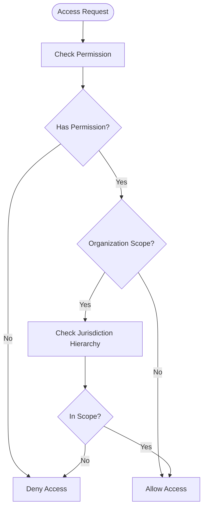
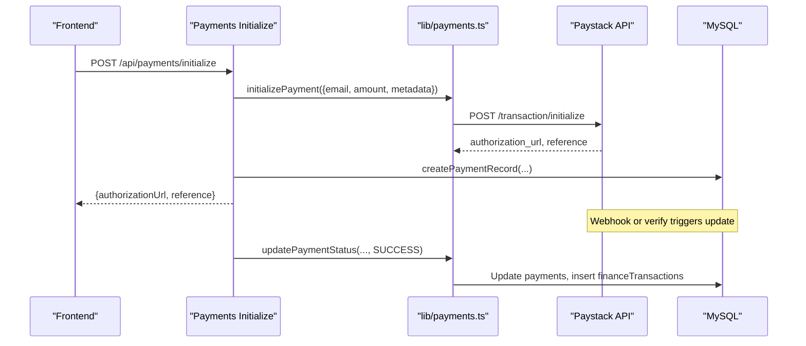
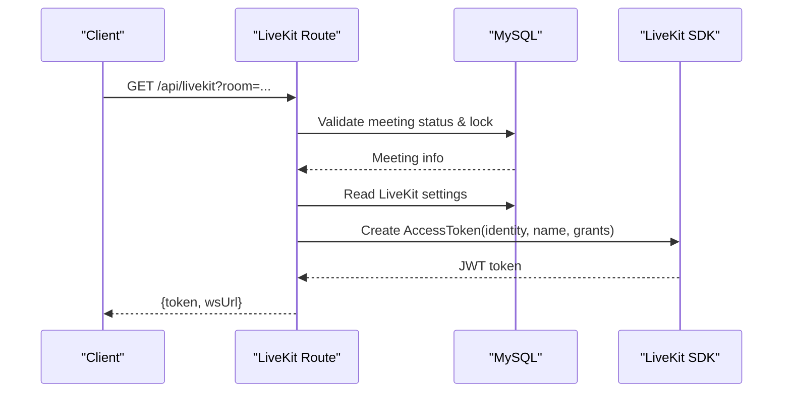
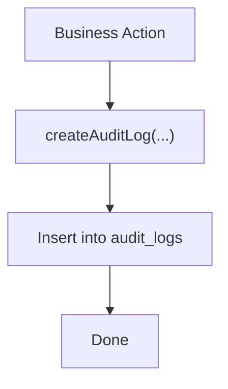
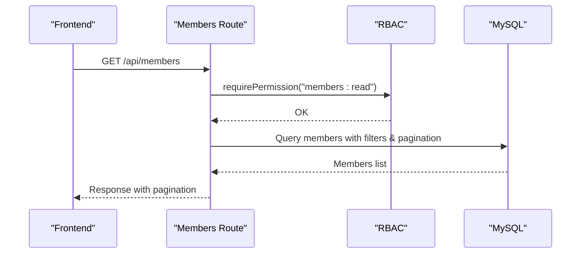
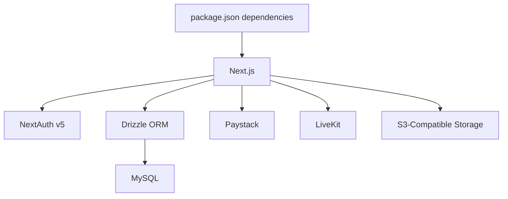

# Architecture Overview

<cite>
**Referenced Files in This Document**
- [package.json](file://package.json)
- [next.config.ts](file://next.config.ts)
- [app/layout.tsx](file://app/layout.tsx)
- [lib/auth.config.ts](file://lib/auth.config.ts)
- [lib/auth.ts](file://lib/auth.ts)
- [lib/session.ts](file://lib/session.ts)
- [app/api/auth/[...nextauth]/route.ts](file://app/api/auth/[...nextauth]/route.ts)
- [lib/db/schema.ts](file://lib/db/schema.ts)
- [drizzle.config.ts](file://drizzle.config.ts)
- [lib/payments.ts](file://lib/payments.ts)
- [app/api/payments/initialize/route.ts](file://app/api/payments/initialize/route.ts)
- [lib/rbac-v2.ts](file://lib/rbac-v2.ts)
- [app/api/members/route.ts](file://app/api/members/route.ts)
- [app/api/livekit/route.ts](file://app/api/livekit/route.ts)
- [lib/audit.ts](file://lib/audit.ts)
</cite>

## Table of Contents
1. Introduction
2. Project Structure
3. Core Components
4. Architecture Overview
5. Detailed Component Analysis
6. Dependency Analysis
7. Performance Considerations
8. Troubleshooting Guide
9. Conclusion

## Introduction
This document describes the TMC Portal system architecture with a focus on layered design, component interactions, data flows, and integration patterns. It explains how the Next.js App Router presentation layer delegates to business logic in the lib directory and persists data via Drizzle ORM against MySQL. It also documents authentication, payment processing (Paystack), real-time communication (LiveKit), multi-tenant organization structure (National, State, Local Government, Branch), security, audit logging, session management, infrastructure requirements, scalability considerations, deployment topology, and technology stack decisions.

## Project Structure
The application follows a Next.js App Router layout:
- Presentation: app/* pages and layouts render UI and orchestrate server-side data fetching and actions.
- Business Logic: lib/* contains reusable services for auth, RBAC, payments, audit, utilities, and helpers.
- Data Access: lib/db/schema.ts defines Drizzle schema; drizzle.config.ts configures migrations and dialect.

Key configuration:
- next.config.ts sets standalone output, image remote patterns, and service worker integration.
- Root layout wires up providers, session, analytics, and global UI elements.

**Diagram sources**
- [app/layout.tsx:42-63](file://app/layout.tsx#L42-L63)
- [lib/auth.ts:131-257](file://lib/auth.ts#L131-L257)
- [lib/rbac-v2.ts:47-165](file://lib/rbac-v2.ts#L47-L165)
- [lib/payments.ts:18-96](file://lib/payments.ts#L18-L96)
- [lib/audit.ts:17-34](file://lib/audit.ts#L17-L34)
- [lib/db/schema.ts:84-188](file://lib/db/schema.ts#L84-L188)
- [drizzle.config.ts:6-13](file://drizzle.config.ts#L6-L13)

**Section sources**
- [next.config.ts:11-39](file://next.config.ts#L11-L39)
- [app/layout.tsx:20-63](file://app/layout.tsx#L20-L63)
- [drizzle.config.ts:1-14](file://drizzle.config.ts#L1-L14)

## Core Components
- Authentication and Session: NextAuth v5 with JWT strategy, credentials provider, Drizzle adapter, token population with roles, permissions, member/official context, and impersonation support.
- Multi-Tenant RBAC: Role-based access control with jurisdiction levels (SYSTEM, NATIONAL, STATE, LOCAL_GOVERNMENT, BRANCH) and organization hierarchy checks.
- Payments: Paystack integration for initialization, verification, subaccount routing per organization, and financial transaction recording.
- Real-Time Communication: LiveKit token issuance with meeting validation, lock controls, and admin privileges.
- Audit Logging: Centralized audit log creation and retrieval for compliance and traceability.

**Section sources**
- [lib/auth.config.ts:1-12](file://lib/auth.config.ts#L1-L12)
- [lib/auth.ts:131-257](file://lib/auth.ts#L131-L257)
- [lib/rbac-v2.ts:47-165](file://lib/rbac-v2.ts#L47-L165)
- [lib/payments.ts:18-190](file://lib/payments.ts#L18-L190)
- [app/api/livekit/route.ts:9-112](file://app/api/livekit/route.ts#L9-L112)
- [lib/audit.ts:17-74](file://lib/audit.ts#L17-L74)

## Architecture Overview
The system uses a layered architecture:
- Presentation Layer: Next.js App Router pages and API routes handle requests, enforce auth/RBAC, and orchestrate business operations.
- Business Logic Layer: lib modules encapsulate domain logic (RBAC, payments, audit).
- Data Access Layer: Drizzle ORM queries the MySQL database using a typed schema.

Integration points:
- Authentication: NextAuth route handler delegates to lib/auth configuration and adapter.
- Payments: API route initializes Paystack transactions and records financial inflows.
- Real-Time: LiveKit token endpoint validates meetings and issues scoped tokens.

**Diagram sources**
- [app/api/auth/[...nextauth]/route.ts:1-8](file://app/api/auth/[...nextauth]/route.ts#L1-L8)
- [lib/auth.ts:131-257](file://lib/auth.ts#L131-L257)
- [lib/payments.ts:18-96](file://lib/payments.ts#L18-L96)
- [app/api/livekit/route.ts:9-112](file://app/api/livekit/route.ts#L9-L112)
- [lib/db/schema.ts:84-188](file://lib/db/schema.ts#L84-L188)

## Detailed Component Analysis

### Authentication Flow
Authentication uses NextAuth v5 with JWT sessions and a credentials provider. On sign-in, the user is validated, and the JWT callback enriches the token with roles, permissions, member/official profiles, and jurisdiction flags. The root layout retrieves the server session and provides it to client components.

**Diagram sources**
- [app/api/auth/[...nextauth]/route.ts:1-8](file://app/api/auth/[...nextauth]/route.ts#L1-L8)
- [lib/auth.ts:146-228](file://lib/auth.ts#L146-L228)
- [lib/session.ts:8-15](file://lib/session.ts#L8-L15)
- [app/layout.tsx:42-63](file://app/layout.tsx#L42-L63)

**Section sources**
- [lib/auth.config.ts:1-12](file://lib/auth.config.ts#L1-L12)
- [lib/auth.ts:131-257](file://lib/auth.ts#L131-L257)
- [lib/session.ts:1-16](file://lib/session.ts#L1-L16)
- [app/layout.tsx:42-63](file://app/layout.tsx#L42-L63)

### Multi-Tenant Organization and RBAC
The system supports hierarchical organizations at National, State, Local Government, and Branch levels. RBAC enforces permission checks and jurisdictional access based on role assignments and organization hierarchy. SuperAdmin (SYSTEM level) bypasses restrictions.

**Diagram sources**
- [lib/rbac-v2.ts:141-259](file://lib/rbac-v2.ts#L141-L259)
- [lib/db/schema.ts:20-27](file://lib/db/schema.ts#L20-L27)
- [lib/db/schema.ts:148-188](file://lib/db/schema.ts#L148-L188)

**Section sources**
- [lib/rbac-v2.ts:47-165](file://lib/rbac-v2.ts#L47-L165)
- [lib/rbac-v2.ts:170-259](file://lib/rbac-v2.ts#L170-L259)
- [lib/db/schema.ts:20-27](file://lib/db/schema.ts#L20-L27)
- [lib/db/schema.ts:148-188](file://lib/db/schema.ts#L148-L188)

### Payment Processing (Paystack)
Payment flow initializes a transaction with Paystack, creates a local payment record, updates status on success, and records financial inflow. Subaccounts are resolved per organization to route funds correctly.

**Diagram sources**
- [app/api/payments/initialize/route.ts:11-89](file://app/api/payments/initialize/route.ts#L11-L89)
- [lib/payments.ts:18-96](file://lib/payments.ts#L18-L96)
- [lib/payments.ts:100-190](file://lib/payments.ts#L100-L190)

**Section sources**
- [app/api/payments/initialize/route.ts:11-89](file://app/api/payments/initialize/route.ts#L11-L89)
- [lib/payments.ts:18-190](file://lib/payments.ts#L18-L190)

### Real-Time Communication (LiveKit)
The LiveKit token endpoint validates that a meeting exists and is ongoing, enforces locks, and grants appropriate room permissions based on admin status. Settings are read from the database to avoid exposing secrets.

**Diagram sources**
- [app/api/livekit/route.ts:9-112](file://app/api/livekit/route.ts#L9-L112)

**Section sources**
- [app/api/livekit/route.ts:9-112](file://app/api/livekit/route.ts#L9-L112)

### Audit Logging
Audit logs capture key actions with contextual metadata. Logging is resilient and does not break core flows if failures occur.

**Diagram sources**
- [lib/audit.ts:17-34](file://lib/audit.ts#L17-L34)

**Section sources**
- [lib/audit.ts:17-74](file://lib/audit.ts#L17-L74)

### Members Management Example
Members API demonstrates permission enforcement, organization scoping, pagination, and transactional creation of users and members with audit logging.

**Diagram sources**
- [app/api/members/route.ts:11-76](file://app/api/members/route.ts#L11-L76)

**Section sources**
- [app/api/members/route.ts:11-203](file://app/api/members/route.ts#L11-L203)

## Dependency Analysis
Technology stack and integrations:
- Next.js App Router with standalone output and service worker integration.
- NextAuth v5 with JWT strategy and Drizzle adapter.
- Drizzle ORM with MySQL dialect for schema-driven data access.
- Paystack for payments with subaccount routing per organization.
- LiveKit for real-time rooms with token issuance.
- AWS S3-compatible storage referenced in image remote patterns.

**Diagram sources**
- [package.json:17-102](file://package.json#L17-L102)
- [next.config.ts:20-35](file://next.config.ts#L20-L35)
- [drizzle.config.ts:6-13](file://drizzle.config.ts#L6-L13)

**Section sources**
- [package.json:17-102](file://package.json#L17-L102)
- [next.config.ts:11-39](file://next.config.ts#L11-L39)
- [drizzle.config.ts:1-14](file://drizzle.config.ts#L1-L14)

## Performance Considerations
- Use Next.js standalone output for efficient deployments.
- Prefer server-side data fetching and caching where possible.
- Leverage Drizzle’s type-safe queries and relations to minimize N+1 problems.
- Offload heavy tasks to workers (e.g., email-worker) to keep request paths fast.
- Cache frequently accessed data (e.g., organization tree) and use pagination for large datasets.
- Configure image optimization and allowlist only necessary remote domains.

[No sources needed since this section provides general guidance]

## Troubleshooting Guide
Common issues and mitigations:
- Authentication errors: Ensure credentials are valid and email verified; check JWT callbacks for role/permission loading.
- Payment failures: Validate Paystack keys and network connectivity; inspect initialization and verification responses.
- LiveKit misconfiguration: Confirm API keys and WebSocket URL in system settings; ensure meeting is ONGOING and not locked.
- Audit logging resilience: Failures do not block core flows; review logs for non-critical errors.

**Section sources**
- [lib/auth.ts:188-228](file://lib/auth.ts#L188-L228)
- [lib/payments.ts:18-96](file://lib/payments.ts#L18-L96)
- [app/api/livekit/route.ts:76-112](file://app/api/livekit/route.ts#L76-L112)
- [lib/audit.ts:17-34](file://lib/audit.ts#L17-L34)

## Conclusion
TMC Portal employs a clear layered architecture with Next.js App Router for presentation, lib modules for business logic, and Drizzle ORM for data access. It integrates robust authentication, multi-tenant RBAC with jurisdictional controls, secure payment processing via Paystack, and real-time communication through LiveKit. Audit logging ensures accountability, while infrastructure choices support scalable deployment. The system balances usability, security, and extensibility across National, State, and Local Government jurisdictions.

[No sources needed since this section summarizes without analyzing specific files]