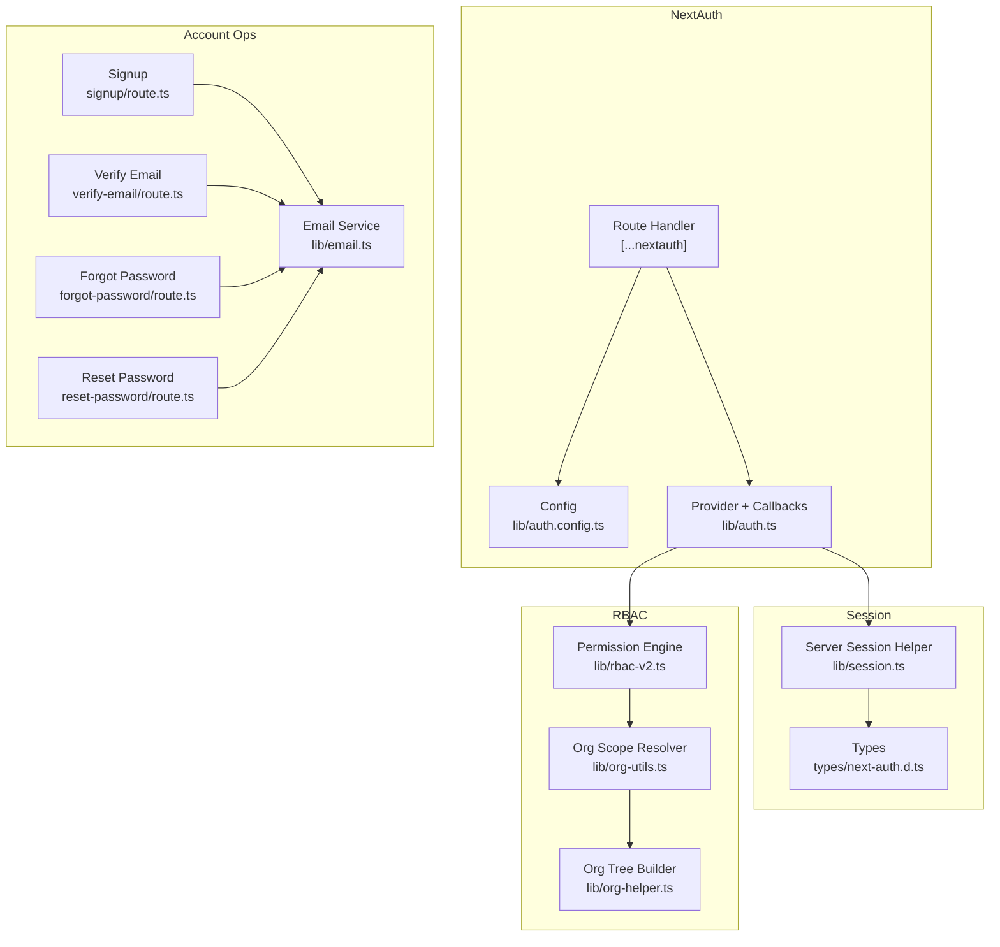
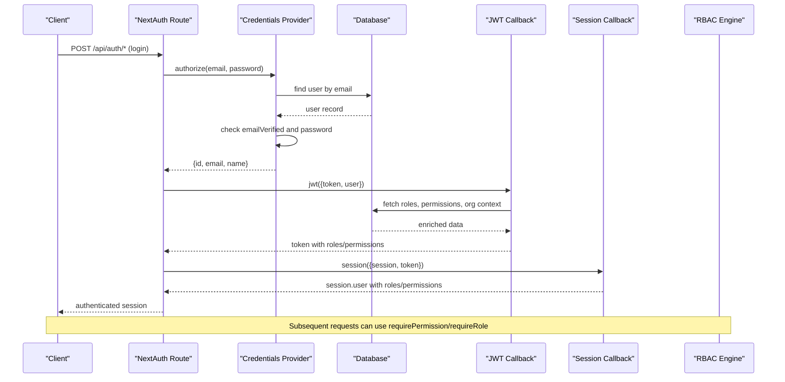
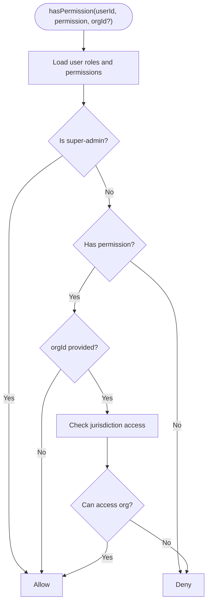
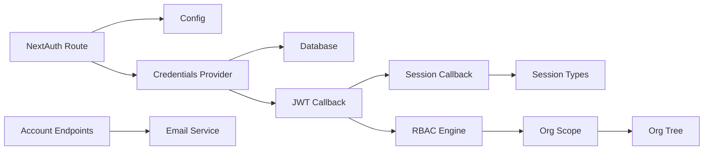

# Authentication & Authorization Architecture

<cite>
**Referenced Files in This Document**
- [lib/auth.ts](file://lib/auth.ts)
- [lib/auth.config.ts](file://lib/auth.config.ts)
- [auth.ts](file://auth.ts)
- [app/api/auth/[...nextauth]/route.ts](file://app/api/auth/[...nextauth]/route.ts)
- [types/next-auth.d.ts](file://types/next-auth.d.ts)
- [lib/rbac-v2.ts](file://lib/rbac-v2.ts)
- [lib/session.ts](file://lib/session.ts)
- [lib/org-utils.ts](file://lib/org-utils.ts)
- [lib/org-helper.ts](file://lib/org-helper.ts)
- [app/api/auth/signup/route.ts](file://app/api/auth/signup/route.ts)
- [app/api/auth/verify-email/route.ts](file://app/api/auth/verify-email/route.ts)
- [app/api/auth/forgot-password/route.ts](file://app/api/auth/forgot-password/route.ts)
- [app/api/auth/reset-password/route.ts](file://app/api/auth/reset-password/route.ts)
- [lib/email.ts](file://lib/email.ts)
</cite>

## Table of Contents
1. Introduction
2. Project Structure
3. Core Components
4. Architecture Overview
5. Detailed Component Analysis
6. Dependency Analysis
7. Performance Considerations
8. Troubleshooting Guide
9. Conclusion

## Introduction
This document explains the authentication and authorization architecture for the TMC Portal built on NextAuth v5 with a custom credentials provider, JWT-based sessions, and a jurisdiction-aware role-based access control (RBAC) system. It covers login flows, password validation, email verification, session management, token refresh behavior, multi-tenant isolation via organization context, and permission evaluation from super-admin down to regular users.

## Project Structure
The authentication and authorization features are implemented across:
- NextAuth configuration and route handlers
- Custom credentials provider with DB-backed user lookup and password checks
- JWT callbacks that enrich tokens with roles, permissions, and organizational context
- RBAC utilities for permission and role checks with jurisdiction constraints
- Organization hierarchy helpers for scope resolution and context switching
- Email-driven account verification and password reset flows

**Diagram sources**
- [app/api/auth/[...nextauth]/route.ts:1-8](file://app/api/auth/[...nextauth]/route.ts#L1-L8)
- [lib/auth.config.ts:1-12](file://lib/auth.config.ts#L1-L12)
- [lib/auth.ts:131-257](file://lib/auth.ts#L131-L257)
- [lib/session.ts:1-16](file://lib/session.ts#L1-L16)
- [types/next-auth.d.ts:1-74](file://types/next-auth.d.ts#L1-L74)
- [lib/rbac-v2.ts:1-361](file://lib/rbac-v2.ts#L1-L361)
- [lib/org-utils.ts:1-76](file://lib/org-utils.ts#L1-L76)
- [lib/org-helper.ts:1-118](file://lib/org-helper.ts#L1-L118)
- [app/api/auth/signup/route.ts:1-141](file://app/api/auth/signup/route.ts#L1-L141)
- [app/api/auth/verify-email/route.ts:1-63](file://app/api/auth/verify-email/route.ts#L1-L63)
- [app/api/auth/forgot-password/route.ts:1-77](file://app/api/auth/forgot-password/route.ts#L1-L77)
- [app/api/auth/reset-password/route.ts:1-59](file://app/api/auth/reset-password/route.ts#L1-L59)
- [lib/email.ts:1-423](file://lib/email.ts#L1-L423)

**Section sources**
- [app/api/auth/[...nextauth]/route.ts:1-8](file://app/api/auth/[...nextauth]/route.ts#L1-L8)
- [lib/auth.config.ts:1-12](file://lib/auth.config.ts#L1-L12)
- [lib/auth.ts:131-257](file://lib/auth.ts#L131-L257)
- [lib/session.ts:1-16](file://lib/session.ts#L1-L16)
- [types/next-auth.d.ts:1-74](file://types/next-auth.d.ts#L1-L74)
- [lib/rbac-v2.ts:1-361](file://lib/rbac-v2.ts#L1-L361)
- [lib/org-utils.ts:1-76](file://lib/org-utils.ts#L1-L76)
- [lib/org-helper.ts:1-118](file://lib/org-helper.ts#L1-L118)
- [app/api/auth/signup/route.ts:1-141](file://app/api/auth/signup/route.ts#L1-L141)
- [app/api/auth/verify-email/route.ts:1-63](file://app/api/auth/verify-email/route.ts#L1-L63)
- [app/api/auth/forgot-password/route.ts:1-77](file://app/api/auth/forgot-password/route.ts#L1-L77)
- [app/api/auth/reset-password/route.ts:1-59](file://app/api/auth/reset-password/route.ts#L1-L59)
- [lib/email.ts:1-423](file://lib/email.ts#L1-L423)

## Core Components
- NextAuth v5 setup with JWT strategy and Drizzle adapter
- Custom Credentials Provider for email/password authentication
- JWT enrichment with roles, permissions, and organizational context
- RBAC engine with jurisdiction-aware permission checks
- Organization scope resolver for multi-tenant isolation
- Account lifecycle endpoints: signup, verify email, forgot/reset password
- Email service integration for verification and reset links

Key responsibilities:
- Authentication: validate credentials, enforce email verification, create JWT sessions
- Authorization: evaluate permissions based on roles and jurisdiction; support super-admin bypass
- Multi-tenancy: resolve organization scope per session and enforce data boundaries
- Security: secure password hashing, token expiry, and safe error messaging

**Section sources**
- [lib/auth.ts:131-257](file://lib/auth.ts#L131-L257)
- [lib/rbac-v2.ts:1-361](file://lib/rbac-v2.ts#L1-L361)
- [lib/org-utils.ts:1-76](file://lib/org-utils.ts#L1-L76)
- [app/api/auth/signup/route.ts:1-141](file://app/api/auth/signup/route.ts#L1-L141)
- [app/api/auth/verify-email/route.ts:1-63](file://app/api/auth/verify-email/route.ts#L1-L63)
- [app/api/auth/forgot-password/route.ts:1-77](file://app/api/auth/forgot-password/route.ts#L1-L77)
- [app/api/auth/reset-password/route.ts:1-59](file://app/api/auth/reset-password/route.ts#L1-L59)
- [lib/email.ts:1-423](file://lib/email.ts#L1-L423)

## Architecture Overview
The system uses NextAuth v5 with a JWT session strategy. On login, the credentials provider validates the user against the database, enforces email verification, and returns minimal user info. The JWT callback enriches the token with roles, permissions, and membership/official profiles. The session callback maps token fields into the server session object. RBAC utilities provide fine-grained permission checks with jurisdiction constraints, while org helpers determine the effective organization scope for multi-tenant isolation.

**Diagram sources**
- [app/api/auth/[...nextauth]/route.ts:1-8](file://app/api/auth/[...nextauth]/route.ts#L1-L8)
- [lib/auth.ts:146-183](file://lib/auth.ts#L146-L183)
- [lib/auth.ts:189-251](file://lib/auth.ts#L189-L251)
- [lib/rbac-v2.ts:313-358](file://lib/rbac-v2.ts#L313-L358)

## Detailed Component Analysis

### NextAuth Configuration and Route
- Centralized config sets JWT strategy, trust host, secret, and sign-in page
- Route handler exports GET/POST handlers for NextAuth endpoints
- Reusable auth module exposes handlers, auth(), signIn(), signOut()

Security notes:
- Secret is sourced from environment variables
- TrustHost enabled for proxied deployments

**Section sources**
- [lib/auth.config.ts:1-12](file://lib/auth.config.ts#L1-L12)
- [app/api/auth/[...nextauth]/route.ts:1-8](file://app/api/auth/[...nextauth]/route.ts#L1-L8)
- [auth.ts:1-5](file://auth.ts#L1-L5)

### Custom Credentials Provider
- Validates presence of email and password
- Looks up user by email
- Enforces email verification before allowing login
- Compares password using bcrypt
- Returns minimal user payload for JWT population

Error handling:
- Throws custom credential errors for not found, missing password, unverified email, or wrong password

**Section sources**
- [lib/auth.ts:146-183](file://lib/auth.ts#L146-L183)

### JWT Enrichment and Session Mapping
- JWT callback populates roles, permissions, and flags like isSuperAdmin
- Also attaches member and official profile identifiers and levels
- Supports impersonation flow via session action triggers
- Session callback maps token fields into session.user for easy consumption

Token refresh behavior:
- Uses NextAuth JWT strategy; tokens are refreshed on subsequent requests according to NextAuth defaults
- No explicit client-side refresh logic is present in the analyzed files

**Section sources**
- [lib/auth.ts:189-251](file://lib/auth.ts#L189-L251)
- [types/next-auth.d.ts:21-72](file://types/next-auth.d.ts#L21-L72)

### RBAC Engine and Permission Evaluation
- Aggregates active roles and granted permissions for a user
- Super-admin (SYSTEM level) bypass grants all permissions
- Jurisdiction checks ensure users can only access organizations within their hierarchy
- Provides requirePermission and requireRole helpers for API routes

Jurisdiction rules:
- Checks direct organization match or ancestor relationship
- Considers role jurisdiction level vs target organization level

**Diagram sources**
- [lib/rbac-v2.ts:141-165](file://lib/rbac-v2.ts#L141-L165)
- [lib/rbac-v2.ts:170-213](file://lib/rbac-v2.ts#L170-L213)
- [lib/rbac-v2.ts:218-259](file://lib/rbac-v2.ts#L218-L259)

**Section sources**
- [lib/rbac-v2.ts:1-361](file://lib/rbac-v2.ts#L1-L361)

### Organization Context and Multi-Tenant Isolation
- getOrganizationScope resolves effective organization ID per session
- Super-admin has global scope (null), officials use officialOrganizationId, otherwise falls back to role-scoped organization
- Organization tree builder supports UI and admin operations across National > State > Local Government > Branch

Context switching:
- Roles carry organizationId; selecting a role effectively switches the tenant scope
- Pages and APIs should filter queries by resolved scope to enforce isolation

**Section sources**
- [lib/org-utils.ts:37-76](file://lib/org-utils.ts#L37-L76)
- [lib/org-helper.ts:38-98](file://lib/org-helper.ts#L38-L98)

### Account Lifecycle: Signup, Verify Email, Forgot/Reset Password
- Signup:
  - Validates input schema
  - Hashes password
  - Creates user with emailVerified null
  - Generates time-bound verification token and sends email
- Verify Email:
  - Validates token and email
  - Marks user as verified and deletes used token
- Forgot Password:
  - Generates short-lived reset token and sends email
  - Safe response even if user not found
- Reset Password:
  - Validates token and new password length
  - Updates password and deletes used token

Security considerations:
- Tokens are time-bound and single-use
- Passwords are hashed with bcrypt
- Error messages avoid leaking user existence

**Section sources**
- [app/api/auth/signup/route.ts:15-113](file://app/api/auth/signup/route.ts#L15-L113)
- [app/api/auth/verify-email/route.ts:7-45](file://app/api/auth/verify-email/route.ts#L7-L45)
- [app/api/auth/forgot-password/route.ts:11-71](file://app/api/auth/forgot-password/route.ts#L11-L71)
- [app/api/auth/reset-password/route.ts:10-53](file://app/api/auth/reset-password/route.ts#L10-L53)
- [lib/email.ts:21-91](file://lib/email.ts#L21-L91)

### Server Session Access
- getServerSession wraps NextAuth’s auth() function for server components/routes
- Provides consistent session retrieval with error handling

**Section sources**
- [lib/session.ts:1-16](file://lib/session.ts#L1-L16)

## Dependency Analysis
- NextAuth route depends on centralized config and provider/callbacks
- JWT and session callbacks depend on DB schema for roles, permissions, organizations, members, officials
- RBAC depends on organization hierarchy and role jurisdiction levels
- Account endpoints depend on email service and verification tokens table

**Diagram sources**
- [app/api/auth/[...nextauth]/route.ts:1-8](file://app/api/auth/[...nextauth]/route.ts#L1-L8)
- [lib/auth.config.ts:1-12](file://lib/auth.config.ts#L1-L12)
- [lib/auth.ts:131-257](file://lib/auth.ts#L131-L257)
- [lib/rbac-v2.ts:1-361](file://lib/rbac-v2.ts#L1-L361)
- [lib/org-utils.ts:1-76](file://lib/org-utils.ts#L1-L76)
- [lib/org-helper.ts:1-118](file://lib/org-helper.ts#L1-L118)
- [app/api/auth/signup/route.ts:1-141](file://app/api/auth/signup/route.ts#L1-L141)
- [lib/email.ts:1-423](file://lib/email.ts#L1-L423)

**Section sources**
- [lib/auth.ts:131-257](file://lib/auth.ts#L131-L257)
- [lib/rbac-v2.ts:1-361](file://lib/rbac-v2.ts#L1-L361)
- [lib/org-utils.ts:1-76](file://lib/org-utils.ts#L1-L76)
- [lib/org-helper.ts:1-118](file://lib/org-helper.ts#L1-L118)
- [app/api/auth/signup/route.ts:1-141](file://app/api/auth/signup/route.ts#L1-L141)
- [lib/email.ts:1-423](file://lib/email.ts#L1-L423)

## Performance Considerations
- JWT enrichment performs multiple joins; consider caching frequently accessed role/permission sets per user where appropriate
- Organization hierarchy traversal is bounded by depth; keep queries efficient and indexed
- Avoid repeated RBAC calls in tight loops; batch permission checks when possible
- Use server-side session helper consistently to minimize redundant auth calls

[No sources needed since this section provides general guidance]

## Troubleshooting Guide
Common issues and diagnostics:
- Login fails due to unverified email: Ensure verification link was clicked and token not expired
- Incorrect password: Confirm password hash exists and matches; re-check signup flow
- Missing roles/permissions: Validate userRoles and rolePermissions entries; confirm isActive flags
- Organization access denied: Check jurisdiction level and parent-child relationships in organizations
- Email delivery failures: Inspect email logs and provider status; verify API key configuration

Relevant utilities:
- Session helper logs errors during retrieval
- RBAC throws explicit forbidden errors with required permission/role names
- Email service records send attempts and errors

**Section sources**
- [lib/session.ts:8-15](file://lib/session.ts#L8-L15)
- [lib/rbac-v2.ts:313-358](file://lib/rbac-v2.ts#L313-L358)
- [lib/email.ts:21-91](file://lib/email.ts#L21-L91)

## Conclusion
The TMC Portal implements a robust, jurisdiction-aware authentication and authorization system using NextAuth v5 with JWT sessions. The custom credentials provider ensures secure login with email verification, while the RBAC engine enforces granular permissions across multi-tenant organizations. Organization scoping enables clear isolation and context switching. The design supports future extensibility for additional providers and SSO integrations by leveraging NextAuth’s provider model and centralizing configuration.

[No sources needed since this section summarizes without analyzing specific files]