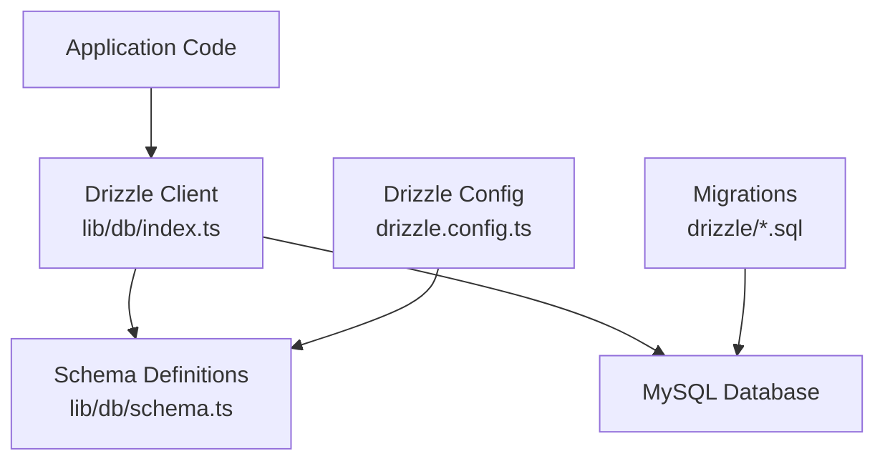
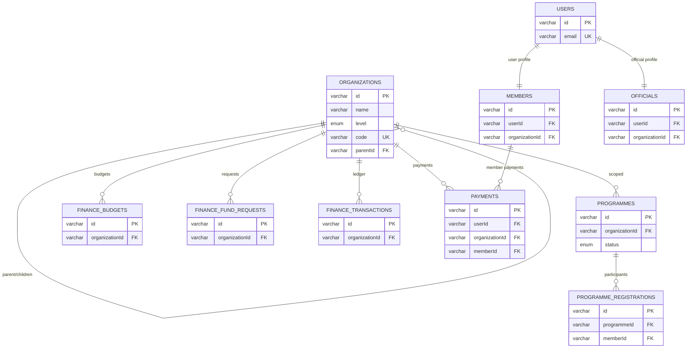
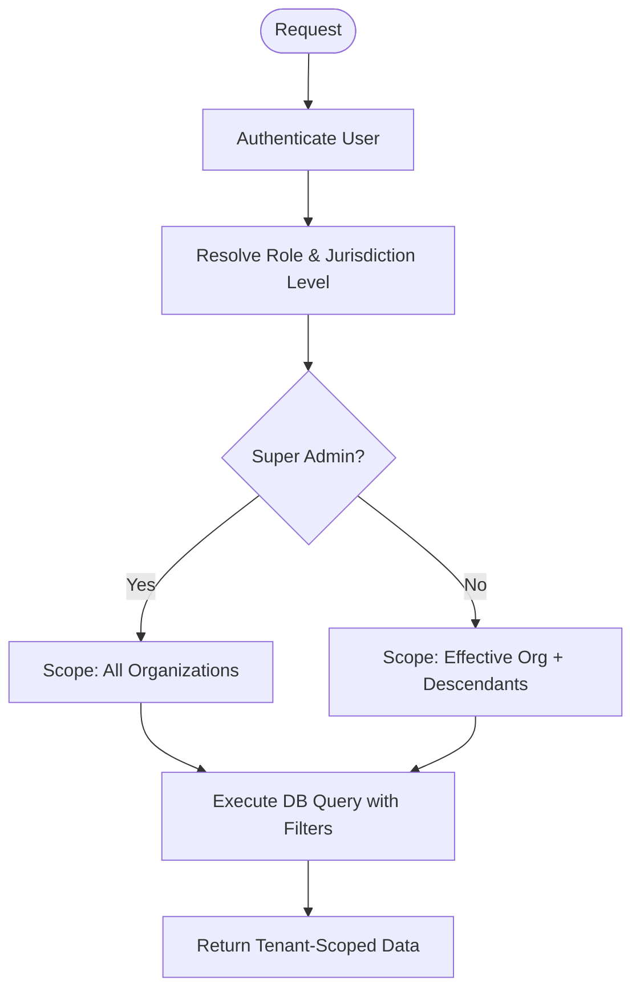
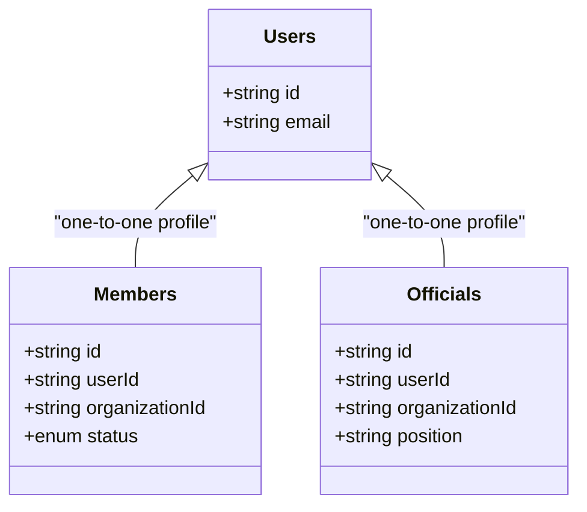
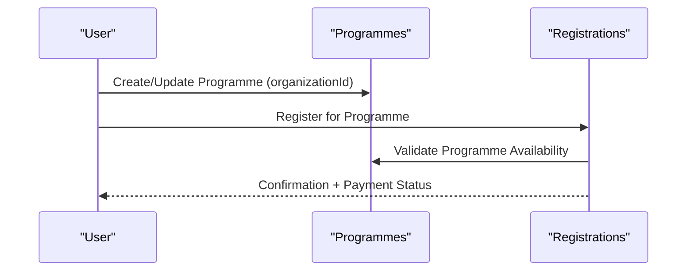
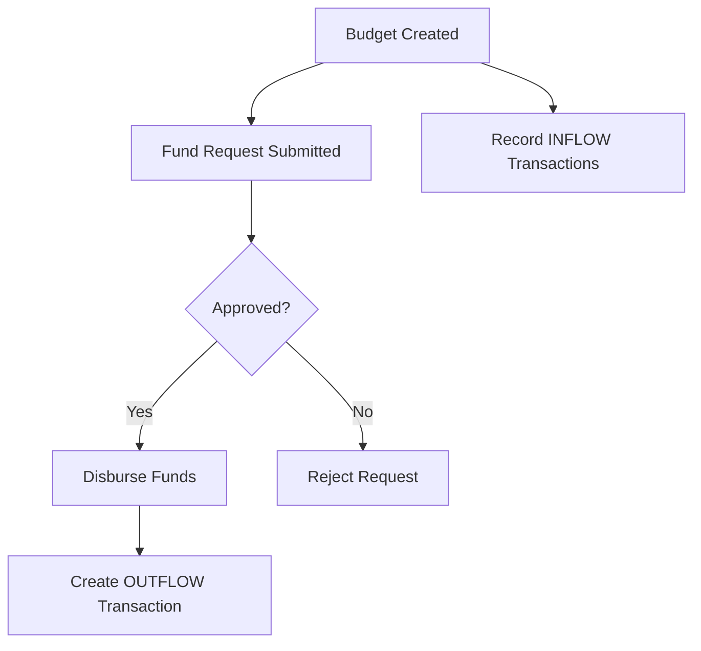
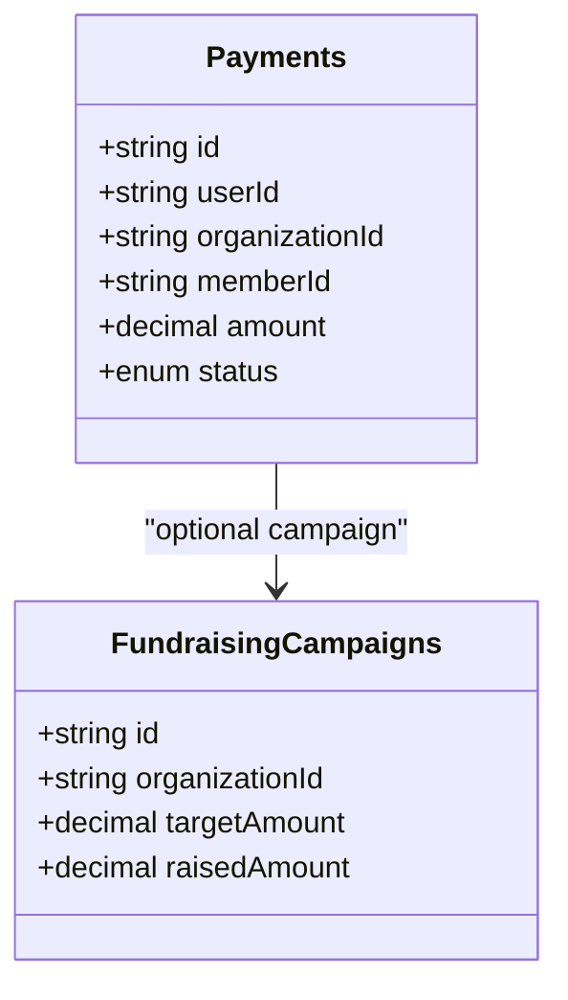
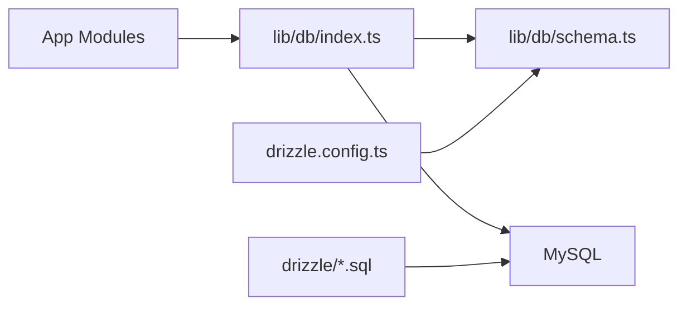
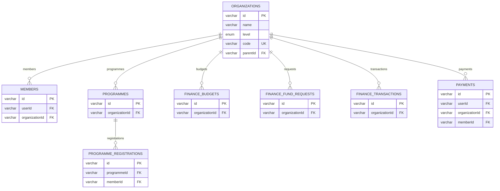

# Database Architecture & Multi-Tenancy

<cite>
**Referenced Files in This Document**
- [drizzle.config.ts](file://drizzle.config.ts)
- [lib/db/index.ts](file://lib/db/index.ts)
- [lib/db/schema.ts](file://lib/db/schema.ts)
- [drizzle/0004_add_programme_report_indexes.sql](file://drizzle/0004_add_programme_report_indexes.sql)
- [scripts/automated-backup.ts](file://scripts/automated-backup.ts)
- [lib/actions/backup.ts](file://lib/actions/backup.ts)
- [scripts/create-backups-table.ts](file://scripts/create-backups-table.ts)
- [app/dashboard/admin/programmes/reports/page.tsx](file://app/dashboard/admin/programmes/reports/page.tsx)
- [lib/actions/analytics.ts](file://lib/actions/analytics.ts)
</cite>

## Table of Contents
1. [Introduction](#introduction)
2. [Project Structure](#project-structure)
3. [Core Components](#core-components)
4. [Architecture Overview](#architecture-overview)
5. [Detailed Component Analysis](#detailed-component-analysis)
6. [Dependency Analysis](#dependency-analysis)
7. [Performance Considerations](#performance-considerations)
8. [Troubleshooting Guide](#troubleshooting-guide)
9. [Conclusion](#conclusion)
10. [Appendices](#appendices)

## Introduction
This document explains the TMC Portal’s multi-tenant database architecture with a focus on jurisdiction-based isolation across National, State, and Local government levels. It details the Drizzle ORM schema design, entity relationships, constraints, indexes, and how organization_id foreign keys enforce data scoping. It also covers financial transactions, members, organizations, programmes, migration strategy, security considerations, backup strategies, and performance techniques for reporting and analytics.

## Project Structure
The database layer is implemented using Drizzle ORM over MySQL:
- Schema definitions live in lib/db/schema.ts
- Database connection and Drizzle client are configured in lib/db/index.ts
- Drizzle configuration points to the schema and output directory in drizzle.config.ts
- Migrations are stored under drizzle/ as SQL files with metadata snapshots
- Reporting and analytics leverage organization hierarchy traversal and indexes

**Diagram sources**
- [lib/db/index.ts:1-17](file://lib/db/index.ts#L1-L17)
- [drizzle.config.ts:1-14](file://drizzle.config.ts#L1-L14)

**Section sources**
- [lib/db/index.ts:1-17](file://lib/db/index.ts#L1-L17)
- [drizzle.config.ts:1-14](file://drizzle.config.ts#L1-L14)

## Core Components
- Organizations: Hierarchical orgs with level (NATIONAL, STATE, LOCAL_GOVERNMENT, BRANCH) and self-referencing parentId for parent-child relationships.
- Members: Linked to users and scoped by organizationId; include membership lifecycle fields.
- Officials: Scoped to organizations with position and term fields.
- Programmes: Scoped to organizations with approval workflow, payment fields, and recurrence support.
- Programme Registrations: Link participants to programmes with payment and attendance tracking.
- Finance: Budgets, fund requests, and transactions all scoped by organizationId; transactions form an immutable ledger.
- Payments: Capture donations, fees, levies, etc., optionally linked to campaigns or burial requests.
- CMS and Content: Posts, pages, galleries scoped per organization.
- Meetings and Attendance: Organized per organization with dynamic groups and attendance tracking.
- Audit and Logs: Track actions with optional organization scoping.

Key multi-tenancy mechanism:
- Every tenant-scoped table includes organizationId as a foreign key to organizations.id.
- Queries must filter by organizationId to ensure strict data isolation.
- Jurisdictional access control is enforced at the application layer via roles and permissions tied to jurisdictionLevel and organization context.

**Section sources**
- [lib/db/schema.ts:148-188](file://lib/db/schema.ts#L148-L188)
- [lib/db/schema.ts:246-271](file://lib/db/schema.ts#L246-L271)
- [lib/db/schema.ts:273-302](file://lib/db/schema.ts#L273-L302)
- [lib/db/schema.ts:1017-1089](file://lib/db/schema.ts#L1017-L1089)
- [lib/db/schema.ts:1091-1150](file://lib/db/schema.ts#L1091-L1150)
- [lib/db/schema.ts:1195-1264](file://lib/db/schema.ts#L1195-L1264)
- [lib/db/schema.ts:352-391](file://lib/db/schema.ts#L352-L391)

## Architecture Overview
The system uses a single shared database with logical multi-tenancy via organization_id. The organization hierarchy supports National → State → Local Government → Branch. Access control layers restrict visibility and operations based on user roles and jurisdiction levels.

**Diagram sources**
- [lib/db/schema.ts:148-188](file://lib/db/schema.ts#L148-L188)
- [lib/db/schema.ts:246-271](file://lib/db/schema.ts#L246-L271)
- [lib/db/schema.ts:273-302](file://lib/db/schema.ts#L273-L302)
- [lib/db/schema.ts:1017-1089](file://lib/db/schema.ts#L1017-L1089)
- [lib/db/schema.ts:1091-1150](file://lib/db/schema.ts#L1091-L1150)
- [lib/db/schema.ts:1195-1264](file://lib/db/schema.ts#L1195-L1264)
- [lib/db/schema.ts:352-391](file://lib/db/schema.ts#L352-L391)

## Detailed Component Analysis

### Multi-Tenancy and Jurisdiction-Based Isolation
- Organization hierarchy: organizations.parentId creates a tree enabling roll-up queries from branches to states to national.
- Data scoping: All tenant-scoped tables include organizationId foreign keys to organizations.id.
- Access control: Roles have jurisdictionLevel; application logic filters queries by effective organization context derived from session and role.

**Diagram sources**
- [lib/actions/analytics.ts:193-214](file://lib/actions/analytics.ts#L193-L214)
- [app/dashboard/admin/programmes/reports/page.tsx:50-78](file://app/dashboard/admin/programmes/reports/page.tsx#L50-L78)

**Section sources**
- [lib/db/schema.ts:148-188](file://lib/db/schema.ts#L148-L188)
- [lib/actions/analytics.ts:193-214](file://lib/actions/analytics.ts#L193-L214)
- [app/dashboard/admin/programmes/reports/page.tsx:50-78](file://app/dashboard/admin/programmes/reports/page.tsx#L50-L78)

### Members, Users, Officials
- Members link to users and are scoped to organizations; include membership lifecycle and metadata.
- Officials link to users and organizations with position and term management.
- Relationships enable querying member counts, official appointments, and approvals within jurisdictions.

**Diagram sources**
- [lib/db/schema.ts:83-105](file://lib/db/schema.ts#L83-L105)
- [lib/db/schema.ts:246-271](file://lib/db/schema.ts#L246-L271)
- [lib/db/schema.ts:273-302](file://lib/db/schema.ts#L273-L302)

**Section sources**
- [lib/db/schema.ts:83-105](file://lib/db/schema.ts#L83-L105)
- [lib/db/schema.ts:246-271](file://lib/db/schema.ts#L246-L271)
- [lib/db/schema.ts:273-302](file://lib/db/schema.ts#L273-L302)

### Programmes and Registrations
- Programmes are scoped to organizations with approval workflows, payment options, and recurrence.
- Programme registrations capture participant info, payment status, and attendance.
- Bulk registration groups allow paymasters to register multiple attendees with a single payment.

**Diagram sources**
- [lib/db/schema.ts:1017-1089](file://lib/db/schema.ts#L1017-L1089)
- [lib/db/schema.ts:1091-1150](file://lib/db/schema.ts#L1091-L1150)

**Section sources**
- [lib/db/schema.ts:1017-1089](file://lib/db/schema.ts#L1017-L1089)
- [lib/db/schema.ts:1091-1150](file://lib/db/schema.ts#L1091-L1150)

### Financial Transactions, Budgets, Fund Requests
- Finance budgets define planned spending per organization/year.
- Fund requests manage approval workflows for expenditures.
- Finance transactions form an immutable ledger with type (INFLOW/OUTFLOW), amount, category, and performer audit fields.

**Diagram sources**
- [lib/db/schema.ts:1195-1264](file://lib/db/schema.ts#L1195-L1264)

**Section sources**
- [lib/db/schema.ts:1195-1264](file://lib/db/schema.ts#L1195-L1264)

### Payments and Campaigns
- Payments record monetary events with currency, status, and references to members, users, campaigns, or burial requests.
- Fundraising campaigns are scoped to organizations with targets and progress tracking.

**Diagram sources**
- [lib/db/schema.ts:352-391](file://lib/db/schema.ts#L352-L391)

**Section sources**
- [lib/db/schema.ts:352-391](file://lib/db/schema.ts#L352-L391)

### CMS, Meetings, and Attachments
- Posts and pages are scoped to organizations with publishing controls.
- Meetings support scheduling, online links, series/recurrence, and attendance tracking.
- Documents and gallery images attach to content with organization scoping.

**Section sources**
- [lib/db/schema.ts:211-227](file://lib/db/schema.ts#L211-L227)
- [lib/db/schema.ts:1002-1015](file://lib/db/schema.ts#L1002-L1015)
- [lib/db/schema.ts:918-1000](file://lib/db/schema.ts#L918-L1000)

## Dependency Analysis
- Drizzle ORM connects to MySQL via mysql2 pool; schema is imported into the client.
- Migrations in drizzle/ evolve the schema; metadata snapshots track state.
- Application modules depend on schema-defined relations for typed queries and joins.

**Diagram sources**
- [lib/db/index.ts:1-17](file://lib/db/index.ts#L1-L17)
- [drizzle.config.ts:1-14](file://drizzle.config.ts#L1-L14)

**Section sources**
- [lib/db/index.ts:1-17](file://lib/db/index.ts#L1-L17)
- [drizzle.config.ts:1-14](file://drizzle.config.ts#L1-L14)

## Performance Considerations
- Indexes:
  - Programme report rollup indexes optimize cross-org reporting and filtering by date/status.
  - Unique indexes on slugs and codes prevent collisions and speed lookups.
- Query patterns:
  - Use organizationId filters consistently to avoid full scans.
  - Leverage hierarchical traversal only when necessary; cache results where appropriate.
- Storage:
  - JSON fields store flexible metadata but should be used judiciously to maintain queryability.
- Connection pooling:
  - mysql2 pool configured in lib/db/index.ts improves concurrency and reduces overhead.

**Section sources**
- [drizzle/0004_add_programme_report_indexes.sql:1-7](file://drizzle/0004_add_programme_report_indexes.sql#L1-L7)
- [lib/db/index.ts:1-17](file://lib/db/index.ts#L1-L17)

## Troubleshooting Guide
- Backup failures:
  - Automated backups log errors and persist failed records; check logs and S3 retention policies.
  - Ensure mysqldump credentials and endpoints are correct; verify local archive and cloud upload steps.
- Migration issues:
  - Review Drizzle metadata snapshots and migration SQL files; apply migrations in order.
- Access control problems:
  - Verify user roles and jurisdictionLevel; confirm effective organization resolution in analytics/reporting flows.

**Section sources**
- [scripts/automated-backup.ts:165-200](file://scripts/automated-backup.ts#L165-L200)
- [scripts/automated-backup.ts:184-200](file://scripts/automated-backup.ts#L184-L200)
- [lib/actions/backup.ts:137-161](file://lib/actions/backup.ts#L137-L161)
- [scripts/create-backups-table.ts:1-26](file://scripts/create-backups-table.ts#L1-L26)

## Conclusion
The TMC Portal implements robust multi-tenancy through organization-scoped entities and hierarchical relationships. Drizzle ORM provides a strongly-typed schema with clear relations and constraints. Financial ledgers, programme workflows, and CMS features are all isolated by organizationId. Migrations are versioned and auditable, while automated backups ensure resilience. With targeted indexes and consistent scoping, the database supports efficient reporting and analytics across National, State, and Local government levels.

## Appendices

### Entity Relationship Diagram (Key Tables)

**Diagram sources**
- [lib/db/schema.ts:148-188](file://lib/db/schema.ts#L148-L188)
- [lib/db/schema.ts:246-271](file://lib/db/schema.ts#L246-L271)
- [lib/db/schema.ts:1017-1089](file://lib/db/schema.ts#L1017-L1089)
- [lib/db/schema.ts:1091-1150](file://lib/db/schema.ts#L1091-L1150)
- [lib/db/schema.ts:1195-1264](file://lib/db/schema.ts#L1195-L1264)
- [lib/db/schema.ts:352-391](file://lib/db/schema.ts#L352-L391)

### Migration Strategy and Version Management
- Drizzle migrations are stored as SQL files under drizzle/ with corresponding metadata snapshots.
- Apply migrations sequentially; use Drizzle CLI to generate and run migrations against the MySQL instance.
- Maintain rollback plans by keeping prior snapshots and migration scripts.

**Section sources**
- [drizzle.config.ts:1-14](file://drizzle.config.ts#L1-L14)

### Security and Backup Strategies
- Security:
  - Enforce organizationId filters in all queries to prevent cross-tenant data leakage.
  - Use roles and jurisdictionLevel to limit access to sensitive operations.
  - Store sensitive settings encrypted where applicable and restrict admin endpoints.
- Backups:
  - Automated backups dump the database and zip uploads, then persist locally and upload to S3-compatible storage.
  - Retention policy cleans up old backups after a defined period.
  - Backup records are persisted in the backups table for auditability.

**Section sources**
- [scripts/automated-backup.ts:1-238](file://scripts/automated-backup.ts#L1-L238)
- [lib/actions/backup.ts:137-161](file://lib/actions/backup.ts#L137-L161)
- [scripts/create-backups-table.ts:1-26](file://scripts/create-backups-table.ts#L1-L26)

### Reporting and Analytics Across Jurisdictions
- Hierarchical traversal:
  - Reports collect descendant organizations from a base org to aggregate metrics across State and Local levels.
- Index usage:
  - Programme indexes accelerate filtering by organization, date, and status for roll-ups.
- Access control:
  - Super admins can view all jurisdictions; others see only their effective scope.

**Section sources**
- [app/dashboard/admin/programmes/reports/page.tsx:50-78](file://app/dashboard/admin/programmes/reports/page.tsx#L50-L78)
- [drizzle/0004_add_programme_report_indexes.sql:1-7](file://drizzle/0004_add_programme_report_indexes.sql#L1-L7)
- [lib/actions/analytics.ts:193-214](file://lib/actions/analytics.ts#L193-L214)