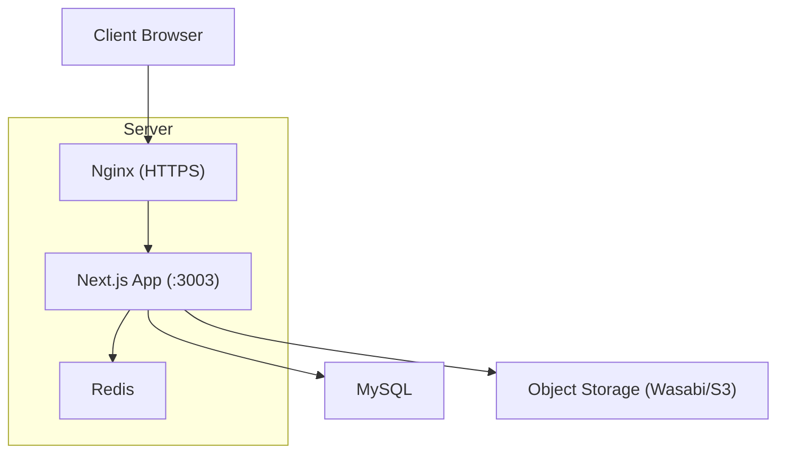
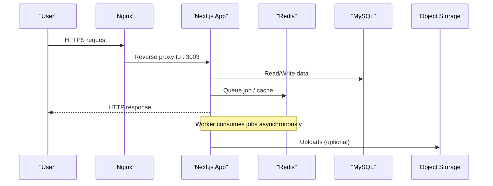
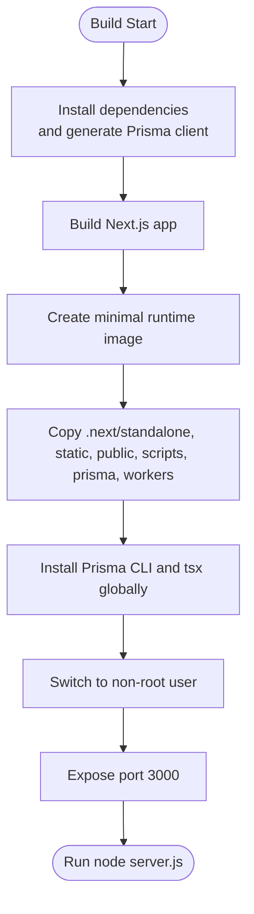
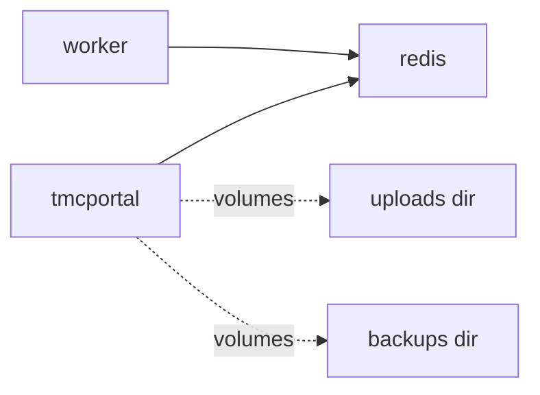
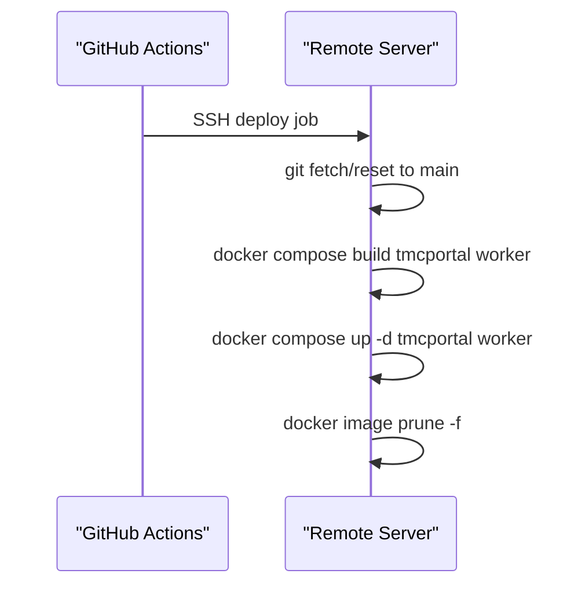
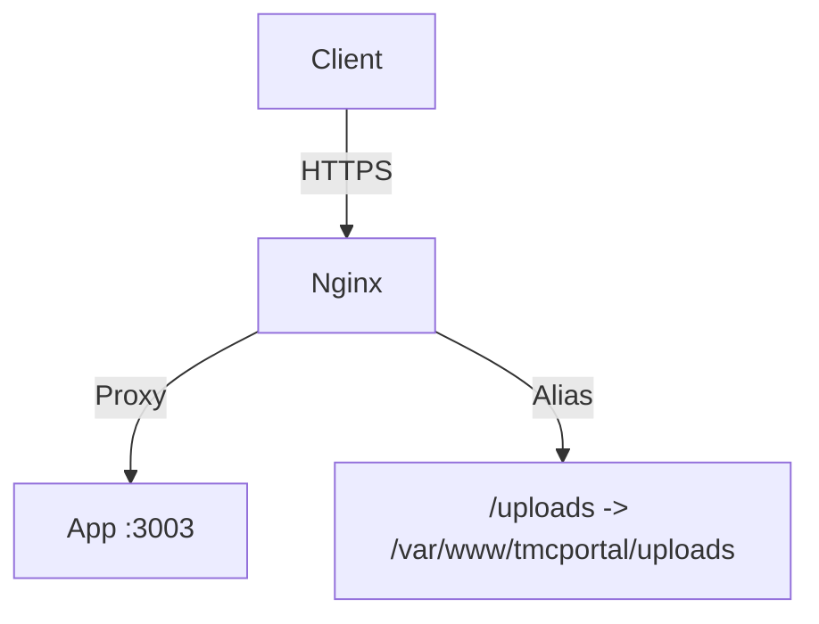
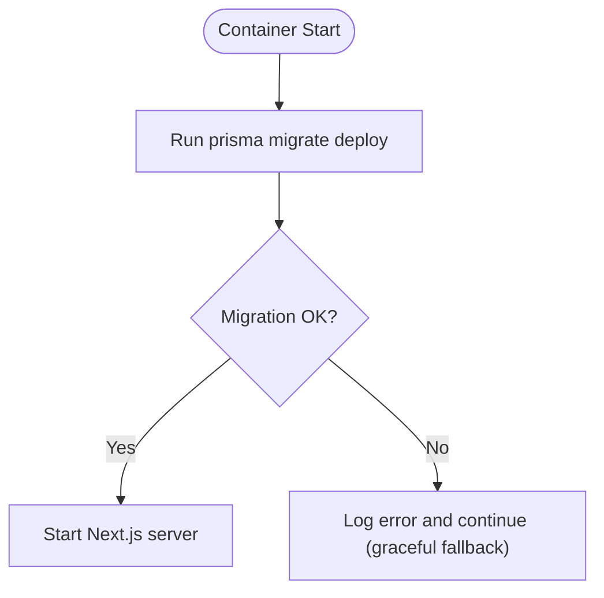
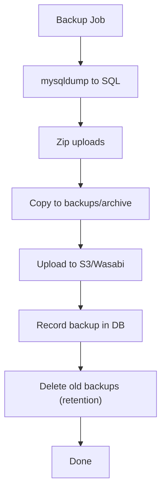
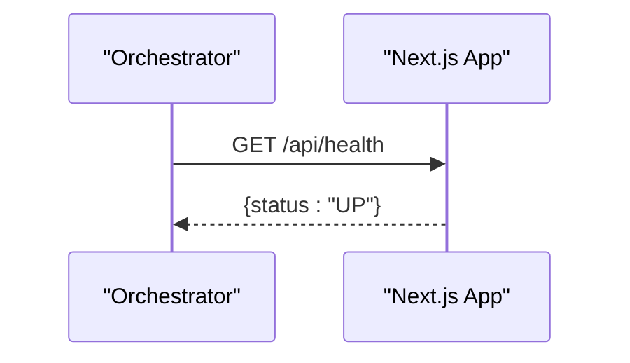
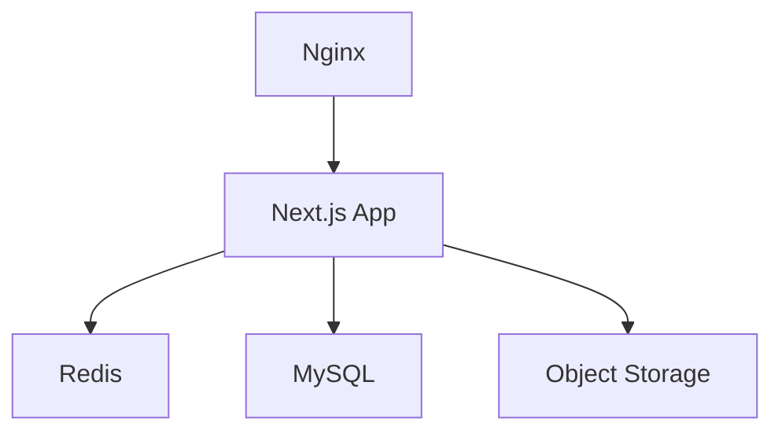

# Deployment Architecture & Infrastructure

<cite>
**Referenced Files in This Document**
- [Dockerfile](file://Dockerfile)
- [docker-compose.yml](file://docker-compose.yml)
- [deploy.yml](file://.github/workflows/deploy.yml)
- [nginx_full_remote.conf](file://nginx_full_remote.conf)
- [nginx_tmcng.conf](file://nginx_tmcng.conf)
- [DEPLOYMENT_GUIDE_SERVER.md](file://DEPLOYMENT_GUIDE_SERVER.md)
- [MYSQL_SETUP.md](file://MYSQL_SETUP.md)
- [automated-backup.ts](file://scripts/automated-backup.ts)
- [redis.ts](file://lib/redis.ts)
- [route.ts](file://app/api/health/route.ts)
</cite>

## Table of Contents
1. [Introduction](#introduction)
2. [Project Structure](#project-structure)
3. [Core Components](#core-components)
4. [Architecture Overview](#architecture-overview)
5. [Detailed Component Analysis](#detailed-component-analysis)
6. [Dependency Analysis](#dependency-analysis)
7. [Performance Considerations](#performance-considerations)
8. [Troubleshooting Guide](#troubleshooting-guide)
9. [Conclusion](#conclusion)
10. [Appendices](#appendices)

## Introduction
This document describes the deployment and infrastructure architecture for the TMC Portal. It covers containerized deployment with Docker, multi-stage builds, optimized images, CI/CD via GitHub Actions, production Nginx configuration with SSL termination and reverse proxy, database strategy using MySQL with automated backups, scaling considerations (horizontal scaling, load balancing, caching), monitoring and logging, disaster recovery procedures, and environment variable management across environments.

## Project Structure
The deployment stack is composed of:
- A Next.js application built as a standalone server inside a minimal runtime image
- Redis for background jobs and caching
- Nginx as an edge reverse proxy handling HTTPS and static assets
- MySQL as the primary data store
- GitHub Actions to automate deployments to a remote server
- Automated backup scripts that archive database dumps and uploads to local and cloud storage

**Diagram sources**
- [nginx_full_remote.conf:129-165](file://nginx_full_remote.conf#L129-L165)
- [docker-compose.yml:3-35](file://docker-compose.yml#L3-L35)
- [redis.ts:1-9](file://lib/redis.ts#L1-L9)
- [MYSQL_SETUP.md:1-60](file://MYSQL_SETUP.md#L1-L60)

**Section sources**
- [Dockerfile:1-95](file://Dockerfile#L1-L95)
- [docker-compose.yml:1-69](file://docker-compose.yml#L1-L69)
- [nginx_full_remote.conf:1-187](file://nginx_full_remote.conf#L1-L187)
- [nginx_tmcng.conf:1-59](file://nginx_tmcng.conf#L1-L59)
- [DEPLOYMENT_GUIDE_SERVER.md:1-145](file://DEPLOYMENT_GUIDE_SERVER.md#L1-L145)
- [MYSQL_SETUP.md:1-127](file://MYSQL_SETUP.md#L1-L127)

## Core Components
- Containerized Application: Multi-stage Docker build producing a small runtime image with Prisma client and workers preinstalled.
- Reverse Proxy: Nginx terminates TLS, proxies requests to the app, and serves uploaded files directly.
- Background Workers: Separate container running email worker tasks via Redis.
- Database: MySQL with migrations applied at startup; schema defined in Prisma and Drizzle.
- Backups: Automated script performs mysqldump, zips uploads, archives locally, and uploads to object storage with retention policies.
- Health Check: Lightweight endpoint used by orchestration to verify readiness.

**Section sources**
- [Dockerfile:14-95](file://Dockerfile#L14-L95)
- [docker-compose.yml:3-69](file://docker-compose.yml#L3-L69)
- [nginx_full_remote.conf:129-187](file://nginx_full_remote.conf#L129-L187)
- [automated-backup.ts:86-238](file://scripts/automated-backup.ts#L86-L238)
- [route.ts:1-6](file://app/api/health/route.ts#L1-L6)

## Architecture Overview
End-to-end request flow from browser to application and data stores, including background processing and backups.

**Diagram sources**
- [nginx_full_remote.conf:129-165](file://nginx_full_remote.conf#L129-L165)
- [docker-compose.yml:3-69](file://docker-compose.yml#L3-L69)
- [redis.ts:1-9](file://lib/redis.ts#L1-L9)
- [MYSQL_SETUP.md:1-60](file://MYSQL_SETUP.md#L1-L60)
- [automated-backup.ts:122-182](file://scripts/automated-backup.ts#L122-L182)

## Detailed Component Analysis

### Containerization and Image Optimization
- Multi-stage build separates dependency installation, build, and runtime to minimize image size.
- Runtime stage includes only necessary artifacts: standalone Next.js output, static assets, public directory, Prisma client, workers, and required scripts.
- Non-root user for security; tools like Prisma CLI and tsx installed globally for migrations and workers.
- Environment variables are injected at runtime; build-time args include public keys needed during generation/build.

**Diagram sources**
- [Dockerfile:14-95](file://Dockerfile#L14-L95)

**Section sources**
- [Dockerfile:1-95](file://Dockerfile#L1-L95)

### Docker Compose Services
- tmcportal: Runs the Next.js app, applies migrations on start, exposes health checks, mounts volumes for uploads and backups, and depends on Redis.
- worker: Runs email worker consuming jobs from Redis.
- redis: Persistent Redis instance with named volume.
- External network app_network is expected to connect other services (e.g., MySQL).

**Diagram sources**
- [docker-compose.yml:3-69](file://docker-compose.yml#L3-L69)

**Section sources**
- [docker-compose.yml:1-69](file://docker-compose.yml#L1-L69)

### CI/CD Pipeline (GitHub Actions)
- Triggered on push to master/main.
- Connects to the server via SSH, pulls latest code, rebuilds containers, starts services, and prunes unused images.

**Diagram sources**
- [deploy.yml:1-26](file://.github/workflows/deploy.yml#L1-L26)

**Section sources**
- [deploy.yml:1-26](file://.github/workflows/deploy.yml#L1-L26)

### Production Nginx Configuration
- TLS termination managed by Certbot with certificates stored under /etc/letsencrypt.
- Reverse proxy forwards traffic to the Next.js app on localhost:3003.
- Static uploads served directly from disk with caching headers and access logs disabled for performance.
- HTTP to HTTPS redirects enforced.

**Diagram sources**
- [nginx_tmcng.conf:1-59](file://nginx_tmcng.conf#L1-L59)
- [nginx_full_remote.conf:129-187](file://nginx_full_remote.conf#L129-L187)

**Section sources**
- [nginx_full_remote.conf:1-187](file://nginx_full_remote.conf#L1-L187)
- [nginx_tmcng.conf:1-59](file://nginx_tmcng.conf#L1-L59)

### Database Strategy and Migrations
- MySQL is the configured provider; connection string provided via DATABASE_URL.
- Migrations are applied at container startup via Prisma migrate deploy.
- Schema is maintained in both Prisma and Drizzle; migration lock indicates MySQL provider.

**Diagram sources**
- [docker-compose.yml:21-22](file://docker-compose.yml#L21-L22)
- [MYSQL_SETUP.md:1-60](file://MYSQL_SETUP.md#L1-L60)

**Section sources**
- [MYSQL_SETUP.md:1-127](file://MYSQL_SETUP.md#L1-L127)
- [docker-compose.yml:21-22](file://docker-compose.yml#L21-L22)

### Backup Automation and Disaster Recovery
- Automated backup script:
  - Dumps MySQL using mysqldump based on DATABASE_URL.
  - Zips uploads directory if present.
  - Archives locally under backups/archive with retention policy.
  - Uploads to object storage (Wasabi/S3) with private ACLs.
  - Records backup metadata in the database and cleans temp files.
- Disaster recovery steps:
  - Restore database from SQL dump.
  - Restore uploads from zip archive.
  - Verify integrity and restart services.

**Diagram sources**
- [automated-backup.ts:86-238](file://scripts/automated-backup.ts#L86-L238)

**Section sources**
- [automated-backup.ts:1-238](file://scripts/automated-backup.ts#L1-L238)

### Monitoring and Health Checks
- Health endpoint returns a simple status JSON for readiness probes.
- Docker healthcheck uses wget to probe /api/health periodically.

**Diagram sources**
- [route.ts:1-6](file://app/api/health/route.ts#L1-L6)
- [docker-compose.yml:31-35](file://docker-compose.yml#L31-L35)

**Section sources**
- [route.ts:1-6](file://app/api/health/route.ts#L1-L6)
- [docker-compose.yml:31-35](file://docker-compose.yml#L31-L35)

### Logging
- Nginx access/error logs are available per site configuration; uploads location disables access logs for performance.
- Application logs are emitted to stdout/stderr within containers and can be collected by host or external logging systems.

**Section sources**
- [nginx_tmcng.conf:9-14](file://nginx_tmcng.conf#L9-L14)

### Environment Variables and Secrets Management
- Application secrets and configuration are supplied via .env files mounted into containers and passed through docker-compose environment settings.
- Public keys may be provided as build arguments where needed.
- GitHub Actions secrets are used for SSH access to the server.

Key variables observed:
- NODE_ENV, PORT, HOSTNAME
- DATABASE_URL
- AUTH_SECRET, NEXT_PUBLIC_APP_URL
- REDIS_URL
- NEXT_PUBLIC_PAYSTACK_PUBLIC_KEY (build arg)
- WASABI_* / AWS_* (for backups)
- SERVER_IP, SSH_PRIVATE_KEY (GitHub Actions secrets)

**Section sources**
- [DEPLOYMENT_GUIDE_SERVER.md:28-58](file://DEPLOYMENT_GUIDE_SERVER.md#L28-L58)
- [docker-compose.yml:9-22](file://docker-compose.yml#L9-L22)
- [deploy.yml:13-25](file://.github/workflows/deploy.yml#L13-L25)
- [automated-backup.ts:12-28](file://scripts/automated-backup.ts#L12-L28)

## Dependency Analysis
Runtime dependencies and service interactions:

**Diagram sources**
- [docker-compose.yml:3-69](file://docker-compose.yml#L3-L69)
- [redis.ts:1-9](file://lib/redis.ts#L1-L9)
- [MYSQL_SETUP.md:1-60](file://MYSQL_SETUP.md#L1-L60)
- [nginx_full_remote.conf:129-165](file://nginx_full_remote.conf#L129-L165)

**Section sources**
- [docker-compose.yml:1-69](file://docker-compose.yml#L1-L69)
- [redis.ts:1-9](file://lib/redis.ts#L1-L9)
- [MYSQL_SETUP.md:1-127](file://MYSQL_SETUP.md#L1-L127)
- [nginx_full_remote.conf:1-187](file://nginx_full_remote.conf#L1-L187)

## Performance Considerations
- Use Nginx to serve static uploads directly with caching headers to reduce app load.
- Keep the runtime image minimal to improve startup time and resource usage.
- Offload heavy tasks to background workers via Redis queues.
- Ensure database indexes are appropriate for query patterns (schema-driven via Prisma/Drizzle).
- Consider enabling compression at Nginx layer for text responses.
- Monitor memory and CPU usage; scale horizontally by adding more app replicas behind a load balancer when needed.

[No sources needed since this section provides general guidance]

## Troubleshooting Guide
- Port conflicts: If another service uses the same port, adjust PORT in .env and update Nginx proxy_pass accordingly.
- Database connectivity: Validate DATABASE_URL and ensure MySQL is reachable from the app container; connect DB container to app_network if applicable.
- Migration failures: Re-run migrations manually inside the container; check logs for errors.
- Nginx config issues: Test configuration with nginx -t and reload after changes.
- Health checks failing: Inspect /api/health endpoint and container logs.

**Section sources**
- [DEPLOYMENT_GUIDE_SERVER.md:109-145](file://DEPLOYMENT_GUIDE_SERVER.md#L109-L145)
- [docker-compose.yml:31-35](file://docker-compose.yml#L31-L35)

## Conclusion
The TMC Portal is deployed as a containerized Next.js application with Redis-backed background processing, MySQL persistence, and Nginx-based TLS termination and reverse proxying. CI/CD automates deployments to production, while robust backup automation ensures data resilience. The architecture supports horizontal scaling and can be extended with additional caches and load balancers to meet growing demand.

[No sources needed since this section summarizes without analyzing specific files]

## Appendices

### Scaling Considerations
- Horizontal scaling: Run multiple app containers behind a reverse proxy or load balancer; share Redis and MySQL endpoints.
- Load balancing: Distribute traffic across app instances; ensure sticky sessions if stateful features are used.
- Caching strategies: Use Redis for session/cache layers; leverage Nginx caching for static assets and API responses where appropriate.

[No sources needed since this section provides general guidance]