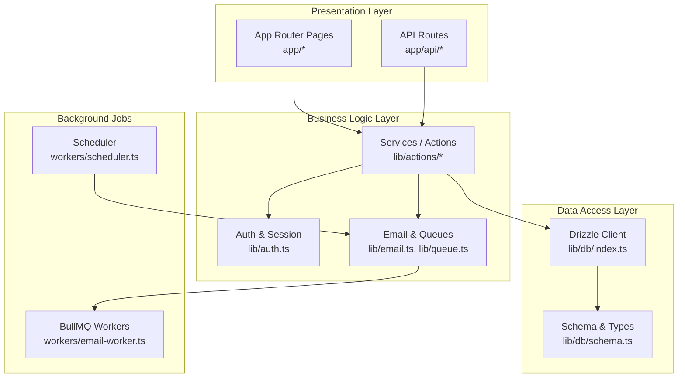
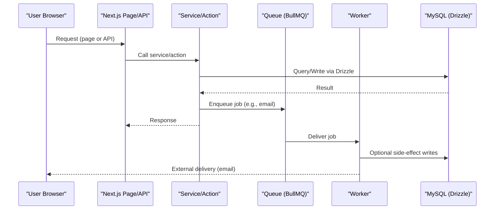
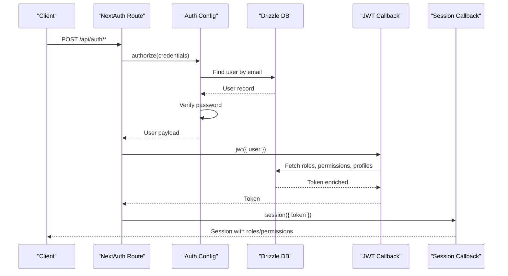
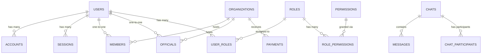
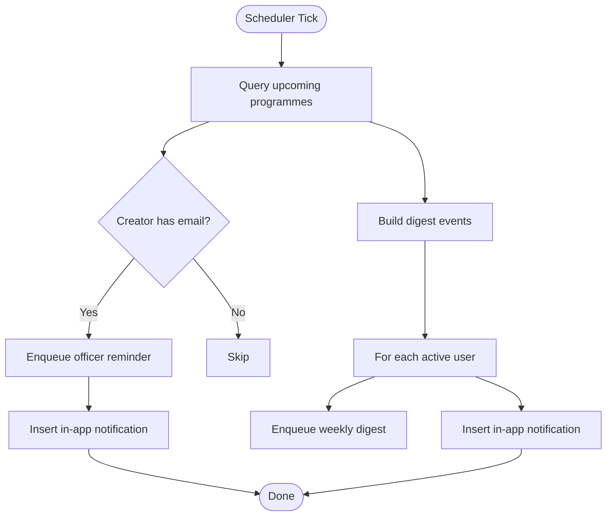
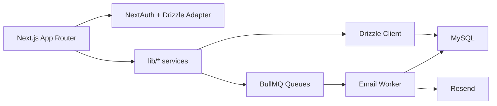

# System Architecture & Design Patterns

<cite>
**Referenced Files in This Document**
- [package.json](file://package.json)
- [next.config.ts](file://next.config.ts)
- [drizzle.config.ts](file://drizzle.config.ts)
- [app/layout.tsx](file://app/layout.tsx)
- [lib/auth.ts](file://lib/auth.ts)
- [lib/db/schema.ts](file://lib/db/schema.ts)
- [lib/db/index.ts](file://lib/db/index.ts)
- [workers/email-worker.ts](file://workers/email-worker.ts)
- [workers/scheduler.ts](file://workers/scheduler.ts)
- [lib/queue.ts](file://lib/queue.ts)
- [lib/email.ts](file://lib/email.ts)
- [app/api/auth/[...nextauth]/route.ts](file://app/api/auth/[...nextauth]/route.ts)
</cite>

## Table of Contents
1. Introduction
2. Project Structure
3. Core Components
4. Architecture Overview
5. Detailed Component Analysis
6. Dependency Analysis
7. Performance Considerations
8. Troubleshooting Guide
9. Conclusion

## Introduction
This document explains the TMC Portal’s system architecture and design patterns with a focus on:
- Layered architecture separating presentation (Next.js App Router), business logic (lib services/actions), and data access (Drizzle ORM).
- Component-based architecture using React Server Components and Client Components, with guidance on when to use each.
- Service layer pattern encapsulating reusable business logic.
- Repository-like patterns for database operations via Drizzle.
- Event-driven architecture for background jobs and real-time features using BullMQ queues and workers.
- Modular component organization by feature under components/.
- Cross-cutting concerns: error handling, logging, and performance optimization strategies.

## Project Structure
The application is a Next.js 16 project with an App Router structure:
- app/: Routes, layouts, and pages. API routes live under app/api/.
- lib/: Business logic, utilities, DB client, auth configuration, queues, email, RBAC, etc.
- components/: Feature-based UI components grouped by domain (admin, programmes, meetings, chat, etc.).
- workers/: Background job consumers and scheduled tasks.
- drizzle/: Migration files and schema definitions used by Drizzle.
- prisma/: Legacy Prisma assets retained alongside Drizzle migration history.

**Diagram sources**
- [app/layout.tsx:42-63](file://app/layout.tsx#L42-L63)
- [lib/auth.ts:131-257](file://lib/auth.ts#L131-L257)
- [lib/db/index.ts:1-17](file://lib/db/index.ts#L1-L17)
- [lib/db/schema.ts:83-800](file://lib/db/schema.ts#L83-L800)
- [lib/email.ts:21-92](file://lib/email.ts#L21-L92)
- [lib/queue.ts:1-19](file://lib/queue.ts#L1-L19)
- [workers/email-worker.ts:1-32](file://workers/email-worker.ts#L1-L32)
- [workers/scheduler.ts:12-51](file://workers/scheduler.ts#L12-L51)

**Section sources**
- [package.json:1-127](file://package.json#L1-L127)
- [next.config.ts:1-41](file://next.config.ts#L1-L41)

## Core Components
- Root layout and providers: The root layout initializes global providers, session retrieval, analytics, and UI toasts. It demonstrates server-side session loading and client provider injection.
- Authentication: NextAuth v5 configured with Drizzle adapter, credentials provider, JWT strategy, and token/session callbacks that enrich sessions with roles, permissions, member/official profiles, and impersonation context.
- Data access: Drizzle client initialized with MySQL pool and typed schema; migrations stored under drizzle/.
- Email and queues: Centralized email sending with Resend, dev-mode fallback, and audit logging; BullMQ queues for email and notifications; worker process consumes jobs; scheduler runs periodic tasks.

Key responsibilities:
- Presentation: Route handlers and page components render UI and call server actions or API routes.
- Business logic: Reusable functions in lib/actions and lib/* implement workflows like membership approval, payments, programme management, and notifications.
- Data access: Drizzle queries and relations define the repository-like boundary over MySQL.

**Section sources**
- [app/layout.tsx:42-63](file://app/layout.tsx#L42-L63)
- [lib/auth.ts:131-257](file://lib/auth.ts#L131-L257)
- [lib/db/index.ts:1-17](file://lib/db/index.ts#L1-L17)
- [lib/db/schema.ts:83-800](file://lib/db/schema.ts#L83-L800)
- [lib/email.ts:21-92](file://lib/email.ts#L21-L92)
- [lib/queue.ts:1-19](file://lib/queue.ts#L1-L19)
- [workers/email-worker.ts:1-32](file://workers/email-worker.ts#L1-L32)
- [workers/scheduler.ts:12-51](file://workers/scheduler.ts#L12-L51)

## Architecture Overview
The TMC Portal follows a layered architecture:
- Presentation Layer (Next.js App Router): Pages and API routes handle requests and responses. Server Components fetch data directly from services; Client Components manage interactivity.
- Business Logic Layer (lib): Services and actions encapsulate domain rules, orchestrate flows, and coordinate external integrations (email, payments, LiveKit).
- Data Access Layer (Drizzle ORM): Typed schema and client provide consistent CRUD and relational queries.

**Diagram sources**
- [app/api/auth/[...nextauth]/route.ts:1-8](file://app/api/auth/[...nextauth]/route.ts#L1-L8)
- [lib/auth.ts:131-257](file://lib/auth.ts#L131-L257)
- [lib/queue.ts:1-19](file://lib/queue.ts#L1-L19)
- [workers/email-worker.ts:10-24](file://workers/email-worker.ts#L10-L24)
- [lib/db/index.ts:1-17](file://lib/db/index.ts#L1-L17)

## Detailed Component Analysis

### Authentication and Session Flow
Authentication uses NextAuth v5 with Drizzle adapter and JWT strategy. On sign-in, credentials are validated, then the JWT callback enriches the token with roles, permissions, member/official profiles, and impersonation state. The session callback mirrors this into the session object for both server and client usage.

**Diagram sources**
- [app/api/auth/[...nextauth]/route.ts:1-8](file://app/api/auth/[...nextauth]/route.ts#L1-L8)
- [lib/auth.ts:146-183](file://lib/auth.ts#L146-L183)
- [lib/auth.ts:189-251](file://lib/auth.ts#L189-L251)

**Section sources**
- [lib/auth.ts:131-257](file://lib/auth.ts#L131-L257)
- [app/api/auth/[...nextauth]/route.ts:1-8](file://app/api/auth/[...nextauth]/route.ts#L1-L8)

### Database Schema and Repository Pattern
The data layer is defined with Drizzle ORM:
- Schema defines tables, enums, and relations across users, organizations, members, officials, roles, permissions, payments, chats, messages, broadcasts, and more.
- The Drizzle client exposes a typed db instance for queries and mutations.
- While not a strict class-based repository, the schema + client act as a repository boundary: services call db methods through well-defined models and relations.

**Diagram sources**
- [lib/db/schema.ts:83-800](file://lib/db/schema.ts#L83-L800)

**Section sources**
- [lib/db/schema.ts:83-800](file://lib/db/schema.ts#L83-L800)
- [lib/db/index.ts:1-17](file://lib/db/index.ts#L1-L17)

### Service Layer Pattern
Business logic is encapsulated in reusable functions under lib/actions and lib/*. Examples include:
- Membership lifecycle, payments, programme management, finance, meetings, reports, settings, and more.
- These functions coordinate multiple data sources, enforce validation, and emit events/jobs (e.g., enqueue emails).

Benefits:
- Single source of truth for domain rules.
- Testable and reusable across API routes and server actions.
- Clear separation from UI concerns.

[No sources needed since this section provides general guidance]

### Event-Driven Background Jobs and Real-Time Features
Event-driven processing is implemented with BullMQ:
- Queues: email-queue and notification-queue defined in lib/queue.ts.
- Worker: workers/email-worker.ts consumes email jobs and sends via Resend, logging outcomes.
- Scheduler: workers/scheduler.ts runs cron tasks for weekly programme reminders, daily continuous reminders, monthly office report nudges, and automated backups.

**Diagram sources**
- [workers/scheduler.ts:53-197](file://workers/scheduler.ts#L53-L197)
- [lib/queue.ts:1-19](file://lib/queue.ts#L1-L19)
- [lib/email.ts:21-92](file://lib/email.ts#L21-L92)

**Section sources**
- [workers/email-worker.ts:1-32](file://workers/email-worker.ts#L1-L32)
- [workers/scheduler.ts:12-51](file://workers/scheduler.ts#L12-L51)
- [workers/scheduler.ts:53-197](file://workers/scheduler.ts#L53-L197)
- [lib/queue.ts:1-19](file://lib/queue.ts#L1-L19)
- [lib/email.ts:21-92](file://lib/email.ts#L21-L92)

### Component-Based Architecture: RSC vs Client Components
- React Server Components (RSC): Preferred for data fetching, rendering static content, and reducing client bundle size. Use in pages/layouts where server-side session and data access are needed.
- Client Components: Used for interactivity (forms, charts, real-time updates). Mark with 'use client' and keep minimal dependencies.

Guidelines:
- Keep heavy logic in lib/services; pass only necessary props to components.
- Prefer server components for initial page renders; hydrate selectively with client components for interactions.
- Use Suspense boundaries for streaming where appropriate.

[No sources needed since this section provides general guidance]

### Modular Component Architecture
Components are organized by feature/domain under components/:
- admin/*: Admin dashboards and tools.
- programmes/*, meetings/*, chat/*, cms/*, finance/*: Domain-specific UI modules.
- ui/*: Shared primitive UI components.
- layout/*: Layout-related components (navbar, sidebar).

This modularization improves maintainability and enables reuse across pages.

[No sources needed since this section provides general guidance]

## Dependency Analysis
High-level dependencies:
- Next.js App Router drives routing and server/client execution model.
- NextAuth integrates with Drizzle adapter for persistence and JWT strategy.
- Drizzle ORM abstracts MySQL interactions with typed schema.
- BullMQ queues decouple long-running tasks (emails, notifications) from request paths.
- Resend handles outbound email delivery; logs persisted to DB.

**Diagram sources**
- [package.json:17-102](file://package.json#L17-L102)
- [lib/auth.ts:131-257](file://lib/auth.ts#L131-L257)
- [lib/db/index.ts:1-17](file://lib/db/index.ts#L1-L17)
- [lib/queue.ts:1-19](file://lib/queue.ts#L1-L19)
- [workers/email-worker.ts:1-32](file://workers/email-worker.ts#L1-L32)
- [lib/email.ts:21-92](file://lib/email.ts#L21-L92)

**Section sources**
- [package.json:17-102](file://package.json#L17-L102)

## Performance Considerations
- Image optimization: Remote image domains configured; unoptimized mode enabled for specific hosts.
- Standalone output: Build output set to standalone for efficient deployment.
- Turbopack: Configuration present; currently using webpack due to Prisma constraints.
- Caching and streaming: Leverage Next.js caching and streaming for faster page loads.
- Database: Use Drizzle relations and selective field projection to minimize query payloads.
- Background jobs: Offload email sending and heavy tasks to workers to reduce request latency.
- Monitoring: Track site visits and email logs for observability.

**Section sources**
- [next.config.ts:11-39](file://next.config.ts#L11-L39)
- [lib/email.ts:21-92](file://lib/email.ts#L21-L92)

## Troubleshooting Guide
Common issues and remedies:
- Authentication failures: Validate credentials flow and ensure email verification status; check custom auth errors thrown during authorization.
- Session enrichment errors: Inspect JWT and session callbacks for role/permission population; verify DB relations exist.
- Email delivery failures: Confirm Resend API key; review email logs for provider errors; ensure worker is running and connected to Redis.
- Scheduler tasks not running: Verify cron expressions and environment; confirm worker process is started and has connectivity to DB and queue.
- Drizzle queries failing: Validate schema types and relation definitions; ensure migrations are applied.

Operational tips:
- Enable detailed logging in development; monitor console and DB logs.
- Use health endpoints to verify service readiness.
- Periodically review email_logs and notifications for anomalies.

**Section sources**
- [lib/auth.ts:146-183](file://lib/auth.ts#L146-L183)
- [lib/auth.ts:189-251](file://lib/auth.ts#L189-L251)
- [lib/email.ts:21-92](file://lib/email.ts#L21-L92)
- [workers/email-worker.ts:10-24](file://workers/email-worker.ts#L10-L24)
- [workers/scheduler.ts:12-51](file://workers/scheduler.ts#L12-L51)

## Conclusion
The TMC Portal employs a clean, scalable architecture:
- Layered separation between presentation, business logic, and data access.
- Strong typing and safety via Drizzle ORM and TypeScript.
- Robust authentication and authorization with NextAuth and role/permission modeling.
- Event-driven background processing for reliability and responsiveness.
- Modular, feature-based components for maintainability.

Adhering to these patterns ensures clarity, testability, and scalability as the portal evolves.