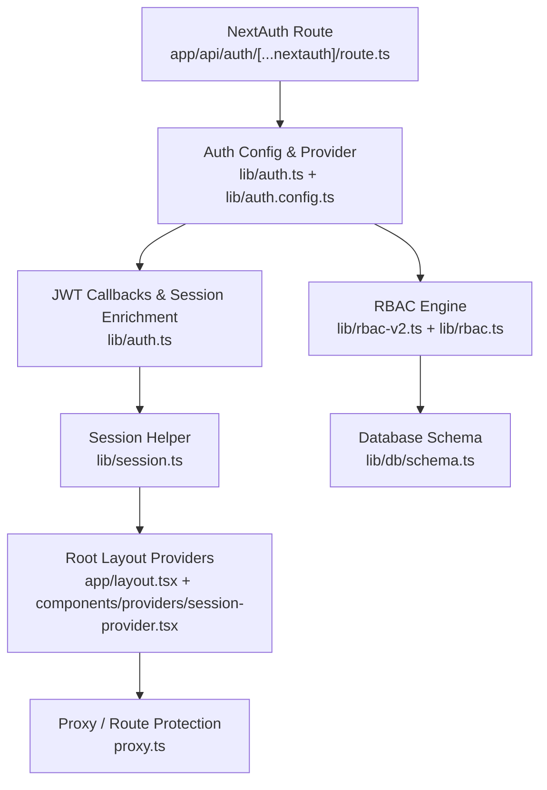
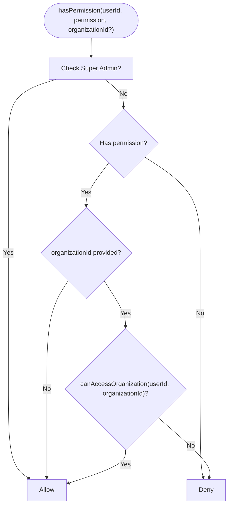
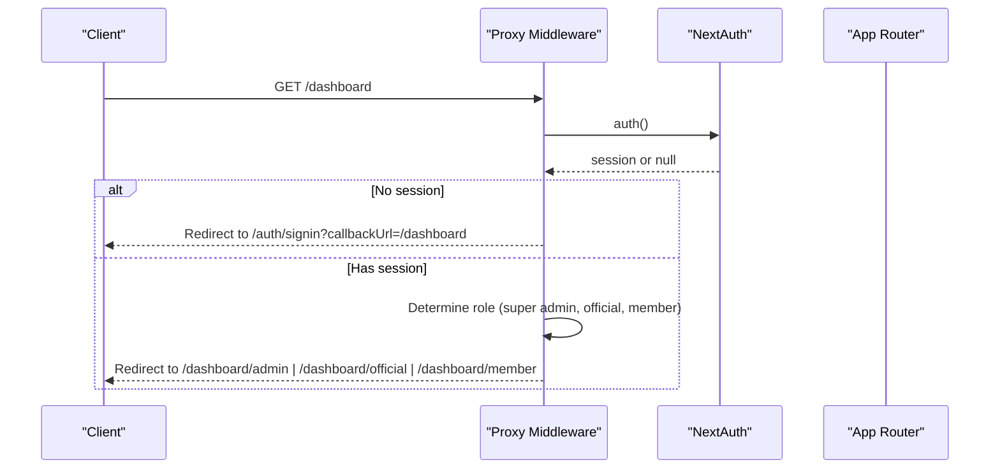
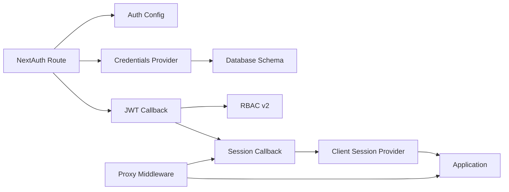

# Authentication & Authorization

<cite>
**Referenced Files in This Document**
- [auth.ts](file://lib/auth.ts)
- [auth.config.ts](file://lib/auth.config.ts)
- [route.ts](file://app/api/auth/[...nextauth]/route.ts)
- [auth.ts](file://auth.ts)
- [session.ts](file://lib/session.ts)
- [rbac-v2.ts](file://lib/rbac-v2.ts)
- [rbac.ts](file://lib/rbac.ts)
- [schema.ts](file://lib/db/schema.ts)
- [next-auth.d.ts](file://types/next-auth.d.ts)
- [layout.tsx](file://app/layout.tsx)
- [session-provider.tsx](file://components/providers/session-provider.tsx)
- [proxy.ts](file://proxy.ts)
- [password-strength.ts](file://lib/password-strength.ts)
- [reset-password.ts](file://scripts/reset-password.ts)
- [debug-auth.ts](file://scripts/debug-auth.ts)
</cite>

## Table of Contents
1. Introduction
2. Project Structure
3. Core Components
4. Architecture Overview
5. Detailed Component Analysis
6. Dependency Analysis
7. Performance Considerations
8. Troubleshooting Guide
9. Conclusion

## Introduction
This document explains the TMC Portal’s multi-layered authentication and authorization system. It covers NextAuth v5 with a custom credentials provider, JWT-based session handling, and a sophisticated Role-Based Access Control (RBAC) engine that enforces permissions across an organizational hierarchy with jurisdiction awareness. You will learn how roles cascade from Super Admin down to regular members, how permissions are evaluated dynamically, and how to protect routes and enforce jurisdiction-scoped access control. Security considerations such as password hashing, session security, and protection against common vulnerabilities are also addressed, along with troubleshooting guidance for common issues.

## Project Structure
The authentication and authorization system is implemented across several layers:
- API entry point for NextAuth handlers
- Server-side configuration and providers
- JWT population and session enrichment
- RBAC utilities for permission checks and jurisdiction enforcement
- Client session provider for UI integration
- Root layout for server session initialization
- Middleware-like proxy for route protection and role-based redirects
- Database schema definitions for users, sessions, organizations, roles, and permissions



**Diagram sources**
- [route.ts:1-8](file://app/api/auth/[...nextauth]/route.ts#L1-L8)
- [auth.ts:131-257](file://lib/auth.ts#L131-L257)
- [auth.config.ts:1-12](file://lib/auth.config.ts#L1-L12)
- [session.ts:1-16](file://lib/session.ts#L1-L16)
- [layout.tsx:42-63](file://app/layout.tsx#L42-L63)
- [session-provider.tsx:1-22](file://components/providers/session-provider.tsx#L1-L22)
- [rbac-v2.ts:1-361](file://lib/rbac-v2.ts#L1-L361)
- [rbac.ts:1-194](file://lib/rbac.ts#L1-L194)
- [schema.ts:83-188](file://lib/db/schema.ts#L83-L188)

**Section sources**
- [route.ts:1-8](file://app/api/auth/[...nextauth]/route.ts#L1-L8)
- [auth.ts:131-257](file://lib/auth.ts#L131-L257)
- [auth.config.ts:1-12](file://lib/auth.config.ts#L1-L12)
- [session.ts:1-16](file://lib/session.ts#L1-L16)
- [layout.tsx:42-63](file://app/layout.tsx#L42-L63)
- [session-provider.tsx:1-22](file://components/providers/session-provider.tsx#L1-L22)
- [rbac-v2.ts:1-361](file://lib/rbac-v2.ts#L1-L361)
- [rbac.ts:1-194](file://lib/rbac.ts#L1-L194)
- [schema.ts:83-188](file://lib/db/schema.ts#L83-L188)

## Core Components
- NextAuth v5 setup with Drizzle adapter and custom credentials provider
- JWT token population including roles, permissions, member/official profiles, and super-admin flag
- Session callbacks to enrich client session data
- RBAC v2 engine with jurisdiction-aware permission checks and organization access control
- Legacy RBAC helpers for quick permission checks based on official levels
- Server session helper for NextAuth v5 compatibility
- Client session provider wrapping React app with NextAuth session context
- Root layout initializing server session and providing it to the client
- Proxy middleware protecting dashboard routes and redirecting by role
- Password strength validation utility and scripts for secure password operations

Key responsibilities:
- Authentication: validate credentials, verify email, hash passwords, issue JWT
- Authorization: compute effective permissions per user, enforce jurisdiction constraints
- Session management: persist minimal state via JWT, enrich session on server and client
- Routing: protect routes and direct users to appropriate dashboards based on roles

**Section sources**
- [auth.ts:131-257](file://lib/auth.ts#L131-L257)
- [rbac-v2.ts:47-165](file://lib/rbac-v2.ts#L47-L165)
- [rbac.ts:37-194](file://lib/rbac.ts#L37-L194)
- [session.ts:1-16](file://lib/session.ts#L1-L16)
- [layout.tsx:42-63](file://app/layout.tsx#L42-L63)
- [session-provider.tsx:1-22](file://components/providers/session-provider.tsx#L1-L22)
- [proxy.ts:7-43](file://proxy.ts#L7-L43)
- [password-strength.ts:10-61](file://lib/password-strength.ts#L10-L61)

## Architecture Overview
The system uses a layered approach:
- Request enters NextAuth handler
- Credentials provider validates user and returns basic profile
- JWT callback populates roles, permissions, and membership/officialship details
- Session callback attaches enriched data to session.user
- RBAC functions evaluate permissions and jurisdiction constraints
- Proxy protects routes and redirects based on roles

```mermaid
sequenceDiagram
participant Client as "Client"
participant NextAuthRoute as "NextAuth Route"
participant Provider as "Credentials Provider"
participant DB as "Database"
participant JWT as "JWT Callback"
participant Session as "Session Callback"
participant RBAC as "RBAC Engine"
Client->>NextAuthRoute : POST /api/auth/callback/credentials
NextAuthRoute->>Provider : authorize(email, password)
Provider->>DB : find user by email
DB-->>Provider : user record
Provider->>Provider : compare password hash
Provider-->>NextAuthRoute : {id, email, name}
NextAuthRoute->>JWT : jwt({user})
JWT->>DB : fetch roles, permissions, memberships, officials
DB-->>JWT : enriched data
JWT-->>NextAuthRoute : signed JWT
NextAuthRoute->>Session : session({token})
Session-->>NextAuthRoute : session.user with roles/permissions
NextAuthRoute-->>Client : set session cookie
Note over Client,RBAC : Subsequent requests use JWT; RBAC evaluates permissions/jurisdiction
```

**Diagram sources**
- [route.ts:1-8](file://app/api/auth/[...nextauth]/route.ts#L1-L8)
- [auth.ts:146-183](file://lib/auth.ts#L146-L183)
- [auth.ts:189-228](file://lib/auth.ts#L189-L228)
- [auth.ts:229-251](file://lib/auth.ts#L229-L251)
- [rbac-v2.ts:47-165](file://lib/rbac-v2.ts#L47-L165)

## Detailed Component Analysis

### NextAuth v5 Configuration and Credentials Provider
- The NextAuth route exposes GET/POST handlers using the centralized auth config
- Auth config sets JWT strategy, sign-in page, and trust host
- Custom credentials provider validates email and password, ensures email verification, and returns minimal user info
- Drizzle adapter maps NextAuth tables to database schema

Implementation highlights:
- Credentials provider authorizes by querying users table and comparing bcrypt hashes
- Errors thrown for missing accounts, unverified emails, or invalid passwords
- JWT strategy used for stateless sessions

Security notes:
- Passwords are hashed with bcrypt during verification and reset flows
- Email verification enforced before login
- Secret configured via environment variable

**Section sources**
- [route.ts:1-8](file://app/api/auth/[...nextauth]/route.ts#L1-L8)
- [auth.config.ts:1-12](file://lib/auth.config.ts#L1-L12)
- [auth.ts:146-183](file://lib/auth.ts#L146-L183)
- [schema.ts:83-146](file://lib/db/schema.ts#L83-L146)

### JWT Token Management and Session Handling
- JWT callback enriches token with roles, permissions, membership/officialship, and super-admin flag
- Session callback copies token fields into session.user for client consumption
- Impersonation support allows Super Admin to temporarily assume another identity and revert back

Flow details:
- On initial sign-in, populateTokenData queries roles, permissions, memberships, and officials
- On impersonate/revert triggers, token id and context switch accordingly while preserving audit trail via impersonatorId

**Section sources**
- [auth.ts:33-129](file://lib/auth.ts#L33-L129)
- [auth.ts:189-228](file://lib/auth.ts#L189-L228)
- [auth.ts:229-251](file://lib/auth.ts#L229-L251)
- [next-auth.d.ts:21-72](file://types/next-auth.d.ts#L21-L72)

### RBAC v2: Jurisdiction-Aware Permissions
- getUserPermissions aggregates active roles, granted permissions, and jurisdiction mapping per organization
- hasPermission checks explicit permissions and jurisdiction constraints when organizationId is provided
- canAccessOrganization walks the organization hierarchy to determine if a target org falls within user’s jurisdiction
- requirePermission and requireRole provide fast path checks using session data populated by JWT callback

Key behaviors:
- Super Admin (SYSTEM level) bypasses all checks
- Active roles and permissions only considered; expired or inactive entries ignored
- Jurisdiction checks ensure users can only access organizations under their authority



**Diagram sources**
- [rbac-v2.ts:141-165](file://lib/rbac-v2.ts#L141-L165)
- [rbac-v2.ts:170-213](file://lib/rbac-v2.ts#L170-L213)

**Section sources**
- [rbac-v2.ts:47-165](file://lib/rbac-v2.ts#L47-L165)
- [rbac-v2.ts:170-213](file://lib/rbac-v2.ts#L170-L213)
- [rbac-v2.ts:218-259](file://lib/rbac-v2.ts#L218-L259)
- [rbac-v2.ts:313-358](file://lib/rbac-v2.ts#L313-L358)

### Legacy RBAC Helpers
- Quick permission checks based on official levels and explicit permissions
- Organization access checks using member/official organization IDs
- Require helpers for auth and admin-level guards

Use cases:
- Fast checks in legacy code paths or where full RBAC v2 is not yet integrated
- Simple admin-level gating for specific features

**Section sources**
- [rbac.ts:37-194](file://lib/rbac.ts#L37-L194)

### Route Protection and Role-Based Redirects
- Proxy middleware intercepts requests to protected routes (e.g., dashboard)
- Unauthenticated users are redirected to sign-in with callback URL
- Authenticated users are redirected to appropriate dashboards based on roles (admin, official, member)



**Diagram sources**
- [proxy.ts:7-43](file://proxy.ts#L7-L43)

**Section sources**
- [proxy.ts:7-43](file://proxy.ts#L7-L43)

### Client Session Integration
- Root layout fetches server session and passes it to client SessionProvider
- SessionProvider wraps application with NextAuth React context for client-side access

Benefits:
- Consistent session availability across server and client
- Enables conditional UI rendering based on roles and permissions

**Section sources**
- [layout.tsx:42-63](file://app/layout.tsx#L42-L63)
- [session-provider.tsx:1-22](file://components/providers/session-provider.tsx#L1-L22)
- [session.ts:1-16](file://lib/session.ts#L1-L16)

### Data Model Foundations
- Users, accounts, sessions, verification tokens defined for NextAuth
- Organizations model supports hierarchical structure with parent references
- Enums define levels for organizations, jurisdictions, and statuses

Relevance:
- Drizzle adapter relies on these tables for session persistence and account linking
- RBAC v2 leverages organization hierarchy for jurisdiction checks

**Section sources**
- [schema.ts:83-188](file://lib/db/schema.ts#L83-L188)

## Dependency Analysis
- NextAuth route depends on centralized auth config and provider
- Auth provider depends on database schema and bcrypt for password verification
- JWT and session callbacks depend on RBAC v2 logic and database queries
- Proxy depends on session data to enforce route protection and redirects
- Client integration depends on root layout and session provider



**Diagram sources**
- [route.ts:1-8](file://app/api/auth/[...nextauth]/route.ts#L1-L8)
- [auth.ts:131-257](file://lib/auth.ts#L131-L257)
- [rbac-v2.ts:1-361](file://lib/rbac-v2.ts#L1-L361)
- [session-provider.tsx:1-22](file://components/providers/session-provider.tsx#L1-L22)
- [proxy.ts:7-43](file://proxy.ts#L7-L43)

**Section sources**
- [route.ts:1-8](file://app/api/auth/[...nextauth]/route.ts#L1-L8)
- [auth.ts:131-257](file://lib/auth.ts#L131-L257)
- [rbac-v2.ts:1-361](file://lib/rbac-v2.ts#L1-L361)
- [session-provider.tsx:1-22](file://components/providers/session-provider.tsx#L1-L22)
- [proxy.ts:7-43](file://proxy.ts#L7-L43)

## Performance Considerations
- JWT payload size: Roles and permissions are included in the token; keep payloads lean by selecting only necessary fields
- Database queries: RBAC v2 performs multiple joins; consider caching frequently accessed role-permission mappings
- Jurisdiction checks: Organization hierarchy traversal can be expensive; limit depth or cache results for hot paths
- Session updates: Impersonation flow triggers additional lookups; minimize frequency and scope
- Password hashing: Use consistent bcrypt cost factor; avoid repeated hashing in request paths

[No sources needed since this section provides general guidance]

## Troubleshooting Guide
Common issues and debugging techniques:
- Login fails due to unverified email: Ensure email verification is completed before sign-in
- Incorrect password errors: Verify stored hash and input; use debug script to compare hashes
- Missing permissions: Confirm roles are active, permissions granted, and organization jurisdiction matches
- Session not available client-side: Ensure root layout initializes server session and passes it to SessionProvider
- Route protection redirects unexpectedly: Check proxy logic and session presence; verify role-based redirects

Recommended steps:
- Use debug-auth script to validate password hashes and user records
- Reset passwords securely using reset-password script when necessary
- Inspect session contents in browser dev tools to confirm roles and permissions
- Validate RBAC decisions by logging userId, permission, and organizationId in requirePermission calls

**Section sources**
- [debug-auth.ts:44-67](file://scripts/debug-auth.ts#L44-L67)
- [reset-password.ts:1-39](file://scripts/reset-password.ts#L1-L39)
- [password-strength.ts:10-61](file://lib/password-strength.ts#L10-L61)
- [auth.ts:189-228](file://lib/auth.ts#L189-L228)
- [proxy.ts:7-43](file://proxy.ts#L7-L43)

## Conclusion
The TMC Portal implements a robust, multi-layered security model combining NextAuth v5 with a custom credentials provider, JWT-based sessions, and a jurisdiction-aware RBAC engine. Roles and permissions cascade through the organizational hierarchy, enabling precise access control from Super Admin down to regular members. Routes are protected via middleware, and client sessions are consistently provided across the application. Security best practices include strong password policies, verified email requirements, and careful session handling. For ongoing maintenance, leverage debugging scripts and monitoring to ensure reliable authentication and authorization behavior.

[No sources needed since this section summarizes without analyzing specific files]