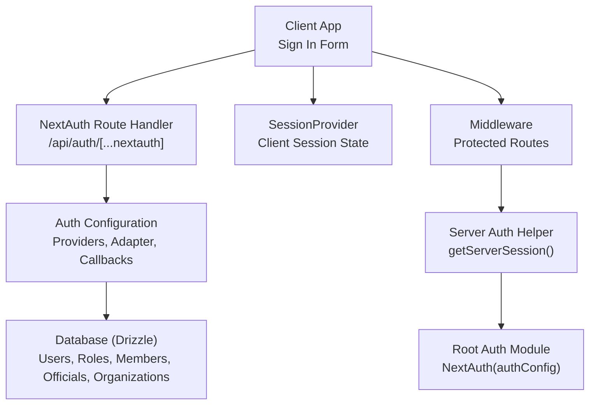
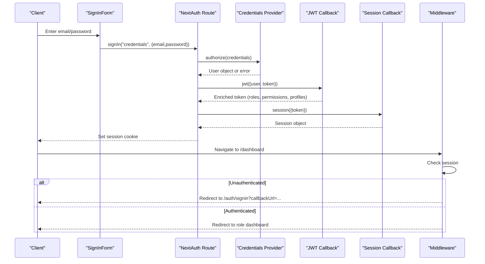
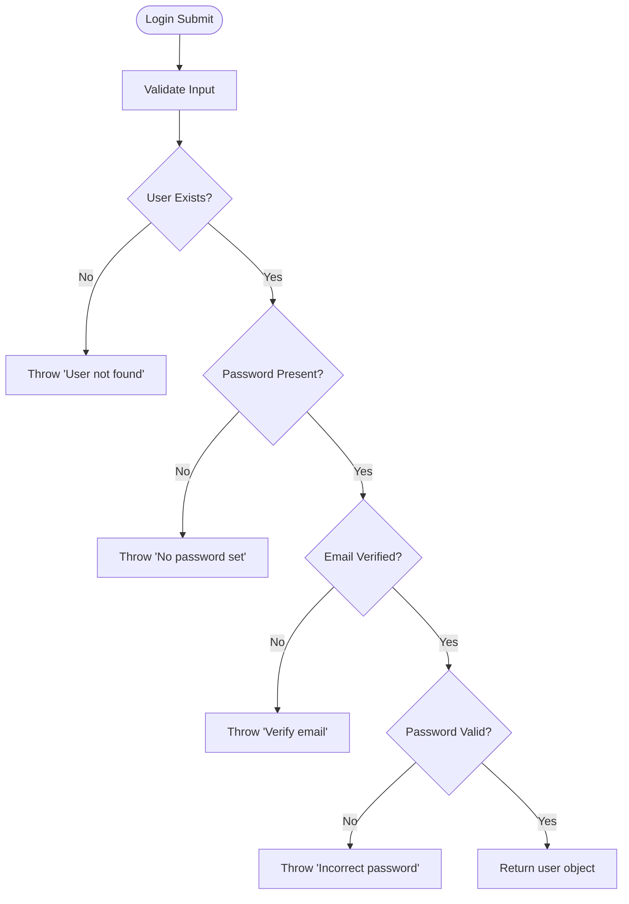
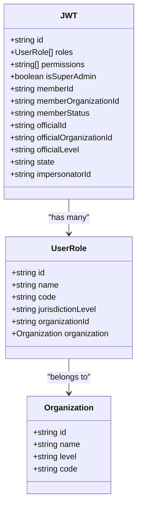
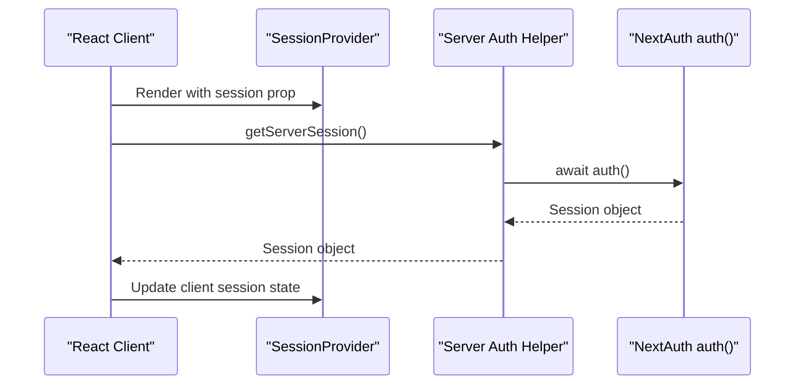
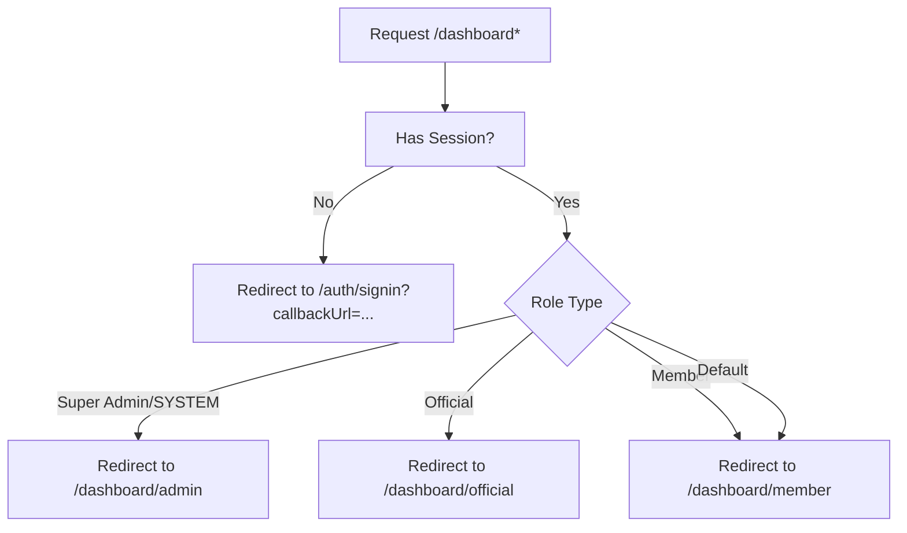
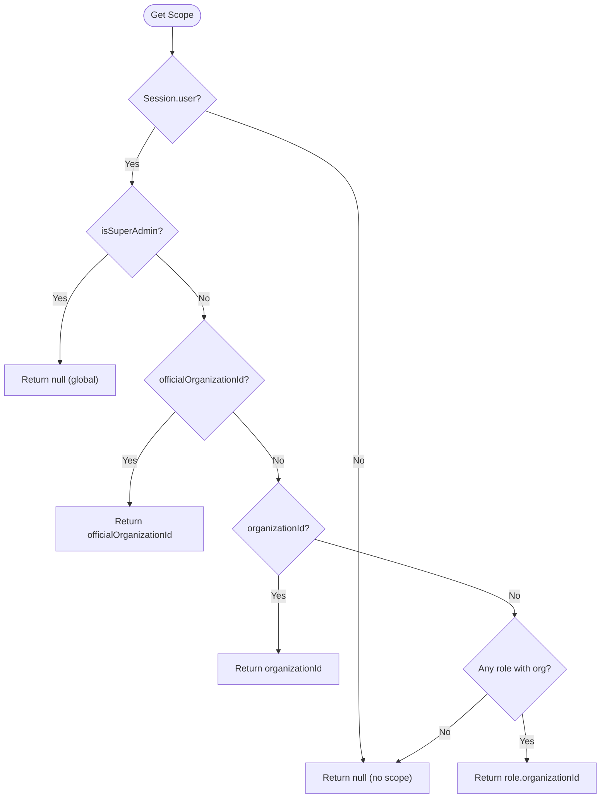
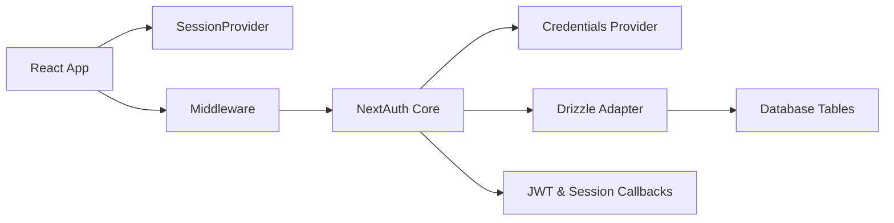

# Authentication Flow & Session Management

<cite>
**Referenced Files in This Document**
- [route.ts](file://app/api/auth/[...nextauth]/route.ts)
- [auth.ts](file://lib/auth.ts)
- [auth.config.ts](file://lib/auth.config.ts)
- [session.ts](file://lib/session.ts)
- [next-auth.d.ts](file://types/next-auth.d.ts)
- [signin-form.tsx](file://components/auth/signin-form.tsx)
- [page.tsx](file://app/auth/signin/page.tsx)
- [auth.ts](file://auth.ts)
- [session-provider.tsx](file://components/providers/session-provider.tsx)
- [proxy.ts](file://proxy.ts)
- [org-utils.ts](file://lib/org-utils.ts)
</cite>

## Table of Contents
1. [Introduction](#introduction)
2. [Project Structure](#project-structure)
3. [Core Components](#core-components)
4. [Architecture Overview](#architecture-overview)
5. [Detailed Component Analysis](#detailed-component-analysis)
6. [Dependency Analysis](#dependency-analysis)
7. [Performance Considerations](#performance-considerations)
8. [Troubleshooting Guide](#troubleshooting-guide)
9. [Conclusion](#conclusion)

## Introduction
This document explains the TMC Portal authentication flow and session management built on NextAuth v5 with a custom credentials provider. It covers how user login works, JWT token generation and population, server-side session retrieval, client-side session state, protected routes via middleware, organization-scoped sessions for members, officials, and administrators, and security considerations including token expiration and cookie behavior. It also provides troubleshooting guidance for common issues such as session timeouts, token refresh failures, and multi-organization session conflicts.

## Project Structure
The authentication system is centered around NextAuth v5:
- Route handler exposes NextAuth endpoints for sign-in and session operations.
- Central configuration defines providers, adapter, callbacks, and pages.
- A root module re-exports auth utilities (handlers, auth, signIn, signOut).
- Server helper to retrieve sessions in server components or API routes.
- Client provider wraps the app to expose session state to React components.
- Middleware protects dashboard routes and redirects based on roles.
- Organization scoping utility derives scope from session data.

**Diagram sources**
- [route.ts:1-8](file://app/api/auth/[...nextauth]/route.ts#L1-L8)
- [auth.ts:131-256](file://lib/auth.ts#L131-L256)
- [auth.config.ts:1-12](file://lib/auth.config.ts#L1-L12)
- [session.ts:1-16](file://lib/session.ts#L1-L16)
- [auth.ts:1-5](file://auth.ts#L1-L5)
- [session-provider.tsx:1-22](file://components/providers/session-provider.tsx#L1-L22)
- [proxy.ts:1-51](file://proxy.ts#L1-L51)

**Section sources**
- [route.ts:1-8](file://app/api/auth/[...nextauth]/route.ts#L1-L8)
- [auth.ts:131-256](file://lib/auth.ts#L131-L256)
- [auth.config.ts:1-12](file://lib/auth.config.ts#L1-L12)
- [session.ts:1-16](file://lib/session.ts#L1-L16)
- [auth.ts:1-5](file://auth.ts#L1-L5)
- [session-provider.tsx:1-22](file://components/providers/session-provider.tsx#L1-L22)
- [proxy.ts:1-51](file://proxy.ts#L1-L51)

## Core Components
- NextAuth route handler: Exposes GET/POST handlers for authentication flows.
- Auth configuration: Defines credentials provider, Drizzle adapter, JWT strategy, callbacks, and sign-in page.
- Root auth module: Re-exports handlers, auth(), signIn(), signOut().
- Server session helper: Provides an async getServerSession() using NextAuth v5’s auth().
- Client session provider: Wraps the app with SessionProvider to make session available in React.
- Middleware: Protects dashboard routes and redirects unauthenticated users; routes authenticated users to role-specific dashboards.
- Organization scoping: Derives effective organization scope from session data for access control.

Key responsibilities:
- Credentials validation and user lookup.
- JWT payload enrichment with roles, permissions, member/official profiles, and impersonation context.
- Session mapping from JWT to client/server session objects.
- Route protection and role-based redirection.
- Scope resolution for organization-aware features.

**Section sources**
- [route.ts:1-8](file://app/api/auth/[...nextauth]/route.ts#L1-L8)
- [auth.ts:131-256](file://lib/auth.ts#L131-L256)
- [auth.config.ts:1-12](file://lib/auth.config.ts#L1-L12)
- [session.ts:1-16](file://lib/session.ts#L1-L16)
- [auth.ts:1-5](file://auth.ts#L1-L5)
- [session-provider.tsx:1-22](file://components/providers/session-provider.tsx#L1-L22)
- [proxy.ts:1-51](file://proxy.ts#L1-L51)
- [org-utils.ts:1-77](file://lib/org-utils.ts#L1-L77)

## Architecture Overview
The authentication architecture uses NextAuth v5 with a JWT strategy and a Drizzle adapter. On login, the credentials provider validates the user, then the JWT callback enriches the token with roles, permissions, and profile data. The session callback maps token fields into the session object. The client receives a signed cookie containing the session token, while the server can reconstruct the session via the auth() helper. Middleware enforces authentication and routes users to appropriate dashboards based on their roles.

**Diagram sources**
- [signin-form.tsx:20-65](file://components/auth/signin-form.tsx#L20-L65)
- [route.ts:1-8](file://app/api/auth/[...nextauth]/route.ts#L1-L8)
- [auth.ts:146-183](file://lib/auth.ts#L146-L183)
- [auth.ts:189-228](file://lib/auth.ts#L189-L228)
- [auth.ts:229-251](file://lib/auth.ts#L229-L251)
- [proxy.ts:7-43](file://proxy.ts#L7-L43)

## Detailed Component Analysis

### Credentials Provider and Login Flow
- Validates credentials and checks user existence, password presence, email verification, and password match.
- Returns a minimal user object that is later enriched by the JWT callback.
- Errors are thrown with descriptive messages for missing accounts, missing passwords, unverified emails, or incorrect passwords.

**Diagram sources**
- [auth.ts:146-183](file://lib/auth.ts#L146-L183)

**Section sources**
- [auth.ts:146-183](file://lib/auth.ts#L146-L183)

### JWT Token Generation and Population
- On initial sign-in and subsequent updates, the JWT callback populates the token with:
  - Basic user identity fields.
  - Roles and permissions derived from user roles, role permissions, and organizations.
  - Member and official profile details when present.
  - Super-admin flag based on jurisdiction level.
  - Impersonation context when admin impersonates another user and reverts back.

**Diagram sources**
- [next-auth.d.ts:7-19](file://types/next-auth.d.ts#L7-L19)
- [next-auth.d.ts:57-72](file://types/next-auth.d.ts#L57-L72)
- [auth.ts:33-129](file://lib/auth.ts#L33-L129)
- [auth.ts:189-228](file://lib/auth.ts#L189-L228)

**Section sources**
- [auth.ts:33-129](file://lib/auth.ts#L33-L129)
- [auth.ts:189-228](file://lib/auth.ts#L189-L228)
- [next-auth.d.ts:7-19](file://types/next-auth.d.ts#L7-L19)
- [next-auth.d.ts:57-72](file://types/next-auth.d.ts#L57-L72)

### Session Handling and Persistence
- Strategy: JWT-based sessions.
- Server-side: Use getServerSession() which calls NextAuth’s auth() to reconstruct the session from the request cookies.
- Client-side: SessionProvider wraps the app to provide session state to React components.
- Pages: Sign-in page renders the form and triggers signIn("credentials").

**Diagram sources**
- [session.ts:1-16](file://lib/session.ts#L1-L16)
- [auth.ts:1-5](file://auth.ts#L1-L5)
- [session-provider.tsx:1-22](file://components/providers/session-provider.tsx#L1-L22)
- [page.tsx:1-7](file://app/auth/signin/page.tsx#L1-L7)

**Section sources**
- [session.ts:1-16](file://lib/session.ts#L1-L16)
- [auth.ts:1-5](file://auth.ts#L1-L5)
- [session-provider.tsx:1-22](file://components/providers/session-provider.tsx#L1-L22)
- [page.tsx:1-7](file://app/auth/signin/page.tsx#L1-L7)

### Protected Routes and Middleware
- Middleware intercepts requests to protect dashboard routes.
- If no session exists, redirect to sign-in with callback URL.
- If session exists at /dashboard, redirect to role-specific dashboards:
  - Super-admin or SYSTEM-level role -> /dashboard/admin
  - Official -> /dashboard/official
  - Member -> /dashboard/member
  - Default fallback -> /dashboard/member

**Diagram sources**
- [proxy.ts:7-43](file://proxy.ts#L7-L43)

**Section sources**
- [proxy.ts:7-43](file://proxy.ts#L7-L43)

### Organization Scoping
- Determines effective organization scope from session:
  - Super-admin has global scope (null).
  - Official scope comes from officialOrganizationId.
  - Explicit organizationId if set.
  - Otherwise, first role with organizationId.
- Useful for enforcing per-organization data access in APIs and pages.

**Diagram sources**
- [org-utils.ts:46-76](file://lib/org-utils.ts#L46-L76)

**Section sources**
- [org-utils.ts:46-76](file://lib/org-utils.ts#L46-L76)

### User Types and Role-Based Routing
- Members: Identified by memberId; routed to member dashboard.
- Officials: Identified by officialId; routed to official dashboard.
- Administrators: Super-admin or SYSTEM-level role; routed to admin dashboard.
- The middleware uses these identifiers to determine routing after successful authentication.

**Section sources**
- [proxy.ts:23-40](file://proxy.ts#L23-L40)
- [auth.ts:189-228](file://lib/auth.ts#L189-L228)
- [next-auth.d.ts:21-43](file://types/next-auth.d.ts#L21-L43)

## Dependency Analysis
The authentication system depends on:
- NextAuth core and providers (credentials).
- Drizzle adapter for persistence of sessions and related tables.
- Database schema for users, roles, memberships, officials, and organizations.
- Middleware for route protection and role-based redirection.
- Client provider for exposing session state in React.

**Diagram sources**
- [auth.ts:131-187](file://lib/auth.ts#L131-L187)
- [auth.ts:189-251](file://lib/auth.ts#L189-L251)
- [session-provider.tsx:1-22](file://components/providers/session-provider.tsx#L1-L22)
- [proxy.ts:1-51](file://proxy.ts#L1-L51)

**Section sources**
- [auth.ts:131-187](file://lib/auth.ts#L131-L187)
- [auth.ts:189-251](file://lib/auth.ts#L189-L251)
- [session-provider.tsx:1-22](file://components/providers/session-provider.tsx#L1-L22)
- [proxy.ts:1-51](file://proxy.ts#L1-L51)

## Performance Considerations
- JWT strategy minimizes server-side session storage overhead by embedding necessary claims in the token.
- Token enrichment queries run during JWT creation/update; ensure database indexes exist on frequently queried columns (e.g., userId, roleId, organizationId).
- Middleware performs lightweight session checks; avoid heavy computations in the matcher path.
- Consider caching expensive role/permission lookups if token update frequency increases.

[No sources needed since this section provides general guidance]

## Troubleshooting Guide
Common issues and resolutions:
- Session timeouts:
  - Ensure environment secret is configured and consistent across deployments.
  - Verify JWT strategy is enabled and tokens are being set correctly.
  - Check browser cookies for domain/path settings and expiration.
- Token refresh failures:
  - Confirm that the JWT callback runs on token updates and handles errors gracefully.
  - Validate database connectivity when enriching roles and profiles.
  - Inspect network logs for failed requests to /api/auth endpoints.
- Multi-organization session conflicts:
  - Use getOrganizationScope to derive the correct scope from session data.
  - Ensure roles and memberships are correctly associated with organizations.
  - When switching contexts, verify that the session reflects the intended organization.

Diagnostic steps:
- Log middleware decisions and session presence for problematic routes.
- Inspect the session object in client components via SessionProvider to confirm populated fields.
- Review error messages thrown by the credentials provider for precise failure reasons.

**Section sources**
- [auth.config.ts:1-12](file://lib/auth.config.ts#L1-L12)
- [auth.ts:189-228](file://lib/auth.ts#L189-L228)
- [auth.ts:229-251](file://lib/auth.ts#L229-L251)
- [proxy.ts:7-43](file://proxy.ts#L7-L43)
- [org-utils.ts:46-76](file://lib/org-utils.ts#L46-L76)

## Conclusion
The TMC Portal implements a robust authentication and session management system using NextAuth v5 with a JWT strategy and Drizzle adapter. The credentials provider validates users, while callbacks enrich tokens with comprehensive role and profile data. Middleware secures dashboard routes and directs users to appropriate dashboards based on their roles. Organization scoping ensures data isolation across multi-tenant structures. Security measures include JWT-based sessions, configurable secrets, and role-based access controls. For reliability, monitor token lifecycle, validate database dependencies, and use the provided helpers to resolve session state and scopes consistently.

[No sources needed since this section summarizes without analyzing specific files]