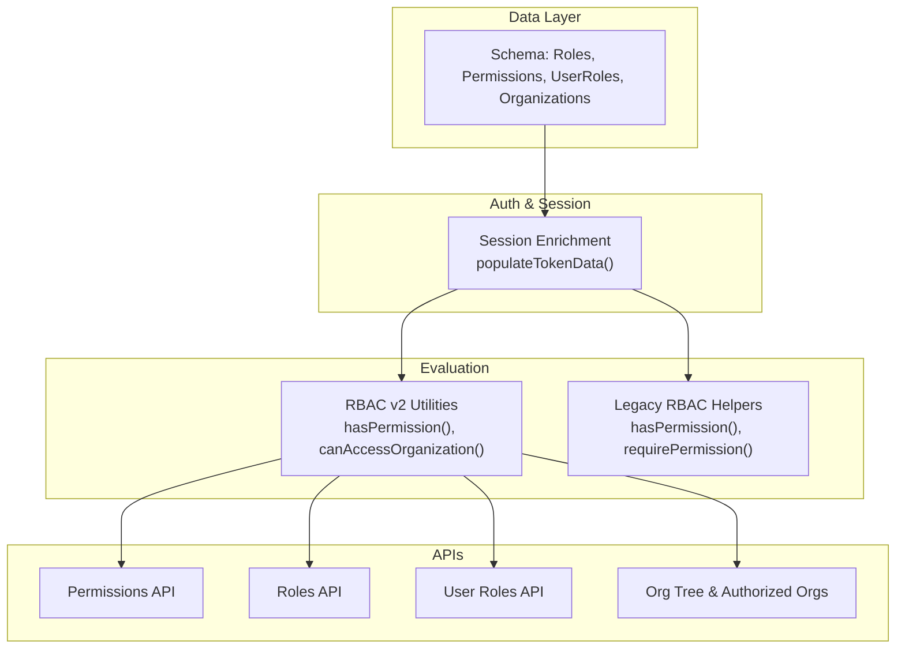
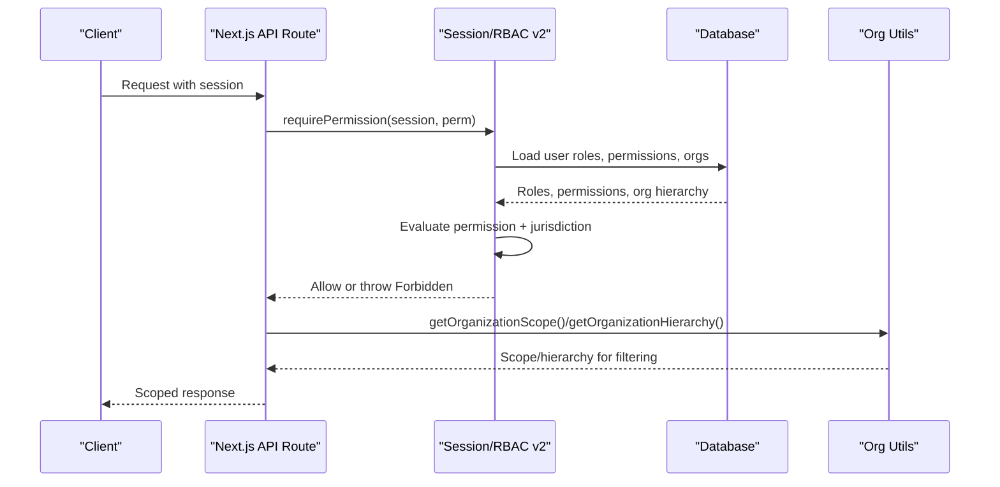
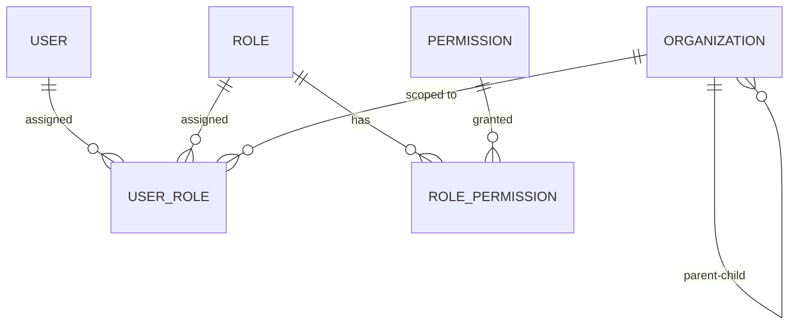
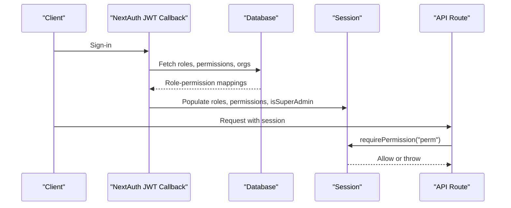
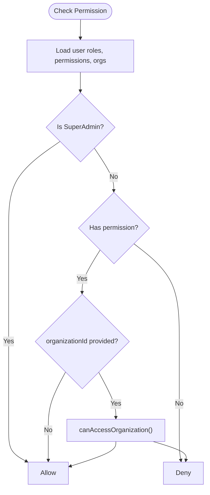
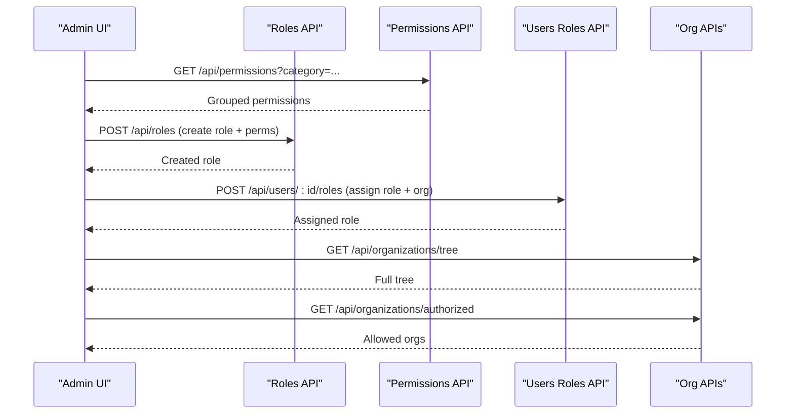
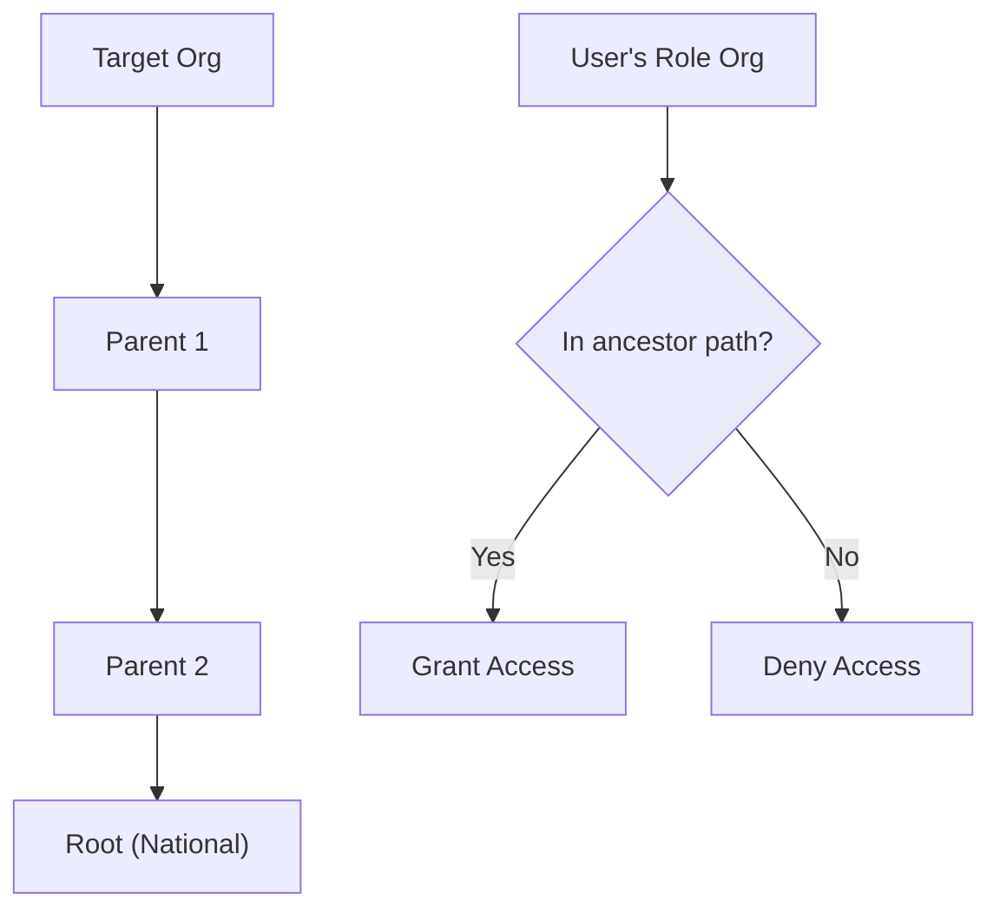
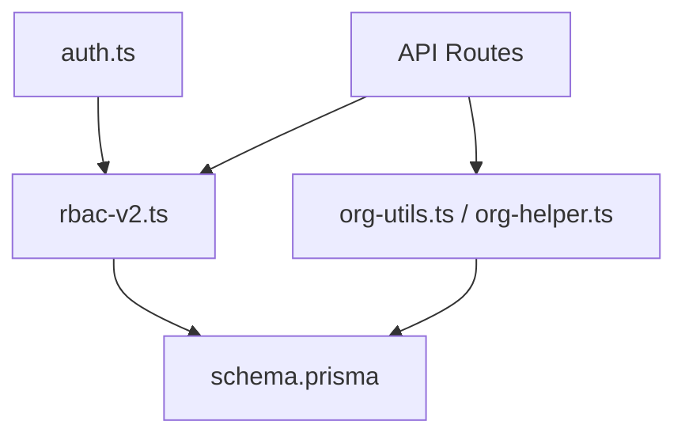

# Permission Management & Jurisdiction Awareness

<cite>
**Referenced Files in This Document**
- [rbac.ts](file://lib/rbac.ts)
- [rbac-v2.ts](file://lib/rbac-v2.ts)
- [org-helper.ts](file://lib/org-helper.ts)
- [org-utils.ts](file://lib/org-utils.ts)
- [auth.ts](file://lib/auth.ts)
- [route.ts (permissions)](file://app/api/permissions/route.ts)
- [route.ts (roles)](file://app/api/roles/route.ts)
- [route.ts (roles by id)](file://app/api/roles/[id]/route.ts)
- [route.ts (organizations tree)](file://app/api/organizations/tree/route.ts)
- [route.ts (organizations authorized)](file://app/api/organizations/authorized/route.ts)
- [route.ts (users roles)](file://app/api/users/[id]/roles/route.ts)
- [schema.prisma](file://prisma/schema.prisma)
</cite>

## Table of Contents
1. Introduction
2. Project Structure
3. Core Components
4. Architecture Overview
5. Detailed Component Analysis
6. Dependency Analysis
7. Performance Considerations
8. Troubleshooting Guide
9. Conclusion

## Introduction
This document explains the permission management and jurisdiction-aware access control in the TMC Portal. It covers how permissions are defined, assigned, evaluated, and scoped to organizations across a multi-tier hierarchy. It also documents the jurisdiction system that enables organization-scoped administration while preserving system integrity, including inheritance and cascading through parent organizations. Practical examples, API endpoints, integration patterns, and troubleshooting guidance are provided for scenarios such as regional administrators, branch managers, and cross-jurisdiction data access.

## Project Structure
The permission system spans several layers:
- Data model: Role-based access control (RBAC) with roles, permissions, user-role assignments, and organization hierarchy.
- Session enrichment: On sign-in, roles, permissions, and organizational context are loaded into the session token.
- Evaluation utilities: Functions to check permissions and jurisdictional access at runtime.
- APIs: Endpoints to manage permissions, roles, users’ roles, and to enumerate organization trees and authorized scopes.

**Diagram sources**
- [schema.prisma:316-396](file://prisma/schema.prisma#L316-L396)
- [auth.ts:32-82](file://lib/auth.ts#L32-L82)
- [rbac-v2.ts:47-165](file://lib/rbac-v2.ts#L47-L165)
- [rbac.ts:37-192](file://lib/rbac.ts#L37-L192)
- [route.ts (permissions):8-36](file://app/api/permissions/route.ts#L8-L36)
- [route.ts (roles):18-118](file://app/api/roles/route.ts#L18-L118)
- [route.ts (users roles):16-152](file://app/api/users/[id]/roles/route.ts#L16-L152)
- [route.ts (organizations tree):5-17](file://app/api/organizations/tree/route.ts#L5-L17)
- [route.ts (organizations authorized):7-66](file://app/api/organizations/authorized/route.ts#L7-L66)

**Section sources**
- [schema.prisma:316-396](file://prisma/schema.prisma#L316-L396)
- [auth.ts:32-82](file://lib/auth.ts#L32-L82)
- [rbac-v2.ts:47-165](file://lib/rbac-v2.ts#L47-L165)
- [rbac.ts:37-192](file://lib/rbac.ts#L37-L192)
- [route.ts (permissions):8-36](file://app/api/permissions/route.ts#L8-L36)
- [route.ts (roles):18-118](file://app/api/roles/route.ts#L18-L118)
- [route.ts (users roles):16-152](file://app/api/users/[id]/roles/route.ts#L16-L152)
- [route.ts (organizations tree):5-17](file://app/api/organizations/tree/route.ts#L5-L17)
- [route.ts (organizations authorized):7-66](file://app/api/organizations/authorized/route.ts#L7-L66)

## Core Components
- Roles and Permissions Model:
  - Roles define a set of permissions and operate within a jurisdiction level.
  - Permissions are granular actions (e.g., members:create, payments:read).
  - UserRole links a user to a role and optionally scopes it to an organization.
- Session Enrichment:
  - On JWT creation, roles, permissions, and organizational context are populated into the session.
  - Super-admin flag is derived from roles with SYSTEM jurisdiction.
- Evaluation Utilities:
  - RBAC v2 provides database-backed checks for permissions and jurisdictional access.
  - Legacy helpers provide quick checks based on session state.
- Organization Hierarchy:
  - Organizations form a tree (National > State > Local Government > Branch).
  - Jurisdiction checks traverse this hierarchy to allow parent-level access to children.

**Section sources**
- [schema.prisma:125-197](file://prisma/schema.prisma#L125-L197)
- [schema.prisma:316-396](file://prisma/schema.prisma#L316-L396)
- [auth.ts:32-82](file://lib/auth.ts#L32-L82)
- [rbac-v2.ts:47-165](file://lib/rbac-v2.ts#L47-L165)
- [rbac.ts:37-192](file://lib/rbac.ts#L37-L192)
- [org-helper.ts:38-118](file://lib/org-helper.ts#L38-L118)
- [org-utils.ts:6-77](file://lib/org-utils.ts#L6-L77)

## Architecture Overview
The system enforces permissions via a layered approach:
- Authentication populates roles and permissions into the session.
- API routes enforce required permissions using middleware-like functions.
- Business logic uses jurisdiction-aware checks to scope data access to the correct organization(s).
- Organization utilities build hierarchical views and determine allowed scopes per user.

**Diagram sources**
- [auth.ts:188-246](file://lib/auth.ts#L188-L246)
- [rbac-v2.ts:141-213](file://lib/rbac-v2.ts#L141-L213)
- [org-utils.ts:46-77](file://lib/org-utils.ts#L46-L77)
- [route.ts (permissions):8-36](file://app/api/permissions/route.ts#L8-L36)
- [route.ts (roles):18-118](file://app/api/roles/route.ts#L18-L118)

## Detailed Component Analysis

### Roles, Permissions, and Assignments
- Role model includes name, code, description, jurisdictionLevel, and system flags.
- Permission model defines codes, names, categories, and active status.
- UserRole assigns a role to a user with optional organization scoping and expiration.
- RolePermission maps roles to permissions with grant metadata.

**Diagram sources**
- [schema.prisma:125-197](file://prisma/schema.prisma#L125-L197)
- [schema.prisma:316-396](file://prisma/schema.prisma#L316-L396)

**Section sources**
- [schema.prisma:316-396](file://prisma/schema.prisma#L316-L396)

### Session-Based Authorization Flow
- During JWT creation, the system loads roles, permissions, and organizational context for the user.
- The session carries roles, permissions, and a super-admin flag.
- API routes use requirePermission to gate operations; missing permissions result in a forbidden error.

**Diagram sources**
- [auth.ts:32-82](file://lib/auth.ts#L32-L82)
- [auth.ts:188-246](file://lib/auth.ts#L188-L246)
- [rbac-v2.ts:313-358](file://lib/rbac-v2.ts#L313-L358)

**Section sources**
- [auth.ts:32-82](file://lib/auth.ts#L32-L82)
- [auth.ts:188-246](file://lib/auth.ts#L188-L246)
- [rbac-v2.ts:313-358](file://lib/rbac-v2.ts#L313-L358)

### Jurisdiction-Aware Access Control
- hasPermission(userId, permission, organizationId?) checks both explicit permissions and jurisdiction when an organization is specified.
- canAccessOrganization(userId, organizationId) verifies if a user’s roles cover the target organization directly or via hierarchy.
- checkJurisdictionAccess builds the target organization’s ancestor path and checks inclusion against the user’s role organization(s).

**Diagram sources**
- [rbac-v2.ts:141-213](file://lib/rbac-v2.ts#L141-L213)
- [rbac-v2.ts:218-259](file://lib/rbac-v2.ts#L218-L259)

**Section sources**
- [rbac-v2.ts:141-213](file://lib/rbac-v2.ts#L141-L213)
- [rbac-v2.ts:218-259](file://lib/rbac-v2.ts#L218-L259)

### Organization Hierarchy and Scoping
- getOrganizationTree constructs a nested view of National > State > LGA > Branch.
- getOrganizationAncestry returns the path from a given organization up to its root.
- getOrganizationScope determines the effective scope for a session (global for super-admin, otherwise official/member/role-based).

**Diagram sources**
- [org-helper.ts:38-98](file://lib/org-helper.ts#L38-L98)
- [org-helper.ts:100-118](file://lib/org-helper.ts#L100-L118)
- [org-utils.ts:6-35](file://lib/org-utils.ts#L6-L35)
- [org-utils.ts:46-77](file://lib/org-utils.ts#L46-L77)

**Section sources**
- [org-helper.ts:38-118](file://lib/org-helper.ts#L38-L118)
- [org-utils.ts:6-77](file://lib/org-utils.ts#L6-L77)

### API Endpoints for Permission Management
- Permissions API: Lists all permissions grouped by category; requires roles:read.
- Roles API:
  - GET: Lists active roles with their permissions and counts.
  - POST: Creates a role with optional permissions; validates schema and audits changes.
  - PATCH: Updates role fields and replaces permissions atomically; protects system roles.
  - DELETE: Deletes non-system roles only if unassigned.
- Users Roles API:
  - GET: Lists a user’s active roles with permissions and organizations.
  - POST: Assigns a role to a user with optional organization and expiry; reactivates inactive roles if needed.
  - DELETE: Deactivates a user role (soft delete) and audits the action.
- Organizations APIs:
  - Tree: Returns full organization tree for UI navigation.
  - Authorized: Returns organizations accessible to the current user (direct and descendants).

**Diagram sources**
- [route.ts (permissions):8-36](file://app/api/permissions/route.ts#L8-L36)
- [route.ts (roles):18-189](file://app/api/roles/route.ts#L18-L189)
- [route.ts (users roles):16-208](file://app/api/users/[id]/roles/route.ts#L16-L208)
- [route.ts (organizations tree):5-17](file://app/api/organizations/tree/route.ts#L5-L17)
- [route.ts (organizations authorized):7-66](file://app/api/organizations/authorized/route.ts#L7-L66)

**Section sources**
- [route.ts (permissions):8-36](file://app/api/permissions/route.ts#L8-L36)
- [route.ts (roles):18-189](file://app/api/roles/route.ts#L18-L189)
- [route.ts (users roles):16-208](file://app/api/users/[id]/roles/route.ts#L16-L208)
- [route.ts (organizations tree):5-17](file://app/api/organizations/tree/route.ts#L5-L17)
- [route.ts (organizations authorized):7-66](file://app/api/organizations/authorized/route.ts#L7-L66)

### Permission Inheritance and Cascading
- Parent organizations can effectively govern child organizations via jurisdiction checks.
- When checking access to a target organization, the system builds the ancestor path and verifies whether any of the user’s role organizations appear in that path.
- This allows a state admin to manage LGAs and branches under their state without explicit per-branch assignments.

**Diagram sources**
- [rbac-v2.ts:170-213](file://lib/rbac-v2.ts#L170-L213)
- [rbac-v2.ts:218-259](file://lib/rbac-v2.ts#L218-L259)

**Section sources**
- [rbac-v2.ts:170-213](file://lib/rbac-v2.ts#L170-L213)
- [rbac-v2.ts:218-259](file://lib/rbac-v2.ts#L218-L259)

### Examples and Integration Patterns
- Regional Administrator:
  - Create a role with jurisdictionLevel STATE and assign relevant permissions (members, payments, documents).
  - Assign the role to users with organizationId set to the state.
  - Use canAccessOrganization to filter data queries to state and descendant LGAs/branches.
- Branch Manager:
  - Create a BRANCH role with limited permissions (e.g., members:create/read/update, payments:create/read).
  - Assign to users scoped to specific branches.
  - Use getOrganizationScope to default filters to the branch unless global reporting is requested.
- Cross-Jurisdiction Access:
  - For national admins, no organizationId restriction applies due to SYSTEM jurisdiction.
  - For cross-state needs, create a custom role with appropriate permissions and assign at NATIONAL level without organization scoping.

[No sources needed since this section provides conceptual guidance]

## Dependency Analysis
- Session depends on database to load roles, permissions, and org context.
- RBAC v2 depends on schema tables for evaluation and jurisdiction checks.
- APIs depend on RBAC v2 for authorization and on org utilities for scoping.
- Org utilities depend on the organization hierarchy to compute ancestry and tree structures.

**Diagram sources**
- [auth.ts:32-82](file://lib/auth.ts#L32-L82)
- [rbac-v2.ts:47-165](file://lib/rbac-v2.ts#L47-L165)
- [org-utils.ts:6-77](file://lib/org-utils.ts#L6-L77)
- [org-helper.ts:38-118](file://lib/org-helper.ts#L38-L118)
- [schema.prisma:316-396](file://prisma/schema.prisma#L316-L396)

**Section sources**
- [auth.ts:32-82](file://lib/auth.ts#L32-L82)
- [rbac-v2.ts:47-165](file://lib/rbac-v2.ts#L47-L165)
- [org-utils.ts:6-77](file://lib/org-utils.ts#L6-L77)
- [org-helper.ts:38-118](file://lib/org-helper.ts#L38-L118)
- [schema.prisma:316-396](file://prisma/schema.prisma#L316-L396)

## Performance Considerations
- Minimize repeated hierarchy traversals by caching organization ancestry where feasible.
- Prefer querying only necessary fields in role/permission joins to reduce payload size.
- Use organization scoping early in queries to limit result sets.
- Audit logs should be asynchronous to avoid blocking critical paths.

[No sources needed since this section provides general guidance]

## Troubleshooting Guide
Common issues and debugging techniques:
- Missing permissions:
  - Verify the role has the required permission in role_permissions and that the role is active.
  - Confirm the user’s role assignment is active and not expired.
  - Check session contents for roles and permissions after sign-in.
- Unauthorized access to organization:
  - Ensure the user’s role organization is either the target or an ancestor of the target.
  - Validate organization hierarchy and parentId relationships.
- API errors:
  - Review requirePermission calls in API routes for correct permission codes.
  - Inspect Zod validation errors for role creation/update requests.
- Soft-deleted roles:
  - Remember that removing a user role deactivates it rather than deleting; reactivate if needed.

**Section sources**
- [rbac-v2.ts:141-213](file://lib/rbac-v2.ts#L141-L213)
- [route.ts (roles):52-189](file://app/api/roles/route.ts#L52-L189)
- [route.ts (users roles):47-208](file://app/api/users/[id]/roles/route.ts#L47-L208)
- [auth.ts:188-246](file://lib/auth.ts#L188-L246)

## Conclusion
The TMC Portal implements a robust, jurisdiction-aware permission system grounded in RBAC and a hierarchical organization model. Roles define capabilities, user-role assignments scope authority to specific organizations, and evaluation utilities ensure access respects both permissions and jurisdictional boundaries. APIs expose comprehensive management capabilities for permissions, roles, and user assignments, while utilities support building jurisdiction-aware features. By following the patterns and guidelines here, teams can implement secure, scalable access control across regional and branch-level operations.