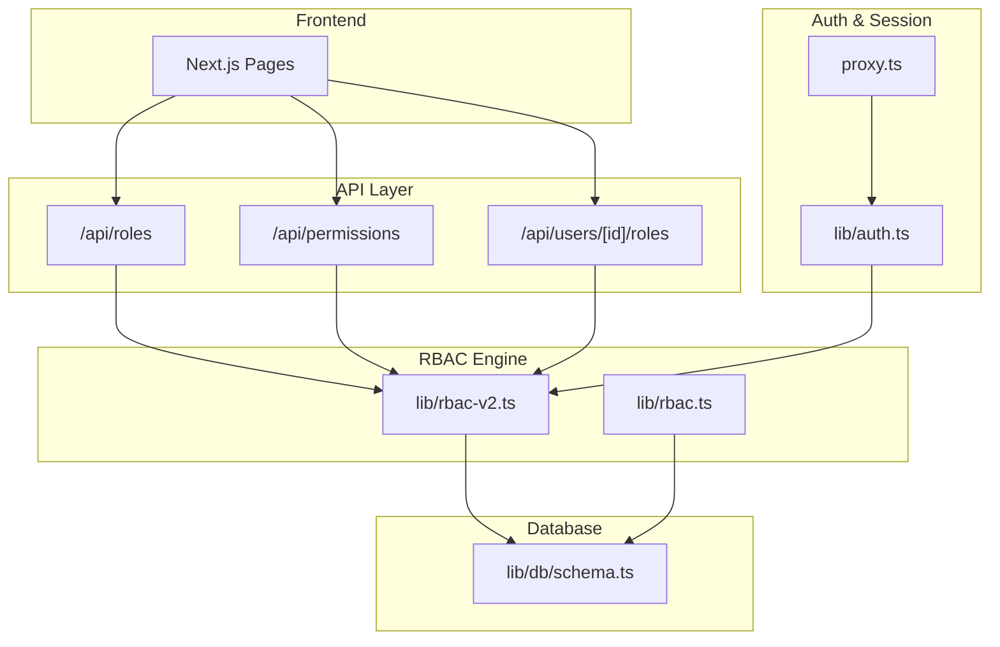
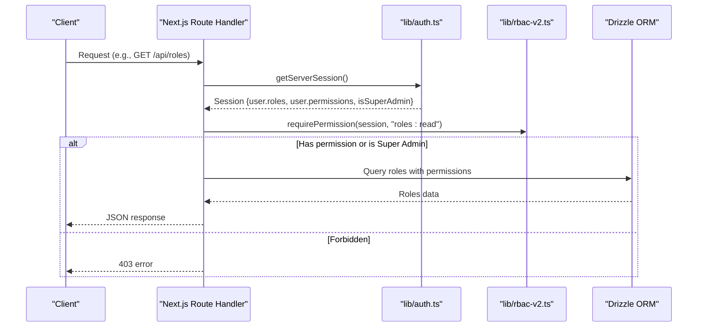
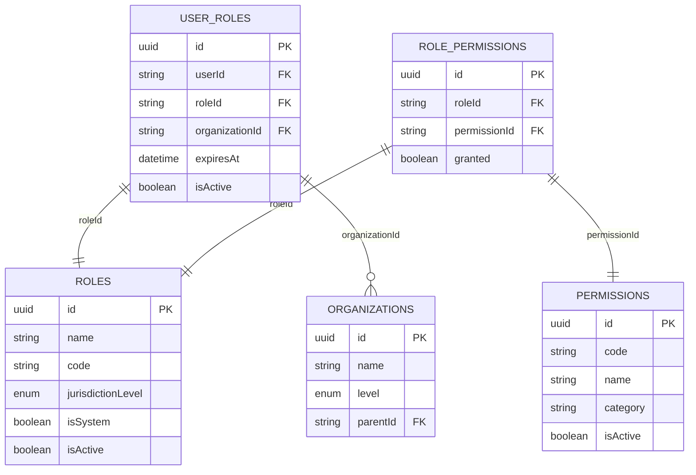
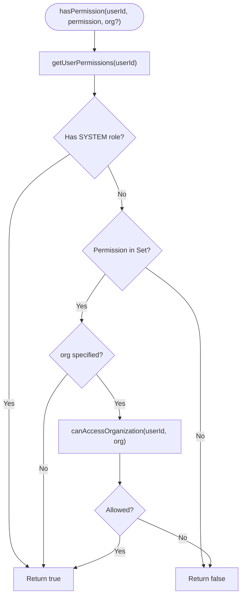
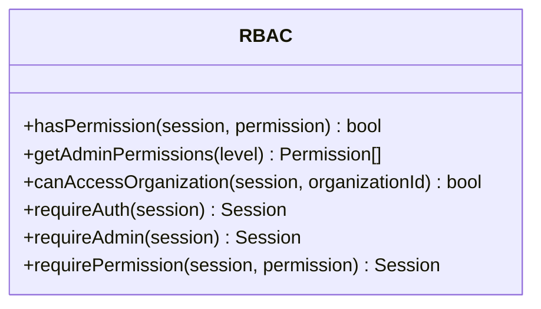
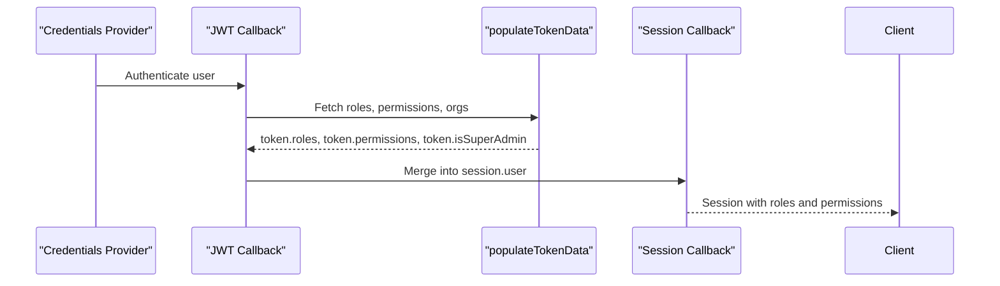
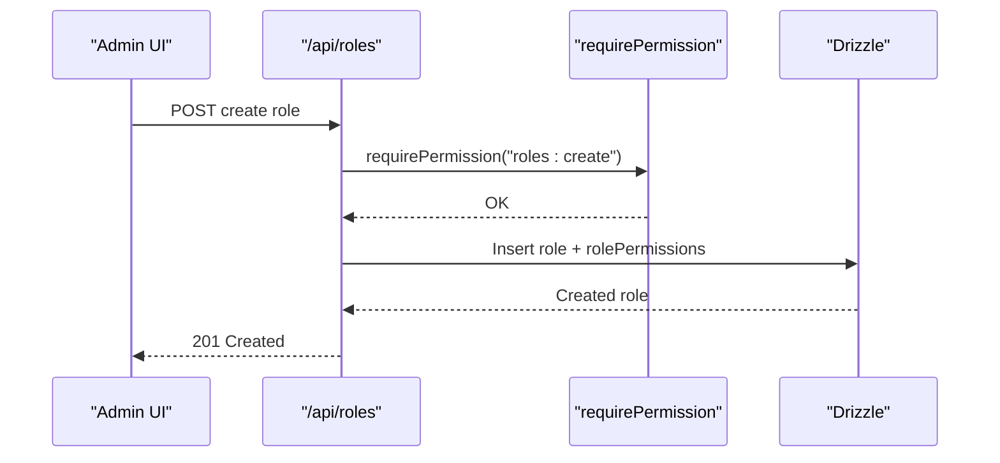
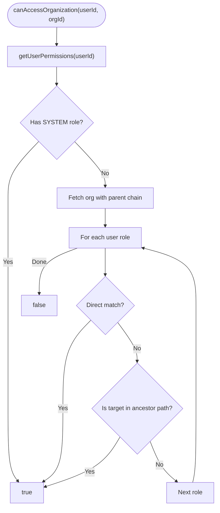
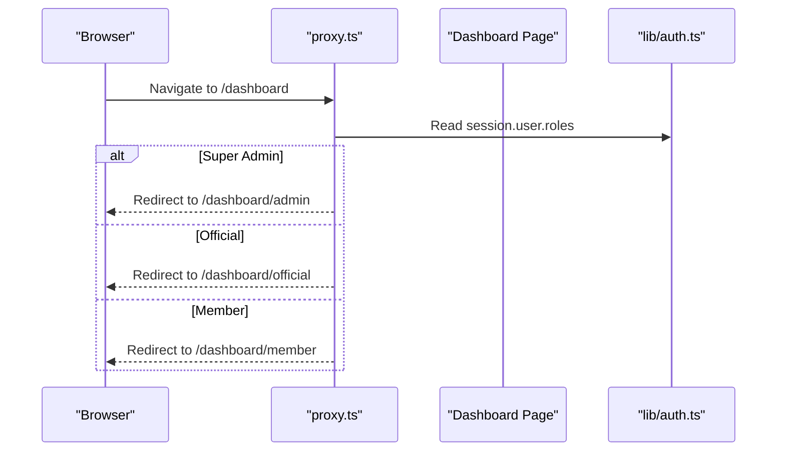
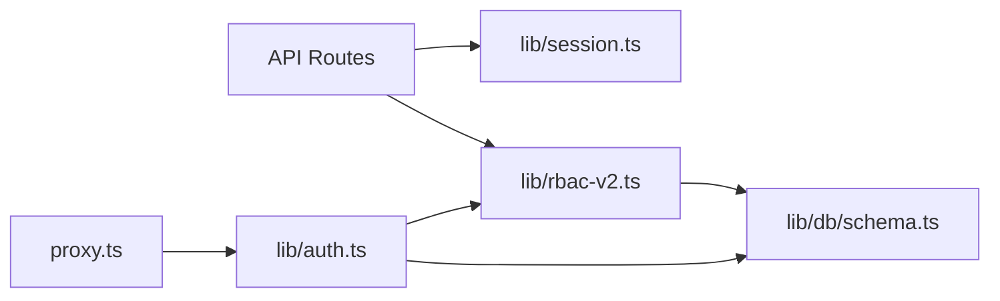

# Role-Based Access Control (RBAC) System

<cite>
**Referenced Files in This Document**
- [lib/rbac-v2.ts](file://lib/rbac-v2.ts)
- [lib/rbac.ts](file://lib/rbac.ts)
- [lib/auth.ts](file://lib/auth.ts)
- [lib/db/schema.ts](file://lib/db/schema.ts)
- [app/api/roles/route.ts](file://app/api/roles/route.ts)
- [app/api/permissions/route.ts](file://app/api/permissions/route.ts)
- [app/api/users/[id]/roles/route.ts](file://app/api/users/[id]/roles/route.ts)
- [scripts/seed-rbac.ts](file://scripts/seed-rbac.ts)
- [proxy.ts](file://proxy.ts)
- [RBAC_SYSTEM.md](file://RBAC_SYSTEM.md)
- [RBAC_IMPLEMENTATION_SUMMARY.md](file://RBAC_IMPLEMENTATION_SUMMARY.md)
</cite>

## Table of Contents
1. Introduction
2. Project Structure
3. Core Components
4. Architecture Overview
5. Detailed Component Analysis
6. Dependency Analysis
7. Performance Considerations
8. Troubleshooting Guide
9. Conclusion
10. Appendices

## Introduction
This document explains the TMC Portal’s sophisticated Role-Based Access Control (RBAC) system. It covers the hierarchical role structure from Super Admin down to regular members, permission inheritance through organizational jurisdictions, dynamic permission evaluation, and role assignment mechanisms. It also documents jurisdiction-aware access control, RBAC API endpoints, integration with Next.js route handlers, performance considerations for large organizations, and examples for implementing role-based UI components and conditional rendering.

## Project Structure
The RBAC system spans database schema definitions, a runtime permission engine, authentication session enrichment, and API routes for managing roles and permissions. Key areas:
- Database schema defines roles, permissions, user-role assignments, and organization hierarchy.
- Authentication enriches sessions with roles, permissions, and super-admin flags.
- RBAC library provides functions to evaluate permissions and jurisdictional access.
- API routes expose CRUD operations for roles, permissions, and user role assignments.
- Proxy handles initial routing based on roles.

**Diagram sources**
- [lib/auth.ts:33-129](file://lib/auth.ts#L33-L129)
- [lib/rbac-v2.ts:47-136](file://lib/rbac-v2.ts#L47-L136)
- [lib/db/schema.ts:305-350](file://lib/db/schema.ts#L305-L350)
- [app/api/roles/route.ts:18-50](file://app/api/roles/route.ts#L18-L50)
- [app/api/permissions/route.ts:8-40](file://app/api/permissions/route.ts#L8-L40)
- [app/api/users/[id]/roles/route.ts:16-45](file://app/api/users/[id]/roles/route.ts#L16-L45)
- [proxy.ts:24-40](file://proxy.ts#L24-L40)

**Section sources**
- [lib/db/schema.ts:305-350](file://lib/db/schema.ts#L305-L350)
- [lib/auth.ts:33-129](file://lib/auth.ts#L33-L129)
- [lib/rbac-v2.ts:47-136](file://lib/rbac-v2.ts#L47-L136)
- [app/api/roles/route.ts:18-50](file://app/api/roles/route.ts#L18-L50)
- [app/api/permissions/route.ts:8-40](file://app/api/permissions/route.ts#L8-L40)
- [app/api/users/[id]/roles/route.ts:16-45](file://app/api/users/[id]/roles/route.ts#L16-L45)
- [proxy.ts:24-40](file://proxy.ts#L24-L40)

## Core Components
- Hierarchical roles and permissions:
  - Roles are scoped by jurisdiction level: SYSTEM, NATIONAL, STATE, LOCAL_GOVERNMENT, BRANCH.
  - Permissions are granular codes grouped by category (e.g., members:create).
  - Users can hold multiple roles across different organizations/jurisdictions.
- Dynamic permission evaluation:
  - Super Admin (SYSTEM) has all permissions.
  - Permission checks consider active roles, granted permissions, expiration, and organization jurisdiction.
- Jurisdiction-aware access control:
  - Access to an organization is allowed if the user has a role at that organization or any ancestor in the hierarchy.
- Session enrichment:
  - On login, the session includes roles, permissions, and a super-admin flag.

**Section sources**
- [lib/rbac-v2.ts:141-165](file://lib/rbac-v2.ts#L141-L165)
- [lib/rbac-v2.ts:170-213](file://lib/rbac-v2.ts#L170-L213)
- [lib/auth.ts:33-129](file://lib/auth.ts#L33-L129)
- [RBAC_SYSTEM.md:49-91](file://RBAC_SYSTEM.md#L49-L91)

## Architecture Overview
The RBAC architecture integrates authentication, session management, and a permission engine backed by relational tables.

**Diagram sources**
- [app/api/roles/route.ts:18-50](file://app/api/roles/route.ts#L18-L50)
- [lib/rbac-v2.ts:313-337](file://lib/rbac-v2.ts#L313-L337)
- [lib/auth.ts:188-251](file://lib/auth.ts#L188-L251)

## Detailed Component Analysis

### Database Schema and Data Model
- Roles: name, code, jurisdictionLevel, isSystem, isActive.
- Permissions: code, name, category, isActive.
- UserRole: links users to roles with optional organizationId, expiresAt, isActive.
- RolePermission: links roles to permissions with granted flag.
- Organizations: hierarchical via parentId; levels include NATIONAL, STATE, LOCAL_GOVERNMENT, BRANCH.

**Diagram sources**
- [lib/db/schema.ts:305-350](file://lib/db/schema.ts#L305-L350)
- [lib/db/schema.ts:149-188](file://lib/db/schema.ts#L149-L188)

**Section sources**
- [lib/db/schema.ts:305-350](file://lib/db/schema.ts#L305-L350)
- [lib/db/schema.ts:149-188](file://lib/db/schema.ts#L149-L188)

### RBAC Engine (lib/rbac-v2.ts)
Key responsibilities:
- Fetch user roles and permissions efficiently using joins and filters for active assignments and permissions.
- Evaluate permissions with support for organization-scoped checks.
- Enforce jurisdictional access by traversing organization hierarchy.

**Diagram sources**
- [lib/rbac-v2.ts:47-136](file://lib/rbac-v2.ts#L47-L136)
- [lib/rbac-v2.ts:141-165](file://lib/rbac-v2.ts#L141-L165)
- [lib/rbac-v2.ts:170-213](file://lib/rbac-v2.ts#L170-L213)

**Section sources**
- [lib/rbac-v2.ts:47-136](file://lib/rbac-v2.ts#L47-L136)
- [lib/rbac-v2.ts:141-165](file://lib/rbac-v2.ts#L141-L165)
- [lib/rbac-v2.ts:170-213](file://lib/rbac-v2.ts#L170-L213)

### Legacy RBAC (lib/rbac.ts)
Provides a simpler, session-based permission check and admin-level mapping. Useful for backward compatibility and quick checks without DB queries.

**Diagram sources**
- [lib/rbac.ts:37-56](file://lib/rbac.ts#L37-L56)
- [lib/rbac.ts:58-143](file://lib/rbac.ts#L58-L143)
- [lib/rbac.ts:146-192](file://lib/rbac.ts#L146-L192)

**Section sources**
- [lib/rbac.ts:37-56](file://lib/rbac.ts#L37-L56)
- [lib/rbac.ts:58-143](file://lib/rbac.ts#L58-L143)
- [lib/rbac.ts:146-192](file://lib/rbac.ts#L146-L192)

### Authentication and Session Enrichment (lib/auth.ts)
- On JWT creation, fetches user roles, permissions, and organization info.
- Sets session fields: roles, permissions, isSuperAdmin, member/official profiles.
- Supports impersonation flows while preserving role context.

**Diagram sources**
- [lib/auth.ts:33-129](file://lib/auth.ts#L33-L129)
- [lib/auth.ts:188-251](file://lib/auth.ts#L188-L251)

**Section sources**
- [lib/auth.ts:33-129](file://lib/auth.ts#L33-L129)
- [lib/auth.ts:188-251](file://lib/auth.ts#L188-L251)

### RBAC API Endpoints
- Roles
  - GET /api/roles: List roles with permissions and counts. Requires roles:read.
  - POST /api/roles: Create role with jurisdiction level and optional permissions. Requires roles:create.
- Permissions
  - GET /api/permissions: List permissions grouped by category. Requires roles:read.
- User Roles
  - GET /api/users/[id]/roles: Get user’s active roles with permissions. Requires users:read.
  - POST /api/users/[id]/roles: Assign role to user with optional organization and expiry. Requires roles:assign.
  - DELETE /api/users/[id]/roles?userRoleId=xxx: Deactivate user role. Requires roles:assign.

**Diagram sources**
- [app/api/roles/route.ts:52-118](file://app/api/roles/route.ts#L52-L118)
- [lib/rbac-v2.ts:313-337](file://lib/rbac-v2.ts#L313-L337)

**Section sources**
- [app/api/roles/route.ts:18-118](file://app/api/roles/route.ts#L18-L118)
- [app/api/permissions/route.ts:8-40](file://app/api/permissions/route.ts#L8-L40)
- [app/api/users/[id]/roles/route.ts:16-208](file://app/api/users/[id]/roles/route.ts#L16-L208)

### Jurisdiction-Aware Access Control
- Super Admin bypasses jurisdiction checks.
- For non-Super Admins, access to an organization requires:
  - Direct role at that organization, or
  - A role at an ancestor organization within the hierarchy.
- Hierarchy traversal uses parent relationships up to several levels.

**Diagram sources**
- [lib/rbac-v2.ts:170-213](file://lib/rbac-v2.ts#L170-L213)
- [lib/rbac-v2.ts:218-259](file://lib/rbac-v2.ts#L218-L259)

**Section sources**
- [lib/rbac-v2.ts:170-213](file://lib/rbac-v2.ts#L170-L213)
- [lib/rbac-v2.ts:218-259](file://lib/rbac-v2.ts#L218-L259)

### Integration with Next.js Route Handlers
- Use requirePermission to enforce permissions in API routes.
- The proxy redirects authenticated users to appropriate dashboards based on roles.

**Diagram sources**
- [proxy.ts:24-40](file://proxy.ts#L24-L40)
- [lib/auth.ts:188-251](file://lib/auth.ts#L188-L251)

**Section sources**
- [proxy.ts:24-40](file://proxy.ts#L24-L40)

### Examples: Custom Roles, Assignments, and Runtime Checks
- Define custom roles:
  - POST /api/roles with name, code, jurisdictionLevel, and optional permissionIds.
- Assign permissions to roles:
  - Include permissionIds when creating a role or update via role permissions endpoint.
- Check permissions at runtime:
  - In API routes: requirePermission(session, "members:read").
  - In server logic: hasPermission(userId, "members:read", organizationId?).

**Section sources**
- [app/api/roles/route.ts:52-118](file://app/api/roles/route.ts#L52-L118)
- [lib/rbac-v2.ts:313-337](file://lib/rbac-v2.ts#L313-L337)
- [RBAC_SYSTEM.md:147-182](file://RBAC_SYSTEM.md#L147-L182)

### Role-Based UI Components and Conditional Rendering
- Server-side:
  - Use requirePermission in API routes to gate data access.
  - Use proxy to redirect to role-specific dashboards.
- Client-side:
  - Render UI conditionally based on session.user.roles and session.user.permissions.
  - Example patterns:
    - Show “Create Role” button only if user has roles:create.
    - Hide sensitive sections unless user has audit:read.

[No sources needed since this section provides general guidance]

## Dependency Analysis
- API routes depend on:
  - Session retrieval via lib/session (NextAuth v5).
  - Permission enforcement via lib/rbac-v2.
  - Database queries via Drizzle ORM against schema definitions.
- Authentication depends on:
  - Drizzle adapter and schema relations.
  - Populating roles, permissions, and organization data into tokens and sessions.
- RBAC engine depends on:
  - Organization hierarchy for jurisdiction checks.
  - Active role and permission states.

**Diagram sources**
- [app/api/roles/route.ts:1-120](file://app/api/roles/route.ts#L1-L120)
- [lib/rbac-v2.ts:1-361](file://lib/rbac-v2.ts#L1-L361)
- [lib/auth.ts:1-257](file://lib/auth.ts#L1-L257)
- [lib/db/schema.ts:305-350](file://lib/db/schema.ts#L305-L350)
- [proxy.ts:1-51](file://proxy.ts#L1-L51)

**Section sources**
- [app/api/roles/route.ts:1-120](file://app/api/roles/route.ts#L1-L120)
- [lib/rbac-v2.ts:1-361](file://lib/rbac-v2.ts#L1-L361)
- [lib/auth.ts:1-257](file://lib/auth.ts#L1-L257)
- [lib/db/schema.ts:305-350](file://lib/db/schema.ts#L305-L350)
- [proxy.ts:1-51](file://proxy.ts#L1-L51)

## Performance Considerations
- Minimize DB round-trips:
  - getUserPermissions performs a single join query to collect roles, permissions, and jurisdictions.
- Cache frequently accessed data:
  - Cache session-enriched roles and permissions per user session.
  - Consider caching organization hierarchy lookups for jurisdiction checks.
- Optimize queries:
  - Ensure indexes on foreign keys (userId, roleId, organizationId).
  - Filter by isActive and expiration dates to reduce result sets.
- Avoid deep recursion:
  - Hierarchy traversal is limited to a few parent levels; ensure it remains bounded.
- Batch operations:
  - When assigning multiple permissions to roles, batch inserts.

[No sources needed since this section provides general guidance]

## Troubleshooting Guide
Common issues and resolutions:
- Permission denied unexpectedly:
  - Verify user has an active role with the required permission.
  - Check role expiration and isActive flags.
  - Confirm organization jurisdiction matches the requested resource.
- Cannot delete role:
  - System roles are protected; remove assignments first before deletion.
- Session missing roles:
  - Ensure populateTokenData runs during JWT callback and session callback merges roles and permissions.
- Build errors related to session types:
  - Update imports to use NextAuth v5 auth() instead of getServerSession(authOptions).

**Section sources**
- [lib/rbac-v2.ts:141-165](file://lib/rbac-v2.ts#L141-L165)
- [lib/auth.ts:188-251](file://lib/auth.ts#L188-L251)
- [NEXTAUTH_V5_FIX.md:1-69](file://NEXTAUTH_V5_FIX.md#L1-L69)

## Conclusion
The TMC Portal’s RBAC system provides a robust, hierarchical, and jurisdiction-aware access control model. It supports dynamic permissions, multi-role users, and secure session-based enforcement. With clear API endpoints and integration points, teams can implement fine-grained controls and scalable UIs tailored to organizational structures.

[No sources needed since this section summarizes without analyzing specific files]

## Appendices

### Default Roles and Permission Categories
- Default roles include Super Admin, National Admin, State Admin, Local Government Admin, Branch Admin, Official, and Member.
- Permission categories cover Members, Officials, Roles & Permissions, Organizations, Payments, Documents, Audit & Reports, and Users.

**Section sources**
- [RBAC_SYSTEM.md:49-143](file://RBAC_SYSTEM.md#L49-L143)

### Seed Data and Initialization
- Seed script creates core permissions and ensures Super Admin role exists with linked permissions for UI consistency.

**Section sources**
- [scripts/seed-rbac.ts:26-94](file://scripts/seed-rbac.ts#L26-L94)