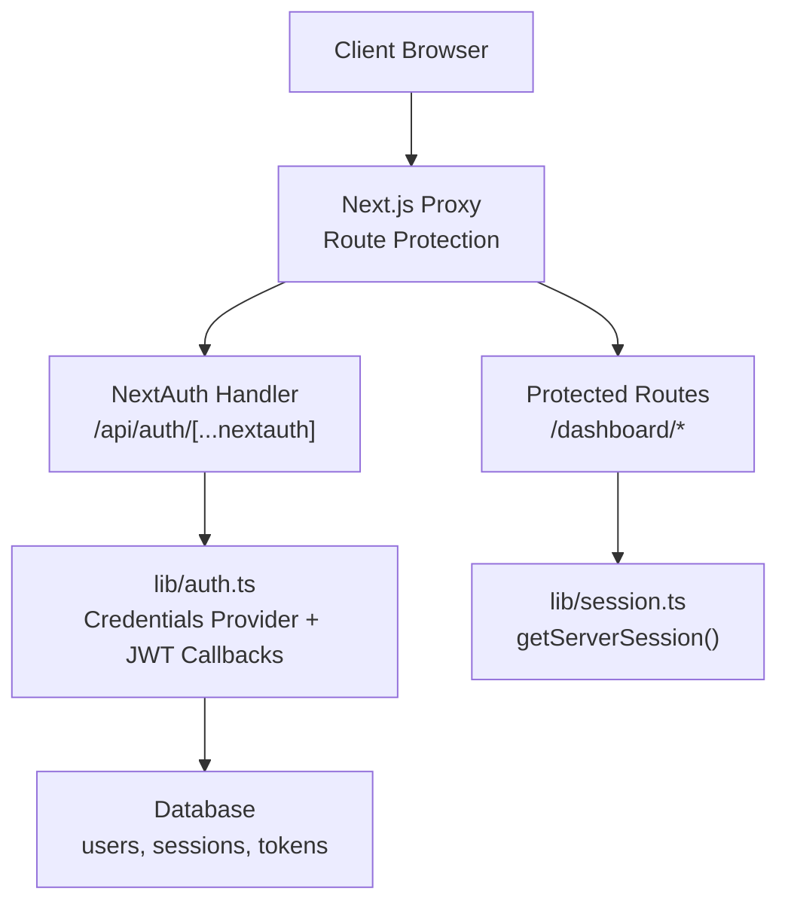
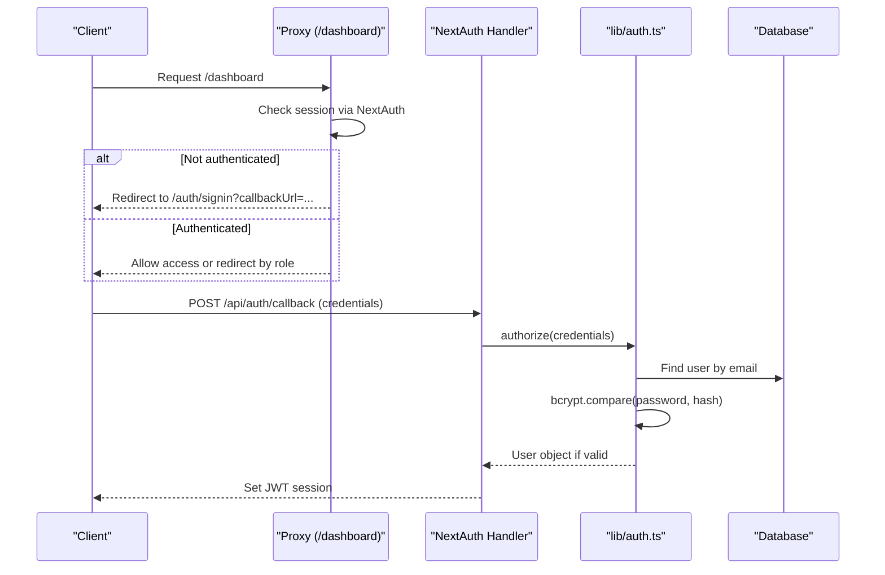
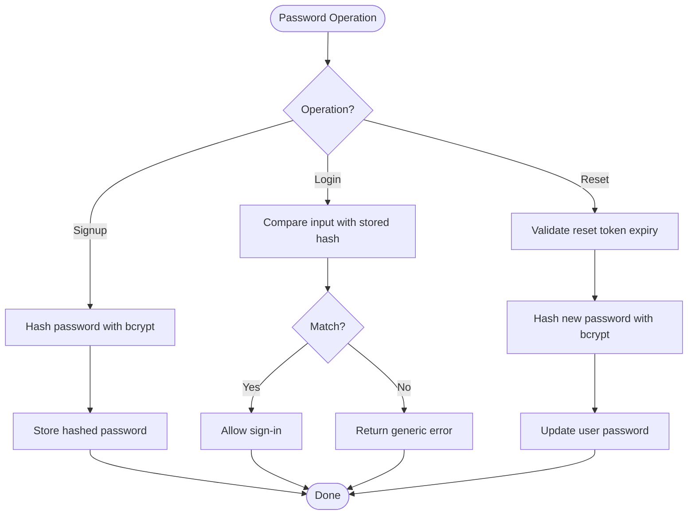
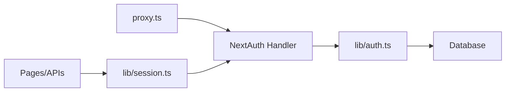
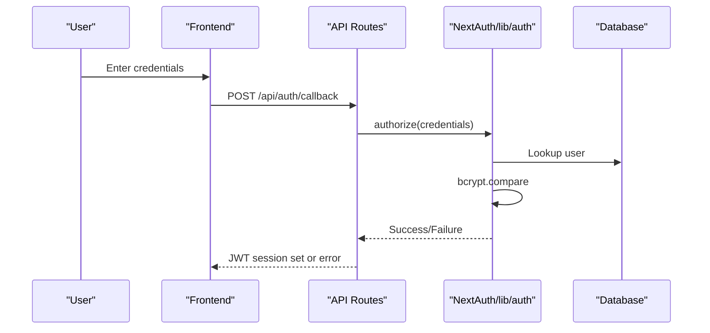

# Security Implementation & Best Practices

<cite>
**Referenced Files in This Document**
- [lib/auth.ts](file://lib/auth.ts)
- [lib/auth.config.ts](file://lib/auth.config.ts)
- [auth.ts](file://auth.ts)
- [app/api/auth/[...nextauth]/route.ts](file://app/api/auth/[...nextauth]/route.ts)
- [proxy.ts](file://proxy.ts)
- [lib/session.ts](file://lib/session.ts)
- [app/api/auth/signup/route.ts](file://app/api/auth/signup/route.ts)
- [app/api/auth/forgot-password/route.ts](file://app/api/auth/forgot-password/route.ts)
- [app/api/auth/reset-password/route.ts](file://app/api/auth/reset-password/route.ts)
- [lib/password-strength.ts](file://lib/password-strength.ts)
- [lib/crypto.ts](file://lib/crypto.ts)
- [next.config.ts](file://next.config.ts)
- [app/dashboard/admin/audit/page.tsx](file://app/dashboard/admin/audit/page.tsx)
</cite>

## Table of Contents
1. [Introduction](#introduction)
2. [Project Structure](#project-structure)
3. [Core Components](#core-components)
4. [Architecture Overview](#architecture-overview)
5. [Detailed Component Analysis](#detailed-component-analysis)
6. [Dependency Analysis](#dependency-analysis)
7. [Performance Considerations](#performance-considerations)
8. [Troubleshooting Guide](#troubleshooting-guide)
9. [Conclusion](#conclusion)
10. [Appendices](#appendices)

## Introduction
This document provides a comprehensive security guide for the TMC Portal authentication system. It covers password hashing with bcrypt, JWT session configuration, secure cookie and CSRF considerations, input validation, rate limiting and brute-force protection, account lockout strategies, security headers, HTTPS enforcement, secure coding practices, testing approaches, vulnerability assessment techniques, troubleshooting, and monitoring strategies. The goal is to help developers implement and maintain a robust, secure authentication flow aligned with current best practices.

## Project Structure
The authentication system is built on NextAuth v5 with a JWT session strategy. Core components include:
- Authentication configuration and provider setup
- API routes for signup, forgot password, reset password, and NextAuth handlers
- Middleware-like proxy for route protection and role-based redirects
- Server-side session retrieval helper
- Password strength utilities and cryptographic helpers for client-side E2EE (separate from auth)

**Diagram sources**
- [proxy.ts:7-43](file://proxy.ts#L7-L43)
- [app/api/auth/[...nextauth]/route.ts:1-8](file://app/api/auth/[...nextauth]/route.ts#L1-L8)
- [lib/auth.ts:131-187](file://lib/auth.ts#L131-L187)
- [lib/session.ts:8-15](file://lib/session.ts#L8-L15)

**Section sources**
- [proxy.ts:7-43](file://proxy.ts#L7-L43)
- [app/api/auth/[...nextauth]/route.ts:1-8](file://app/api/auth/[...nextauth]/route.ts#L1-L8)
- [lib/auth.ts:131-187](file://lib/auth.ts#L131-L187)
- [lib/session.ts:8-15](file://lib/session.ts#L8-L15)

## Core Components
- Credentials authentication with bcrypt password verification
- JWT session strategy with custom token population (roles, permissions, impersonation support)
- Secure signup flow with email verification tokens
- Password reset flow with time-bound tokens
- Route protection via Next.js proxy for dashboard access
- Password strength validation utility

Key responsibilities:
- lib/auth.ts: Defines credentials provider, bcrypt comparison, JWT callbacks, and session mapping
- lib/auth.config.ts: Global NextAuth config (secret, trustHost, JWT strategy)
- app/api/auth/*: Endpoints for signup, forgot-password, reset-password
- proxy.ts: Protects dashboard routes and redirects based on roles
- lib/session.ts: Server session helper compatible with NextAuth v5

**Section sources**
- [lib/auth.ts:131-256](file://lib/auth.ts#L131-L256)
- [lib/auth.config.ts:3-11](file://lib/auth.config.ts#L3-L11)
- [app/api/auth/signup/route.ts:15-53](file://app/api/auth/signup/route.ts#L15-L53)
- [app/api/auth/forgot-password/route.ts:11-44](file://app/api/auth/forgot-password/route.ts#L11-L44)
- [app/api/auth/reset-password/route.ts:10-48](file://app/api/auth/reset-password/route.ts#L10-L48)
- [proxy.ts:7-43](file://proxy.ts#L7-L43)
- [lib/session.ts:8-15](file://lib/session.ts#L8-L15)

## Architecture Overview
The authentication architecture uses NextAuth v5 with JWT sessions. On login, credentials are validated against stored bcrypt hashes. On success, a JWT is issued containing user identity and enriched claims (roles, permissions). A proxy enforces authentication for protected routes and performs role-based redirection. Password reset and signup flows use short-lived tokens stored in the database.

**Diagram sources**
- [proxy.ts:7-43](file://proxy.ts#L7-L43)
- [app/api/auth/[...nextauth]/route.ts:1-8](file://app/api/auth/[...nextauth]/route.ts#L1-L8)
- [lib/auth.ts:146-183](file://lib/auth.ts#L146-L183)

## Detailed Component Analysis

### Password Hashing with bcrypt
- Signup endpoint hashes passwords using bcrypt before storing them in the database.
- Login compares provided password against stored hash using bcrypt.
- Reset password flow validates token expiry, then hashes and updates the password.

Security notes:
- Salt rounds: Default bcrypt cost used in signup and reset endpoints.
- Avoid logging or exposing hashes; ensure error messages do not leak information.
- Use consistent hashing across all flows to prevent mismatches.

**Diagram sources**
- [app/api/auth/signup/route.ts:51-53](file://app/api/auth/signup/route.ts#L51-L53)
- [lib/auth.ts:169-173](file://lib/auth.ts#L169-L173)
- [app/api/auth/reset-password/route.ts:22-48](file://app/api/auth/reset-password/route.ts#L22-L48)

**Section sources**
- [app/api/auth/signup/route.ts:51-53](file://app/api/auth/signup/route.ts#L51-L53)
- [lib/auth.ts:169-173](file://lib/auth.ts#L169-L173)
- [app/api/auth/reset-password/route.ts:22-48](file://app/api/auth/reset-password/route.ts#L22-L48)

### JWT Token Security
- Strategy: JWT sessions configured globally and per-provider.
- Secret: Loaded from environment variable for signing.
- Token payload: Enriched with roles, permissions, membership/officialship data, and impersonation context via callbacks.
- Expiration: Controlled by NextAuth defaults; consider setting explicit expiration and refresh policies at the application level.

Recommendations:
- Set explicit JWT expiration and implement token refresh if long-lived sessions are required.
- Rotate secrets periodically and manage them securely.
- Avoid storing sensitive data in JWT payloads beyond what is necessary.

**Section sources**
- [lib/auth.config.ts:3-11](file://lib/auth.config.ts#L3-L11)
- [lib/auth.ts:185-227](file://lib/auth.ts#L185-L227)

### Session Security and Cookie Configuration
- Sessions are JWT-based; cookies are managed by NextAuth.
- Ensure cookies are set with secure flags when behind HTTPS.
- CSRF: For state-changing requests, validate CSRF tokens where applicable (e.g., forms that mutate server state).

Best practices:
- Serve the application over HTTPS only.
- Configure SameSite and Secure attributes appropriately for your deployment.
- Use the proxy to enforce authentication for protected routes.

**Section sources**
- [lib/auth.config.ts:3-11](file://lib/auth.config.ts#L3-L11)
- [proxy.ts:7-43](file://proxy.ts#L7-L43)

### Input Validation and Sanitization
- Signup inputs are validated with a schema to enforce required fields and formats.
- Reset password enforces minimum length and verifies token validity.
- Always sanitize and validate inputs on both client and server sides.

Guidelines:
- Use strict schemas for all user inputs.
- Escape or encode outputs to prevent XSS.
- Reject unexpected types early to reduce attack surface.

**Section sources**
- [app/api/auth/signup/route.ts:15-23](file://app/api/auth/signup/route.ts#L15-L23)
- [app/api/auth/reset-password/route.ts:14-20](file://app/api/auth/reset-password/route.ts#L14-L20)

### Rate Limiting, Brute Force Protection, and Account Lockout
Current implementation does not include explicit rate limiting or account lockout. Recommended additions:
- Rate limit authentication endpoints (login, signup, forgot-password, reset-password) per IP and per email.
- Implement progressive delays and CAPTCHA after repeated failures.
- Add account lockout after N failed attempts with cooldown and admin unlock.
- Log suspicious activity for audit and alerting.

[No sources needed since this section provides general guidance]

### Security Headers and HTTPS Enforcement
- Enforce HTTPS at the reverse proxy or platform level.
- Set security headers such as Strict-Transport-Security, Content-Security-Policy, X-Frame-Options, Referrer-Policy, and Permissions-Policy.
- Restrict image loading to trusted domains via Next.js configuration.

Note: Image remote patterns are configured to allow specific HTTPS hosts.

**Section sources**
- [next.config.ts:20-36](file://next.config.ts#L20-L36)

### Secure Coding Practices
- Validate and sanitize all inputs.
- Use parameterized queries or ORM-safe operations to prevent injection.
- Minimize error details returned to clients; log detailed errors server-side.
- Follow least privilege principle for roles and permissions.
- Audit privileged actions and store immutable logs.

**Section sources**
- [app/dashboard/admin/audit/page.tsx:13-29](file://app/dashboard/admin/audit/page.tsx#L13-L29)

### Monitoring and Auditing
- Capture and review audit logs for critical actions.
- Monitor failed authentication attempts and token usage anomalies.
- Integrate centralized logging and alerting for security events.

**Section sources**
- [app/dashboard/admin/audit/page.tsx:13-29](file://app/dashboard/admin/audit/page.tsx#L13-L29)

## Dependency Analysis
Authentication dependencies and interactions:
- NextAuth handler exposes GET/POST for authentication flows.
- lib/auth.ts wires credentials provider, bcrypt verification, and JWT callbacks.
- proxy.ts protects routes and redirects based on session and roles.
- lib/session.ts provides server-side session retrieval for pages and APIs.

**Diagram sources**
- [app/api/auth/[...nextauth]/route.ts:1-8](file://app/api/auth/[...nextauth]/route.ts#L1-L8)
- [lib/auth.ts:131-187](file://lib/auth.ts#L131-L187)
- [proxy.ts:7-43](file://proxy.ts#L7-L43)
- [lib/session.ts:8-15](file://lib/session.ts#L8-L15)

**Section sources**
- [app/api/auth/[...nextauth]/route.ts:1-8](file://app/api/auth/[...nextauth]/route.ts#L1-L8)
- [lib/auth.ts:131-187](file://lib/auth.ts#L131-L187)
- [proxy.ts:7-43](file://proxy.ts#L7-L43)
- [lib/session.ts:8-15](file://lib/session.ts#L8-L15)

## Performance Considerations
- bcrypt cost factor impacts CPU usage; tune based on server capacity and latency requirements.
- JWT size grows with roles/permissions; keep payloads minimal and avoid unnecessary data.
- Database queries in token population should be optimized and indexed appropriately.
- Consider caching frequently accessed non-sensitive claims if appropriate.

[No sources needed since this section provides general guidance]

## Troubleshooting Guide
Common issues and resolutions:
- Invalid JSON in request body: Ensure content type and payload format are correct.
- Validation failures: Review schema constraints and update client inputs accordingly.
- Token expired or invalid: Verify token generation and expiration handling; ensure timely use of reset links.
- Session not found: Confirm NextAuth configuration and that the proxy is correctly routing requests.

Diagnostic steps:
- Inspect server logs for detailed error messages.
- Validate environment variables (e.g., secret, URLs).
- Test flows locally with known good inputs and gradually introduce edge cases.

**Section sources**
- [app/api/auth/signup/route.ts:25-37](file://app/api/auth/signup/route.ts#L25-L37)
- [app/api/auth/reset-password/route.ts:10-20](file://app/api/auth/reset-password/route.ts#L10-L20)
- [lib/auth.ts:189-227](file://lib/auth.ts#L189-L227)

## Conclusion
The TMC Portal implements a solid foundation for secure authentication using NextAuth v5 with JWT sessions, bcrypt password hashing, and route protection. To further harden the system, adopt explicit JWT expiration and refresh policies, implement rate limiting and account lockout, enforce HTTPS and security headers, and strengthen input validation and sanitization. Continuous monitoring, auditing, and regular security assessments will help detect and mitigate threats proactively.

[No sources needed since this section summarizes without analyzing specific files]

## Appendices

### Example: Secure Authentication Flow (Conceptual)

[No sources needed since this diagram shows conceptual workflow, not actual code structure]

### Client-Side Cryptography Utilities (E2EE)
The repository includes client-side cryptography utilities for end-to-end encryption using Web Crypto API. These are separate from the authentication system but demonstrate secure key derivation, encryption, and decryption patterns.

**Section sources**
- [lib/crypto.ts:1-14](file://lib/crypto.ts#L1-L14)
- [lib/crypto.ts:76-101](file://lib/crypto.ts#L76-L101)
- [lib/crypto.ts:134-185](file://lib/crypto.ts#L134-L185)
- [lib/crypto.ts:188-284](file://lib/crypto.ts#L188-L284)

### Password Strength Validation
A utility calculates password strength based on complexity and length, providing feedback to users and enforcing minimum thresholds.

**Section sources**
- [lib/password-strength.ts:10-62](file://lib/password-strength.ts#L10-L62)