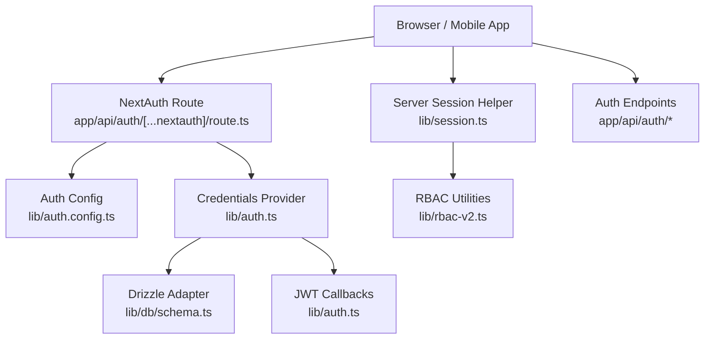
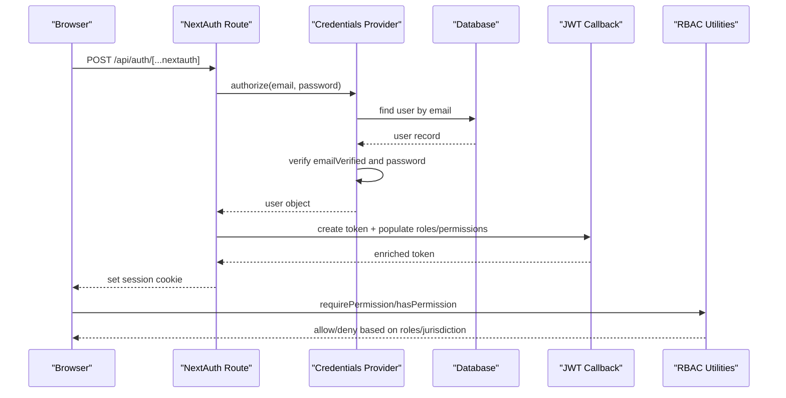
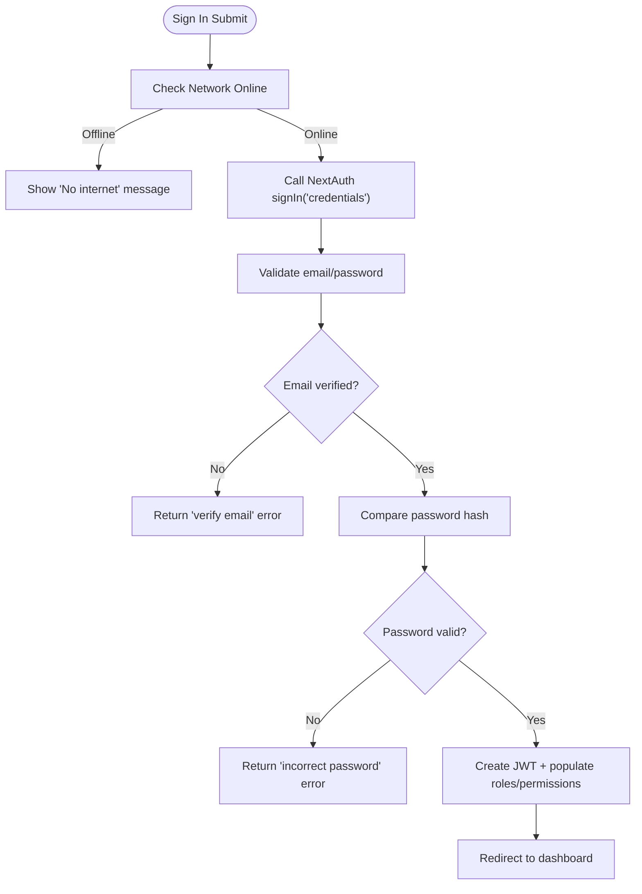
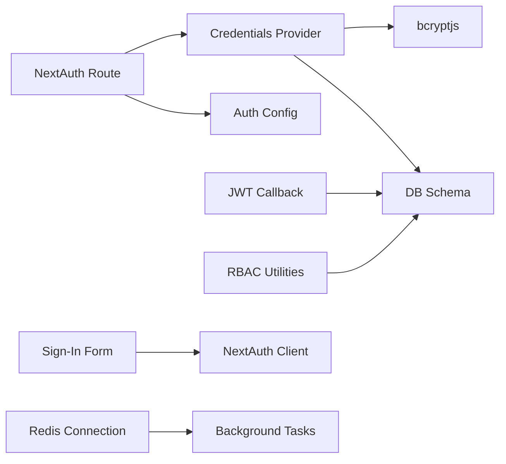

# Troubleshooting & Debugging

<cite>
**Referenced Files in This Document**
- [route.ts](file://app/api/auth/[...nextauth]/route.ts)
- [auth.config.ts](file://lib/auth.config.ts)
- [auth.ts](file://lib/auth.ts)
- [session.ts](file://lib/session.ts)
- [rbac-v2.ts](file://lib/rbac-v2.ts)
- [signin-form.tsx](file://components/auth/signin-form.tsx)
- [signup route.ts](file://app/api/auth/signup/route.ts)
- [forgot-password route.ts](file://app/api/auth/forgot-password/route.ts)
- [schema.ts](file://lib/db/schema.ts)
- [redis.ts](file://lib/redis.ts)
- [debug-auth.ts](file://scripts/debug-auth.ts)
</cite>

## Table of Contents
1. Introduction
2. Project Structure
3. Core Components
4. Architecture Overview
5. Detailed Component Analysis
6. Dependency Analysis
7. Performance Considerations
8. Troubleshooting Guide
9. Conclusion
10. Appendices

## Introduction
This document provides comprehensive troubleshooting and debugging guidance for the TMC Portal authentication and authorization system. It focuses on diagnosing login failures, session timeouts, permission errors, jurisdiction access problems, JWT issues, session corruption, and environment or integration failures. It includes step-by-step debugging procedures, log analysis techniques, browser developer tools usage, server-side diagnostics, and performance optimization tips for authentication flows and permission checks.

## Project Structure
The authentication and authorization system is implemented using NextAuth v5 with a JWT session strategy, Drizzle ORM adapter, and a custom credentials provider. The key entry points are:
- NextAuth route handler at app/api/auth/[...nextauth]
- Auth configuration and providers in lib/auth.ts and lib/auth.config.ts
- Session helper in lib/session.ts
- RBAC utilities in lib/rbac-v2.ts
- Frontend sign-in form in components/auth/signin-form.tsx
- Account lifecycle endpoints (signup, forgot password) under app/api/auth/*
- Database schema definitions in lib/db/schema.ts
- Optional Redis connection in lib/redis.ts

**Diagram sources**
- [route.ts:1-8](file://app/api/auth/[...nextauth]/route.ts#L1-L8)
- [auth.config.ts:1-12](file://lib/auth.config.ts#L1-L12)
- [auth.ts:131-257](file://lib/auth.ts#L131-L257)
- [schema.ts:83-146](file://lib/db/schema.ts#L83-L146)
- [session.ts:1-16](file://lib/session.ts#L1-L16)
- [rbac-v2.ts:141-165](file://lib/rbac-v2.ts#L141-L165)

**Section sources**
- [route.ts:1-8](file://app/api/auth/[...nextauth]/route.ts#L1-L8)
- [auth.config.ts:1-12](file://lib/auth.config.ts#L1-L12)
- [auth.ts:131-257](file://lib/auth.ts#L131-L257)
- [session.ts:1-16](file://lib/session.ts#L1-L16)
- [schema.ts:83-146](file://lib/db/schema.ts#L83-L146)

## Core Components
- NextAuth route handler exposes GET/POST handlers for authentication flows.
- Auth configuration sets JWT strategy, trust host, secret, and sign-in page.
- Credentials provider validates email/password, enforces email verification, and returns user data.
- JWT callback populates roles, permissions, member/official profiles, and supports impersonation/revert flows.
- Session callback enriches client session with roles, permissions, and profile fields.
- RBAC utilities provide permission and role checks, including jurisdiction-based organization access.
- Sign-in form handles client-side validation, network checks, and error display.
- Signup and forgot-password endpoints manage account creation, verification tokens, and reset links.
- Database schema defines users, sessions, verification tokens, organizations, and related tables.
- Redis connection is available for background jobs (e.g., queues), which can indirectly affect auth-related tasks like email delivery.

**Section sources**
- [route.ts:1-8](file://app/api/auth/[...nextauth]/route.ts#L1-L8)
- [auth.config.ts:1-12](file://lib/auth.config.ts#L1-L12)
- [auth.ts:32-129](file://lib/auth.ts#L32-L129)
- [auth.ts:146-183](file://lib/auth.ts#L146-L183)
- [auth.ts:189-251](file://lib/auth.ts#L189-L251)
- [rbac-v2.ts:47-136](file://lib/rbac-v2.ts#L47-L136)
- [signin-form.tsx:20-65](file://components/auth/signin-form.tsx#L20-L65)
- [signup route.ts:25-141](file://app/api/auth/signup/route.ts#L25-L141)
- [forgot-password route.ts:11-77](file://app/api/auth/forgot-password/route.ts#L11-L77)
- [schema.ts:83-146](file://lib/db/schema.ts#L83-L146)
- [redis.ts:1-9](file://lib/redis.ts#L1-L9)

## Architecture Overview
Authentication flow:
- Client submits credentials via the sign-in form.
- NextAuth route processes the request using the credentials provider.
- On success, a JWT is created and enriched with roles, permissions, and profile data.
- Subsequent requests use the JWT to reconstruct the session and enforce RBAC.

Authorization flow:
- RBAC utilities compute effective permissions and jurisdiction access.
- Super-admin roles bypass restrictions; otherwise, permission and organization hierarchy checks apply.

**Diagram sources**
- [route.ts:1-8](file://app/api/auth/[...nextauth]/route.ts#L1-L8)
- [auth.ts:146-183](file://lib/auth.ts#L146-L183)
- [auth.ts:189-251](file://lib/auth.ts#L189-L251)
- [rbac-v2.ts:141-165](file://lib/rbac-v2.ts#L141-L165)

## Detailed Component Analysis

### Authentication Flow and Error Handling
- Sign-in form performs online check, calls NextAuth credentials provider, and displays user-friendly errors for network or configuration issues.
- Credentials provider validates presence of email/password, ensures email is verified, compares password hash, and throws a custom error for invalid credentials or missing password.
- JWT callback populates roles, permissions, member/official profiles, and supports admin impersonation and revert flows. Errors in callbacks are logged but do not break the token.

**Diagram sources**
- [signin-form.tsx:20-65](file://components/auth/signin-form.tsx#L20-L65)
- [auth.ts:146-183](file://lib/auth.ts#L146-L183)
- [auth.ts:189-251](file://lib/auth.ts#L189-L251)

**Section sources**
- [signin-form.tsx:20-65](file://components/auth/signin-form.tsx#L20-L65)
- [auth.ts:146-183](file://lib/auth.ts#L146-L183)
- [auth.ts:189-251](file://lib/auth.ts#L189-L251)

### JWT Token Issues
Common symptoms:
- Missing roles or permissions in session.
- Impersonation state not cleared.
- Token payload too large causing cookie limits.

Debug steps:
- Inspect JWT payload in browser dev tools (Application > Cookies or Storage).
- Verify that JWT callback runs and populates roles/permissions.
- Check for errors in JWT callback logs.
- Ensure AUTH_SECRET is configured and consistent across deployments.
- Confirm trustHost is enabled if behind reverse proxy.

Relevant implementation:
- JWT strategy and base config.
- JWT callback populating roles, permissions, member/official profiles, and handling impersonation/revert.

**Section sources**
- [auth.config.ts:1-12](file://lib/auth.config.ts#L1-L12)
- [auth.ts:189-251](file://lib/auth.ts#L189-L251)

### Session Timeouts and Corruption
Symptoms:
- Frequent sign-ins or unexpected redirects to sign-in.
- Session data inconsistent between requests.

Debug steps:
- Verify session strategy is JWT and that cookies are set correctly.
- Check NEXTAUTH_URL and domain/path settings if behind proxies.
- Use getServerSession to confirm server-side session availability.
- Inspect database sessions table if using session store (though JWT is primary here).

Relevant implementation:
- JWT session strategy in config.
- Server session helper wrapper.

**Section sources**
- [auth.config.ts:1-12](file://lib/auth.config.ts#L1-L12)
- [session.ts:1-16](file://lib/session.ts#L1-L16)

### Permission Errors and Jurisdiction Access Problems
Symptoms:
- Forbidden responses when accessing protected resources.
- Users unable to access organizations outside their jurisdiction.

Debug steps:
- Confirm user has active roles and granted permissions.
- Check jurisdiction level and organization hierarchy for access.
- Use RBAC utilities to evaluate permissions and jurisdiction.
- Log permission checks with userId, requested permission, and organizationId.

Relevant implementation:
- getUserPermissions, hasPermission, canAccessOrganization, requirePermission, requireRole.

**Section sources**
- [rbac-v2.ts:47-136](file://lib/rbac-v2.ts#L47-L136)
- [rbac-v2.ts:141-165](file://lib/rbac-v2.ts#L141-L165)
- [rbac-v2.ts:170-213](file://lib/rbac-v2.ts#L170-L213)
- [rbac-v2.ts:313-358](file://lib/rbac-v2.ts#L313-L358)

### Account Lifecycle (Signup and Password Reset)
- Signup validates input, hashes password, creates user, generates verification token, sends verification email, and logs audit events.
- Forgot-password generates a time-bound reset token, stores it, constructs reset URL, and sends email.

Debug steps:
- Validate request payloads and schema parsing errors.
- Check email service configuration and delivery logs.
- Verify verification/reset tokens exist and are not expired.

**Section sources**
- [signup route.ts:25-141](file://app/api/auth/signup/route.ts#L25-L141)
- [forgot-password route.ts:11-77](file://app/api/auth/forgot-password/route.ts#L11-L77)

### Database Schema and Data Integrity
Key tables involved in authentication:
- users: identity and credentials.
- accounts: linked OAuth accounts.
- sessions: session records (used by adapter).
- verification_tokens: email verification and password reset tokens.
- organizations: hierarchical structure used for jurisdiction checks.

Debug steps:
- Inspect user records for emailVerified status and password presence.
- Check verification_tokens for existence and expiry.
- Validate organization hierarchy for jurisdiction logic.

**Section sources**
- [schema.ts:83-146](file://lib/db/schema.ts#L83-L146)
- [schema.ts:148-188](file://lib/db/schema.ts#L148-L188)

## Dependency Analysis
Core dependencies and relationships:
- NextAuth route depends on auth configuration and providers.
- Credentials provider depends on database schema and bcrypt for password hashing.
- JWT callback depends on database queries to populate roles, permissions, and profiles.
- RBAC utilities depend on database schema and organization hierarchy.
- Sign-in form depends on NextAuth client SDK and UI components.
- Redis connection may support background tasks affecting email delivery or queue processing.

**Diagram sources**
- [route.ts:1-8](file://app/api/auth/[...nextauth]/route.ts#L1-L8)
- [auth.config.ts:1-12](file://lib/auth.config.ts#L1-L12)
- [auth.ts:146-183](file://lib/auth.ts#L146-L183)
- [auth.ts:189-251](file://lib/auth.ts#L189-L251)
- [rbac-v2.ts:47-136](file://lib/rbac-v2.ts#L47-L136)
- [signin-form.tsx:20-65](file://components/auth/signin-form.tsx#L20-L65)
- [redis.ts:1-9](file://lib/redis.ts#L1-L9)

**Section sources**
- [route.ts:1-8](file://app/api/auth/[...nextauth]/route.ts#L1-L8)
- [auth.config.ts:1-12](file://lib/auth.config.ts#L1-L12)
- [auth.ts:146-183](file://lib/auth.ts#L146-L183)
- [auth.ts:189-251](file://lib/auth.ts#L189-L251)
- [rbac-v2.ts:47-136](file://lib/rbac-v2.ts#L47-L136)
- [signin-form.tsx:20-65](file://components/auth/signin-form.tsx#L20-L65)
- [redis.ts:1-9](file://lib/redis.ts#L1-L9)

## Performance Considerations
- Minimize DB queries during JWT population by batching or caching frequently accessed role/permission data where appropriate.
- Avoid excessive logging in hot paths; use structured logs with correlation IDs.
- Ensure NEXTAUTH_URL and proxy headers are correct to prevent unnecessary revalidations.
- Monitor Redis connectivity if background tasks impact email delivery or token generation latency.
- Profile permission checks for high-traffic endpoints; consider caching computed permissions per session or short-lived cache.

[No sources needed since this section provides general guidance]

## Troubleshooting Guide

### Login Failures
Symptoms:
- Invalid email or password messages.
- Configuration errors.
- Network errors.

Step-by-step debugging:
1. Verify network connectivity from the client.
2. Check sign-in form error handling and toast messages.
3. Confirm credentials provider validates email and password correctly.
4. Ensure user exists, email is verified, and password is set.
5. Use debug script to validate password hash against stored hash.

Diagnostic tools:
- Browser console for network errors and toast messages.
- Server logs for credential validation and custom auth errors.
- scripts/debug-auth.ts to test password verification locally.

**Section sources**
- [signin-form.tsx:20-65](file://components/auth/signin-form.tsx#L20-L65)
- [auth.ts:146-183](file://lib/auth.ts#L146-L183)
- [debug-auth.ts:7-68](file://scripts/debug-auth.ts#L7-L68)

### Session Timeouts
Symptoms:
- Unexpected redirects to sign-in.
- Session data missing or inconsistent.

Step-by-step debugging:
1. Confirm JWT strategy and AUTH_SECRET configuration.
2. Check NEXTAUTH_URL and proxy settings for cookie domain/path.
3. Use getServerSession to verify server-side session availability.
4. Inspect cookies in browser dev tools for session token presence.

**Section sources**
- [auth.config.ts:1-12](file://lib/auth.config.ts#L1-L12)
- [session.ts:1-16](file://lib/session.ts#L1-L16)

### Permission Errors
Symptoms:
- Forbidden responses when accessing protected routes.
- Missing required role or permission.

Step-by-step debugging:
1. Identify the required permission or role for the endpoint.
2. Verify user has active roles and granted permissions.
3. Check jurisdiction level and organization hierarchy for access.
4. Use requirePermission/requireRole to enforce checks and capture error messages.

Diagnostic tools:
- RBAC utilities functions to evaluate permissions and roles.
- Logs capturing userId, requested permission, and organizationId.

**Section sources**
- [rbac-v2.ts:141-165](file://lib/rbac-v2.ts#L141-L165)
- [rbac-v2.ts:313-358](file://lib/rbac-v2.ts#L313-L358)

### Jurisdiction Access Problems
Symptoms:
- Users cannot access organizations outside their jurisdiction.
- Incorrect hierarchy traversal results.

Step-by-step debugging:
1. Confirm user’s organizationId and role jurisdictionLevel.
2. Validate target organization’s level and parent hierarchy.
3. Use canAccessOrganization to check direct matches and hierarchical access.

**Section sources**
- [rbac-v2.ts:170-213](file://lib/rbac-v2.ts#L170-L213)
- [rbac-v2.ts:218-259](file://lib/rbac-v2.ts#L218-L259)

### JWT Token Issues
Symptoms:
- Roles or permissions missing in session.
- Impersonation state persists unexpectedly.

Step-by-step debugging:
1. Inspect JWT payload in browser storage.
2. Check JWT callback logs for errors.
3. Ensure impersonation/revert flows clear impersonatorId appropriately.
4. Verify AUTH_SECRET consistency across environments.

**Section sources**
- [auth.ts:189-251](file://lib/auth.ts#L189-L251)

### Session Corruption
Symptoms:
- Session data mismatch between requests.
- Unexpected user context after actions.

Step-by-step debugging:
1. Validate session reconstruction via getServerSession.
2. Check for concurrent requests modifying session state.
3. Review JWT callback updates for side effects.

**Section sources**
- [session.ts:1-16](file://lib/session.ts#L1-L16)
- [auth.ts:189-251](file://lib/auth.ts#L189-L251)

### Environment Variable Configuration
Common issues:
- Missing or incorrect AUTH_SECRET.
- Incorrect NEXTAUTH_URL leading to cookie domain/path mismatches.
- Redis URL misconfiguration affecting background tasks.

Step-by-step debugging:
1. Verify environment variables in deployment and local setups.
2. Test endpoints with minimal payloads to isolate env issues.
3. Check logs for configuration-related errors.

**Section sources**
- [auth.config.ts:1-12](file://lib/auth.config.ts#L1-L12)
- [redis.ts:1-9](file://lib/redis.ts#L1-L9)

### Database Connectivity Problems
Symptoms:
- Failed user lookups or token operations.
- Errors during signup or password reset.

Step-by-step debugging:
1. Confirm database connection string and credentials.
2. Inspect schema tables for expected records (users, verification_tokens).
3. Use diagnostic scripts to query and validate data integrity.

**Section sources**
- [schema.ts:83-146](file://lib/db/schema.ts#L83-L146)
- [signup route.ts:25-141](file://app/api/auth/signup/route.ts#L25-L141)
- [forgot-password route.ts:11-77](file://app/api/auth/forgot-password/route.ts#L11-L77)

### Third-Party Service Integration Failures
Symptoms:
- Verification or reset emails not delivered.
- Webhook or external service errors impacting auth flows.

Step-by-step debugging:
1. Check email service configuration and templates.
2. Inspect logs for sendEmail calls and responses.
3. Validate URLs constructed for verification/reset links.

**Section sources**
- [signup route.ts:85-106](file://app/api/auth/signup/route.ts#L85-L106)
- [forgot-password route.ts:44-66](file://app/api/auth/forgot-password/route.ts#L44-L66)

### Mobile App Authentication
Symptoms:
- CORS errors or failed network requests.
- Session cookies not persisted.

Step-by-step debugging:
1. Ensure NEXTAUTH_URL matches mobile app base URL or configure CORS appropriately.
2. Verify that mobile clients handle cookies or pass Authorization headers consistently.
3. Test with curl or Postman to isolate client-specific issues.

[No sources needed since this section provides general guidance]

### API Endpoint Access Issues
Symptoms:
- Unauthorized or forbidden responses.
- Missing session data.

Step-by-step debugging:
1. Confirm getServerSession returns a valid session.
2. Check requirePermission/requireRole usage in endpoints.
3. Inspect logs for unauthorized/forbidden errors.

**Section sources**
- [session.ts:1-16](file://lib/session.ts#L1-L16)
- [rbac-v2.ts:313-358](file://lib/rbac-v2.ts#L313-L358)

### Cross-Origin Request Problems
Symptoms:
- CORS errors blocking authentication requests.
- Preflight failures.

Step-by-step debugging:
1. Configure trusted hosts and origins in NextAuth and server.
2. Verify proxy headers and domains match NEXTAUTH_URL.
3. Test with browser dev tools Network tab to inspect preflight and response headers.

[No sources needed since this section provides general guidance]

### Browser Developer Tools Techniques
- Network tab: Inspect requests to /api/auth/*, check status codes, headers, and payloads.
- Application tab: View cookies for session tokens and any JWT-related storage.
- Console: Capture errors and logs from client-side sign-in flow.
- Local storage: If applicable, inspect any cached tokens or session artifacts.

[No sources needed since this section provides general guidance]

### Server-Side Debugging Techniques
- Logging strategies: Add structured logs around credential validation, JWT callback, and RBAC checks.
- Error tracking: Capture stack traces for signup and password reset endpoints.
- Performance monitoring: Measure latency of DB queries in JWT population and permission checks.

**Section sources**
- [auth.ts:224-251](file://lib/auth.ts#L224-L251)
- [signup route.ts:114-139](file://app/api/auth/signup/route.ts#L114-L139)
- [forgot-password route.ts:72-77](file://app/api/auth/forgot-password/route.ts#L72-L77)

### Performance Optimization Tips
- Cache role/permission lookups where safe to reduce DB load.
- Batch queries in JWT callback to minimize round trips.
- Use indexes on frequently queried columns (email, userId, organizationId).
- Monitor Redis connectivity and queue backlogs that may delay email delivery.

[No sources needed since this section provides general guidance]

## Conclusion
This guide outlines practical steps to diagnose and resolve common authentication and authorization issues in the TMC Portal. By leveraging browser developer tools, server-side logs, RBAC utilities, and database schema insights, you can efficiently identify root causes for login failures, session timeouts, permission errors, and jurisdiction access problems. Proper environment configuration, robust logging, and performance-aware implementations will improve reliability and user experience.

## Appendices

### Quick Reference: Key Files and Responsibilities
- NextAuth route handler: Entry point for authentication flows.
- Auth configuration: JWT strategy, secret, and sign-in page.
- Credentials provider: Validates credentials and enforces email verification.
- JWT callback: Populates roles, permissions, and profiles; handles impersonation.
- Session helper: Retrieves server-side session safely.
- RBAC utilities: Enforce permissions and jurisdiction-based access.
- Sign-in form: Client-side validation and error handling.
- Account endpoints: Manage signup, verification, and password reset.
- Database schema: Defines core tables for users, sessions, tokens, and organizations.
- Redis connection: Supports background tasks that may impact auth-related workflows.

**Section sources**
- [route.ts:1-8](file://app/api/auth/[...nextauth]/route.ts#L1-L8)
- [auth.config.ts:1-12](file://lib/auth.config.ts#L1-L12)
- [auth.ts:146-183](file://lib/auth.ts#L146-L183)
- [auth.ts:189-251](file://lib/auth.ts#L189-L251)
- [session.ts:1-16](file://lib/session.ts#L1-L16)
- [rbac-v2.ts:141-165](file://lib/rbac-v2.ts#L141-L165)
- [signin-form.tsx:20-65](file://components/auth/signin-form.tsx#L20-L65)
- [signup route.ts:25-141](file://app/api/auth/signup/route.ts#L25-L141)
- [forgot-password route.ts:11-77](file://app/api/auth/forgot-password/route.ts#L11-L77)
- [schema.ts:83-146](file://lib/db/schema.ts#L83-L146)
- [redis.ts:1-9](file://lib/redis.ts#L1-L9)