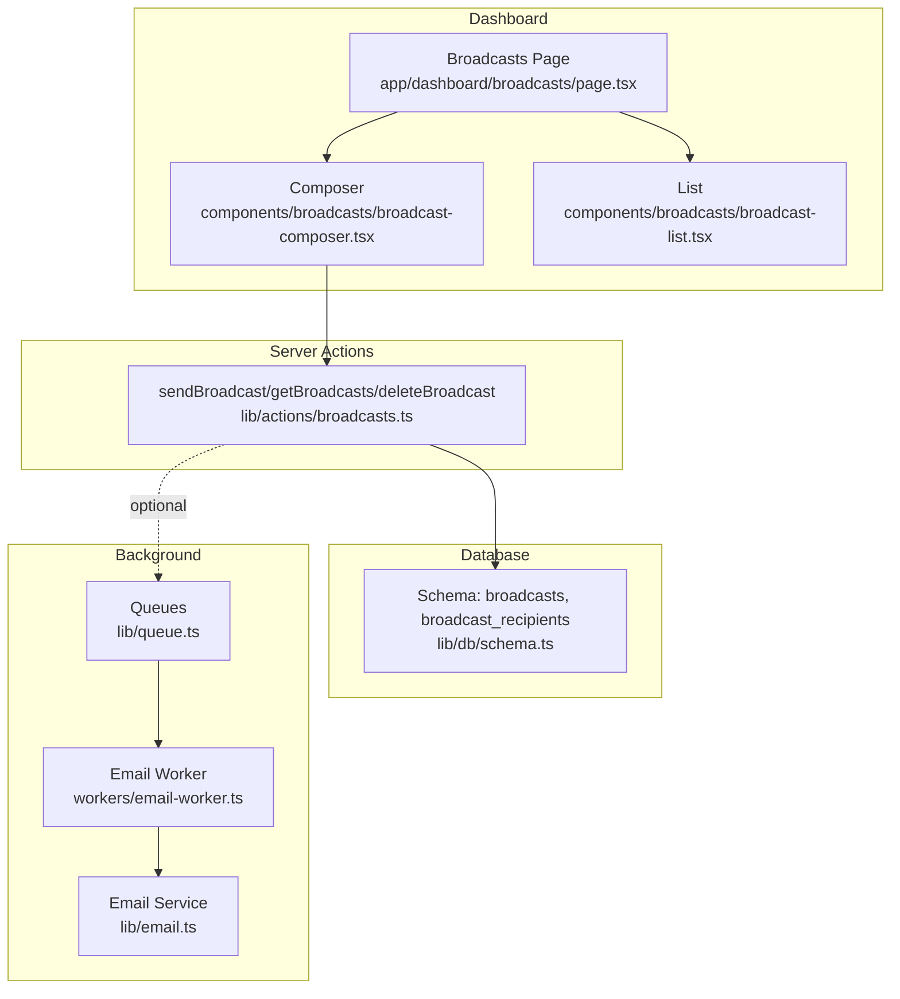
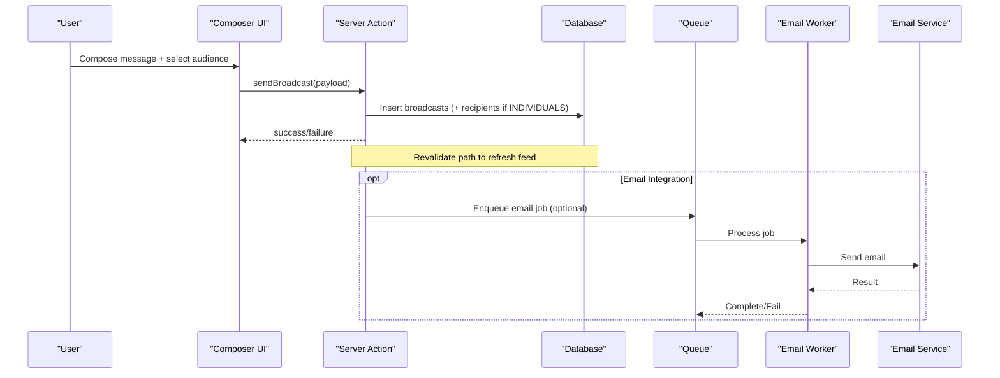
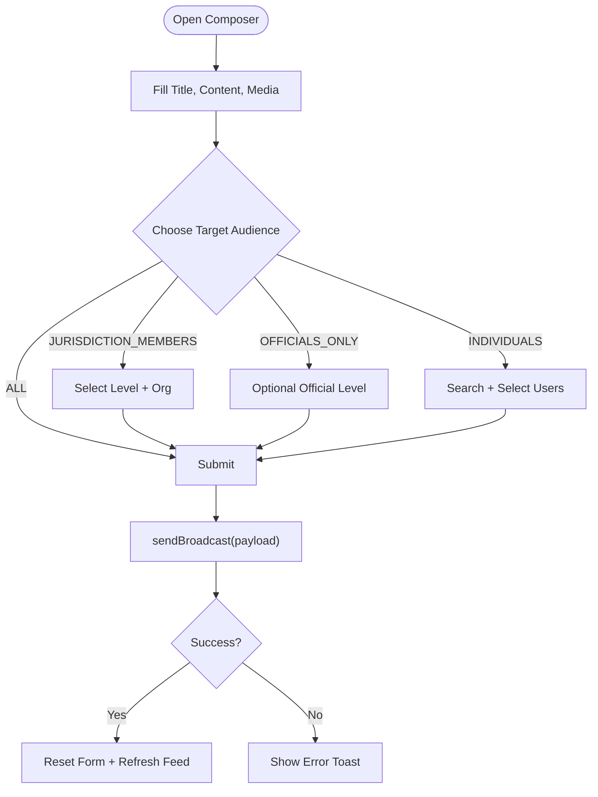
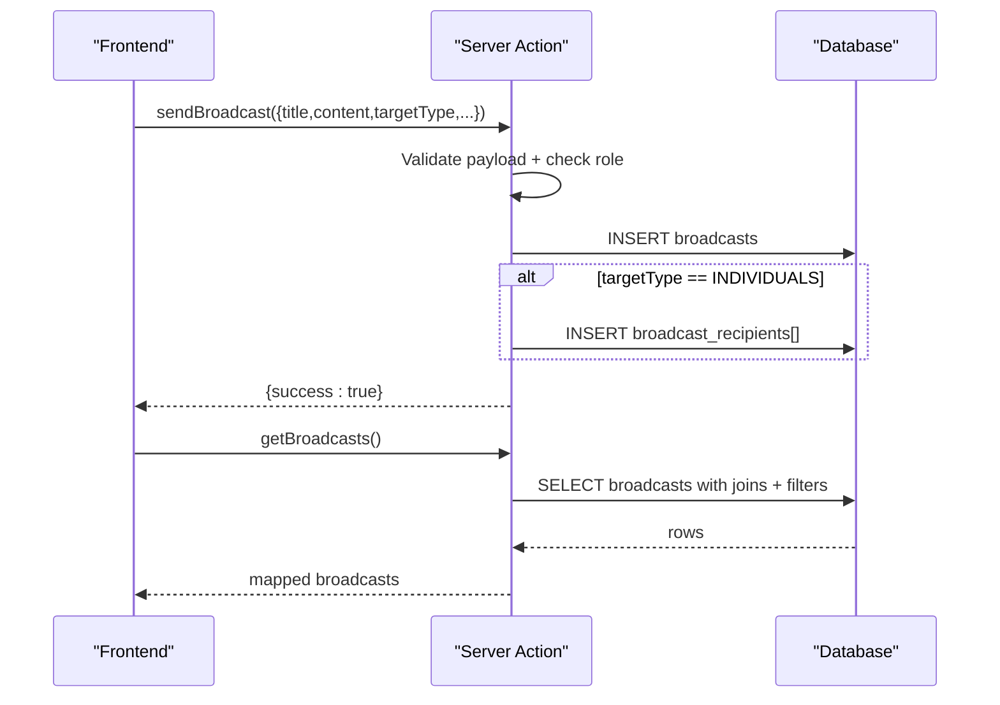
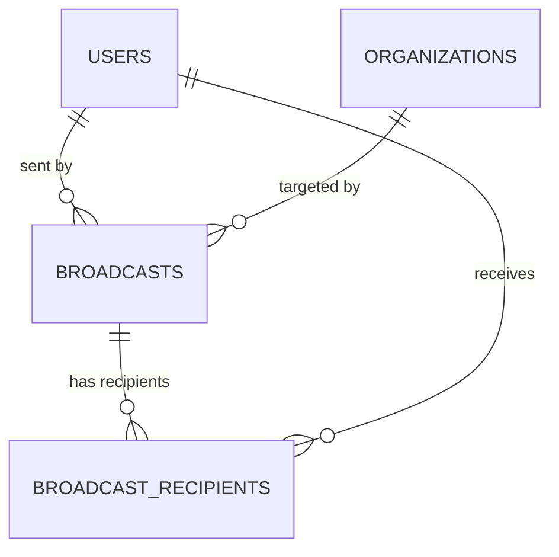
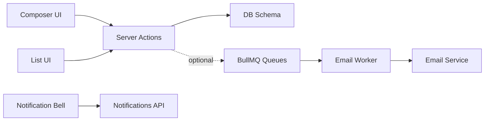

# Broadcast & Announcement Management

<cite>
**Referenced Files in This Document**
- [broadcast-composer.tsx](file://components/broadcasts/broadcast-composer.tsx)
- [broadcast-list.tsx](file://components/broadcasts/broadcast-list.tsx)
- [page.tsx](file://app/dashboard/broadcasts/page.tsx)
- [broadcasts.ts](file://lib/actions/broadcasts.ts)
- [schema.ts](file://lib/db/schema.ts)
- [email-worker.ts](file://workers/email-worker.ts)
- [queue.ts](file://lib/queue.ts)
- [email.ts](file://lib/email.ts)
- [notification-bell.tsx](file://components/layout/notification-bell.tsx)
- [route.ts](file://app/api/notifications/route.ts)
</cite>

## Table of Contents
1. Introduction
2. Project Structure
3. Core Components
4. Architecture Overview
5. Detailed Component Analysis
6. Dependency Analysis
7. Performance Considerations
8. Troubleshooting Guide
9. Conclusion
10. Appendices

## Introduction
This document explains the broadcast and announcement system that enables targeted messaging to organization members. It covers the broadcast composer for rich content creation, audience targeting by hierarchy and roles, lifecycle from creation to delivery, analytics via delivery status and read receipts, templates and bulk operations, and integration with external communication platforms. It also provides best practices for effective broadcasting and managing high-volume campaigns.

## Project Structure
The broadcast feature is implemented as a Next.js dashboard module with server actions, database schema definitions, UI components, and background workers for email delivery.

**Diagram sources**
- [page.tsx:14-85](file://app/dashboard/broadcasts/page.tsx#L14-L85)
- [broadcast-composer.tsx:45-137](file://components/broadcasts/broadcast-composer.tsx#L45-L137)
- [broadcast-list.tsx:13-122](file://components/broadcasts/broadcast-list.tsx#L13-L122)
- [broadcasts.ts:24-165](file://lib/actions/broadcasts.ts#L24-L165)
- [schema.ts:529-577](file://lib/db/schema.ts#L529-L577)
- [queue.ts:1-18](file://lib/queue.ts#L1-L18)
- [email-worker.ts:1-32](file://workers/email-worker.ts#L1-L32)
- [email.ts:1-92](file://lib/email.ts#L1-L92)

**Section sources**
- [page.tsx:14-85](file://app/dashboard/broadcasts/page.tsx#L14-L85)
- [broadcast-composer.tsx:45-137](file://components/broadcasts/broadcast-composer.tsx#L45-L137)
- [broadcast-list.tsx:13-122](file://components/broadcasts/broadcast-list.tsx#L13-L122)
- [broadcasts.ts:24-165](file://lib/actions/broadcasts.ts#L24-L165)
- [schema.ts:529-577](file://lib/db/schema.ts#L529-L577)
- [queue.ts:1-18](file://lib/queue.ts#L1-L18)
- [email-worker.ts:1-32](file://workers/email-worker.ts#L1-L32)
- [email.ts:1-92](file://lib/email.ts#L1-L92)

## Core Components
- Broadcast Composer: Client-side form for composing messages, selecting target audiences, attaching media, and sending broadcasts.
- Broadcast List: Displays received broadcasts with sender info, target level, attachments, and delete action for the sender.
- Server Actions: Validate payloads, enforce permissions (officials or superadmins), persist broadcasts and recipients, and revalidate routes.
- Database Schema: Defines broadcasts and broadcast_recipients tables with enums for target types and statuses, plus timestamps for delivery and read events.
- Background Email: Optional queue-based email delivery using BullMQ and Resend, with logging to an email logs table.
- Notifications: In-app notification bell and API for polling unread notifications and marking them read.

**Section sources**
- [broadcast-composer.tsx:29-137](file://components/broadcasts/broadcast-composer.tsx#L29-L137)
- [broadcast-list.tsx:13-122](file://components/broadcasts/broadcast-list.tsx#L13-L122)
- [broadcasts.ts:24-165](file://lib/actions/broadcasts.ts#L24-L165)
- [schema.ts:529-577](file://lib/db/schema.ts#L529-L577)
- [email-worker.ts:1-32](file://workers/email-worker.ts#L1-L32)
- [queue.ts:1-18](file://lib/queue.ts#L1-L18)
- [email.ts:1-92](file://lib/email.ts#L1-L92)
- [notification-bell.tsx:20-173](file://components/layout/notification-bell.tsx#L20-L173)
- [route.ts:7-41](file://app/api/notifications/route.ts#L7-L41)

## Architecture Overview
The broadcast flow starts at the dashboard page, which renders the composer and list. The composer validates and sends data via server actions. The server action persists the broadcast and optionally recipient records. Delivery tracking is stored per recipient. Optional email jobs can be queued for external communication channels.

**Diagram sources**
- [broadcast-composer.tsx:115-137](file://components/broadcasts/broadcast-composer.tsx#L115-L137)
- [broadcasts.ts:24-74](file://lib/actions/broadcasts.ts#L24-L74)
- [queue.ts:1-18](file://lib/queue.ts#L1-L18)
- [email-worker.ts:10-24](file://workers/email-worker.ts#L10-L24)
- [email.ts:21-92](file://lib/email.ts#L21-L92)

## Detailed Component Analysis

### Broadcast Composer
- Purpose: Create rich content messages with formatting options, attachments, and scheduling controls.
- Targeting: Supports ALL, JURISDICTION_MEMBERS, OFFICIALS_ONLY, and INDIVIDUALS. For jurisdictional targets, selects level and specific organization; for officials-only, filters by official level.
- Attachments: Upload images, audio, video via a dedicated upload endpoint; previews shown in the composer.
- Validation: Zod schema enforces required fields and allowed enums.
- Submission: Calls server action to persist broadcast and recipients; shows toast feedback and refreshes feed.

**Diagram sources**
- [broadcast-composer.tsx:29-137](file://components/broadcasts/broadcast-composer.tsx#L29-L137)

**Section sources**
- [broadcast-composer.tsx:29-137](file://components/broadcasts/broadcast-composer.tsx#L29-L137)

### Broadcast List
- Purpose: Display broadcasts visible to the current user based on targeting rules.
- Features: Shows sender avatar/name, title, relative timestamp, target level badge, optional target organization name, and media attachments (image, audio, video). Sender can delete their own broadcasts.

**Section sources**
- [broadcast-list.tsx:13-122](file://components/broadcasts/broadcast-list.tsx#L13-L122)

### Dashboard Page
- Purpose: Orchestrates access control and rendering of tabs for feed and composer.
- Behavior: Loads organizations for targeting when the user is an official or superadmin; fetches broadcasts filtered for the current user; conditionally shows composer tab.

**Section sources**
- [page.tsx:14-85](file://app/dashboard/broadcasts/page.tsx#L14-L85)

### Server Actions (Broadcasts)
- sendBroadcast: Validates payload, checks permissions (official or superadmin), inserts broadcast record, and inserts recipients for INDIVIDUALS targeting. Revalidates route to update UI.
- getBroadcasts: Builds visibility query considering user’s membership/official profile, organization ancestors, and target type/level/official-level filters. Joins sender and target organization info.
- deleteBroadcast: Allows sender to delete their own broadcast.

**Diagram sources**
- [broadcasts.ts:24-165](file://lib/actions/broadcasts.ts#L24-L165)

**Section sources**
- [broadcasts.ts:24-165](file://lib/actions/broadcasts.ts#L24-L165)

### Data Model and Relationships
- broadcasts: Stores message metadata, targeting parameters, and media references.
- broadcast_recipients: Tracks per-user delivery status (DELIVERED, READ) and timestamps.
- Relations link broadcasts to users (sender), organizations (target), and recipients.

**Diagram sources**
- [schema.ts:529-577](file://lib/db/schema.ts#L529-L577)

**Section sources**
- [schema.ts:529-577](file://lib/db/schema.ts#L529-L577)

### Email Integration and Templates
- Queue: BullMQ queues for email and notifications are defined for asynchronous processing.
- Worker: Processes email jobs and calls the email service.
- Email Service: Sends emails via Resend (or logs in dev mode) and persists logs including status, provider, and error details.
- Templates: Built-in templates exist for various system emails; broadcast-specific templates can be added similarly.

**Section sources**
- [queue.ts:1-18](file://lib/queue.ts#L1-L18)
- [email-worker.ts:1-32](file://workers/email-worker.ts#L1-L32)
- [email.ts:1-92](file://lib/email.ts#L1-L92)

### In-App Notifications
- Notification Bell: Polls /api/notifications, displays unread count, triggers toasts for new items, and supports mark-as-read and mark-all-read.
- API: Returns notifications for the current user and supports updates.

**Section sources**
- [notification-bell.tsx:20-173](file://components/layout/notification-bell.tsx#L20-L173)
- [route.ts:7-41](file://app/api/notifications/route.ts#L7-L41)

## Dependency Analysis
- UI depends on server actions for all write/read operations.
- Server actions depend on session context and database schema.
- Optional background jobs depend on Redis connection and email provider configuration.
- Notifications UI depends on a separate notifications API and schema.

**Diagram sources**
- [broadcast-composer.tsx:115-137](file://components/broadcasts/broadcast-composer.tsx#L115-L137)
- [broadcasts.ts:24-165](file://lib/actions/broadcasts.ts#L24-L165)
- [schema.ts:529-577](file://lib/db/schema.ts#L529-L577)
- [queue.ts:1-18](file://lib/queue.ts#L1-L18)
- [email-worker.ts:1-32](file://workers/email-worker.ts#L1-L32)
- [email.ts:1-92](file://lib/email.ts#L1-L92)
- [notification-bell.tsx:20-173](file://components/layout/notification-bell.tsx#L20-L173)
- [route.ts:7-41](file://app/api/notifications/route.ts#L7-L41)

**Section sources**
- [broadcast-composer.tsx:115-137](file://components/broadcasts/broadcast-composer.tsx#L115-L137)
- [broadcasts.ts:24-165](file://lib/actions/broadcasts.ts#L24-L165)
- [schema.ts:529-577](file://lib/db/schema.ts#L529-L577)
- [queue.ts:1-18](file://lib/queue.ts#L1-L18)
- [email-worker.ts:1-32](file://workers/email-worker.ts#L1-L32)
- [email.ts:1-92](file://lib/email.ts#L1-L92)
- [notification-bell.tsx:20-173](file://components/layout/notification-bell.tsx#L20-L173)
- [route.ts:7-41](file://app/api/notifications/route.ts#L7-L41)

## Performance Considerations
- Debounced user search in the composer reduces unnecessary API calls.
- Server-side filtering ensures only relevant broadcasts are fetched per user, minimizing payload size.
- Use of JSON media arrays avoids heavy relational queries for attachments.
- Optional background email processing decouples sending from request latency.
- Path revalidation after mutations keeps UI consistent without full page reloads.

[No sources needed since this section provides general guidance]

## Troubleshooting Guide
- Unauthorized errors: Ensure the sender is an official or superadmin; otherwise sendBroadcast returns an error.
- Missing recipients: For INDIVIDUALS targeting, verify recipientIds are provided and valid.
- Visibility issues: getBroadcasts uses organization ancestors and role checks; confirm membership/official profiles and org hierarchy.
- Email failures: Check environment variables for email provider and review email logs for status and error details.
- Notifications not updating: Confirm polling interval and API responses; ensure mark-as-read endpoints succeed.

**Section sources**
- [broadcasts.ts:24-74](file://lib/actions/broadcasts.ts#L24-L74)
- [email.ts:21-92](file://lib/email.ts#L21-L92)
- [notification-bell.tsx:20-173](file://components/layout/notification-bell.tsx#L20-L173)
- [route.ts:7-41](file://app/api/notifications/route.ts#L7-L41)

## Conclusion
The broadcast system provides a robust, role-aware messaging capability tailored to organizational hierarchies. It supports rich content creation, precise audience targeting, delivery tracking, and optional email integration. With clear separation between UI, server logic, and background workers, it scales well for high-volume campaigns while maintaining performance and reliability.

[No sources needed since this section summarizes without analyzing specific files]

## Appendices

### Broadcast Lifecycle
- Creation: Composer validates and submits payload to server action.
- Persistence: Broadcast record created; recipients inserted for individual targeting.
- Visibility: getBroadcasts filters broadcasts per user context and hierarchy.
- Delivery Tracking: Per-recipient status and timestamps recorded for DELIVERED and READ.
- Optional Email: Jobs queued and processed asynchronously; results logged.

**Section sources**
- [broadcast-composer.tsx:115-137](file://components/broadcasts/broadcast-composer.tsx#L115-L137)
- [broadcasts.ts:24-165](file://lib/actions/broadcasts.ts#L24-L165)
- [schema.ts:529-577](file://lib/db/schema.ts#L529-L577)
- [email-worker.ts:1-32](file://workers/email-worker.ts#L1-L32)

### Audience Targeting Rules
- ALL: Visible to all users.
- JURISDICTION_MEMBERS: Visible within selected level and organization (including ancestors).
- OFFICIALS_ONLY: Visible to officials matching optional level filter within selected scope.
- INDIVIDUALS: Visible only to explicitly selected users.

**Section sources**
- [broadcasts.ts:76-149](file://lib/actions/broadcasts.ts#L76-L149)
- [schema.ts:529-577](file://lib/db/schema.ts#L529-L577)

### Examples of Broadcast Types
- Emergency Alerts: Use ALL or JURISDICTION_MEMBERS with urgent subject and concise content; attach critical media.
- Program Announcements: Use JURISDICTION_MEMBERS at program-relevant levels; include links and materials.
- Administrative Notices: Use OFFICIALS_ONLY for leadership communications; optionally narrow by official level.

[No sources needed since this section provides conceptual examples]

### Analytics and Metrics
- Delivery Status: broadcast_recipients.status indicates DELIVERED or READ.
- Read Receipts: broadcast_recipients.readAt captures when a recipient reads the broadcast.
- Engagement: Combine counts of delivered vs read across broadcasts to compute engagement rates.

**Section sources**
- [schema.ts:546-553](file://lib/db/schema.ts#L546-L553)

### Templates and Bulk Operations
- Templates: Email templates are defined centrally; broadcast-specific templates can be added following the same pattern.
- Bulk Operations: While no dedicated bulk broadcast API exists, INDIVIDUALS targeting allows batching recipient IDs for multi-recipient broadcasts.

**Section sources**
- [email.ts:94-423](file://lib/email.ts#L94-L423)
- [broadcasts.ts:59-66](file://lib/actions/broadcasts.ts#L59-L66)

### Integration with External Platforms
- Email Provider: Uses Resend via the email service; configure environment keys for production.
- Queuing: BullMQ queues enable scalable, asynchronous delivery.
- Logging: All attempts are logged with status, provider, and error details for observability.

**Section sources**
- [email.ts:1-92](file://lib/email.ts#L1-L92)
- [queue.ts:1-18](file://lib/queue.ts#L1-L18)
- [email-worker.ts:1-32](file://workers/email-worker.ts#L1-L32)

### Best Practices
- Keep subjects clear and actionable; use concise content for mobile readability.
- Prefer targeted audiences to reduce noise; leverage hierarchy and official levels.
- Attach media judiciously; compress where possible to improve load times.
- Schedule or queue large campaigns to avoid blocking requests.
- Monitor delivery and read metrics to refine future broadcasts.

[No sources needed since this section provides general guidance]