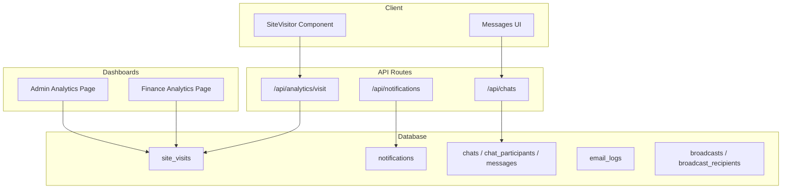
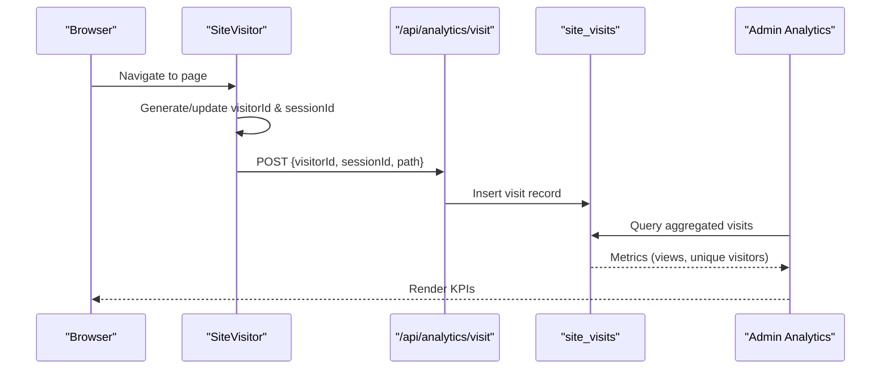
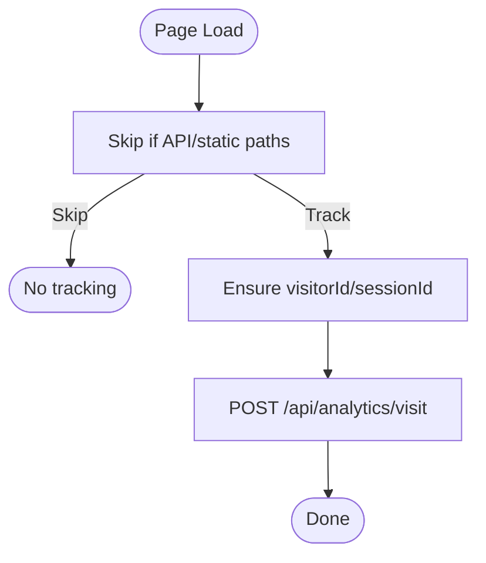
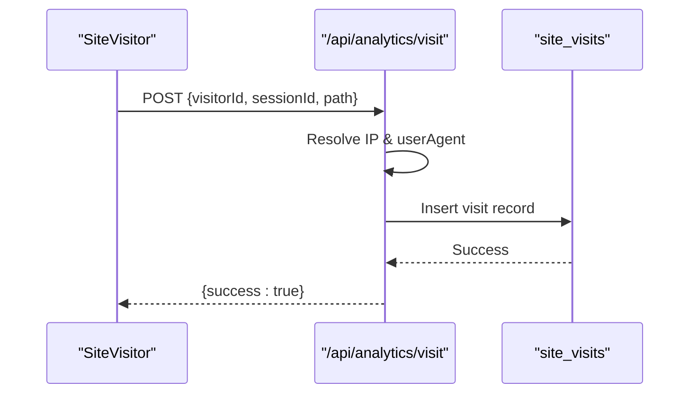
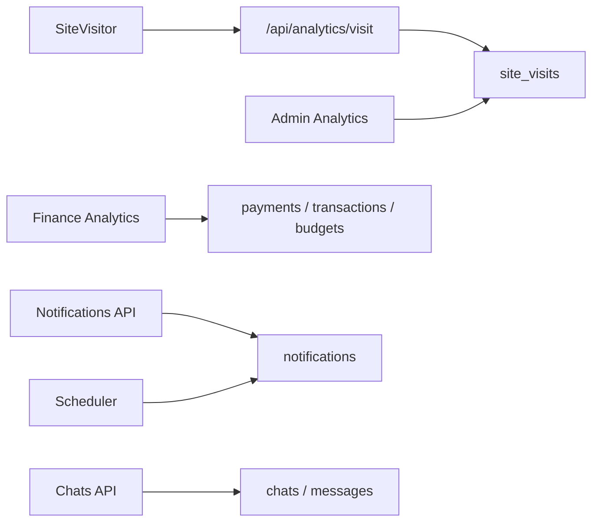

# Communication Analytics & Reporting

<cite>
**Referenced Files in This Document**
- [route.ts](file://app/api/analytics/visit/route.ts)
- [site-visitor.tsx](file://components/analytics/site-visitor.tsx)
- [schema.ts](file://lib/db/schema.ts)
- [analytics.ts](file://lib/actions/analytics.ts)
- [page.tsx](file://app/dashboard/admin/analytics/page.tsx)
- [notifications route.ts](file://app/api/notifications/route.ts)
- [chats route.ts](file://app/api/chats/route.ts)
- [messages client.tsx](file://app/dashboard/messages/client.tsx)
- [programmes actions.ts](file://lib/actions/programmes.ts)
- [email.ts](file://lib/email.ts)
- [scheduler.ts](file://workers/scheduler.ts)
- [reports actions.ts](file://lib/actions/reports.ts)
- [office-rollup-generator.tsx](file://components/admin/reports/office-rollup-generator.tsx)
</cite>

## Table of Contents
1. [Introduction](#introduction)
2. [Project Structure](#project-structure)
3. [Core Components](#core-components)
4. [Architecture Overview](#architecture-overview)
5. [Detailed Component Analysis](#detailed-component-analysis)
6. [Dependency Analysis](#dependency-analysis)
7. [Performance Considerations](#performance-considerations)
8. [Troubleshooting Guide](#troubleshooting-guide)
9. [Conclusion](#conclusion)
10. [Appendices](#appendices)

## Introduction
This document explains the communication analytics and reporting capabilities in the TMC Portal. It covers how user engagement is tracked, how dashboards present insights, and how to interpret metrics such as message open rates, response times, user activity levels, and channel performance. It also provides guidance on creating custom reports, exporting data, integrating with business intelligence tools, real-time monitoring, alerting for unusual activity, privacy considerations, anonymization techniques, and compliance practices. Finally, it offers actionable advice for optimizing message strategies and improving user engagement through data-driven insights.

## Project Structure
The analytics and reporting system spans client-side tracking, server-side APIs, database schemas, dashboard pages, and background workers:

- Client-side tracking: A lightweight component records page visits and sends them to a backend endpoint.
- Server-side API: An endpoint persists visit events with session and user context when available.
- Database schema: Defines tables for site visits, notifications, chats, messages, broadcasts, and email logs that underpin analytics.
- Dashboards: Admin analytics and finance analytics pages visualize traffic and financial metrics.
- Messaging and notifications: Chat endpoints and notification APIs support communication workflows and engagement signals.
- Background scheduling: Workers generate reminders and can be extended for alerts based on analytics thresholds.
- Reporting utilities: Functions aggregate reports and support rollups across organizational hierarchies.

**Diagram sources**
- [site-visitor.tsx:15-66](file://components/analytics/site-visitor.tsx#L15-L66)
- [route.ts:6-31](file://app/api/analytics/visit/route.ts#L6-L31)
- [schema.ts:427-436](file://lib/db/schema.ts#L427-L436)
- [notifications route.ts:7-35](file://app/api/notifications/route.ts#L7-L35)
- [chats route.ts:171-202](file://app/api/chats/route.ts#L171-L202)
- [page.tsx:75-97](file://app/dashboard/admin/analytics/page.tsx#L75-L97)

**Section sources**
- [site-visitor.tsx:15-66](file://components/analytics/site-visitor.tsx#L15-L66)
- [route.ts:6-31](file://app/api/analytics/visit/route.ts#L6-L31)
- [schema.ts:427-436](file://lib/db/schema.ts#L427-L436)
- [notifications route.ts:7-35](file://app/api/notifications/route.ts#L7-L35)
- [chats route.ts:171-202](file://app/api/chats/route.ts#L171-L202)
- [page.tsx:75-97](file://app/dashboard/admin/analytics/page.tsx#L75-L97)

## Core Components
- Site visitor tracking: Captures anonymous or logged-in user sessions and records page views with minimal overhead.
- Visit persistence API: Validates input, extracts IP and user agent, and stores visit events.
- Admin analytics dashboard: Displays total page views, unique visitors, and other traffic KPIs.
- Finance analytics dashboard: Aggregates revenue trends, campaign progress, budget usage, and compliance metrics.
- Notifications API: Retrieves and updates read status for user notifications; supports unread counts.
- Messaging endpoints: Provide chat lists and last messages to infer activity and responsiveness.
- Scheduling worker: Sends reminders and can be extended to trigger alerts based on analytics thresholds.
- Reporting utilities: Aggregate monthly/quarterly/annual reports and compute coverage and office-level summaries.

**Section sources**
- [site-visitor.tsx:15-66](file://components/analytics/site-visitor.tsx#L15-L66)
- [route.ts:6-31](file://app/api/analytics/visit/route.ts#L6-L31)
- [page.tsx:75-97](file://app/dashboard/admin/analytics/page.tsx#L75-L97)
- [analytics.ts:41-194](file://lib/actions/analytics.ts#L41-L194)
- [notifications route.ts:7-74](file://app/api/notifications/route.ts#L7-L74)
- [chats route.ts:171-202](file://app/api/chats/route.ts#L171-L202)
- [scheduler.ts:264-294](file://workers/scheduler.ts#L264-L294)
- [reports actions.ts:216-255](file://lib/actions/reports.ts#L216-L255)

## Architecture Overview
The analytics pipeline begins at the client with a non-blocking visit tracker that posts events to a server endpoint. The server validates the request, enriches metadata (user agent, IP), and persists the event. Dashboards query aggregated data from the database to render KPIs. Messaging and notifications provide additional engagement signals (e.g., last message timestamps, read statuses). Background jobs can process periodic tasks like reminders and can be extended to detect anomalies.

**Diagram sources**
- [site-visitor.tsx:15-66](file://components/analytics/site-visitor.tsx#L15-L66)
- [route.ts:6-31](file://app/api/analytics/visit/route.ts#L6-L31)
- [schema.ts:427-436](file://lib/db/schema.ts#L427-L436)
- [page.tsx:75-97](file://app/dashboard/admin/analytics/page.tsx#L75-L97)

## Detailed Component Analysis

### Site Visitor Tracking
- Purpose: Track page views without blocking critical rendering.
- Behavior: Skips internal routes, generates persistent visitor ID and session ID, and posts visit events after a short delay.
- Privacy: Uses anonymous IDs by default; associates userId only when authenticated.

**Diagram sources**
- [site-visitor.tsx:15-66](file://components/analytics/site-visitor.tsx#L15-L66)

**Section sources**
- [site-visitor.tsx:15-66](file://components/analytics/site-visitor.tsx#L15-L66)

### Visit Persistence API
- Purpose: Persist visit events with enriched metadata.
- Behavior: Extracts IP and user agent, attaches optional userId from session, and inserts into site_visits.
- Error handling: Returns 500 with error message on failure.

**Diagram sources**
- [route.ts:6-31](file://app/api/analytics/visit/route.ts#L6-L31)
- [schema.ts:427-436](file://lib/db/schema.ts#L427-L436)

**Section sources**
- [route.ts:6-31](file://app/api/analytics/visit/route.ts#L6-L31)

### Admin Analytics Dashboard
- Purpose: Visualize website traffic and engagement.
- Metrics: Total page views, unique visitors, and derived counts.
- Data source: Aggregated queries against site_visits and related tables.

**Section sources**
- [page.tsx:75-97](file://app/dashboard/admin/analytics/page.tsx#L75-L97)

### Finance Analytics Dashboard
- Purpose: Provide comprehensive financial health and compliance overview.
- Metrics: Monthly revenue, compliance rate, active campaigns, budget utilization, revenue by category, trend indicators.
- Data aggregation: Queries payments, transactions, budgets, and campaigns scoped by organization hierarchy.

**Section sources**
- [analytics.ts:41-194](file://lib/actions/analytics.ts#L41-L194)

### Notifications API
- Purpose: Retrieve user notifications and mark them as read.
- Capabilities: Fetch recent notifications, compute unread count, bulk mark-as-read.
- Use in analytics: Read/unread states inform engagement and response patterns.

**Section sources**
- [notifications route.ts:7-74](file://app/api/notifications/route.ts#L7-L74)

### Messaging Endpoints and UI
- Purpose: Display chat list with last messages and participants; support messaging workflows.
- Engagement signals: Last message timestamps and participant activity help estimate response times and activity levels.

**Section sources**
- [chats route.ts:171-202](file://app/api/chats/route.ts#L171-L202)
- [messages client.tsx:28-49](file://app/dashboard/messages/client.tsx#L28-L49)

### Scheduler Worker
- Purpose: Process recurring tasks such as reminders and can be extended for alerting.
- Example: Inserts notifications for upcoming events; suitable for threshold-based alerts on unusual activity.

**Section sources**
- [scheduler.ts:264-294](file://workers/scheduler.ts#L264-L294)

### Reporting Utilities
- Purpose: Aggregate monthly/quarterly/annual reports and compute coverage and office-level summaries.
- Features: Hierarchy-aware aggregation, expected vs actual counts, approval status filtering.

**Section sources**
- [reports actions.ts:216-255](file://lib/actions/reports.ts#L216-L255)
- [office-rollup-generator.tsx:34-64](file://components/admin/reports/office-rollup-generator.tsx#L34-L64)

## Dependency Analysis
Key dependencies and relationships:

- Client components depend on Next.js navigation hooks and UUID generation.
- API routes depend on session management and database access.
- Dashboards depend on action functions that perform SQL aggregations.
- Schema defines entities for visits, notifications, chats, messages, broadcasts, and email logs.
- Workers depend on database operations and can emit notifications.

**Diagram sources**
- [site-visitor.tsx:15-66](file://components/analytics/site-visitor.tsx#L15-L66)
- [route.ts:6-31](file://app/api/analytics/visit/route.ts#L6-L31)
- [schema.ts:427-436](file://lib/db/schema.ts#L427-L436)
- [analytics.ts:41-194](file://lib/actions/analytics.ts#L41-L194)
- [notifications route.ts:7-74](file://app/api/notifications/route.ts#L7-L74)
- [chats route.ts:171-202](file://app/api/chats/route.ts#L171-L202)
- [scheduler.ts:264-294](file://workers/scheduler.ts#L264-L294)

**Section sources**
- [schema.ts:427-436](file://lib/db/schema.ts#L427-L436)
- [analytics.ts:41-194](file://lib/actions/analytics.ts#L41-L194)

## Performance Considerations
- Non-blocking tracking: Visit recording uses a short delay to avoid impacting page load.
- Minimal payload: Only essential identifiers and path are sent to reduce bandwidth.
- Aggregation efficiency: Financial analytics use grouped SQL queries and date filters to limit dataset size.
- Caching strategy: Consider caching dashboard aggregates for short intervals to reduce database load.
- Indexing: Ensure indexes on frequently filtered columns (createdAt, organizationId, userId) to optimize queries.

[No sources needed since this section provides general guidance]

## Troubleshooting Guide
Common issues and resolutions:

- Analytics not recording:
  - Verify client skips internal paths correctly.
  - Confirm API returns success and no CORS errors.
  - Check database insertions in site_visits.

- Dashboard shows zero metrics:
  - Validate session and permissions for admin analytics.
  - Ensure time range filters include recent data.
  - Confirm database connectivity and query results.

- Notifications unread count incorrect:
  - Ensure PATCH marks notifications as read for the correct user.
  - Check that GET filters by current user and orders by creation time.

- Messaging delays:
  - Inspect last message retrieval logic and sorting.
  - Review chat participant loading and message history queries.

**Section sources**
- [site-visitor.tsx:15-66](file://components/analytics/site-visitor.tsx#L15-L66)
- [route.ts:6-31](file://app/api/analytics/visit/route.ts#L6-L31)
- [notifications route.ts:7-74](file://app/api/notifications/route.ts#L7-L74)
- [chats route.ts:171-202](file://app/api/chats/route.ts#L171-L202)

## Conclusion
The TMC Portal’s analytics and reporting system provides robust tracking of user engagement, clear dashboards for monitoring performance, and extensible infrastructure for advanced insights. By leveraging visit tracking, notifications, messaging endpoints, and scheduled workers, administrators can monitor communication effectiveness, identify trends, and make data-driven decisions to improve engagement. Privacy-conscious design and scalable aggregation ensure responsible and efficient analytics at scale.

[No sources needed since this section summarizes without analyzing specific files]

## Appendices

### Creating Custom Reports
- Use reporting utilities to aggregate monthly/quarterly/annual data with hierarchy support.
- Combine report types and filters to tailor outputs for specific offices or jurisdictions.
- Export generated reports via UI controls where available.

**Section sources**
- [reports actions.ts:216-255](file://lib/actions/reports.ts#L216-L255)
- [office-rollup-generator.tsx:34-64](file://components/admin/reports/office-rollup-generator.tsx#L34-L64)

### Exporting Communication Data
- Export chat histories and message metadata for analysis.
- Use database queries to extract visit logs and notification events for offline analysis.
- Integrate exports with BI tools via CSV/JSON pipelines.

**Section sources**
- [chats route.ts:171-202](file://app/api/chats/route.ts#L171-L202)
- [route.ts:6-31](file://app/api/analytics/visit/route.ts#L6-L31)
- [notifications route.ts:7-74](file://app/api/notifications/route.ts#L7-L74)

### Integrating with Business Intelligence Tools
- Connect BI platforms to the database using read-only credentials.
- Build dashboards over site_visits, notifications, chats, messages, and email_logs.
- Schedule regular refreshes to keep BI visuals up-to-date.

**Section sources**
- [schema.ts:427-436](file://lib/db/schema.ts#L427-L436)
- [notifications route.ts:7-74](file://app/api/notifications/route.ts#L7-L74)
- [chats route.ts:171-202](file://app/api/chats/route.ts#L171-L202)

### Real-Time Analytics and Alerting
- Extend scheduler to monitor thresholds (e.g., spikes in failed emails or drops in message reads).
- Emit notifications or trigger webhooks when anomalies are detected.
- Use real-time polling or WebSockets for live dashboards if required.

**Section sources**
- [scheduler.ts:264-294](file://workers/scheduler.ts#L264-L294)
- [notifications route.ts:7-74](file://app/api/notifications/route.ts#L7-L74)

### Data Privacy and Compliance
- Minimize personal data: Store only necessary identifiers and associate with users when authenticated.
- Anonymization: Use visitorId and sessionId for anonymous tracking; strip or hash PII in exports.
- Compliance: Implement retention policies, consent mechanisms, and audit trails for analytics data.

**Section sources**
- [site-visitor.tsx:15-66](file://components/analytics/site-visitor.tsx#L15-L66)
- [route.ts:6-31](file://app/api/analytics/visit/route.ts#L6-L31)
- [schema.ts:427-436](file://lib/db/schema.ts#L427-L436)

### Interpreting Metrics and Optimizing Strategies
- Message open rates: Derive from notification readAt and broadcast recipient readAt fields.
- Response times: Calculate from message timestamps and last message updates per chat.
- User activity levels: Measure via visit frequency and chat participation.
- Channel performance: Compare engagement across notifications, chats, and broadcasts.
- Actionable insights: Adjust timing, content, and targeting based on observed trends and feedback sentiment.

**Section sources**
- [schema.ts:483-494](file://lib/db/schema.ts#L483-L494)
- [schema.ts:515-527](file://lib/db/schema.ts#L515-L527)
- [schema.ts:532-553](file://lib/db/schema.ts#L532-L553)
- [programmes actions.ts:1964-1999](file://lib/actions/programmes.ts#L1964-L1999)
- [email.ts:171-199](file://lib/email.ts#L171-L199)