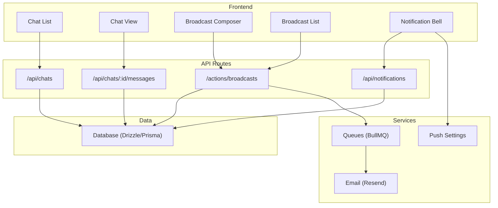
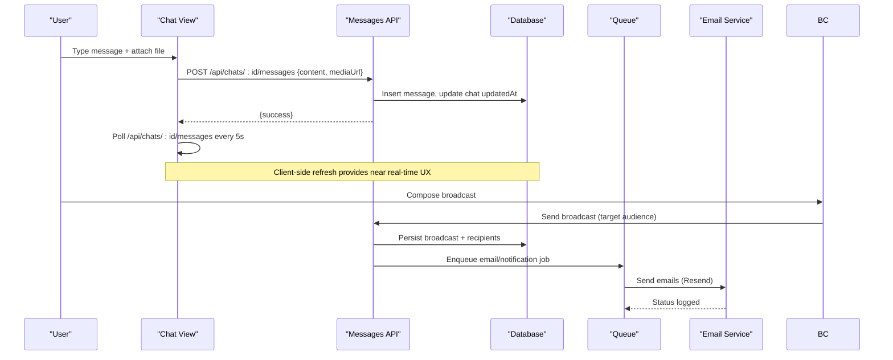
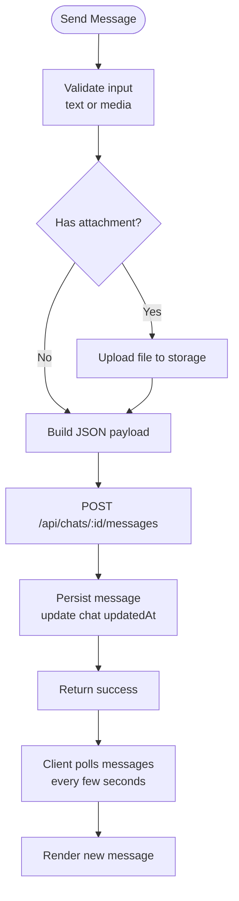
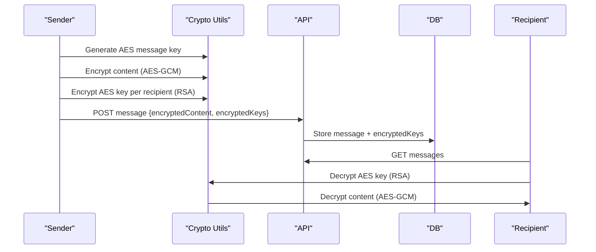
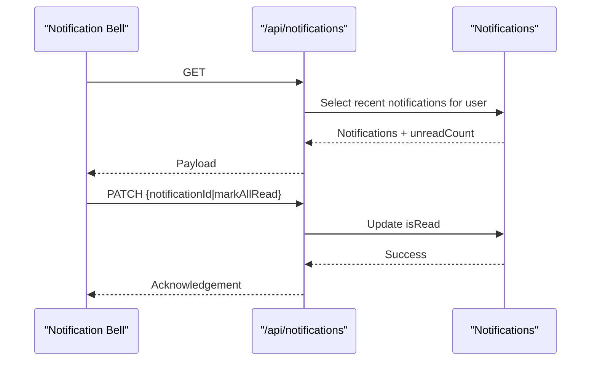
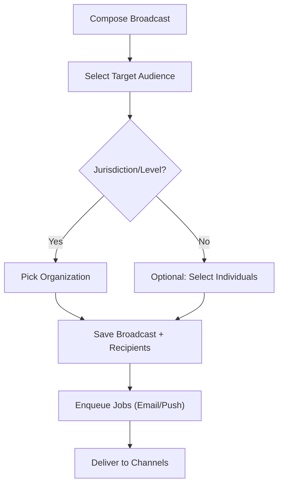
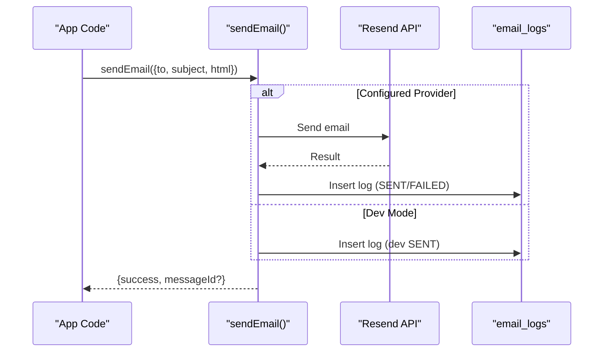
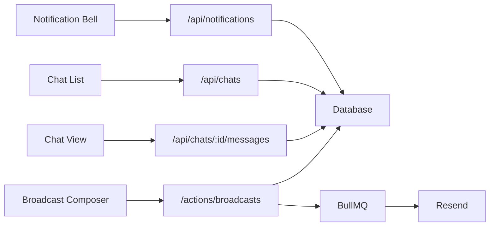

# Communication System

<cite>
**Referenced Files in This Document**
- [route.ts](file://app\api\chat\route.ts)
- [route.ts](file://app\api\chats\route.ts)
- [route.ts](file://app\api\chats\[chatId]\messages\route.ts)
- [route.ts](file://app\api\notifications\route.ts)
- [schema.ts](file://lib\db\schema.ts)
- [crypto.ts](file://lib\crypto.ts)
- [email.ts](file://lib\email.ts)
- [queue.ts](file://lib\queue.ts)
- [broadcast-composer.tsx](file://components\broadcasts\broadcast-composer.tsx)
- [broadcast-list.tsx](file://components\broadcasts\broadcast-list.tsx)
- [page.tsx](file://app\dashboard\broadcasts\page.tsx)
- [push-notification-dialog.tsx](file://components\admin\settings\push-notification-dialog.tsx)
- [chat-list.tsx](file://components\chat\chat-list.tsx)
- [chat-view.tsx](file://components\chat\chat-view.tsx)
- [crypto-setup-dialog.tsx](file://components\chat\crypto-setup-dialog.tsx)
- [messages_user_guide.md](file://messages_user_guide.md)
</cite>

## Table of Contents
1. Introduction
2. Project Structure
3. Core Components
4. Architecture Overview
5. Detailed Component Analysis
6. Dependency Analysis
7. Performance Considerations
8. Troubleshooting Guide
9. Conclusion

## Introduction
This document explains the TMC Portal communication system with a focus on real-time messaging, notifications, and broadcast capabilities. It covers:
- Chat system: 1-on-1 and group chats, file sharing, conversation management, message history, and search.
- Notification system: in-app notifications, email alerts, and push notification configuration with delivery tracking.
- Broadcast messaging: announcements to targeted audiences by organization level, role, or membership status.
- Security and moderation: end-to-end encryption for messages, spam prevention via rate limits and validation, and content moderation hooks.
- Integrations: external email provider (Resend), queues for background jobs, and push notification gateway settings.
- Delivery guarantees, offline support, and synchronization across devices.
- Analytics: engagement metrics, delivery rates, and user response tracking.

## Project Structure
The communication features are implemented as Next.js API routes, React components, and database schemas:
- Chat APIs: create/list chats, send/retrieve messages, E2EE fields.
- Notifications API: list and mark read.
- Broadcast UI and actions: compose/send broadcasts, view feed, target audience selection.
- Email integration: Resend provider with logging.
- Queues: BullMQ queues for email and notifications.
- Crypto utilities: Web Crypto API-based E2EE for messages and files.

**Diagram sources**
- [route.ts:14-207](file://app\api\chats\route.ts#L14-L207)
- [route.ts:17-132](file://app\api\chats\[chatId]\messages\route.ts#L17-L132)
- [route.ts:7-74](file://app\api\notifications\route.ts#L7-L74)
- [broadcast-composer.tsx:115-137](file://components\broadcasts\broadcast-composer.tsx#L115-L137)
- [email.ts:21-92](file://lib\email.ts#L21-L92)
- [queue.ts:1-18](file://lib\queue.ts#L1-L18)
- [push-notification-dialog.tsx:69-100](file://components\admin\settings\push-notification-dialog.tsx#L69-L100)

**Section sources**
- [route.ts:14-207](file://app\api\chats\route.ts#L14-L207)
- [route.ts:17-132](file://app\api\chats\[chatId]\messages\route.ts#L17-L132)
- [route.ts:7-74](file://app\api\notifications\route.ts#L7-L74)
- [broadcast-composer.tsx:115-137](file://components\broadcasts\broadcast-composer.tsx#L115-L137)
- [email.ts:21-92](file://lib\email.ts#L21-L92)
- [queue.ts:1-18](file://lib\queue.ts#L1-L18)
- [push-notification-dialog.tsx:69-100](file://components\admin\settings\push-notification-dialog.tsx#L69-L100)

## Core Components
- Chat system: Create/list chats, send/receive messages, media attachments, E2EE support, participant management.
- Notifications: In-app notifications with read/unread state and bulk mark-as-read.
- Broadcasts: Targeted announcements by jurisdiction, officials, individuals, or all users; media attachments; recipient tracking.
- Email: Send emails via Resend with logging and templates.
- Queues: Background processing for emails and notifications using BullMQ.
- Push notifications: Admin-configurable provider settings for mobile push.

**Section sources**
- [route.ts:14-207](file://app\api\chats\route.ts#L14-L207)
- [route.ts:17-132](file://app\api\chats\[chatId]\messages\route.ts#L17-L132)
- [route.ts:7-74](file://app\api\notifications\route.ts#L7-L74)
- [broadcast-composer.tsx:115-137](file://components\broadcasts\broadcast-composer.tsx#L115-L137)
- [email.ts:21-92](file://lib\email.ts#L21-L92)
- [queue.ts:1-18](file://lib\queue.ts#L1-L18)
- [push-notification-dialog.tsx:69-100](file://components\admin\settings\push-notification-dialog.tsx#L69-L100)

## Architecture Overview
The communication system combines REST APIs for persistence and client polling for near-real-time updates, with optional queue-driven background jobs for outbound channels.

**Diagram sources**
- [route.ts:17-132](file://app\api\chats\[chatId]\messages\route.ts#L17-L132)
- [chat-view.tsx:29-65](file://components\chat\chat-view.tsx#L29-L65)
- [broadcast-composer.tsx:115-137](file://components\broadcasts\broadcast-composer.tsx#L115-L137)
- [email.ts:21-92](file://lib\email.ts#L21-L92)
- [queue.ts:1-18](file://lib\queue.ts#L1-L18)

## Detailed Component Analysis

### Chat System
- Create and manage chats:
  - GET /api/chats lists user’s chats with last message and participants.
  - POST /api/chats creates 1-on-1 or group chats with participant management and admin checks.
- Messages:
  - GET /api/chats/:id/messages returns messages and participants for a chat.
  - POST /api/chats/:id/messages sends text/media with E2EE key metadata.
- Real-time behavior:
  - Client polls messages endpoint periodically for updates.
- Media:
  - Upload via /api/upload then reference mediaUrl in message payload.
- E2EE:
  - Message type and encryptedKeys stored; client handles encryption/decryption using crypto utilities.

**Diagram sources**
- [route.ts:17-132](file://app\api\chats\[chatId]\messages\route.ts#L17-L132)
- [chat-view.tsx:68-124](file://components\chat\chat-view.tsx#L68-L124)

**Section sources**
- [route.ts:14-207](file://app\api\chats\route.ts#L14-L207)
- [route.ts:17-132](file://app\api\chats\[chatId]\messages\route.ts#L17-L132)
- [chat-view.tsx:29-65](file://components\chat\chat-view.tsx#L29-L65)
- [chat-view.tsx:68-124](file://components\chat\chat-view.tsx#L68-L124)
- [schema.ts:496-527](file://lib\db\schema.ts#L496-L527)

### End-to-End Encryption (E2EE)
- Key generation and storage:
  - Users generate RSA key pairs; public keys stored on profile; private keys secured with PIN and recovery key.
- Message encryption:
  - Each message uses a random AES symmetric key; content encrypted with AES-GCM; symmetric key encrypted per recipient’s public key and stored in encryptedKeys.
- Decryption:
  - Recipients decrypt symmetric key with their private key, then decrypt content.
- File encryption:
  - Optional blob encryption using same symmetric key workflow.

**Diagram sources**
- [crypto.ts:188-284](file://lib\crypto.ts#L188-L284)
- [route.ts:17-132](file://app\api\chats\[chatId]\messages\route.ts#L17-L132)
- [schema.ts:515-527](file://lib\db\schema.ts#L515-L527)

**Section sources**
- [crypto.ts:188-284](file://lib\crypto.ts#L188-L284)
- [crypto-setup-dialog.tsx:131-160](file://components\chat\crypto-setup-dialog.tsx#L131-L160)
- [messages_user_guide.md:35-64](file://messages_user_guide.md#L35-L64)

### Notifications
- In-app notifications:
  - GET /api/notifications returns recent notifications with unread count.
  - PATCH marks single or all notifications as read.
- Storage:
  - Notifications table tracks title, message, type, read status, action URL, and metadata.

**Diagram sources**
- [route.ts:7-74](file://app\api\notifications\route.ts#L7-L74)
- [schema.ts:482-494](file://lib\db\schema.ts#L482-L494)

**Section sources**
- [route.ts:7-74](file://app\api\notifications\route.ts#L7-L74)
- [schema.ts:482-494](file://lib\db\schema.ts#L482-L494)

### Broadcast Messaging
- Audience targeting:
  - ALL, JURISDICTION_MEMBERS, OFFICIALS_ONLY, INDIVIDUALS.
  - Jurisdiction level and specific organization filters.
- Composition:
  - Title, content, media attachments (image/audio/video).
  - Search and select individual recipients when needed.
- Persistence and visibility:
  - Broadcasts stored with sender, target metadata, and media.
  - Recipients tracked for delivery/read status.
- Feed:
  - Users see broadcasts relevant to their org hierarchy and roles.

**Diagram sources**
- [broadcast-composer.tsx:29-41](file://components\broadcasts\broadcast-composer.tsx#L29-L41)
- [broadcast-composer.tsx:115-137](file://components\broadcasts\broadcast-composer.tsx#L115-L137)
- [schema.ts:529-553](file://lib\db\schema.ts#L529-L553)

**Section sources**
- [broadcast-composer.tsx:29-41](file://components\broadcasts\broadcast-composer.tsx#L29-L41)
- [broadcast-composer.tsx:115-137](file://components\broadcasts\broadcast-composer.tsx#L115-L137)
- [broadcast-list.tsx:13-35](file://components\broadcasts\broadcast-list.tsx#L13-L35)
- [page.tsx:58-85](file://app\dashboard\broadcasts\page.tsx#L58-L85)
- [schema.ts:529-553](file://lib\db\schema.ts#L529-L553)

### Email Integration
- Provider:
  - Resend used when API key is configured; otherwise dev mode logs and records.
- Logging:
  - All attempts recorded in email_logs with status, provider, and error details.
- Templates:
  - Built-in templates for verification, welcome, receipts, reminders, etc.

**Diagram sources**
- [email.ts:21-92](file://lib\email.ts#L21-L92)
- [schema.ts:438-452](file://lib\db\schema.ts#L438-L452)

**Section sources**
- [email.ts:21-92](file://lib\email.ts#L21-L92)
- [schema.ts:438-452](file://lib\db\schema.ts#L438-L452)

### Queues and Background Processing
- Queues:
  - email-queue and notification-queue defined with Redis connection.
- Use cases:
  - Offload heavy tasks like sending emails and notifications to workers.

**Section sources**
- [queue.ts:1-18](file://lib\queue.ts#L1-L18)

### Push Notifications
- Configuration:
  - Admin dialog to configure push notification provider and credentials.
- Purpose:
  - Enable mobile push alerts for important events and broadcasts.

**Section sources**
- [push-notification-dialog.tsx:69-100](file://components\admin\settings\push-notification-dialog.tsx#L69-L100)

## Dependency Analysis
Key dependencies between modules:
- Chat UI depends on chat APIs and storage upload.
- Broadcast composer depends on user search and broadcast actions.
- Notifications UI depends on notifications API.
- Email module depends on Resend and logs to DB.
- Queues depend on Redis and worker processes.

**Diagram sources**
- [chat-list.tsx:55-92](file://components\chat\chat-list.tsx#L55-L92)
- [chat-view.tsx:68-124](file://components\chat\chat-view.tsx#L68-L124)
- [broadcast-composer.tsx:115-137](file://components\broadcasts\broadcast-composer.tsx#L115-L137)
- [route.ts:14-207](file://app\api\chats\route.ts#L14-L207)
- [route.ts:17-132](file://app\api\chats\[chatId]\messages\route.ts#L17-L132)
- [route.ts:7-74](file://app\api\notifications\route.ts#L7-L74)
- [email.ts:21-92](file://lib\email.ts#L21-L92)
- [queue.ts:1-18](file://lib\queue.ts#L1-L18)

**Section sources**
- [chat-list.tsx:55-92](file://components\chat\chat-list.tsx#L55-L92)
- [chat-view.tsx:68-124](file://components\chat\chat-view.tsx#L68-L124)
- [broadcast-composer.tsx:115-137](file://components\broadcasts\broadcast-composer.tsx#L115-L137)
- [route.ts:14-207](file://app\api\chats\route.ts#L14-L207)
- [route.ts:17-132](file://app\api\chats\[chatId]\messages\route.ts#L17-L132)
- [route.ts:7-74](file://app\api\notifications\route.ts#L7-L74)
- [email.ts:21-92](file://lib\email.ts#L21-L92)
- [queue.ts:1-18](file://lib\queue.ts#L1-L18)

## Performance Considerations
- Chat list performance:
  - Fetching recent messages per chat can be optimized with proper indexing and server-side pagination if needed.
- Polling interval:
  - Client polls messages every few seconds; tune interval based on expected activity to balance freshness and load.
- Media uploads:
  - Large files should be chunked or compressed where possible; ensure CDN caching for static assets.
- Database queries:
  - Ensure indexes on frequently filtered columns (e.g., chatId, userId, createdAt).
- Queues:
  - Use workers with concurrency controls to avoid overload during large broadcasts.

[No sources needed since this section provides general guidance]

## Troubleshooting Guide
Common issues and resolutions:
- Chat not loading:
  - Verify session and permissions; check network requests to /api/chats and /api/chats/:id/messages.
- E2EE decryption failures:
  - Ensure sender included correct recipient public keys; verify PIN and recovery key setup; check encryptedKeys presence.
- Broadcast not visible:
  - Confirm target audience matches user’s org hierarchy and role; check recipients table for INDIVIDUALS targets.
- Emails not sent:
  - Check RESEND_API_KEY configuration; review email_logs for errors; validate template variables.
- Push notifications not received:
  - Verify provider credentials in settings; confirm device tokens are registered and valid.

**Section sources**
- [route.ts:17-132](file://app\api\chats\[chatId]\messages\route.ts#L17-L132)
- [crypto.ts:188-284](file://lib\crypto.ts#L188-L284)
- [broadcast-composer.tsx:115-137](file://components\broadcasts\broadcast-composer.tsx#L115-L137)
- [email.ts:21-92](file://lib\email.ts#L21-L92)
- [push-notification-dialog.tsx:69-100](file://components\admin\settings\push-notification-dialog.tsx#L69-L100)

## Conclusion
The TMC Portal communication system provides robust chat, notifications, and broadcast capabilities with strong security through E2EE, scalable delivery via queues, and comprehensive logging. The modular architecture supports future enhancements such as WebSocket-based real-time updates, advanced moderation pipelines, and richer analytics dashboards.

[No sources needed since this section summarizes without analyzing specific files]