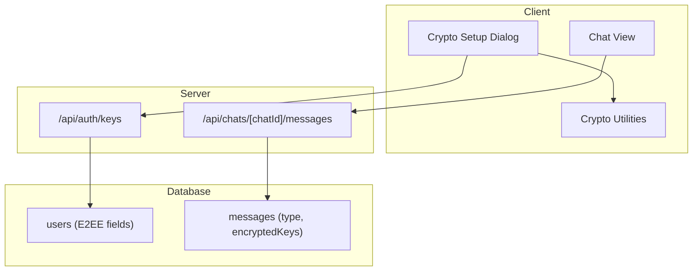
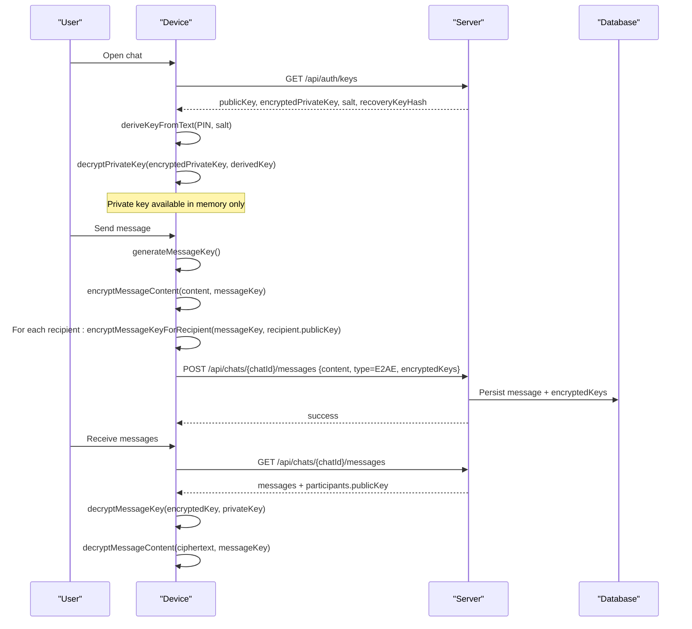
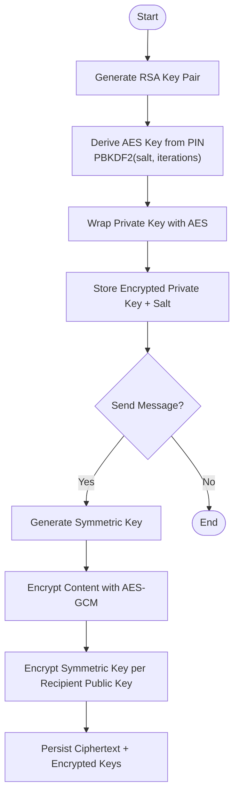
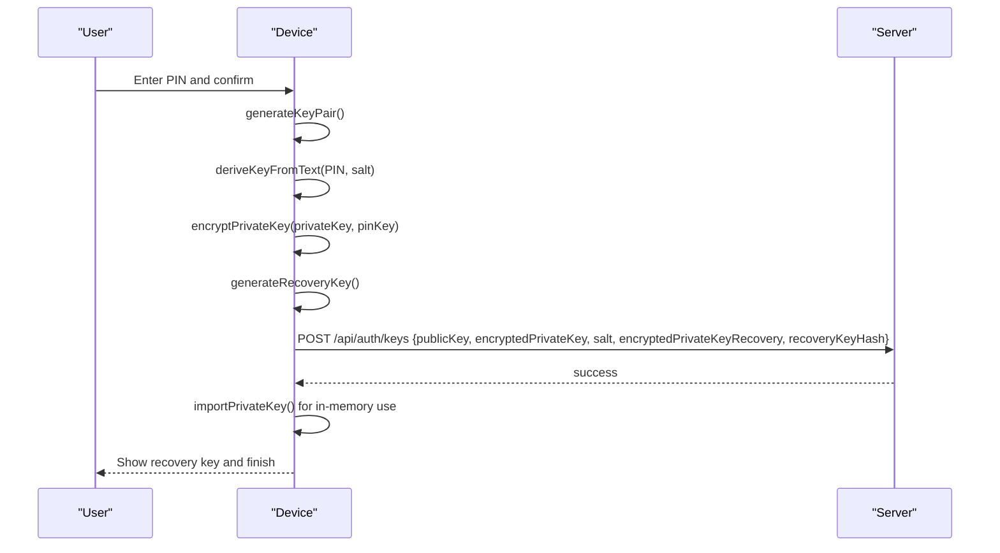
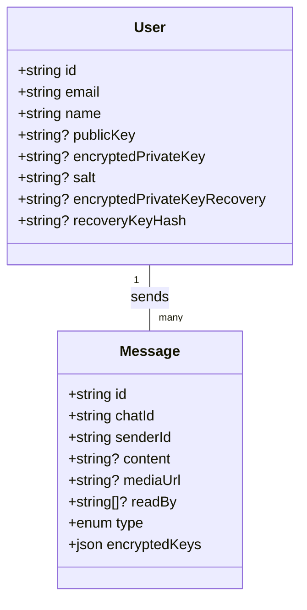
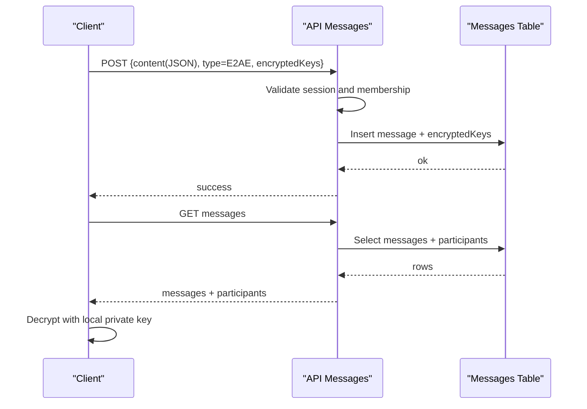
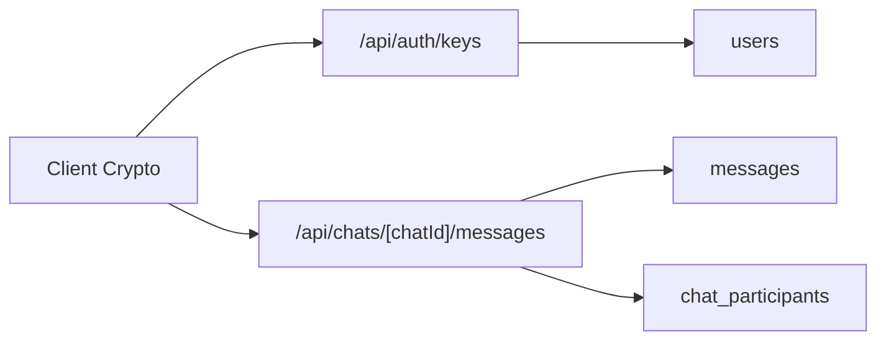

# Message Security & Moderation

<cite>
**Referenced Files in This Document**
- [crypto-setup-dialog.tsx](file://components/chat/crypto-setup-dialog.tsx)
- [crypto.ts](file://lib/crypto.ts)
- [route.ts (keys)](file://app/api/auth/keys/route.ts)
- [route.ts (messages)](file://app/api/chats/[chatId]/messages/route.ts)
- [schema.ts](file://lib/db/schema.ts)
- [migration.sql (E2EE fields)](file://prisma/migrations/20260521160000_add_e2ee_fields_to_messages/migration.sql)
- [audit.ts](file://lib/audit.ts)
- [page.tsx (Audit Logs UI)](file://app/dashboard/admin/audit/page.tsx)
- [security-settings-form.tsx](file://components/admin/settings/security-settings-form.tsx)
</cite>

## Table of Contents
1. Introduction
2. Project Structure
3. Core Components
4. Architecture Overview
5. Detailed Component Analysis
6. Dependency Analysis
7. Performance Considerations
8. Troubleshooting Guide
9. Conclusion

## Introduction
This document explains the message security and moderation features implemented in the communication system. It covers end-to-end encryption (E2EE) using cryptographic algorithms, key management with PIN-based access control, secure device registration via recovery keys, and storage considerations for encrypted messages. It also outlines moderation capabilities currently present in the codebase and provides guidance for implementing custom moderation rules, handling flagged content, and managing user reports. Finally, it includes privacy controls, retention and deletion strategies, compliance and audit logging, incident response procedures, and troubleshooting steps for encryption-related issues.

## Project Structure
The messaging and security features span client-side cryptography, API endpoints for key management and message persistence, and database schema definitions that support E2EE metadata. The main areas are:
- Client-side crypto utilities and setup dialog for generating and securing keys
- Server endpoints to persist public keys and encrypted private keys
- Chat message endpoints that store messages and per-recipient encrypted symmetric keys
- Database schema defining users’ E2EE fields and message types/encrypted keys
- Audit logging infrastructure for compliance and incident tracking
- Admin settings UI for toggling security-related behaviors

**Diagram sources**
- [crypto-setup-dialog.tsx:27-93](file://components/chat/crypto-setup-dialog.tsx#L27-L93)
- [crypto.ts:53-185](file://lib/crypto.ts#L53-L185)
- [route.ts (keys):16-41](file://app/api/auth/keys/route.ts#L16-L41)
- [route.ts (messages):17-132](file://app/api/chats/[chatId]/messages/route.ts#L17-L132)
- [schema.ts:84-105](file://lib/db/schema.ts#L84-L105)
- [schema.ts:515-527](file://lib/db/schema.ts#L515-L527)

**Section sources**
- [crypto-setup-dialog.tsx:27-93](file://components/chat/crypto-setup-dialog.tsx#L27-L93)
- [crypto.ts:53-185](file://lib/crypto.ts#L53-L185)
- [route.ts (keys):16-41](file://app/api/auth/keys/route.ts#L16-L41)
- [route.ts (messages):17-132](file://app/api/chats/[chatId]/messages/route.ts#L17-L132)
- [schema.ts:84-105](file://lib/db/schema.ts#L84-L105)
- [schema.ts:515-527](file://lib/db/schema.ts#L515-L527)

## Core Components
- End-to-end encryption library: Implements RSA-OAEP key pairs, AES-GCM message encryption, PBKDF2 key derivation from PIN/recovery key, and file blob encryption helpers.
- Crypto setup dialog: Guides users through PIN creation, key generation, recovery key display, and saving keys to the server.
- Key management API: Stores public key, salt, encrypted private key (PIN-wrapped), encrypted private key (recovery-wrapped), and a recovery key hash.
- Chat message API: Persists messages with type and per-recipient encrypted symmetric keys; enforces chat membership and session authentication.
- Database schema: Defines E2EE fields on users and message-level fields for type and encrypted keys.
- Audit logging: Provides structured logging for actions and supports querying logs for compliance and incident response.

**Section sources**
- [crypto.ts:5-185](file://lib/crypto.ts#L5-L185)
- [crypto-setup-dialog.tsx:27-93](file://components/chat/crypto-setup-dialog.tsx#L27-L93)
- [route.ts (keys):16-41](file://app/api/auth/keys/route.ts#L16-L41)
- [route.ts (messages):17-132](file://app/api/chats/[chatId]/messages/route.ts#L17-L132)
- [schema.ts:84-105](file://lib/db/schema.ts#L84-L105)
- [schema.ts:515-527](file://lib/db/schema.ts#L515-L527)
- [audit.ts:17-71](file://lib/audit.ts#L17-L71)

## Architecture Overview
The E2EE flow ensures only participants can decrypt messages. The sender encrypts each message with a random symmetric key and then encrypts that symmetric key with each recipient’s public key. The server stores ciphertext and encrypted keys but cannot read message content. Users protect their private keys with a PIN-derived key and optionally recover via a high-entropy recovery key.

**Diagram sources**
- [crypto.ts:191-284](file://lib/crypto.ts#L191-L284)
- [crypto-setup-dialog.tsx:27-93](file://components/chat/crypto-setup-dialog.tsx#L27-L93)
- [route.ts (keys):16-41](file://app/api/auth/keys/route.ts#L16-L41)
- [route.ts (messages):79-132](file://app/api/chats/[chatId]/messages/route.ts#L79-L132)

## Detailed Component Analysis

### End-to-End Encryption Library
- Algorithms and parameters:
  - RSA-OAEP with SHA-256 for asymmetric operations
  - AES-GCM with unique IVs per operation
  - PBKDF2 with configurable iterations for PIN/recovery key derivation
- Key lifecycle:
  - Generate RSA key pair
  - Derive AES wrapping key from PIN or recovery key
  - Wrap private key for secure storage
  - Per-message symmetric key generation and recipient-specific key encryption
- File support:
  - Encrypt/decrypt file blobs using the same symmetric key pattern

**Diagram sources**
- [crypto.ts:53-185](file://lib/crypto.ts#L53-L185)
- [crypto.ts:191-284](file://lib/crypto.ts#L191-L284)

**Section sources**
- [crypto.ts:5-185](file://lib/crypto.ts#L5-L185)
- [crypto.ts:191-284](file://lib/crypto.ts#L191-L284)

### Crypto Setup Dialog and PIN-Based Access Control
- Steps:
  1. User creates a PIN (minimum length enforced)
  2. System generates RSA key pair and derives AES key from PIN
  3. Private key is wrapped with PIN-derived key and saved to server
  4. Recovery key generated and shown to user for safekeeping
  5. Optionally wrap private key with recovery-derived key and save
- Security notes:
  - PIN never leaves the device
  - Recovery key is high entropy and must be stored securely by the user
  - On completion, the dialog closes and the app reloads to initialize state

**Diagram sources**
- [crypto-setup-dialog.tsx:27-93](file://components/chat/crypto-setup-dialog.tsx#L27-L93)
- [crypto.ts:77-185](file://lib/crypto.ts#L77-L185)
- [route.ts (keys):16-41](file://app/api/auth/keys/route.ts#L16-L41)

**Section sources**
- [crypto-setup-dialog.tsx:27-93](file://components/chat/crypto-setup-dialog.tsx#L27-L93)
- [crypto.ts:77-185](file://lib/crypto.ts#L77-L185)
- [route.ts (keys):16-41](file://app/api/auth/keys/route.ts#L16-L41)

### Secure Device Registration and Key Storage
- Public key is stored on the server to enable recipients to encrypt message keys
- Encrypted private key and salt are stored to allow local decryption after PIN entry
- Recovery key hash is stored to validate recovery key correctness if needed
- Schema supports these fields under the user model

**Diagram sources**
- [schema.ts:84-105](file://lib/db/schema.ts#L84-L105)
- [schema.ts:515-527](file://lib/db/schema.ts#L515-L527)

**Section sources**
- [schema.ts:84-105](file://lib/db/schema.ts#L84-L105)
- [schema.ts:515-527](file://lib/db/schema.ts#L515-L527)
- [route.ts (keys):16-41](file://app/api/auth/keys/route.ts#L16-L41)

### Message Transmission and Storage
- Sending:
  - Client encrypts content and per-recipient symmetric keys
  - Server persists message with type and encrypted keys
  - Membership checks ensure only authorized participants can send
- Receiving:
  - Client fetches messages and participant public keys
  - Local decryption uses stored private key (unwrapped by PIN)
  - Legacy encrypted messages are handled with a marker for compatibility

**Diagram sources**
- [route.ts (messages):17-132](file://app/api/chats/[chatId]/messages/route.ts#L17-L132)
- [schema.ts:515-527](file://lib/db/schema.ts#L515-L527)

**Section sources**
- [route.ts (messages):17-132](file://app/api/chats/[chatId]/messages/route.ts#L17-L132)
- [schema.ts:515-527](file://lib/db/schema.ts#L515-L527)

### Content Moderation Capabilities
Current implementation does not include automated spam detection or inappropriate content filtering in the message pipeline. However, the system provides foundational elements to implement moderation:
- Message type field allows marking messages as encrypted or other types
- Audit logging can record moderation actions and decisions
- Admin settings UI can toggle features like registration or recommendation requirements, which indirectly affect exposure surfaces

To implement moderation:
- Add server-side validation and classification before persisting messages
- Integrate external content scanning services or rule engines
- Record moderation outcomes in audit logs with entity references
- Provide admin UI to review flagged content and take action

**Section sources**
- [schema.ts:515-527](file://lib/db/schema.ts#L515-L527)
- [audit.ts:17-71](file://lib/audit.ts#L17-L71)
- [security-settings-form.tsx:18-33](file://components/admin/settings/security-settings-form.tsx#L18-L33)

### Privacy Controls, Retention, and Deletion
- Privacy:
  - E2EE ensures only participants can read message content
  - Private keys remain on-device; server stores only encrypted artifacts
- Retention:
  - No explicit retention policy is defined in the current codebase
  - Implement scheduled jobs to archive or purge old messages based on policy
- Deletion:
  - Provide mechanisms to delete messages and associated metadata
  - Ensure cascading deletes or soft deletes with audit trails
  - Log deletions in audit logs for compliance

[No sources needed since this section provides general guidance]

### Compliance, Audit Logging, and Incident Response
- Audit logging:
  - Structured logs capture user actions, entities, timestamps, and context
  - Admin UI displays recent logs for oversight
- Compliance:
  - Use audit logs to demonstrate access and changes to sensitive data
  - Restrict log access to privileged roles
- Incident response:
  - Correlate events via entity IDs and timestamps
  - Preserve logs during investigations
  - Enable/disable features via admin settings when necessary

**Section sources**
- [audit.ts:17-71](file://lib/audit.ts#L17-L71)
- [page.tsx (Audit Logs UI):13-35](file://app/dashboard/admin/audit/page.tsx#L13-L35)
- [security-settings-form.tsx:18-33](file://components/admin/settings/security-settings-form.tsx#L18-L33)

## Dependency Analysis
- Client dependencies:
  - Web Crypto API for all cryptographic operations
  - UI components for dialogs and inputs
- Server dependencies:
  - Session management for authentication
  - Database ORM for schema access and queries
  - Zod for request validation
- Data dependencies:
  - Users table holds E2EE artifacts
  - Messages table holds ciphertext and per-recipient encrypted keys

**Diagram sources**
- [crypto.ts:53-185](file://lib/crypto.ts#L53-L185)
- [route.ts (keys):16-41](file://app/api/auth/keys/route.ts#L16-L41)
- [route.ts (messages):17-132](file://app/api/chats/[chatId]/messages/route.ts#L17-L132)
- [schema.ts:84-105](file://lib/db/schema.ts#L84-L105)
- [schema.ts:505-527](file://lib/db/schema.ts#L505-L527)

**Section sources**
- [crypto.ts:53-185](file://lib/crypto.ts#L53-L185)
- [route.ts (keys):16-41](file://app/api/auth/keys/route.ts#L16-L41)
- [route.ts (messages):17-132](file://app/api/chats/[chatId]/messages/route.ts#L17-L132)
- [schema.ts:84-105](file://lib/db/schema.ts#L84-L105)
- [schema.ts:505-527](file://lib/db/schema.ts#L505-L527)

## Performance Considerations
- Cryptographic operations:
  - PBKDF2 iterations provide security at the cost of CPU time; tune based on device capability
  - AES-GCM is efficient for bulk encryption; ensure unique IVs per operation
- Network overhead:
  - Per-recipient encrypted keys increase payload size; consider batching or caching where appropriate
- Storage:
  - Encrypted payloads and keys grow with message count; plan indexing and archival strategies
- Latency:
  - Client-side decryption should be optimized; avoid unnecessary re-imports of keys

[No sources needed since this section provides general guidance]

## Troubleshooting Guide
Common encryption issues and resolutions:
- Incorrect PIN:
  - Symptom: Unable to unwrap private key
  - Resolution: Verify PIN matches the one used during setup; check error messages from unwrap operation
- Missing or corrupted keys:
  - Symptom: Cannot retrieve keys from server or decryption fails
  - Resolution: Confirm keys exist in user record; re-run setup if necessary
- Recovery key mismatch:
  - Symptom: Recovery process fails validation
  - Resolution: Ensure recovery key was saved correctly; verify hash comparison logic
- Message decryption failures:
  - Symptom: Can fetch messages but cannot decrypt content
  - Resolution: Confirm recipient public keys are correct; ensure per-recipient encrypted keys were included

Moderation and compliance troubleshooting:
- Flagged content not recorded:
  - Symptom: No audit entries for moderation actions
  - Resolution: Ensure audit logging is invoked for moderation events
- Access denied to audit logs:
  - Symptom: Admin cannot view logs
  - Resolution: Check role permissions and restrict access to authorized roles

**Section sources**
- [crypto.ts:158-185](file://lib/crypto.ts#L158-L185)
- [route.ts (keys):16-41](file://app/api/auth/keys/route.ts#L16-L41)
- [audit.ts:17-71](file://lib/audit.ts#L17-L71)
- [page.tsx (Audit Logs UI):13-35](file://app/dashboard/admin/audit/page.tsx#L13-L35)

## Conclusion
The system implements robust end-to-end encryption using industry-standard algorithms, with PIN-based access control and secure recovery mechanisms. Messages are stored with encrypted content and per-recipient keys, ensuring confidentiality even if storage is compromised. While automated moderation is not yet implemented, the architecture supports integration of content screening and audit logging for compliance. Administrators can manage security settings and leverage audit logs for oversight and incident response. Future enhancements should include automated moderation pipelines, retention policies, and comprehensive deletion workflows.