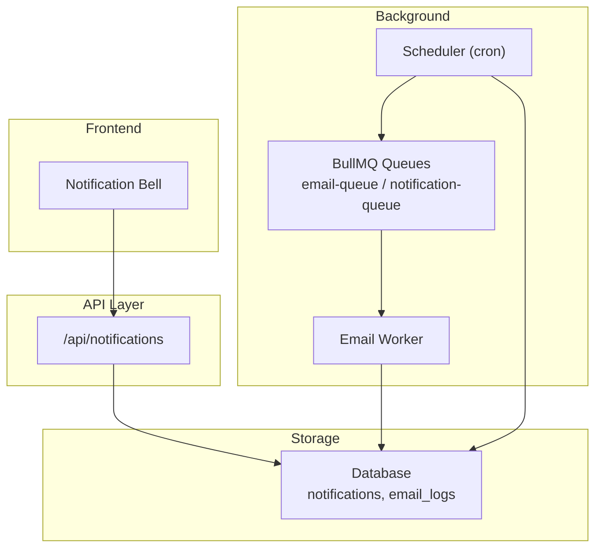
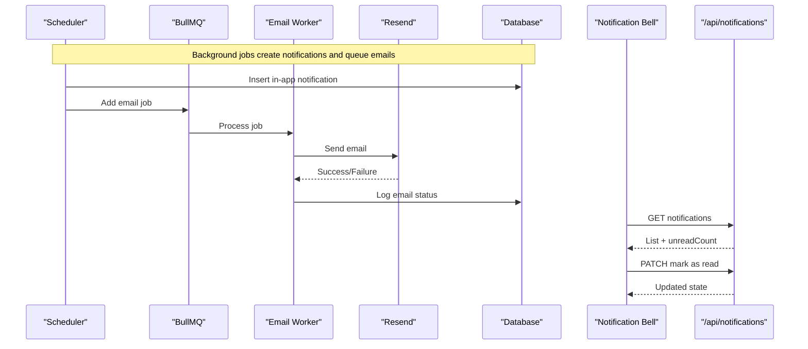
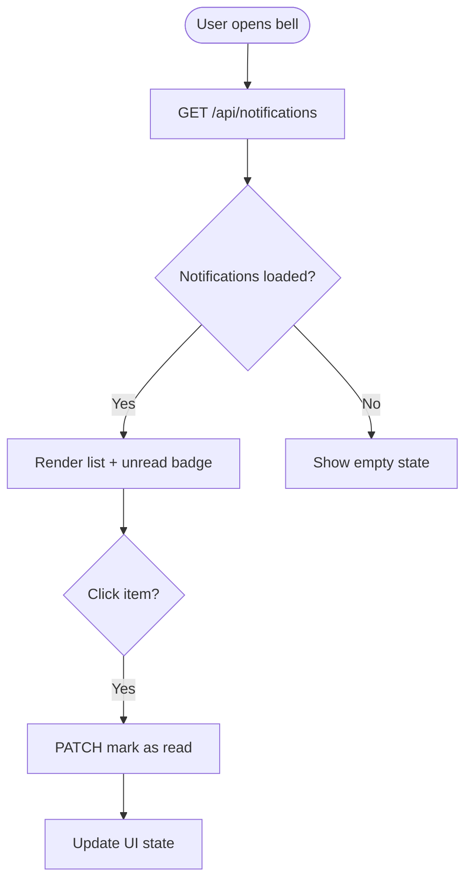
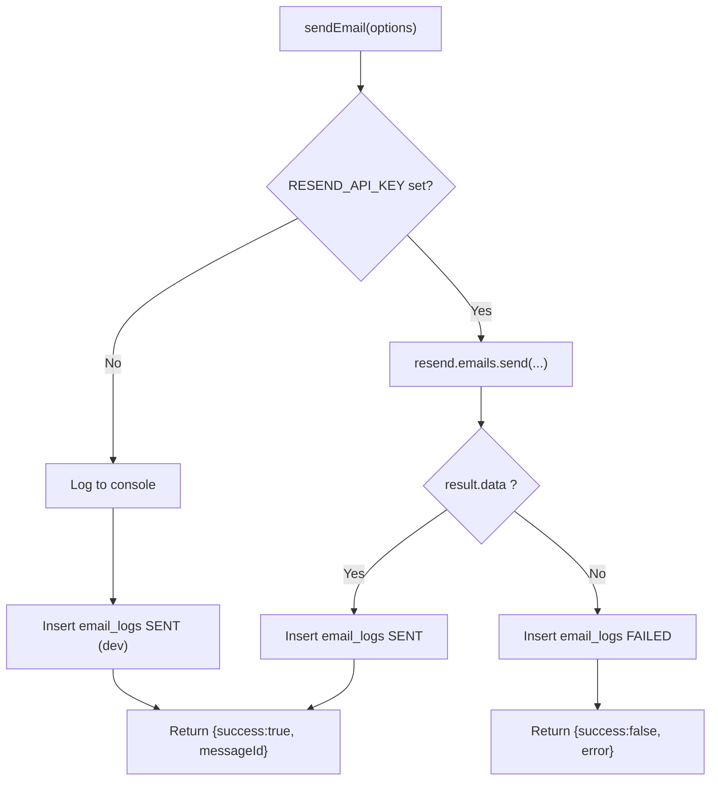
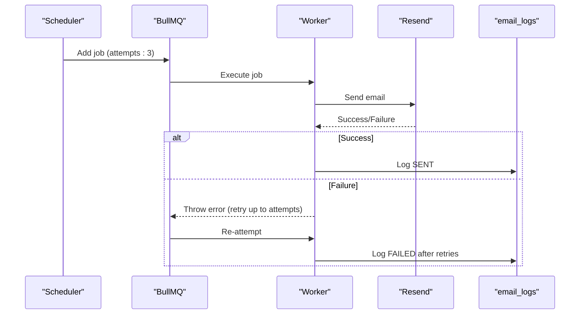
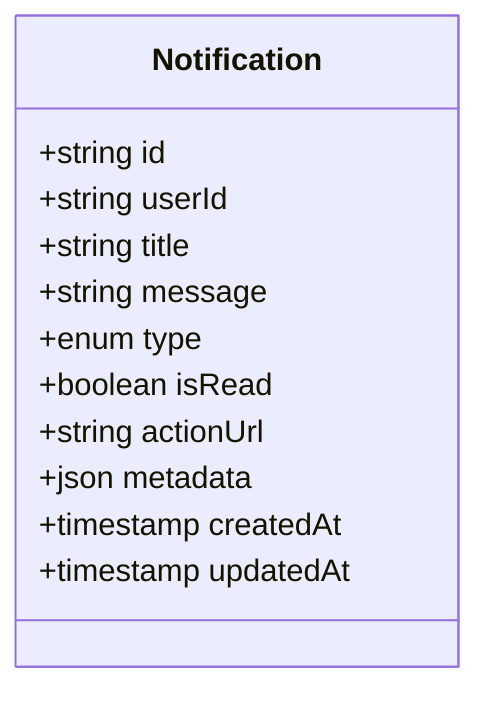
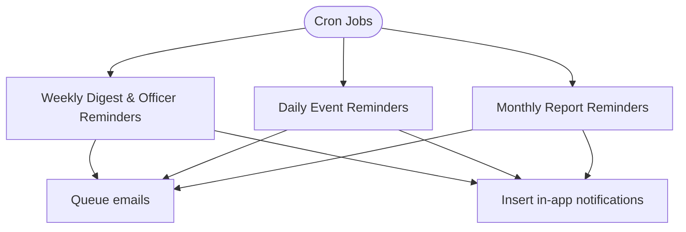
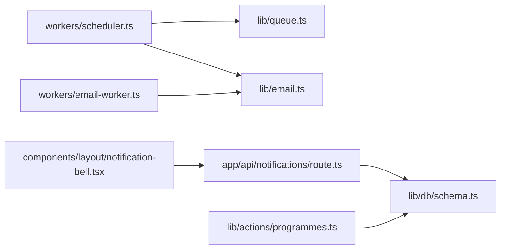

# Notification System & Delivery

<cite>
**Referenced Files in This Document**
- [lib/queue.ts](file://lib/queue.ts)
- [lib/email.ts](file://lib/email.ts)
- [workers/email-worker.ts](file://workers/email-worker.ts)
- [workers/scheduler.ts](file://workers/scheduler.ts)
- [app/api/notifications/route.ts](file://app/api/notifications/route.ts)
- [components/layout/notification-bell.tsx](file://components/layout/notification-bell.tsx)
- [lib/actions/programmes.ts](file://lib/actions/programmes.ts)
- [lib/db/schema.ts](file://lib/db/schema.ts)
- [scripts/migrate-manual.ts](file://scripts/migrate-manual.ts)
- [check_notifs.ts](file://check_notifs.ts)
- [components/admin/settings/push-notification-dialog.tsx](file://components/admin/settings/push-notification-dialog.tsx)
</cite>

## Table of Contents
1. Introduction
2. Project Structure
3. Core Components
4. Architecture Overview
5. Detailed Component Analysis
6. Dependency Analysis
7. Performance Considerations
8. Troubleshooting Guide
9. Conclusion

## Introduction
This document explains the notification system that delivers in-app notifications, email alerts via Resend, and provides foundations for push notifications. It covers the queue-based delivery pipeline, scheduling, retry behavior, notification types, template management, batch sending, preferences/opt-out, real-time UI updates, analytics, and troubleshooting.

## Project Structure
The notification system spans several layers:
- Queues and workers for background processing (BullMQ + Redis)
- Email integration with Resend and logging
- Scheduled jobs that generate reminders and digests
- In-app notifications stored in the database and exposed via API
- Frontend bell component with polling and toast notifications
- Admin settings for push notification configuration

**Diagram sources**
- [lib/queue.ts:1-19](file://lib/queue.ts#L1-L19)
- [workers/email-worker.ts:1-32](file://workers/email-worker.ts#L1-L32)
- [workers/scheduler.ts:1-51](file://workers/scheduler.ts#L1-L51)
- [app/api/notifications/route.ts:1-74](file://app/api/notifications/route.ts#L1-L74)
- [components/layout/notification-bell.tsx:1-173](file://components/layout/notification-bell.tsx#L1-L173)
- [lib/db/schema.ts:83-105](file://lib/db/schema.ts#L83-L105)

**Section sources**
- [lib/queue.ts:1-19](file://lib/queue.ts#L1-L19)
- [workers/email-worker.ts:1-32](file://workers/email-worker.ts#L1-L32)
- [workers/scheduler.ts:1-51](file://workers/scheduler.ts#L1-L51)
- [app/api/notifications/route.ts:1-74](file://app/api/notifications/route.ts#L1-L74)
- [components/layout/notification-bell.tsx:1-173](file://components/layout/notification-bell.tsx#L1-L173)
- [lib/db/schema.ts:83-105](file://lib/db/schema.ts#L83-L105)

## Core Components
- Queue layer: BullMQ queues for emails and generic notifications with typed job payloads.
- Email service: Resend integration with environment-driven fallback to dev mode; logs all attempts and outcomes.
- Scheduler: Cron-driven workflows for weekly digests, daily continuous reminders, and monthly report nudges.
- In-app notifications: Database-backed records with read/unread state and action URLs; exposed through a REST API.
- Frontend bell: Polls the API, shows unread count, triggers toasts for new items, and supports mark-as-read operations.
- Push settings UI: Admin dialog to configure provider and keys for future push delivery.

**Section sources**
- [lib/queue.ts:1-19](file://lib/queue.ts#L1-L19)
- [lib/email.ts:1-92](file://lib/email.ts#L1-L92)
- [workers/scheduler.ts:53-197](file://workers/scheduler.ts#L53-L197)
- [app/api/notifications/route.ts:1-74](file://app/api/notifications/route.ts#L1-L74)
- [components/layout/notification-bell.tsx:1-173](file://components/layout/notification-bell.tsx#L1-L173)
- [components/admin/settings/push-notification-dialog.tsx:1-72](file://components/admin/settings/push-notification-dialog.tsx#L1-L72)

## Architecture Overview
End-to-end flows for different notification channels:

**Diagram sources**
- [workers/scheduler.ts:53-197](file://workers/scheduler.ts#L53-L197)
- [lib/queue.ts:1-19](file://lib/queue.ts#L1-L19)
- [workers/email-worker.ts:1-32](file://workers/email-worker.ts#L1-L32)
- [lib/email.ts:1-92](file://lib/email.ts#L1-L92)
- [app/api/notifications/route.ts:1-74](file://app/api/notifications/route.ts#L1-L74)
- [components/layout/notification-bell.tsx:1-173](file://components/layout/notification-bell.tsx#L1-L173)

## Detailed Component Analysis

### In-App Notifications
- Storage model: A notifications table stores per-user messages with type, read state, optional action URL, and metadata.
- API:
  - GET returns user’s recent notifications and computes unread count.
  - PATCH supports marking a single notification or all as read.
- Frontend:
  - Polls every 15 seconds, displays unread badge, opens dropdown list, and triggers toasts for new unread items.
  - Mark actions update local state immediately on success.

**Diagram sources**
- [app/api/notifications/route.ts:7-36](file://app/api/notifications/route.ts#L7-L36)
- [app/api/notifications/route.ts:38-74](file://app/api/notifications/route.ts#L38-L74)
- [components/layout/notification-bell.tsx:20-113](file://components/layout/notification-bell.tsx#L20-L113)

**Section sources**
- [lib/db/schema.ts:83-105](file://lib/db/schema.ts#L83-L105)
- [scripts/migrate-manual.ts:79-92](file://scripts/migrate-manual.ts#L79-L92)
- [app/api/notifications/route.ts:1-74](file://app/api/notifications/route.ts#L1-L74)
- [components/layout/notification-bell.tsx:1-173](file://components/layout/notification-bell.tsx#L1-L173)

### Email Alerts with Resend
- Service: sendEmail accepts recipients, subject, HTML/text, attachments, and metadata.
- Production path: Uses Resend when RESEND_API_KEY is set; logs result to email_logs with provider details and timestamps.
- Development path: Logs to console and writes a SENT record with provider "dev".
- Error handling: Catches exceptions and persists FAILED entries with error details.

**Diagram sources**
- [lib/email.ts:21-92](file://lib/email.ts#L21-L92)

**Section sources**
- [lib/email.ts:1-92](file://lib/email.ts#L1-L92)

### Queue System and Retry Logic
- Queues:
  - email-queue: For sending emails via worker.
  - notification-queue: Available for generic background tasks.
- Job data types are defined for strong typing.
- Retry behavior:
  - Some scheduled jobs add jobs with attempts: 3 and cleanup flags to keep queues tidy.
  - Worker throws on failure so BullMQ can retry based on its configuration.

**Diagram sources**
- [lib/queue.ts:1-19](file://lib/queue.ts#L1-L19)
- [workers/email-worker.ts:10-24](file://workers/email-worker.ts#L10-L24)
- [workers/scheduler.ts:161-178](file://workers/scheduler.ts#L161-L178)
- [lib/email.ts:21-92](file://lib/email.ts#L21-L92)

**Section sources**
- [lib/queue.ts:1-19](file://lib/queue.ts#L1-L19)
- [workers/email-worker.ts:1-32](file://workers/email-worker.ts#L1-L32)
- [workers/scheduler.ts:161-178](file://workers/scheduler.ts#L161-L178)

### Notification Types and Use Cases
- Types: INFO, SUCCESS, WARNING, ERROR (enum).
- Examples in codebase:
  - Programme announcements and lounge messages create in-app notifications for group members.
  - Weekly digest and event reminders create INFO notifications for users.
  - Monthly report nudges produce WARNING notifications for missing submissions.

**Diagram sources**
- [scripts/migrate-manual.ts:79-92](file://scripts/migrate-manual.ts#L79-L92)
- [lib/db/schema.ts:83-105](file://lib/db/schema.ts#L83-L105)

**Section sources**
- [lib/actions/programmes.ts:1964-1985](file://lib/actions/programmes.ts#L1964-L1985)
- [workers/scheduler.ts:125-133](file://workers/scheduler.ts#L125-L133)
- [workers/scheduler.ts:181-189](file://workers/scheduler.ts#L181-L189)
- [workers/scheduler.ts:321-329](file://workers/scheduler.ts#L321-L329)

### Email Templates and Batch Sending
- Templates: Built-in templates for welcome, membership approval/rejection, payment received, verification, officer reminders, weekly digest, meeting invitations, instant call invites, programme registration receipts, and certificate thank-you notes.
- Batch sending:
  - Weekly digest loops over all users and queues one email per user.
  - Daily continuous reminders loop over registrations and queue emails per registrant.
  - Each queued job includes attempts and cleanup options where applicable.

**Section sources**
- [lib/email.ts:94-423](file://lib/email.ts#L94-L423)
- [workers/scheduler.ts:139-190](file://workers/scheduler.ts#L139-L190)
- [workers/scheduler.ts:199-285](file://workers/scheduler.ts#L199-L285)

### Notification Preferences and Opt-Out
- Settings storage: Admin UI reads/writes system settings under category NOTIFICATION with keys for provider, api_key, and app_id.
- Current implementation: The UI exists to manage push notification settings; actual push dispatching is not implemented in the analyzed files.
- Opt-out mechanism: Not present in the analyzed code. To implement opt-out, extend the user profile or settings to store channel preferences and gate email/in-app/push dispatch accordingly.

**Section sources**
- [components/admin/settings/push-notification-dialog.tsx:16-72](file://components/admin/settings/push-notification-dialog.tsx#L16-L72)

### Notification Scheduling
- Weekly Programme Scheduler: Runs weekly to notify officers and send weekly digests to all users; also inserts in-app notifications.
- Daily Continuous Reminders: Runs daily to notify registered users 1–3 days before events; inserts in-app notifications.
- Monthly Office Report Reminders: Runs monthly to remind officials to submit reports; nudge run on the 5th for missing reports.

**Diagram sources**
- [workers/scheduler.ts:1-51](file://workers/scheduler.ts#L1-L51)
- [workers/scheduler.ts:53-197](file://workers/scheduler.ts#L53-L197)
- [workers/scheduler.ts:199-285](file://workers/scheduler.ts#L199-L285)
- [workers/scheduler.ts:287-337](file://workers/scheduler.ts#L287-L337)

**Section sources**
- [workers/scheduler.ts:1-51](file://workers/scheduler.ts#L1-L51)
- [workers/scheduler.ts:53-197](file://workers/scheduler.ts#L53-L197)
- [workers/scheduler.ts:199-285](file://workers/scheduler.ts#L199-L285)
- [workers/scheduler.ts:287-337](file://workers/scheduler.ts#L287-L337)

### Real-Time Updates and Unread Count Management
- Polling: The bell component polls every 15 seconds to fetch latest notifications and unread count.
- Toasts: On initial load and subsequent polls, toasts are shown for new unread notifications, with deduplication by ID.
- Mark as read: Single and bulk mark-as-read endpoints update server state and reflect immediately in the UI.

**Section sources**
- [components/layout/notification-bell.tsx:20-113](file://components/layout/notification-bell.tsx#L20-L113)
- [app/api/notifications/route.ts:7-36](file://app/api/notifications/route.ts#L7-L36)
- [app/api/notifications/route.ts:38-74](file://app/api/notifications/route.ts#L38-L74)

### Custom Notification Types and Event Handling
- Creating custom in-app notifications:
  - Insert into the notifications table with appropriate type, title, message, and actionUrl.
  - Example patterns exist in scheduler and programme messaging logic.
- Handling events:
  - Use scheduler jobs or server actions to detect events (e.g., new programme announcement) and emit notifications.

**Section sources**
- [lib/actions/programmes.ts:1964-1985](file://lib/actions/programmes.ts#L1964-L1985)
- [workers/scheduler.ts:125-133](file://workers/scheduler.ts#L125-L133)
- [workers/scheduler.ts:181-189](file://workers/scheduler.ts#L181-L189)
- [workers/scheduler.ts:266-274](file://workers/scheduler.ts#L266-L274)

### Notification Archives
- Current state: No dedicated archive process was found in the analyzed files.
- Recommendation: Implement periodic archival of older notifications to a separate table or cold storage to maintain performance and compliance.

[No sources needed since this section proposes general guidance]

### Push Notification Delivery Mechanisms
- UI: Admin dialog allows configuring provider, API key, and app ID under NOTIFICATION settings.
- Implementation: Actual push dispatch is not implemented in the analyzed files; it can be added by extending the worker or scheduler to integrate with a push provider using the configured settings.

**Section sources**
- [components/admin/settings/push-notification-dialog.tsx:16-72](file://components/admin/settings/push-notification-dialog.tsx#L16-L72)

## Dependency Analysis

**Diagram sources**
- [workers/scheduler.ts:1-51](file://workers/scheduler.ts#L1-L51)
- [lib/queue.ts:1-19](file://lib/queue.ts#L1-L19)
- [lib/email.ts:1-92](file://lib/email.ts#L1-L92)
- [workers/email-worker.ts:1-32](file://workers/email-worker.ts#L1-L32)
- [app/api/notifications/route.ts:1-74](file://app/api/notifications/route.ts#L1-L74)
- [lib/db/schema.ts:83-105](file://lib/db/schema.ts#L83-L105)
- [components/layout/notification-bell.tsx:1-173](file://components/layout/notification-bell.tsx#L1-L173)
- [lib/actions/programmes.ts:1964-1985](file://lib/actions/programmes.ts#L1964-L1985)

**Section sources**
- [workers/scheduler.ts:1-51](file://workers/scheduler.ts#L1-L51)
- [lib/queue.ts:1-19](file://lib/queue.ts#L1-L19)
- [lib/email.ts:1-92](file://lib/email.ts#L1-L92)
- [workers/email-worker.ts:1-32](file://workers/email-worker.ts#L1-L32)
- [app/api/notifications/route.ts:1-74](file://app/api/notifications/route.ts#L1-L74)
- [lib/db/schema.ts:83-105](file://lib/db/schema.ts#L83-L105)
- [components/layout/notification-bell.tsx:1-173](file://components/layout/notification-bell.tsx#L1-L173)
- [lib/actions/programmes.ts:1964-1985](file://lib/actions/programmes.ts#L1964-L1985)

## Performance Considerations
- Polling interval: 15-second polling balances responsiveness and server load; tune based on traffic.
- Batch sizes: Weekly digest and daily reminders iterate over users/registrations; consider pagination or batching for large datasets.
- Queue cleanup: Jobs use removeOnComplete/removeOnFail to prevent queue bloat.
- Database queries: Ensure indexes on notifications.userId and isRead for fast filtering and sorting.

[No sources needed since this section provides general guidance]

## Troubleshooting Guide
- Emails not sent:
  - Verify RESEND_API_KEY is set in production; otherwise emails log in dev mode.
  - Check email_logs for FAILED entries and error messages.
  - Confirm worker is running and connected to Redis.
- In-app notifications not appearing:
  - Ensure session is valid when calling /api/notifications.
  - Validate that notifications are inserted with correct userId and isRead=false.
  - Use check_notifs script to inspect recent records.
- Duplicate toasts:
  - The bell component deduplicates by notification ID; ensure IDs are unique and persisted.
- Push settings not applied:
  - Confirm admin dialog saves settings to system settings under NOTIFICATION category.

**Section sources**
- [lib/email.ts:21-92](file://lib/email.ts#L21-L92)
- [workers/email-worker.ts:10-24](file://workers/email-worker.ts#L10-L24)
- [app/api/notifications/route.ts:7-36](file://app/api/notifications/route.ts#L7-L36)
- [check_notifs.ts:1-11](file://check_notifs.ts#L1-L11)
- [components/admin/settings/push-notification-dialog.tsx:32-72](file://components/admin/settings/push-notification-dialog.tsx#L32-L72)

## Conclusion
The system combines scheduled background jobs, a resilient queue-and-worker pattern for email delivery, and a simple but effective in-app notification flow with real-time UI updates. Email logs provide visibility into delivery outcomes, while the bell component offers immediate user feedback. Push notification configuration is prepared in the UI; integrating a push provider would complete the multi-channel strategy. Extending preferences and archiving mechanisms will further strengthen reliability and compliance.