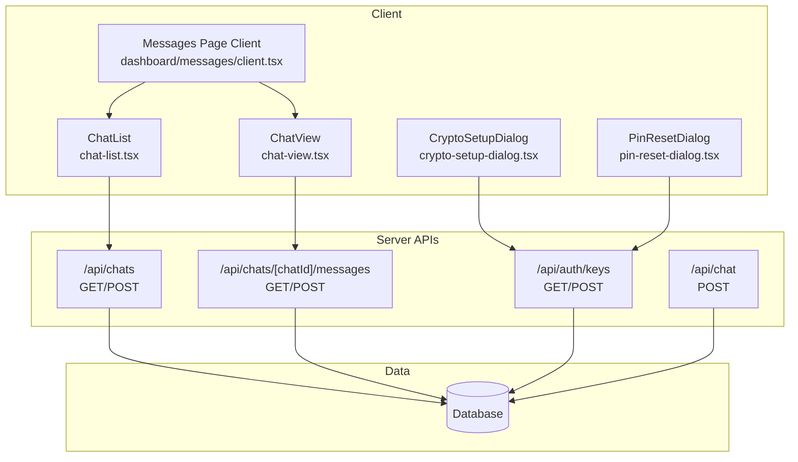
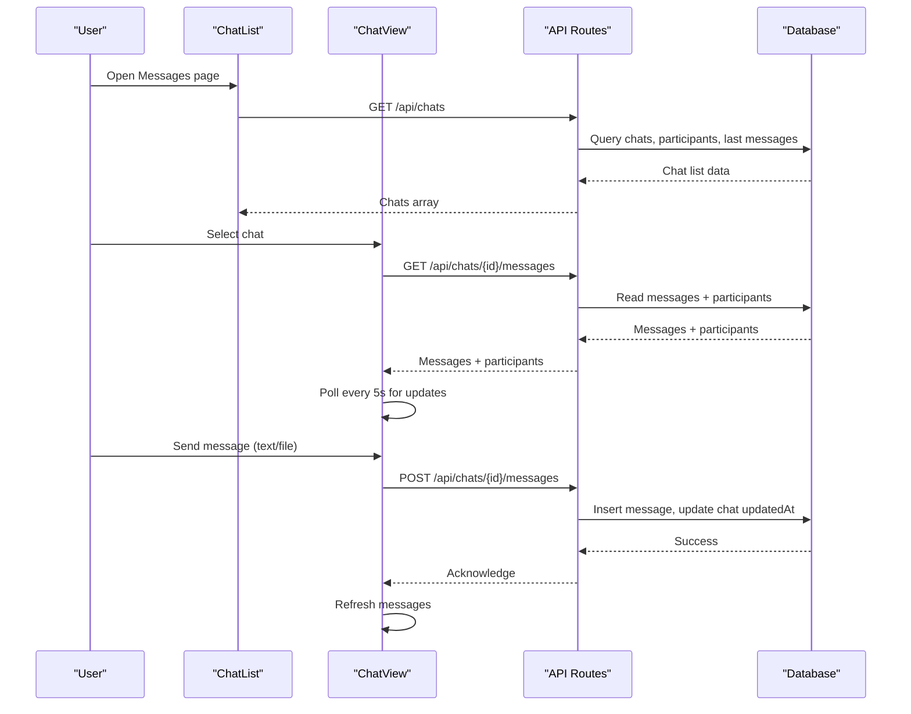
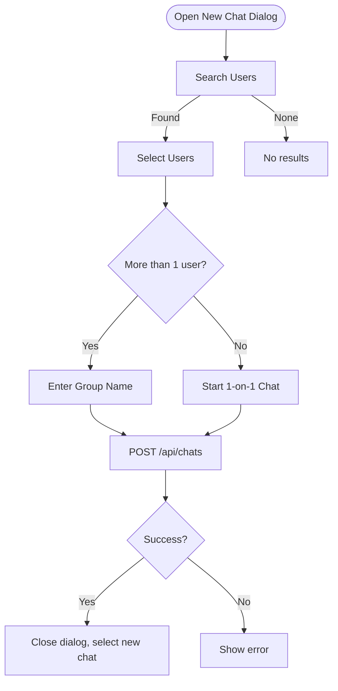
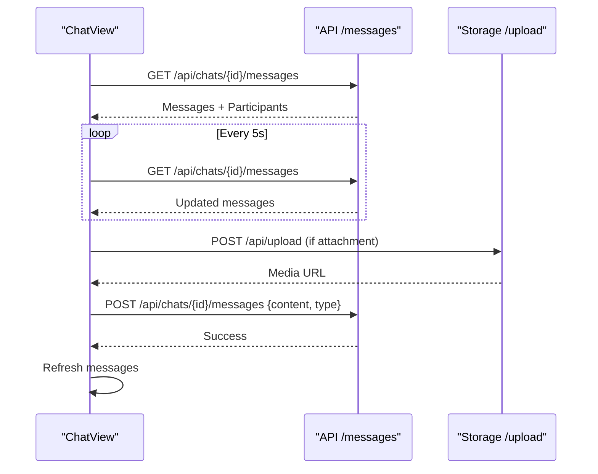
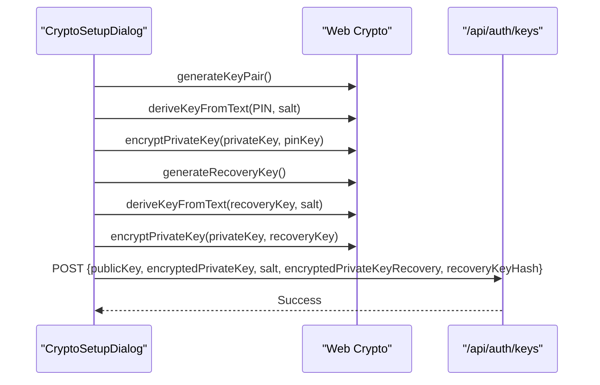
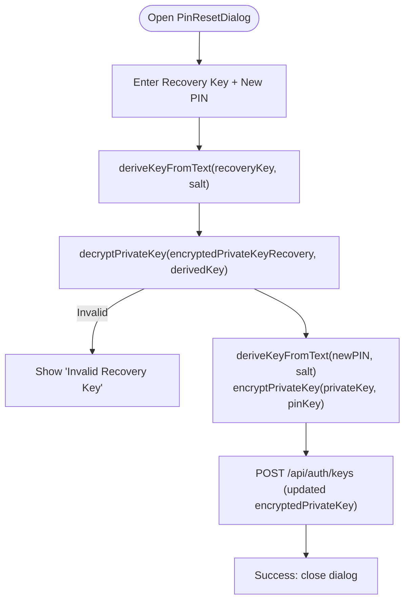
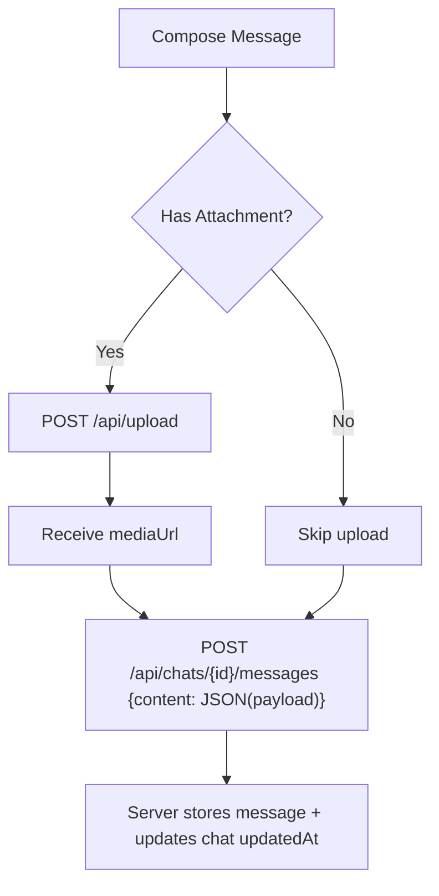
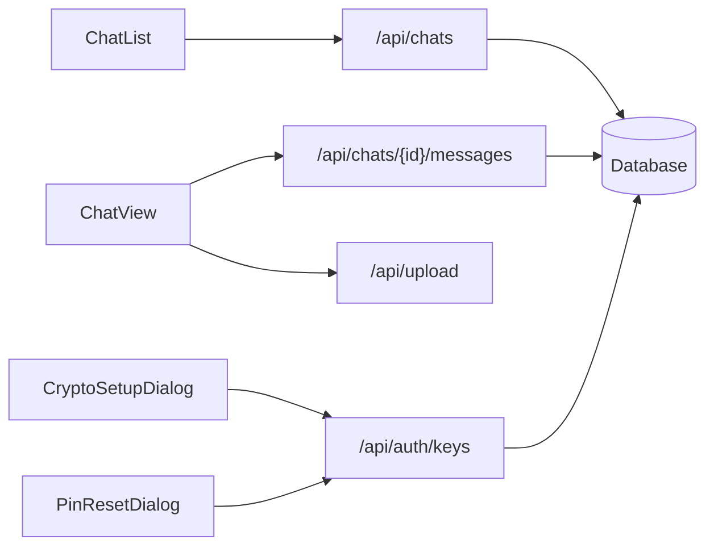

# Real-time Chat & Messaging

<cite>
**Referenced Files in This Document**
- [route.ts](file://app/api/chat/route.ts)
- [route.ts](file://app/api/chats/route.ts)
- [route.ts](file://app/api/chats/[chatId]/messages/route.ts)
- [route.ts](file://app/api/auth/keys/route.ts)
- [crypto-setup-dialog.tsx](file://components/chat/crypto-setup-dialog.tsx)
- [pin-reset-dialog.tsx](file://components/chat/pin-reset-dialog.tsx)
- [chat-list.tsx](file://components/chat/chat-list.tsx)
- [chat-view.tsx](file://components/chat/chat-view.tsx)
- [client.tsx](file://app/dashboard/messages/client.tsx)
- [page.tsx](file://app/dashboard/messages/page.tsx)
- [crypto.ts](file://lib/crypto.ts)
- [schema.prisma](file://prisma/schema.prisma)
</cite>

## Table of Contents
1. Introduction
2. Project Structure
3. Core Components
4. Architecture Overview
5. Detailed Component Analysis
6. Dependency Analysis
7. Performance Considerations
8. Troubleshooting Guide
9. Conclusion
10. Appendices

## Introduction
This document explains the real-time chat and messaging system in TMC Portal. It covers the server endpoints for chat management, message storage, and key management; the client-side chat list and chat view components; end-to-end encryption (E2EE) using Web Crypto API; and operational flows such as crypto setup, PIN reset, and message sending with media attachments. It also provides guidance on performance optimization, offline synchronization strategies, and integration patterns for embedding chat widgets into other features.

## Project Structure
The chat feature spans Next.js API routes and React components:
- API routes handle chat creation, listing, message retrieval, message posting, and E2EE key storage/retrieval.
- Client components render the chat list, individual chat view, and crypto setup dialogs.
- The database schema defines users, chats, participants, and messages, including E2EE fields on users.

**Diagram sources**
- [route.ts:14-206](file://app/api/chats/route.ts#L14-L206)
- [route.ts:17-131](file://app/api/chats/[chatId]/messages/route.ts#L17-L131)
- [route.ts:16-75](file://app/api/auth/keys/route.ts#L16-L75)
- [route.ts:12-95](file://app/api/chat/route.ts#L12-L95)
- [chat-list.tsx:32-237](file://components/chat/chat-list.tsx#L32-L237)
- [chat-view.tsx:11-258](file://components/chat/chat-view.tsx#L11-L258)
- [crypto-setup-dialog.tsx:19-226](file://components/chat/crypto-setup-dialog.tsx#L19-L226)
- [pin-reset-dialog.tsx:19-114](file://components/chat/pin-reset-dialog.tsx#L19-L114)
- [client.tsx:28-99](file://app/dashboard/messages/client.tsx#L28-L99)

**Section sources**
- [route.ts:14-206](file://app/api/chats/route.ts#L14-L206)
- [route.ts:17-131](file://app/api/chats/[chatId]/messages/route.ts#L17-L131)
- [route.ts:16-75](file://app/api/auth/keys/route.ts#L16-L75)
- [route.ts:12-95](file://app/api/chat/route.ts#L12-L95)
- [chat-list.tsx:32-237](file://components/chat/chat-list.tsx#L32-L237)
- [chat-view.tsx:11-258](file://components/chat/chat-view.tsx#L11-L258)
- [crypto-setup-dialog.tsx:19-226](file://components/chat/crypto-setup-dialog.tsx#L19-L226)
- [pin-reset-dialog.tsx:19-114](file://components/chat/pin-reset-dialog.tsx#L19-L114)
- [client.tsx:28-99](file://app/dashboard/messages/client.tsx#L28-L99)
- [page.tsx:1-13](file://app/dashboard/messages/page.tsx#L1-L13)

## Core Components
- Chat List: Displays user’s conversations, supports creating new chats or groups, searching users, and selecting a chat to open.
- Chat View: Renders messages for a selected chat, supports text and file/image attachments, and polls for updates.
- Crypto Setup Dialog: Guides users through generating RSA key pairs, deriving keys from a PIN, storing encrypted private keys, and saving a recovery key.
- Pin Reset Dialog: Allows resetting a lost PIN using the stored recovery key and updating the encrypted private key on the server.
- Messages Page Client: Orchestrates loading chats, polling for updates, and rendering ChatList and ChatView.

Key responsibilities:
- Chat List: Create chats/groups, search users, manage selection state.
- Chat View: Fetch messages, send messages (text + optional media), auto-scroll, display media types.
- Crypto Setup/Reset: Manage E2EE lifecycle (key generation, PIN protection, recovery).
- API Routes: Enforce authentication, validate inputs, persist chats/messages, update timestamps, and serve participant info.

**Section sources**
- [chat-list.tsx:32-237](file://components/chat/chat-list.tsx#L32-L237)
- [chat-view.tsx:11-258](file://components/chat/chat-view.tsx#L11-L258)
- [crypto-setup-dialog.tsx:19-226](file://components/chat/crypto-setup-dialog.tsx#L19-L226)
- [pin-reset-dialog.tsx:19-114](file://components/chat/pin-reset-dialog.tsx#L19-L114)
- [client.tsx:28-99](file://app/dashboard/messages/client.tsx#L28-L99)
- [route.ts:14-206](file://app/api/chats/route.ts#L14-L206)
- [route.ts:17-131](file://app/api/chats/[chatId]/messages/route.ts#L17-L131)
- [route.ts:16-75](file://app/api/auth/keys/route.ts#L16-L75)

## Architecture Overview
The system uses HTTP-based APIs for chat operations and message persistence. Real-time behavior is achieved via client-side polling. End-to-end encryption is implemented on the client using Web Crypto API, with public/private keys and PIN-derived keys stored securely on the server.

**Diagram sources**
- [route.ts:14-206](file://app/api/chats/route.ts#L14-L206)
- [route.ts:17-131](file://app/api/chats/[chatId]/messages/route.ts#L17-L131)
- [chat-view.tsx:29-65](file://components/chat/chat-view.tsx#L29-L65)
- [chat-view.tsx:68-124](file://components/chat/chat-view.tsx#L68-L124)

## Detailed Component Analysis

### Chat List Component
- Responsibilities:
  - Search users with debounced input.
  - Create one-on-one or group chats.
  - Display last message preview and time since last activity.
- Interactions:
  - Calls POST /api/chats to create chats.
  - Uses currentUserId to compute names/images for 1-on-1 chats.

**Diagram sources**
- [chat-list.tsx:40-92](file://components/chat/chat-list.tsx#L40-L92)
- [route.ts:209-293](file://app/api/chats/route.ts#L209-L293)

**Section sources**
- [chat-list.tsx:32-237](file://components/chat/chat-list.tsx#L32-L237)
- [route.ts:209-293](file://app/api/chats/route.ts#L209-L293)

### Chat View Component
- Responsibilities:
  - Fetch and display messages for a chat.
  - Support sending text and attachments (images, videos, audio, files).
  - Auto-scroll to latest messages and poll periodically.
- Message handling:
  - Parses JSON payloads for structured content.
  - Detects legacy encrypted messages and renders placeholders.
  - Uploads media via /api/upload before sending.

**Diagram sources**
- [chat-view.tsx:29-65](file://components/chat/chat-view.tsx#L29-L65)
- [chat-view.tsx:68-124](file://components/chat/chat-view.tsx#L68-L124)
- [route.ts:17-131](file://app/api/chats/[chatId]/messages/route.ts#L17-L131)

**Section sources**
- [chat-view.tsx:11-258](file://components/chat/chat-view.tsx#L11-L258)
- [route.ts:17-131](file://app/api/chats/[chatId]/messages/route.ts#L17-L131)

### End-to-End Encryption (E2EE)
- Key Generation:
  - RSA key pair generated in-browser.
  - Private key encrypted with AES-GCM using a PIN-derived key.
  - Recovery key generated and used to encrypt a copy of the private key.
- Storage:
  - Public key, encrypted private key(s), salt, and recovery key hash stored on server.
- Decryption Flow:
  - On load, fetch keys from server, derive key from PIN, unwrap private key, decrypt messages if needed.

**Diagram sources**
- [crypto-setup-dialog.tsx:27-93](file://components/chat/crypto-setup-dialog.tsx#L27-L93)
- [crypto.ts:53-101](file://lib/crypto.ts#L53-L101)
- [crypto.ts:135-185](file://lib/crypto.ts#L135-L185)
- [route.ts:16-75](file://app/api/auth/keys/route.ts#L16-L75)

**Section sources**
- [crypto-setup-dialog.tsx:19-226](file://components/chat/crypto-setup-dialog.tsx#L19-L226)
- [pin-reset-dialog.tsx:19-114](file://components/chat/pin-reset-dialog.tsx#L19-L114)
- [crypto.ts:53-185](file://lib/crypto.ts#L53-L185)
- [route.ts:16-75](file://app/api/auth/keys/route.ts#L16-L75)

### PIN Reset Flow
- Steps:
  - Validate presence of recovery data on server.
  - Derive key from recovery code and decrypt stored private key.
  - Re-encrypt private key with new PIN and update server.

**Diagram sources**
- [pin-reset-dialog.tsx:24-74](file://components/chat/pin-reset-dialog.tsx#L24-L74)
- [crypto.ts:77-101](file://lib/crypto.ts#L77-L101)
- [crypto.ts:158-185](file://lib/crypto.ts#L158-L185)
- [route.ts:16-75](file://app/api/auth/keys/route.ts#L16-L75)

**Section sources**
- [pin-reset-dialog.tsx:19-114](file://components/chat/pin-reset-dialog.tsx#L19-L114)
- [crypto.ts:77-185](file://lib/crypto.ts#L77-L185)
- [route.ts:16-75](file://app/api/auth/keys/route.ts#L16-L75)

### Message Types and Handling
- Text messages are stored as JSON payloads containing text and optional metadata (mediaUrl, mimeType, fileName).
- Legacy encrypted messages are flagged and rendered with a placeholder indicator.
- Media attachments are uploaded to storage and referenced by URL in messages.

**Diagram sources**
- [chat-view.tsx:68-124](file://components/chat/chat-view.tsx#L68-L124)
- [route.ts:79-131](file://app/api/chats/[chatId]/messages/route.ts#L79-L131)

**Section sources**
- [chat-view.tsx:11-258](file://components/chat/chat-view.tsx#L11-L258)
- [route.ts:79-131](file://app/api/chats/[chatId]/messages/route.ts#L79-L131)

### Conversation Management
- Chat Creation:
  - Supports one-on-one and group chats.
  - Validates participants and enforces group limits for non-admin users.
- Participant Management:
  - Stores participants with admin flags.
  - Retrieves participants with user details for display.
- Message History:
  - Retrieves all messages for a chat ordered by time.
  - Includes sender details for each message.

**Section sources**
- [route.ts:14-206](file://app/api/chats/route.ts#L14-L206)
- [route.ts:17-131](file://app/api/chats/[chatId]/messages/route.ts#L17-L131)

### Authentication and Authorization
- All chat and message endpoints require an authenticated session.
- Membership checks ensure only authorized participants can read/write messages.
- Group creation includes role-based checks and limits.

**Section sources**
- [route.ts:14-206](file://app/api/chats/route.ts#L14-L206)
- [route.ts:17-131](file://app/api/chats/[chatId]/messages/route.ts#L17-L131)

## Dependency Analysis
- Client dependencies:
  - ChatList depends on /api/chats and /api/users/search.
  - ChatView depends on /api/chats/{id}/messages and /api/upload.
  - CryptoSetupDialog/PinResetDialog depend on /api/auth/keys and Web Crypto API.
- Server dependencies:
  - Database models: users, chats, chatParticipants, messages.
  - Session middleware for authentication.
  - Drizzle ORM for queries.

**Diagram sources**
- [chat-list.tsx:40-92](file://components/chat/chat-list.tsx#L40-L92)
- [chat-view.tsx:29-124](file://components/chat/chat-view.tsx#L29-L124)
- [crypto-setup-dialog.tsx:27-93](file://components/chat/crypto-setup-dialog.tsx#L27-L93)
- [pin-reset-dialog.tsx:24-74](file://components/chat/pin-reset-dialog.tsx#L24-L74)
- [route.ts:14-206](file://app/api/chats/route.ts#L14-L206)
- [route.ts:17-131](file://app/api/chats/[chatId]/messages/route.ts#L17-L131)
- [route.ts:16-75](file://app/api/auth/keys/route.ts#L16-L75)

**Section sources**
- [chat-list.tsx:32-237](file://components/chat/chat-list.tsx#L32-L237)
- [chat-view.tsx:11-258](file://components/chat/chat-view.tsx#L11-L258)
- [crypto-setup-dialog.tsx:19-226](file://components/chat/crypto-setup-dialog.tsx#L19-L226)
- [pin-reset-dialog.tsx:19-114](file://components/chat/pin-reset-dialog.tsx#L19-L114)
- [route.ts:14-206](file://app/api/chats/route.ts#L14-L206)
- [route.ts:17-131](file://app/api/chats/[chatId]/messages/route.ts#L17-L131)
- [route.ts:16-75](file://app/api/auth/keys/route.ts#L16-L75)

## Performance Considerations
- Polling Strategy:
  - ChatView polls every 5 seconds; consider adaptive intervals based on activity.
  - Messages page client polls every 10 seconds for chat list updates.
- Database Queries:
  - Chat list fetches recent messages per chat; optimize with indexes on chatId and createdAt.
  - Consider pagination for large histories and “load more” patterns.
- Media Handling:
  - Upload once, store URLs, avoid re-uploads.
  - Use CDN caching for images/videos/audio.
- E2EE Overhead:
  - Minimize repeated key derivations; cache derived keys in memory during session.
  - Batch decryption where possible when loading many messages.

[No sources needed since this section provides general guidance]

## Troubleshooting Guide
- Unauthorized Errors:
  - Ensure session is active; check getServerSession usage in API routes.
- Forbidden Access:
  - Verify membership in chatParticipants before reading/writing messages.
- Invalid Recovery Key:
  - Confirm correct recovery key and matching salt; handle decryption errors gracefully.
- Message Send Failures:
  - Validate payload structure; ensure media upload succeeded before sending message.
- Performance Issues:
  - Reduce polling frequency; add pagination; index database columns.

**Section sources**
- [route.ts:14-206](file://app/api/chats/route.ts#L14-L206)
- [route.ts:17-131](file://app/api/chats/[chatId]/messages/route.ts#L17-L131)
- [route.ts:16-75](file://app/api/auth/keys/route.ts#L16-L75)
- [crypto-setup-dialog.tsx:27-93](file://components/chat/crypto-setup-dialog.tsx#L27-L93)
- [pin-reset-dialog.tsx:24-74](file://components/chat/pin-reset-dialog.tsx#L24-L74)

## Conclusion
The TMC Portal chat system combines robust server-side chat management with client-side E2EE for secure messaging. While real-time delivery currently relies on polling, the architecture supports future enhancements like WebSocket upgrades. The crypto setup and PIN reset flows provide strong security controls, and the modular components enable easy integration into other application features.

[No sources needed since this section summarizes without analyzing specific files]

## Appendices

### Data Model Summary
- Users: Include E2EE fields (publicKey, encryptedPrivateKey, salt, encryptedPrivateKeyRecovery, recoveryKeyHash).
- Chats: Represent conversations with isGroup flag and timestamps.
- ChatParticipants: Link users to chats with admin flags.
- Messages: Store content, media references, sender, and timestamps.

**Section sources**
- [schema.prisma:13-82](file://prisma/schema.prisma#L13-L82)

### Integration Examples
- Embedding Chat Widgets:
  - Use ChatList and ChatView as reusable components within dashboards or program pages.
  - Pass currentUserId and chat context props to components.
- Event Handling:
  - Listen for chat creation events to navigate to new chats.
  - Handle media upload progress and errors in ChatView.

**Section sources**
- [client.tsx:28-99](file://app/dashboard/messages/client.tsx#L28-L99)
- [chat-list.tsx:32-237](file://components/chat/chat-list.tsx#L32-L237)
- [chat-view.tsx:11-258](file://components/chat/chat-view.tsx#L11-L258)