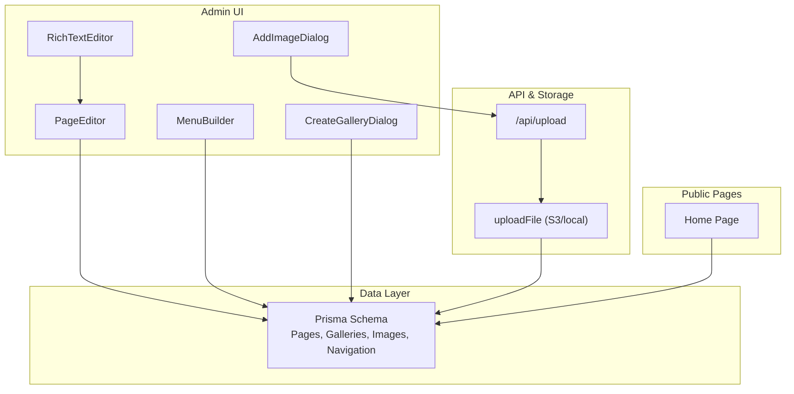
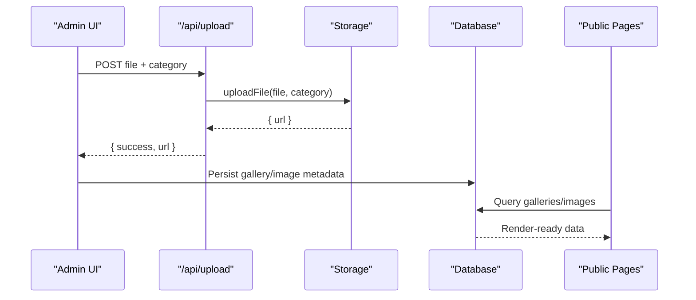
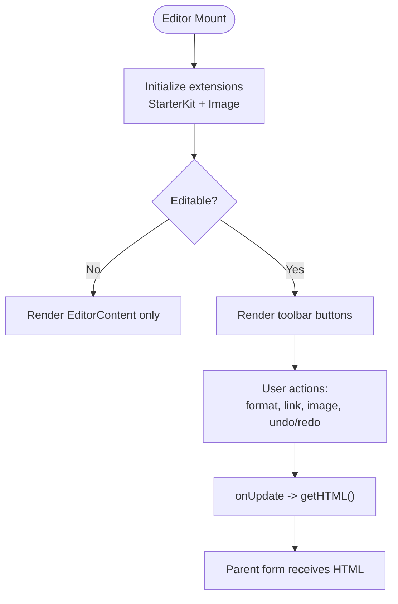
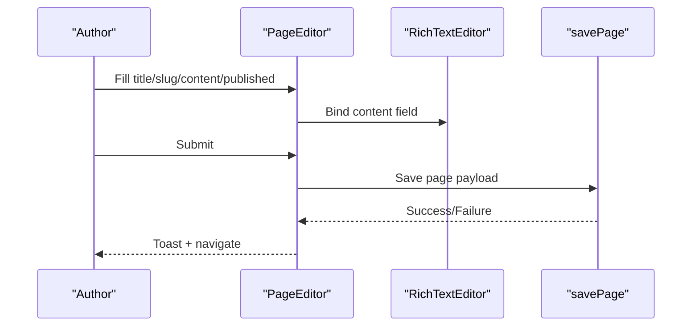
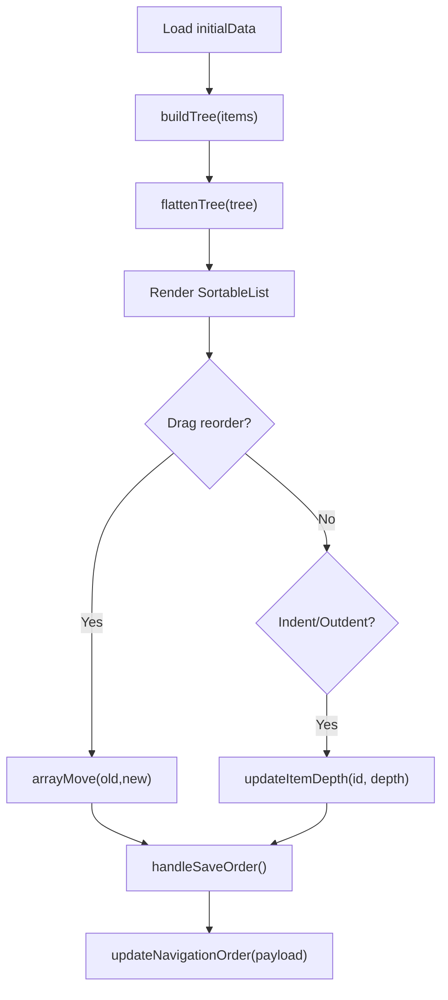
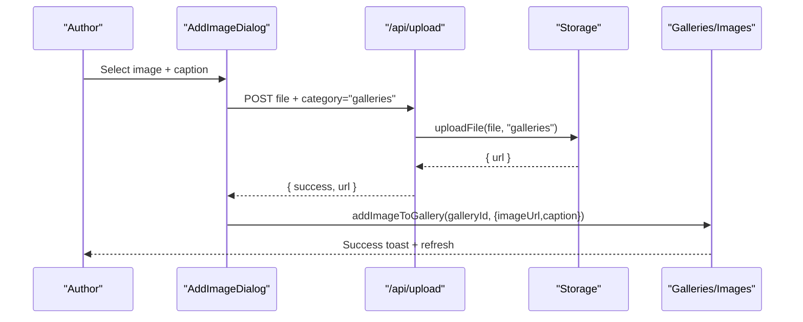
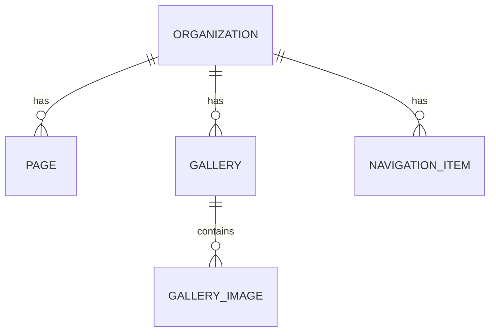
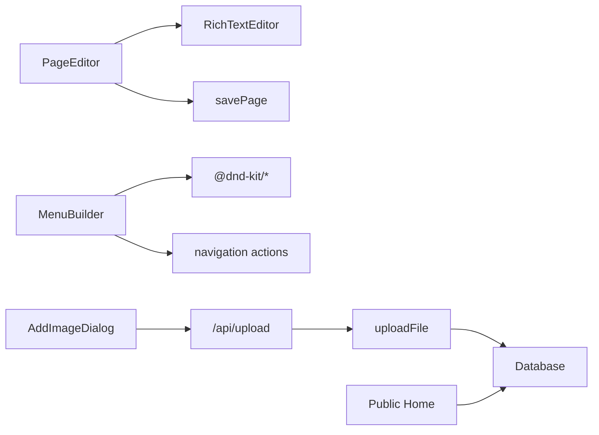

# Content Management System

<cite>
**Referenced Files in This Document**
- [rich-text-editor.tsx](file://components/admin/cms/rich-text-editor.tsx)
- [page-editor.tsx](file://components/admin/cms/page-editor.tsx)
- [menu-builder.tsx](file://components/admin/navigation/menu-builder.tsx)
- [create-gallery-dialog.tsx](file://components/admin/galleries/create-gallery-dialog.tsx)
- [add-image-dialog.tsx](file://components/admin/galleries/add-image-dialog.tsx)
- [route.ts](file://app/api/upload/route.ts)
- [storage.ts](file://lib/storage.ts)
- [schema.prisma](file://prisma/schema.prisma)
- [page.tsx](file://app/dashboard/admin/galleries/page.tsx)
- [page.tsx](file://app/dashboard/admin/galleries/[id]/page.tsx)
- [page.tsx](file://app/page.tsx)
</cite>

## Table of Contents
1. Introduction
2. Project Structure
3. Core Components
4. Architecture Overview
5. Detailed Component Analysis
6. Dependency Analysis
7. Performance Considerations
8. Troubleshooting Guide
9. Conclusion

## Introduction
This document explains the TMC Portal content management system with a focus on rich text editing, media management, and site navigation. It covers how pages, galleries, menus, and dynamic content blocks are modeled and edited, how media is uploaded and optimized, and how navigation is structured and rendered. It also provides guidance for creating CMS pages, managing media assets, configuring navigation, and considerations for versioning, workflows, SEO, performance, security, backups, and integrations.

## Project Structure
The CMS spans UI components for editors and managers, server routes for uploads, storage utilities for optimization and persistence, and a database schema that defines pages, galleries, images, and navigation items. The public homepage aggregates galleries for display.

**Diagram sources**
- [rich-text-editor.tsx:1-191](file://components/admin/cms/rich-text-editor.tsx#L1-L191)
- [page-editor.tsx:1-181](file://components/admin/cms/page-editor.tsx#L1-L181)
- [menu-builder.tsx:1-374](file://components/admin/navigation/menu-builder.tsx#L1-L374)
- [create-gallery-dialog.tsx:1-126](file://components/admin/galleries/create-gallery-dialog.tsx#L1-L126)
- [add-image-dialog.tsx:1-225](file://components/admin/galleries/add-image-dialog.tsx#L1-L225)
- [route.ts:1-66](file://app/api/upload/route.ts#L1-L66)
- [storage.ts:1-100](file://lib/storage.ts#L1-L100)
- [schema.prisma:1220-1369](file://prisma/schema.prisma#L1220-L1369)
- [page.tsx:79-97](file://app/page.tsx#L79-L97)

**Section sources**
- [schema.prisma:1220-1369](file://prisma/schema.prisma#L1220-L1369)
- [page.tsx:79-97](file://app/page.tsx#L79-L97)

## Core Components
- Rich Text Editor: A client-side editor with formatting tools (bold, italic, headings, lists, blockquotes), links, image insertion, undo/redo, and HTML output bound to form state.
- Page Editor: A form-driven page creator/editor that validates inputs, auto-generates slugs, integrates the rich text editor, and persists pages with publish flags.
- Navigation Builder: A drag-and-drop hierarchical menu builder that flattens trees, supports indent/outdent for nesting, and saves order and parent relationships.
- Media Gallery Manager: Create galleries and add images with captions; images are uploaded via an API route and stored with compression and safe naming.
- Storage Pipeline: Server-side upload handler validates file types and sizes, compresses images to WebP when applicable, and stores to S3-compatible storage or local filesystem, returning secure proxy URLs.

**Section sources**
- [rich-text-editor.tsx:1-191](file://components/admin/cms/rich-text-editor.tsx#L1-L191)
- [page-editor.tsx:1-181](file://components/admin/cms/page-editor.tsx#L1-L181)
- [menu-builder.tsx:1-374](file://components/admin/navigation/menu-builder.tsx#L1-L374)
- [create-gallery-dialog.tsx:1-126](file://components/admin/galleries/create-gallery-dialog.tsx#L1-L126)
- [add-image-dialog.tsx:1-225](file://components/admin/galleries/add-image-dialog.tsx#L1-L225)
- [route.ts:1-66](file://app/api/upload/route.ts#L1-L66)
- [storage.ts:1-100](file://lib/storage.ts#L1-L100)

## Architecture Overview
The CMS follows a component-driven architecture:
- Admin UI components manage content creation and organization.
- API routes enforce input validation and orchestrate storage operations.
- Storage utility handles compression and persistence to cloud or local storage.
- Database schema models pages, galleries, images, and navigation items with relationships to organizations.
- Public pages consume data from the database to render galleries and other content.

**Diagram sources**
- [add-image-dialog.tsx:82-127](file://components/admin/galleries/add-image-dialog.tsx#L82-L127)
- [route.ts:4-60](file://app/api/upload/route.ts#L4-L60)
- [storage.ts:25-99](file://lib/storage.ts#L25-L99)
- [schema.prisma:1343-1369](file://prisma/schema.prisma#L1343-L1369)
- [page.tsx:79-97](file://app/page.tsx#L79-L97)

## Detailed Component Analysis

### Rich Text Editor
- Provides formatting controls: bold, italic, headings, bullet/ordered lists, blockquote, link, image insertion, undo/redo.
- Emits HTML updates to the parent form via onChange.
- Supports read-only rendering mode for previews.

**Diagram sources**
- [rich-text-editor.tsx:17-38](file://components/admin/cms/rich-text-editor.tsx#L17-L38)
- [rich-text-editor.tsx:48-187](file://components/admin/cms/rich-text-editor.tsx#L48-L187)

**Section sources**
- [rich-text-editor.tsx:1-191](file://components/admin/cms/rich-text-editor.tsx#L1-L191)

### Page Editor
- Validates title, slug, content, published flag, and organization context.
- Auto-generates URL-friendly slugs from titles for new pages.
- Integrates the rich text editor for content authoring.
- Persists changes via a save action and navigates after successful create/update.

**Diagram sources**
- [page-editor.tsx:19-59](file://components/admin/cms/page-editor.tsx#L19-L59)
- [page-editor.tsx:61-71](file://components/admin/cms/page-editor.tsx#L61-L71)
- [page-editor.tsx:87-176](file://components/admin/cms/page-editor.tsx#L87-L176)

**Section sources**
- [page-editor.tsx:1-181](file://components/admin/cms/page-editor.tsx#L1-L181)

### Navigation Builder
- Builds a tree from flat data and flattens it for sortable rendering.
- Supports drag reordering and indent/outdent to adjust hierarchy.
- Saves structure by computing parent relationships and order.

**Diagram sources**
- [menu-builder.tsx:50-79](file://components/admin/navigation/menu-builder.tsx#L50-L79)
- [menu-builder.tsx:111-159](file://components/admin/navigation/menu-builder.tsx#L111-L159)
- [menu-builder.tsx:164-233](file://components/admin/navigation/menu-builder.tsx#L164-L233)

**Section sources**
- [menu-builder.tsx:1-374](file://components/admin/navigation/menu-builder.tsx#L1-374)

### Media Gallery Management
- Create galleries with title and description.
- Add images with optional captions; integrate an image editor before upload.
- Upload flow enforces type and size limits, then persists metadata.

**Diagram sources**
- [add-image-dialog.tsx:82-127](file://components/admin/galleries/add-image-dialog.tsx#L82-L127)
- [route.ts:4-60](file://app/api/upload/route.ts#L4-L60)
- [storage.ts:25-99](file://lib/storage.ts#L25-L99)

**Section sources**
- [create-gallery-dialog.tsx:1-126](file://components/admin/galleries/create-gallery-dialog.tsx#L1-L126)
- [add-image-dialog.tsx:1-225](file://components/admin/galleries/add-image-dialog.tsx#L1-L225)
- [route.ts:1-66](file://app/api/upload/route.ts#L1-L66)
- [storage.ts:1-100](file://lib/storage.ts#L1-L100)

### Data Models and Relationships
- Pages: Title, slug, content, published flag, metadata, timestamps; unique per organization.
- Galleries: Title, description, active flag; linked to organization.
- Gallery Images: Image URL, caption, order; linked to gallery.
- Navigation Items: Label, path, parent-child hierarchy, order, type, visibility.

**Diagram sources**
- [schema.prisma:1220-1235](file://prisma/schema.prisma#L1220-L1235)
- [schema.prisma:1343-1369](file://prisma/schema.prisma#L1343-L1369)
- [schema.prisma:556-574](file://prisma/schema.prisma#L556-L574)

**Section sources**
- [schema.prisma:1220-1369](file://prisma/schema.prisma#L1220-L1369)
- [schema.prisma:556-574](file://prisma/schema.prisma#L556-L574)

## Dependency Analysis
- Page Editor depends on Rich Text Editor for content editing and on a save action to persist pages.
- Navigation Builder depends on drag-and-drop libraries and server actions to update order and hierarchy.
- Gallery flows depend on the upload API route and storage utility for secure, optimized uploads.
- Public pages depend on database queries to fetch galleries and images for display.

**Diagram sources**
- [page-editor.tsx:1-181](file://components/admin/cms/page-editor.tsx#L1-L181)
- [rich-text-editor.tsx:1-191](file://components/admin/cms/rich-text-editor.tsx#L1-L191)
- [menu-builder.tsx:1-374](file://components/admin/navigation/menu-builder.tsx#L1-374)
- [add-image-dialog.tsx:1-225](file://components/admin/galleries/add-image-dialog.tsx#L1-L225)
- [route.ts:1-66](file://app/api/upload/route.ts#L1-L66)
- [storage.ts:1-100](file://lib/storage.ts#L1-L100)
- [page.tsx:79-97](file://app/page.tsx#L79-L97)

**Section sources**
- [page-editor.tsx:1-181](file://components/admin/cms/page-editor.tsx#L1-L181)
- [menu-builder.tsx:1-374](file://components/admin/navigation/menu-builder.tsx#L1-L374)
- [add-image-dialog.tsx:1-225](file://components/admin/galleries/add-image-dialog.tsx#L1-L225)
- [route.ts:1-66](file://app/api/upload/route.ts#L1-L66)
- [storage.ts:1-100](file://lib/storage.ts#L1-L100)
- [page.tsx:79-97](file://app/page.tsx#L79-L97)

## Performance Considerations
- Image Optimization: Images are compressed and converted to WebP with resizing to reduce bandwidth and improve load times.
- Safe Naming and Categories: Filenames are sanitized and categorized to avoid traversal and ensure organized storage.
- Proxy Access: When using S3-compatible storage, URLs are proxied through a server endpoint to control access and bypass public restrictions.
- Efficient Rendering: Public pages fetch galleries and images separately to avoid complex joins and improve query performance.

[No sources needed since this section provides general guidance]

## Troubleshooting Guide
- Upload Failures: Check file size limits and allowed types enforced by the upload route. Ensure environment variables for storage are configured correctly.
- Missing Images: Verify that the upload returns a valid URL and that the gallery image metadata was persisted. Confirm storage backend accessibility.
- Navigation Order Issues: After reordering or changing indentation, ensure the structure is saved; verify parent/depth calculations and that the order payload is correct.
- Page Publishing: Confirm the published flag is set and that the page slug is unique within the organization.

**Section sources**
- [route.ts:10-46](file://app/api/upload/route.ts#L10-L46)
- [storage.ts:66-99](file://lib/storage.ts#L66-L99)
- [menu-builder.tsx:193-233](file://components/admin/navigation/menu-builder.tsx#L193-L233)
- [page-editor.tsx:19-59](file://components/admin/cms/page-editor.tsx#L19-L59)

## Conclusion
The TMC Portal CMS provides a robust foundation for content creation and management. Authors can compose rich content, organize media into galleries with optimized delivery, and build hierarchical navigation structures. The system emphasizes performance through image compression and efficient data retrieval, while maintaining clear separation between UI, API, storage, and data layers. Future enhancements can include advanced approval workflows, scheduling, localization, SEO metadata fields, and integration with external content sources.

[No sources needed since this section summarizes without analyzing specific files]