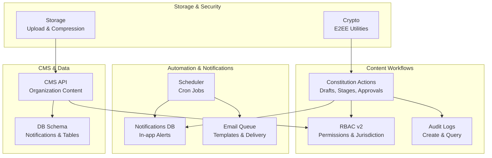
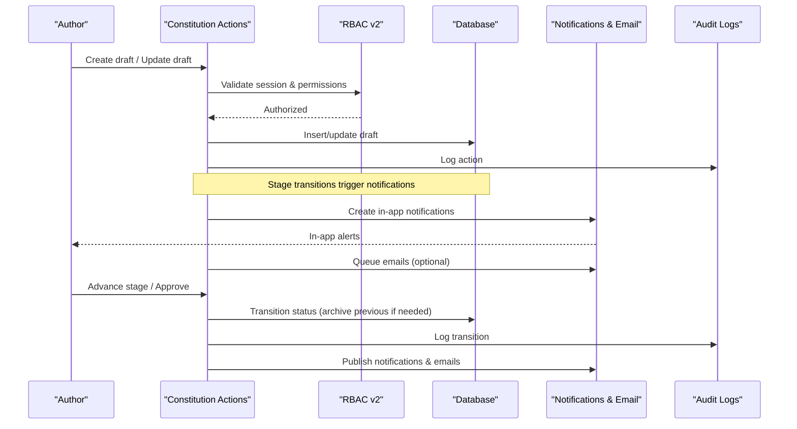
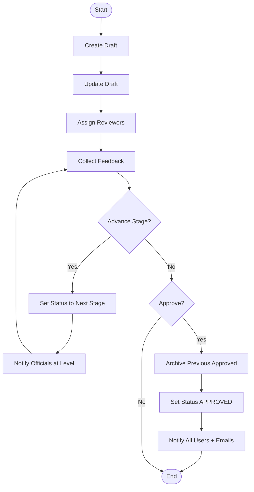
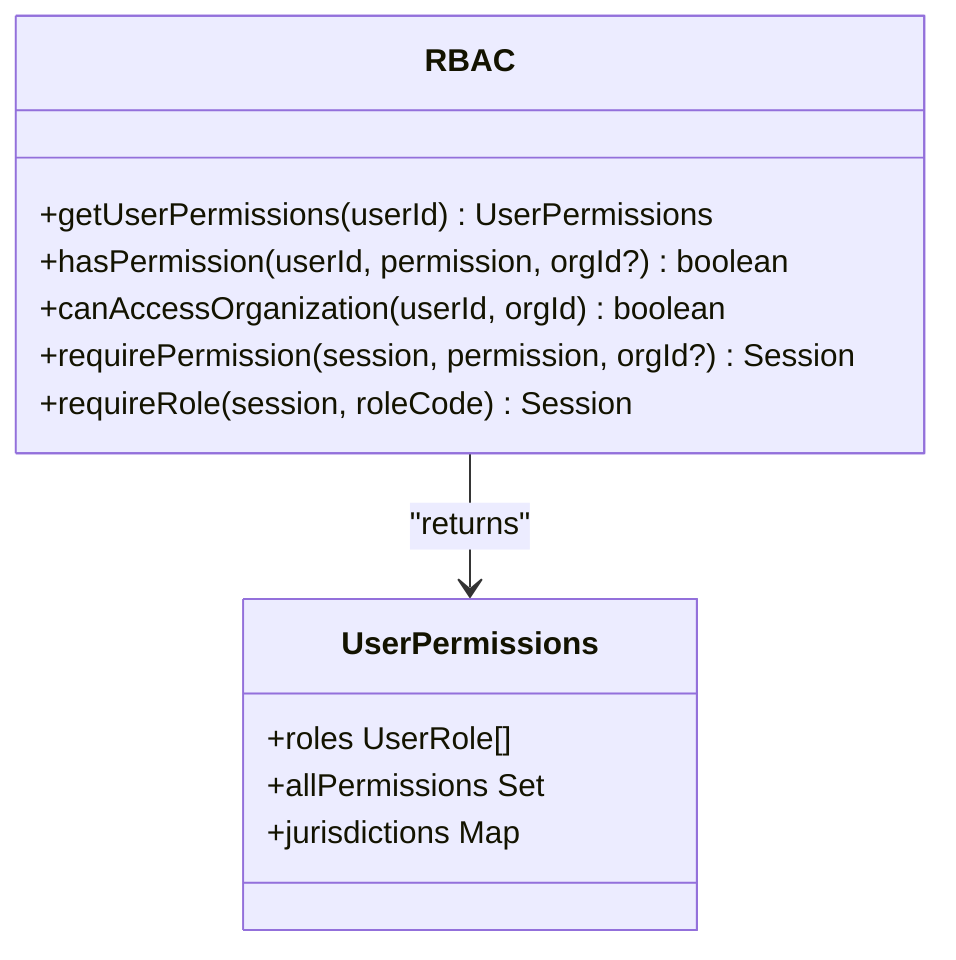
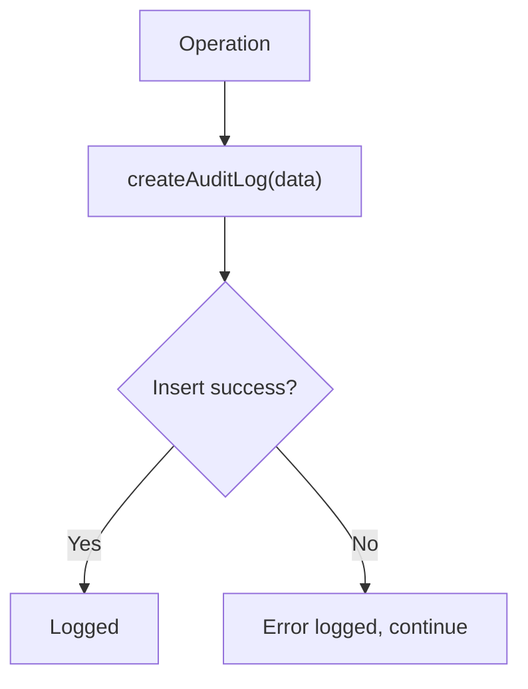
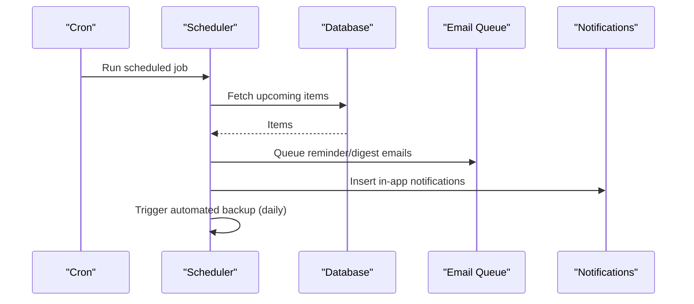
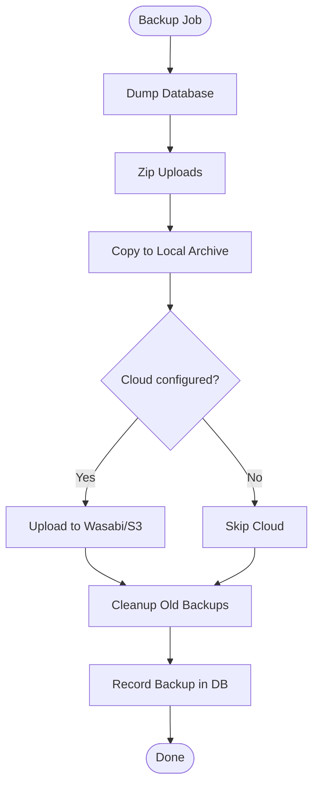
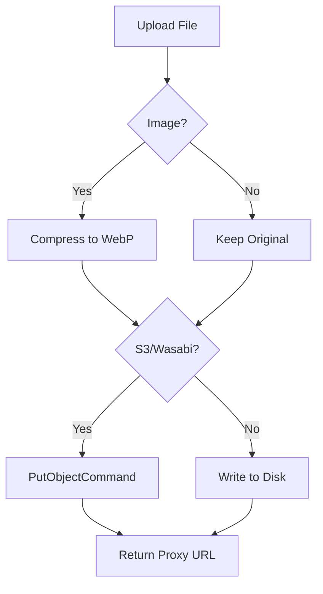
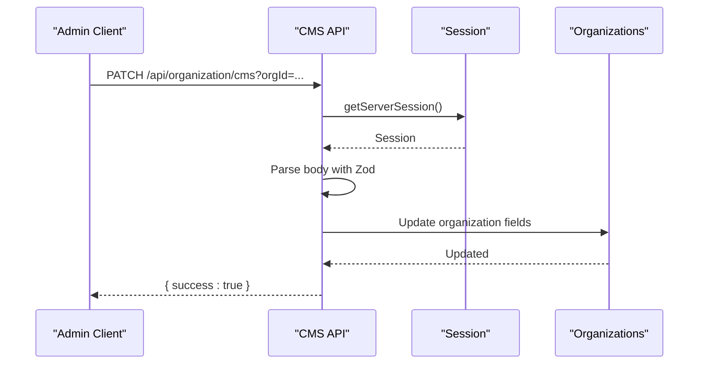
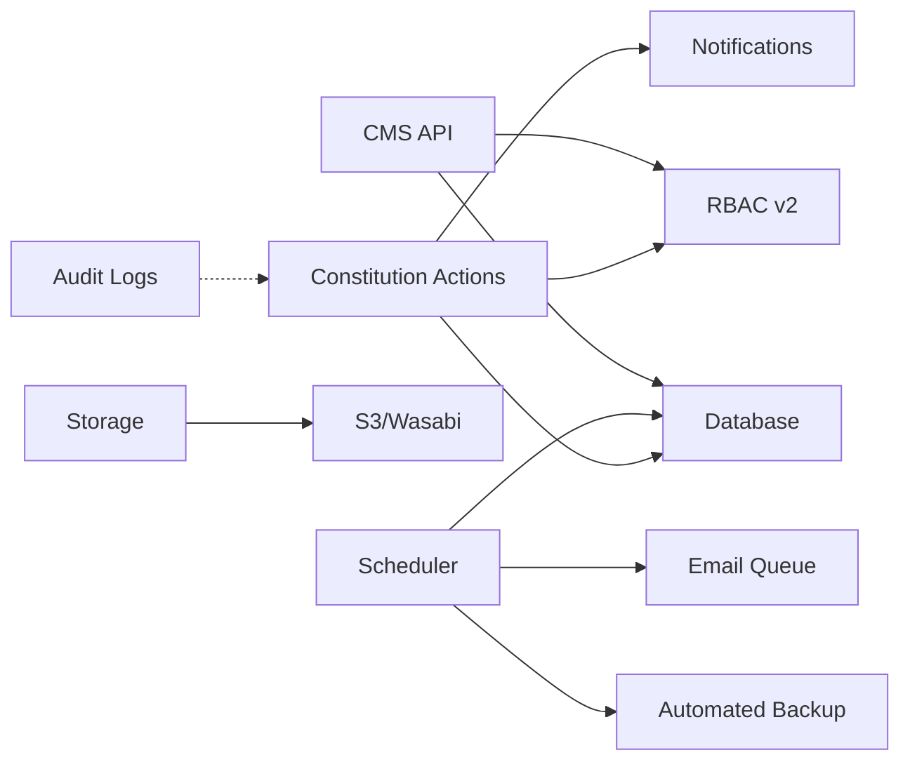

# Content Workflow & Publishing

<cite>
**Referenced Files in This Document**
- [constitution.ts](file://lib/actions/constitution.ts)
- [rbac-v2.ts](file://lib/rbac-v2.ts)
- [audit.ts](file://lib/audit.ts)
- [scheduler.ts](file://workers/scheduler.ts)
- [automated-backup.ts](file://scripts/automated-backup.ts)
- [storage.ts](file://lib/storage.ts)
- [crypto.ts](file://lib/crypto.ts)
- [route.ts (CMS)](file://app/api/organization/cms/route.ts)
- [schema.ts](file://lib/db/schema.ts)
- [page.tsx (Backups UI)](file://app/dashboard/admin/backups/page.tsx)
</cite>

## Table of Contents
1. Introduction
2. Project Structure
3. Core Components
4. Architecture Overview
5. Detailed Component Analysis
6. Dependency Analysis
7. Performance Considerations
8. Troubleshooting Guide
9. Conclusion

## Introduction
This document explains the content workflow and publishing system implemented in the project. It covers role-based permissions, review stages, audit trails, versioning and rollback patterns, scheduling and automation for notifications and backups, notification delivery, security controls, and disaster recovery procedures. The goal is to help teams set up approval workflows, manage drafts, collaborate effectively, and operate securely with reliable backups and recovery.

## Project Structure
The content workflow spans server actions, RBAC checks, scheduled tasks, storage, and backup utilities:
- Server actions implement draft creation, stage advancement, approvals, and feedback collection.
- RBAC enforces permissions and jurisdictional access.
- Audit logging records changes for compliance and traceability.
- A scheduler runs periodic tasks for reminders, digests, and automated backups.
- Storage handles file uploads with optional compression and S3/Wasabi integration.
- Crypto utilities provide end-to-end encryption primitives for sensitive data.
- CMS API endpoints update organization-level content with validation and session checks.
- Database schema defines notifications and related structures used by workflows.
- Admin UI exposes backup management and retention guidance.

**Diagram sources**
- [constitution.ts:10-234](file://lib/actions/constitution.ts#L10-L234)
- [rbac-v2.ts:47-165](file://lib/rbac-v2.ts#L47-L165)
- [audit.ts:17-71](file://lib/audit.ts#L17-L71)
- [scheduler.ts:12-51](file://workers/scheduler.ts#L12-L51)
- [storage.ts:25-99](file://lib/storage.ts#L25-L99)
- [crypto.ts:53-185](file://lib/crypto.ts#L53-L185)
- [route.ts (CMS):47-129](file://app/api/organization/cms/route.ts#L47-L129)
- [schema.ts:482-492](file://lib/db/schema.ts#L482-L492)

**Section sources**
- [constitution.ts:10-234](file://lib/actions/constitution.ts#L10-L234)
- [rbac-v2.ts:47-165](file://lib/rbac-v2.ts#L47-L165)
- [audit.ts:17-71](file://lib/audit.ts#L17-L71)
- [scheduler.ts:12-51](file://workers/scheduler.ts#L12-L51)
- [storage.ts:25-99](file://lib/storage.ts#L25-L99)
- [crypto.ts:53-185](file://lib/crypto.ts#L53-L185)
- [route.ts (CMS):47-129](file://app/api/organization/cms/route.ts#L47-L129)
- [schema.ts:482-492](file://lib/db/schema.ts#L482-L492)

## Core Components
- Approval workflows and review stages: Draft creation, multi-stage review, assignment of reviewers, feedback collection, and final approval that archives previous approved content.
- Role-based permissions: Centralized permission checks, jurisdiction-aware access control, and session-based enforcement helpers.
- Audit trails: Structured logging of user actions with filters and pagination support.
- Notification system: In-app notifications and email reminders via a queue; scheduler-driven weekly/daily/monthly tasks.
- Backup and disaster recovery: Automated daily backups with local and cloud retention, status tracking, and restore scripts.
- Content security: File upload handling with compression and S3/Wasabi fallback; client-side crypto utilities for E2EE scenarios.
- CMS updates: Validated PATCH endpoint to update organization-level content with session checks.

**Section sources**
- [constitution.ts:10-234](file://lib/actions/constitution.ts#L10-L234)
- [rbac-v2.ts:47-165](file://lib/rbac-v2.ts#L47-L165)
- [audit.ts:17-71](file://lib/audit.ts#L17-L71)
- [scheduler.ts:12-51](file://workers/scheduler.ts#L12-L51)
- [automated-backup.ts:86-238](file://scripts/automated-backup.ts#L86-L238)
- [storage.ts:25-99](file://lib/storage.ts#L25-L99)
- [crypto.ts:53-185](file://lib/crypto.ts#L53-L185)
- [route.ts (CMS):47-129](file://app/api/organization/cms/route.ts#L47-L129)

## Architecture Overview
The system orchestrates content lifecycle through server actions backed by RBAC and audit logging. Scheduled jobs drive recurring notifications and automated backups. Storage and crypto modules secure files and sensitive data. CMS endpoints allow authorized updates to organization content.

**Diagram sources**
- [constitution.ts:10-234](file://lib/actions/constitution.ts#L10-L234)
- [rbac-v2.ts:47-165](file://lib/rbac-v2.ts#L47-L165)
- [audit.ts:17-71](file://lib/audit.ts#L17-L71)
- [schema.ts:482-492](file://lib/db/schema.ts#L482-L492)

## Detailed Component Analysis

### Constitution Workflow: Drafts, Review Stages, and Approval
- Draft lifecycle: Create, update, delete drafts with timestamps and authorship.
- Multi-stage review: Assign reviewers, collect feedback per level, and advance through branch/LGA/state/national stages.
- Approval: Approving a draft archives any previously approved content and sets the new one as active; triggers notifications and emails to all users.
- Feedback: Authorized contributors can submit feedback at appropriate stages based on roles or assignments.

**Diagram sources**
- [constitution.ts:10-234](file://lib/actions/constitution.ts#L10-L234)

**Section sources**
- [constitution.ts:10-234](file://lib/actions/constitution.ts#L10-L234)

### Role-Based Access Control (RBAC)
- Permission resolution: Aggregates roles, permissions, and jurisdictions for a user, including expiration and activity flags.
- Super-admin bypass: SYSTEM-level roles have full access.
- Organization access: Validates whether a user’s roles cover the target organization hierarchy.
- Session helpers: Require specific permissions or roles within API routes.

**Diagram sources**
- [rbac-v2.ts:47-165](file://lib/rbac-v2.ts#L47-L165)
- [rbac-v2.ts:264-358](file://lib/rbac-v2.ts#L264-L358)

**Section sources**
- [rbac-v2.ts:47-165](file://lib/rbac-v2.ts#L47-L165)
- [rbac-v2.ts:264-358](file://lib/rbac-v2.ts#L264-L358)

### Audit Trails
- Logging: Captures user, action, entity type/id, organization context, IP, user agent, and metadata.
- Querying: Supports filtering by user, organization, entity, date range, with pagination.

**Diagram sources**
- [audit.ts:17-71](file://lib/audit.ts#L17-L71)

**Section sources**
- [audit.ts:17-71](file://lib/audit.ts#L17-L71)

### Scheduler and Notifications
- Weekly programme digest and officer reminders: Queries upcoming approved programmes and sends emails plus in-app notifications.
- Daily continuous reminders: Sends reminders for events approaching within 1–3 days.
- Monthly office report reminders: Nudges missing reports and issues due-date reminders.
- Automated backups: Triggers daily backup script via cron.

**Diagram sources**
- [scheduler.ts:12-51](file://workers/scheduler.ts#L12-L51)
- [scheduler.ts:53-197](file://workers/scheduler.ts#L53-L197)
- [scheduler.ts:199-337](file://workers/scheduler.ts#L199-L337)

**Section sources**
- [scheduler.ts:12-51](file://workers/scheduler.ts#L12-L51)
- [scheduler.ts:53-197](file://workers/scheduler.ts#L53-L197)
- [scheduler.ts:199-337](file://workers/scheduler.ts#L199-L337)

### Backups and Disaster Recovery
- Automated daily backups: Dumps database, zips uploads, persists locally and optionally to Wasabi/S3, tracks status, and cleans old backups based on retention.
- Manual backups: Admin UI provides a button to generate manual backups and shows retention notes.
- Restore: Script downloads last backup from cloud storage for recovery.

**Diagram sources**
- [automated-backup.ts:86-238](file://scripts/automated-backup.ts#L86-L238)
- [page.tsx (Backups UI):75-127](file://app/dashboard/admin/backups/page.tsx#L75-L127)

**Section sources**
- [automated-backup.ts:86-238](file://scripts/automated-backup.ts#L86-L238)
- [page.tsx (Backups UI):75-127](file://app/dashboard/admin/backups/page.tsx#L75-L127)

### Content Security: Storage and Encryption
- Storage: Uploads images with optional compression to WebP, supports S3/Wasabi with fallback to local storage, and returns proxied URLs when public access is restricted.
- Encryption: Client-side crypto utilities for key generation, PIN-derived keys, message/file encryption/decryption using AES-GCM and RSA-OAEP.

**Diagram sources**
- [storage.ts:25-99](file://lib/storage.ts#L25-L99)
- [crypto.ts:53-185](file://lib/crypto.ts#L53-L185)

**Section sources**
- [storage.ts:25-99](file://lib/storage.ts#L25-L99)
- [crypto.ts:53-185](file://lib/crypto.ts#L53-L185)

### CMS Updates and Validation
- GET/PATCH endpoints for organization CMS content:
  - Session-based authorization and organization scoping.
  - Zod schema validation for incoming fields.
  - Updates organization record with timestamps.

**Diagram sources**
- [route.ts (CMS):47-129](file://app/api/organization/cms/route.ts#L47-L129)

**Section sources**
- [route.ts (CMS):47-129](file://app/api/organization/cms/route.ts#L47-L129)

## Dependency Analysis
Key dependencies and interactions:
- Constitution actions depend on RBAC for authorization, DB for persistence, and notifications/email for outreach.
- Scheduler depends on DB queries and queues to send timely reminders and run backups.
- Storage integrates with S3/Wasabi clients and uses sharp for image processing.
- CMS API relies on session management and Zod validation before DB updates.
- Audit logs are independent but invoked by critical operations for traceability.

**Diagram sources**
- [constitution.ts:10-234](file://lib/actions/constitution.ts#L10-L234)
- [rbac-v2.ts:47-165](file://lib/rbac-v2.ts#L47-L165)
- [scheduler.ts:12-51](file://workers/scheduler.ts#L12-L51)
- [automated-backup.ts:86-238](file://scripts/automated-backup.ts#L86-L238)
- [storage.ts:25-99](file://lib/storage.ts#L25-L99)
- [route.ts (CMS):47-129](file://app/api/organization/cms/route.ts#L47-L129)
- [audit.ts:17-71](file://lib/audit.ts#L17-L71)

**Section sources**
- [constitution.ts:10-234](file://lib/actions/constitution.ts#L10-L234)
- [rbac-v2.ts:47-165](file://lib/rbac-v2.ts#L47-L165)
- [scheduler.ts:12-51](file://workers/scheduler.ts#L12-L51)
- [automated-backup.ts:86-238](file://scripts/automated-backup.ts#L86-L238)
- [storage.ts:25-99](file://lib/storage.ts#L25-L99)
- [route.ts (CMS):47-129](file://app/api/organization/cms/route.ts#L47-L129)
- [audit.ts:17-71](file://lib/audit.ts#L17-L71)

## Performance Considerations
- Batched notifications: When notifying large audiences, chunk inserts to avoid oversized payloads.
- Image compression: Reduces bandwidth and storage costs; configurable via environment variables.
- Scheduler efficiency: Use targeted queries and limit result sets where possible.
- Backup retention: Enforce retention policies to prevent storage bloat.
- Audit logging: Ensure non-blocking writes so they do not impact core workflows.

[No sources needed since this section provides general guidance]

## Troubleshooting Guide
- Unauthorized or forbidden errors:
  - Verify session and permissions using RBAC helpers.
  - Check role assignments and jurisdiction scope.
- Notifications not received:
  - Confirm email queue configuration and templates.
  - Validate in-app notification inserts and user IDs.
- Backup failures:
  - Inspect environment variables for S3/Wasabi credentials.
  - Check local archive directory permissions and disk space.
  - Review backup status records and error messages.
- CMS updates failing:
  - Ensure valid payload according to schema.
  - Confirm session and organization scoping.

**Section sources**
- [rbac-v2.ts:313-358](file://lib/rbac-v2.ts#L313-L358)
- [scheduler.ts:199-337](file://workers/scheduler.ts#L199-L337)
- [automated-backup.ts:86-238](file://scripts/automated-backup.ts#L86-L238)
- [route.ts (CMS):47-129](file://app/api/organization/cms/route.ts#L47-L129)

## Conclusion
The system provides a robust content workflow with clear approval stages, strong role-based access control, comprehensive audit trails, and reliable automation for notifications and backups. Security is reinforced through storage best practices and client-side encryption utilities. With scheduled tasks and admin tools, teams can confidently manage drafts, coordinate reviews, publish content, and recover from incidents.

[No sources needed since this section summarizes without analyzing specific files]