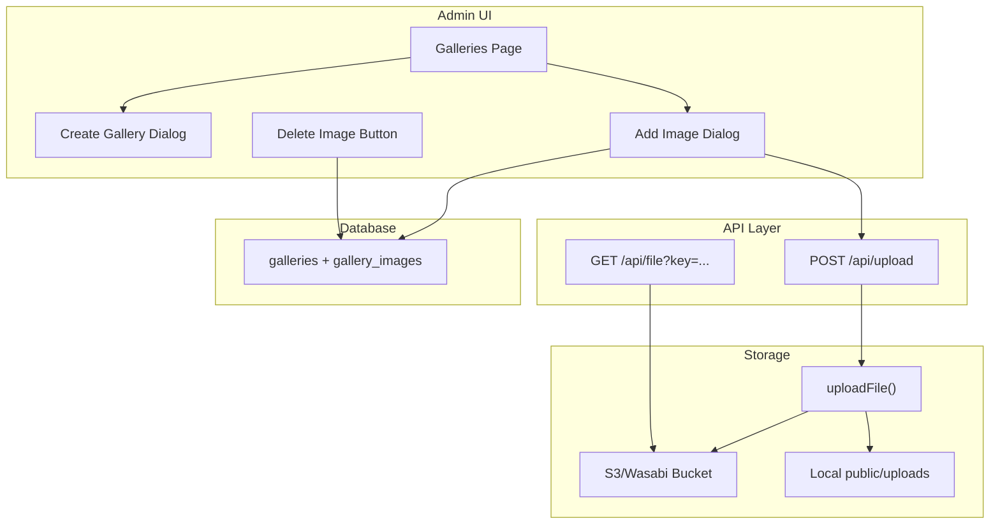
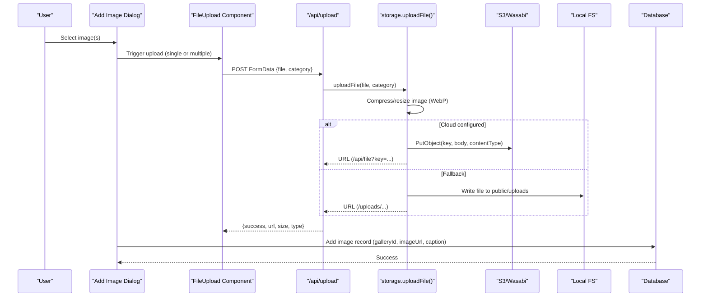
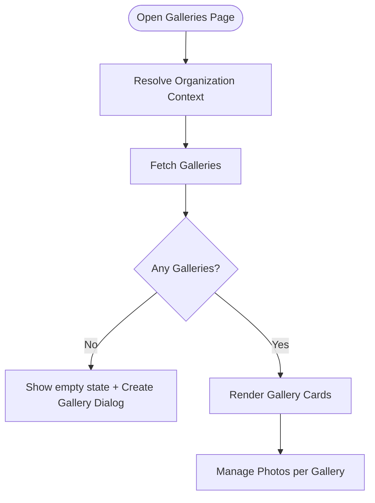
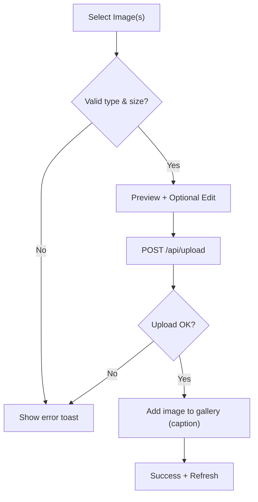
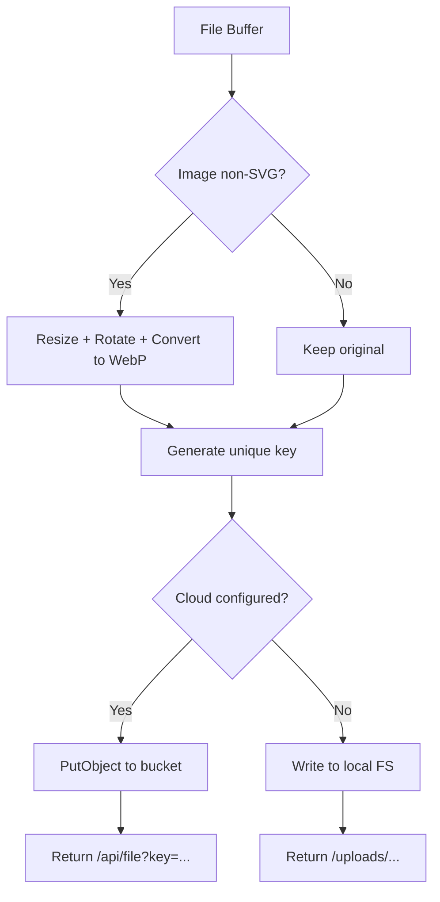
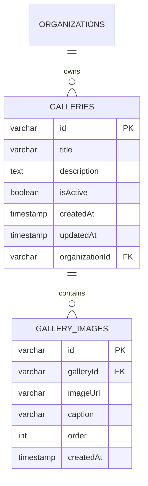
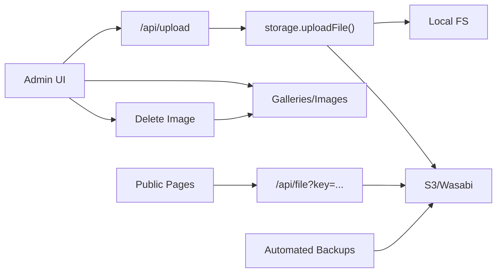
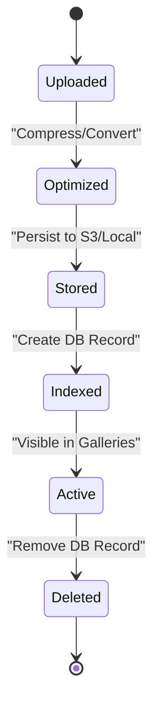

# Media Gallery & Asset Management

<cite>
**Referenced Files in This Document**
- [create-gallery-dialog.tsx](file://components/admin/galleries/create-gallery-dialog.tsx)
- [add-image-dialog.tsx](file://components/admin/galleries/add-image-dialog.tsx)
- [delete-image-button.tsx](file://components/admin/galleries/delete-image-button.tsx)
- [galleries page](file://app/dashboard/admin/galleries/page.tsx)
- [upload route](file://app/api/upload/route.ts)
- [storage module](file://lib/storage.ts)
- [file proxy route](file://app/api/file/route.ts)
- [automated backup script](file://scripts/automated-backup.ts)
- [backups dashboard page](file://app/dashboard/admin/backups/page.tsx)
- [database schema snapshot](file://drizzle/meta/0002_snapshot.json)
- [image editor component](file://components/ui/image-editor.tsx)
- [file upload component](file://components/ui/file-upload.tsx)
</cite>

## Table of Contents
1. [Introduction](#introduction)
2. [Project Structure](#project-structure)
3. [Core Components](#core-components)
4. [Architecture Overview](#architecture-overview)
5. [Detailed Component Analysis](#detailed-component-analysis)
6. [Dependency Analysis](#dependency-analysis)
7. [Performance Considerations](#performance-considerations)
8. [Security and Access Controls](#security-and-access-controls)
9. [Asset Lifecycle and Backup Strategy](#asset-lifecycle-and-backup-strategy)
10. [Troubleshooting Guide](#troubleshooting-guide)
11. [Conclusion](#conclusion)

## Introduction
This document explains the media gallery and asset management system implemented in the application. It covers image upload workflows (including batch uploads), gallery organization, metadata handling, image optimization, storage integration, access controls, backups, and performance best practices for responsive images.

## Project Structure
The system is composed of:
- Admin UI components to create galleries, add/remove images, and manage assets
- Server API routes to handle file uploads and secure file streaming
- A storage layer that compresses images and persists them to cloud or local storage
- Database tables to track galleries and their images
- Automated backup scripts to archive database and files with retention policies

**Diagram sources**
- [galleries page:1-142](file://app/dashboard/admin/galleries/page.tsx#L1-L142)
- [create-gallery-dialog.tsx:1-126](file://components/admin/galleries/create-gallery-dialog.tsx#L1-L126)
- [add-image-dialog.tsx:1-225](file://components/admin/galleries/add-image-dialog.tsx#L1-L225)
- [delete-image-button.tsx:1-50](file://components/admin/galleries/delete-image-button.tsx#L1-L50)
- [upload route:1-66](file://app/api/upload/route.ts#L1-L66)
- [storage module:1-100](file://lib/storage.ts#L1-L100)
- [file proxy route:1-61](file://app/api/file/route.ts#L1-L61)
- [database schema snapshot:3191-3291](file://drizzle/meta/0002_snapshot.json#L3191-L3291)

**Section sources**
- [galleries page:1-142](file://app/dashboard/admin/galleries/page.tsx#L1-L142)
- [create-gallery-dialog.tsx:1-126](file://components/admin/galleries/create-gallery-dialog.tsx#L1-L126)
- [add-image-dialog.tsx:1-225](file://components/admin/galleries/add-image-dialog.tsx#L1-L225)
- [delete-image-button.tsx:1-50](file://components/admin/galleries/delete-image-button.tsx#L1-L50)
- [upload route:1-66](file://app/api/upload/route.ts#L1-L66)
- [storage module:1-100](file://lib/storage.ts#L1-L100)
- [file proxy route:1-61](file://app/api/file/route.ts#L1-L61)
- [database schema snapshot:3191-3291](file://drizzle/meta/0002_snapshot.json#L3191-L3291)

## Core Components
- Galleries listing and creation: The admin galleries page lists existing galleries and provides a dialog to create new ones.
- Image upload and editing: The add image dialog supports selecting an image, previewing it, optional client-side editing, and uploading via the upload API.
- Batch uploads: A reusable file upload component supports multiple file selection and sequential uploads with progress feedback.
- Storage and optimization: The storage module compresses images to WebP at a maximum size and writes to S3/Wasabi or local filesystem.
- Secure file delivery: A file proxy endpoint streams stored objects from S3/Wasabi with caching headers.
- Database model: Galleries and gallery images are persisted with metadata such as title, description, caption, order, and timestamps.

**Section sources**
- [galleries page:1-142](file://app/dashboard/admin/galleries/page.tsx#L1-L142)
- [create-gallery-dialog.tsx:1-126](file://components/admin/galleries/create-gallery-dialog.tsx#L1-L126)
- [add-image-dialog.tsx:1-225](file://components/admin/galleries/add-image-dialog.tsx#L1-L225)
- [file upload component:1-110](file://components/ui/file-upload.tsx#L1-L110)
- [storage module:1-100](file://lib/storage.ts#L1-L100)
- [file proxy route:1-61](file://app/api/file/route.ts#L1-L61)
- [database schema snapshot:3191-3291](file://drizzle/meta/0002_snapshot.json#L3191-L3291)

## Architecture Overview
The upload flow validates and optimizes media on the server before persisting to storage. Galleries and images are tracked in the database. Public pages retrieve images through a secure proxy when needed.

**Diagram sources**
- [add-image-dialog.tsx:82-127](file://components/admin/galleries/add-image-dialog.tsx#L82-L127)
- [file upload component:42-75](file://components/ui/file-upload.tsx#L42-L75)
- [upload route:1-66](file://app/api/upload/route.ts#L1-L66)
- [storage module:25-99](file://lib/storage.ts#L25-L99)
- [file proxy route:22-55](file://app/api/file/route.ts#L22-L55)
- [database schema snapshot:3259-3291](file://drizzle/meta/0002_snapshot.json#L3259-L3291)

## Detailed Component Analysis

### Galleries Management
- Listing: Fetches galleries for the current organization and shows the first image as a thumbnail.
- Creation: Validates title/description and creates a gallery; refreshes the list on success.
- Access control: Uses session and role checks to ensure only authorized users can manage galleries.

**Diagram sources**
- [galleries page:17-65](file://app/dashboard/admin/galleries/page.tsx#L17-L65)
- [create-gallery-dialog.tsx:55-69](file://components/admin/galleries/create-gallery-dialog.tsx#L55-L69)

**Section sources**
- [galleries page:1-142](file://app/dashboard/admin/galleries/page.tsx#L1-L142)
- [create-gallery-dialog.tsx:1-126](file://components/admin/galleries/create-gallery-dialog.tsx#L1-L126)

### Image Upload and Editing
- Validation: Enforces accepted types and size limits on the client side.
- Preview and edit: Shows a preview and opens an image editor for rotation/zoom before upload.
- Upload: Sends FormData to the upload API with a category; handles single and multiple uploads.
- Post-upload: Adds the image to the selected gallery with optional caption.

**Diagram sources**
- [add-image-dialog.tsx:60-127](file://components/admin/galleries/add-image-dialog.tsx#L60-L127)
- [file upload component:42-75](file://components/ui/file-upload.tsx#L42-L75)
- [upload route:1-66](file://app/api/upload/route.ts#L1-L66)

**Section sources**
- [add-image-dialog.tsx:1-225](file://components/admin/galleries/add-image-dialog.tsx#L1-L225)
- [file upload component:1-110](file://components/ui/file-upload.tsx#L1-L110)
- [upload route:1-66](file://app/api/upload/route.ts#L1-L66)

### Storage and Optimization
- Compression: Images are resized to a maximum dimension and converted to WebP with quality tuning.
- Naming: Generates unique filenames using timestamps and sanitized names.
- Persistence: Writes to S3/Wasabi if configured; otherwise falls back to local filesystem under public/uploads.
- Delivery: Returns a proxy URL for secure streaming from private buckets.

**Diagram sources**
- [storage module:25-99](file://lib/storage.ts#L25-L99)
- [file proxy route:22-55](file://app/api/file/route.ts#L22-L55)

**Section sources**
- [storage module:1-100](file://lib/storage.ts#L1-L100)
- [file proxy route:1-61](file://app/api/file/route.ts#L1-L61)

### Database Model
- Galleries: Title, description, active flag, timestamps, and organization association.
- Gallery images: Link to gallery, image URL, caption, order, and timestamps.

**Diagram sources**
- [database schema snapshot:3191-3291](file://drizzle/meta/0002_snapshot.json#L3191-L3291)

**Section sources**
- [database schema snapshot:3191-3291](file://drizzle/meta/0002_snapshot.json#L3191-L3291)

## Dependency Analysis
- UI components depend on server actions and API routes for persistence and uploads.
- The upload route depends on the storage module for compression and persistence.
- The file proxy route depends on S3/Wasabi configuration to stream content securely.
- Backups depend on S3/Wasabi to store database dumps and file archives with retention policies.

**Diagram sources**
- [upload route:1-66](file://app/api/upload/route.ts#L1-L66)
- [storage module:1-100](file://lib/storage.ts#L1-L100)
- [file proxy route:1-61](file://app/api/file/route.ts#L1-L61)
- [automated backup script:1-200](file://scripts/automated-backup.ts#L1-L200)

**Section sources**
- [upload route:1-66](file://app/api/upload/route.ts#L1-L66)
- [storage module:1-100](file://lib/storage.ts#L1-L100)
- [file proxy route:1-61](file://app/api/file/route.ts#L1-L61)
- [automated backup script:1-200](file://scripts/automated-backup.ts#L1-L200)

## Performance Considerations
- Image optimization: Automatic resize and conversion to WebP reduces bandwidth and improves load times.
- Caching: The file proxy sets long-lived cache headers for immutable assets.
- Batch uploads: Sequential uploads provide progress feedback and reduce memory pressure compared to large multi-part payloads.
- CDN readiness: When behind a CDN, configure origin rules to cache the file proxy responses and serve optimized WebP variants.

[No sources needed since this section provides general guidance]

## Security and Access Controls
- Allowed types and extensions: The upload route enforces a whitelist of MIME types and file extensions.
- Size limits: Enforced server-side to prevent abuse.
- Category sanitization: Prevents directory traversal by sanitizing category inputs.
- Authorization: Gallery operations validate user sessions and permissions before modifying data.
- Malware scanning: Not implemented in the current codebase. Consider adding a virus scan step after upload and before publishing.

**Section sources**
- [upload route:16-50](file://app/api/upload/route.ts#L16-L50)
- [galleries page:67-124](file://app/dashboard/admin/galleries/page.tsx#L67-L124)

## Asset Lifecycle and Backup Strategy
- Upload: Client selects file(s), optionally edits, then uploads via the upload API.
- Optimization: Server compresses images and stores them to S3/Wasabi or local filesystem.
- Metadata: Image records are added to the database with captions and ordering.
- Deletion: Remove image records from the database; note that physical deletion of stored files is not automatically handled by the delete action.
- Backups: Automated backups export database and files to S3/Wasabi with retention cleanup. Manual backups are retained indefinitely until deleted.

**Diagram sources**
- [add-image-dialog.tsx:82-127](file://components/admin/galleries/add-image-dialog.tsx#L82-L127)
- [storage module:25-99](file://lib/storage.ts#L25-L99)
- [automated backup script:165-200](file://scripts/automated-backup.ts#L165-L200)
- [backups dashboard page:93-127](file://app/dashboard/admin/backups/page.tsx#L93-L127)

**Section sources**
- [add-image-dialog.tsx:1-225](file://components/admin/galleries/add-image-dialog.tsx#L1-L225)
- [storage module:1-100](file://lib/storage.ts#L1-L100)
- [automated backup script:1-200](file://scripts/automated-backup.ts#L1-L200)
- [backups dashboard page:93-127](file://app/dashboard/admin/backups/page.tsx#L93-L127)

## Troubleshooting Guide
- Upload fails with invalid type: Ensure the file type matches the allowed list or extension whitelist.
- File too large: Reduce file size or adjust limits as needed.
- Compression errors: If image processing fails, the system falls back to the original file; check logs for details.
- S3 not configured: The system will fall back to local storage; verify environment variables for cloud storage.
- Missing key in file proxy: Ensure the returned URL includes a valid key parameter.

**Section sources**
- [upload route:16-50](file://app/api/upload/route.ts#L16-L50)
- [storage module:32-56](file://lib/storage.ts#L32-L56)
- [file proxy route:22-33](file://app/api/file/route.ts#L22-L33)

## Conclusion
The media gallery and asset management system provides a robust workflow for creating galleries, uploading and optimizing images, organizing assets with metadata, and securing delivery through a proxy. Automated backups ensure data resilience. To further improve security and performance, consider implementing malware scanning, explicit file deletion routines, and CDN integration tuned for WebP assets.