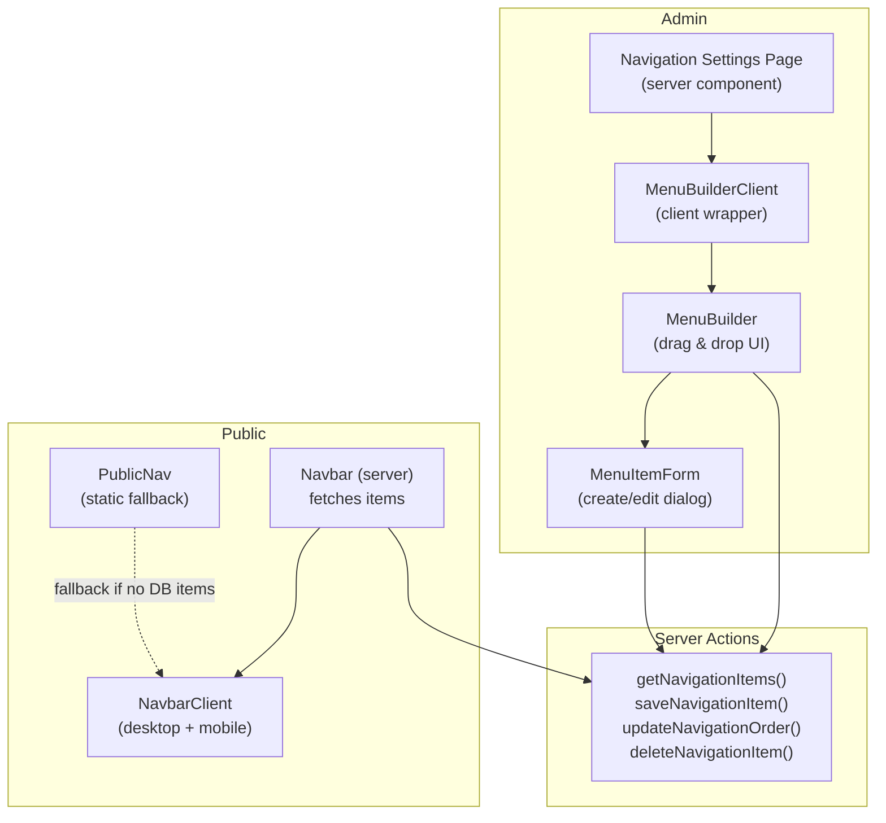
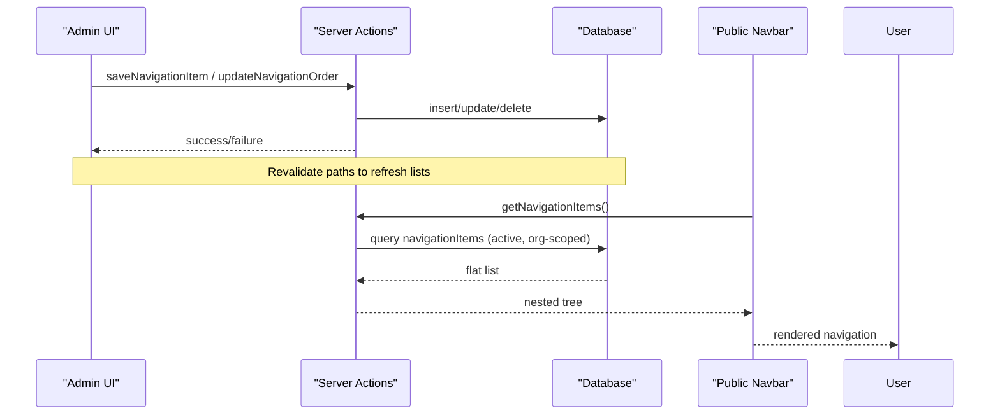
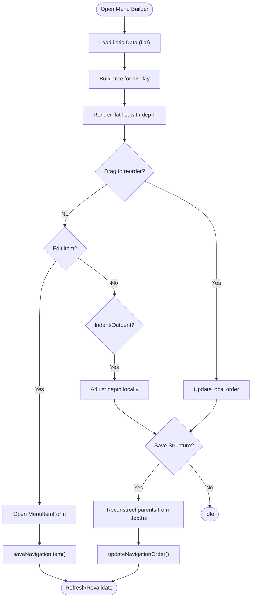
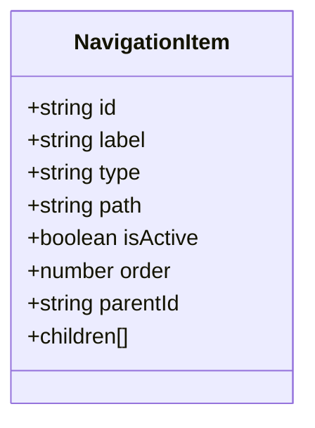
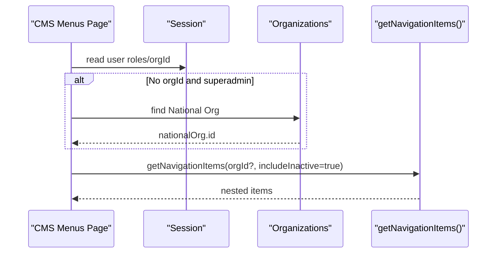
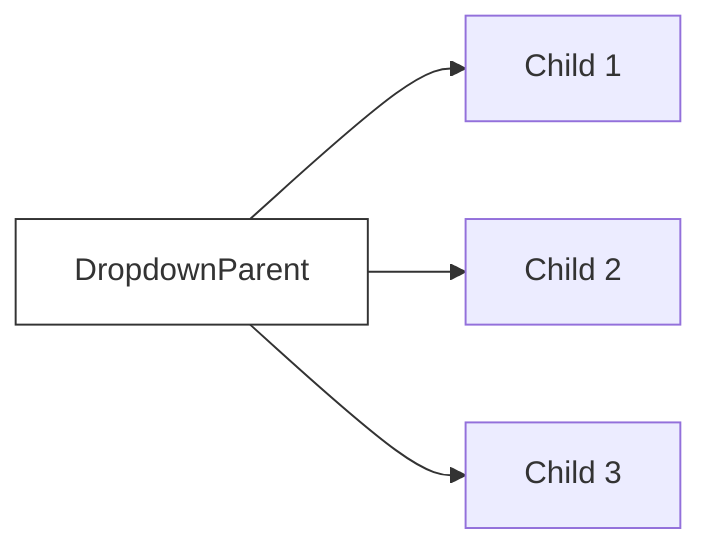
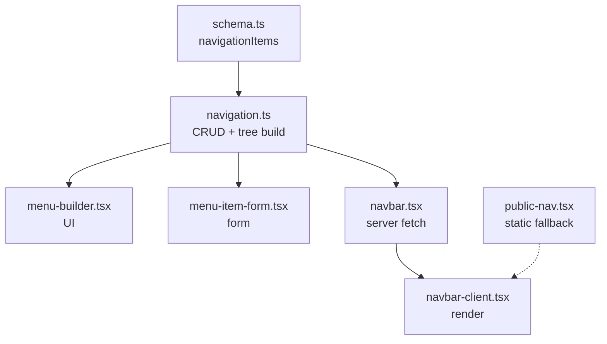
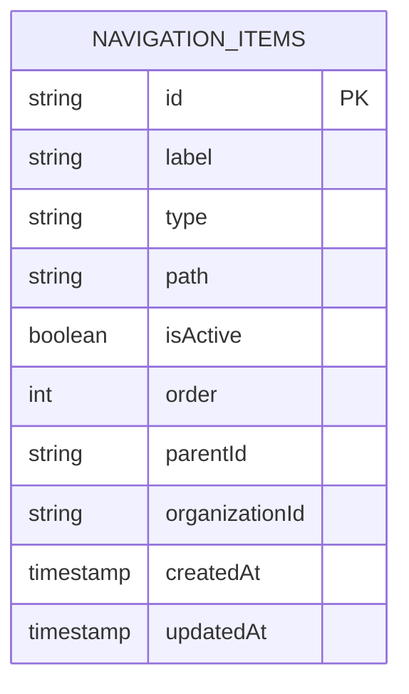

# Navigation & Menu Management

<cite>
**Referenced Files in This Document**
- [navigation.ts](file://lib/actions/navigation.ts)
- [menu-builder.tsx](file://components/admin/navigation/menu-builder.tsx)
- [menu-builder-client.tsx](file://components/admin/navigation/menu-builder-client.tsx)
- [menu-item-form.tsx](file://components/admin/navigation/menu-item-form.tsx)
- [navbar.tsx](file://components/layout/navbar.tsx)
- [navbar-client.tsx](file://components/layout/navbar-client.tsx)
- [public-nav.tsx](file://components/layout/public-nav.tsx)
- [page.tsx (Navigation Settings)](file://app/dashboard/admin/settings/navigation/page.tsx)
- [page.tsx (CMS Menus)](file://app/dashboard/admin/cms/menus/page.tsx)
- [schema.ts](file://lib/db/schema.ts)
</cite>

## Table of Contents
1. Introduction
2. Project Structure
3. Core Components
4. Architecture Overview
5. Detailed Component Analysis
6. Dependency Analysis
7. Performance Considerations
8. Troubleshooting Guide
9. Conclusion
10. Appendices

## Introduction
This document explains the navigation and menu management system implemented in the project. It covers hierarchical menu creation with parent-child relationships, conditional visibility, role-based access control hooks, a drag-and-drop menu builder interface, link types and URL routing, localization readiness, dynamic generation based on user context, mega menus, mobile navigation, caching strategies, SEO considerations, accessibility compliance, performance optimization for large trees, and real-time updates.

## Project Structure
The navigation system spans server actions, admin UI components, and public-facing navigation components:
- Server actions handle CRUD operations and tree building for navigation items.
- Admin pages provide a visual editor with drag-and-drop reordering and indentation to build hierarchies.
- Public navigation renders active items as desktop dropdowns and mobile sheets.

**Diagram sources**
- [page.tsx (Navigation Settings):1-29](file://app/dashboard/admin/settings/navigation/page.tsx#L1-L29)
- [menu-builder-client.tsx:1-27](file://components/admin/navigation/menu-builder-client.tsx#L1-L27)
- [menu-builder.tsx:1-374](file://components/admin/navigation/menu-builder.tsx#L1-L374)
- [menu-item-form.tsx:1-126](file://components/admin/navigation/menu-item-form.tsx#L1-L126)
- [navigation.ts:1-153](file://lib/actions/navigation.ts#L1-L153)
- [navbar.tsx:1-19](file://components/layout/navbar.tsx#L1-L19)
- [navbar-client.tsx:1-169](file://components/layout/navbar-client.tsx#L1-L169)
- [public-nav.tsx:1-340](file://components/layout/public-nav.tsx#L1-L340)

**Section sources**
- [page.tsx (Navigation Settings):1-29](file://app/dashboard/admin/settings/navigation/page.tsx#L1-L29)
- [menu-builder.tsx:1-374](file://components/admin/navigation/menu-builder.tsx#L1-L374)
- [navigation.ts:1-153](file://lib/actions/navigation.ts#L1-L153)
- [navbar.tsx:1-19](file://components/layout/navbar.tsx#L1-L19)
- [navbar-client.tsx:1-169](file://components/layout/navbar-client.tsx#L1-L169)
- [public-nav.tsx:1-340](file://components/layout/public-nav.tsx#L1-L340)

## Core Components
- Server actions:
  - getNavigationItems: fetches items, filters by organization and active status, builds a nested tree, and serializes dates.
  - saveNavigationItem: creates or updates an item with validation.
  - updateNavigationOrder: batch-updates parentId and order within a transaction.
  - deleteNavigationItem: recursively deletes children then removes the item.
- Admin UI:
  - MenuBuilderClient: client wrapper that loads MenuBuilder dynamically without SSR.
  - MenuBuilder: drag-and-drop list using @dnd-kit; supports indent/outdent to set hierarchy; saves structure via server action.
  - MenuItemForm: dialog to create/edit label, type (link/dropdown), and path.
- Public rendering:
  - Navbar (server): fetches navigation items and passes them to NavbarClient; falls back to defaults if empty.
  - NavbarClient: renders desktop dropdowns for parent items and mobile sheet navigation; handles auth-aware labels.
  - PublicNav: static public header with built-in links and mobile sheet.

**Section sources**
- [navigation.ts:30-153](file://lib/actions/navigation.ts#L30-L153)
- [menu-builder-client.tsx:1-27](file://components/admin/navigation/menu-builder-client.tsx#L1-L27)
- [menu-builder.tsx:30-374](file://components/admin/navigation/menu-builder.tsx#L30-L374)
- [menu-item-form.tsx:25-126](file://components/admin/navigation/menu-item-form.tsx#L25-L126)
- [navbar.tsx:1-19](file://components/layout/navbar.tsx#L1-L19)
- [navbar-client.tsx:20-169](file://components/layout/navbar-client.tsx#L20-L169)
- [public-nav.tsx:30-340](file://components/layout/public-nav.tsx#L30-L340)

## Architecture Overview
The system follows a clear separation between data operations and UI:
- Admin edits are persisted via server actions and immediately reflected after revalidation.
- Public navigation is rendered from the same data source, ensuring consistency.
- Tree structures are built server-side and consumed by both admin and public clients.

**Diagram sources**
- [navigation.ts:30-153](file://lib/actions/navigation.ts#L30-L153)
- [navbar.tsx:1-19](file://components/layout/navbar.tsx#L1-L19)

**Section sources**
- [navigation.ts:30-153](file://lib/actions/navigation.ts#L30-L153)
- [navbar.tsx:1-19](file://components/layout/navbar.tsx#L1-L19)

## Detailed Component Analysis

### Menu Builder Interface (Drag-and-Drop, Hierarchy, Save Flow)
- Drag-and-drop: Uses @dnd-kit to reorder items in a flat list representation.
- Hierarchy: Indent/outdent buttons adjust visual depth; saving reconstructs parent-child relationships using a depth stack algorithm and persists parentId and order.
- Create/Edit: Dialog form validates and submits via server action; supports link and dropdown types.
- Delete: Recursive deletion ensures child removal before parent deletion.

**Diagram sources**
- [menu-builder.tsx:50-233](file://components/admin/navigation/menu-builder.tsx#L50-L233)
- [navigation.ts:92-153](file://lib/actions/navigation.ts#L92-L153)

**Section sources**
- [menu-builder.tsx:50-233](file://components/admin/navigation/menu-builder.tsx#L50-L233)
- [menu-item-form.tsx:33-126](file://components/admin/navigation/menu-item-form.tsx#L33-L126)
- [navigation.ts:92-153](file://lib/actions/navigation.ts#L92-L153)

### Link Types and URL Routing
- Types:
  - link: Renders as a direct link to a path.
  - dropdown: Parent node whose children render as submenu items.
  - button: Supported by schema but not yet used in current UI; can be extended.
- Routing:
  - Paths are stored per item and rendered by Next.js Link components.
  - NavbarClient conditionally redirects dashboard entry to sign-in when unauthenticated.

**Diagram sources**
- [navigation.ts:10-28](file://lib/actions/navigation.ts#L10-L28)
- [navbar-client.tsx:45-78](file://components/layout/navbar-client.tsx#L45-L78)

**Section sources**
- [navigation.ts:10-28](file://lib/actions/navigation.ts#L10-L28)
- [navbar-client.tsx:45-78](file://components/layout/navbar-client.tsx#L45-L78)

### Conditional Visibility and Role-Based Access Control Hooks
- Visibility:
  - Items can be marked inactive and filtered out during retrieval.
  - Organization scoping allows per-organization menus.
- Role-based hooks:
  - The CMS menus page resolves organization context from session roles and supports super-admin fallback.
  - Public navbar adapts labels and routes based on authentication state.

**Diagram sources**
- [page.tsx (CMS Menus):19-46](file://app/dashboard/admin/cms/menus/page.tsx#L19-L46)
- [navigation.ts:30-89](file://lib/actions/navigation.ts#L30-L89)

**Section sources**
- [page.tsx (CMS Menus):19-46](file://app/dashboard/admin/cms/menus/page.tsx#L19-L46)
- [navigation.ts:30-89](file://lib/actions/navigation.ts#L30-L89)

### Mega Menus and Mobile Navigation
- Desktop mega menus:
  - Dropdowns are rendered for parent items with children; can be expanded to multi-column layouts by extending NavbarClient.
- Mobile navigation:
  - Sheet-based drawer presents top-level and nested items; closes on selection.
  - PublicNav includes its own mobile sheet with built-in sections.

**Diagram sources**
- [navbar-client.tsx:45-78](file://components/layout/navbar-client.tsx#L45-L78)
- [public-nav.tsx:94-128](file://components/layout/public-nav.tsx#L94-L128)

**Section sources**
- [navbar-client.tsx:45-169](file://components/layout/navbar-client.tsx#L45-L169)
- [public-nav.tsx:94-128](file://components/layout/public-nav.tsx#L94-L128)

### Localization Support and Dynamic Generation
- Localization:
  - Current implementation stores plain text labels; to support multiple languages, extend the model to include locale-specific labels and resolve at render time based on active language.
- Dynamic generation:
  - Use session context to filter by organization or role.
  - Extend getNavigationItems to accept additional filters (e.g., audience, feature flags).

[No sources needed since this section proposes extensions beyond current code]

### Creating Complex Navigation Structures
- Steps:
  - Add a parent item of type dropdown.
  - Add child items under the parent using the edit dialog’s parent selection.
  - Use indent/outdent to visually organize hierarchy.
  - Save structure to persist changes.

**Section sources**
- [menu-item-form.tsx:33-126](file://components/admin/navigation/menu-item-form.tsx#L33-L126)
- [menu-builder.tsx:164-233](file://components/admin/navigation/menu-builder.tsx#L164-L233)

## Dependency Analysis
- Admin pages depend on server actions for data operations.
- Public navigation depends on server actions to fetch and render active items.
- Schema defines the underlying table structure used by actions.

**Diagram sources**
- [schema.ts:1-200](file://lib/db/schema.ts#L1-L200)
- [navigation.ts:1-153](file://lib/actions/navigation.ts#L1-L153)
- [menu-builder.tsx:1-374](file://components/admin/navigation/menu-builder.tsx#L1-L374)
- [menu-item-form.tsx:1-126](file://components/admin/navigation/menu-item-form.tsx#L1-L126)
- [navbar.tsx:1-19](file://components/layout/navbar.tsx#L1-L19)
- [navbar-client.tsx:1-169](file://components/layout/navbar-client.tsx#L1-L169)
- [public-nav.tsx:1-340](file://components/layout/public-nav.tsx#L1-L340)

**Section sources**
- [navigation.ts:1-153](file://lib/actions/navigation.ts#L1-L153)
- [navbar.tsx:1-19](file://components/layout/navbar.tsx#L1-L19)
- [navbar-client.tsx:1-169](file://components/layout/navbar-client.tsx#L1-L169)
- [public-nav.tsx:1-340](file://components/layout/public-nav.tsx#L1-L340)

## Performance Considerations
- Tree construction:
  - O(n) map-based assembly in getNavigationItems; efficient for typical site sizes.
- Batch updates:
  - updateNavigationOrder uses a single transaction to minimize round-trips.
- Rendering:
  - Client-only loading for heavy drag-and-drop avoids SSR overhead.
- Caching:
  - Path revalidation after mutations ensures consistent views without full-page reloads.
- Large trees:
  - Consider pagination or virtualization for extremely deep menus.
  - Defer non-critical dropdown content until hover/interaction.

[No sources needed since this section provides general guidance]

## Troubleshooting Guide
- Items not appearing:
  - Verify isActive flag and organization scoping in getNavigationItems.
- Order not updating:
  - Ensure Save Structure is clicked; check updateNavigationOrder response.
- Deleting items:
  - Confirm recursive deletion works; verify no orphaned children remain.
- Public fallback:
  - If DB is empty, Navbar falls back to default items; seed navigation to enable dynamic menus.

**Section sources**
- [navigation.ts:30-153](file://lib/actions/navigation.ts#L30-L153)
- [navbar.tsx:5-17](file://components/layout/navbar.tsx#L5-L17)

## Conclusion
The navigation system provides a robust foundation for hierarchical menus with drag-and-drop editing, conditional visibility, and public rendering. It supports organization scoping and integrates with authentication for contextual behavior. Extensibility points exist for localization, advanced role-based filtering, mega menus, and enhanced performance optimizations.

[No sources needed since this section summarizes without analyzing specific files]

## Appendices

### Data Model Reference

**Diagram sources**
- [navigation.ts:10-28](file://lib/actions/navigation.ts#L10-L28)
- [schema.ts:1-200](file://lib/db/schema.ts#L1-L200)

### Example Workflows

#### Create a Mega Menu
1. Add a dropdown parent item.
2. Add child items and nest them using indent.
3. Save structure to persist hierarchy.
4. Rendered automatically in NavbarClient as a dropdown.

**Section sources**
- [menu-item-form.tsx:33-126](file://components/admin/navigation/menu-item-form.tsx#L33-L126)
- [menu-builder.tsx:164-233](file://components/admin/navigation/menu-builder.tsx#L164-L233)
- [navbar-client.tsx:45-78](file://components/layout/navbar-client.tsx#L45-L78)

#### Implement Role-Based Visibility
- Filter items by organizationId in getNavigationItems based on session.
- Optionally add role-based fields and extend queries to restrict access.

**Section sources**
- [page.tsx (CMS Menus):19-46](file://app/dashboard/admin/cms/menus/page.tsx#L19-L46)
- [navigation.ts:30-89](file://lib/actions/navigation.ts#L30-L89)

#### Manage Mobile Navigation
- Use the existing sheet-based mobile menu in NavbarClient or PublicNav.
- Ensure all important links are included and accessible via keyboard.

**Section sources**
- [navbar-client.tsx:81-169](file://components/layout/navbar-client.tsx#L81-L169)
- [public-nav.tsx:217-340](file://components/layout/public-nav.tsx#L217-L340)