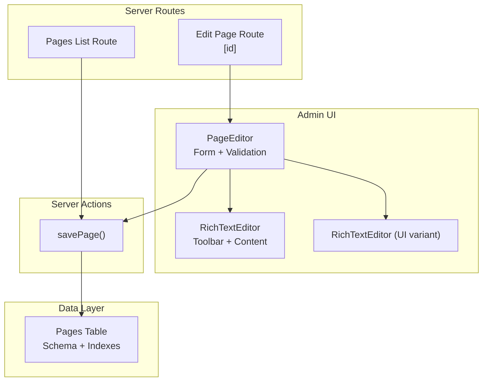
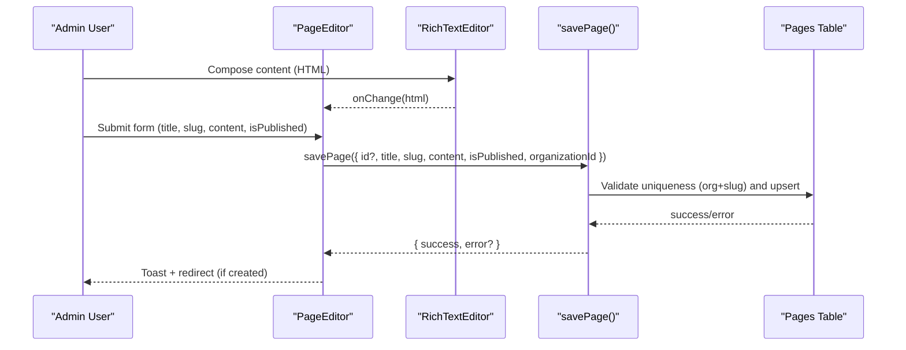
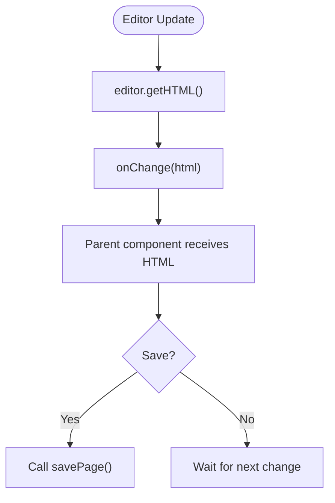
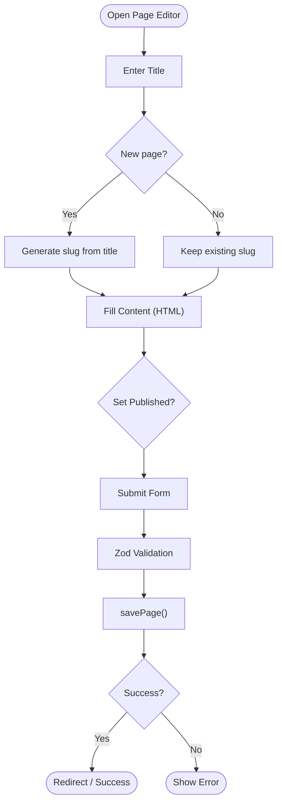
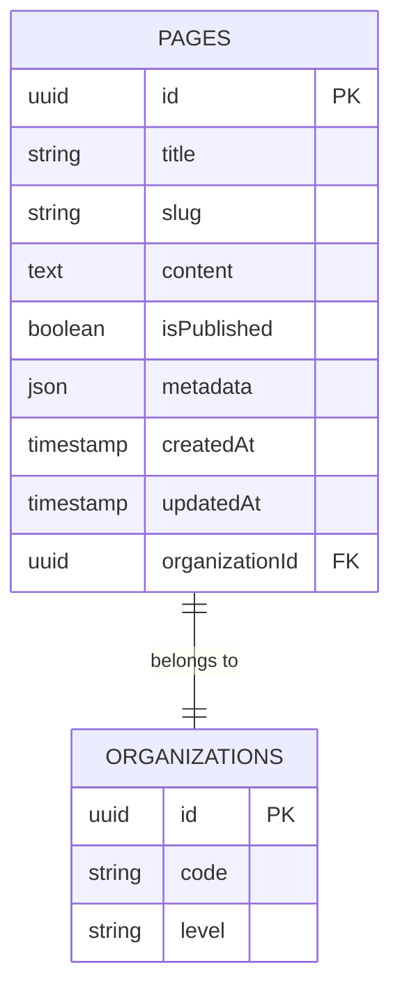
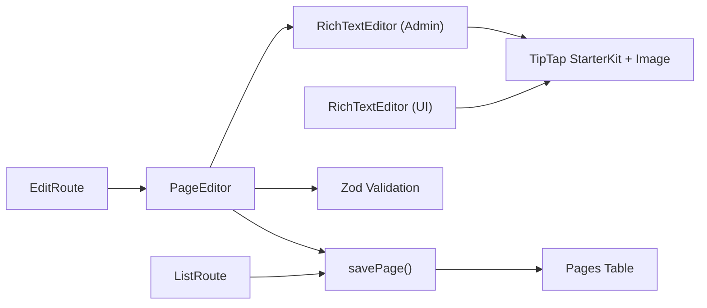

# Rich Text Editor & Page Management

<cite>
**Referenced Files in This Document**
- [rich-text-editor.tsx](file://components/admin/cms/rich-text-editor.tsx)
- [rich-text-editor.tsx (UI)](file://components/ui/rich-text-editor.tsx)
- [page-editor.tsx](file://components/admin/cms/page-editor.tsx)
- [Edit Page Route](file://app/dashboard/admin/cms/pages/[id]/page.tsx)
- [Pages List Route](file://app/dashboard/admin/cms/pages/page.tsx)
- [Pages Actions](file://lib/actions/pages.ts)
- [Database Schema Snapshot 0001](file://drizzle/meta/0001_snapshot.json)
- [Database Schema Snapshot 0003](file://drizzle/meta/0003_snapshot.json)
- [Notes Workspace (Auto-save example)](file://components/meeting-notes/notes-workspace.tsx)
</cite>

## Table of Contents
1. Introduction
2. Project Structure
3. Core Components
4. Architecture Overview
5. Detailed Component Analysis
6. Dependency Analysis
7. Performance Considerations
8. Troubleshooting Guide
9. Conclusion

## Introduction
This document explains the rich text editor and page management system used to create, edit, and publish CMS pages. It covers WYSIWYG capabilities (formatting, links, images), page creation workflow (title, slug, content blocks, metadata), page structure (organization-scoped slugs, draft/published states), and practical examples for building different page types and layouts. It also addresses customization options, sanitization considerations, performance strategies for large documents, auto-save patterns, and collaborative editing guidance.

## Project Structure
The CMS page feature is implemented across:
- Editor components for rich text editing
- A page editor form with validation and publishing controls
- Server routes to list/edit pages
- Server actions to persist pages
- Database schema defining page fields and constraints

**Diagram sources**
- [page-editor.tsx:1-181](file://components/admin/cms/page-editor.tsx#L1-L181)
- [rich-text-editor.tsx:1-191](file://components/admin/cms/rich-text-editor.tsx#L1-L191)
- [rich-text-editor.tsx (UI):1-153](file://components/ui/rich-text-editor.tsx#L1-L153)
- [Edit Page Route:1-59](file://app/dashboard/admin/cms/pages/[id]/page.tsx#L1-L59)
- [Pages List Route:1-119](file://app/dashboard/admin/cms/pages/page.tsx#L1-L119)
- [Pages Actions:47-76](file://lib/actions/pages.ts#L47-L76)
- [Database Schema Snapshot 0001:5490-5543](file://drizzle/meta/0001_snapshot.json#L5490-L5543)
- [Database Schema Snapshot 0003:5535-5586](file://drizzle/meta/0003_snapshot.json#L5535-L5586)

**Section sources**
- [page-editor.tsx:1-181](file://components/admin/cms/page-editor.tsx#L1-L181)
- [rich-text-editor.tsx:1-191](file://components/admin/cms/rich-text-editor.tsx#L1-L191)
- [rich-text-editor.tsx (UI):1-153](file://components/ui/rich-text-editor.tsx#L1-L153)
- [Edit Page Route:1-59](file://app/dashboard/admin/cms/pages/[id]/page.tsx#L1-L59)
- [Pages List Route:1-119](file://app/dashboard/admin/cms/pages/page.tsx#L1-L119)
- [Pages Actions:47-76](file://lib/actions/pages.ts#L47-L76)
- [Database Schema Snapshot 0001:5490-5543](file://drizzle/meta/0001_snapshot.json#L5490-L5543)
- [Database Schema Snapshot 0003:5535-5586](file://drizzle/meta/0003_snapshot.json#L5535-L5586)

## Core Components
- RichTextEditor (admin): Full-featured WYSIWYG with bold, italic, headings, lists, blockquote, link insertion, image insertion, undo/redo, and a clean toolbar. Uses TipTap StarterKit plus an Image extension. Emits HTML on update.
- RichTextEditor (UI): Lightweight variant with toggles for formatting, suitable for inline or compact forms. Also uses TipTap StarterKit and emits HTML on update.
- PageEditor: Form-driven page creator/editor with title, slug, content, and published toggle. Validates inputs using Zod and calls savePage server action. Auto-generates slug from title when creating new pages.
- Edit Page Route: Loads existing page data or renders empty editor for new pages; resolves organization context and enforces access.
- Pages List Route: Displays all pages for the current organization, shows draft/published status, provides edit/preview/delete actions.
- Pages Actions: Enforces schema validation, ensures unique slugs per organization, and persists updates or creates new pages.

**Section sources**
- [rich-text-editor.tsx:1-191](file://components/admin/cms/rich-text-editor.tsx#L1-L191)
- [rich-text-editor.tsx (UI):1-153](file://components/ui/rich-text-editor.tsx#L1-L153)
- [page-editor.tsx:1-181](file://components/admin/cms/page-editor.tsx#L1-L181)
- [Edit Page Route:1-59](file://app/dashboard/admin/cms/pages/[id]/page.tsx#L1-L59)
- [Pages List Route:1-119](file://app/dashboard/admin/cms/pages/page.tsx#L1-L119)
- [Pages Actions:47-76](file://lib/actions/pages.ts#L47-L76)

## Architecture Overview
The page lifecycle flows through client-side editors and forms into server actions that validate and persist data to the database. The editor outputs HTML which is stored as page content. Slugs are scoped by organization and enforced to be unique. Published state controls visibility.

**Diagram sources**
- [page-editor.tsx:42-59](file://components/admin/cms/page-editor.tsx#L42-L59)
- [rich-text-editor.tsx:17-38](file://components/admin/cms/rich-text-editor.tsx#L17-L38)
- [Pages Actions:47-76](file://lib/actions/pages.ts#L47-L76)
- [Database Schema Snapshot 0001:5490-5543](file://drizzle/meta/0001_snapshot.json#L5490-L5543)

## Detailed Component Analysis

### Rich Text Editor (Admin)
- Capabilities: Bold, italic, headings (H1/H2), bullet and ordered lists, blockquote, link insertion via prompt, image insertion via URL, undo/redo.
- Data flow: onUpdate returns editor.getHTML(), which is passed to parent via onChange.
- Customization: Toolbar buttons can be extended; additional TipTap extensions can be added to support media embeds, tables, code blocks, etc.
- Sanitization: Output is HTML; consider server-side sanitization before rendering to prevent XSS.

**Diagram sources**
- [rich-text-editor.tsx:17-38](file://components/admin/cms/rich-text-editor.tsx#L17-L38)
- [rich-text-editor.tsx:51-31](file://components/admin/cms/rich-text-editor.tsx#L51-L31)

**Section sources**
- [rich-text-editor.tsx:1-191](file://components/admin/cms/rich-text-editor.tsx#L1-L191)

### Rich Text Editor (UI Variant)
- Capabilities: Compact toolbar with toggles for bold, italic, underline, strikethrough, headings (H2/H3), lists, blockquote, undo/redo.
- Use cases: Inline editing within smaller forms or cards.
- Data flow: Same pattern—onUpdate emits HTML via onChange.

**Section sources**
- [rich-text-editor.tsx (UI):1-153](file://components/ui/rich-text-editor.tsx#L1-L153)

### Page Editor Form
- Fields: Title, Slug (auto-generated on new pages), Content (via RichTextEditor), Published toggle, Organization ID (context).
- Validation: Zod schema enforces required title, slug format, and organization association.
- Submission: Calls savePage server action; shows toast feedback and navigates after successful creation.

**Diagram sources**
- [page-editor.tsx:19-25](file://components/admin/cms/page-editor.tsx#L19-L25)
- [page-editor.tsx:61-71](file://components/admin/cms/page-editor.tsx#L61-L71)
- [page-editor.tsx:42-59](file://components/admin/cms/page-editor.tsx#L42-L59)

**Section sources**
- [page-editor.tsx:1-181](file://components/admin/cms/page-editor.tsx#L1-L181)

### Edit Page Route
- Responsibilities: Determine organization context, handle “new” vs “edit”, fetch existing page if editing, render PageEditor with appropriate props.

**Section sources**
- [Edit Page Route:1-59](file://app/dashboard/admin/cms/pages/[id]/page.tsx#L1-L59)

### Pages List Route
- Responsibilities: Fetch pages for the current organization, display cards with title, slug, preview snippet, published badge, and actions (edit, preview, delete).

**Section sources**
- [Pages List Route:1-119](file://app/dashboard/admin/cms/pages/page.tsx#L1-L119)

### Pages Actions (Persistence)
- Responsibilities: Parse input with Zod, enforce unique slug per organization, update or insert page records, return standardized result.

**Section sources**
- [Pages Actions:47-76](file://lib/actions/pages.ts#L47-L76)

### Database Schema (Pages)
- Key fields: title, slug, content (text), isPublished (boolean, default false), metadata (JSON), timestamps (createdAt, updatedAt).
- Constraints: Unique index on (organizationId, slug) to ensure per-org slug uniqueness.

**Diagram sources**
- [Database Schema Snapshot 0001:5490-5543](file://drizzle/meta/0001_snapshot.json#L5490-L5543)
- [Database Schema Snapshot 0003:5535-5586](file://drizzle/meta/0003_snapshot.json#L5535-L5586)

**Section sources**
- [Database Schema Snapshot 0001:5490-5543](file://drizzle/meta/0001_snapshot.json#L5490-L5543)
- [Database Schema Snapshot 0003:5535-5586](file://drizzle/meta/0003_snapshot.json#L5535-L5586)

## Dependency Analysis
- Client components depend on TipTap StarterKit and optional Image extension for rich content.
- PageEditor depends on react-hook-form, zod, and the RichTextEditor component.
- Routes depend on server actions for data operations and session/organization resolution.
- Server actions depend on Drizzle ORM and the pages table schema.

**Diagram sources**
- [rich-text-editor.tsx:1-191](file://components/admin/cms/rich-text-editor.tsx#L1-L191)
- [rich-text-editor.tsx (UI):1-153](file://components/ui/rich-text-editor.tsx#L1-L153)
- [page-editor.tsx:1-181](file://components/admin/cms/page-editor.tsx#L1-L181)
- [Pages Actions:47-76](file://lib/actions/pages.ts#L47-L76)

**Section sources**
- [rich-text-editor.tsx:1-191](file://components/admin/cms/rich-text-editor.tsx#L1-L191)
- [rich-text-editor.tsx (UI):1-153](file://components/ui/rich-text-editor.tsx#L1-L153)
- [page-editor.tsx:1-181](file://components/admin/cms/page-editor.tsx#L1-L181)
- [Pages Actions:47-76](file://lib/actions/pages.ts#L47-L76)

## Performance Considerations
- Large documents:
  - Prefer storing HTML and optionally JSON snapshots; avoid overly heavy client-side processing on every keystroke.
  - Debounce saves to reduce write frequency (see auto-save pattern below).
  - Consider pagination or lazy loading for long content previews in lists.
- Rendering:
  - Use server-side rendering where possible for initial page load; hydrate only necessary parts.
  - Avoid re-rendering entire editor on minor changes; rely on TipTap’s internal optimizations.
- Storage:
  - Ensure indexes on frequently queried fields (e.g., organizationId, slug).
  - Archive or split very large content into sections if needed.

[No sources needed since this section provides general guidance]

## Troubleshooting Guide
- Duplicate slug errors:
  - Occur when saving a page with a slug already taken in the same organization. Resolve by changing the slug or updating the conflicting page.
- Unauthorized or missing organization:
  - If no organization context is found and user is not super admin, editing may fail. Ensure proper session and role setup.
- Editor not rendering:
  - Check that the editor mounts correctly on the client and that immediatelyRender is set appropriately.
- Auto-save behavior:
  - For reference, see the meeting notes workspace which demonstrates debounced auto-save to persist edits efficiently.

**Section sources**
- [Pages Actions:47-76](file://lib/actions/pages.ts#L47-L76)
- [Edit Page Route:16-34](file://app/dashboard/admin/cms/pages/[id]/page.tsx#L16-L34)
- [Notes Workspace (Auto-save example):55-95](file://components/meeting-notes/notes-workspace.tsx#L55-L95)

## Conclusion
The CMS page system combines a flexible TipTap-based rich text editor with a robust page editor form, server-side validation, and organization-scoped persistence. It supports common formatting needs, image embedding via URLs, and clear draft/published workflows. For advanced use cases, extend the editor with additional TipTap extensions, implement server-side content sanitization, adopt debounced auto-save patterns, and optimize rendering and storage for large documents. Collaborative editing can be layered on top using real-time mechanisms while preserving the existing save and versioning model.