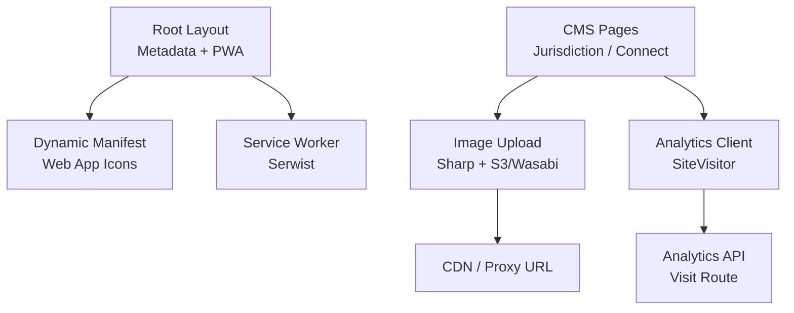
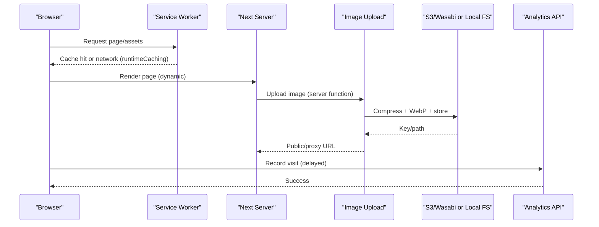
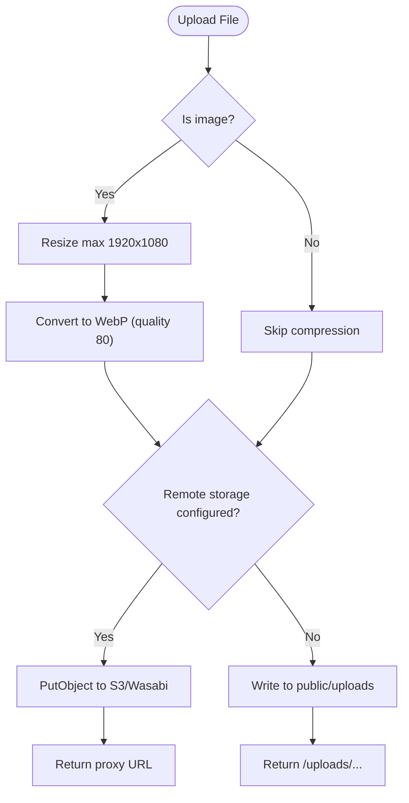
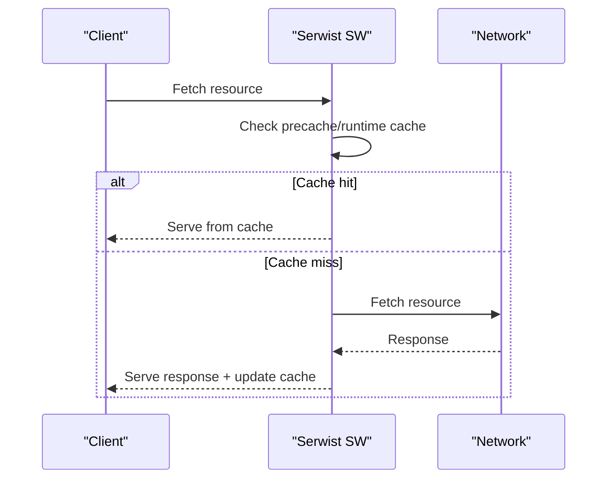
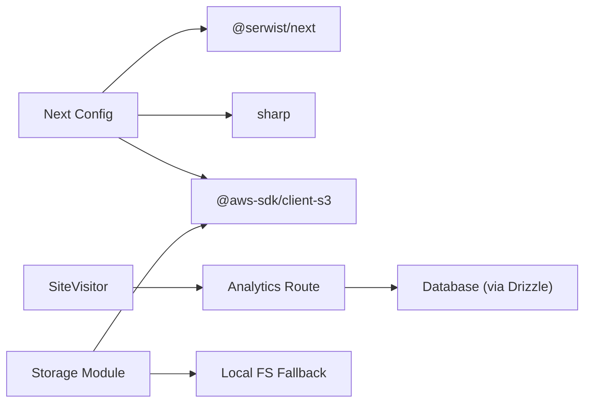

# SEO & Performance Optimization

<cite>
**Referenced Files in This Document**
- [layout.tsx](file://app/layout.tsx)
- [manifest.ts](file://app/manifest.ts)
- [next.config.ts](file://next.config.ts)
- [sw.ts](file://app/sw.ts)
- [storage.ts](file://lib/storage.ts)
- [site-visitor.tsx](file://components/analytics/site-visitor.tsx)
- [route.ts](file://app/api/analytics/visit/route.ts)
- [hero-slider.tsx](file://components/cms/hero-slider.tsx)
- [page.tsx](file://app/[jurisdiction]/page.tsx)
- [contact-location.tsx](file://components/cms/contact-location.tsx)
- [eslint.config.mjs](file://eslint.config.mjs)
</cite>

## Table of Contents
1. Introduction
2. Project Structure
3. Core Components
4. Architecture Overview
5. Detailed Component Analysis
6. Dependency Analysis
7. Performance Considerations
8. Troubleshooting Guide
9. Conclusion

## Introduction
This document explains how the project implements SEO and performance optimization for CMS-driven content. It covers meta tag management, structured data considerations, image optimization with WebP conversion and CDN integration, caching via a service worker, analytics tracking, and performance monitoring aligned with Core Web Vitals. It also provides guidance on configuring SEO settings, generating sitemaps, implementing canonical URLs, server-side rendering benefits, progressive enhancement techniques, and A/B testing frameworks.

## Project Structure
The application is built with Next.js App Router. SEO metadata is defined at the root layout level, while per-page metadata can be layered on top. The PWA manifest is generated dynamically. Image assets are uploaded through a server function that compresses and converts images to WebP before storing them remotely or locally. A service worker enables precaching and runtime caching for improved performance. Analytics are tracked client-side and persisted server-side.

**Diagram sources**
- [layout.tsx:20-32](file://app/layout.tsx#L20-L32)
- [manifest.ts:3-39](file://app/manifest.ts#L3-L39)
- [sw.ts:13-32](file://app/sw.ts#L13-L32)
- [storage.ts:25-99](file://lib/storage.ts#L25-L99)
- [site-visitor.tsx:12-70](file://components/analytics/site-visitor.tsx#L12-L70)
- [route.ts:6-32](file://app/api/analytics/visit/route.ts#L6-L32)

**Section sources**
- [layout.tsx:20-32](file://app/layout.tsx#L20-L32)
- [manifest.ts:3-39](file://app/manifest.ts#L3-L39)
- [next.config.ts:11-39](file://next.config.ts#L11-L39)
- [sw.ts:13-32](file://app/sw.ts#L13-L32)
- [storage.ts:25-99](file://lib/storage.ts#L25-L99)
- [site-visitor.tsx:12-70](file://components/analytics/site-visitor.tsx#L12-L70)
- [route.ts:6-32](file://app/api/analytics/visit/route.ts#L6-L32)

## Core Components
- Root metadata and viewport configuration for SEO and mobile behavior.
- Dynamic PWA manifest for app-like experience and icons.
- Service worker with Serwist for precaching and runtime caching.
- Server-side image upload pipeline with compression and WebP conversion.
- Client-side analytics component that records visits to a server endpoint.
- CMS pages using dynamic rendering and lazy-loaded iframes.

Key responsibilities:
- SEO baseline: title, description, Apple web app settings, viewport.
- PWA: name, theme colors, start URL, display mode, icons.
- Caching: navigation preload, default runtime cache, exclusions for specific routes.
- Images: resize, rotate EXIF, convert to WebP, store to S3-compatible storage or local fallback; serve via proxy or direct path.
- Analytics: visitor/session IDs, delayed non-blocking POST to API route.
- Rendering: force-dynamic for frequently changing content; Suspense boundaries.

**Section sources**
- [layout.tsx:20-40](file://app/layout.tsx#L20-L40)
- [manifest.ts:3-39](file://app/manifest.ts#L3-L39)
- [sw.ts:13-32](file://app/sw.ts#L13-L32)
- [storage.ts:25-99](file://lib/storage.ts#L25-L99)
- [site-visitor.tsx:12-70](file://components/analytics/site-visitor.tsx#L12-L70)
- [route.ts:6-32](file://app/api/analytics/visit/route.ts#L6-L32)
- [page.tsx:14-15](file://app/[jurisdiction]/page.tsx#L14-L15)

## Architecture Overview
The system combines Next.js App Router features with a service worker and a robust image pipeline. Metadata is set globally and can be extended per page. Content pages fetch data and render with dynamic strategies. Images are optimized on upload and served from a CDN or proxied endpoint. Analytics events are captured client-side and recorded server-side.

**Diagram sources**
- [sw.ts:13-32](file://app/sw.ts#L13-L32)
- [storage.ts:25-99](file://lib/storage.ts#L25-L99)
- [site-visitor.tsx:47-66](file://components/analytics/site-visitor.tsx#L47-L66)
- [route.ts:6-32](file://app/api/analytics/visit/route.ts#L6-L32)

## Detailed Component Analysis

### Meta Tags and PWA Configuration
- Global metadata sets site title, description, Apple web app capabilities, and format detection.
- Viewport config controls theme color and scaling behavior.
- PWA manifest defines app identity, theme colors, start URL, display mode, and icon variants.

Implementation highlights:
- Root layout exports metadata object and viewport settings.
- Manifest generator returns a standard web app manifest with multiple icon sizes and purposes.

SEO recommendations:
- Add per-page metadata overrides where needed to improve search snippets.
- Ensure Open Graph and Twitter Card tags are added at the page level for rich social sharing.
- Implement canonical links per page to avoid duplicate content issues.

**Section sources**
- [layout.tsx:20-40](file://app/layout.tsx#L20-L40)
- [manifest.ts:3-39](file://app/manifest.ts#L3-L39)

### Structured Data (Schema.org)
- While not explicitly present in the referenced files, structured data should be added per page using JSON-LD within page components to describe articles, organizations, breadcrumbs, FAQs, etc.
- Use schema.org types relevant to CMS content (e.g., Article, Organization, BreadcrumbList).

Guidance:
- Place JSON-LD in the head or top of page components.
- Validate with Google Rich Results Test and Schema Markup Validator.

[No sources needed since this section provides general guidance]

### Image Optimization Pipeline
- On upload, images are compressed, resized, auto-rotated based on EXIF, and converted to WebP with quality tuning.
- Storage supports S3-compatible endpoints (Wasabi/AWS) with optional custom endpoints and path-style addressing; falls back to local filesystem under public/uploads.
- When stored remotely, a proxy endpoint is returned to stream files securely; otherwise, a direct path is used.

Performance impact:
- Smaller payloads reduce LCP and improve TTI.
- WebP offers better compression vs. JPEG/PNG in most cases.
- Remote storage offloads bandwidth and improves global delivery when paired with a CDN.

**Diagram sources**
- [storage.ts:25-99](file://lib/storage.ts#L25-L99)

**Section sources**
- [storage.ts:25-99](file://lib/storage.ts#L25-L99)

### CDN Integration and Remote Patterns
- Next.js images are configured to allow remote patterns for trusted hosts and paths.
- In production, pair the storage bucket with a CDN for edge caching and reduced latency.
- If serving directly from S3/Wasabi, ensure CORS and security policies align with your domain.

Configuration notes:
- RemotePatterns define allowed protocols, hostnames, and path prefixes.
- unoptimized flag is enabled; consider enabling Next.js image optimization for supported formats if you switch to a compatible provider.

**Section sources**
- [next.config.ts:20-36](file://next.config.ts#L20-L36)

### Service Worker and Caching Strategy
- Serwist initializes a service worker with precaching entries and default runtime caching.
- Navigation preload is enabled to speed up first paint.
- Fetch interception excludes Server Actions and specific admin routes from caching to prevent stale updates.

Benefits:
- Faster repeat visits and offline resilience for static assets.
- Reduced server load for cached resources.

**Diagram sources**
- [sw.ts:13-32](file://app/sw.ts#L13-L32)

**Section sources**
- [sw.ts:13-32](file://app/sw.ts#L13-L32)
- [next.config.ts:4-9](file://next.config.ts#L4-L9)

### Analytics Tracking and Monitoring
- Client component tracks visits by maintaining visitor and session identifiers and posting to an API route after a short delay to avoid blocking critical rendering.
- API route persists visit data including user context (if authenticated), user agent, IP, and path.
- Admin dashboard displays aggregated metrics such as total page views, unique visitors, sessions, and views per session.

Recommendations:
- Integrate privacy-compliant analytics and cookie consent where required.
- Add event tracking for key conversions and CTAs.
- Monitor Core Web Vitals via browser APIs or third-party tools and correlate with traffic spikes.

**Section sources**
- [site-visitor.tsx:12-70](file://components/analytics/site-visitor.tsx#L12-L70)
- [route.ts:6-32](file://app/api/analytics/visit/route.ts#L6-L32)
- [dashboard analytics page:75-119](file://app/dashboard/admin/analytics/page.tsx#L75-L119)

### CMS Page Rendering and Lazy Loading
- Jurisdiction pages use dynamic rendering to reflect frequent content changes.
- Embedded maps and heavy iframes are loaded lazily to defer non-critical work.
- Hero slider uses client-side state and intervals for transitions; images are rendered with appropriate alt text.

Optimization tips:
- Prefer server components for data-heavy sections and hydrate only interactive parts.
- Use loading="lazy" for below-the-fold media and iframes.
- Consider IntersectionObserver-based lazy loading for complex components.

**Section sources**
- [page.tsx:14-15](file://app/[jurisdiction]/page.tsx#L14-L15)
- [contact-location.tsx:65-77](file://components/cms/contact-location.tsx#L65-L77)
- [hero-slider.tsx:14-109](file://components/cms/hero-slider.tsx#L14-L109)

### Progressive Enhancement and Core Web Vitals
- The ESLint configuration includes Core Web Vitals rules to guide development practices.
- Use Suspense boundaries to provide meaningful loading states during data fetching.
- Defer non-essential scripts and analytics to improve LCP and INP.

Practical steps:
- Audit with Lighthouse and Chrome DevTools Performance panel.
- Minimize main-thread work; split large bundles; prefer code splitting.
- Preload critical fonts and above-the-fold images.

**Section sources**
- [eslint.config.mjs:1-18](file://eslint.config.mjs#L1-L18)

## Dependency Analysis
Key dependencies and their roles:
- Next.js App Router: routing, metadata, server components, dynamic rendering.
- Serwist: service worker generation and runtime caching.
- Sharp: image processing (resize, rotate, WebP conversion).
- AWS SDK (S3 client): cloud storage uploads with configurable endpoints.
- UUID: stable visitor/session identifiers for analytics.

Coupling and cohesion:
- Image pipeline is encapsulated in a single server module, promoting reuse and testability.
- Analytics are decoupled into a client component and API route, minimizing coupling to UI logic.
- Service worker configuration is centralized and isolated from business logic.

Potential circular dependencies:
- None observed among analyzed modules; imports are directional and well-scoped.

External integrations:
- S3-compatible storage (Wasabi/AWS) for scalable asset hosting.
- Optional CDN layer for global distribution.

**Diagram sources**
- [next.config.ts:1-39](file://next.config.ts#L1-L39)
- [sw.ts:1-32](file://app/sw.ts#L1-L32)
- [storage.ts:1-99](file://lib/storage.ts#L1-L99)
- [site-visitor.tsx:12-70](file://components/analytics/site-visitor.tsx#L12-L70)
- [route.ts:6-32](file://app/api/analytics/visit/route.ts#L6-L32)

**Section sources**
- [next.config.ts:1-39](file://next.config.ts#L1-L39)
- [storage.ts:1-99](file://lib/storage.ts#L1-L99)
- [site-visitor.tsx:12-70](file://components/analytics/site-visitor.tsx#L12-L70)
- [route.ts:6-32](file://app/api/analytics/visit/route.ts#L6-L32)

## Performance Considerations
- Image optimization: Always compress and convert to WebP on upload; size appropriately; leverage CDN caching headers.
- Caching: Use service worker precaching for static assets; configure cache-control headers for immutable assets.
- Rendering: Favor server components for data fetching; use dynamic rendering judiciously; apply Suspense for streaming.
- Bundle size: Code-split routes and heavy components; remove unused dependencies; analyze bundle with Next.js build reports.
- Core Web Vitals: Monitor LCP, INP, CLS; optimize fonts, images, and third-party scripts; avoid layout shifts.
- Network: Enable HTTP/2 or HTTP/3; use CDN; preconnect to critical origins; preload critical resources.

[No sources needed since this section provides general guidance]

## Troubleshooting Guide
Common issues and resolutions:
- Images not optimizing: Verify environment flags and image type checks; confirm Sharp installation and native binaries; check logs for compression errors.
- Storage failures: Validate credentials, region, endpoint, and bucket permissions; ensure CORS and ACL policies allow access; fall back to local storage for debugging.
- Service worker not updating: Clear caches; verify skipWaiting and clientsClaim; check fetch interception rules for excluded routes.
- Analytics not recording: Confirm client component mounts; check network requests; validate API route availability and database writes; inspect console warnings.

Operational checks:
- Review build logs for dependency issues.
- Inspect network waterfall for large resources.
- Use Lighthouse and WebPageTest for performance audits.

**Section sources**
- [storage.ts:32-56](file://lib/storage.ts#L32-L56)
- [storage.ts:66-99](file://lib/storage.ts#L66-L99)
- [sw.ts:21-32](file://app/sw.ts#L21-L32)
- [site-visitor.tsx:47-66](file://components/analytics/site-visitor.tsx#L47-L66)
- [route.ts:27-32](file://app/api/analytics/visit/route.ts#L27-L32)

## Conclusion
The project establishes a solid foundation for SEO and performance:
- Global metadata and PWA manifest provide baseline SEO and app-like behavior.
- A robust image pipeline ensures efficient asset delivery with WebP conversion and flexible storage options.
- Service worker caching improves repeat visit performance and resilience.
- Analytics tracking enables measurement and optimization of user engagement.
To further enhance SEO, add per-page metadata, Open Graph/Twitter cards, canonical URLs, and structured data. Continue monitoring Core Web Vitals and iterate on performance improvements based on real-user metrics.

[No sources needed since this section summarizes without analyzing specific files]