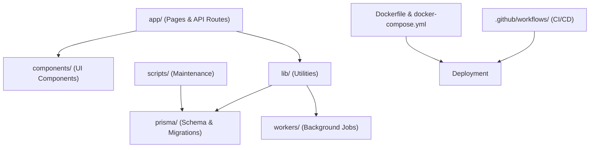
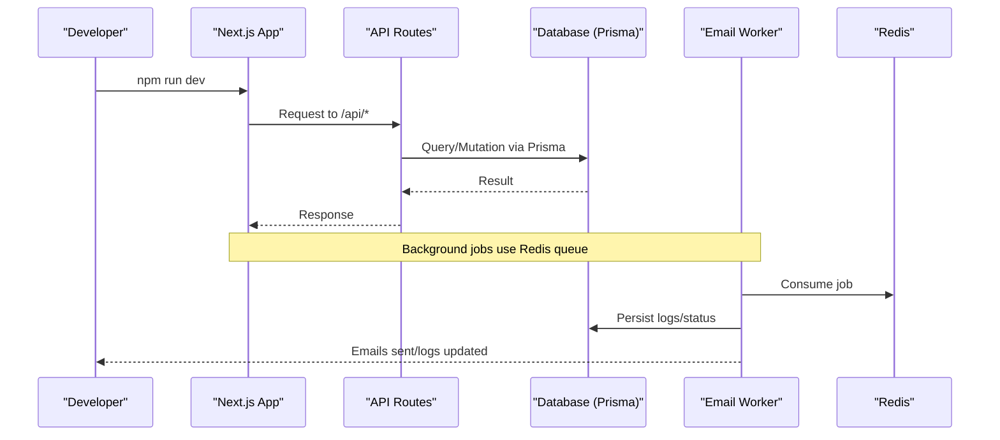
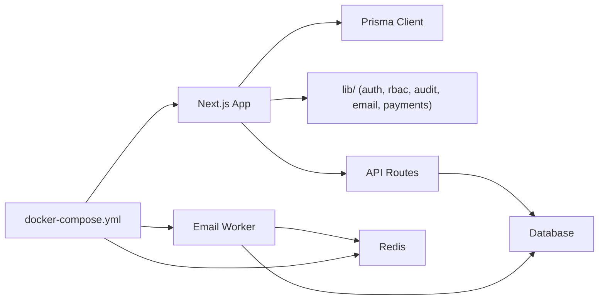

# Contributing Guide

<cite>
**Referenced Files in This Document**
- [README.md](file://README.md)
- [SETUP.md](file://SETUP.md)
- [package.json](file://package.json)
- [eslint.config.mjs](file://eslint.config.mjs)
- [next.config.ts](file://next.config.ts)
- [vitest.config.ts](file://vitest.config.ts)
- [tsconfig.json](file://tsconfig.json)
- [Dockerfile](file://Dockerfile)
- [docker-compose.yml](file://docker-compose.yml)
- [DEPLOYMENT_GUIDE_SERVER.md](file://DEPLOYMENT_GUIDE_SERVER.md)
- [.github/workflows/deploy.yml](file://.github/workflows/deploy.yml)
- [TESTING_GUIDE.md](file://TESTING_GUIDE.md)
- [PROJECT_SUMMARY.md](file://PROJECT_SUMMARY.md)
</cite>

## Table of Contents
1. Introduction
2. Project Structure
3. Core Components
4. Architecture Overview
5. Detailed Component Analysis
6. Dependency Analysis
7. Performance Considerations
8. Troubleshooting Guide
9. Conclusion
10. Appendices

## Introduction
This guide explains how to contribute effectively to the TMC Portal, a full-stack enterprise membership and governance automation system for Islamic organizations with hierarchical structure (National → State → Local). It covers development environment setup, coding standards, project structure, Git workflow, code review guidelines, testing requirements, documentation standards, build and deployment procedures, release management, issue reporting, feature requests, community interaction, mentorship opportunities, and learning resources.

The portal is built with Next.js 15 (App Router), TypeScript, Prisma, Tailwind CSS, ShadCN UI, NextAuth.js, Paystack, Resend/Amazon SES, and optional Redis for background jobs.

## Project Structure
At a high level:
- app/: Next.js App Router pages and API routes
- components/: Reusable React components grouped by feature
- lib/: Shared utilities (auth, RBAC, audit, email, payments, storage, etc.)
- prisma/: Database schema and migrations
- drizzle/: Drizzle ORM migrations and metadata
- scripts/: Utility and maintenance scripts
- workers/: Background workers (e.g., email worker)
- docs/: User and admin manuals
- .github/workflows/: CI/CD pipelines

**Diagram sources**
- [next.config.ts:1-41](file://next.config.ts#L1-L41)
- [Dockerfile:1-95](file://Dockerfile#L1-L95)
- [docker-compose.yml:1-69](file://docker-compose.yml#L1-L69)
- [.github/workflows/deploy.yml:1-26](file://.github/workflows/deploy.yml#L1-L26)

**Section sources**
- [README.md:82-102](file://README.md#L82-L102)
- [PROJECT_SUMMARY.md:56-94](file://PROJECT_SUMMARY.md#L56-L94)

## Core Components
Key areas that contributors will interact with:
- Authentication and Authorization: NextAuth.js integration and role-based access control
- API Routes: REST endpoints under app/api/*
- UI Pages: Feature pages under app/* and shared components under components/*
- Data Layer: Prisma schema and migrations under prisma/
- Background Workers: Email and scheduler workers under workers/
- Utilities: Shared logic in lib/ (audit, email, payments, storage, session, validators)

Development commands are defined in package.json and include dev, build, start, lint, test, and worker execution.

**Section sources**
- [package.json:5-16](file://package.json#L5-L16)
- [README.md:16-28](file://README.md#L16-L28)
- [PROJECT_SUMMARY.md:96-127](file://PROJECT_SUMMARY.md#L96-L127)

## Architecture Overview
The application follows a modern Next.js App Router architecture with server-side API routes and client components. It uses Prisma for data modeling and migrations, and can run with Docker for local and production environments. Background tasks are handled via workers using Redis.

**Diagram sources**
- [next.config.ts:1-41](file://next.config.ts#L1-L41)
- [docker-compose.yml:1-69](file://docker-compose.yml#L1-L69)
- [package.json:5-16](file://package.json#L5-L16)

## Detailed Component Analysis

### Development Environment Setup
- Install dependencies and set up environment variables as described in SETUP.md and README.md.
- Generate Prisma client and run migrations before starting the dev server.
- Use the provided scripts to run the dev server, build, start, lint, and tests.

Recommended IDE configuration:
- Enable TypeScript strict mode (already configured in tsconfig.json).
- Use ESLint with Next.js config (eslint.config.mjs).
- Configure path aliases (@/*) in your editor to match tsconfig.json paths.

Linting and formatting:
- Linting command: npm run lint
- ESLint configuration extends Next.js core web vitals and TypeScript rules.

Testing:
- Unit/integration tests run with Vitest (vitest.config.ts).
- Test environment uses jsdom; global setup file is configured.

**Section sources**
- [SETUP.md:1-54](file://SETUP.md#L1-L54)
- [README.md:29-80](file://README.md#L29-L80)
- [package.json:5-16](file://package.json#L5-L16)
- [eslint.config.mjs:1-19](file://eslint.config.mjs#L1-L19)
- [tsconfig.json:1-44](file://tsconfig.json#L1-L44)
- [vitest.config.ts:1-18](file://vitest.config.ts#L1-L18)

### Coding Standards and Naming Conventions
- TypeScript: Strict mode enabled; prefer explicit types and avoid any where possible.
- ESLint: Follow Next.js recommended rules; ensure no errors or warnings on lint.
- File and folder naming:
  - Use kebab-case for directories and files (e.g., app/api/members/route.ts).
  - Group related features under dedicated folders (app/, components/, lib/).
- Component organization:
  - Place reusable UI in components/ui/ and feature-specific components under components/<feature>.
  - Keep page-level logic in app/<route>/page.tsx and extract complex UI into components.
- API routes:
  - Organize by domain under app/api/<domain>/route.ts.
  - Validate inputs and handle errors consistently.

**Section sources**
- [eslint.config.mjs:1-19](file://eslint.config.mjs#L1-L19)
- [tsconfig.json:1-44](file://tsconfig.json#L1-L44)
- [PROJECT_SUMMARY.md:56-94](file://PROJECT_SUMMARY.md#L56-L94)

### Git Workflow
Branching strategy:
- Use feature branches for new functionality (e.g., feature/add-membership-flow).
- Merge into main/master after passing CI checks and code review.

Commit message conventions:
- Use clear, concise messages describing the change.
- Reference issues when applicable.

Pull request process:
- Ensure all tests pass and linting is clean.
- Include a description of changes, rationale, and any relevant screenshots or logs.
- Request reviews from maintainers.

Automated deployment:
- The GitHub Actions workflow deploys on push to master/main, building Docker images and restarting services.

**Section sources**
- [.github/workflows/deploy.yml:1-26](file://.github/workflows/deploy.yml#L1-L26)

### Code Review Guidelines
- Verify functionality meets requirements and edge cases are handled.
- Check for security considerations (input validation, authorization checks).
- Ensure performance implications are considered (N+1 queries, heavy computations).
- Confirm tests are added or updated for critical logic.
- Prefer small, focused PRs for easier review.

### Testing Requirements
- Run unit/integration tests with Vitest before submitting PRs.
- Follow manual testing steps outlined in TESTING_GUIDE.md for flows like signup, verification, login, and dashboard.
- For backend changes, validate database migrations and seed data.

**Section sources**
- [TESTING_GUIDE.md:1-54](file://TESTING_GUIDE.md#L1-L54)
- [TESTING_GUIDE.md:56-190](file://TESTING_GUIDE.md#L56-L190)
- [vitest.config.ts:1-18](file://vitest.config.ts#L1-L18)

### Documentation Standards
- Update user-facing documentation (docs/) when features change.
- Add inline comments for complex logic.
- Keep README and setup guides current with environment variables and commands.

**Section sources**
- [README.md:29-80](file://README.md#L29-L80)
- [SETUP.md:1-54](file://SETUP.md#L1-L54)

### Examples of Good Practices and Anti-Patterns
Good practices:
- Validate inputs at API boundaries and enforce RBAC.
- Use Prisma transactions for multi-step writes.
- Centralize error handling and logging.
- Keep components small and composable.

Anti-patterns to avoid:
- Hardcoding secrets in code; use environment variables.
- Bypassing authorization checks in routes.
- Large monolithic components; split by responsibility.
- Unhandled exceptions in async functions.

Refactoring guidelines:
- Extract repeated logic into lib/ utilities.
- Introduce typed interfaces for shared data structures.
- Prefer pure functions for business logic to improve testability.

[No sources needed since this section provides general guidance]

### Build Processes
- Development: npm run dev
- Build: npm run build
- Start: npm run start
- Lint: npm run lint
- Tests: npm run test

Next.js configuration:
- Uses webpack for builds (to avoid Prisma issues).
- Configures image remote patterns and service worker via Serwist.

**Section sources**
- [package.json:5-16](file://package.json#L5-L16)
- [next.config.ts:1-41](file://next.config.ts#L1-L41)

### Deployment Procedures
Local and production deployment via Docker:
- Build and run containers with docker-compose.yml.
- Environment variables must be set in .env.production or passed via env_file.
- Health check endpoint used by compose: /api/health.

Server deployment:
- Follow DEPLOYMENT_GUIDE_SERVER.md for network setup, Nginx reverse proxy, SSL, and migrations.
- Use prisma migrate deploy in production.

**Section sources**
- [docker-compose.yml:1-69](file://docker-compose.yml#L1-L69)
- [DEPLOYMENT_GUIDE_SERVER.md:1-145](file://DEPLOYMENT_GUIDE_SERVER.md#L1-L145)
- [Dockerfile:1-95](file://Dockerfile#L1-L95)

### Release Management
- Automated deployment triggers on push to master/main via GitHub Actions.
- Ensure CI passes and PRs are reviewed before merging.
- Tag releases if required by your process and update changelog accordingly.

**Section sources**
- [.github/workflows/deploy.yml:1-26](file://.github/workflows/deploy.yml#L1-L26)

### Issue Reporting and Feature Requests
- Report bugs with steps to reproduce, expected vs actual behavior, and environment details.
- For feature requests, describe the problem, proposed solution, and impact.
- Link related issues in PR descriptions.

[No sources needed since this section provides general guidance]

### Community Interaction and Mentorship
- Engage respectfully in discussions and code reviews.
- New contributors should start with small fixes or documentation updates.
- Seek mentorship from maintainers for complex features or architectural decisions.

[No sources needed since this section provides general guidance]

## Dependency Analysis
High-level dependency relationships:
- Next.js app depends on Prisma client for database access.
- API routes depend on lib utilities (auth, rbac, audit, email, payments).
- Workers depend on Redis for job queues.
- Docker Compose orchestrates app, worker, and Redis services.

**Diagram sources**
- [docker-compose.yml:1-69](file://docker-compose.yml#L1-L69)
- [next.config.ts:1-41](file://next.config.ts#L1-L41)
- [package.json:5-16](file://package.json#L5-L16)

**Section sources**
- [docker-compose.yml:1-69](file://docker-compose.yml#L1-L69)
- [package.json:5-16](file://package.json#L5-L16)

## Performance Considerations
- Use Prisma query optimization to avoid N+1 problems.
- Leverage caching strategies where appropriate (e.g., Redis for sessions or queues).
- Minimize bundle size by lazy-loading heavy components.
- Optimize images and enable CDN usage for static assets.

[No sources needed since this section provides general guidance]

## Troubleshooting Guide
Common issues and resolutions:
- Database connection errors: Verify DATABASE_URL and ensure the database is reachable.
- Prisma client not found: Run npx prisma generate.
- Email not sending: Check RESEND_API_KEY and domain verification; in development, emails are logged to console.
- Port conflicts: Adjust PORT in .env and update Nginx proxy_pass accordingly.
- Migration failures: Use prisma migrate deploy in production; verify schema consistency.

**Section sources**
- [TESTING_GUIDE.md:201-240](file://TESTING_GUIDE.md#L201-L240)
- [DEPLOYMENT_GUIDE_SERVER.md:92-145](file://DEPLOYMENT_GUIDE_SERVER.md#L92-L145)

## Conclusion
Contributing to the TMC Portal involves following established development workflows, coding standards, and testing practices. Use the provided tools and configurations to ensure consistent quality and reliability. Engage with the community through thoughtful code reviews, clear documentation, and collaborative problem-solving.

[No sources needed since this section summarizes without analyzing specific files]

## Appendices

### Quick Commands Reference
- Install dependencies: npm install
- Set up environment: cp .env.example .env (fill values)
- Generate Prisma client: npx prisma generate
- Run migrations: npx prisma migrate dev (dev), npx prisma migrate deploy (prod)
- Start dev server: npm run dev
- Build: npm run build
- Start production: npm run start
- Lint: npm run lint
- Test: npm run test
- Run email worker: npm run worker:email

**Section sources**
- [package.json:5-16](file://package.json#L5-L16)
- [SETUP.md:1-54](file://SETUP.md#L1-L54)
- [README.md:29-80](file://README.md#L29-L80)