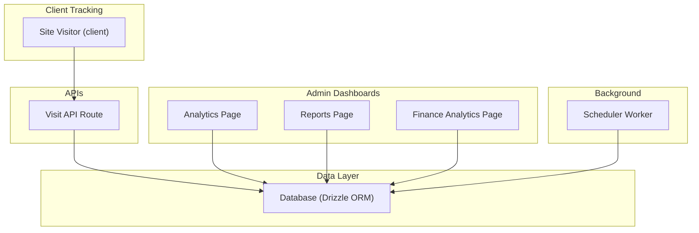
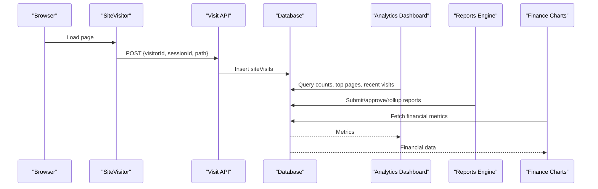
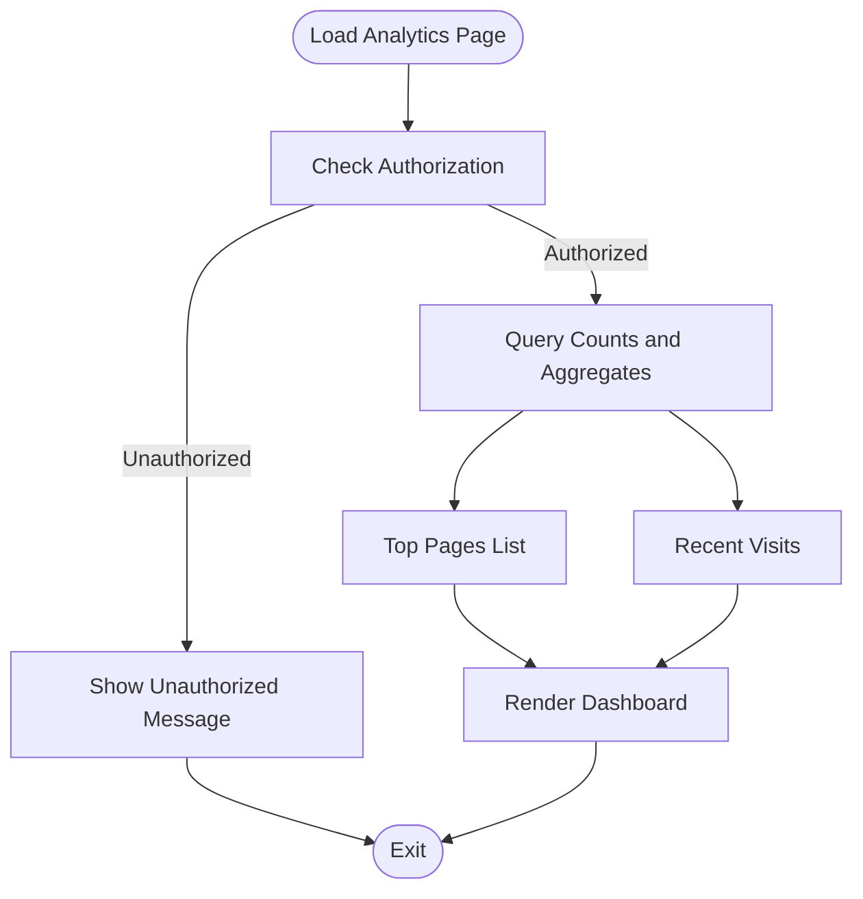
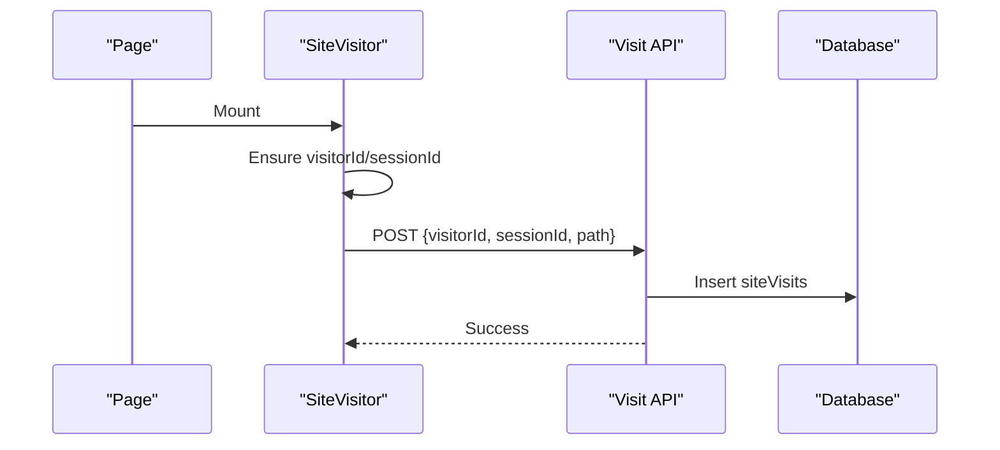
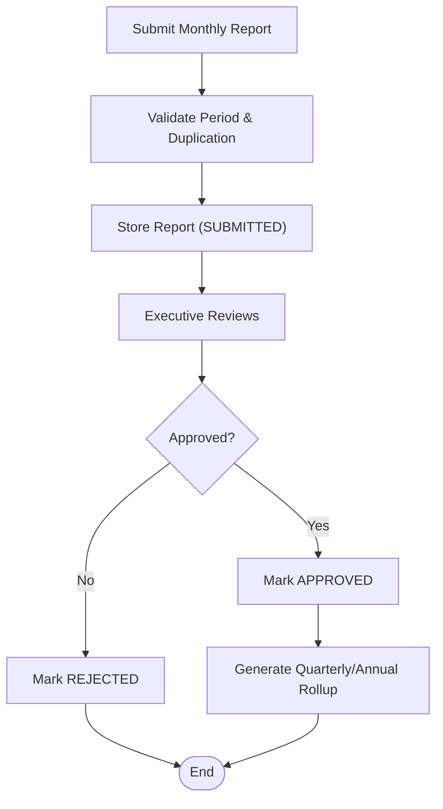
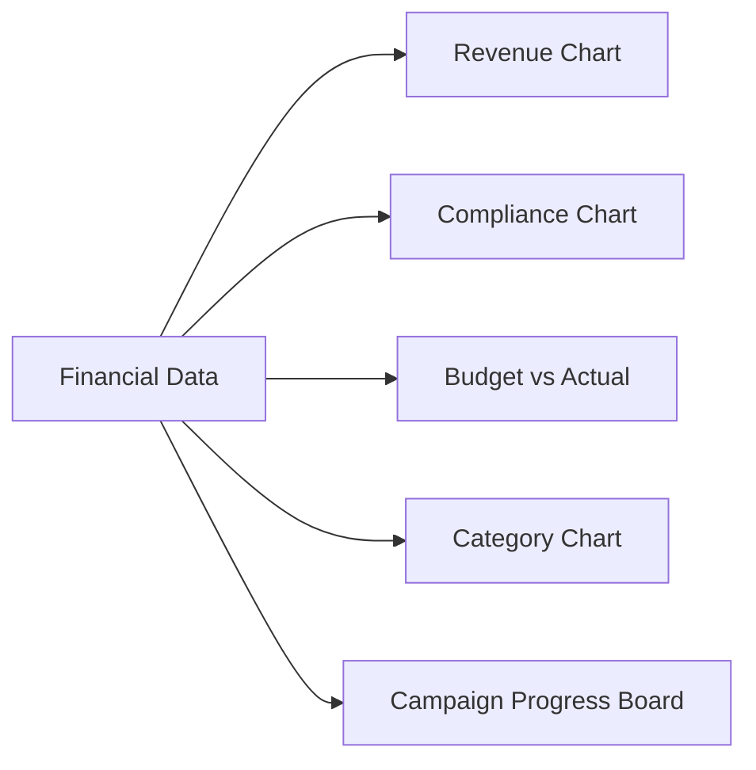
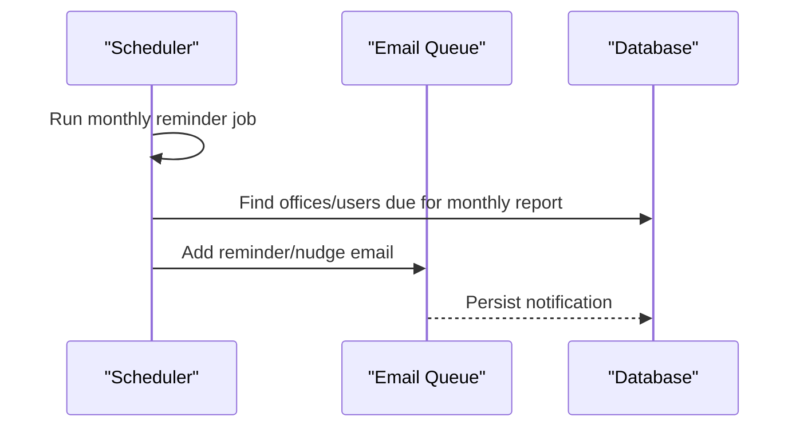
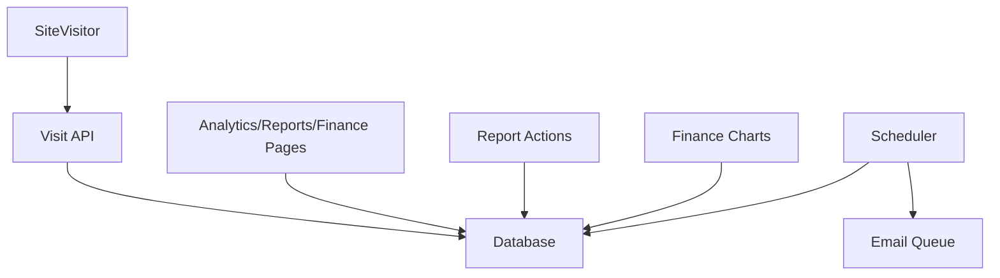

# Analytics & Reporting Tools

<cite>
**Referenced Files in This Document**
- [analytics page](file://app/dashboard/admin/analytics/page.tsx)
- [site visitor client](file://components/analytics/site-visitor.tsx)
- [visit API route](file://app/api/analytics/visit/route.ts)
- [reports page](file://app/dashboard/admin/reports/page.tsx)
- [report actions](file://lib/actions/reports.ts)
- [office rollup generator](file://components/admin/reports/office-rollup-generator.tsx)
- [finance analytics page](file://app/dashboard/admin/finance/analytics/page.tsx)
- [finance charts](file://components/admin/finance/finance-charts.tsx)
- [audit utilities](file://lib/audit.ts)
- [scheduler worker](file://workers/scheduler.ts)
</cite>

## Table of Contents
1. Introduction
2. Project Structure
3. Core Components
4. Architecture Overview
5. Detailed Component Analysis
6. Dependency Analysis
7. Performance Considerations
8. Troubleshooting Guide
9. Conclusion

## Introduction
This document explains the analytics and reporting tools in the TMC Portal. It covers:
- The analytics dashboard with real-time metrics, trend analysis, and customizable dashboards
- Report generation capabilities for monthly office reports, quarterly rollups, annual summaries, and financial analytics
- Data visualization components including charts, graphs, and interactive filters
- Examples for creating custom reports, scheduling report reminders, and exporting data
- The reporting engine, data aggregation processes, and caching strategies
- Data privacy considerations, access controls, and audit logging for report activities

## Project Structure
The analytics and reporting features are implemented across server-side pages, client components, API routes, and background workers:
- Server-rendered admin pages provide dashboards and report management
- Client components track site visits and render charts
- API routes persist analytics events
- A scheduler triggers periodic reminders and automated tasks
- Reusable chart components visualize financial and operational metrics

**Diagram sources**
- [analytics page](file://app/dashboard/admin/analytics/page.tsx)
- [site visitor client](file://components/analytics/site-visitor.tsx)
- [visit API route](file://app/api/analytics/visit/route.ts)
- [reports page](file://app/dashboard/admin/reports/page.tsx)
- [finance analytics page](file://app/dashboard/admin/finance/analytics/page.tsx)
- [scheduler worker](file://workers/scheduler.ts)

**Section sources**
- [analytics page](file://app/dashboard/admin/analytics/page.tsx)
- [site visitor client](file://components/analytics/site-visitor.tsx)
- [visit API route](file://app/api/analytics/visit/route.ts)
- [reports page](file://app/dashboard/admin/reports/page.tsx)
- [finance analytics page](file://app/dashboard/admin/finance/analytics/page.tsx)
- [scheduler worker](file://workers/scheduler.ts)

## Core Components
- Site visit tracking: a lightweight client component records page views and sessions, sending them to an API endpoint for persistence.
- Analytics dashboard: aggregates total page views, unique visitors, sessions, and views per session; lists top pages and recent activity.
- Reports system: supports monthly office reports, approvals workflow, and generated quarterly/annual rollups with coverage metrics.
- Financial analytics: displays revenue trends, compliance rates, budget utilization, category breakdowns, and campaign progress using reusable charts.
- Scheduler: runs periodic tasks including monthly report reminders and nudges for missing submissions.

**Section sources**
- [site visitor client](file://components/analytics/site-visitor.tsx)
- [visit API route](file://app/api/analytics/visit/route.ts)
- [analytics page](file://app/dashboard/admin/analytics/page.tsx)
- [reports page](file://app/dashboard/admin/reports/page.tsx)
- [report actions](file://lib/actions/reports.ts)
- [finance analytics page](file://app/dashboard/admin/finance/analytics/page.tsx)
- [finance charts](file://components/admin/finance/finance-charts.tsx)
- [scheduler worker](file://workers/scheduler.ts)

## Architecture Overview
The system combines server-rendered dashboards with client-side tracking and a robust reporting pipeline:
- Client tracks visits and sends events to the backend
- Admin dashboards query aggregated metrics from the database
- Reports are submitted, reviewed, approved, and rolled up into higher-level summaries
- Financial analytics aggregate payments, budgets, and campaigns into visual charts
- Scheduler automates reminders and maintenance tasks

**Diagram sources**
- [site visitor client](file://components/analytics/site-visitor.tsx)
- [visit API route](file://app/api/analytics/visit/route.ts)
- [analytics page](file://app/dashboard/admin/analytics/page.tsx)
- [report actions](file://lib/actions/reports.ts)
- [finance analytics page](file://app/dashboard/admin/finance/analytics/page.tsx)

## Detailed Component Analysis

### Analytics Dashboard
- Displays key metrics: total page views, unique visitors, total sessions, and views per session
- Shows top pages by visit count and recent activity with user context when available
- Enforces authorization for sensitive analytics visibility

**Diagram sources**
- [analytics page](file://app/dashboard/admin/analytics/page.tsx)

**Section sources**
- [analytics page](file://app/dashboard/admin/analytics/page.tsx)

### Site Visit Tracking
- Generates persistent visitor IDs and session IDs with timeouts
- Skips non-user paths like API routes and static assets
- Sends visit events asynchronously to avoid blocking page load

**Diagram sources**
- [site visitor client](file://components/analytics/site-visitor.tsx)
- [visit API route](file://app/api/analytics/visit/route.ts)

**Section sources**
- [site visitor client](file://components/analytics/site-visitor.tsx)
- [visit API route](file://app/api/analytics/visit/route.ts)

### Reports System
- Monthly Office Reports: submit, filter by period/office/jurisdiction, view auto-synced programmes/meetings
- Approvals Workflow: executives can approve pending reports
- Rollups: generate quarterly and annual reports aggregating monthly submissions with coverage stats
- Hierarchy-aware queries: include child organizations based on jurisdiction

**Diagram sources**
- [reports page](file://app/dashboard/admin/reports/page.tsx)
- [report actions](file://lib/actions/reports.ts)
- [office rollup generator](file://components/admin/reports/office-rollup-generator.tsx)

**Section sources**
- [reports page](file://app/dashboard/admin/reports/page.tsx)
- [report actions](file://lib/actions/reports.ts)
- [office rollup generator](file://components/admin/reports/office-rollup-generator.tsx)

### Financial Analytics
- KPIs: monthly revenue, compliance rate, budget utilization, active campaigns
- Visualizations: bar chart for revenue trends, pie chart for fee compliance, budget vs actual progress, category breakdown, campaign progress board
- Jurisdiction filtering to scope analytics by organization level

**Diagram sources**
- [finance analytics page](file://app/dashboard/admin/finance/analytics/page.tsx)
- [finance charts](file://components/admin/finance/finance-charts.tsx)

**Section sources**
- [finance analytics page](file://app/dashboard/admin/finance/analytics/page.tsx)
- [finance charts](file://components/admin/finance/finance-charts.tsx)

### Scheduled Reminders and Automation
- Weekly programme notifications and daily event reminders
- Monthly office report reminders on the 1st and nudges on the 5th for missing submissions
- Automated backups and other scheduled tasks

**Diagram sources**
- [scheduler worker](file://workers/scheduler.ts)

**Section sources**
- [scheduler worker](file://workers/scheduler.ts)

## Dependency Analysis
Key dependencies and relationships:
- Client tracking depends on Next.js navigation hooks and local storage
- API route depends on session handling and database insertion
- Reports depend on Drizzle ORM queries, hierarchy traversal, and revalidation
- Finance charts depend on Recharts for rendering responsive visuals
- Scheduler depends on cron jobs and email queue integration

**Diagram sources**
- [site visitor client](file://components/analytics/site-visitor.tsx)
- [visit API route](file://app/api/analytics/visit/route.ts)
- [reports page](file://app/dashboard/admin/reports/page.tsx)
- [report actions](file://lib/actions/reports.ts)
- [finance analytics page](file://app/dashboard/admin/finance/analytics/page.tsx)
- [finance charts](file://components/admin/finance/finance-charts.tsx)
- [scheduler worker](file://workers/scheduler.ts)

**Section sources**
- [site visitor client](file://components/analytics/site-visitor.tsx)
- [visit API route](file://app/api/analytics/visit/route.ts)
- [reports page](file://app/dashboard/admin/reports/page.tsx)
- [report actions](file://lib/actions/reports.ts)
- [finance analytics page](file://app/dashboard/admin/finance/analytics/page.tsx)
- [finance charts](file://components/admin/finance/finance-charts.tsx)
- [scheduler worker](file://workers/scheduler.ts)

## Performance Considerations
- Asynchronous tracking: site visit recording is delayed to avoid blocking critical rendering
- Efficient queries: analytics dashboard uses grouped and ordered queries to minimize overhead
- Revalidation: report actions trigger targeted path revalidations to keep UI fresh without full reloads
- Hierarchical aggregation: rollups compute coverage and counts efficiently using in-memory maps
- Chart rendering: finance charts guard against hydration mismatches and use responsive containers

[No sources needed since this section provides general guidance]

## Troubleshooting Guide
Common issues and resolutions:
- Analytics not updating: verify that the client component is mounted and not skipping tracked paths; check the visit API response and database inserts
- Unauthorized access to analytics: ensure the user has appropriate roles or super-admin privileges
- Duplicate monthly reports: the system prevents duplicate submissions per office and period; adjust period or office selection
- Missing rollups: ensure sufficient monthly reports exist for the selected quarter/year; check coverage percentage
- Audit logs: confirm that audit logging utility is invoked for report actions and that the audit table exists

**Section sources**
- [site visitor client](file://components/analytics/site-visitor.tsx)
- [visit API route](file://app/api/analytics/visit/route.ts)
- [analytics page](file://app/dashboard/admin/analytics/page.tsx)
- [report actions](file://lib/actions/reports.ts)
- [audit utilities](file://lib/audit.ts)

## Conclusion
The TMC Portal’s analytics and reporting suite provides:
- Real-time site analytics with clear metrics and activity insights
- A comprehensive reporting pipeline supporting monthly submissions, approvals, and hierarchical rollups
- Rich financial analytics with interactive charts and jurisdiction-based filtering
- Automated scheduling for reminders and maintenance tasks
- Robust access controls and audit logging to ensure data integrity and compliance

[No sources needed since this section summarizes without analyzing specific files]