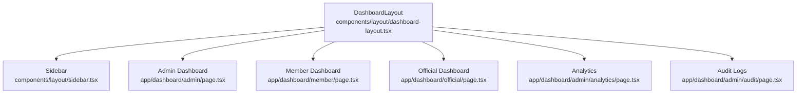
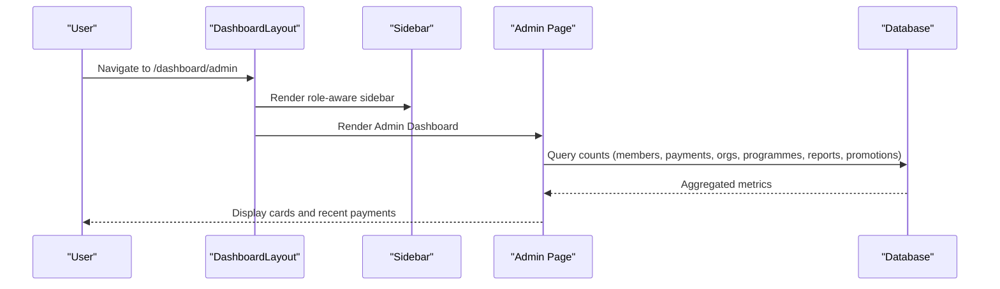
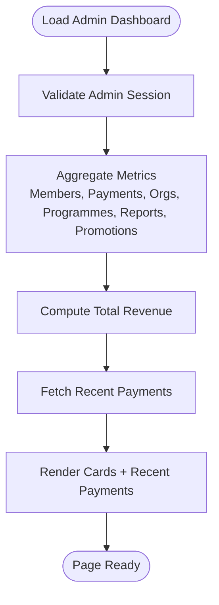
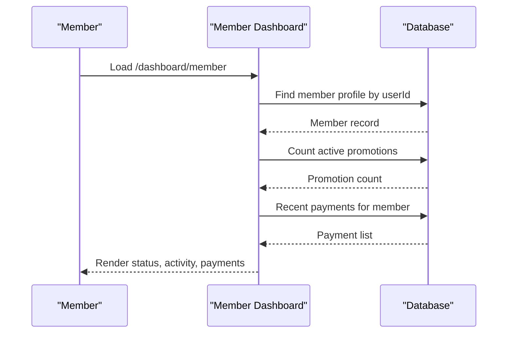
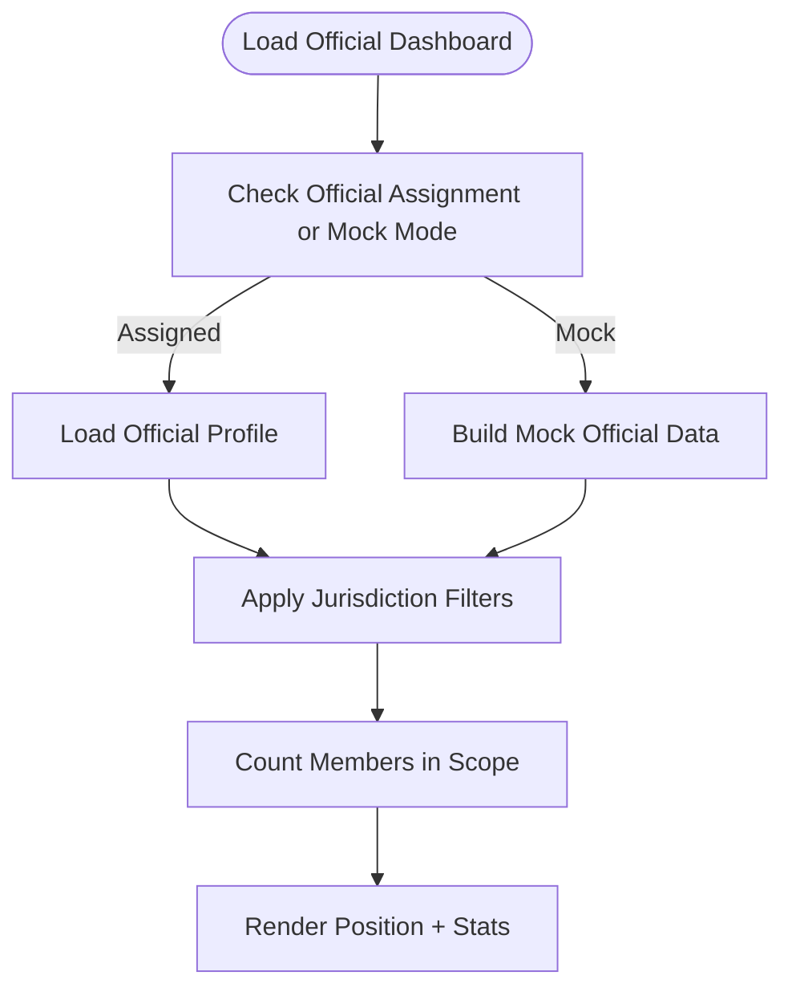
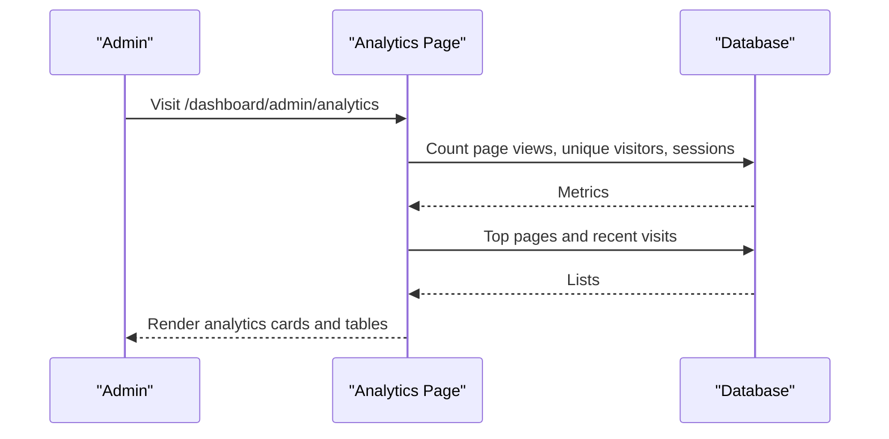
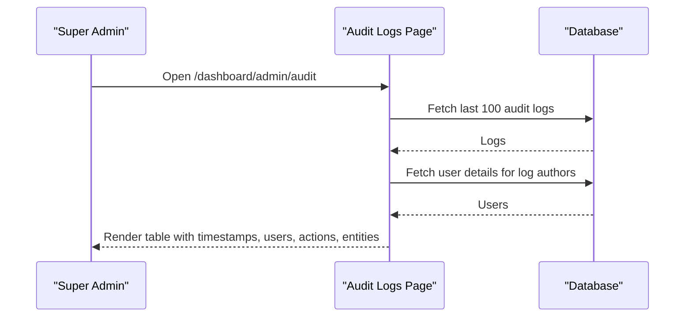
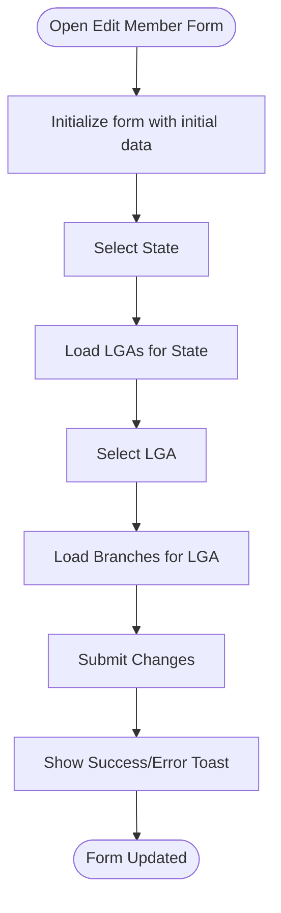
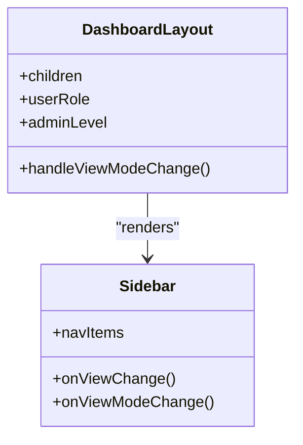
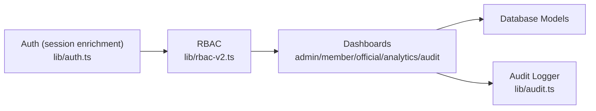

# Dashboard & Administration

<cite>
**Referenced Files in This Document**
- [dashboard-layout.tsx](file://components/layout/dashboard-layout.tsx)
- [sidebar.tsx](file://components/layout/sidebar.tsx)
- [admin page.tsx](file://app/dashboard/admin/page.tsx)
- [member page.tsx](file://app/dashboard/member/page.tsx)
- [official page.tsx](file://app/dashboard/official/page.tsx)
- [analytics page.tsx](file://app/dashboard/admin/analytics/page.tsx)
- [audit page.tsx](file://app/dashboard/admin/audit/page.tsx)
- [edit-member-form.tsx](file://components/admin/users/edit-member-form.tsx)
- [rbac-v2.ts](file://lib/rbac-v2.ts)
- [auth.ts](file://lib/auth.ts)
- [audit.ts](file://lib/audit.ts)
- [health route.ts](file://app/api/health/route.ts)
</cite>

## Table of Contents
1. Introduction
2. Project Structure
3. Core Components
4. Architecture Overview
5. Detailed Component Analysis
6. Dependency Analysis
7. Performance Considerations
8. Troubleshooting Guide
9. Conclusion

## Introduction
This document explains the TMC Portal dashboard and administration interface with a focus on role-based navigation, dashboards for administrators and members, administrative tools, analytics, audit logging, and system health monitoring. It also covers how to extend dashboards with custom widgets, implement admin workflows, and build role-specific interfaces.

## Project Structure
The dashboard experience is built around a shared layout that renders a sidebar and content area. Role-based navigation drives which menu items are visible. Dedicated pages provide:
- Admin dashboard with key metrics and recent activity
- Member dashboard with membership status and personal activity
- Official dashboard scoped by jurisdiction
- Analytics and audit logs for administrators

**Diagram sources**
- [dashboard-layout.tsx:14-155](file://components/layout/dashboard-layout.tsx#L14-L155)
- [sidebar.tsx:54-184](file://components/layout/sidebar.tsx#L54-L184)
- [admin page.tsx:14-179](file://app/dashboard/admin/page.tsx#L14-L179)
- [member page.tsx:19-229](file://app/dashboard/member/page.tsx#L19-L229)
- [official page.tsx:17-139](file://app/dashboard/official/page.tsx#L17-L139)
- [analytics page.tsx:12-160](file://app/dashboard/admin/analytics/page.tsx#L12-L160)
- [audit page.tsx:13-129](file://app/dashboard/admin/audit/page.tsx#L13-L129)

**Section sources**
- [dashboard-layout.tsx:14-155](file://components/layout/dashboard-layout.tsx#L14-L155)
- [sidebar.tsx:54-184](file://components/layout/sidebar.tsx#L54-L184)

## Core Components
- DashboardLayout: Provides responsive shell, mobile header, desktop sidebar, notification bell, AI chat widget, impersonation/view-as banners, and role override controls persisted in localStorage and cookies.
- Sidebar: Renders role-based navigation (admin, official, council, member), supports “View As” mode for admins to simulate different roles and jurisdictions, and persists selection across sessions.
- RBAC: Centralized permission and role checks, including jurisdiction-aware access control and session-based helpers.
- Auth: Populates session with roles, permissions, member/official profiles, and supports impersonation flows.

Key behaviors:
- Role detection uses session data to determine base role; admins can override via UI.
- Jurisdictional scoping influences both navigation visibility and data queries.
- Session includes roles, permissions, and profile flags used throughout dashboards.

**Section sources**
- [dashboard-layout.tsx:14-95](file://components/layout/dashboard-layout.tsx#L14-L95)
- [sidebar.tsx:153-184](file://components/layout/sidebar.tsx#L153-L184)
- [rbac-v2.ts:47-165](file://lib/rbac-v2.ts#L47-L165)
- [auth.ts:33-129](file://lib/auth.ts#L33-L129)

## Architecture Overview
The dashboard architecture combines Next.js server components for data fetching and client components for interactive UI. Role-based routing and authorization gate features. Dashboards query database models directly and present summarized metrics.

**Diagram sources**
- [dashboard-layout.tsx:14-155](file://components/layout/dashboard-layout.tsx#L14-L155)
- [sidebar.tsx:54-184](file://components/layout/sidebar.tsx#L54-L184)
- [admin page.tsx:31-69](file://app/dashboard/admin/page.tsx#L31-L69)

## Detailed Component Analysis

### Admin Dashboard
- Purpose: High-level overview of organization health and pending actions.
- Data: Counts for members, successful payments, organizations, pending programme vetting, pending reports, late submissions, pending promotions; total revenue; recent payments list.
- Authorization: Requires admin privileges via session checks.
- Layout: Uses DashboardLayout; displays metric cards and a recent payments table.

**Diagram sources**
- [admin page.tsx:14-69](file://app/dashboard/admin/page.tsx#L14-L69)
- [admin page.tsx:71-179](file://app/dashboard/admin/page.tsx#L71-L179)

**Section sources**
- [admin page.tsx:14-179](file://app/dashboard/admin/page.tsx#L14-L179)

### Member Dashboard
- Purpose: Personalized view for members showing membership status, activity summary, and payment history.
- Data: Membership record, active promotions count, recent payments.
- Behavior: Guides non-members to apply; shows status badges and links to relevant sections.

**Diagram sources**
- [member page.tsx:19-69](file://app/dashboard/member/page.tsx#L19-L69)
- [member page.tsx:73-229](file://app/dashboard/member/page.tsx#L73-L229)

**Section sources**
- [member page.tsx:19-229](file://app/dashboard/member/page.tsx#L19-L229)

### Official Dashboard
- Purpose: Jurisdiction-scoped overview for officials, showing position info and member counts within their scope.
- Data: Official profile, organization details, jurisdiction-aware member counts. Supports mock jurisdiction for super admins.

**Diagram sources**
- [official page.tsx:17-85](file://app/dashboard/official/page.tsx#L17-L85)
- [official page.tsx:87-139](file://app/dashboard/official/page.tsx#L87-L139)

**Section sources**
- [official page.tsx:17-139](file://app/dashboard/official/page.tsx#L17-L139)

### Analytics Dashboard
- Purpose: Site-wide traffic insights for authorized users.
- Data: Total page views, unique visitors, total sessions, views per session, top pages, recent visits.
- Authorization: Restricted to super admins or specific national roles.

**Diagram sources**
- [analytics page.tsx:12-68](file://app/dashboard/admin/analytics/page.tsx#L12-L68)
- [analytics page.tsx:70-160](file://app/dashboard/admin/analytics/page.tsx#L70-L160)

**Section sources**
- [analytics page.tsx:12-160](file://app/dashboard/admin/analytics/page.tsx#L12-L160)

### Audit Logs
- Purpose: View recent administrative actions with user context.
- Data: Last 100 audit log entries joined with user information.
- Authorization: Limited to super admins.

**Diagram sources**
- [audit page.tsx:13-47](file://app/dashboard/admin/audit/page.tsx#L13-L47)
- [audit page.tsx:49-129](file://app/dashboard/admin/audit/page.tsx#L49-L129)

**Section sources**
- [audit page.tsx:13-129](file://app/dashboard/admin/audit/page.tsx#L13-L129)

### User Management Form
- Purpose: Edit member details with validation and cascading location selects (state → LGA → branch).
- Behavior: Submits updates via action, shows success/error toasts, and disables fields based on selections.

**Diagram sources**
- [edit-member-form.tsx:42-72](file://components/admin/users/edit-member-form.tsx#L42-L72)
- [edit-member-form.tsx:74-268](file://components/admin/users/edit-member-form.tsx#L74-L268)

**Section sources**
- [edit-member-form.tsx:42-268](file://components/admin/users/edit-member-form.tsx#L42-L268)

### Role-Based Navigation and View Modes
- The sidebar defines navigation sets per role and filters items based on admin level and jurisdiction.
- Admins can switch between “View As” modes (admin, official, council, member) and persist the choice locally; official mode may require selecting a jurisdiction via a dialog.

**Diagram sources**
- [dashboard-layout.tsx:14-95](file://components/layout/dashboard-layout.tsx#L14-L95)
- [sidebar.tsx:153-202](file://components/layout/sidebar.tsx#L153-L202)

**Section sources**
- [sidebar.tsx:54-184](file://components/layout/sidebar.tsx#L54-L184)
- [dashboard-layout.tsx:14-95](file://components/layout/dashboard-layout.tsx#L14-L95)

## Dependency Analysis
- Authentication and session enrichment populate roles, permissions, and profile data into the session for use across dashboards.
- RBAC provides permission checks and jurisdiction-aware access control.
- Dashboards depend on database schema models for metrics and lists.
- Audit logging utility writes immutable records for compliance and troubleshooting.

**Diagram sources**
- [auth.ts:33-129](file://lib/auth.ts#L33-L129)
- [rbac-v2.ts:47-165](file://lib/rbac-v2.ts#L47-L165)
- [audit.ts:17-34](file://lib/audit.ts#L17-L34)

**Section sources**
- [auth.ts:33-129](file://lib/auth.ts#L33-L129)
- [rbac-v2.ts:47-165](file://lib/rbac-v2.ts#L47-L165)
- [audit.ts:17-34](file://lib/audit.ts#L17-L34)

## Performance Considerations
- Use server-side aggregation for dashboard metrics to minimize client load and reduce round trips.
- Limit result sets (e.g., recent payments, top pages, last 100 audit logs) to keep pages fast.
- Prefer indexed columns for frequent filters (organizationId, status, createdAt) when scaling.
- Cache static configuration and frequently read settings at the edge or application layer where appropriate.
- For large datasets, consider pagination and incremental loading for lists and charts.

[No sources needed since this section provides general guidance]

## Troubleshooting Guide
- Unauthorized access: Ensure session contains required roles/permissions; verify jurisdiction constraints.
- Missing data: Confirm database connections and model relationships; check filters applied in queries.
- Audit logs not appearing: Verify audit logger calls succeed; errors are logged but do not break flows.
- Health check: Use the health endpoint to confirm service availability.

**Section sources**
- [rbac-v2.ts:313-358](file://lib/rbac-v2.ts#L313-L358)
- [audit.ts:17-34](file://lib/audit.ts#L17-L34)
- [health route.ts:3-5](file://app/api/health/route.ts#L3-L5)

## Conclusion
The TMC Portal dashboard provides a robust, role-aware interface for administrators and members. It leverages a shared layout, dynamic sidebar navigation, and server-side data aggregation to deliver actionable insights. Administrative capabilities include user management, analytics, audit logging, and system health checks. The design supports extensibility for custom widgets and role-specific workflows while maintaining clear separation of concerns and strong authorization controls.