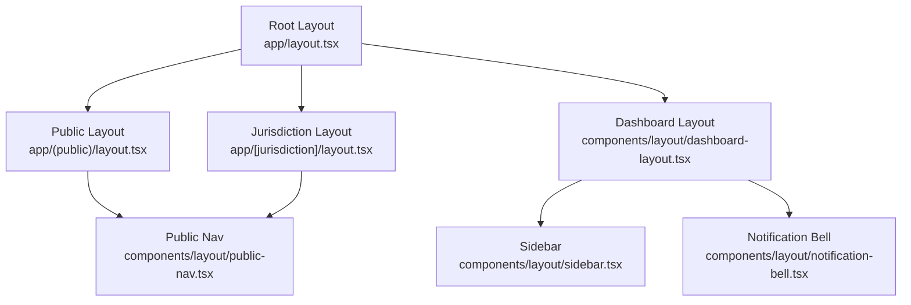
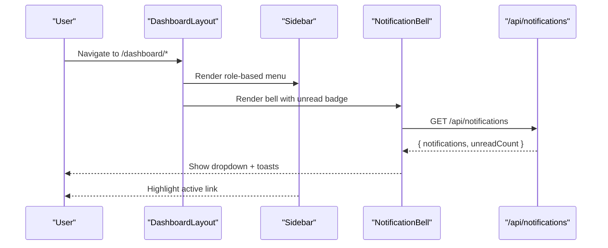
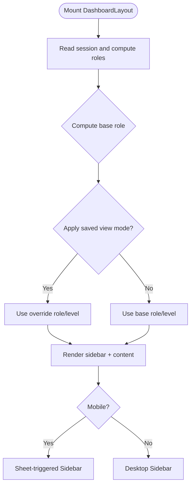
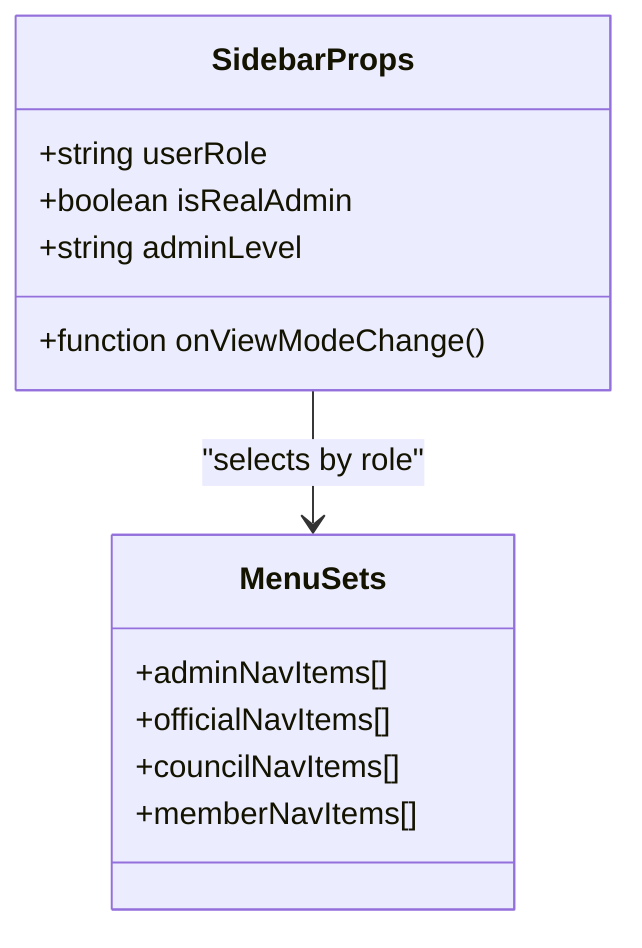
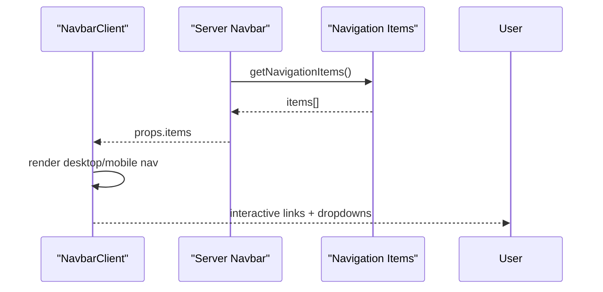
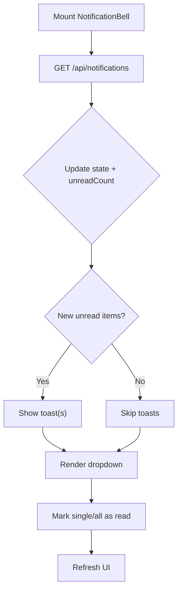
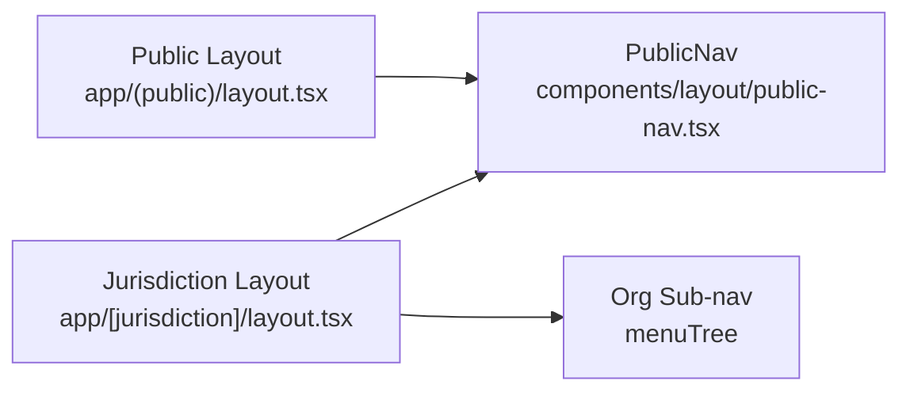
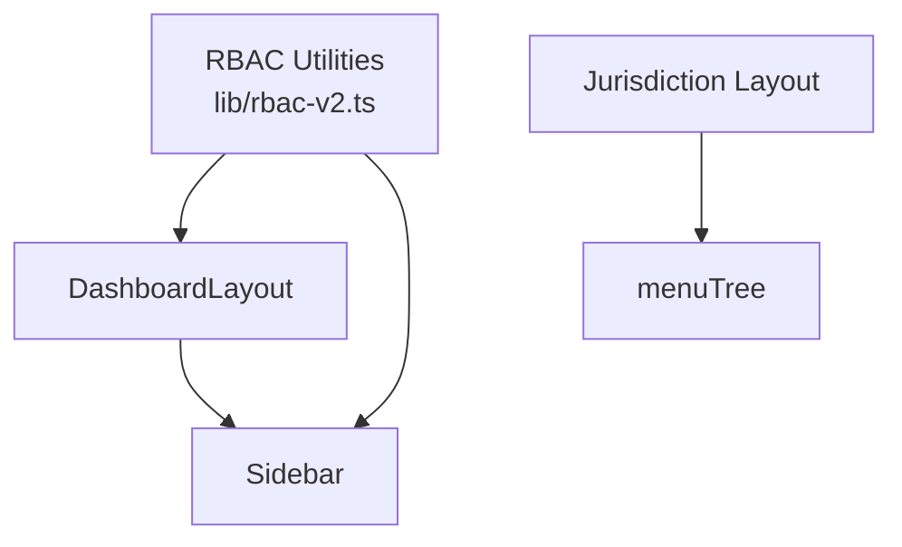

# Dashboard Layout & Navigation

<cite>
**Referenced Files in This Document**
- [app/layout.tsx](file://app/layout.tsx)
- [components/layout/dashboard-layout.tsx](file://components/layout/dashboard-layout.tsx)
- [components/layout/sidebar.tsx](file://components/layout/sidebar.tsx)
- [components/layout/navbar.tsx](file://components/layout/navbar.tsx)
- [components/layout/navbar-client.tsx](file://components/layout/navbar-client.tsx)
- [components/layout/notification-bell.tsx](file://components/layout/notification-bell.tsx)
- [components/layout/public-nav.tsx](file://components/layout/public-nav.tsx)
- [components/theme-provider.tsx](file://components/theme-provider.tsx)
- [lib/rbac-v2.ts](file://lib/rbac-v2.ts)
- [app/(public)/layout.tsx](file://app/(public)/layout.tsx)
- [app/[jurisdiction]/layout.tsx](file://app/[jurisdiction]/layout.tsx)
</cite>

## Table of Contents
1. Introduction
2. Project Structure
3. Core Components
4. Architecture Overview
5. Detailed Component Analysis
6. Dependency Analysis
7. Performance Considerations
8. Troubleshooting Guide
9. Conclusion

## Introduction
This document explains the TMC Portal dashboard layout and navigation system with a focus on responsive architecture, role-based navigation, dynamic sidebar generation, adaptive layouts, and theme integration. It covers the navbar component (user context, notifications, quick actions), the sidebar implementation (hierarchical menu structures, permission-based visibility, mobile-responsive design), and the layout provider system. It also includes guidance for creating custom dashboard layouts, implementing role-specific navigation, building responsive interfaces, and optimizing performance through lazy loading, code splitting, and efficient re-rendering strategies.

## Project Structure
The portal uses Next.js App Router with layered layouts:
- Root layout provides global providers, metadata, and site-wide elements.
- Public layout wraps public routes with a consistent header and main area.
- Jurisdiction layout adds organization-specific sub-navigation and content.
- Dashboard layout composes the authenticated shell with sidebar, notification bell, and content area.

**Diagram sources**
- [app/layout.tsx:20-63](file://app/layout.tsx#L20-L63)
- [app/(public)/layout.tsx:1-17](file://app/(public)/layout.tsx#L1-L17)
- [app/[jurisdiction]/layout.tsx:12-110](file://app/[jurisdiction]/layout.tsx#L12-L110)
- [components/layout/dashboard-layout.tsx:14-157](file://components/layout/dashboard-layout.tsx#L14-L157)
- [components/layout/sidebar.tsx:153-326](file://components/layout/sidebar.tsx#L153-L326)
- [components/layout/notification-bell.tsx:20-173](file://components/layout/notification-bell.tsx#L20-L173)
- [components/layout/public-nav.tsx:30-340](file://components/layout/public-nav.tsx#L30-L340)

**Section sources**
- [app/layout.tsx:20-63](file://app/layout.tsx#L20-L63)
- [app/(public)/layout.tsx:1-17](file://app/(public)/layout.tsx#L1-L17)
- [app/[jurisdiction]/layout.tsx:12-110](file://app/[jurisdiction]/layout.tsx#L12-L110)

## Core Components
- DashboardLayout: Authenticated shell that renders a desktop sidebar, mobile sheet-based sidebar, notification bell, impersonation/view-as banners, and page content. It determines user roles and admin levels from session data and supports view mode overrides for testing.
- Sidebar: Role-aware navigation with static arrays per role, filtered by jurisdiction and permissions. Includes “View As” controls for admins to simulate different roles/levels and jurisdictional contexts.
- Navbar and NavbarClient: Server-fetched navigation items with client-side rendering for dropdowns and mobile menus; adapts links based on authentication state.
- NotificationBell: Polls server for notifications, shows unread count, marks items as read, and triggers toasts for new items.
- PublicNav: Public-facing sticky navigation with dropdowns, mobile sheet, and auth-aware actions.
- ThemeProvider: Wraps app with next-themes for theme/color switching.

**Section sources**
- [components/layout/dashboard-layout.tsx:14-157](file://components/layout/dashboard-layout.tsx#L14-L157)
- [components/layout/sidebar.tsx:54-151](file://components/layout/sidebar.tsx#L54-L151)
- [components/layout/sidebar.tsx:153-326](file://components/layout/sidebar.tsx#L153-L326)
- [components/layout/navbar.tsx:5-18](file://components/layout/navbar.tsx#L5-L18)
- [components/layout/navbar-client.tsx:20-169](file://components/layout/navbar-client.tsx#L20-L169)
- [components/layout/notification-bell.tsx:20-173](file://components/layout/notification-bell.tsx#L20-L173)
- [components/layout/public-nav.tsx:30-340](file://components/layout/public-nav.tsx#L30-L340)
- [components/theme-provider.tsx:1-12](file://components/theme-provider.tsx#L1-L12)

## Architecture Overview
The dashboard is a responsive, role-aware application shell:
- Root layout initializes providers and global UI.
- Dashboard layout composes sidebar + content, with mobile-first behavior using sheets.
- Sidebar selects menu sets based on role and filters items by jurisdiction and permissions.
- Notifications are polled and surfaced via a dropdown with toast support.
- Public routes use a separate layout with a unified public nav and optional org-specific sub-navigation.

**Diagram sources**
- [components/layout/dashboard-layout.tsx:14-157](file://components/layout/dashboard-layout.tsx#L14-L157)
- [components/layout/sidebar.tsx:153-326](file://components/layout/sidebar.tsx#L153-L326)
- [components/layout/notification-bell.tsx:28-81](file://components/layout/notification-bell.tsx#L28-L81)

## Detailed Component Analysis

### DashboardLayout
Responsibilities:
- Determines base user role from session and supports view mode overrides persisted in localStorage and cookies.
- Renders desktop sidebar and mobile sheet-based sidebar.
- Shows impersonation and view-as banners when active.
- Provides a responsive content container with top-level notification access on mobile.

Key behaviors:
- Role resolution: admin, council, official, member.
- Admin level resolution: super/national/state/local/branch.
- View mode change persists mode and level, then reloads to apply server-side mocking.

**Diagram sources**
- [components/layout/dashboard-layout.tsx:14-95](file://components/layout/dashboard-layout.tsx#L14-L95)
- [components/layout/dashboard-layout.tsx:97-157](file://components/layout/dashboard-layout.tsx#L97-L157)

**Section sources**
- [components/layout/dashboard-layout.tsx:14-157](file://components/layout/dashboard-layout.tsx#L14-L157)

### Sidebar
Responsibilities:
- Presents hierarchical menu sets per role (admin, official, council, member).
- Filters items by jurisdiction and special flags (e.g., jurisdiction-head-only).
- Provides “View As” controls for admins to simulate different roles and levels, including jurisdiction selection via dialog.

Implementation highlights:
- Static menu arrays per role with icons and labels.
- Filtering logic for official and admin views based on adminLevel and isRealAdmin.
- Mock jurisdiction dialog integration for precise simulation.

**Diagram sources**
- [components/layout/sidebar.tsx:44-49](file://components/layout/sidebar.tsx#L44-L49)
- [components/layout/sidebar.tsx:54-151](file://components/layout/sidebar.tsx#L54-L151)
- [components/layout/sidebar.tsx:153-326](file://components/layout/sidebar.tsx#L153-L326)

**Section sources**
- [components/layout/sidebar.tsx:54-151](file://components/layout/sidebar.tsx#L54-L151)
- [components/layout/sidebar.tsx:153-326](file://components/layout/sidebar.tsx#L153-L326)

### Navbar and NavbarClient
Responsibilities:
- Server component fetches navigation items from DB or falls back to defaults.
- Client component renders desktop and mobile navigation, handling dropdowns and auth-aware links.

Behavior:
- If no session, “Dashboard” becomes “Sign In”.
- Mobile menu uses a sheet with accessible title and close-on-navigate behavior.

**Diagram sources**
- [components/layout/navbar.tsx:5-18](file://components/layout/navbar.tsx#L5-L18)
- [components/layout/navbar-client.tsx:20-169](file://components/layout/navbar-client.tsx#L20-L169)

**Section sources**
- [components/layout/navbar.tsx:5-18](file://components/layout/navbar.tsx#L5-L18)
- [components/layout/navbar-client.tsx:20-169](file://components/layout/navbar-client.tsx#L20-L169)

### NotificationBell
Responsibilities:
- Polls notifications endpoint periodically.
- Displays unread count badge and dropdown list.
- Marks individual or all notifications as read.
- Shows toasts for new unread notifications on initial load and subsequent updates.

**Diagram sources**
- [components/layout/notification-bell.tsx:28-81](file://components/layout/notification-bell.tsx#L28-L81)
- [components/layout/notification-bell.tsx:83-113](file://components/layout/notification-bell.tsx#L83-L113)
- [components/layout/notification-bell.tsx:115-173](file://components/layout/notification-bell.tsx#L115-L173)

**Section sources**
- [components/layout/notification-bell.tsx:20-173](file://components/layout/notification-bell.tsx#L20-L173)

### PublicNav and Public Layouts
Responsibilities:
- PublicNav provides a sticky header with logo, primary links, About dropdown, and auth-aware actions.
- Public layout wraps pages with PublicNav and main content.
- Jurisdiction layout loads organization-specific navigation tree and renders a sub-nav bar.

**Diagram sources**
- [app/(public)/layout.tsx:1-17](file://app/(public)/layout.tsx#L1-L17)
- [components/layout/public-nav.tsx:30-340](file://components/layout/public-nav.tsx#L30-L340)
- [app/[jurisdiction]/layout.tsx:12-110](file://app/[jurisdiction]/layout.tsx#L12-L110)

**Section sources**
- [app/(public)/layout.tsx:1-17](file://app/(public)/layout.tsx#L1-L17)
- [components/layout/public-nav.tsx:30-340](file://components/layout/public-nav.tsx#L30-L340)
- [app/[jurisdiction]/layout.tsx:12-110](file://app/[jurisdiction]/layout.tsx#L12-L110)

### Theme Integration
- ThemeProvider wraps the app to enable theme and color switching via next-themes.
- Sidebar exposes theme toggle and color switcher components for end-user customization.

**Section sources**
- [components/theme-provider.tsx:1-12](file://components/theme-provider.tsx#L1-L12)
- [components/layout/sidebar.tsx:300-307](file://components/layout/sidebar.tsx#L300-L307)

## Dependency Analysis
Role-based visibility and permissions:
- RBAC utilities provide functions to retrieve user roles, permissions, and jurisdictional access.
- DashboardLayout computes role and admin level from session; Sidebar filters menu items based on these values and specific flags.
- Jurisdiction layout builds a hierarchical menu from database-driven navigation items.

**Diagram sources**
- [lib/rbac-v2.ts:47-136](file://lib/rbac-v2.ts#L47-L136)
- [lib/rbac-v2.ts:141-165](file://lib/rbac-v2.ts#L141-L165)
- [components/layout/dashboard-layout.tsx:47-67](file://components/layout/dashboard-layout.tsx#L47-L67)
- [components/layout/sidebar.tsx:153-184](file://components/layout/sidebar.tsx#L153-L184)
- [app/[jurisdiction]/layout.tsx:30-42](file://app/[jurisdiction]/layout.tsx#L30-L42)

**Section sources**
- [lib/rbac-v2.ts:47-136](file://lib/rbac-v2.ts#L47-L136)
- [lib/rbac-v2.ts:141-165](file://lib/rbac-v2.ts#L141-L165)
- [components/layout/dashboard-layout.tsx:47-67](file://components/layout/dashboard-layout.tsx#L47-L67)
- [components/layout/sidebar.tsx:153-184](file://components/layout/sidebar.tsx#L153-L184)
- [app/[jurisdiction]/layout.tsx:30-42](file://app/[jurisdiction]/layout.tsx#L30-L42)

## Performance Considerations
- Lazy initialization and hydration control:
  - Use mounted flags to defer client-only features until after hydration to avoid hydration mismatches and reduce initial paint cost.
- Efficient polling:
  - NotificationBell polls at a reasonable interval and avoids duplicate toasts using an in-memory set of IDs.
- Code splitting and route-based chunks:
  - Leverage Next.js App Router file-based routing to split code per route and feature.
- Conditional rendering:
  - Hide heavy components until necessary (e.g., banners, sidebar on mobile via sheet).
- Local storage and cookies:
  - Persist lightweight view mode state to avoid unnecessary server calls during development/testing.

[No sources needed since this section provides general guidance]

## Troubleshooting Guide
Common issues and resolutions:
- Notifications not updating:
  - Ensure the backend endpoint returns correct structure and that polling is active. Check network tab for errors.
- Unread badge not clearing:
  - Verify markAsRead and markAllAsRead calls succeed and update local state.
- Sidebar not reflecting role changes:
  - Confirm role computation in DashboardLayout and filtering logic in Sidebar. For officials, check jurisdiction-head-only flags and admin level.
- View As mode stuck:
  - Clear localStorage and cookies for mock mode and reload. Validate safety checks that prevent non-admins from retaining overrides.
- Public nav dropdowns not closing:
  - Ensure click-outside handlers are attached and event listeners are cleaned up.

**Section sources**
- [components/layout/notification-bell.tsx:28-81](file://components/layout/notification-bell.tsx#L28-L81)
- [components/layout/notification-bell.tsx:83-113](file://components/layout/notification-bell.tsx#L83-L113)
- [components/layout/dashboard-layout.tsx:21-45](file://components/layout/dashboard-layout.tsx#L21-L45)
- [components/layout/sidebar.tsx:165-184](file://components/layout/sidebar.tsx#L165-L184)
- [components/layout/public-nav.tsx:41-50](file://components/layout/public-nav.tsx#L41-L50)

## Conclusion
The TMC Portal’s dashboard layout and navigation system combines a robust root layout strategy with role-aware, responsive components. The dashboard layout orchestrates sidebar and notification features, while the sidebar dynamically generates menus based on role and jurisdiction. Public layouts provide a consistent experience across the site with organization-specific enhancements. Theme integration and accessibility considerations ensure a polished user experience. Performance optimizations such as lazy initialization, controlled polling, and route-based code splitting contribute to a responsive interface.

[No sources needed since this section summarizes without analyzing specific files]