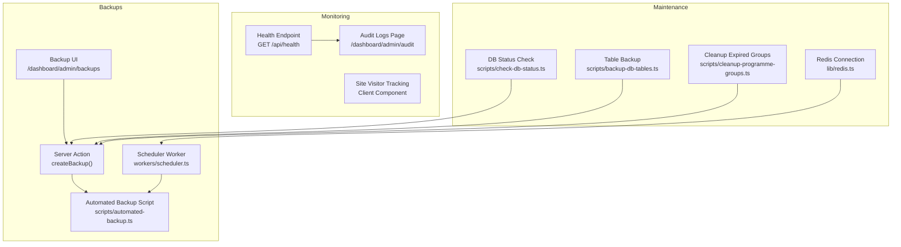
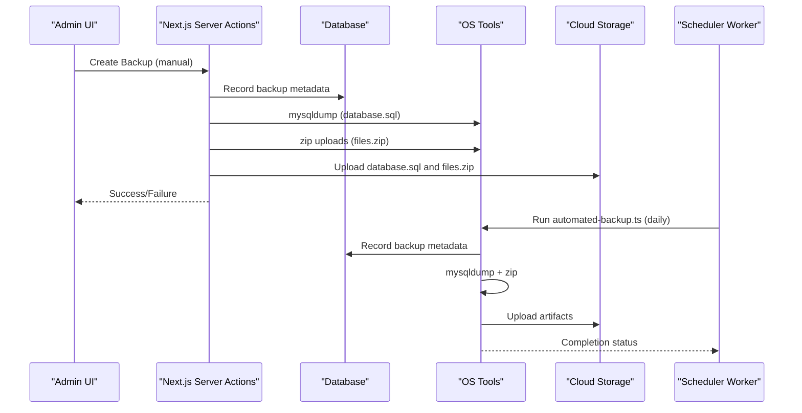
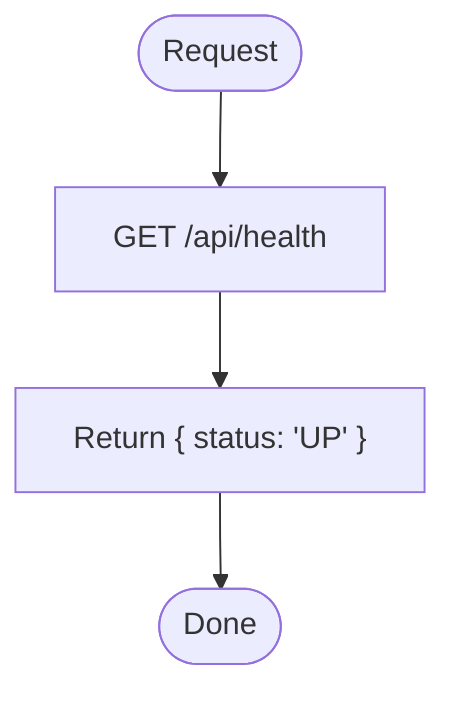
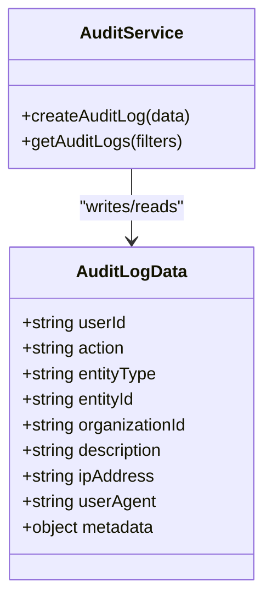
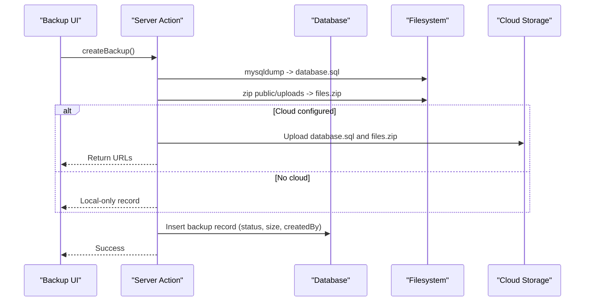
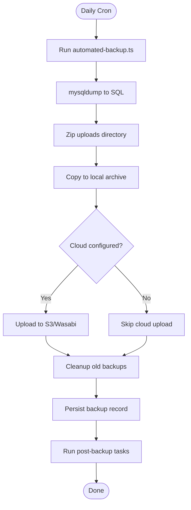
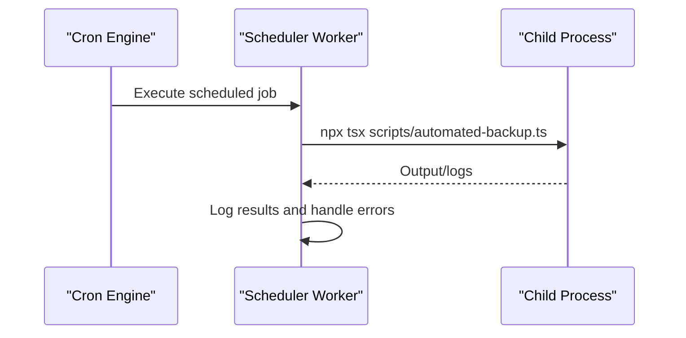
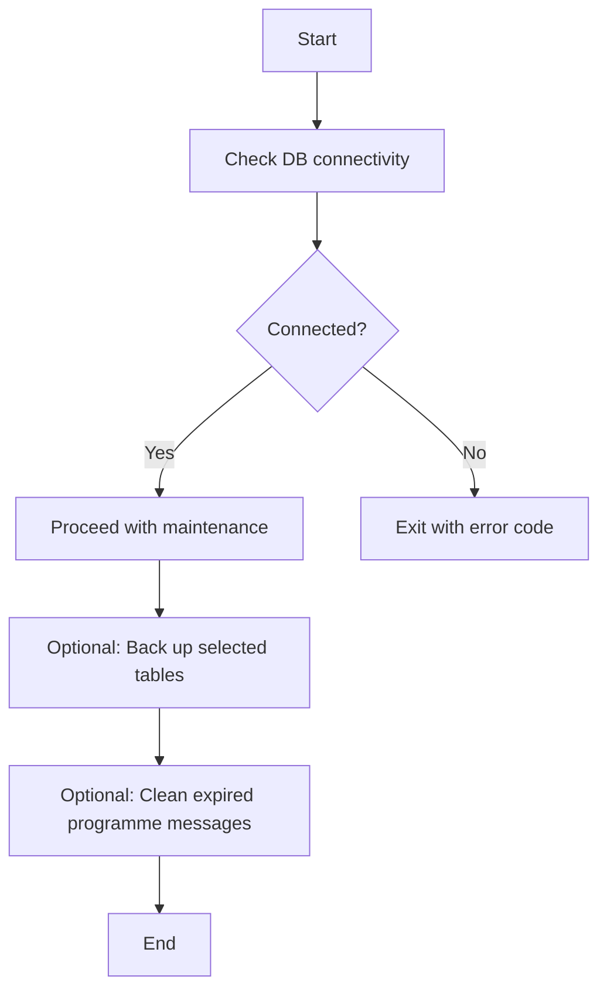
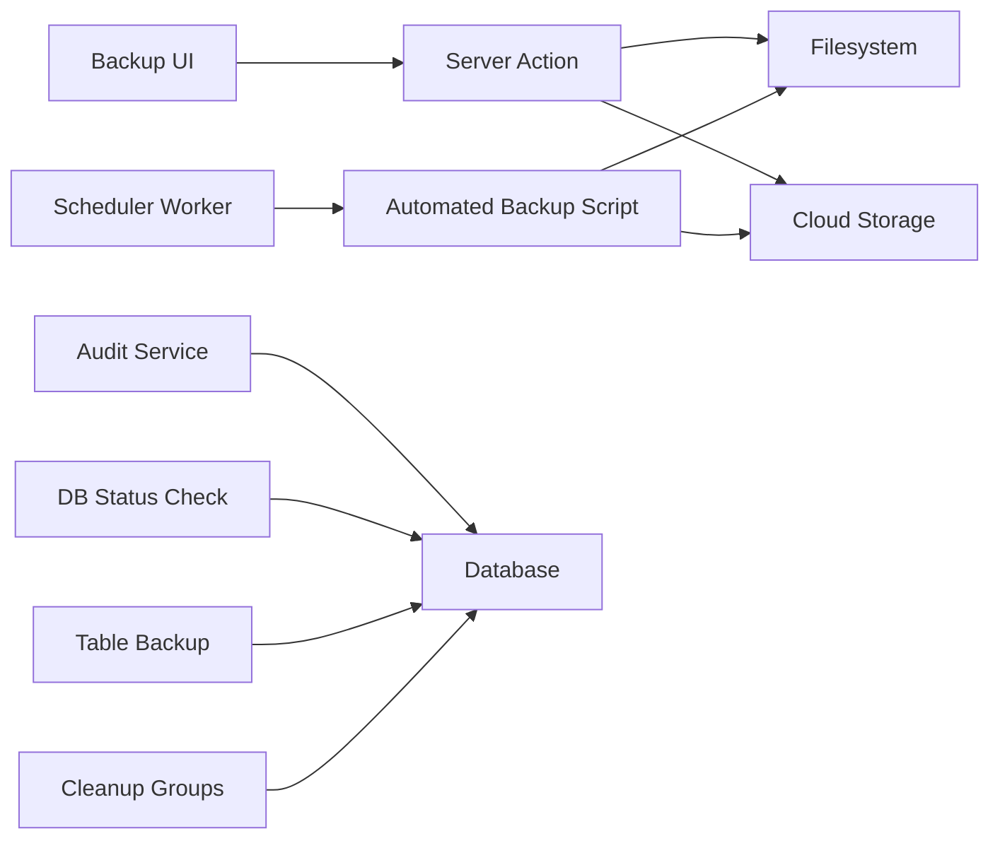

# Monitoring & Maintenance Utilities

<cite>
**Referenced Files in This Document**
- [route.ts](file://app/api/health/route.ts)
- [audit.ts](file://lib/audit.ts)
- [page.tsx](file://app/dashboard/admin/audit/page.tsx)
- [backup.ts](file://lib/actions/backup.ts)
- [page.tsx](file://app/dashboard/admin/backups/page.tsx)
- [automated-backup.ts](file://scripts/automated-backup.ts)
- [scheduler.ts](file://workers/scheduler.ts)
- [check-db-status.ts](file://scripts/check-db-status.ts)
- [backup-db-tables.ts](file://scripts/backup-db-tables.ts)
- [cleanup-programme-groups.ts](file://scripts/cleanup-programme-groups.ts)
- [redis.ts](file://lib/redis.ts)
- [site-visitor.tsx](file://components/analytics/site-visitor.tsx)
</cite>

## Table of Contents
1. Introduction
2. Project Structure
3. Core Components
4. Architecture Overview
5. Detailed Component Analysis
6. Dependency Analysis
7. Performance Considerations
8. Troubleshooting Guide
9. Conclusion

## Introduction
This document explains the monitoring and maintenance utilities available in the TMC Portal. It covers:
- System health monitoring via a lightweight endpoint
- Audit logging for activity tracking and compliance reporting
- Backup and disaster recovery procedures (automated and manual)
- Scheduled tasks and maintenance workflows
- Database maintenance, cache management, and cleanup utilities
- Practical examples for setting up alerts, configuring backup schedules, and running maintenance tasks

## Project Structure
The monitoring and maintenance features are implemented across API routes, server actions, dashboard pages, scripts, and workers:
- Health check endpoint under app/api/health
- Audit logging library and admin audit page
- Backup server actions and admin backup UI
- Automated backup script and scheduler worker
- Database connectivity checks and targeted table backups
- Cleanup scripts for expired programme messaging groups
- Redis connection configuration for background jobs
- Client-side site visitor analytics component

**Diagram sources**
- [route.ts:1-6](file://app/api/health/route.ts#L1-L6)
- [page.tsx:1-130](file://app/dashboard/admin/audit/page.tsx#L1-L130)
- [site-visitor.tsx:1-42](file://components/analytics/site-visitor.tsx#L1-L42)
- [page.tsx:1-203](file://app/dashboard/admin/backups/page.tsx#L1-L203)
- [backup.ts:1-162](file://lib/actions/backup.ts#L1-L162)
- [automated-backup.ts:1-238](file://scripts/automated-backup.ts#L1-L238)
- [scheduler.ts:1-51](file://workers/scheduler.ts#L1-L51)
- [check-db-status.ts:1-18](file://scripts/check-db-status.ts#L1-L18)
- [backup-db-tables.ts:1-58](file://scripts/backup-db-tables.ts#L1-L58)
- [cleanup-programme-groups.ts:1-63](file://scripts/cleanup-programme-groups.ts#L1-L63)
- [redis.ts:1-8](file://lib/redis.ts#L1-L8)

**Section sources**
- [route.ts:1-6](file://app/api/health/route.ts#L1-L6)
- [page.tsx:1-130](file://app/dashboard/admin/audit/page.tsx#L1-L130)
- [page.tsx:1-203](file://app/dashboard/admin/backups/page.tsx#L1-L203)
- [backup.ts:1-162](file://lib/actions/backup.ts#L1-L162)
- [automated-backup.ts:1-238](file://scripts/automated-backup.ts#L1-L238)
- [scheduler.ts:1-51](file://workers/scheduler.ts#L1-L51)
- [check-db-status.ts:1-18](file://scripts/check-db-status.ts#L1-L18)
- [backup-db-tables.ts:1-58](file://scripts/backup-db-tables.ts#L1-L58)
- [cleanup-programme-groups.ts:1-63](file://scripts/cleanup-programme-groups.ts#L1-L63)
- [redis.ts:1-8](file://lib/redis.ts#L1-L8)
- [site-visitor.tsx:1-42](file://components/analytics/site-visitor.tsx#L1-L42)

## Core Components
- Health endpoint: Returns a simple status to indicate service availability.
- Audit logging: Records user actions with filters and pagination; exposed via an admin page.
- Backup system: Manual creation via server action and automated execution via a scheduled script; supports local archives and cloud storage.
- Scheduler: Runs periodic tasks including reminders and automated backups.
- Maintenance scripts: Validate database connectivity, back up specific tables, and clean up expired data.
- Cache/queue: Redis connection used by background workers.
- Analytics: Client-side visitor tracking component that logs visits.

**Section sources**
- [route.ts:1-6](file://app/api/health/route.ts#L1-L6)
- [audit.ts:1-74](file://lib/audit.ts#L1-L74)
- [page.tsx:1-130](file://app/dashboard/admin/audit/page.tsx#L1-L130)
- [backup.ts:1-162](file://lib/actions/backup.ts#L1-L162)
- [page.tsx:1-203](file://app/dashboard/admin/backups/page.tsx#L1-L203)
- [automated-backup.ts:1-238](file://scripts/automated-backup.ts#L1-L238)
- [scheduler.ts:1-51](file://workers/scheduler.ts#L1-L51)
- [check-db-status.ts:1-18](file://scripts/check-db-status.ts#L1-L18)
- [backup-db-tables.ts:1-58](file://scripts/backup-db-tables.ts#L1-L58)
- [cleanup-programme-groups.ts:1-63](file://scripts/cleanup-programme-groups.ts#L1-L63)
- [redis.ts:1-8](file://lib/redis.ts#L1-L8)
- [site-visitor.tsx:1-42](file://components/analytics/site-visitor.tsx#L1-L42)

## Architecture Overview
The system combines real-time endpoints, scheduled jobs, and administrative dashboards to provide observability and operational control.

**Diagram sources**
- [backup.ts:41-148](file://lib/actions/backup.ts#L41-L148)
- [automated-backup.ts:86-230](file://scripts/automated-backup.ts#L86-L230)
- [scheduler.ts:38-50](file://workers/scheduler.ts#L38-L50)

## Detailed Component Analysis

### Health Monitoring
- Purpose: Provide a minimal endpoint to verify service liveness.
- Behavior: Returns a JSON status indicating the service is UP.
- Use cases: External uptime monitors, load balancer health checks, container orchestration probes.

**Diagram sources**
- [route.ts:1-6](file://app/api/health/route.ts#L1-L6)

**Section sources**
- [route.ts:1-6](file://app/api/health/route.ts#L1-L6)

### Audit Logging and Compliance Reporting
- Purpose: Track user actions for accountability and compliance.
- Capabilities:
  - Create audit entries with user, entity, description, IP, user agent, and metadata.
  - Query logs with filters (user, organization, entity type/id, date range), pagination, and sorting.
- Admin UI: Displays recent activity with user details and contextual badges.

**Diagram sources**
- [audit.ts:5-74](file://lib/audit.ts#L5-L74)

**Section sources**
- [audit.ts:1-74](file://lib/audit.ts#L1-L74)
- [page.tsx:1-130](file://app/dashboard/admin/audit/page.tsx#L1-L130)

### Backup and Disaster Recovery
- Manual backups:
  - Triggered from the admin Backup & Disaster Recovery page.
  - Uses a server action to dump the database, zip uploads, optionally upload to cloud storage, and persist metadata.
- Automated backups:
  - Executed daily by the scheduler worker invoking the automated backup script.
  - Performs retention cleanup on local archive and cloud storage.
  - Records success/failure and triggers auxiliary maintenance tasks.

**Diagram sources**
- [page.tsx:1-203](file://app/dashboard/admin/backups/page.tsx#L1-L203)
- [backup.ts:41-148](file://lib/actions/backup.ts#L41-L148)

**Diagram sources**
- [scheduler.ts:38-50](file://workers/scheduler.ts#L38-L50)
- [automated-backup.ts:86-230](file://scripts/automated-backup.ts#L86-L230)

**Section sources**
- [page.tsx:1-203](file://app/dashboard/admin/backups/page.tsx#L1-L203)
- [backup.ts:1-162](file://lib/actions/backup.ts#L1-L162)
- [automated-backup.ts:1-238](file://scripts/automated-backup.ts#L1-L238)
- [scheduler.ts:1-51](file://workers/scheduler.ts#L1-L51)

### Scheduled Tasks and Maintenance Workflows
- Weekly notifications, daily reminders, monthly report nudges, and automated backups are orchestrated by the scheduler worker using cron expressions.
- The scheduler invokes the automated backup script daily at a fixed time.

**Diagram sources**
- [scheduler.ts:1-51](file://workers/scheduler.ts#L1-L51)
- [automated-backup.ts:1-238](file://scripts/automated-backup.ts#L1-L238)

**Section sources**
- [scheduler.ts:1-51](file://workers/scheduler.ts#L1-L51)

### Database Maintenance and Connectivity Checks
- Connectivity verification:
  - A script executes a simple query to validate database connectivity and exit codes for automation.
- Targeted table backups:
  - A script backs up specific tables to JSON files for quick inspection or restore.
- Data cleanup:
  - A script removes messages for programmes that ended more than two weeks ago to keep messaging data lean.

**Diagram sources**
- [check-db-status.ts:1-18](file://scripts/check-db-status.ts#L1-L18)
- [backup-db-tables.ts:1-58](file://scripts/backup-db-tables.ts#L1-L58)
- [cleanup-programme-groups.ts:1-63](file://scripts/cleanup-programme-groups.ts#L1-L63)

**Section sources**
- [check-db-status.ts:1-18](file://scripts/check-db-status.ts#L1-L18)
- [backup-db-tables.ts:1-58](file://scripts/backup-db-tables.ts#L1-L58)
- [cleanup-programme-groups.ts:1-63](file://scripts/cleanup-programme-groups.ts#L1-L63)

### Cache Management and Background Jobs
- Redis connection:
  - Centralized Redis client configuration used by background workers (e.g., email queue).
- Role in maintenance:
  - Enables reliable queuing for scheduled tasks and asynchronous processing.

**Section sources**
- [redis.ts:1-8](file://lib/redis.ts#L1-L8)

### Analytics and Activity Tracking
- Site visitor tracking:
  - Client component manages visitor and session identifiers and updates last active timestamps.
- Integration:
  - Can be combined with backend endpoints to aggregate visit counts and unique visitors for dashboards.

**Section sources**
- [site-visitor.tsx:1-42](file://components/analytics/site-visitor.tsx#L1-L42)

## Dependency Analysis
Key dependencies among components:
- Scheduler depends on cron and child process execution to run the automated backup script.
- Backup server action depends on filesystem tools (mysqldump, zip) and optional cloud storage SDK.
- Audit logging depends on database ORM for writes and queries.
- Maintenance scripts depend on database connections and file system operations.

**Diagram sources**
- [scheduler.ts:1-51](file://workers/scheduler.ts#L1-L51)
- [automated-backup.ts:1-238](file://scripts/automated-backup.ts#L1-L238)
- [backup.ts:1-162](file://lib/actions/backup.ts#L1-L162)
- [audit.ts:1-74](file://lib/audit.ts#L1-L74)
- [check-db-status.ts:1-18](file://scripts/check-db-status.ts#L1-L18)
- [backup-db-tables.ts:1-58](file://scripts/backup-db-tables.ts#L1-L58)
- [cleanup-programme-groups.ts:1-63](file://scripts/cleanup-programme-groups.ts#L1-L63)

**Section sources**
- [scheduler.ts:1-51](file://workers/scheduler.ts#L1-L51)
- [automated-backup.ts:1-238](file://scripts/automated-backup.ts#L1-L238)
- [backup.ts:1-162](file://lib/actions/backup.ts#L1-L162)
- [audit.ts:1-74](file://lib/audit.ts#L1-L74)
- [check-db-status.ts:1-18](file://scripts/check-db-status.ts#L1-L18)
- [backup-db-tables.ts:1-58](file://scripts/backup-db-tables.ts#L1-L58)
- [cleanup-programme-groups.ts:1-63](file://scripts/cleanup-programme-groups.ts#L1-L63)

## Performance Considerations
- Avoid blocking long-running operations in request handlers; prefer background jobs for heavy tasks like backups.
- Use pagination and filtering when querying large audit log sets to reduce memory and latency.
- Ensure mysqldump and zip commands are executed with appropriate flags to minimize overhead and avoid locking issues.
- Configure retention policies to prevent unbounded growth of local archives and cloud storage.
- Monitor Redis connectivity and queue depth to ensure timely processing of scheduled tasks.

[No sources needed since this section provides general guidance]

## Troubleshooting Guide
Common issues and resolutions:
- Health endpoint returns non-200:
  - Verify the application is running and the route is accessible.
- Backup failures:
  - Check DATABASE_URL format and credentials.
  - Confirm mysqldump and zip are installed and executable.
  - Validate cloud storage credentials and bucket permissions.
  - Review backup records for failure reasons and sizes.
- Audit logs not appearing:
  - Ensure audit logging calls are invoked around critical actions.
  - Verify database write permissions and schema integrity.
- Scheduler not running:
  - Confirm the worker process is started and cron expressions are valid.
  - Inspect logs for errors during task execution.
- Database connectivity:
  - Use the connectivity check script to validate environment and network settings.

**Section sources**
- [route.ts:1-6](file://app/api/health/route.ts#L1-L6)
- [backup.ts:41-148](file://lib/actions/backup.ts#L41-L148)
- [automated-backup.ts:86-230](file://scripts/automated-backup.ts#L86-L230)
- [audit.ts:17-74](file://lib/audit.ts#L17-L74)
- [scheduler.ts:1-51](file://workers/scheduler.ts#L1-L51)
- [check-db-status.ts:1-18](file://scripts/check-db-status.ts#L1-L18)

## Conclusion
The TMC Portal provides a robust set of monitoring and maintenance utilities:
- A health endpoint for external monitoring
- Comprehensive audit logging for compliance and troubleshooting
- Flexible backup mechanisms (manual and automated) with retention and cloud support
- A scheduler-driven workflow for routine maintenance and notifications
- Targeted database maintenance and cleanup scripts
- Redis-backed background processing for scalable operations

These components together enable administrators to maintain system reliability, ensure data safety, and perform proactive maintenance with clear visibility into system state and activities.

[No sources needed since this section summarizes without analyzing specific files]