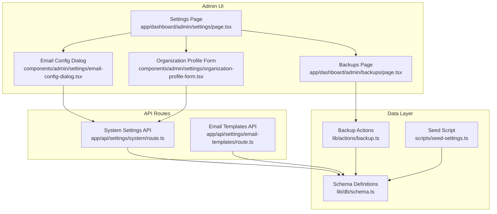
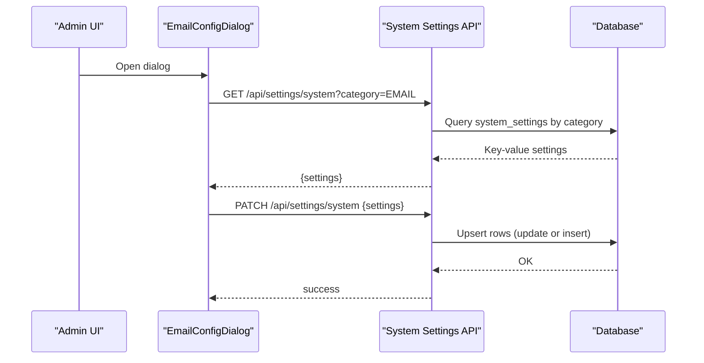
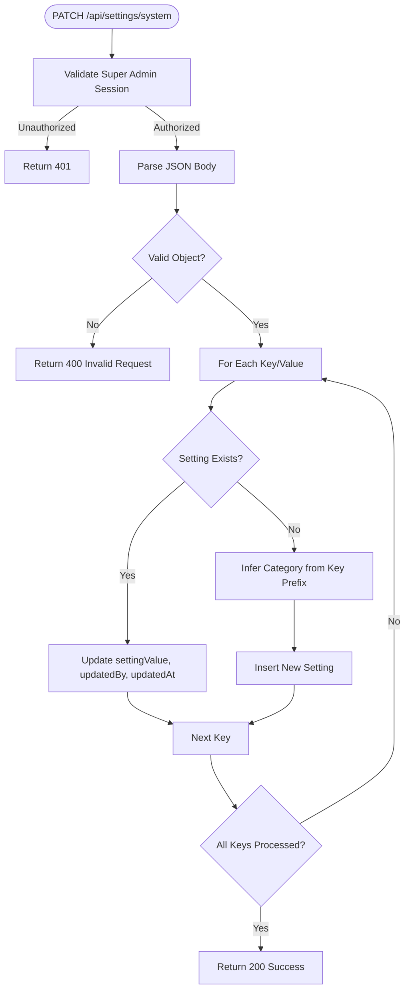
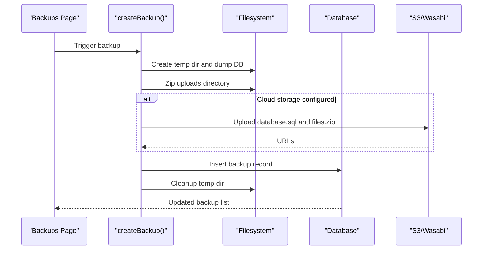
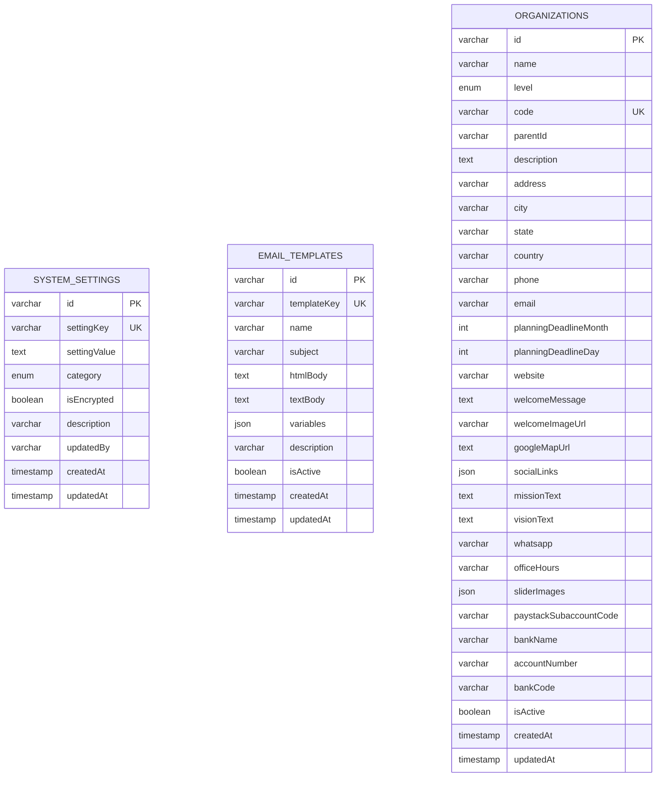
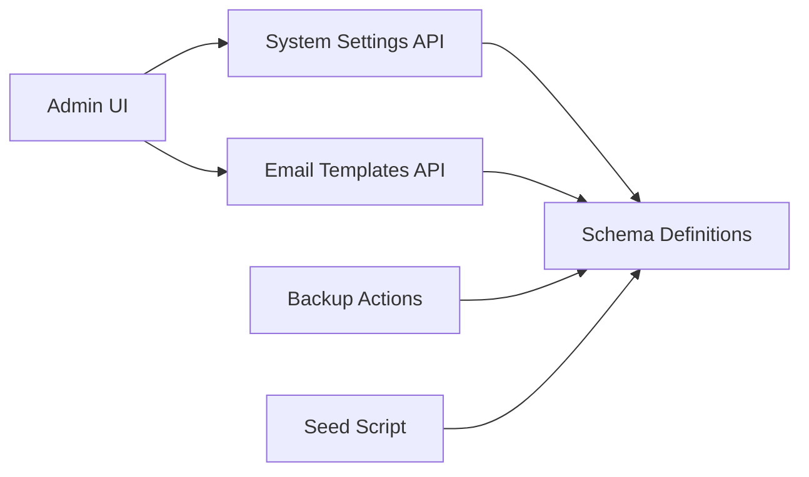

# System Settings & Configuration

<cite>
**Referenced Files in This Document**
- [app/api/settings/system/route.ts](file://app/api/settings/system/route.ts)
- [app/api/settings/email-templates/route.ts](file://app/api/settings/email-templates/route.ts)
- [components/admin/settings/organization-profile-form.tsx](file://components/admin/settings/organization-profile-form.tsx)
- [components/admin/settings/email-config-dialog.tsx](file://components/admin/settings/email-config-dialog.tsx)
- [lib/db/schema.ts](file://lib/db/schema.ts)
- [scripts/seed-settings.ts](file://scripts/seed-settings.ts)
- [app/dashboard/admin/settings/page.tsx](file://app/dashboard/admin/settings/page.tsx)
- [lib/actions/backup.ts](file://lib/actions/backup.ts)
- [app/dashboard/admin/backups/page.tsx](file://app/dashboard/admin/backups/page.tsx)
- [drizzle/0000_giant_demogoblin.sql](file://drizzle/0000_giant_demogoblin.sql)
- [prisma/schema.prisma](file://prisma/schema.prisma)
</cite>

## Table of Contents
1. Introduction
2. Project Structure
3. Core Components
4. Architecture Overview
5. Detailed Component Analysis
6. Dependency Analysis
7. Performance Considerations
8. Troubleshooting Guide
9. Conclusion

## Introduction
This document explains how system settings and configuration are managed in the TMC Portal. It covers the centralized settings interface, categorized configuration options, validation rules, environment-specific overrides, organization profile management, email configuration, payment gateway settings, third-party integrations, schema design, data validation, migration processes, backup and restore workflows, versioning considerations, rollback strategies, and security controls including encryption flags, access control, and audit trails.

## Project Structure
The settings subsystem is implemented across API routes, admin UI components, database schemas, and utilities:
- Centralized settings API for reading/writing key-value settings with categories
- Email templates API for listing templates
- Admin dashboard page that groups settings into cards (email, notifications, payments, AI, storage, year planner, security)
- Organization profile form to manage public-facing portal identity
- Backup actions and UI for creating and managing backups
- Database schema definitions for system settings and related tables
- Seed script to create required tables on first run

**Diagram sources**
- [app/dashboard/admin/settings/page.tsx:25-76](file://app/dashboard/admin/settings/page.tsx#L25-L76)
- [components/admin/settings/email-config-dialog.tsx:31-74](file://components/admin/settings/email-config-dialog.tsx#L31-L74)
- [components/admin/settings/organization-profile-form.tsx:30-44](file://components/admin/settings/organization-profile-form.tsx#L30-L44)
- [app/api/settings/system/route.ts:8-35](file://app/api/settings/system/route.ts#L8-L35)
- [app/api/settings/email-templates/route.ts:6-26](file://app/api/settings/email-templates/route.ts#L6-L26)
- [lib/db/schema.ts:454-465](file://lib/db/schema.ts#L454-L465)
- [scripts/seed-settings.ts:7-25](file://scripts/seed-settings.ts#L7-L25)
- [lib/actions/backup.ts:41-148](file://lib/actions/backup.ts#L41-L148)

**Section sources**
- [app/dashboard/admin/settings/page.tsx:25-76](file://app/dashboard/admin/settings/page.tsx#L25-L76)
- [app/api/settings/system/route.ts:8-35](file://app/api/settings/system/route.ts#L8-L35)
- [lib/db/schema.ts:454-465](file://lib/db/schema.ts#L454-L465)

## Core Components
- Centralized settings API:
  - GET /api/settings/system?category=... returns a key-value map filtered by category
  - PATCH /api/settings/system accepts an object of settings to update or insert; auto-detects category from key prefix
- Email templates API:
  - GET /api/settings/email-templates returns templates with parsed JSON variables
- Admin settings page:
  - Aggregates multiple setting categories via server-side calls and renders cards for each area
- Email configuration dialog:
  - Loads EMAIL category settings and persists changes back to the system settings API
- Organization profile form:
  - Updates organization-level fields used as global portal identity
- Backup system:
  - Creates DB dumps and file archives, optionally uploads to S3/Wasabi, records metadata, and supports deletion

**Section sources**
- [app/api/settings/system/route.ts:8-89](file://app/api/settings/system/route.ts#L8-L89)
- [app/api/settings/email-templates/route.ts:6-26](file://app/api/settings/email-templates/route.ts#L6-L26)
- [components/admin/settings/email-config-dialog.tsx:31-74](file://components/admin/settings/email-config-dialog.tsx#L31-L74)
- [components/admin/settings/organization-profile-form.tsx:30-44](file://components/admin/settings/organization-profile-form.tsx#L30-L44)
- [lib/actions/backup.ts:41-148](file://lib/actions/backup.ts#L41-L148)

## Architecture Overview
The settings architecture follows a clear separation between UI, API, and persistence:
- UI components call server actions or fetch endpoints to read/write settings
- API routes enforce authorization and persist changes to the database
- Schema defines typed tables and enums for categories and related entities
- Backups are created via server actions that interact with the DB and optional cloud storage

**Diagram sources**
- [components/admin/settings/email-config-dialog.tsx:31-74](file://components/admin/settings/email-config-dialog.tsx#L31-L74)
- [app/api/settings/system/route.ts:8-89](file://app/api/settings/system/route.ts#L8-L89)

## Detailed Component Analysis

### System Settings API
- Authorization: Requires super admin session
- GET:
  - Optional category filter
  - Returns settings as a key-value object
- PATCH:
  - Validates request body
  - For each key/value:
    - If exists: updates value, updatedBy, updatedAt
    - If not exists: inserts new row with inferred category based on key prefix (email., notification.)
- Error handling: Returns appropriate status codes and messages

**Diagram sources**
- [app/api/settings/system/route.ts:37-89](file://app/api/settings/system/route.ts#L37-L89)

**Section sources**
- [app/api/settings/system/route.ts:8-89](file://app/api/settings/system/route.ts#L8-L89)

### Email Templates API
- Authorization: Requires super admin session
- GET:
  - Retrieves all templates
  - Parses JSON variables field before returning

**Section sources**
- [app/api/settings/email-templates/route.ts:6-26](file://app/api/settings/email-templates/route.ts#L6-L26)

### Admin Settings Page
- Server-side fetches various setting sets (AI, membership, year planner, LiveKit, financial, storage)
- Renders grouped cards for:
  - Organization profile
  - Notifications (email config, push notifications)
  - Payment integrations (jurisdictions/payments)
  - Messaging (email templates)
  - Website navigation
  - Offices & permissions

**Section sources**
- [app/dashboard/admin/settings/page.tsx:25-76](file://app/dashboard/admin/settings/page.tsx#L25-L76)
- [app/dashboard/admin/settings/page.tsx:79-160](file://app/dashboard/admin/settings/page.tsx#L79-L160)

### Email Configuration Dialog
- Fetches EMAIL category settings when opened
- Displays sender name, sender email, reply-to
- Saves changes via PATCH to system settings API
- Uses toast notifications for feedback

**Section sources**
- [components/admin/settings/email-config-dialog.tsx:31-74](file://components/admin/settings/email-config-dialog.tsx#L31-L74)
- [components/admin/settings/email-config-dialog.tsx:76-144](file://components/admin/settings/email-config-dialog.tsx#L76-L144)

### Organization Profile Management
- Presents fields for portal name, support email, phone, website, welcome message
- Submits updates via server action to persist to organization record
- Provides user feedback via toast

**Section sources**
- [components/admin/settings/organization-profile-form.tsx:20-44](file://components/admin/settings/organization-profile-form.tsx#L20-L44)
- [components/admin/settings/organization-profile-form.tsx:46-113](file://components/admin/settings/organization-profile-form.tsx#L46-L113)

### Backup and Restore
- Create backup:
  - Dumps MySQL database to SQL file
  - Zips public/uploads directory if present
  - Optionally uploads artifacts to S3/Wasabi using configured credentials
  - Records backup metadata in database
  - Cleans up temporary files
- List/delete backups via server actions and UI

**Diagram sources**
- [lib/actions/backup.ts:41-148](file://lib/actions/backup.ts#L41-L148)
- [app/dashboard/admin/backups/page.tsx:18-32](file://app/dashboard/admin/backups/page.tsx#L18-L32)

**Section sources**
- [lib/actions/backup.ts:41-161](file://lib/actions/backup.ts#L41-L161)
- [app/dashboard/admin/backups/page.tsx:1-150](file://app/dashboard/admin/backups/page.tsx#L1-L150)

### Data Model and Schema
- System settings table:
  - id, settingKey (unique), settingValue, category enum, isEncrypted flag, description, updatedBy, timestamps
- Email templates table:
  - id, templateKey (unique), name, subject, htmlBody, textBody, variables (JSON), description, isActive, timestamps
- Organization model includes CMS and planning fields, plus payment integration fields
- Enums include settingsCategoryEnum and others used across the app

**Diagram sources**
- [lib/db/schema.ts:454-465](file://lib/db/schema.ts#L454-L465)
- [lib/db/schema.ts:467-470](file://lib/db/schema.ts#L467-L470)
- [lib/db/schema.ts:148-188](file://lib/db/schema.ts#L148-L188)
- [drizzle/0000_giant_demogoblin.sql:245-275](file://drizzle/0000_giant_demogoblin.sql#L245-L275)
- [prisma/schema.prisma:125-162](file://prisma/schema.prisma#L125-L162)

**Section sources**
- [lib/db/schema.ts:454-470](file://lib/db/schema.ts#L454-L470)
- [lib/db/schema.ts:148-188](file://lib/db/schema.ts#L148-L188)
- [drizzle/0000_giant_demogoblin.sql:245-275](file://drizzle/0000_giant_demogoblin.sql#L245-L275)
- [prisma/schema.prisma:125-162](file://prisma/schema.prisma#L125-L162)

### Migration and Seeding
- Seed script creates system_settings and email_templates tables if missing
- Drizzle migrations define core schema structures
- Prisma schema mirrors organization and other models

**Section sources**
- [scripts/seed-settings.ts:7-25](file://scripts/seed-settings.ts#L7-L25)
- [drizzle/0000_giant_demogoblin.sql:245-275](file://drizzle/0000_giant_demogoblin.sql#L245-L275)
- [prisma/schema.prisma:125-162](file://prisma/schema.prisma#L125-L162)

### Adding New Configuration Options
To add a new setting:
- Choose a category and key naming convention (e.g., feature.flag_name)
- Persist via PATCH to /api/settings/system with the new key/value
- Ensure category inference works or explicitly set category during insertion
- Expose in admin UI by fetching the relevant category and rendering inputs
- If sensitive, mark isEncrypted and handle encryption/decryption at read/write boundaries

Validation and environment overrides:
- Validate values in the API layer before persisting
- Use environment variables for secrets (e.g., API keys) and merge with stored settings where appropriate

**Section sources**
- [app/api/settings/system/route.ts:37-89](file://app/api/settings/system/route.ts#L37-L89)

### Implementing Setting Categories
Categories are defined in the schema and enforced by the API:
- EMAIL, NOTIFICATION, GENERAL, AI, INTEGRATION
- The system settings API infers category from key prefixes for new entries

**Section sources**
- [lib/db/schema.ts:71](file://lib/db/schema.ts#L71)
- [app/api/settings/system/route.ts:69-73](file://app/api/settings/system/route.ts#L69-L73)

### Creating Admin Forms
Patterns observed:
- Load current settings via API or server actions
- Render controlled inputs bound to local state
- On save, POST/PATCH to the appropriate API endpoint
- Provide user feedback via toast notifications

Examples:
- Email configuration dialog demonstrates loading EMAIL category and saving changes
- Organization profile form shows updating organization-level fields

**Section sources**
- [components/admin/settings/email-config-dialog.tsx:31-74](file://components/admin/settings/email-config-dialog.tsx#L31-L74)
- [components/admin/settings/organization-profile-form.tsx:30-44](file://components/admin/settings/organization-profile-form.tsx#L30-L44)

### Backup and Restore Workflow
- Manual backup creation:
  - Dumps database and zips uploads
  - Optionally uploads to S3/Wasabi
  - Records metadata and revalidizes UI
- Deletion:
  - Removes backup record from database
- Retention:
  - Manual backups kept indefinitely until deleted
  - Automated backups follow configured retention policy

**Section sources**
- [lib/actions/backup.ts:41-161](file://lib/actions/backup.ts#L41-L161)
- [app/dashboard/admin/backups/page.tsx:110-127](file://app/dashboard/admin/backups/page.tsx#L110-L127)

### Version Control and Rollback
- Versioning:
  - Backups include timestamps and metadata
  - Database migrations provide forward-only schema evolution
- Rollback:
  - Restore database from a prior backup file
  - Revert application code to a previous commit if needed
  - Validate integrity after restore

[No sources needed since this section provides general guidance]

### Security Considerations
- Access control:
  - Settings APIs require super admin session
  - Backup operations check user session
- Encryption:
  - system_settings includes isEncrypted flag for sensitive values
  - Handle encryption/decryption around read/write paths
- Audit trails:
  - updatedBy tracks who changed settings
  - Audit logs exist for broader system actions

**Section sources**
- [app/api/settings/system/route.ts:10-13](file://app/api/settings/system/route.ts#L10-L13)
- [app/api/settings/system/route.ts:61-67](file://app/api/settings/system/route.ts#L61-L67)
- [lib/db/schema.ts:454-465](file://lib/db/schema.ts#L454-L465)
- [drizzle/0000_giant_demogoblin.sql:64-75](file://drizzle/0000_giant_demogoblin.sql#L64-L75)

## Dependency Analysis
- UI depends on API routes for settings retrieval and updates
- API routes depend on database schema and session utilities
- Backup actions depend on filesystem tools and optional S3/Wasabi client
- Seed script ensures schema existence before runtime usage

**Diagram sources**
- [app/dashboard/admin/settings/page.tsx:25-76](file://app/dashboard/admin/settings/page.tsx#L25-L76)
- [app/api/settings/system/route.ts:8-35](file://app/api/settings/system/route.ts#L8-L35)
- [app/api/settings/email-templates/route.ts:6-26](file://app/api/settings/email-templates/route.ts#L6-L26)
- [lib/db/schema.ts:454-465](file://lib/db/schema.ts#L454-L465)
- [lib/actions/backup.ts:41-148](file://lib/actions/backup.ts#L41-L148)
- [scripts/seed-settings.ts:7-25](file://scripts/seed-settings.ts#L7-L25)

**Section sources**
- [app/dashboard/admin/settings/page.tsx:25-76](file://app/dashboard/admin/settings/page.tsx#L25-L76)
- [app/api/settings/system/route.ts:8-35](file://app/api/settings/system/route.ts#L8-L35)
- [lib/db/schema.ts:454-465](file://lib/db/schema.ts#L454-L465)

## Performance Considerations
- Batch updates:
  - The settings API iterates per key; consider batching writes for large updates
- Caching:
  - Cache frequently read settings on the server to reduce DB queries
- Backup size:
  - Large uploads directories increase backup time and storage; consider excluding non-essential files
- S3/Wasabi upload:
  - Network latency affects backup creation time; ensure stable connectivity

[No sources needed since this section provides general guidance]

## Troubleshooting Guide
Common issues and resolutions:
- Unauthorized errors:
  - Ensure the user has super admin privileges when accessing settings APIs
- Invalid request body:
  - Verify the PATCH payload is a valid object with settings mapping
- Missing tables:
  - Run seed script to create system_settings and email_templates tables
- Backup failures:
  - Check DATABASE_URL format and mysqldump availability
  - Verify S3/Wasabi credentials and bucket configuration
  - Inspect error logs for specific failure reasons

**Section sources**
- [app/api/settings/system/route.ts:10-13](file://app/api/settings/system/route.ts#L10-L13)
- [app/api/settings/system/route.ts:47-49](file://app/api/settings/system/route.ts#L47-L49)
- [scripts/seed-settings.ts:7-25](file://scripts/seed-settings.ts#L7-L25)
- [lib/actions/backup.ts:55-76](file://lib/actions/backup.ts#L55-L76)
- [lib/actions/backup.ts:100-124](file://lib/actions/backup.ts#L100-L124)

## Conclusion
The TMC Portal’s system settings and configuration management provide a robust, categorized, and secure approach to managing global parameters. The centralized API enforces authorization and validates inputs, while the admin UI offers intuitive forms for common tasks like email configuration and organization profile updates. Backups and restores ensure operational resilience, and the schema supports extensibility for future integrations. Following the patterns outlined here will help maintain consistency, security, and performance as the system evolves.