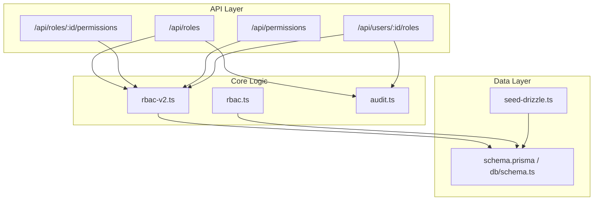
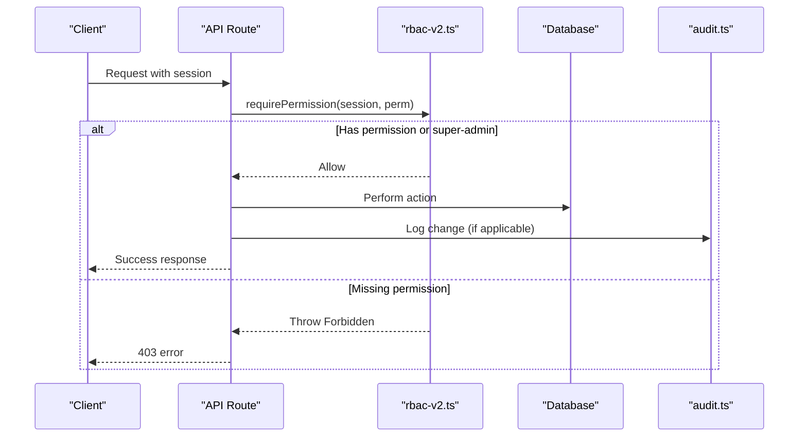
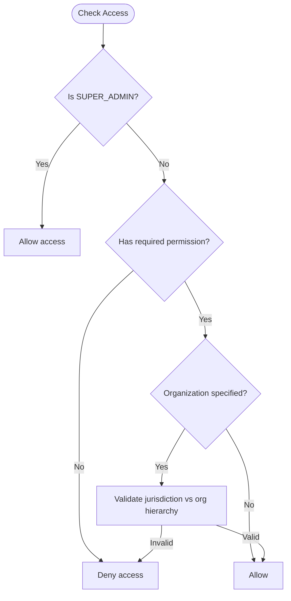
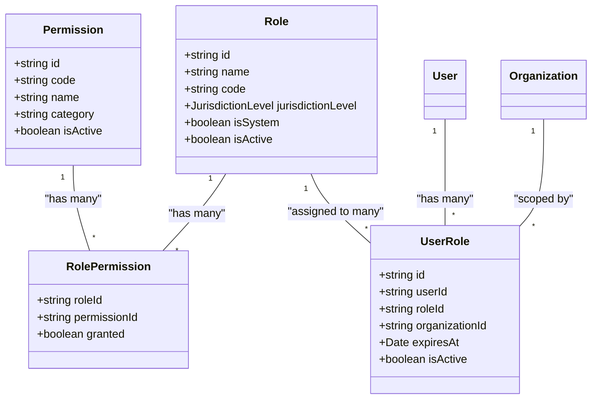
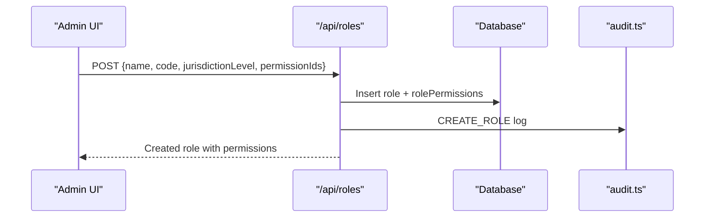
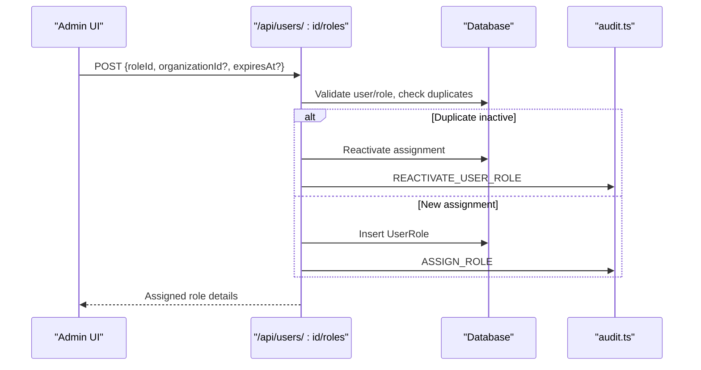
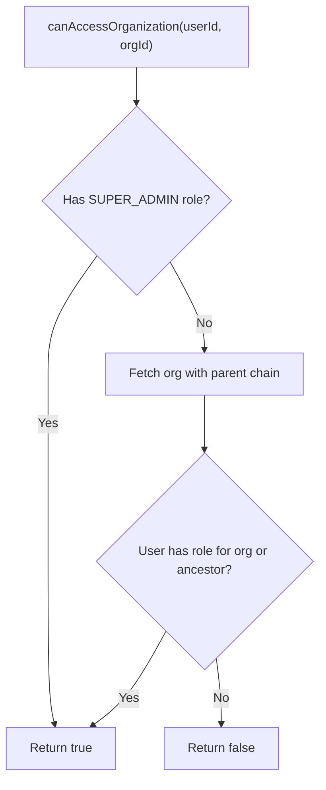
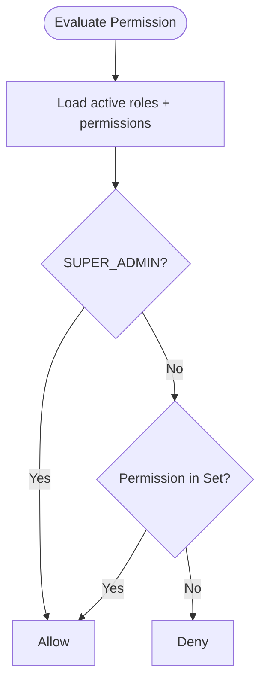
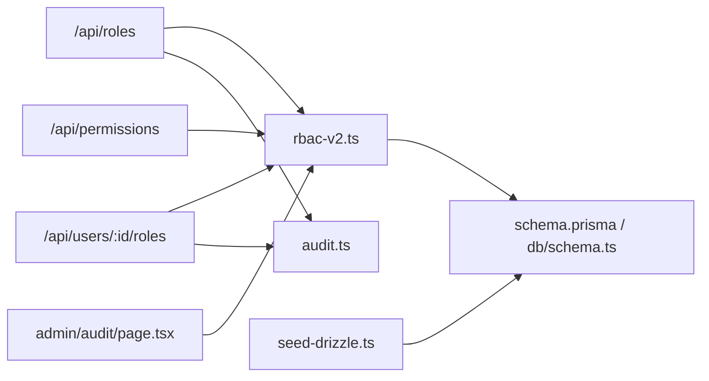

# Role & Permission Management

<cite>
**Referenced Files in This Document**
- [lib/rbac.ts](file://lib/rbac.ts)
- [lib/rbac-v2.ts](file://lib/rbac-v2.ts)
- [RBAC_SYSTEM.md](file://RBAC_SYSTEM.md)
- [RBAC_IMPLEMENTATION_SUMMARY.md](file://RBAC_IMPLEMENTATION_SUMMARY.md)
- [app/api/roles/route.ts](file://app/api/roles/route.ts)
- [app/api/permissions/route.ts](file://app/api/permissions/route.ts)
- [app/api/roles/[id]/permissions/route.ts](file://app/api/roles/[id]/permissions/route.ts)
- [app/api/users/[id]/roles/route.ts](file://app/api/users/[id]/roles/route.ts)
- [lib/audit.ts](file://lib/audit.ts)
- [prisma/schema.prisma](file://prisma/schema.prisma)
- [lib/db/schema.ts](file://lib/db/schema.ts)
- [seed-drizzle.ts](file://seed-drizzle.ts)
- [app/dashboard/admin/jurisdictions/actions.ts](file://app/dashboard/admin/jurisdictions/actions.ts)
- [app/dashboard/admin/audit/page.tsx](file://app/dashboard/admin/audit/page.tsx)
</cite>

## Table of Contents
1. [Introduction](#introduction)
2. [Project Structure](#project-structure)
3. [Core Components](#core-components)
4. [Architecture Overview](#architecture-overview)
5. [Detailed Component Analysis](#detailed-component-analysis)
6. [Dependency Analysis](#dependency-analysis)
7. [Performance Considerations](#performance-considerations)
8. [Troubleshooting Guide](#troubleshooting-guide)
9. [Conclusion](#conclusion)
10. [Appendices](#appendices)

## Introduction
This document explains the TMC Portal’s role-based access control (RBAC) and permission management system. It covers the hierarchical role structure, jurisdiction-aware permissions, dynamic evaluation, assignment workflows, security considerations, auditing, and troubleshooting guidance. The system supports multiple roles per user, organization-scoped access, and extensible roles with granular permissions.

## Project Structure
The RBAC system spans library functions, API routes, database schema, and admin UI components:
- Core logic resides in lib/rbac.ts (legacy) and lib/rbac-v2.ts (current).
- API endpoints for roles, permissions, and user role assignments live under app/api.
- Database models are defined in prisma/schema.prisma and Drizzle schema in lib/db/schema.ts.
- Audit logging is implemented via lib/audit.ts.
- Seed data defines default roles and permissions via seed-drizzle.ts.
- Admin UI uses pages like app/dashboard/admin/audit/page.tsx to review changes.

**Diagram sources**
- [app/api/roles/route.ts:18-118](file://app/api/roles/route.ts#L18-L118)
- [app/api/roles/[id]/permissions/route.ts:15-50](file://app/api/roles/[id]/permissions/route.ts#L15-L50)
- [app/api/permissions/route.ts:8-36](file://app/api/permissions/route.ts#L8-L36)
- [app/api/users/[id]/roles/route.ts:16-206](file://app/api/users/[id]/roles/route.ts#L16-L206)
- [lib/rbac-v2.ts:47-165](file://lib/rbac-v2.ts#L47-L165)
- [lib/rbac.ts:37-192](file://lib/rbac.ts#L37-L192)
- [lib/audit.ts:17-71](file://lib/audit.ts#L17-L71)
- [prisma/schema.prisma:334-369](file://prisma/schema.prisma#L334-L369)
- [lib/db/schema.ts:305-315](file://lib/db/schema.ts#L305-L315)
- [seed-drizzle.ts:75-135](file://seed-drizzle.ts#L75-L135)

**Section sources**
- [lib/rbac-v2.ts:47-165](file://lib/rbac-v2.ts#L47-L165)
- [lib/rbac.ts:37-192](file://lib/rbac.ts#L37-L192)
- [app/api/roles/route.ts:18-118](file://app/api/roles/route.ts#L18-L118)
- [app/api/permissions/route.ts:8-36](file://app/api/permissions/route.ts#L8-L36)
- [app/api/roles/[id]/permissions/route.ts:15-50](file://app/api/roles/[id]/permissions/route.ts#L15-L50)
- [app/api/users/[id]/roles/route.ts:16-206](file://app/api/users/[id]/roles/route.ts#L16-L206)
- [lib/audit.ts:17-71](file://lib/audit.ts#L17-L71)
- [prisma/schema.prisma:334-369](file://prisma/schema.prisma#L334-L369)
- [lib/db/schema.ts:305-315](file://lib/db/schema.ts#L305-L315)
- [seed-drizzle.ts:75-135](file://seed-drizzle.ts#L75-L135)

## Core Components
- Hierarchical roles and jurisdictions: SYSTEM, NATIONAL, STATE, LOCAL_GOVERNMENT, BRANCH.
- Permissions model with categories and codes.
- User-role assignments scoped to organizations with optional expiration.
- Dynamic permission evaluation across all active roles.
- Jurisdiction-aware access checks against organization hierarchy.
- Audit logging for role and permission changes.

Key capabilities:
- Super-admin (SYSTEM) has all permissions by design.
- Roles can be created and updated dynamically.
- Users can hold multiple roles with different jurisdictions.
- Organization-level access is validated using hierarchy traversal.

**Section sources**
- [RBAC_SYSTEM.md:14-91](file://RBAC_SYSTEM.md#L14-L91)
- [RBAC_IMPLEMENTATION_SUMMARY.md:7-21](file://RBAC_IMPLEMENTATION_SUMMARY.md#L7-L21)
- [lib/rbac-v2.ts:12-42](file://lib/rbac-v2.ts#L12-L42)
- [prisma/schema.prisma:334-369](file://prisma/schema.prisma#L334-L369)

## Architecture Overview
The system enforces permissions at two layers:
- Session-based checks in API routes using requirePermission/requireRole.
- Data-layer checks using hasPermission/canAccessOrganization for fine-grained authorization.

**Diagram sources**
- [app/api/roles/route.ts:18-118](file://app/api/roles/route.ts#L18-L118)
- [app/api/users/[id]/roles/route.ts:47-152](file://app/api/users/[id]/roles/route.ts#L47-L152)
- [lib/rbac-v2.ts:313-358](file://lib/rbac-v2.ts#L313-L358)
- [lib/audit.ts:17-34](file://lib/audit.ts#L17-L34)

## Detailed Component Analysis

### Role Hierarchy and Jurisdiction
- Jurisdiction levels define scope: SYSTEM > NATIONAL > STATE > LOCAL_GOVERNMENT > BRANCH.
- Super-admin (SYSTEM) bypasses jurisdiction constraints.
- Other roles are scoped to their jurisdiction level and may inherit access down the hierarchy depending on implementation.

**Diagram sources**
- [lib/rbac-v2.ts:141-165](file://lib/rbac-v2.ts#L141-L165)
- [lib/rbac-v2.ts:170-213](file://lib/rbac-v2.ts#L170-L213)
- [lib/rbac-v2.ts:218-259](file://lib/rbac-v2.ts#L218-L259)

**Section sources**
- [RBAC_SYSTEM.md:49-91](file://RBAC_SYSTEM.md#L49-L91)
- [lib/rbac-v2.ts:12-42](file://lib/rbac-v2.ts#L12-L42)
- [lib/rbac-v2.ts:141-259](file://lib/rbac-v2.ts#L141-L259)

### Permission Assignment and Inheritance
- Permissions are attached to roles; users inherit permissions from all active roles.
- Super-admin automatically has all permissions.
- Jurisdiction scoping ensures users can only access organizations within their role’s jurisdiction or its descendants.

**Diagram sources**
- [prisma/schema.prisma:334-369](file://prisma/schema.prisma#L334-L369)
- [lib/db/schema.ts:305-315](file://lib/db/schema.ts#L305-L315)

**Section sources**
- [RBAC_SYSTEM.md:25-48](file://RBAC_SYSTEM.md#L25-L48)
- [RBAC_IMPLEMENTATION_SUMMARY.md:7-21](file://RBAC_IMPLEMENTATION_SUMMARY.md#L7-L21)
- [lib/rbac-v2.ts:47-136](file://lib/rbac-v2.ts#L47-L136)

### Creating Custom Roles and Assigning Permissions
- Create a new role via POST /api/roles with name, code, jurisdictionLevel, and optional permissionIds.
- Update role permissions via PUT /api/roles/:id/permissions.
- All mutations are audit logged.

**Diagram sources**
- [app/api/roles/route.ts:52-118](file://app/api/roles/route.ts#L52-L118)
- [app/api/roles/[id]/permissions/route.ts:15-50](file://app/api/roles/[id]/permissions/route.ts#L15-L50)
- [lib/audit.ts:17-34](file://lib/audit.ts#L17-L34)

**Section sources**
- [app/api/roles/route.ts:52-118](file://app/api/roles/route.ts#L52-L118)
- [app/api/roles/[id]/permissions/route.ts:15-50](file://app/api/roles/[id]/permissions/route.ts#L15-L50)

### Role Assignment Workflows for Users
- Assign roles to users via POST /api/users/:id/roles with roleId, optional organizationId, and optional expiresAt.
- Duplicate assignments are prevented; existing inactive assignments can be reactivated.
- Deactivating a role uses soft delete (isActive = false), preserving history.

**Diagram sources**
- [app/api/users/[id]/roles/route.ts:47-152](file://app/api/users/[id]/roles/route.ts#L47-L152)
- [app/api/users/[id]/roles/route.ts:154-206](file://app/api/users/[id]/roles/route.ts#L154-L206)
- [lib/audit.ts:17-34](file://lib/audit.ts#L17-L34)

**Section sources**
- [app/api/users/[id]/roles/route.ts:47-206](file://app/api/users/[id]/roles/route.ts#L47-L206)

### Jurisdiction-Aware Access Control
- canAccessOrganization validates whether a user can access an organization based on their role’s jurisdiction and the organization hierarchy.
- Super-admin bypasses this check.
- Hierarchy traversal supports parent relationships up to several levels.

**Diagram sources**
- [lib/rbac-v2.ts:170-213](file://lib/rbac-v2.ts#L170-L213)
- [lib/rbac-v2.ts:218-259](file://lib/rbac-v2.ts#L218-L259)

**Section sources**
- [lib/rbac-v2.ts:170-259](file://lib/rbac-v2.ts#L170-L259)

### Dynamic Permission Evaluation
- getUserPermissions aggregates all active roles and their permissions into a Set for fast lookup.
- hasPermission checks membership in that set after verifying super-admin status.
- requirePermission provides session-based enforcement in API routes.

**Diagram sources**
- [lib/rbac-v2.ts:47-136](file://lib/rbac-v2.ts#L47-L136)
- [lib/rbac-v2.ts:141-165](file://lib/rbac-v2.ts#L141-L165)
- [lib/rbac-v2.ts:313-358](file://lib/rbac-v2.ts#L313-L358)

**Section sources**
- [lib/rbac-v2.ts:47-165](file://lib/rbac-v2.ts#L47-L165)
- [lib/rbac-v2.ts:313-358](file://lib/rbac-v2.ts#L313-L358)

### Legacy RBAC Notes
- lib/rbac.ts contains legacy helpers for AdminLevel-based permissions and simple organization checks.
- Prefer rbac-v2 for current functionality; legacy functions remain for backward compatibility.

**Section sources**
- [lib/rbac.ts:37-192](file://lib/rbac.ts#L37-L192)

## Dependency Analysis
- API routes depend on rbac-v2 for authorization and audit.ts for logging.
- Database schema defines Role, Permission, UserRole, RolePermission, and Organization relations.
- Seed data initializes default roles and permissions.
- Admin UI restricts access to sensitive areas (e.g., audit logs) based on roles.

**Diagram sources**
- [app/api/roles/route.ts:18-118](file://app/api/roles/route.ts#L18-L118)
- [app/api/users/[id]/roles/route.ts:16-206](file://app/api/users/[id]/roles/route.ts#L16-L206)
- [app/api/permissions/route.ts:8-36](file://app/api/permissions/route.ts#L8-L36)
- [lib/rbac-v2.ts:47-165](file://lib/rbac-v2.ts#L47-L165)
- [lib/audit.ts:17-71](file://lib/audit.ts#L17-L71)
- [prisma/schema.prisma:334-369](file://prisma/schema.prisma#L334-L369)
- [lib/db/schema.ts:305-315](file://lib/db/schema.ts#L305-L315)
- [seed-drizzle.ts:75-135](file://seed-drizzle.ts#L75-L135)
- [app/dashboard/admin/audit/page.tsx:13-38](file://app/dashboard/admin/audit/page.tsx#L13-L38)

**Section sources**
- [app/api/roles/route.ts:18-118](file://app/api/roles/route.ts#L18-L118)
- [app/api/users/[id]/roles/route.ts:16-206](file://app/api/users/[id]/roles/route.ts#L16-L206)
- [app/api/permissions/route.ts:8-36](file://app/api/permissions/route.ts#L8-L36)
- [lib/rbac-v2.ts:47-165](file://lib/rbac-v2.ts#L47-L165)
- [lib/audit.ts:17-71](file://lib/audit.ts#L17-L71)
- [prisma/schema.prisma:334-369](file://prisma/schema.prisma#L334-L369)
- [lib/db/schema.ts:305-315](file://lib/db/schema.ts#L305-L315)
- [seed-drizzle.ts:75-135](file://seed-drizzle.ts#L75-L135)
- [app/dashboard/admin/audit/page.tsx:13-38](file://app/dashboard/admin/audit/page.tsx#L13-L38)

## Performance Considerations
- Permission checks aggregate roles and permissions once per request via getUserPermissions to minimize repeated queries.
- Organization hierarchy traversal is limited to a few parent levels; consider caching or precomputing paths for deep hierarchies.
- Use requirePermission in API routes to fail fast and avoid unnecessary processing.
- Audit logging is non-blocking; failures do not break core flows but should be monitored.

[No sources needed since this section provides general guidance]

## Troubleshooting Guide
Common issues and resolutions:
- User lacks expected permissions:
  - Verify user’s active roles and their permissions.
  - Ensure role is active and not expired.
  - Confirm organization jurisdiction matches the target.
- Cannot delete role:
  - System roles cannot be deleted.
  - Remove user assignments before deleting non-system roles.
- Permission check fails unexpectedly:
  - Check permission code correctness.
  - Confirm role assignment includes correct organizationId for jurisdiction-based roles.
  - Review audit logs for recent changes.

Operational tips:
- Use GET /api/roles to list roles and their permissions.
- Use GET /api/permissions to inspect available permissions grouped by category.
- Use GET /api/users/:id/roles to view a user’s assigned roles.
- Review audit logs in the admin interface to trace changes.

**Section sources**
- [RBAC_SYSTEM.md:282-299](file://RBAC_SYSTEM.md#L282-L299)
- [app/api/roles/route.ts:18-49](file://app/api/roles/route.ts#L18-L49)
- [app/api/permissions/route.ts:8-36](file://app/api/permissions/route.ts#L8-L36)
- [app/api/users/[id]/roles/route.ts:16-45](file://app/api/users/[id]/roles/route.ts#L16-L45)
- [app/dashboard/admin/audit/page.tsx:13-38](file://app/dashboard/admin/audit/page.tsx#L13-L38)

## Conclusion
The TMC Portal’s RBAC system provides a robust, jurisdiction-aware framework for managing roles and permissions. It supports dynamic role creation, multi-role users, hierarchical access control, and comprehensive auditing. By following best practices—least privilege, clear role naming, regular audits, and careful organization scoping—you can maintain secure and scalable access control across the portal.

[No sources needed since this section summarizes without analyzing specific files]

## Appendices

### Default Roles and Permissions
- Default roles include Super Admin, National Admin, State Admin, Local Government Admin, Branch Admin, Official, and Member.
- Permissions are categorized (members, officials, organizations, payments, documents, audit/reports, roles, users).

**Section sources**
- [RBAC_SYSTEM.md:49-144](file://RBAC_SYSTEM.md#L49-L144)
- [seed-drizzle.ts:75-135](file://seed-drizzle.ts#L75-L135)

### Jurisdiction Management
- Jurisdictions are organized hierarchically and can be managed via admin actions.
- Access to jurisdiction operations requires appropriate permissions.

**Section sources**
- [app/dashboard/admin/jurisdictions/actions.ts:20-38](file://app/dashboard/admin/jurisdictions/actions.ts#L20-L38)

### Security Implications
- System roles are protected from deletion.
- All role and permission changes are audit logged.
- Expiration dates support temporary access.
- Soft deletion preserves history while deactivating assignments.

**Section sources**
- [RBAC_SYSTEM.md:256-264](file://RBAC_SYSTEM.md#L256-L264)
- [lib/audit.ts:17-34](file://lib/audit.ts#L17-L34)