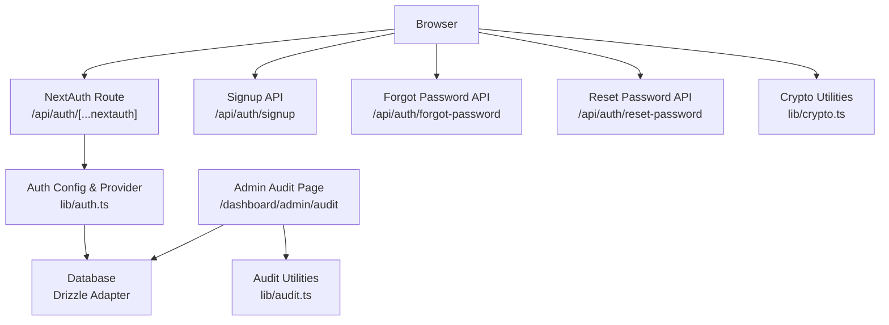
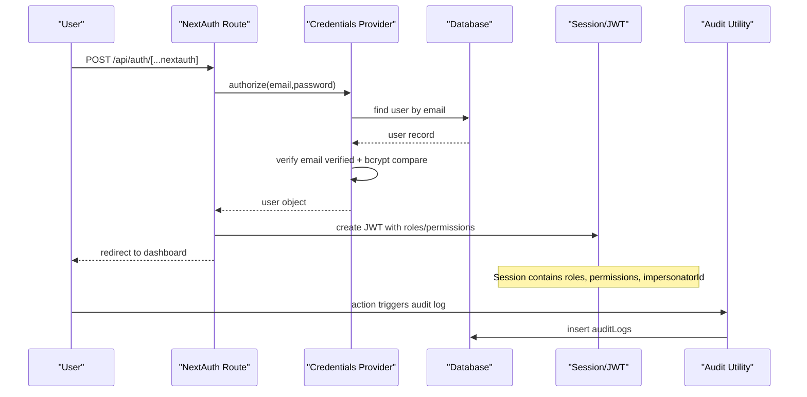
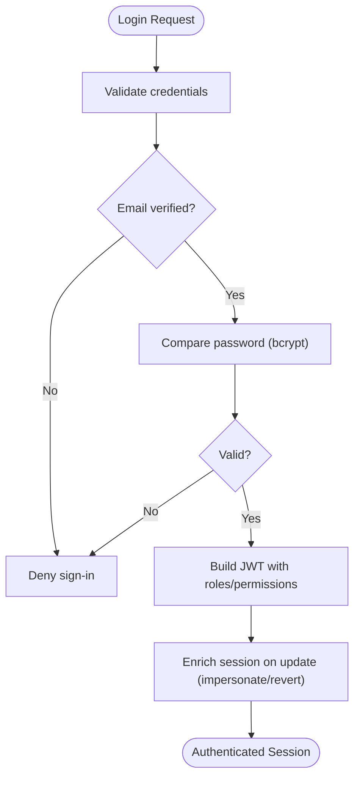
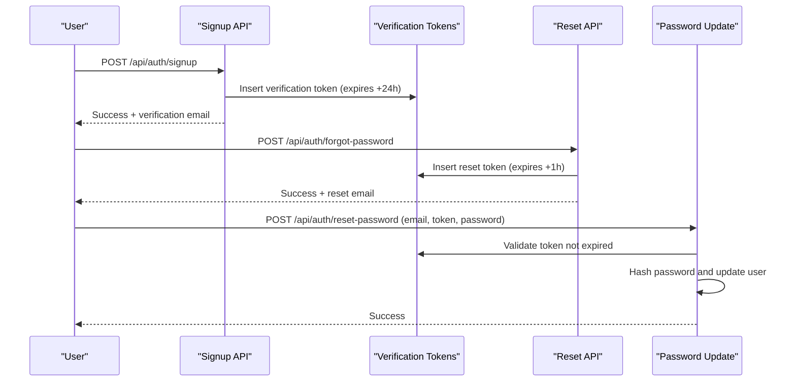
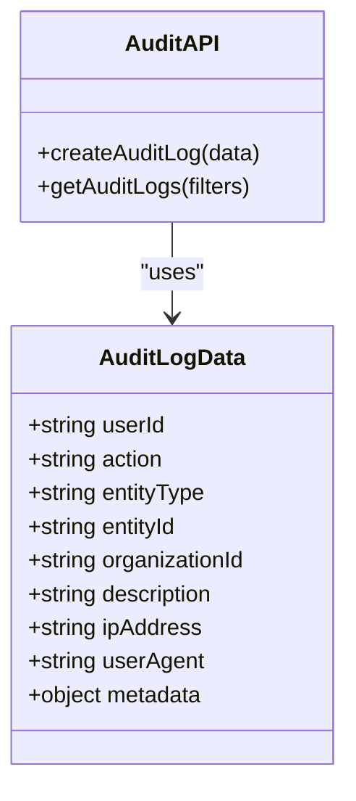
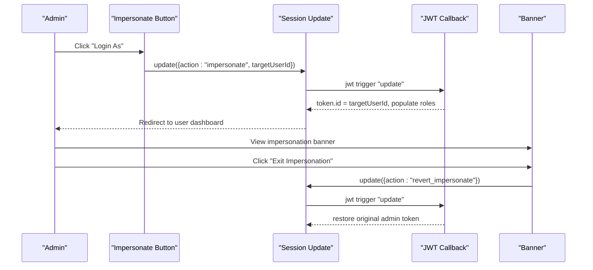
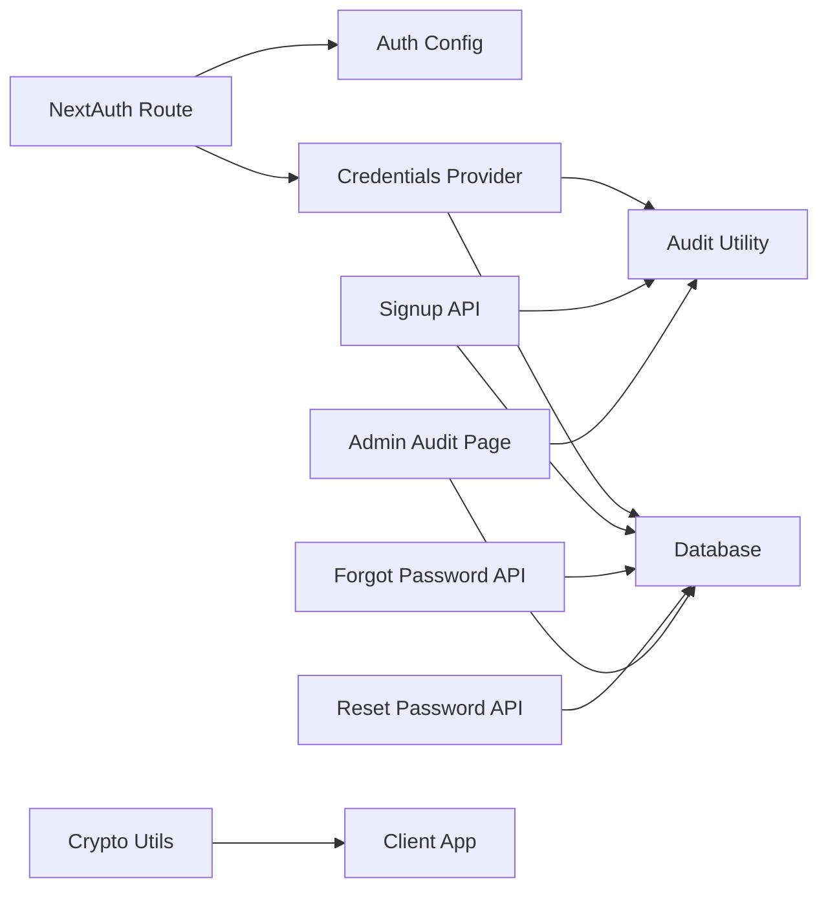

# Security & Audit Features

<cite>
**Referenced Files in This Document**
- [lib/auth.config.ts](file://lib/auth.config.ts)
- [lib/auth.ts](file://lib/auth.ts)
- [app/api/auth/[...nextauth]/route.ts](file://app/api/auth/[...nextauth]/route.ts)
- [lib/session.ts](file://lib/session.ts)
- [lib/audit.ts](file://lib/audit.ts)
- [lib/password-strength.ts](file://lib/password-strength.ts)
- [app/api/auth/signup/route.ts](file://app/api/auth/signup/route.ts)
- [app/api/auth/forgot-password/route.ts](file://app/api/auth/forgot-password/route.ts)
- [app/api/auth/reset-password/route.ts](file://app/api/auth/reset-password/route.ts)
- [components/admin/users/impersonate-button.tsx](file://components/admin/users/impersonate-button.tsx)
- [components/layout/impersonation-banner.tsx](file://components/layout/impersonation-banner.tsx)
- [app/dashboard/admin/audit/page.tsx](file://app/dashboard/admin/audit/page.tsx)
- [lib/crypto.ts](file://lib/crypto.ts)
</cite>

## Table of Contents
1. Introduction
2. Project Structure
3. Core Components
4. Architecture Overview
5. Detailed Component Analysis
6. Dependency Analysis
7. Performance Considerations
8. Troubleshooting Guide
9. Conclusion

## Introduction
This document explains the security and audit features of the TMC Portal’s user management system. It covers authentication mechanisms (password policies, session management), multi-factor considerations via end-to-end encryption for chat, audit logging for user actions and administrative changes, token management, session security, user impersonation for support, data protection and privacy controls, compliance guidance, incident response, account recovery, troubleshooting, and performance considerations for large-scale operations.

## Project Structure
Security-related functionality is implemented across:
- Authentication configuration and providers
- API routes for signup, password reset, and NextAuth endpoints
- Session utilities
- Audit logging utilities and admin UI
- Password strength validation
- End-to-end encryption utilities for secure messaging
- Impersonation components for admin support workflows

**Diagram sources**
- [app/api/auth/[...nextauth]/route.ts:1-8](file://app/api/auth/[...nextauth]/route.ts#L1-L8)
- [lib/auth.ts:131-257](file://lib/auth.ts#L131-L257)
- [app/api/auth/signup/route.ts:25-141](file://app/api/auth/signup/route.ts#L25-L141)
- [app/api/auth/forgot-password/route.ts:11-77](file://app/api/auth/forgot-password/route.ts#L11-L77)
- [app/api/auth/reset-password/route.ts:10-59](file://app/api/auth/reset-password/route.ts#L10-L59)
- [app/dashboard/admin/audit/page.tsx:13-47](file://app/dashboard/admin/audit/page.tsx#L13-L47)
- [lib/audit.ts:17-71](file://lib/audit.ts#L17-L71)
- [lib/crypto.ts:53-333](file://lib/crypto.ts#L53-L333)

**Section sources**
- [lib/auth.config.ts:1-12](file://lib/auth.config.ts#L1-L12)
- [lib/auth.ts:131-257](file://lib/auth.ts#L131-L257)
- [app/api/auth/[...nextauth]/route.ts:1-8](file://app/api/auth/[...nextauth]/route.ts#L1-L8)
- [lib/session.ts:1-16](file://lib/session.ts#L1-L16)
- [lib/audit.ts:17-71](file://lib/audit.ts#L17-L71)
- [lib/password-strength.ts:1-78](file://lib/password-strength.ts#L1-L78)
- [app/api/auth/signup/route.ts:25-141](file://app/api/auth/signup/route.ts#L25-L141)
- [app/api/auth/forgot-password/route.ts:11-77](file://app/api/auth/forgot-password/route.ts#L11-L77)
- [app/api/auth/reset-password/route.ts:10-59](file://app/api/auth/reset-password/route.ts#L10-L59)
- [components/admin/users/impersonate-button.tsx:10-39](file://components/admin/users/impersonate-button.tsx#L10-L39)
- [components/layout/impersonation-banner.tsx:10-51](file://components/layout/impersonation-banner.tsx#L10-L51)
- [app/dashboard/admin/audit/page.tsx:13-47](file://app/dashboard/admin/audit/page.tsx#L13-L47)
- [lib/crypto.ts:53-333](file://lib/crypto.ts#L53-L333)

## Core Components
- Authentication provider and JWT-based sessions with role/permission population
- Password hashing and verification using bcrypt
- Email verification tokens with expiration
- Password reset flow with time-limited tokens
- Audit logging utility to record actions with context
- Admin-only audit log viewer
- Impersonation workflow for super admins with revert capability
- Password strength validation and feedback
- End-to-end encryption utilities for secure messaging

Key responsibilities:
- lib/auth.ts: Configures NextAuth, credentials provider, JWT callbacks, session enrichment, and impersonation logic
- app/api/auth/*: Implements signup, forgot-password, reset-password flows with validation and token handling
- lib/audit.ts: Creates and queries audit logs
- lib/password-strength.ts: Evaluates password strength and provides UI hints
- components/*: Impersonation UI and banner
- app/dashboard/admin/audit/page.tsx: Secure admin view of audit logs
- lib/crypto.ts: E2EE primitives for message and key protection

**Section sources**
- [lib/auth.ts:131-257](file://lib/auth.ts#L131-L257)
- [app/api/auth/signup/route.ts:25-141](file://app/api/auth/signup/route.ts#L25-L141)
- [app/api/auth/forgot-password/route.ts:11-77](file://app/api/auth/forgot-password/route.ts#L11-L77)
- [app/api/auth/reset-password/route.ts:10-59](file://app/api/auth/reset-password/route.ts#L10-L59)
- [lib/audit.ts:17-71](file://lib/audit.ts#L17-L71)
- [lib/password-strength.ts:1-78](file://lib/password-strength.ts#L1-L78)
- [components/admin/users/impersonate-button.tsx:10-39](file://components/admin/users/impersonate-button.tsx#L10-L39)
- [components/layout/impersonation-banner.tsx:10-51](file://components/layout/impersonation-banner.tsx#L10-L51)
- [app/dashboard/admin/audit/page.tsx:13-47](file://app/dashboard/admin/audit/page.tsx#L13-L47)
- [lib/crypto.ts:53-333](file://lib/crypto.ts#L53-L333)

## Architecture Overview
The authentication architecture uses NextAuth v5 with a JWT strategy and Drizzle adapter. Credentials are validated server-side, passwords are hashed with bcrypt, and sessions carry roles, permissions, and optional impersonation context. Audit logs capture significant actions. Admins can impersonate users for support, with clear UI indicators and revert capability. Chat messages use client-side E2EE for confidentiality.

**Diagram sources**
- [app/api/auth/[...nextauth]/route.ts:1-8](file://app/api/auth/[...nextauth]/route.ts#L1-L8)
- [lib/auth.ts:146-183](file://lib/auth.ts#L146-L183)
- [lib/auth.ts:188-251](file://lib/auth.ts#L188-L251)
- [lib/audit.ts:17-34](file://lib/audit.ts#L17-L34)

## Detailed Component Analysis

### Authentication and Session Management
- JWT strategy configured; secret sourced from environment
- Credentials provider validates email existence, email verification status, and password via bcrypt
- JWT callback enriches token with roles, permissions, membership/officialship, and jurisdiction context
- Session callback propagates enriched data to client session
- Impersonation: super admins can switch context to a target user; revert restores original admin identity

**Diagram sources**
- [lib/auth.ts:146-183](file://lib/auth.ts#L146-L183)
- [lib/auth.ts:188-251](file://lib/auth.ts#L188-L251)

**Section sources**
- [lib/auth.config.ts:1-12](file://lib/auth.config.ts#L1-L12)
- [lib/auth.ts:131-257](file://lib/auth.ts#L131-L257)
- [lib/session.ts:1-16](file://lib/session.ts#L1-L16)

### Password Policies and Strength Validation
- Minimum length enforced at signup and reset endpoints
- Requirements include uppercase, lowercase, number, special character
- Strength calculator evaluates requirements, length bonus, and character variety; requires minimum threshold for acceptance
- UI helpers provide color and label feedback

Best practices:
- Enforce minimum length and complexity on both client and server
- Use bcrypt with appropriate cost factor for hashing
- Never store plaintext passwords

**Section sources**
- [lib/password-strength.ts:1-78](file://lib/password-strength.ts#L1-L78)
- [app/api/auth/signup/route.ts:15-23](file://app/api/auth/signup/route.ts#L15-L23)
- [app/api/auth/reset-password/route.ts:18-20](file://app/api/auth/reset-password/route.ts#L18-L20)
- [lib/auth.ts:169-173](file://lib/auth.ts#L169-L173)

### Account Verification and Recovery
- Signup generates a random verification token with 24-hour expiry and sends an email
- Login requires email verification; unverified accounts are blocked
- Forgot-password flow issues a time-limited reset token (1 hour) and sends a reset link
- Reset-password validates token, hashes new password, updates user, and deletes used token

**Diagram sources**
- [app/api/auth/signup/route.ts:51-106](file://app/api/auth/signup/route.ts#L51-L106)
- [app/api/auth/forgot-password/route.ts:29-66](file://app/api/auth/forgot-password/route.ts#L29-L66)
- [app/api/auth/reset-password/route.ts:22-48](file://app/api/auth/reset-password/route.ts#L22-L48)

**Section sources**
- [app/api/auth/signup/route.ts:25-141](file://app/api/auth/signup/route.ts#L25-L141)
- [app/api/auth/forgot-password/route.ts:11-77](file://app/api/auth/forgot-password/route.ts#L11-L77)
- [app/api/auth/reset-password/route.ts:10-59](file://app/api/auth/reset-password/route.ts#L10-L59)

### Audit Logging System
- Centralized utility to create audit logs with user, action, entity, organization, description, IP, user agent, and metadata
- Query helper supports filtering by user, organization, entity type/id, date range, pagination
- Admin audit page restricts access to super admins or specific roles and displays recent activity

**Diagram sources**
- [lib/audit.ts:5-71](file://lib/audit.ts#L5-L71)

**Section sources**
- [lib/audit.ts:17-71](file://lib/audit.ts#L17-L71)
- [app/dashboard/admin/audit/page.tsx:13-47](file://app/dashboard/admin/audit/page.tsx#L13-L47)

### User Impersonation for Support
- Super admins can impersonate a target user to debug issues
- Impersonation updates the session with target user context and records the original admin ID
- A visible banner indicates impersonation mode and allows reverting to the admin session
- All actions during impersonation should be audited to maintain accountability

**Diagram sources**
- [components/admin/users/impersonate-button.tsx:17-31](file://components/admin/users/impersonate-button.tsx#L17-L31)
- [lib/auth.ts:197-221](file://lib/auth.ts#L197-L221)
- [components/layout/impersonation-banner.tsx:17-31](file://components/layout/impersonation-banner.tsx#L17-L31)

**Section sources**
- [components/admin/users/impersonate-button.tsx:10-39](file://components/admin/users/impersonate-button.tsx#L10-L39)
- [lib/auth.ts:197-221](file://lib/auth.ts#L197-L221)
- [components/layout/impersonation-banner.tsx:10-51](file://components/layout/impersonation-banner.tsx#L10-L51)

### Data Protection and Privacy Controls
- Passwords are hashed server-side with bcrypt before storage
- Verification and reset tokens are time-bound and deleted after use
- End-to-end encryption for chat messages using Web Crypto API:
  - RSA key pairs generated per user
  - AES-GCM used for message content encryption
  - Private keys wrapped/unwrapped with PIN-derived keys
  - Recovery key generation for key recovery scenarios

Compliance notes:
- Ensure tokens are transmitted over HTTPS
- Limit retention of sensitive logs and enforce access controls
- Provide user consent and transparency for data collection

**Section sources**
- [lib/auth.ts:169-173](file://lib/auth.ts#L169-L173)
- [app/api/auth/signup/route.ts:51-83](file://app/api/auth/signup/route.ts#L51-L83)
- [app/api/auth/reset-password/route.ts:22-48](file://app/api/auth/reset-password/route.ts#L22-L48)
- [lib/crypto.ts:53-333](file://lib/crypto.ts#L53-L333)

### Multi-Factor Authentication Considerations
- The current implementation does not include a dedicated MFA step in the login flow
- For enhanced security, consider adding:
  - Time-based one-time passwords (TOTP) or SMS/email codes post-password verification
  - Device binding or hardware keys for privileged accounts
  - Risk-based adaptive authentication (e.g., challenge on unusual location)

[No sources needed since this section provides general guidance]

## Dependency Analysis

**Diagram sources**
- [app/api/auth/[...nextauth]/route.ts:1-8](file://app/api/auth/[...nextauth]/route.ts#L1-L8)
- [lib/auth.ts:131-257](file://lib/auth.ts#L131-L257)
- [app/api/auth/signup/route.ts:25-141](file://app/api/auth/signup/route.ts#L25-L141)
- [app/api/auth/forgot-password/route.ts:11-77](file://app/api/auth/forgot-password/route.ts#L11-L77)
- [app/api/auth/reset-password/route.ts:10-59](file://app/api/auth/reset-password/route.ts#L10-L59)
- [app/dashboard/admin/audit/page.tsx:13-47](file://app/dashboard/admin/audit/page.tsx#L13-L47)
- [lib/audit.ts:17-71](file://lib/audit.ts#L17-L71)
- [lib/crypto.ts:53-333](file://lib/crypto.ts#L53-L333)

**Section sources**
- [lib/auth.ts:131-257](file://lib/auth.ts#L131-L257)
- [lib/audit.ts:17-71](file://lib/audit.ts#L17-L71)
- [app/dashboard/admin/audit/page.tsx:13-47](file://app/dashboard/admin/audit/page.tsx#L13-L47)

## Performance Considerations
- Database queries:
  - Use indexed columns for lookups (e.g., email, userId, createdAt)
  - Paginate audit logs and limit result sets
- Authentication:
  - Avoid heavy computations in hot paths; keep JWT payloads minimal
  - Cache frequently accessed role/permission sets if needed
- Audit logging:
  - Batch writes where possible
  - Offload heavy logging to background workers if necessary
- Encryption:
  - E2EE operations run client-side; ensure efficient key derivation and avoid blocking UI threads
  - Reuse symmetric keys per session when feasible

[No sources needed since this section provides general guidance]

## Troubleshooting Guide
Common issues and resolutions:
- Sign-in fails due to unverified email:
  - Verify email through the provided link; ensure verification token has not expired
- Incorrect password errors:
  - Confirm correct credentials; check that password hashing is consistent
- Reset token invalid/expired:
  - Request a new reset link; tokens expire after one hour
- Impersonation not working:
  - Ensure caller is a super admin; confirm session update triggers and JWT callback handles impersonation/revert
- Audit logs missing:
  - Check database connectivity and error logs; audit creation swallows errors to avoid breaking flows

Operational tips:
- Monitor error logs around auth callbacks and audit creation
- Validate environment variables for secrets and URLs
- Restrict audit page access to authorized roles

**Section sources**
- [lib/auth.ts:165-173](file://lib/auth.ts#L165-L173)
- [app/api/auth/forgot-password/route.ts:29-66](file://app/api/auth/forgot-password/route.ts#L29-L66)
- [app/api/auth/reset-password/route.ts:22-48](file://app/api/auth/reset-password/route.ts#L22-L48)
- [lib/audit.ts:17-34](file://lib/audit.ts#L17-L34)
- [app/dashboard/admin/audit/page.tsx:13-29](file://app/dashboard/admin/audit/page.tsx#L13-L29)

## Conclusion
The TMC Portal implements robust authentication, secure password handling, token-based verification and recovery, comprehensive audit logging, and admin impersonation with clear safeguards. End-to-end encryption enhances privacy for sensitive communications. To further strengthen security, consider integrating multi-factor authentication, rate limiting, and enhanced monitoring. Regular audits, least-privilege access, and careful token management will help maintain compliance and resilience against incidents.