# User Management & Administration

<cite>
**Referenced Files in This Document**
- [app/api/members/route.ts](file://app/api/members/route.ts)
- [app/api/auth/signup/route.ts](file://app/api/auth/signup/route.ts)
- [lib/auth.ts](file://lib/auth.ts)
- [lib/session.ts](file://lib/session.ts)
- [lib/rbac-v2.ts](file://lib/rbac-v2.ts)
- [app/api/roles/route.ts](file://app/api/roles/route.ts)
- [app/dashboard/admin/users/page.tsx](file://app/dashboard/admin/users/page.tsx)
- [components/admin/users/edit-member-form.tsx](file://components/admin/users/edit-member-form.tsx)
- [components/admin/users/impersonate-button.tsx](file://components/admin/users/impersonate-button.tsx)
- [lib/db/schema.ts](file://lib/db/schema.ts)
- [lib/audit.ts](file://lib/audit.ts)
- [app/api/users/search/route.ts](file://app/api/users/search/route.ts)
</cite>

## Table of Contents
1. Introduction
2. Project Structure
3. Core Components
4. Architecture Overview
5. Detailed Component Analysis
6. Dependency Analysis
7. Performance Considerations
8. Troubleshooting Guide
9. Conclusion

## Introduction
This document explains the TMC Portal’s user management and administration features with a focus on member profiles, role assignments, status management, creation workflows, search/filtering, RBAC integration (including jurisdiction-aware permissions), security considerations, and administrative tools such as impersonation and audit logging. It is intended for both technical and non-technical readers to understand how users are created, managed, and governed across jurisdictions.

## Project Structure
User management spans server-side API routes, NextAuth session handling, RBAC enforcement, database schema definitions, admin UI pages, and reusable components:
- Authentication and sessions: credentials login, JWT population, and impersonation flow
- Member lifecycle: creation, listing, filtering by organization/status, and profile editing
- Roles and permissions: role CRUD, permission assignment, and jurisdiction checks
- Admin UI: user list, filters, export, and impersonation controls
- Audit logging: recording key actions for compliance and debugging

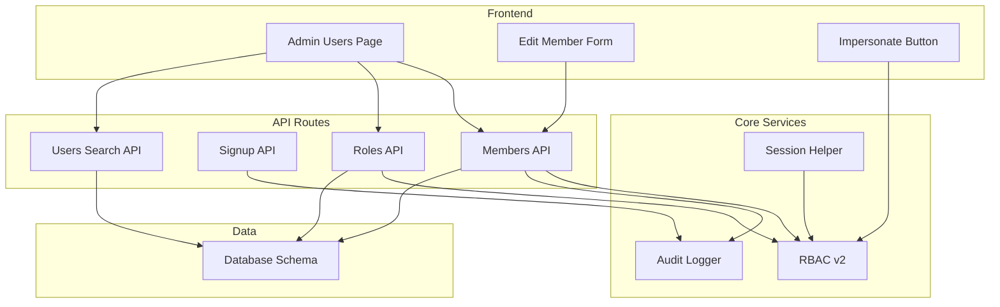

**Diagram sources**
- [app/dashboard/admin/users/page.tsx:1-345](file://app/dashboard/admin/users/page.tsx#L1-L345)
- [components/admin/users/edit-member-form.tsx:1-268](file://components/admin/users/edit-member-form.tsx#L1-L268)
- [components/admin/users/impersonate-button.tsx:1-40](file://components/admin/users/impersonate-button.tsx#L1-L40)
- [app/api/members/route.ts:1-203](file://app/api/members/route.ts#L1-L203)
- [app/api/auth/signup/route.ts:1-141](file://app/api/auth/signup/route.ts#L1-L141)
- [app/api/roles/route.ts:1-120](file://app/api/roles/route.ts#L1-L120)
- [app/api/users/search/route.ts:1-41](file://app/api/users/search/route.ts#L1-L41)
- [lib/session.ts:1-16](file://lib/session.ts#L1-L16)
- [lib/rbac-v2.ts:1-361](file://lib/rbac-v2.ts#L1-L361)
- [lib/audit.ts:1-74](file://lib/audit.ts#L1-L74)
- [lib/db/schema.ts:83-188](file://lib/db/schema.ts#L83-L188)

**Section sources**
- [app/dashboard/admin/users/page.tsx:1-345](file://app/dashboard/admin/users/page.tsx#L1-L345)
- [lib/db/schema.ts:83-188](file://lib/db/schema.ts#L83-L188)

## Core Components
- Members API: Lists members with pagination, filters by organization and status; creates new members with hashed passwords and generates unique member IDs; enforces organization access via RBAC.
- Signup API: Validates input, hashes password, creates user, stores verification token, sends verification email, and logs audit event.
- Session and Auth: Populates roles, permissions, and membership/official context into JWT; supports impersonation and revert flows.
- RBAC v2: Computes effective permissions from active roles and granted permissions; enforces jurisdiction-based access to organizations; provides helpers for permission and role checks.
- Roles API: Lists roles with counts; creates roles with validation, assigns permissions, and records audit events.
- Admin UI: Provides user listing with advanced filters (name/email, state/LGA/branch), pagination, CSV export, and impersonation controls.
- Edit Member Form: Client form to update member details with location hierarchy (state → LGA → branch).
- Audit Logging: Records actions like signups and member creation with contextual metadata.

**Section sources**
- [app/api/members/route.ts:1-203](file://app/api/members/route.ts#L1-L203)
- [app/api/auth/signup/route.ts:1-141](file://app/api/auth/signup/route.ts#L1-L141)
- [lib/auth.ts:32-129](file://lib/auth.ts#L32-L129)
- [lib/rbac-v2.ts:47-165](file://lib/rbac-v2.ts#L47-L165)
- [app/api/roles/route.ts:18-118](file://app/api/roles/route.ts#L18-L118)
- [app/dashboard/admin/users/page.tsx:36-210](file://app/dashboard/admin/users/page.tsx#L36-L210)
- [components/admin/users/edit-member-form.tsx:24-73](file://components/admin/users/edit-member-form.tsx#L24-L73)
- [lib/audit.ts:17-34](file://lib/audit.ts#L17-L34)

## Architecture Overview
The system uses Next.js API routes for operations, NextAuth for authentication and session management, Drizzle ORM for data access, and a custom RBAC layer for authorization. The admin UI composes server-rendered lists with client interactions for editing and impersonation.

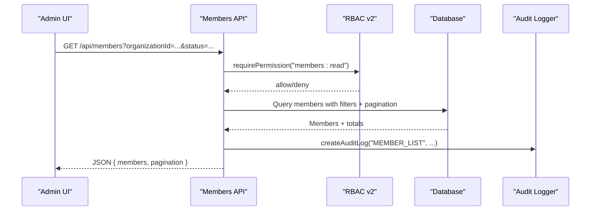

**Diagram sources**
- [app/api/members/route.ts:11-76](file://app/api/members/route.ts#L11-L76)
- [lib/rbac-v2.ts:313-337](file://lib/rbac-v2.ts#L313-L337)
- [lib/audit.ts:17-34](file://lib/audit.ts#L17-L34)

## Detailed Component Analysis

### User Creation Workflow (Public Signup)
- Input validation ensures required fields and minimum password length.
- Passwords are hashed before storage.
- A verification token is generated and stored with an expiration.
- A verification email is sent with a link to verify the account.
- An audit log entry records the signup action.

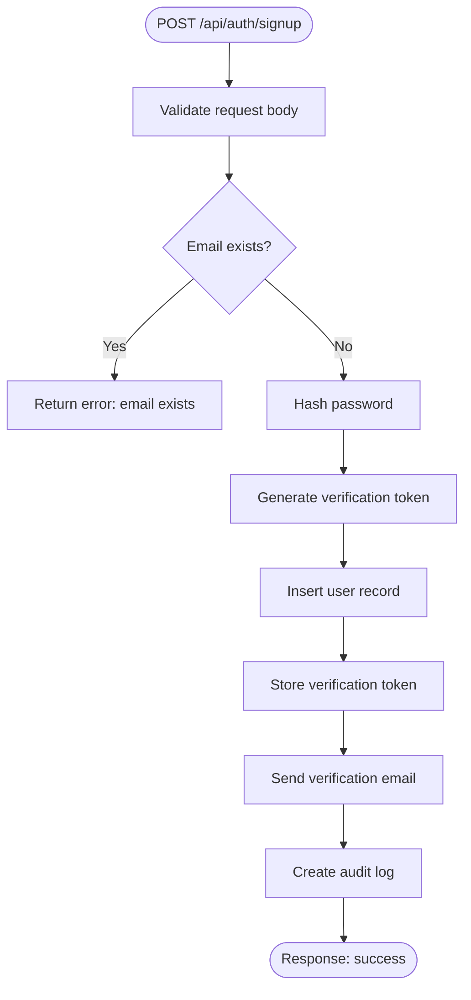

**Diagram sources**
- [app/api/auth/signup/route.ts:15-141](file://app/api/auth/signup/route.ts#L15-L141)
- [lib/audit.ts:17-34](file://lib/audit.ts#L17-L34)

**Section sources**
- [app/api/auth/signup/route.ts:15-141](file://app/api/auth/signup/route.ts#L15-L141)

### Member Creation and Organization Access
- Requires “members:create” permission.
- Validates organization access using RBAC jurisdiction rules.
- Checks for duplicate emails.
- Hashes password and generates a unique member ID based on organization code and count.
- Creates user and member records within a transaction.
- Logs the creation action.

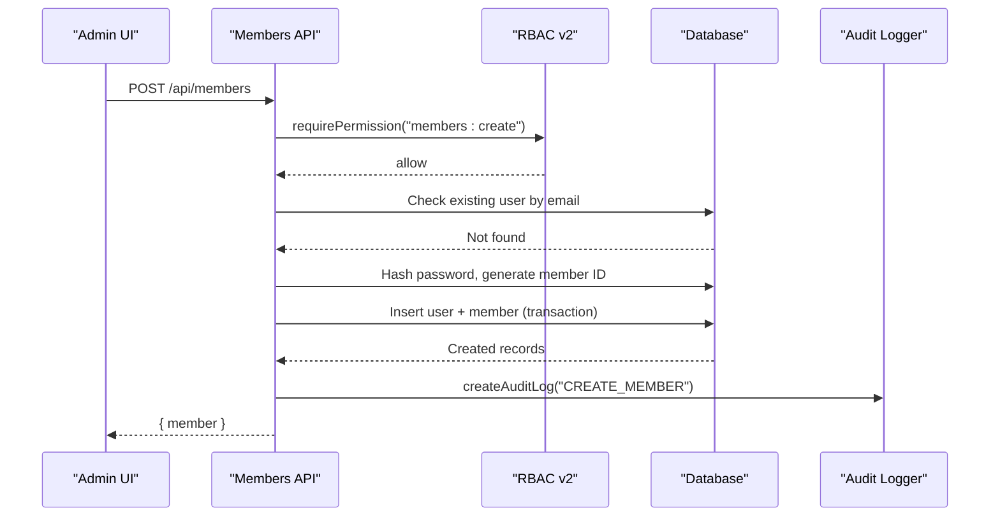

**Diagram sources**
- [app/api/members/route.ts:78-203](file://app/api/members/route.ts#L78-L203)
- [lib/rbac-v2.ts:313-337](file://lib/rbac-v2.ts#L313-L337)
- [lib/audit.ts:17-34](file://lib/audit.ts#L17-L34)

**Section sources**
- [app/api/members/route.ts:78-203](file://app/api/members/route.ts#L78-L203)

### Role-Based Access Control (RBAC) and Jurisdiction-Aware Permissions
- Effective permissions are computed from active user roles and granted permissions.
- Super-admin (SYSTEM level) has all permissions.
- When an organization is specified, access is validated against the user’s jurisdiction and organizational hierarchy.
- Helpers provide quick checks for specific permissions or roles.

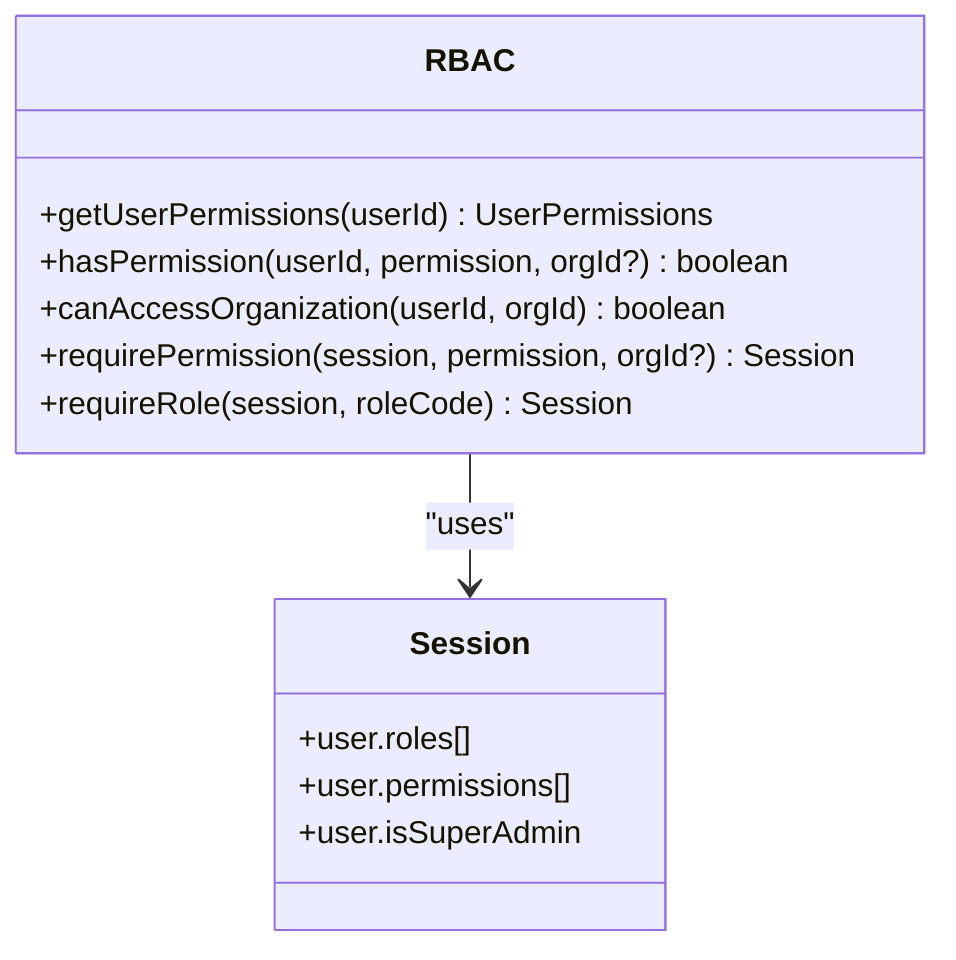

**Diagram sources**
- [lib/rbac-v2.ts:47-165](file://lib/rbac-v2.ts#L47-L165)
- [lib/rbac-v2.ts:313-358](file://lib/rbac-v2.ts#L313-L358)

**Section sources**
- [lib/rbac-v2.ts:47-165](file://lib/rbac-v2.ts#L47-L165)
- [lib/rbac-v2.ts:313-358](file://lib/rbac-v2.ts#L313-L358)

### Role Management and Permission Assignment
- List roles with associated permissions and user counts.
- Create roles with validated inputs, unique codes, and optional permission sets.
- Persist role and permissions in a transaction and log the action.

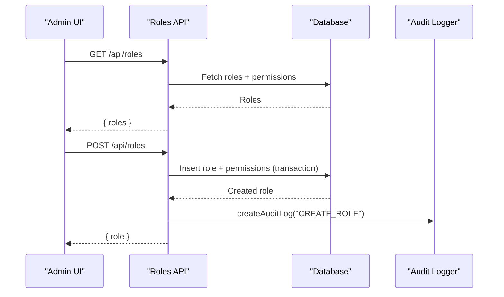

**Diagram sources**
- [app/api/roles/route.ts:18-118](file://app/api/roles/route.ts#L18-L118)
- [lib/audit.ts:17-34](file://lib/audit.ts#L17-L34)

**Section sources**
- [app/api/roles/route.ts:18-118](file://app/api/roles/route.ts#L18-L118)

### Admin User Listing, Filtering, and Export
- Server-side query supports name/email search and filters by state, LGA, branch, and membership status.
- Pagination returns total counts and page metadata.
- CSV export includes matching users up to a defined limit.

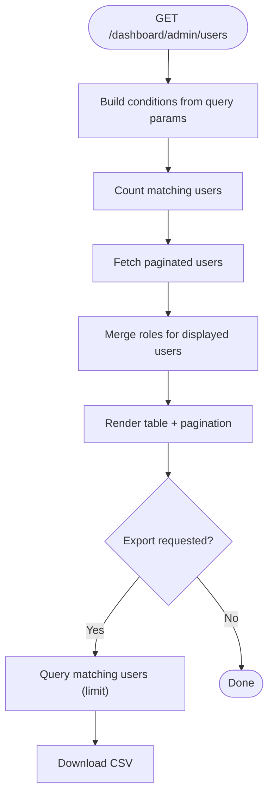

**Diagram sources**
- [app/dashboard/admin/users/page.tsx:36-210](file://app/dashboard/admin/users/page.tsx#L36-L210)
- [app/dashboard/admin/users/page.tsx:302-343](file://app/dashboard/admin/users/page.tsx#L302-L343)

**Section sources**
- [app/dashboard/admin/users/page.tsx:36-210](file://app/dashboard/admin/users/page.tsx#L36-L210)
- [app/dashboard/admin/users/page.tsx:302-343](file://app/dashboard/admin/users/page.tsx#L302-L343)

### Member Profile Editing
- Client form validates fields and updates member details.
- Location hierarchy (state → LGA → branch) drives dynamic selection.
- Success feedback via toast notifications.

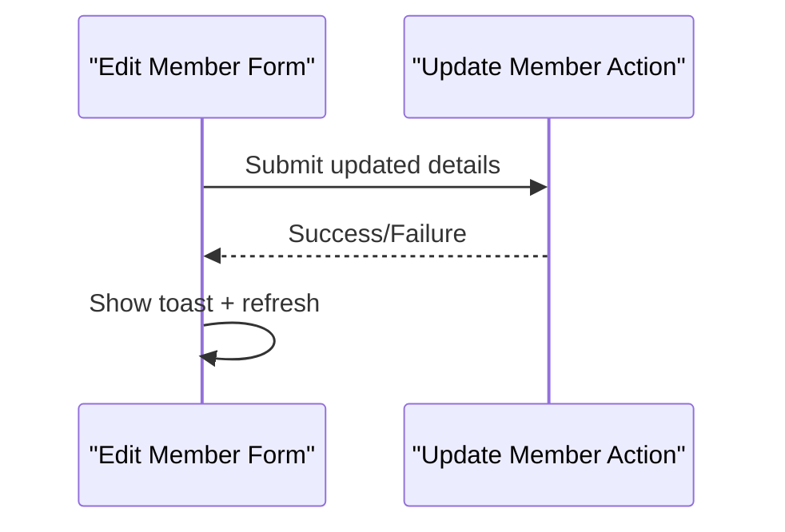

**Diagram sources**
- [components/admin/users/edit-member-form.tsx:24-73](file://components/admin/users/edit-member-form.tsx#L24-L73)

**Section sources**
- [components/admin/users/edit-member-form.tsx:24-73](file://components/admin/users/edit-member-form.tsx#L24-L73)

### Impersonation and Revert Flow
- Super-admin can impersonate another user to troubleshoot issues.
- Session update triggers JWT callback to switch identity and re-populate roles/permissions.
- Revert restores original admin context.

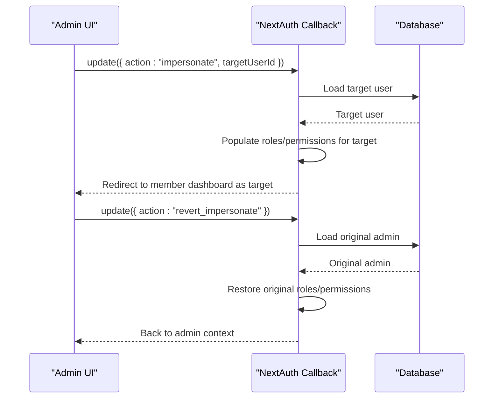

**Diagram sources**
- [components/admin/users/impersonate-button.tsx:10-39](file://components/admin/users/impersonate-button.tsx#L10-L39)
- [lib/auth.ts:197-221](file://lib/auth.ts#L197-L221)

**Section sources**
- [components/admin/users/impersonate-button.tsx:10-39](file://components/admin/users/impersonate-button.tsx#L10-L39)
- [lib/auth.ts:197-221](file://lib/auth.ts#L197-L221)

### Data Models and Relationships
Key entities include users, members, organizations, roles, userRoles, rolePermissions, and permissions. Enums define statuses, levels, and types used across the system.

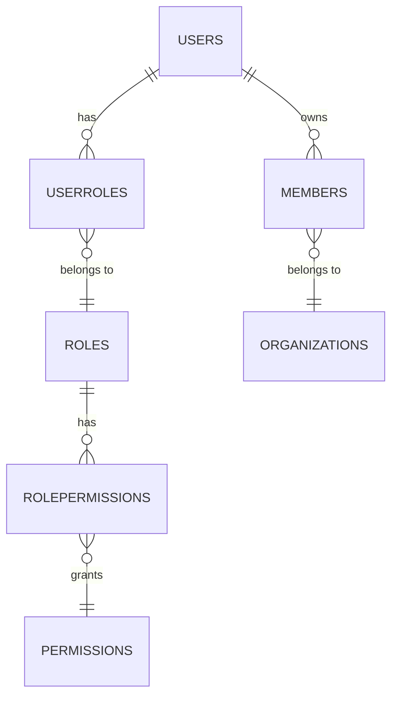

**Diagram sources**
- [lib/db/schema.ts:83-188](file://lib/db/schema.ts#L83-L188)

**Section sources**
- [lib/db/schema.ts:83-188](file://lib/db/schema.ts#L83-L188)

## Dependency Analysis
- API routes depend on session helper for authenticated context and RBAC for authorization.
- Admin UI depends on API routes and reusable components for forms and dialogs.
- RBAC depends on database schema for roles, permissions, and organization hierarchy.
- Audit logging is invoked by critical operations (signup, member creation, role creation).

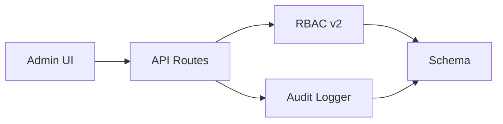

**Diagram sources**
- [app/dashboard/admin/users/page.tsx:1-345](file://app/dashboard/admin/users/page.tsx#L1-L345)
- [app/api/members/route.ts:1-203](file://app/api/members/route.ts#L1-L203)
- [lib/rbac-v2.ts:1-361](file://lib/rbac-v2.ts#L1-L361)
- [lib/audit.ts:1-74](file://lib/audit.ts#L1-L74)
- [lib/db/schema.ts:83-188](file://lib/db/schema.ts#L83-L188)

**Section sources**
- [app/api/members/route.ts:1-203](file://app/api/members/route.ts#L1-L203)
- [lib/rbac-v2.ts:1-361](file://lib/rbac-v2.ts#L1-L361)
- [lib/audit.ts:1-74](file://lib/audit.ts#L1-L74)

## Performance Considerations
- Use pagination and offset for large user/member lists to reduce payload size.
- Prefer server-side filtering to minimize client processing.
- Batch queries where possible (e.g., fetch roles for a subset of users after initial list).
- Limit export sizes to avoid memory pressure (current implementation caps at a reasonable limit).
- Avoid N+1 queries by preloading related data when necessary.

[No sources needed since this section provides general guidance]

## Troubleshooting Guide
Common issues and resolutions:
- Unauthorized or Forbidden errors: Ensure the session is present and the user has the required permission; check RBAC middleware usage in API routes.
- Email verification required: Login requires verified email; ensure verification tokens exist and emails are sent.
- Organization access denied: Verify that the user’s role jurisdiction covers the target organization; confirm organization hierarchy and role assignments.
- Duplicate email during member creation: Check for existing users before creating new accounts.
- Audit logs missing: Audit logging failures are logged but do not break the app; inspect server logs for insertion errors.

**Section sources**
- [lib/rbac-v2.ts:313-358](file://lib/rbac-v2.ts#L313-L358)
- [lib/auth.ts:146-183](file://lib/auth.ts#L146-L183)
- [app/api/members/route.ts:97-110](file://app/api/members/route.ts#L97-L110)
- [lib/audit.ts:17-34](file://lib/audit.ts#L17-L34)

## Conclusion
The TMC Portal provides a robust user management and administration system with strong RBAC support, jurisdiction-aware access control, and comprehensive audit logging. Administrators can create and manage members, assign roles and permissions, filter and export user data, and use impersonation for troubleshooting. Security is enforced through password hashing, email verification, and strict permission checks. For best results, follow the recommended patterns for pagination, filtering, and auditing to maintain performance and compliance.

[No sources needed since this section summarizes without analyzing specific files]