# User Profiles & Operations

<cite>
**Referenced Files in This Document**
- [app/api/users/route.ts](file://app/api/users/route.ts)
- [app/api/users/search/route.ts](file://app/api/users/search/route.ts)
- [app/dashboard/admin/users/page.tsx](file://app/dashboard/admin/users/page.tsx)
- [app/dashboard/admin/users/[id]/page.tsx](file://app/dashboard/admin/users/[id]/page.tsx)
- [components/admin/users/impersonate-button.tsx](file://components/admin/users/impersonate-button.tsx)
- [app/dashboard/member/profile/page.tsx](file://app/dashboard/member/profile/page.tsx)
- [app/api/members/[id]/status/route.ts](file://app/api/members/[id]/status/route.ts)
- [app/api/members/apply/route.ts](file://app/api/members/apply/route.ts)
- [lib/actions/settings.ts](file://lib/actions/settings.ts)
- [lib/actions/members.ts](file://lib/actions/members.ts)
- [prisma/schema.prisma](file://prisma/schema.prisma)
</cite>

## Table of Contents
1. Introduction
2. Project Structure
3. Core Components
4. Architecture Overview
5. Detailed Component Analysis
6. Dependency Analysis
7. Performance Considerations
8. Troubleshooting Guide
9. Conclusion

## Introduction
This document explains how user profiles and operations are implemented in the TMC Portal. It covers member profile display, editing capabilities, status management, user creation workflows with validation, search and filtering, bulk export, role assignment, and impersonation for support. It also outlines privacy and security considerations and provides guidance for common tasks and troubleshooting.

## Project Structure
User profile and operations span server routes, dashboard pages, and reusable components:
- API endpoints for listing users, searching, and changing membership status
- Admin dashboard pages to list, filter, export, and manage users and roles
- Member-facing profile page to view personal details and membership card
- Impersonation component for support staff to act as a user
- Server actions for settings and statistics

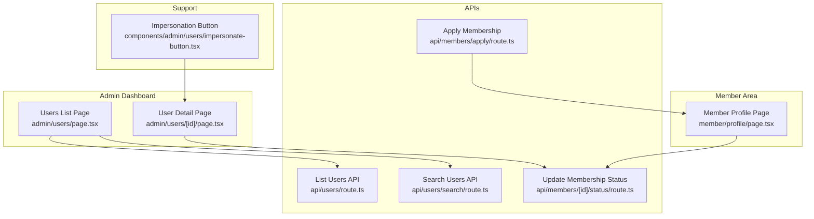

**Diagram sources**
- [app/dashboard/admin/users/page.tsx:1-345](file://app/dashboard/admin/users/page.tsx#L1-L345)
- [app/dashboard/admin/users/[id]/page.tsx:1-176](file://app/dashboard/admin/users/[id]/page.tsx#L1-L176)
- [app/api/users/route.ts:1-57](file://app/api/users/route.ts#L1-L57)
- [app/api/users/search/route.ts:1-41](file://app/api/users/search/route.ts#L1-L41)
- [app/api/members/[id]/status/route.ts:1-37](file://app/api/members/[id]/status/route.ts#L1-L37)
- [app/api/members/apply/route.ts:36-172](file://app/api/members/apply/route.ts#L36-L172)
- [app/dashboard/member/profile/page.tsx:1-176](file://app/dashboard/member/profile/page.tsx#L1-L176)
- [components/admin/users/impersonate-button.tsx:1-40](file://components/admin/users/impersonate-button.tsx#L1-L40)

**Section sources**
- [app/dashboard/admin/users/page.tsx:1-345](file://app/dashboard/admin/users/page.tsx#L1-L345)
- [app/dashboard/admin/users/[id]/page.tsx:1-176](file://app/dashboard/admin/users/[id]/page.tsx#L1-L176)
- [app/api/users/route.ts:1-57](file://app/api/users/route.ts#L1-L57)
- [app/api/users/search/route.ts:1-41](file://app/api/users/search/route.ts#L1-L41)
- [app/api/members/[id]/status/route.ts:1-37](file://app/api/members/[id]/status/route.ts#L1-L37)
- [app/api/members/apply/route.ts:36-172](file://app/api/members/apply/route.ts#L36-L172)
- [app/dashboard/member/profile/page.tsx:1-176](file://app/dashboard/member/profile/page.tsx#L1-L176)
- [components/admin/users/impersonate-button.tsx:1-40](file://components/admin/users/impersonate-button.tsx#L1-L40)

## Core Components
- User listing and filtering: The admin users page queries users with optional filters (name/email, state, LGA, branch), supports pagination, and includes CSV export.
- User detail and role management: The user detail page shows assigned roles, allows assigning/removing roles, and exposes an edit form for member details when available.
- Member profile view: Displays member ID, status, organization affiliation, and a membership card preview; supports image upload via a dedicated component.
- Membership application: Validates input, checks registration settings, creates a pending member record, and sets initial metadata.
- Membership status updates: Updates member status and notifies relevant parties.
- Impersonation: Allows super admins to switch context to another user for debugging/support.

**Section sources**
- [app/dashboard/admin/users/page.tsx:52-140](file://app/dashboard/admin/users/page.tsx#L52-L140)
- [app/dashboard/admin/users/page.tsx:237-343](file://app/dashboard/admin/users/page.tsx#L237-L343)
- [app/dashboard/admin/users/[id]/page.tsx:22-75](file://app/dashboard/admin/users/[id]/page.tsx#L22-L75)
- [app/dashboard/admin/users/[id]/page.tsx:91-170](file://app/dashboard/admin/users/[id]/page.tsx#L91-L170)
- [app/dashboard/member/profile/page.tsx:15-70](file://app/dashboard/member/profile/page.tsx#L15-L70)
- [app/dashboard/member/profile/page.tsx:72-171](file://app/dashboard/member/profile/page.tsx#L72-L171)
- [app/api/members/apply/route.ts:48-172](file://app/api/members/apply/route.ts#L48-L172)
- [app/api/members/[id]/status/route.ts:11-37](file://app/api/members/[id]/status/route.ts#L11-L37)
- [components/admin/users/impersonate-button.tsx:10-39](file://components/admin/users/impersonate-button.tsx#L10-L39)

## Architecture Overview
The system uses Next.js App Router server components for data fetching and client components for interactivity. APIs enforce permissions and validate inputs. Data is stored using Drizzle ORM against a relational database.

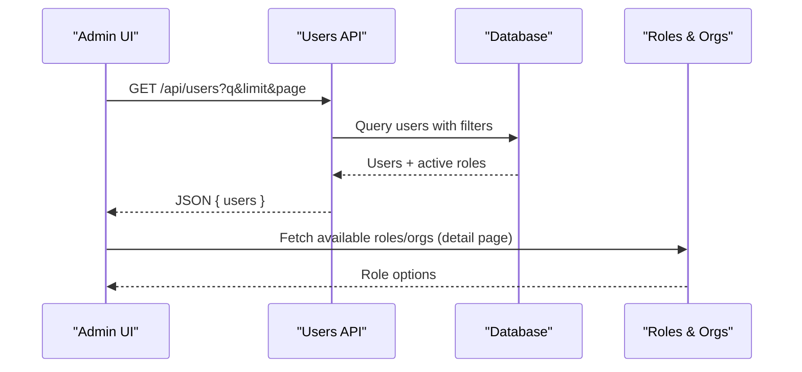

**Diagram sources**
- [app/api/users/route.ts:8-51](file://app/api/users/route.ts#L8-L51)
- [app/dashboard/admin/users/[id]/page.tsx:58-74](file://app/dashboard/admin/users/[id]/page.tsx#L58-L74)

## Detailed Component Analysis

### Admin Users List and Filtering
- Search by name or email
- Filter by state, LGA, branch from member metadata
- Pagination with total count
- CSV export of matching users (up to a limit)

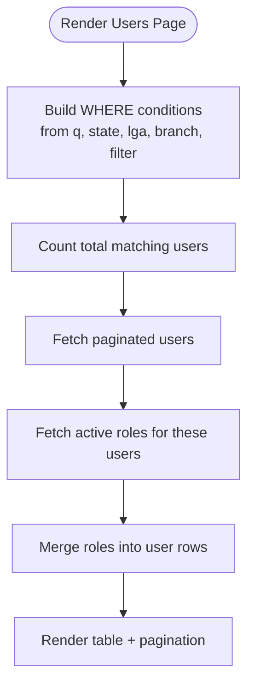

**Diagram sources**
- [app/dashboard/admin/users/page.tsx:66-139](file://app/dashboard/admin/users/page.tsx#L66-L139)
- [app/dashboard/admin/users/page.tsx:141-210](file://app/dashboard/admin/users/page.tsx#L141-L210)

**Section sources**
- [app/dashboard/admin/users/page.tsx:52-140](file://app/dashboard/admin/users/page.tsx#L52-L140)
- [app/dashboard/admin/users/page.tsx:237-343](file://app/dashboard/admin/users/page.tsx#L237-L343)

### User Detail and Role Management
- Displays user info and assigned roles with jurisdiction and organization context
- Provides assign/remove role forms
- When a member exists, exposes an edit form for member details

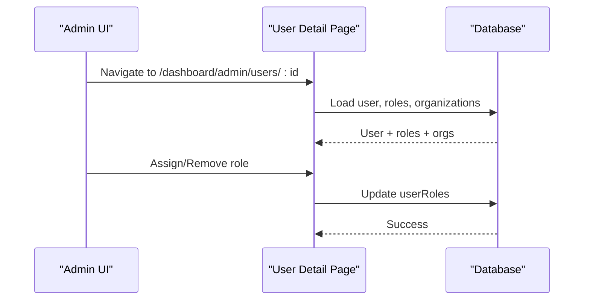

**Diagram sources**
- [app/dashboard/admin/users/[id]/page.tsx:22-75](file://app/dashboard/admin/users/[id]/page.tsx#L22-L75)
- [app/dashboard/admin/users/[id]/page.tsx:91-170](file://app/dashboard/admin/users/[id]/page.tsx#L91-L170)

**Section sources**
- [app/dashboard/admin/users/[id]/page.tsx:22-75](file://app/dashboard/admin/users/[id]/page.tsx#L22-L75)
- [app/dashboard/admin/users/[id]/page.tsx:91-170](file://app/dashboard/admin/users/[id]/page.tsx#L91-L170)

### Member Profile View
- Shows member ID, status badge, organization affiliation
- Displays membership card preview with jurisdiction details
- Supports profile image upload

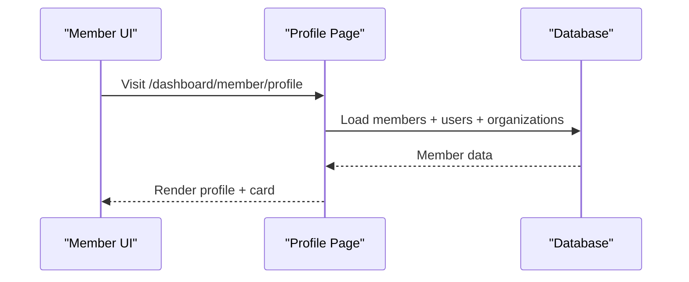

**Diagram sources**
- [app/dashboard/member/profile/page.tsx:15-70](file://app/dashboard/member/profile/page.tsx#L15-L70)
- [app/dashboard/member/profile/page.tsx:72-171](file://app/dashboard/member/profile/page.tsx#L72-L171)

**Section sources**
- [app/dashboard/member/profile/page.tsx:15-70](file://app/dashboard/member/profile/page.tsx#L15-L70)
- [app/dashboard/member/profile/page.tsx:72-171](file://app/dashboard/member/profile/page.tsx#L72-L171)

### Membership Application Workflow
- Validates form fields
- Checks if public registration is enabled via settings
- Creates a new member with PENDING status and metadata
- Redirects to member dashboard after submission

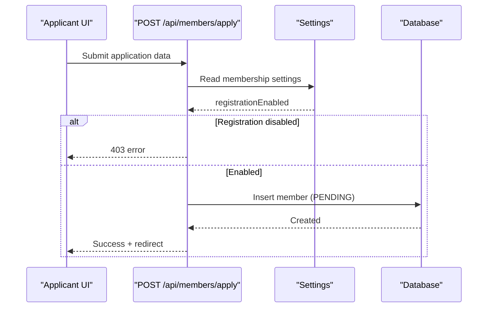

**Diagram sources**
- [app/api/members/apply/route.ts:48-172](file://app/api/members/apply/route.ts#L48-L172)
- [lib/actions/settings.ts:110-143](file://lib/actions/settings.ts#L110-L143)

**Section sources**
- [app/api/members/apply/route.ts:48-172](file://app/api/members/apply/route.ts#L48-L172)
- [lib/actions/settings.ts:110-143](file://lib/actions/settings.ts#L110-L143)

### Membership Status Management
- Endpoint to update member status with authorization checks
- Can trigger notifications and generate IDs as needed

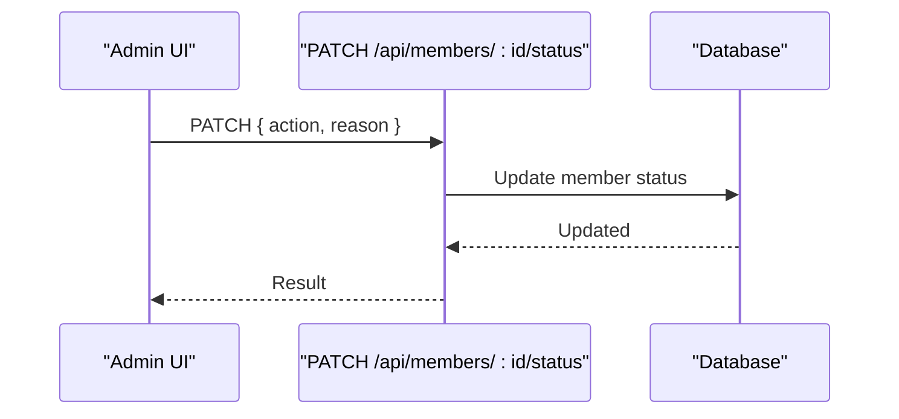

**Diagram sources**
- [app/api/members/[id]/status/route.ts:11-37](file://app/api/members/[id]/status/route.ts#L11-L37)

**Section sources**
- [app/api/members/[id]/status/route.ts:11-37](file://app/api/members/[id]/status/route.ts#L11-L37)

### User Impersonation for Support
- Super admin can impersonate a user to debug issues
- Uses session update to switch context and navigates to member area

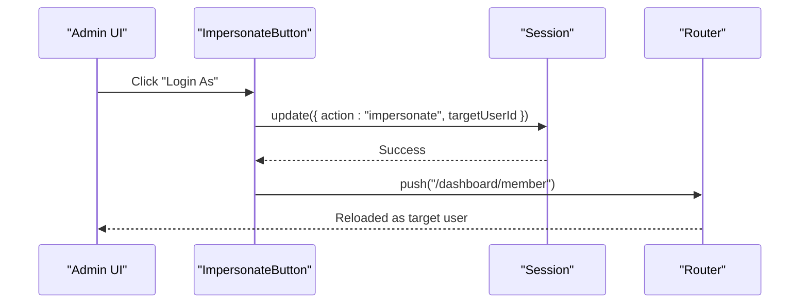

**Diagram sources**
- [components/admin/users/impersonate-button.tsx:10-39](file://components/admin/users/impersonate-button.tsx#L10-L39)

**Section sources**
- [components/admin/users/impersonate-button.tsx:10-39](file://components/admin/users/impersonate-button.tsx#L10-L39)

### User Search and Filtering
- Dedicated search endpoint returns limited results for autocomplete-style usage
- Admin list supports advanced filtering by location metadata and non-members

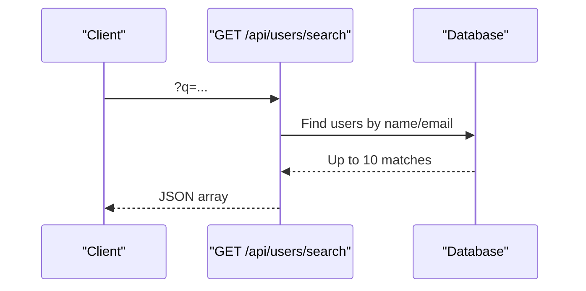

**Diagram sources**
- [app/api/users/search/route.ts:7-39](file://app/api/users/search/route.ts#L7-L39)

**Section sources**
- [app/api/users/search/route.ts:7-39](file://app/api/users/search/route.ts#L7-L39)
- [app/dashboard/admin/users/page.tsx:66-82](file://app/dashboard/admin/users/page.tsx#L66-L82)

### Bulk Operations and Export
- CSV export of filtered users for reporting
- Statistics helpers for totals and non-members

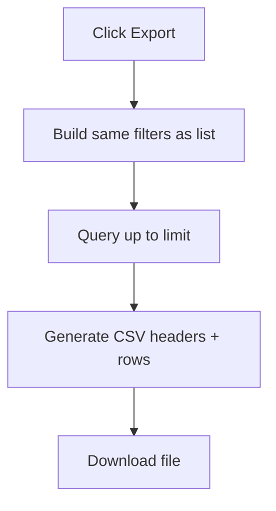

**Diagram sources**
- [app/dashboard/admin/users/page.tsx:302-343](file://app/dashboard/admin/users/page.tsx#L302-L343)
- [lib/actions/members.ts:8-35](file://lib/actions/members.ts#L8-L35)

**Section sources**
- [app/dashboard/admin/users/page.tsx:302-343](file://app/dashboard/admin/users/page.tsx#L302-L343)
- [lib/actions/members.ts:8-35](file://lib/actions/members.ts#L8-L35)

## Dependency Analysis
Key relationships:
- Admin pages depend on API endpoints and direct DB access for performance
- Role assignment depends on roles and organizations tables
- Membership application depends on settings and organizations
- Status updates depend on members and notifications

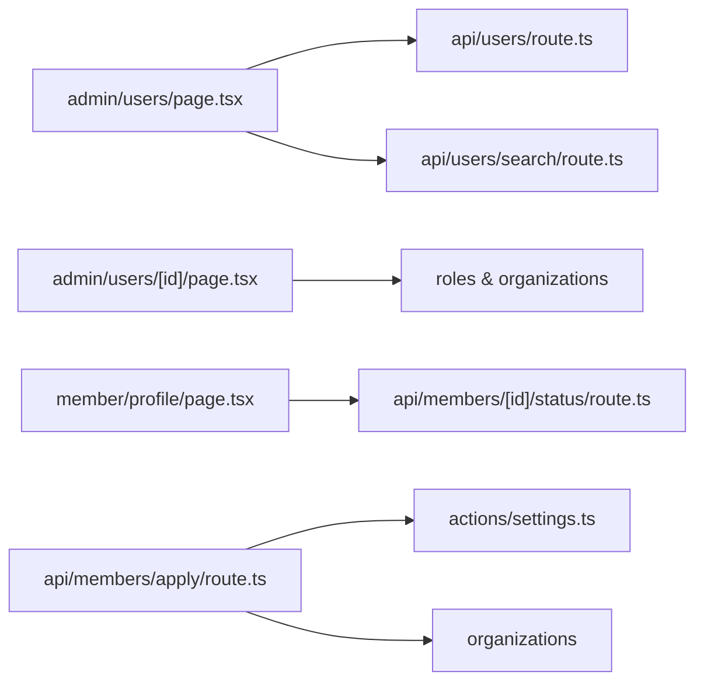

**Diagram sources**
- [app/dashboard/admin/users/page.tsx:1-345](file://app/dashboard/admin/users/page.tsx#L1-L345)
- [app/dashboard/admin/users/[id]/page.tsx:1-176](file://app/dashboard/admin/users/[id]/page.tsx#L1-L176)
- [app/dashboard/member/profile/page.tsx:1-176](file://app/dashboard/member/profile/page.tsx#L1-L176)
- [app/api/members/apply/route.ts:36-172](file://app/api/members/apply/route.ts#L36-L172)
- [lib/actions/settings.ts:110-143](file://lib/actions/settings.ts#L110-L143)

**Section sources**
- [app/dashboard/admin/users/page.tsx:1-345](file://app/dashboard/admin/users/page.tsx#L1-L345)
- [app/dashboard/admin/users/[id]/page.tsx:1-176](file://app/dashboard/admin/users/[id]/page.tsx#L1-L176)
- [app/dashboard/member/profile/page.tsx:1-176](file://app/dashboard/member/profile/page.tsx#L1-L176)
- [app/api/members/apply/route.ts:36-172](file://app/api/members/apply/route.ts#L36-L172)
- [lib/actions/settings.ts:110-143](file://lib/actions/settings.ts#L110-L143)

## Performance Considerations
- Use server-side filtering and pagination to reduce payload size
- Limit export size to prevent large downloads
- Prefer direct DB queries in server components for speed
- Avoid N+1 queries by batching role fetches per user list

[No sources needed since this section provides general guidance]

## Troubleshooting Guide
- Unauthorized errors: Ensure session exists and required permissions are granted before calling APIs
- Empty search results: Verify query length and filters; some endpoints require minimum characters
- Registration closed: If membership application fails with a configuration error, check membership settings
- Missing organization: Ensure at least one organization exists to link memberships
- Impersonation not working: Confirm current user has super admin rights and session update succeeds

**Section sources**
- [app/api/users/route.ts:8-16](file://app/api/users/route.ts#L8-L16)
- [app/api/users/search/route.ts:7-18](file://app/api/users/search/route.ts#L7-L18)
- [app/api/members/apply/route.ts:58-65](file://app/api/members/apply/route.ts#L58-L65)
- [app/api/members/apply/route.ts:136-152](file://app/api/members/apply/route.ts#L136-L152)
- [components/admin/users/impersonate-button.tsx:10-15](file://components/admin/users/impersonate-button.tsx#L10-L15)

## Conclusion
The TMC Portal provides a robust set of tools for managing user profiles and operations. Administrators can list, filter, export, and manage roles for users; members can view and update their profiles; and support staff can impersonate users for troubleshooting. Security is enforced via sessions and permissions, while performance is optimized through server-side processing and efficient queries.

[No sources needed since this section summarizes without analyzing specific files]