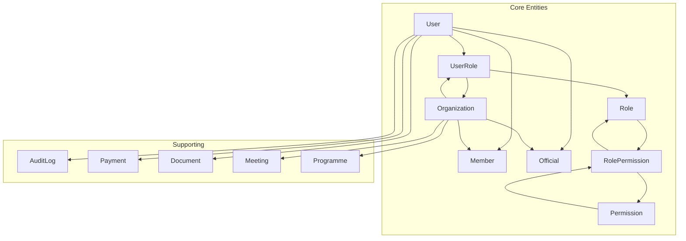
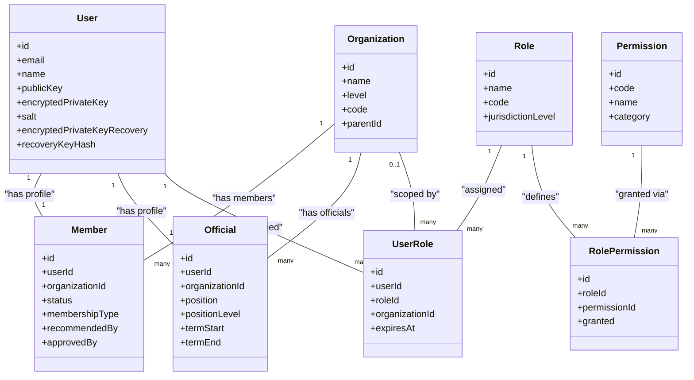
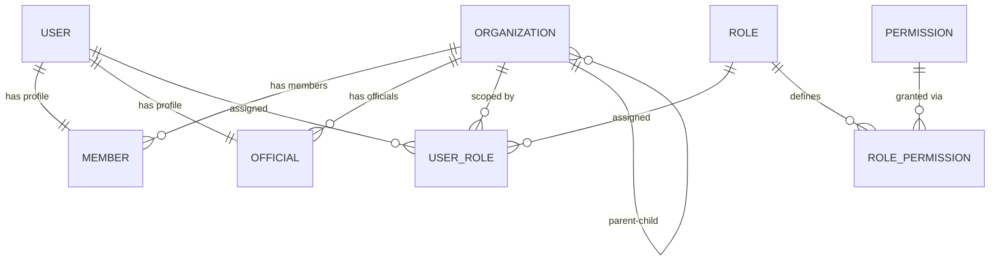
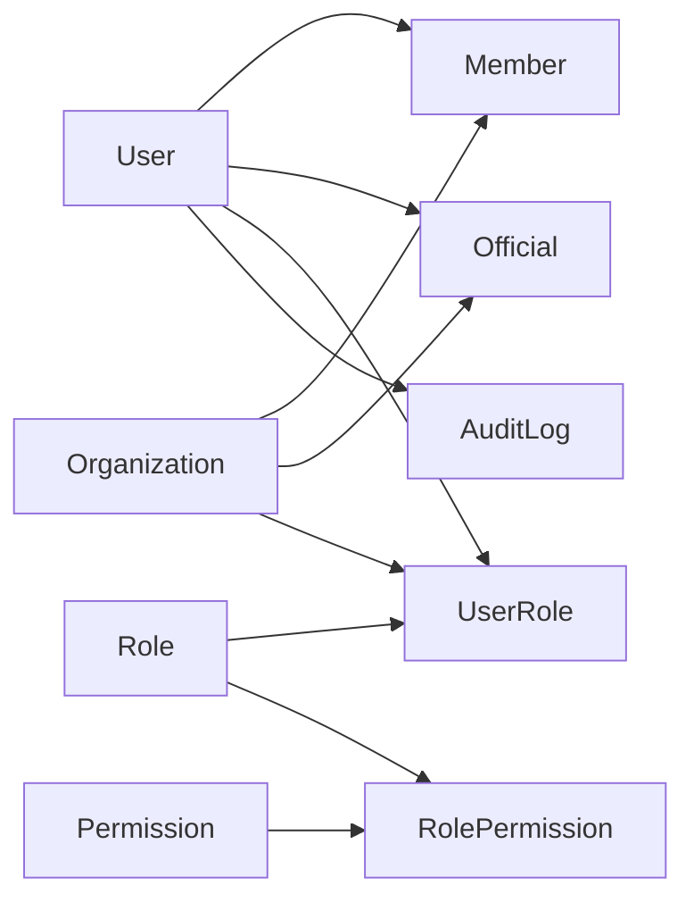

# Core Entity Models & Relationships

<cite>
**Referenced Files in This Document**
- [prisma/schema.prisma](file://prisma/schema.prisma)
- [drizzle/0000_giant_demogoblin.sql](file://drizzle/0000_giant_demogoblin.sql)
- [lib/rbac-v2.ts](file://lib/rbac-v2.ts)
- [lib/crypto.ts](file://lib/crypto.ts)
- [lib/audit.ts](file://lib/audit.ts)
- [app/api/users/[id]/roles/route.ts](file://app/api/users/[id]/roles/route.ts)
- [app/dashboard/admin/jurisdictions/actions.ts](file://app/dashboard/admin/jurisdictions/actions.ts)
</cite>

## Table of Contents
1. Introduction
2. Project Structure
3. Core Components
4. Architecture Overview
5. Detailed Component Analysis
6. Dependency Analysis
7. Performance Considerations
8. Troubleshooting Guide
9. Conclusion

## Introduction
This document provides comprehensive data model documentation for the core entities in TMC Portal with a focus on Users, Organizations, Members, Officials, and their relationships. It details field definitions, constraints, validation rules, hierarchical organization structure, membership lifecycle states, official appointment workflows, role-based access control foundations, entity relationship diagrams, indexing strategies, performance optimizations, query patterns, and security measures including encryption fields for end-to-end encryption (E2EE) support and audit logging capabilities.

## Project Structure
The data model is defined using Prisma and mirrored in Drizzle migrations. The schema defines core entities such as User, Organization, Member, Official, Role, Permission, UserRole, RolePermission, and supporting tables for payments, documents, audit logs, meetings, programmes, and more. Migrations under drizzle provide SQL DDL that aligns with the Prisma models.

**Diagram sources**
- [prisma/schema.prisma:12-82](file://prisma/schema.prisma#L12-L82)
- [prisma/schema.prisma:124-197](file://prisma/schema.prisma#L124-L197)
- [prisma/schema.prisma:207-306](file://prisma/schema.prisma#L207-L306)
- [prisma/schema.prisma:315-396](file://prisma/schema.prisma#L315-L396)
- [prisma/schema.prisma:398-530](file://prisma/schema.prisma#L398-L530)

**Section sources**
- [prisma/schema.prisma:12-82](file://prisma/schema.prisma#L12-L82)
- [prisma/schema.prisma:124-197](file://prisma/schema.prisma#L124-L197)
- [prisma/schema.prisma:207-306](file://prisma/schema.prisma#L207-L306)
- [prisma/schema.prisma:315-396](file://prisma/schema.prisma#L315-L396)
- [prisma/schema.prisma:398-530](file://prisma/schema.prisma#L398-L530)
- [drizzle/0000_giant_demogoblin.sql:622-656](file://drizzle/0000_giant_demogoblin.sql#L622-L656)

## Core Components
This section summarizes the primary entities and their responsibilities:
- User: Base account with authentication, E2EE key material, and broad relations to system features.
- Organization: Hierarchical organizational units with jurisdiction levels and CMS/payment settings.
- Member: One-to-one link between User and an Organization representing membership with lifecycle states and approval workflow.
- Official: Appointment/election record linking a User to an Organization with position and term metadata.
- Role, Permission, UserRole, RolePermission: RBAC foundation enabling fine-grained permissions scoped by jurisdiction.

Key attributes and constraints are derived from the Prisma schema and verified against Drizzle migration DDL.

**Section sources**
- [prisma/schema.prisma:12-82](file://prisma/schema.prisma#L12-L82)
- [prisma/schema.prisma:124-197](file://prisma/schema.prisma#L124-L197)
- [prisma/schema.prisma:207-306](file://prisma/schema.prisma#L207-L306)
- [prisma/schema.prisma:315-396](file://prisma/schema.prisma#L315-L396)

## Architecture Overview
The data architecture centers around a multi-level organization hierarchy and a flexible RBAC system. Users can be members or officials within organizations. Roles define permissions, which are assigned to users optionally scoped to specific organizations. Audit logs capture actions across the system.

**Diagram sources**
- [prisma/schema.prisma:12-82](file://prisma/schema.prisma#L12-L82)
- [prisma/schema.prisma:124-197](file://prisma/schema.prisma#L124-L197)
- [prisma/schema.prisma:207-306](file://prisma/schema.prisma#L207-L306)
- [prisma/schema.prisma:315-396](file://prisma/schema.prisma#L315-L396)

## Detailed Component Analysis

### User Model
- Purpose: Represents a user account with authentication and optional E2EE key material.
- Key fields:
  - id: unique identifier
  - email: unique
  - name: required
  - publicKey, encryptedPrivateKey, salt, encryptedPrivateKeyRecovery, recoveryKeyHash: E2EE support
- Relations:
  - One-to-one profiles: Member, Official
  - Many-to-many roles via UserRole
  - Extensive relations to Payments, Documents, Meetings, Programmes, Reports, etc.
- Constraints:
  - email unique
  - E2EE fields stored as text where needed
- Validation:
  - Email uniqueness enforced at DB level
  - E2EE keys managed by client-side crypto utilities; server stores encrypted private key and recovery hash

Security notes:
- E2EE fields enable secure messaging and private data handling. See lib/crypto.ts for algorithms and constants.

**Section sources**
- [prisma/schema.prisma:12-82](file://prisma/schema.prisma#L12-L82)
- [lib/crypto.ts:1-46](file://lib/crypto.ts#L1-L46)

### Organization Model
- Purpose: Hierarchical organizational unit with jurisdiction levels and CMS/payment configuration.
- Key fields:
  - id, name, level (NATIONAL, STATE, LOCAL_GOVERNMENT, BRANCH), code (unique)
  - parentId: self-referential parent for hierarchy
  - address, city, state, country, phone, email, website
  - planningDeadlineMonth, planningDeadlineDay
  - CMS fields: missionText, visionText, whatsapp, officeHours, sliderImages
  - Paystack integration: paystackSubaccountCode, bankName, accountNumber, bankCode
  - isActive, timestamps
- Relations:
  - Self-referential parent-child via OrganizationHierarchy
  - Many members, officials, user roles, documents, payments, posts, galleries, pages, navigation items, campaigns, meetings, programmes, assets, budgets, fund requests, transactions, fees, offices, reports, competitions
- Indexes:
  - parentId indexed for efficient hierarchy traversal

Constraints:
- code unique
- Level enum restricts valid values

**Section sources**
- [prisma/schema.prisma:124-197](file://prisma/schema.prisma#L124-L197)
- [drizzle/0000_giant_demogoblin.sql:622-656](file://drizzle/0000_giant_demogoblin.sql#L622-L656)

### Member Model
- Purpose: Links a User to an Organization as a member with lifecycle and approval workflow.
- Key fields:
  - id, userId (unique), organizationId
  - memberId (unique)
  - status: PENDING, RECOMMENDED, ACTIVE, SUSPENDED, EXPIRED, INACTIVE, REJECTED
  - membershipType: REGULAR, ASSOCIATE, HONORARY, LIFETIME
  - dateJoined, dateExpired, isActive
  - Personal info: dateOfBirth, gender, occupation, address, emergencyContact, emergencyPhone
  - Recommendation and approval: recommendedBy/recommendedAt, approvedBy/approvedAt, rejectionReason
- Relations:
  - User one-to-one
  - Organization many-to-one
  - Payments, Documents, ProgrammeRegistrations
- Validation:
  - Status and membershipType enums constrain values
  - Unique constraints on userId and memberId

Lifecycle overview:
- PENDING -> RECOMMENDED -> ACTIVE (or REJECTED)
- Can be SUSPENDED, EXPIRED, or INACTIVE based on policy

**Section sources**
- [prisma/schema.prisma:207-275](file://prisma/schema.prisma#L207-L275)
- [drizzle/0000_giant_demogoblin.sql:490-517](file://drizzle/0000_giant_demogoblin.sql#L490-L517)

### Official Model
- Purpose: Records elected or appointed officials linked to a User and Organization.
- Key fields:
  - id, userId (unique), organizationId
  - position, positionLevel (NATIONAL, STATE, LOCAL_GOVERNMENT, BRANCH)
  - dateElected, dateAppointed, termStart, termEnd
  - image, bio, isActive
- Relations:
  - User one-to-one
  - Organization many-to-one
  - Optional Office relation
  - Programmes organized by officials

Validation:
- positionLevel enum constrains valid levels

**Section sources**
- [prisma/schema.prisma:282-313](file://prisma/schema.prisma#L282-L313)
- [drizzle/0000_giant_demogoblin.sql:603-620](file://drizzle/0000_giant_demogoblin.sql#L603-L620)

### RBAC Foundation: Role, Permission, UserRole, RolePermission
- Role:
  - name (unique), code (unique), description, jurisdictionLevel (SYSTEM, NATIONAL, STATE, LOCAL_GOVERNMENT, BRANCH), isSystem, isActive
- Permission:
  - code (unique), name, description, category, isActive
- UserRole:
  - Assigns a Role to a User, optionally scoped to an Organization
  - Fields: userId, roleId, organizationId, assignedBy, assignedAt, expiresAt, isActive, metadata
  - Unique constraint on (userId, roleId, organizationId)
  - Indexed on userId, roleId, organizationId
- RolePermission:
  - Maps Permissions to Roles with granted flag and metadata
  - Unique constraint on (roleId, permissionId)
  - Indexed on roleId, permissionId

Access control logic:
- SuperAdmin (SYSTEM jurisdiction) has all permissions
- Jurisdiction checks ensure users can only access organizations within their scope
- Session-based permission checks enforce authorization in API routes

**Section sources**
- [prisma/schema.prisma:315-396](file://prisma/schema.prisma#L315-L396)
- [lib/rbac-v2.ts:47-165](file://lib/rbac-v2.ts#L47-L165)
- [lib/rbac-v2.ts:170-259](file://lib/rbac-v2.ts#L170-L259)
- [lib/rbac-v2.ts:313-358](file://lib/rbac-v2.ts#L313-L358)
- [app/api/users/[id]/roles/route.ts:1-45](file://app/api/users/[id]/roles/route.ts#L1-L45)

### Membership Lifecycle States
States and transitions:
- PENDING: Initial application state
- RECOMMENDED: After recommendation by another user
- ACTIVE: Approved and active membership
- SUSPENDED: Temporarily suspended
- EXPIRED: Membership expired based on dateExpired
- INACTIVE: Deactivated but not fully removed
- REJECTED: Application rejected

Approval workflow:
- recommendedBy/recommendedAt tracks recommender
- approvedBy/approvedAt tracks approver
- rejectionReason captures denial rationale

**Section sources**
- [prisma/schema.prisma:207-275](file://prisma/schema.prisma#L207-L275)

### Official Appointment Workflow
- Appointments recorded with position and positionLevel
- Term management via termStart and termEnd
- Optional election/appointment dates
- Link to Office for administrative roles

**Section sources**
- [prisma/schema.prisma:282-313](file://prisma/schema.prisma#L282-L313)

### Hierarchical Organization Structure
- Self-referential parent-child via Organization.parentId
- Levels: NATIONAL, STATE, LOCAL_GOVERNMENT, BRANCH
- Efficient traversal supported by parentId index

Jurisdictional access:
- RBAC enforces access based on role’s jurisdictionLevel and organization scoping
- Access checks traverse parent hierarchy to determine if target org is within user’s scope

**Section sources**
- [prisma/schema.prisma:124-197](file://prisma/schema.prisma#L124-L197)
- [lib/rbac-v2.ts:170-259](file://lib/rbac-v2.ts#L170-L259)
- [app/dashboard/admin/jurisdictions/actions.ts:20-38](file://app/dashboard/admin/jurisdictions/actions.ts#L20-L38)

### Entity Relationship Diagram (Cardinality and Referential Integrity)

**Diagram sources**
- [prisma/schema.prisma:12-82](file://prisma/schema.prisma#L12-L82)
- [prisma/schema.prisma:124-197](file://prisma/schema.prisma#L124-L197)
- [prisma/schema.prisma:207-306](file://prisma/schema.prisma#L207-L306)
- [prisma/schema.prisma:315-396](file://prisma/schema.prisma#L315-L396)

### Indexing Strategies and Query Patterns
Indexes present in schema:
- Organization.parentId: supports hierarchy queries
- UserRole.userId, UserRole.roleId, UserRole.organizationId: optimize role assignment lookups
- RolePermission.roleId, RolePermission.permissionId: optimize permission resolution
- AuditLog.userId, AuditLog.entityType+entityId, AuditLog.organizationId, AuditLog.createdAt: optimize audit queries
- ProgrammeRegistration.programmeId: optimize programme registration queries
- Meeting.organizationId, MeetingDocs.meetingId: optimize meeting-related queries

Recommended query patterns:
- Fetch user roles with permissions: join UserRole -> Role -> RolePermission -> Permission
- Check organization access: traverse Organization hierarchy via parent chain
- List members by organization: filter by organizationId
- Retrieve official appointments: filter by organizationId and positionLevel
- Audit log retrieval: filter by userId, entityType, entityId, organizationId, and date ranges

**Section sources**
- [prisma/schema.prisma:124-197](file://prisma/schema.prisma#L124-L197)
- [prisma/schema.prisma:315-396](file://prisma/schema.prisma#L315-L396)
- [prisma/schema.prisma:398-530](file://prisma/schema.prisma#L398-L530)
- [prisma/schema.prisma:822-858](file://prisma/schema.prisma#L822-L858)
- [prisma/schema.prisma:654-739](file://prisma/schema.prisma#L654-L739)

### Security Measures: E2EE Support and Audit Logging
E2EE support:
- User model includes publicKey, encryptedPrivateKey, salt, encryptedPrivateKeyRecovery, recoveryKeyHash
- Client-side crypto utilities use RSA-OAEP and AES-GCM with PBKDF2 for key derivation and encryption
- Encrypted private key stored securely; recovery key hash used for recovery flows

Audit logging:
- AuditLog model records action, entityType, entityId, organizationId, description, ipAddress, userAgent, metadata
- createAuditLog utility writes logs without breaking application flow
- Admin UI displays recent audit logs with user context

**Section sources**
- [prisma/schema.prisma:12-82](file://prisma/schema.prisma#L12-L82)
- [lib/crypto.ts:1-46](file://lib/crypto.ts#L1-L46)
- [prisma/schema.prisma:510-530](file://prisma/schema.prisma#L510-L530)
- [lib/audit.ts:1-48](file://lib/audit.ts#L1-L48)

## Dependency Analysis
Core dependencies among entities:
- User depends on Member and Official profiles
- Organization depends on Member, Official, UserRole, and content entities
- UserRole depends on User, Role, and Organization
- RolePermission depends on Role and Permission
- AuditLog depends on User and Organization

**Diagram sources**
- [prisma/schema.prisma:12-82](file://prisma/schema.prisma#L12-L82)
- [prisma/schema.prisma:124-197](file://prisma/schema.prisma#L124-L197)
- [prisma/schema.prisma:207-306](file://prisma/schema.prisma#L207-L306)
- [prisma/schema.prisma:315-396](file://prisma/schema.prisma#L315-L396)
- [prisma/schema.prisma:398-530](file://prisma/schema.prisma#L398-L530)

**Section sources**
- [prisma/schema.prisma:12-82](file://prisma/schema.prisma#L12-L82)
- [prisma/schema.prisma:124-197](file://prisma/schema.prisma#L124-L197)
- [prisma/schema.prisma:207-306](file://prisma/schema.prisma#L207-L306)
- [prisma/schema.prisma:315-396](file://prisma/schema.prisma#L315-L396)
- [prisma/schema.prisma:398-530](file://prisma/schema.prisma#L398-L530)

## Performance Considerations
- Use indexes on frequently queried columns:
  - Organization.parentId for hierarchy traversal
  - UserRole.userId, roleId, organizationId for RBAC checks
  - AuditLog fields for filtering and sorting
- Minimize N+1 queries by leveraging joins and preloading related entities
- Paginate large result sets (e.g., audit logs, memberships)
- Cache RBAC permissions per session to reduce repeated database lookups
- Optimize JSON fields usage; avoid storing large blobs in DB when possible

[No sources needed since this section provides general guidance]

## Troubleshooting Guide
Common issues and resolutions:
- Missing permissions:
  - Verify user roles and role permissions
  - Ensure roles are active and not expired
  - Confirm organization jurisdiction matches access scope
- Cannot delete role:
  - System roles cannot be deleted
  - Remove role assignments before deletion
- Permission check fails:
  - Validate permission code and role activation
  - Check organization jurisdiction constraints

Diagnostic steps:
- Inspect user roles via API endpoint
- Review role permissions via API endpoint
- Check audit logs for recent actions

**Section sources**
- [lib/rbac-v2.ts:313-358](file://lib/rbac-v2.ts#L313-L358)
- [app/api/users/[id]/roles/route.ts:1-45](file://app/api/users/[id]/roles/route.ts#L1-L45)
- [lib/audit.ts:1-48](file://lib/audit.ts#L1-L48)

## Conclusion
The TMC Portal data model centers on robust core entities—User, Organization, Member, Official—supported by a flexible RBAC system and comprehensive audit logging. The hierarchical organization structure enables jurisdiction-based access control, while E2EE fields provide secure communication capabilities. Proper indexing and query patterns ensure performance and scalability. This documentation outlines the foundational data structures, relationships, and security mechanisms necessary for effective development and maintenance.

[No sources needed since this section summarizes without analyzing specific files]