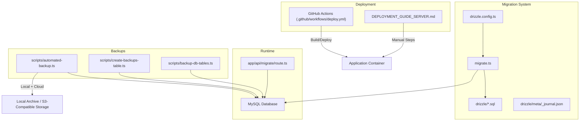
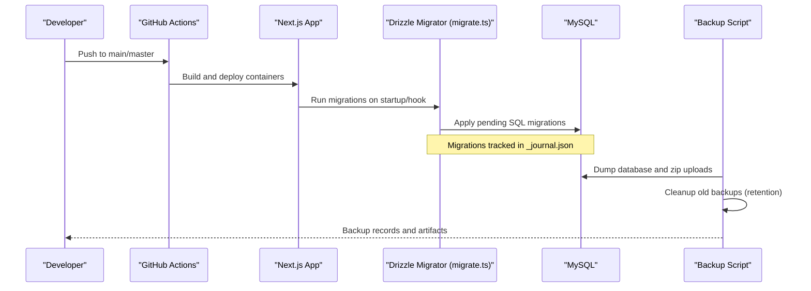
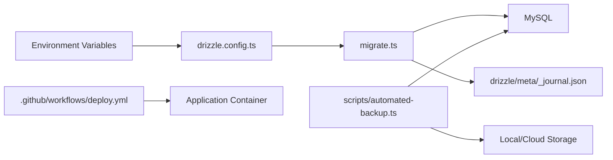

# Data Migration & Version Management

<cite>
**Referenced Files in This Document**
- [drizzle.config.ts](file://drizzle.config.ts)
- [migrate.ts](file://migrate.ts)
- [app/api/migrate/route.ts](file://app/api/migrate/route.ts)
- [scripts/apply-migration.ts](file://scripts/apply-migration.ts)
- [drizzle/meta/_journal.json](file://drizzle/meta/_journal.json)
- [drizzle/0000_giant_demogoblin.sql](file://drizzle/0000_giant_demogoblin.sql)
- [drizzle/0013_programme_subaccount.sql](file://drizzle/0013_programme_subaccount.sql)
- [scripts/automated-backup.ts](file://scripts/automated-backup.ts)
- [scripts/backup-db-tables.ts](file://scripts/backup-db-tables.ts)
- [scripts/create-backups-table.ts](file://scripts/create-backups-table.ts)
- [DEPLOYMENT_GUIDE_SERVER.md](file://DEPLOYMENT_GUIDE_SERVER.md)
- [.github/workflows/deploy.yml](file:.github/workflows/deploy.yml)
</cite>

## Table of Contents
1. Introduction
2. Project Structure
3. Core Components
4. Architecture Overview
5. Detailed Component Analysis
6. Dependency Analysis
7. Performance Considerations
8. Troubleshooting Guide
9. Conclusion
10. Appendices

## Introduction
This document explains the data migration and version management system for the project, focusing on Drizzle ORM migrations, schema evolution, rollback strategies, testing, production deployment workflows, backup and recovery, and performance optimization for large datasets. It consolidates how migrations are generated, tracked, applied, and monitored, and provides best practices to ensure safe and reliable schema changes at scale.

## Project Structure
The migration system is centered around Drizzle ORM with SQL migration files stored under drizzle and a configuration file that points to the application’s schema and database credentials. A dedicated runner executes migrations against the configured MySQL database. Backups and disaster recovery are supported by automated scripts that capture database dumps and file assets, with retention policies and cloud storage integration. Deployment automation uses GitHub Actions to build and deploy containers, while a server deployment guide documents manual steps including migration execution.

**Diagram sources**
- [drizzle.config.ts:6-13](file://drizzle.config.ts#L6-L13)
- [migrate.ts:1-10](file://migrate.ts#L1-L10)
- [drizzle/meta/_journal.json:1-34](file://drizzle/meta/_journal.json#L1-L34)
- [app/api/migrate/route.ts:5-12](file://app/api/migrate/route.ts#L5-L12)
- [scripts/automated-backup.ts:12-29](file://scripts/automated-backup.ts#L12-L29)
- [scripts/create-backups-table.ts:4-24](file://scripts/create-backups-table.ts#L4-L24)
- [scripts/backup-db-tables.ts:13-57](file://scripts/backup-db-tables.ts#L13-L57)
- [.github/workflows/deploy.yml:1-26](file:.github/workflows/deploy.yml#L1-L26)
- [DEPLOYMENT_GUIDE_SERVER.md:92-107](file://DEPLOYMENT_GUIDE_SERVER.md#L92-L107)

**Section sources**
- [drizzle.config.ts:6-13](file://drizzle.config.ts#L6-L13)
- [migrate.ts:1-10](file://migrate.ts#L1-L10)
- [drizzle/meta/_journal.json:1-34](file://drizzle/meta/_journal.json#L1-L34)
- [DEPLOYMENT_GUIDE_SERVER.md:92-107](file://DEPLOYMENT_GUIDE_SERVER.md#L92-L107)
- [.github/workflows/deploy.yml:1-26](file:.github/workflows/deploy.yml#L1-L26)

## Core Components
- Drizzle configuration: Defines schema location, output directory, dialect, and database URL used by migration tools.
- Migration runner: Executes pending migrations from the drizzle folder against the configured database.
- Migration files: SQL statements organized by numbered versions; metadata tracks applied migrations.
- Ad-hoc migration endpoints and scripts: Provide targeted schema changes or raw SQL execution when necessary.
- Backup and recovery: Automated backups with local and cloud storage, retention cleanup, and status tracking.
- Deployment automation: CI/CD pipeline builds and deploys containers; documentation guides manual deployment and migration steps.

**Section sources**
- [drizzle.config.ts:6-13](file://drizzle.config.ts#L6-L13)
- [migrate.ts:1-10](file://migrate.ts#L1-L10)
- [drizzle/meta/_journal.json:1-34](file://drizzle/meta/_journal.json#L1-L34)
- [app/api/migrate/route.ts:5-12](file://app/api/migrate/route.ts#L5-L12)
- [scripts/apply-migration.ts:5-20](file://scripts/apply-migration.ts#L5-L20)
- [scripts/automated-backup.ts:86-202](file://scripts/automated-backup.ts#L86-L202)
- [DEPLOYMENT_GUIDE_SERVER.md:92-107](file://DEPLOYMENT_GUIDE_SERVER.md#L92-L107)
- [.github/workflows/deploy.yml:13-25](file:.github/workflows/deploy.yml#L13-L25)

## Architecture Overview
The system applies versioned SQL migrations via Drizzle’s migrator, which reads the journal to determine which migrations have been applied and runs any pending ones. The application can also execute targeted schema changes through an API endpoint or scripts. Backups run periodically to capture database state and uploaded files, storing them locally and optionally in cloud storage with retention policies. Deployment pipelines automate container builds and deployments, while the server guide documents manual steps for running migrations and seeding data.

**Diagram sources**
- [.github/workflows/deploy.yml:13-25](file:.github/workflows/deploy.yml#L13-L25)
- [migrate.ts:1-10](file://migrate.ts#L1-L10)
- [drizzle/meta/_journal.json:1-34](file://drizzle/meta/_journal.json#L1-L34)
- [scripts/automated-backup.ts:86-202](file://scripts/automated-backup.ts#L86-L202)

## Detailed Component Analysis

### Drizzle Configuration and Migration Runner
- Configuration specifies schema path, output directory, dialect, and database URL.
- Runner invokes Drizzle’s migrator with the migrations folder and logs completion or errors.

Best practices:
- Ensure DATABASE_URL is correct and secure in environment variables.
- Keep migration files idempotent where possible and avoid destructive operations without safeguards.
- Use transactions for multi-statement migrations when supported by the database.

**Section sources**
- [drizzle.config.ts:6-13](file://drizzle.config.ts#L6-L13)
- [migrate.ts:1-10](file://migrate.ts#L1-L10)

### Migration File Structure and Naming Conventions
- SQL files are prefixed with numeric indices followed by descriptive tags (e.g., 0000_giant_demogoblin.sql).
- The journal tracks version, tag, timestamp, and whether breakpoints were used.
- Later migrations add indexes, columns, and features (e.g., programme recurrence, subaccount overrides).

Guidelines:
- Maintain incremental, reversible changes where feasible.
- Avoid renaming or dropping columns without a deprecation plan.
- Include comments explaining intent and dependencies between migrations.

**Section sources**
- [drizzle/meta/_journal.json:1-34](file://drizzle/meta/_journal.json#L1-L34)
- [drizzle/0000_giant_demogoblin.sql:1-800](file://drizzle/0000_giant_demogoblin.sql#L1-L800)
- [drizzle/0013_programme_subaccount.sql:1-8](file://drizzle/0013_programme_subaccount.sql#L1-L8)

### Ad-Hoc Schema Changes and Raw Scripts
- An API route performs a specific ALTER TABLE operation to add an enum column to meetings.
- A script executes a sequence of raw SQL statements to adjust indexes and add columns to meetings.

Recommendations:
- Prefer Drizzle-generated migrations for standard changes.
- Use ad-hoc scripts only for urgent fixes or complex transformations not easily expressed in migrations.
- Always wrap risky operations in transactions and validate results post-execution.

**Section sources**
- [app/api/migrate/route.ts:5-12](file://app/api/migrate/route.ts#L5-L12)
- [scripts/apply-migration.ts:5-20](file://scripts/apply-migration.ts#L5-L20)

### Backup and Recovery System
- Automated backup script creates a database dump and zips uploads, persists locally, and optionally uploads to cloud storage.
- Retention policy cleans up older backups both locally and in cloud storage.
- Backup records are stored in a dedicated table with status and metadata.
- Additional scripts back up specific tables to JSON for quick inspection.

Operational notes:
- Ensure mysqldump and zip utilities are available in the runtime environment.
- Configure S3-compatible storage credentials and bucket names.
- Monitor backup success/failure via logs and the backups table.

**Section sources**
- [scripts/automated-backup.ts:12-29](file://scripts/automated-backup.ts#L12-L29)
- [scripts/automated-backup.ts:86-202](file://scripts/automated-backup.ts#L86-L202)
- [scripts/create-backups-table.ts:4-24](file://scripts/create-backups-table.ts#L4-L24)
- [scripts/backup-db-tables.ts:13-57](file://scripts/backup-db-tables.ts#L13-L57)

### Deployment Procedures
- GitHub Actions workflow pulls latest code, builds Docker images, and starts containers for the app and worker.
- Server deployment guide instructs running migrations using Prisma migrate deploy and seeding data.

Important considerations:
- Align migration tooling across environments; if Drizzle is primary, ensure consistent execution strategy.
- Protect sensitive secrets (DATABASE_URL, AUTH_SECRET, storage credentials) via environment variables.
- Validate connectivity to external services (database, storage) before deploying.

**Section sources**
- [.github/workflows/deploy.yml:13-25](file:.github/workflows/deploy.yml#L13-L25)
- [DEPLOYMENT_GUIDE_SERVER.md:92-107](file://DEPLOYMENT_GUIDE_SERVER.md#L92-L107)

## Dependency Analysis
- Drizzle configuration depends on environment variables for database connection.
- Migration runner depends on the presence of migration files and the journal to track progress.
- Backup scripts depend on database credentials, system utilities (mysqldump, zip), and optional S3-compatible storage.
- Deployment workflow depends on SSH access and Docker Compose availability on the target server.

**Diagram sources**
- [drizzle.config.ts:6-13](file://drizzle.config.ts#L6-L13)
- [migrate.ts:1-10](file://migrate.ts#L1-L10)
- [drizzle/meta/_journal.json:1-34](file://drizzle/meta/_journal.json#L1-L34)
- [scripts/automated-backup.ts:12-29](file://scripts/automated-backup.ts#L12-L29)
- [.github/workflows/deploy.yml:13-25](file:.github/workflows/deploy.yml#L13-L25)

**Section sources**
- [drizzle.config.ts:6-13](file://drizzle.config.ts#L6-L13)
- [migrate.ts:1-10](file://migrate.ts#L1-L10)
- [scripts/automated-backup.ts:12-29](file://scripts/automated-backup.ts#L12-L29)
- [.github/workflows/deploy.yml:13-25](file:.github/workflows/deploy.yml#L13-L25)

## Performance Considerations
- Large dataset migrations:
  - Use batched updates and avoid long-running locks; consider online DDL options if supported.
  - Add indexes strategically after bulk data loads to minimize query latency.
  - Break large migrations into smaller, focused steps to reduce risk and improve manageability.
- Query optimization:
  - Profile slow queries and add appropriate indexes based on access patterns.
  - Normalize frequently joined tables and denormalize read-heavy paths judiciously.
- Backup performance:
  - Schedule backups during low-traffic windows.
  - Compress and offload backups to object storage to reduce I/O pressure.

[No sources needed since this section provides general guidance]

## Troubleshooting Guide
Common issues and resolutions:
- Migration failures:
  - Verify DATABASE_URL and network connectivity to MySQL.
  - Check migration file syntax and constraints; review error messages from the migrator.
  - Inspect the journal to confirm which migrations were applied.
- Backup failures:
  - Ensure mysqldump and zip are installed and accessible.
  - Validate S3-compatible storage credentials and bucket permissions.
  - Review backup logs and the backups table for failure details.
- Deployment issues:
  - Confirm Docker Compose setup and container networking.
  - Validate environment variables and service endpoints.
  - Check logs for runtime errors and dependency connectivity.

**Section sources**
- [migrate.ts:1-10](file://migrate.ts#L1-L10)
- [drizzle/meta/_journal.json:1-34](file://drizzle/meta/_journal.json#L1-L34)
- [scripts/automated-backup.ts:86-202](file://scripts/automated-backup.ts#L86-L202)
- [DEPLOYMENT_GUIDE_SERVER.md:92-107](file://DEPLOYMENT_GUIDE_SERVER.md#L92-L107)

## Conclusion
The project employs a robust, versioned migration system using Drizzle ORM with clear separation between configuration, migration files, and execution. Backups and recovery mechanisms provide resilience, while CI/CD automates deployment. Following the outlined best practices—incremental changes, careful indexing, transactional safety, and thorough monitoring—ensures reliable schema evolution and operational stability at scale.

[No sources needed since this section summarizes without analyzing specific files]

## Appendices

### Rollback Procedures
- Preferred approach: Create a new migration that reverses the previous change (e.g., drop added columns, remove indexes).
- For ad-hoc scripts: Prepare corresponding reverse scripts and execute them in a controlled maintenance window.
- Validate rollbacks in staging before applying to production; maintain pre-rollback backups.

[No sources needed since this section provides general guidance]

### Migration Testing Strategies
- Unit tests for schema expectations: Assert table existence, column types, and constraints using test databases.
- Integration tests: Execute migrations against isolated databases and verify application behavior.
- Data validation: Compare row counts, checksums, and key relationships before and after migrations.

[No sources needed since this section provides general guidance]

### Production Deployment Workflow
- Pre-deployment:
  - Run migrations in a staging environment mirroring production.
  - Perform full backups and verify restore procedures.
- Deployment:
  - Use CI/CD to build and deploy containers.
  - Post-deploy, verify health endpoints and critical functionality.
- Post-deployment:
  - Monitor logs and metrics for errors or performance regressions.
  - Validate backups are running and successful.

**Section sources**
- [.github/workflows/deploy.yml:13-25](file:.github/workflows/deploy.yml#L13-L25)
- [DEPLOYMENT_GUIDE_SERVER.md:92-107](file://DEPLOYMENT_GUIDE_SERVER.md#L92-L107)
- [scripts/automated-backup.ts:86-202](file://scripts/automated-backup.ts#L86-L202)

### Data Integrity Validation Methods
- Row count checks for critical tables.
- Foreign key integrity verification.
- Enum and constraint validation to ensure no invalid values exist.
- Periodic audits comparing application state with database state.

[No sources needed since this section provides general guidance]