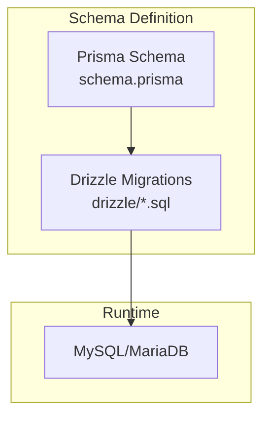
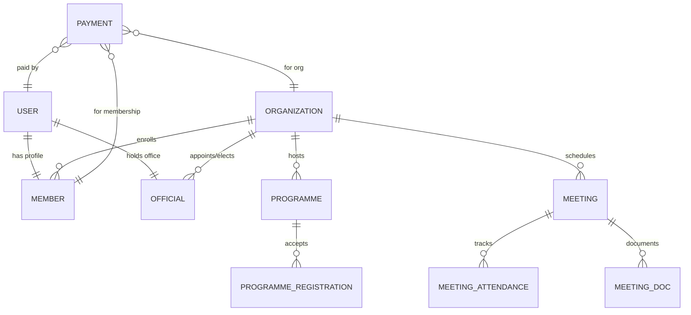
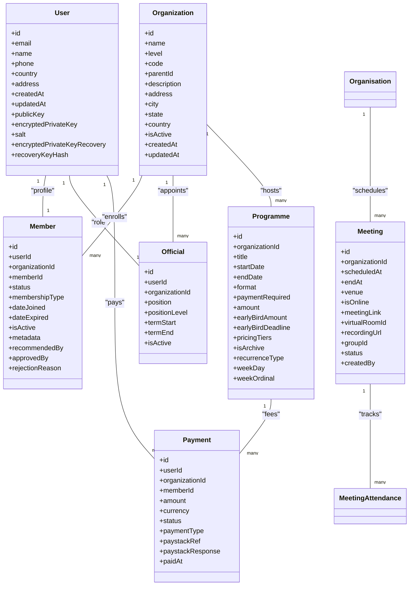
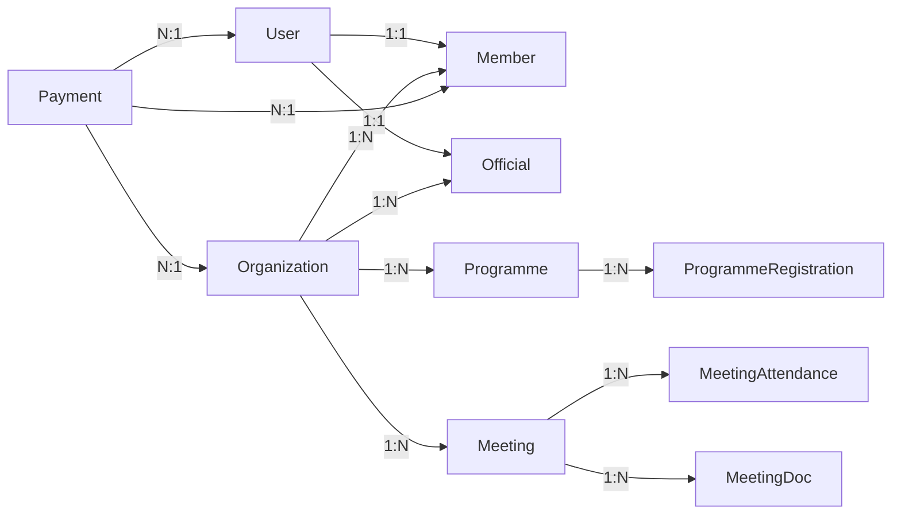

# Database Schema

<cite>
**Referenced Files in This Document**
- [schema.prisma](file://prisma/schema.prisma)
- [0000_giant_demogoblin.sql](file://drizzle/0000_giant_demogoblin.sql)
- [0001_bumpy_weapon_omega.sql](file://drizzle/0001_bumpy_weapon_omega.sql)
- [0002_shiny_the_spike.sql](file://drizzle/0002_shiny_the_spike.sql)
- [_journal.json](file://drizzle/meta/_journal.json)
- [tmc_portal.sql](file://tmc_portal.sql)
- [create-backups-table.ts](file://scripts/create-backups-table.ts)
- [check-backups.ts](file://scripts/check-backups.ts)
</cite>

## Table of Contents
1. Introduction
2. Project Structure
3. Core Components
4. Architecture Overview
5. Detailed Component Analysis
6. Dependency Analysis
7. Performance Considerations
8. Troubleshooting Guide
9. Conclusion
10. Appendices

## Introduction
This document provides a comprehensive data model documentation for the TMC Portal database schema. It focuses on entity relationships, field definitions, and data constraints across core entities including Organizations, Users, Members, Officials, Programs, Payments, and Meetings. It also covers primary and foreign key relationships, indexes, performance optimizations, validation rules, referential integrity enforcement, migration strategies, version management, rollback procedures, security measures, sample queries, backup and recovery procedures, archival strategies, and compliance considerations.

## Project Structure
The database schema is defined using Prisma models and enforced via Drizzle migrations. The Prisma schema defines the canonical data model, while Drizzle SQL migrations evolve the physical schema over time. A snapshot dump of the current database state is also available for reference.



**Diagram sources**
- [schema.prisma:1-120](file://prisma/schema.prisma#L1-L120)
- [0000_giant_demogoblin.sql:1-120](file://drizzle/0000_giant_demogoblin.sql#L1-L120)

**Section sources**
- [schema.prisma:1-120](file://prisma/schema.prisma#L1-L120)
- [0000_giant_demogoblin.sql:1-120](file://drizzle/0000_giant_demogoblin.sql#L1-L120)

## Core Components
Core entities and their responsibilities:
- User: Base user account with authentication and E2EE fields; linked to roles, sessions, and many domain entities.
- Organization: Hierarchical organization structure with planning settings, CMS content, and payment integration fields.
- Member: Membership profile tied to a user and an organization, with approval workflow and metadata.
- Official: Elected/appointed official role within an organization and office.
- Programme: Programmes with scheduling, pricing, payments, and reporting capabilities.
- Payment: Financial transactions for memberships, donations, events, and more.
- Meeting: Scheduled meetings with attendance tracking, documents, and group support.

Key relationships (selected):
- User 1:1 Member, 1:1 Official (via unique userId).
- Organization 1:N Members, Officials, Programmes, Meetings, etc.
- Programme 1:N ProgrammeRegistrations.
- Payment can be associated with User, Organization, Member, or Campaign.
- Meeting 1:N MeetingAttendances and MeetingDocs.

Indexes and constraints (selected):
- Unique constraints on email, code, paystackRef, and other business keys.
- Foreign keys enforce referential integrity with cascade or set null policies.
- Indexes on frequently queried columns like organizationId, userId, createdAt.

**Section sources**
- [schema.prisma:12-82](file://prisma/schema.prisma#L12-L82)
- [schema.prisma:124-197](file://prisma/schema.prisma#L124-L197)
- [schema.prisma:207-252](file://prisma/schema.prisma#L207-L252)
- [schema.prisma:282-306](file://prisma/schema.prisma#L282-L306)
- [schema.prisma:398-427](file://prisma/schema.prisma#L398-L427)
- [schema.prisma:654-739](file://prisma/schema.prisma#L654-L739)
- [tmc_portal.sql:445-592](file://tmc_portal.sql#L445-L592)

## Architecture Overview
High-level data architecture shows how core entities relate and flow through the system.



**Diagram sources**
- [schema.prisma:12-82](file://prisma/schema.prisma#L12-L82)
- [schema.prisma:124-197](file://prisma/schema.prisma#L124-L197)
- [schema.prisma:207-252](file://prisma/schema.prisma#L207-L252)
- [schema.prisma:282-306](file://prisma/schema.prisma#L282-L306)
- [schema.prisma:398-427](file://prisma/schema.prisma#L398-L427)
- [schema.prisma:654-739](file://prisma/schema.prisma#L654-L739)

## Detailed Component Analysis

### User
- Purpose: Central identity for authentication, authorization, and linking to domain entities.
- Key fields: id, email (unique), name, phone, image, country, address, timestamps, E2EE fields (publicKey, encryptedPrivateKey, salt, encryptedPrivateKeyRecovery, recoveryKeyHash).
- Relationships: Accounts, Sessions, Member, Official, UserRole, AuditLog, Documents, Payments, Notifications, Posts, Chats, Messages, Promotions, BurialRequests, SiteVisits, Approver/Recommender relations, Meetings, Meetings Attendance, Meeting Docs, Programmes, Programme Registrations, Reports, Bulk Registration Groups, Special Programmes, Assets, Finance Budgets/Fund Requests/Transactions, Fees, Competitions, Backups.
- Constraints: email unique; E2EE fields stored as text; optional fields where appropriate.

Performance notes:
- Email uniqueness ensures fast lookups for login flows.
- Indexes are applied at the ORM layer for common queries; ensure application queries leverage these.

Security notes:
- E2EE fields enable secure messaging features; ensure encryption keys are managed securely outside the database when possible.

**Section sources**
- [schema.prisma:12-82](file://prisma/schema.prisma#L12-L82)

### Organization
- Purpose: Hierarchical organizational unit with planning, CMS, and financial integration fields.
- Key fields: id, name, level (enum), code (unique), parentId (self-referencing hierarchy), description, address, city, state, country, contact info, welcome message/images, google map URL, social links JSON, planning deadline month/day, mission/vision text, whatsapp, office hours, slider images JSON, Paystack subaccount code, bank details, isActive, timestamps.
- Relationships: Members, Officials, UserRoles, Documents, Payments, Posts, Galleries, Pages, NavigationItems, Campaigns, OccasionRequests, Meetings, MeetingGroups, Programmes, SpecialProgrammes, Assets, FinanceBudgets, FinanceFundRequests, FinanceTransactions, Fees, Offices, Reports, Competitions.
- Constraints: code unique; parentId self-reference; index on parentId for hierarchical queries.

Performance notes:
- Index on parentId supports efficient tree traversal.
- JSON fields used for flexible configuration; consider denormalization if heavy querying required.

**Section sources**
- [schema.prisma:124-197](file://prisma/schema.prisma#L124-L197)
- [tmc_portal.sql:622-656](file://tmc_portal.sql#L622-L656)

### Member
- Purpose: Represents a member’s profile within an organization, with approval workflow and personal details.
- Key fields: id, userId (unique), organizationId, memberId (unique), status (enum), membershipType (enum), dateJoined, dateExpired, isActive, dateOfBirth, gender, occupation, address, emergencyContact/Phone, metadata JSON, timestamps, recommendation/approval workflow fields.
- Relationships: User, Organization, Payments, Documents, ProgrammeRegistrations.
- Constraints: userId unique (1:1 with User); memberId unique; status and membershipType enums; indexes on organizationId.

Business rules:
- Approval workflow includes recommender and approver references with timestamps.
- Status transitions governed by application logic; enums constrain valid states.

**Section sources**
- [schema.prisma:207-252](file://prisma/schema.prisma#L207-L252)
- [tmc_portal.sql:490-517](file://tmc_portal.sql#L490-L517)

### Official
- Purpose: Captures elected/appointed officials within an organization and office.
- Key fields: id, userId (unique), organizationId, position, positionLevel (enum), dateElected/Appointed, officeId, termStart/End, image, bio, isActive, timestamps.
- Relationships: User, Organization, Office, Programmes (as organizing official).
- Constraints: userId unique; positionLevel enum; indexes on organizationId.

**Section sources**
- [schema.prisma:282-306](file://prisma/schema.prisma#L282-L306)
- [tmc_portal.sql:603-620](file://tmc_portal.sql#L603-L620)

### Programme
- Purpose: Manages programmes with scheduling, format, pricing, payments, certificates, and reporting.
- Key fields: id, organizationId, title, description, venue, startDate/endDate, time, level, targetAudience, status, rejectionReason, approvals (state/national), organizingOffice/Official, format, meetingUrl, frequency, objectives, budget, committee, additionalInfo, isLateSubmission, paymentRequired, allowInstallments, minInstallmentAmount, amount, earlyBirdAmount/Deadline, pricingTiers JSON, paystackSubaccountCode, bank details, isRecurringAdmin, flyerUrl, hasCertificate, certificate template fields, staticAttendanceToken, attendanceWindow, recurrenceType, weekDay/Ordinal, createdBy/creator, timestamps.
- Relationships: Organization, ProgrammeRegistrations, ProgrammeReport, ProgrammeFeedbackSubmissions, BulkRegistrationGroups.
- Constraints: Index on organizationId; status and format enums; unique programme report relation.

Performance notes:
- Index on organizationId improves filtering by org.
- JSON fields for flexible feedback/pricing; consider materialized views for analytics.

**Section sources**
- [schema.prisma:741-820](file://prisma/schema.prisma#L741-L820)

### Payment
- Purpose: Records financial transactions for memberships, renewals, donations, events, burial fees, levies, contests, and other types.
- Key fields: id, userId (optional), organizationId (optional), memberId (optional), burialRequest, campaignId, amount (decimal), currency (default NGN), status (enum), paymentType (enum), paystackRef (unique), paystackResponse JSON, description, metadata JSON, paidAt, timestamps.
- Relationships: User, Organization, Member, BurialRequest, FundraisingCampaign, FeeAssignments, BulkRegistrationGroups.
- Constraints: paystackRef unique; status/paymentType enums; indexes on userId, organizationId, memberId.

Business rules:
- Supports multiple payment types and statuses; webhook updates should reconcile status changes.

**Section sources**
- [schema.prisma:398-427](file://prisma/schema.prisma#L398-L427)
- [tmc_portal.sql:686-705](file://tmc_portal.sql#L686-L705)

### Meeting
- Purpose: Schedules meetings with attendance tracking, documents, and group support.
- Key fields: id, title, description, organizationId, scheduledAt, endAt, venue, isOnline, meetingLink, virtualRoomId, recordingUrl, groupId, status (enum), createdBy/creator, timestamps. Additional fields added via migrations: programmeId, staticAttendanceToken, attendanceWindow, meetingTargetAudience (enum), shareCode, recordingShareCode, egressId, seriesId, frequency (enum).
- Relationships: Organization, MeetingAttendances, MeetingDocs, MeetingGroup(s).
- Constraints: Index on organizationId; status enum; unique share codes (subject to migration history).

Migration notes:
- Share code uniqueness was added then removed; verify current state via migrations.

**Section sources**
- [schema.prisma:654-739](file://prisma/schema.prisma#L654-L739)
- [0001_bumpy_weapon_omega.sql:14-23](file://drizzle/0001_bumpy_weapon_omega.sql#L14-L23)
- [0002_shiny_the_spike.sql:1-4](file://drizzle/0002_shiny_the_spike.sql#L1-L4)

### Programme Registration
- Purpose: Tracks individual registrations for programmes with payment and attendance details.
- Key fields: id, programmeId, userId (optional), memberId (optional), name, email, phone, status (enum), gender, address, amountPaid, paymentReference, registrationTier, certificateUrl/IssuedAt, country/state/lga/branch, checkIn/Out times and users, waiver flag, lockedAmount, bulkGroupId/bulkClaimToken/claimedAt, registeredAt.
- Relationships: Programme, User, Member.
- Constraints: Index on programmeId; status enum.

**Section sources**
- [schema.prisma:822-858](file://prisma/schema.prisma#L822-L858)

### Role-Based Access Control (RBAC)
- Entities: Role, Permission, UserRole, RolePermission.
- Purpose: Granular permissions scoped by jurisdiction and organization.
- Constraints: Unique combinations for user-role-org and role-permission; indexes for performance.

**Section sources**
- [schema.prisma:315-396](file://prisma/schema.prisma#L315-L396)

### Audit Logging and Email Tracking
- AuditLog: Tracks actions with entity type/id, organization context, IP/user agent, metadata JSON.
- EmailLog: Tracks sent emails with provider details, status, errors, and metadata.

**Section sources**
- [schema.prisma:510-551](file://prisma/schema.prisma#L510-L551)
- [tmc_portal.sql:48-63](file://tmc_portal.sql#L48-L63)

### Backup Management
- Backup: Records manual/automated backups with URLs, size, status, error, creator.
- Scripts: Create table and list recent backups.

**Section sources**
- [schema.prisma:429-443](file://prisma/schema.prisma#L429-L443)
- [create-backups-table.ts:1-26](file://scripts/create-backups-table.ts#L1-L26)
- [check-backups.ts:1-9](file://scripts/check-backups.ts#L1-L9)

## Architecture Overview
Entity relationship diagram focusing on core domains:



**Diagram sources**
- [schema.prisma:12-82](file://prisma/schema.prisma#L12-L82)
- [schema.prisma:124-197](file://prisma/schema.prisma#L124-L197)
- [schema.prisma:207-252](file://prisma/schema.prisma#L207-L252)
- [schema.prisma:282-306](file://prisma/schema.prisma#L282-L306)
- [schema.prisma:398-427](file://prisma/schema.prisma#L398-L427)
- [schema.prisma:654-739](file://prisma/schema.prisma#L654-L739)

## Detailed Component Analysis

### Data Validation Rules and Business Constraints
- Enums enforce allowed values for statuses, types, levels, categories (e.g., MemberStatus, PaymentStatus, PaymentType, OrgLevel, OfficialLevel, JurisdictionLevel).
- Unique constraints prevent duplicates (email, code, paystackRef, member/memberId, user roles combinations).
- Foreign keys maintain referential integrity; cascade or set null policies control deletion behavior.
- JSON fields provide flexibility but should be validated at the application layer for schema evolution.

Referential integrity enforcement:
- Many-to-one relationships use explicit foreign keys with onDelete behaviors (Cascade/SetNull) to maintain consistency.
- Self-referential relationships (Organization.parentId) enable hierarchical structures.

Indexes:
- Primary keys on all tables.
- Unique indexes on business keys (email, code, paystackRef, slugs).
- Secondary indexes on frequently filtered columns (organizationId, userId, createdAt, entityType/entityId).

**Section sources**
- [schema.prisma:199-205](file://prisma/schema.prisma#L199-L205)
- [schema.prisma:254-280](file://prisma/schema.prisma#L254-L280)
- [schema.prisma:334-340](file://prisma/schema.prisma#L334-L340)
- [schema.prisma:458-475](file://prisma/schema.prisma#L458-L475)
- [tmc_portal.sql:445-592](file://tmc_portal.sql#L445-L592)

### Migration Strategies, Version Management, and Rollback Procedures
- Versioning: Drizzle journal tracks migration entries with timestamps and tags.
- Strategy: Use incremental SQL migrations to evolve schema; apply via scripts or tooling.
- Rollback: Maintain reverse migrations or scripted downgrades; test rollbacks in staging before production.
- Safety: Wrap critical migrations in transactions where supported; validate after apply.

Journal overview:
- Entries include index, version, timestamp, tag, and breakpoints indicating safe points.

**Section sources**
- [_journal.json:1-34](file://drizzle/meta/_journal.json#L1-L34)
- [0000_giant_demogoblin.sql:1-120](file://drizzle/0000_giant_demogoblin.sql#L1-L120)
- [0001_bumpy_weapon_omega.sql:1-23](file://drizzle/0001_bumpy_weapon_omega.sql#L1-L23)
- [0002_shiny_the_spike.sql:1-4](file://drizzle/0002_shiny_the_spike.sql#L1-L4)

### Security Measures
- Encryption at rest: Database-level encryption should be enabled by the hosting environment; sensitive fields like encryptedPrivateKey are stored as text per schema.
- Access controls: RBAC via Role, Permission, UserRole, RolePermission enforces granular access scoped by jurisdiction and organization.
- Audit logging: AuditLog captures actions, entities, IPs, user agents, and metadata for accountability.
- Email logs: Track delivery status and errors for compliance and troubleshooting.

Best practices:
- Rotate encryption keys and store secrets securely outside the database.
- Restrict admin endpoints and enforce least privilege.
- Regularly review audit logs and email logs for anomalies.

**Section sources**
- [schema.prisma:12-82](file://prisma/schema.prisma#L12-L82)
- [schema.prisma:315-396](file://prisma/schema.prisma#L315-L396)
- [schema.prisma:510-551](file://prisma/schema.prisma#L510-L551)

### Sample Queries and Common Data Access Patterns
- List active members in an organization with status filter.
- Retrieve payments for a user or member with status and date range.
- Get programme registrations with payment status and check-in times.
- Query meetings with attendance counts and document submissions.
- Fetch audit logs for a specific entity and time window.

Example patterns (descriptive):
- Filter by organizationId and status enums for fast retrieval.
- Join ProgrammeRegistrations with Payments to compute outstanding balances.
- Aggregate MeetingAttendances by meetingId to compute attendance rates.

[No sources needed since this section provides general guidance]

### Performance Tuning Recommendations
- Add composite indexes for frequent query filters (e.g., organizationId + status, userId + createdAt).
- Use pagination for large result sets (members, payments, registrations).
- Denormalize hot paths if necessary (e.g., cached counts for meetings/programmes).
- Archive old records (audit logs, email logs) to reduce table sizes.
- Monitor slow queries and optimize joins; avoid selecting unnecessary JSON fields.

[No sources needed since this section provides general guidance]

### Backup and Recovery Procedures
- Backup table tracks manual/automated backups with URLs, size, and status.
- Scripts create the backups table and list recent backups for verification.
- Procedure:
  - Schedule automated backups; record results in backups table.
  - Store backups offsite; verify integrity periodically.
  - Restore from latest verified backup; reapply subsequent migrations if needed.

**Section sources**
- [create-backups-table.ts:1-26](file://scripts/create-backups-table.ts#L1-L26)
- [check-backups.ts:1-9](file://scripts/check-backups.ts#L1-L9)

### Data Archival and Compliance
- Archival strategy: Move historical data (audit logs, email logs, completed programmes) to archive tables or cold storage.
- Retention policy: Define retention periods aligned with legal/compliance requirements; implement automated purging.
- Compliance: Ensure PII handling follows privacy regulations; encrypt sensitive data; restrict access to audit logs.

[No sources needed since this section provides general guidance]

## Dependency Analysis
Relationships between core entities and their cardinality:



**Diagram sources**
- [schema.prisma:12-82](file://prisma/schema.prisma#L12-L82)
- [schema.prisma:124-197](file://prisma/schema.prisma#L124-L197)
- [schema.prisma:207-252](file://prisma/schema.prisma#L207-L252)
- [schema.prisma:282-306](file://prisma/schema.prisma#L282-L306)
- [schema.prisma:398-427](file://prisma/schema.prisma#L398-L427)
- [schema.prisma:654-739](file://prisma/schema.prisma#L654-L739)

**Section sources**
- [schema.prisma:12-82](file://prisma/schema.prisma#L12-L82)
- [schema.prisma:124-197](file://prisma/schema.prisma#L124-L197)
- [schema.prisma:207-252](file://prisma/schema.prisma#L207-L252)
- [schema.prisma:282-306](file://prisma/schema.prisma#L282-L306)
- [schema.prisma:398-427](file://prisma/schema.prisma#L398-L427)
- [schema.prisma:654-739](file://prisma/schema.prisma#L654-L739)

## Performance Considerations
- Leverage existing indexes on organizationId, userId, createdAt, and unique business keys.
- Avoid full table scans by filtering on indexed columns.
- Use batch operations for bulk inserts/updates (registrations, payments).
- Cache read-heavy data (programme lists, meeting schedules) with appropriate invalidation.
- Monitor query performance and adjust indexes based on usage patterns.

[No sources needed since this section provides general guidance]

## Troubleshooting Guide
Common issues and resolutions:
- Duplicate key errors: Check unique constraints (email, code, paystackRef) before inserts.
- Foreign key violations: Ensure referenced entities exist; handle cascade/set null behaviors.
- Migration failures: Review migration scripts; apply step-by-step; log errors and revert if necessary.
- Backup inconsistencies: Verify backups table entries; restore from last successful backup.

Operational checks:
- Validate schema against Prisma/Drizzle snapshots.
- Inspect audit logs for failed operations.
- Review email logs for delivery failures.

**Section sources**
- [tmc_portal.sql:445-592](file://tmc_portal.sql#L445-L592)
- [schema.prisma:510-551](file://prisma/schema.prisma#L510-L551)

## Conclusion
The TMC Portal database schema provides a robust foundation for managing organizations, users, members, officials, programmes, payments, and meetings. It enforces strong referential integrity, supports hierarchical structures, and includes mechanisms for RBAC, audit logging, and backup tracking. Proper indexing, validation, and migration practices ensure scalability and reliability. Adhering to security and compliance guidelines will protect sensitive data and maintain operational integrity.

[No sources needed since this section summarizes without analyzing specific files]

## Appendices

### Entity Relationship Diagram (ERD)
```mermaid
erDiagram
USERS {
string id PK
string email UK
string name
string phone
string country
string address
datetime createdAt
datetime updatedAt
text publicKey
text encryptedPrivateKey
string salt
text encryptedPrivateKeyRecovery
string recoveryKeyHash
}
ORGANIZATIONS {
string id PK
string name
enum level
string code UK
string parentId FK
text description
string address
string city
string state
string country
boolean isActive
datetime createdAt
datetime updatedAt
}
MEMBERS {
string id PK
string userId UK FK
string organizationId FK
string memberId UK
enum status
enum membershipType
datetime dateJoined
datetime dateExpired
boolean isActive
json metadata
string recommendedBy
string approvedBy
text rejectionReason
}
OFFICIALS {
string id PK
string userId UK FK
string organizationId FK
string position
enum positionLevel
datetime termStart
datetime termEnd
boolean isActive
}
PROGRAMMES {
string id PK
string organizationId FK
string title
datetime startDate
datetime endDate
string format
boolean paymentRequired
decimal amount
decimal earlyBirdAmount
datetime earlyBirdDeadline
json pricingTiers
boolean isArchive
string recurrenceType
int weekDay
int weekOrdinal
}
PAYMENTS {
string id PK
string userId FK
string organizationId FK
string memberId FK
decimal amount
string currency
enum status
enum paymentType
string paystackRef UK
json paystackResponse
datetime paidAt
}
MEETINGS {
string id PK
string organizationId FK
datetime scheduledAt
datetime endAt
string venue
boolean isOnline
string meetingLink
string virtualRoomId
string recordingUrl
string groupId
enum status
string createdBy
}
USERS ||--|| MEMBERS : "profile"
USERS ||--|| OFFICIALS : "role"
ORGANIZATIONS ||--o{ MEMBERS : "enrolls"
ORGANIZATIONS ||--o{ OFFICIALS : "appoints"
ORGANIZATIONS ||--o{ PROGRAMMES : "hosts"
ORGANIZATIONS ||--o{ MEETINGS : "schedules"
PROGRAMMES ||--o{ PAYMENTS : "fees"
USERS ||--o{ PAYMENTS : "pays"
```

**Diagram sources**
- [schema.prisma:12-82](file://prisma/schema.prisma#L12-L82)
- [schema.prisma:124-197](file://prisma/schema.prisma#L124-L197)
- [schema.prisma:207-252](file://prisma/schema.prisma#L207-L252)
- [schema.prisma:282-306](file://prisma/schema.prisma#L282-L306)
- [schema.prisma:398-427](file://prisma/schema.prisma#L398-L427)
- [schema.prisma:654-739](file://prisma/schema.prisma#L654-L739)