# Financial & Payment Data Model

<cite>
**Referenced Files in This Document**
- [schema.prisma](file://prisma/schema.prisma)
- [schema.ts](file://lib/db/schema.ts)
- [payments.ts](file://lib/payments.ts)
- [initialize route](file://app/api/payments/initialize/route.ts)
- [paystack-webhook route](file://app/api/payments/paystack-webhook/route.ts)
- [verify route](file://app/api/payments/verify/route.ts)
- [sync-transactions route](file://app/api/sync-transactions/route.ts)
- [campaigns page](file://app/[jurisdiction]/campaigns/page.tsx)
- [campaign detail page](file://app/[jurisdiction]/campaigns/[slug]/page.tsx)
- [create campaign dialog](file://components/admin/finance/create-campaign-dialog.tsx)
- [finance actions](file://lib/actions/finance.ts)
- [analytics actions](file://lib/actions/analytics.ts)
- [client currency component](file://components/ui/client-currency.tsx)
- [audit log model](file://prisma/schema.prisma)
</cite>

## Table of Contents
1. [Introduction](#introduction)
2. [Project Structure](#project-structure)
3. [Core Components](#core-components)
4. [Architecture Overview](#architecture-overview)
5. [Detailed Component Analysis](#detailed-component-analysis)
6. [Dependency Analysis](#dependency-analysis)
7. [Performance Considerations](#performance-considerations)
8. [Troubleshooting Guide](#troubleshooting-guide)
9. [Conclusion](#conclusion)
10. [Appendices](#appendices)

## Introduction
This document describes the financial and payment data model with a focus on transaction processing, fundraising campaigns, and financial reporting. It covers:
- Payments table schema, payment types, status tracking, and Paystack integration fields
- Fundraising campaign management including target amounts, progress tracking, and donor attribution
- Financial transaction categorization, currency handling, and multi-currency support
- Budget management, fund requests, and approval workflows
- Payment reconciliation processes, webhook handling for external payment providers, and audit trail maintenance
- Financial data security, PCI compliance considerations, and reporting requirements for transparency

## Project Structure
The financial module spans database schemas (Prisma and Drizzle), API routes for payments and finance operations, server-side libraries for payment orchestration, and UI components for campaign creation and dashboards.

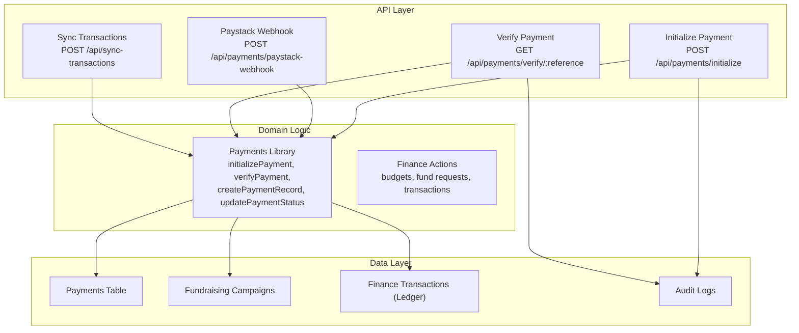

**Diagram sources**
- [initialize route:11-89](file://app/api/payments/initialize/route.ts#L11-L89)
- [paystack-webhook route:7-41](file://app/api/payments/paystack-webhook/route.ts#L7-L41)
- [verify route:70-95](file://app/api/payments/verify/route.ts#L70-L95)
- [payments.ts:18-190](file://lib/payments.ts#L18-L190)
- [finance actions:134-276](file://lib/actions/finance.ts#L134-L276)

**Section sources**
- [initialize route:11-89](file://app/api/payments/initialize/route.ts#L11-L89)
- [paystack-webhook route:7-41](file://app/api/payments/paystack-webhook/route.ts#L7-L41)
- [verify route:70-95](file://app/api/payments/verify/route.ts#L70-L95)
- [payments.ts:18-190](file://lib/payments.ts#L18-L190)
- [finance actions:134-276](file://lib/actions/finance.ts#L134-L276)

## Core Components
- Payments model and enums define the core transactional entities and allowed payment types.
- Fundraising campaigns store targets, dates, and progress metrics.
- Finance ledger records inflows/outflows tied to payments or fund requests.
- Audit logs capture system actions for traceability.

Key elements:
- Payment statuses: PENDING, SUCCESS, FAILED, CANCELLED, REFUNDED
- Payment types: MEMBERSHIP_FEE, RENEWAL, DONATION, EVENT_FEE, BURIAL_FEE, LEVY, CONTEST_FEE, OTHER
- Currency: stored per payment; default NGN; Paystack returns currency in verification responses
- Paystack fields: paystackRef (unique), paystackResponse (JSON), optional subaccount routing by organization

**Section sources**
- [schema.prisma:398-475](file://prisma/schema.prisma#L398-L475)
- [schema.prisma:458-475](file://prisma/schema.prisma#L458-L475)
- [payments.ts:100-190](file://lib/payments.ts#L100-L190)

## Architecture Overview
End-to-end payment flow integrates user actions, Paystack, and internal ledgers:

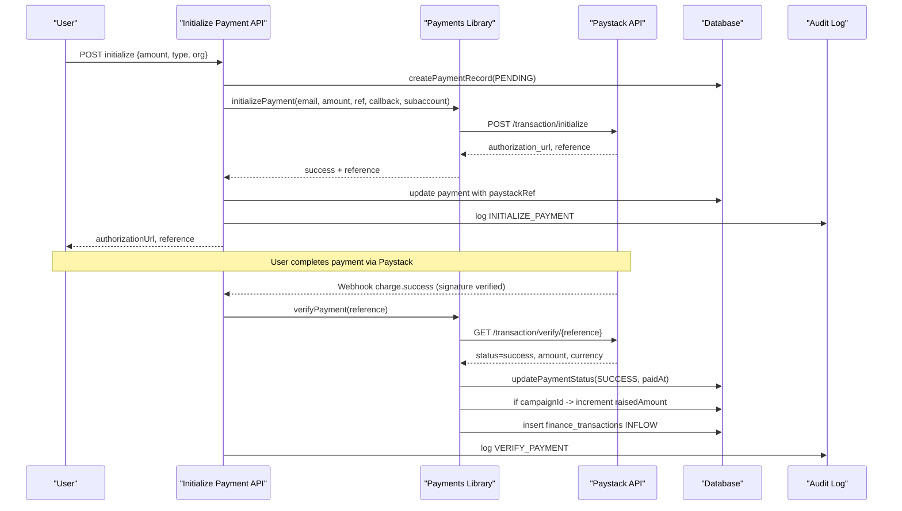

**Diagram sources**
- [initialize route:11-89](file://app/api/payments/initialize/route.ts#L11-L89)
- [payments.ts:18-190](file://lib/payments.ts#L18-L190)
- [paystack-webhook route:7-41](file://app/api/payments/paystack-webhook/route.ts#L7-L41)
- [verify route:70-95](file://app/api/payments/verify/route.ts#L70-L95)

## Detailed Component Analysis

### Payments Schema and Types
- Fields include identifiers, user/member/campaign links, amount, currency, status, paymentType, Paystack reference/response, description, metadata, timestamps.
- Enums enforce valid statuses and payment types.
- Indexing and constraints ensure referential integrity and uniqueness where required.

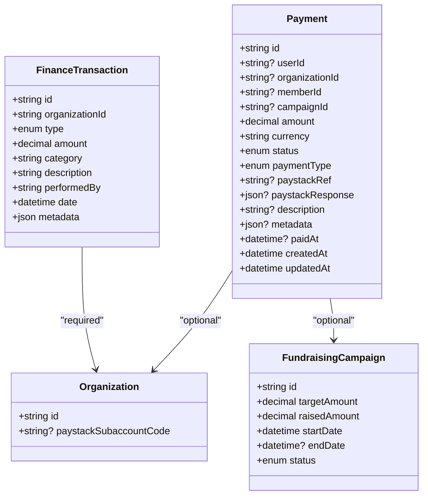

**Diagram sources**
- [schema.prisma:398-475](file://prisma/schema.prisma#L398-L475)
- [schema.prisma:1247-1264](file://lib/db/schema.ts#L1247-L1264)

**Section sources**
- [schema.prisma:398-475](file://prisma/schema.prisma#L398-L475)

### Transaction Processing and Status Tracking
- Initialization creates a PENDING record and obtains an authorization URL from Paystack.
- Verification updates status to SUCCESS/FAILED, sets paidAt, stores Paystack response, and triggers downstream effects:
  - If linked to a campaign, increments raisedAmount
  - Inserts an INFLOW into finance_transactions
- Sync endpoint re-verifies pending/failed payments that have a Paystack reference to reconcile state.

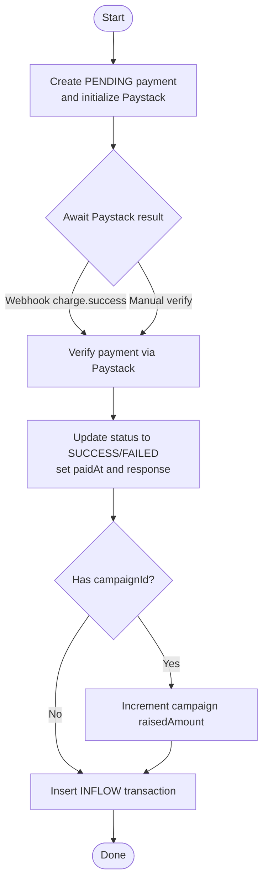

**Diagram sources**
- [payments.ts:18-190](file://lib/payments.ts#L18-L190)
- [verify route:70-95](file://app/api/payments/verify/route.ts#L70-L95)
- [sync-transactions route](file://app/api/sync-transactions/route.ts)

**Section sources**
- [payments.ts:18-190](file://lib/payments.ts#L18-L190)
- [verify route:70-95](file://app/api/payments/verify/route.ts#L70-L95)

### Fundraising Campaign Management
- Campaigns track targetAmount, raisedAmount, start/end dates, and status.
- Public pages compute percentage progress and display recent donations filtered by successful payments.
- Admin UI allows creating campaigns with title, slug, target, dates, and optional settings.

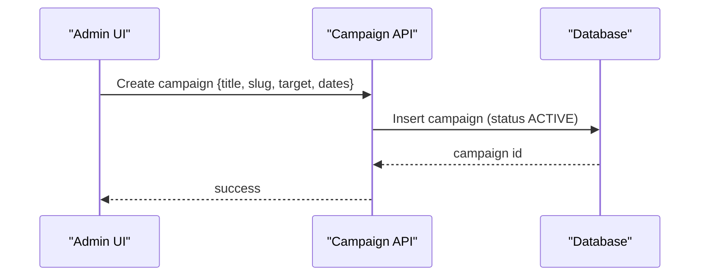

**Diagram sources**
- [create campaign dialog:29-87](file://components/admin/finance/create-campaign-dialog.tsx#L29-L87)
- [schema.prisma:398-475](file://prisma/schema.prisma#L398-L475)

**Section sources**
- [campaigns page:36-62](file://app/[jurisdiction]/campaigns/page.tsx#L36-L62)
- [campaign detail page:35-134](file://app/[jurisdiction]/campaigns/[slug]/page.tsx#L35-L134)
- [create campaign dialog:29-87](file://components/admin/finance/create-campaign-dialog.tsx#L29-L87)

### Financial Transaction Categorization and Reporting
- Payments are categorized by paymentType and recorded as INFLOW when successful.
- Analytics aggregate totals by paymentType across organizations and compute trends.
- Finance transactions provide a ledger view with performer, date, and metadata.

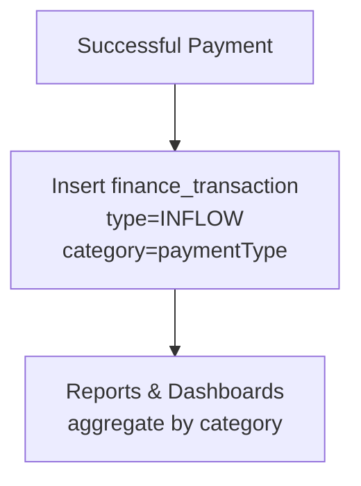

**Diagram sources**
- [payments.ts:152-186](file://lib/payments.ts#L152-L186)
- [analytics actions:100-130](file://lib/actions/analytics.ts#L100-L130)

**Section sources**
- [payments.ts:152-186](file://lib/payments.ts#L152-L186)
- [analytics actions:100-130](file://lib/actions/analytics.ts#L100-L130)

### Currency Handling and Multi-Currency Support
- Each payment stores a currency code; default is NGN.
- Paystack verification returns the actual currency used for the transaction.
- Client-side formatting uses Intl.NumberFormat with locale and currency for display.

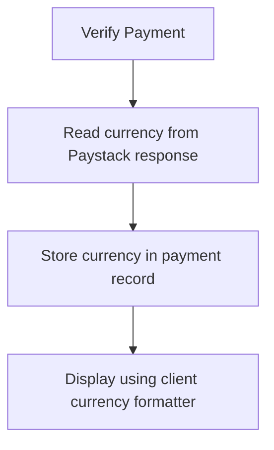

**Diagram sources**
- [payments.ts:60-96](file://lib/payments.ts#L60-L96)
- [client currency component:12-40](file://components/ui/client-currency.tsx#L12-L40)

**Section sources**
- [payments.ts:60-96](file://lib/payments.ts#L60-L96)
- [client currency component:12-40](file://components/ui/client-currency.tsx#L12-L40)

### Budget Management, Fund Requests, and Approval Workflows
- Budgets have items, totalAmount, status, creator/approver fields, and optional programme linkage.
- Fund requests include requester/recommender/approver/disburser timestamps and rejection reasons/evidence.
- Transactions can be linked to fund requests for outflows.

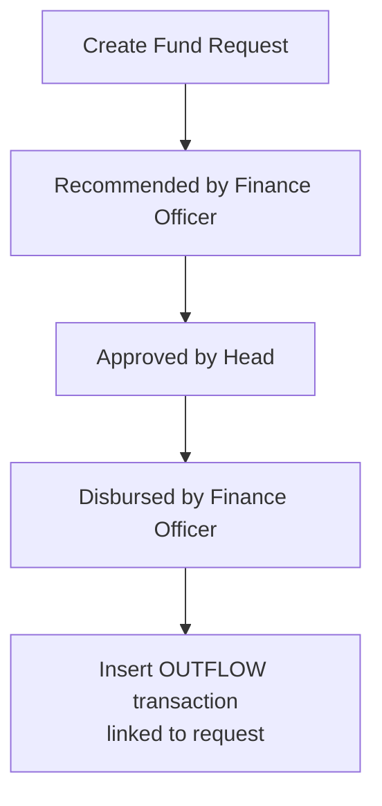

**Diagram sources**
- [finance actions:134-276](file://lib/actions/finance.ts#L134-L276)
- [schema.ts:1200-1264](file://lib/db/schema.ts#L1200-L1264)

**Section sources**
- [finance actions:134-276](file://lib/actions/finance.ts#L134-L276)
- [schema.ts:1200-1264](file://lib/db/schema.ts#L1200-L1264)

### Payment Reconciliation and Webhook Handling
- Webhook verifies signature using secret key and handles events (e.g., charge.success).
- For specific event types (e.g., programme registration), dedicated verification functions are invoked.
- Sync endpoint iterates pending/failed payments with references and reconciles via Paystack verification.

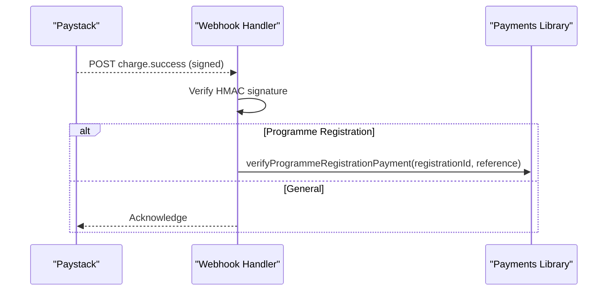

**Diagram sources**
- [paystack-webhook route:7-41](file://app/api/payments/paystack-webhook/route.ts#L7-L41)

**Section sources**
- [paystack-webhook route:7-41](file://app/api/payments/paystack-webhook/route.ts#L7-L41)
- [payments.ts:60-96](file://lib/payments.ts#L60-L96)

### Audit Trail Maintenance
- Audit logs capture actions such as payment initialization and verification, including entity IDs and descriptions.
- Logs are indexed for efficient querying by user, entity type, organization, and time.

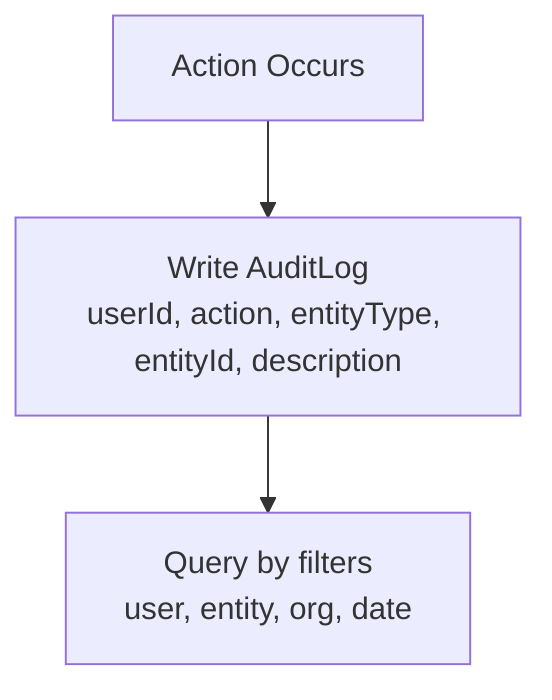

**Diagram sources**
- [initialize route:74-80](file://app/api/payments/initialize/route.ts#L74-L80)
- [verify route:81-87](file://app/api/payments/verify/route.ts#L81-L87)
- [audit log model:511-530](file://prisma/schema.prisma#L511-L530)

**Section sources**
- [initialize route:74-80](file://app/api/payments/initialize/route.ts#L74-L80)
- [verify route:81-87](file://app/api/payments/verify/route.ts#L81-L87)
- [audit log model:511-530](file://prisma/schema.prisma#L511-L530)

## Dependency Analysis
- API routes depend on the payments library for Paystack interactions and database mutations.
- Payments library depends on Drizzle ORM models and environment keys for Paystack.
- Finance actions depend on budget/fund request/transaction tables and user roles for approvals.
- UI components depend on APIs and local state for campaign creation and progress visualization.

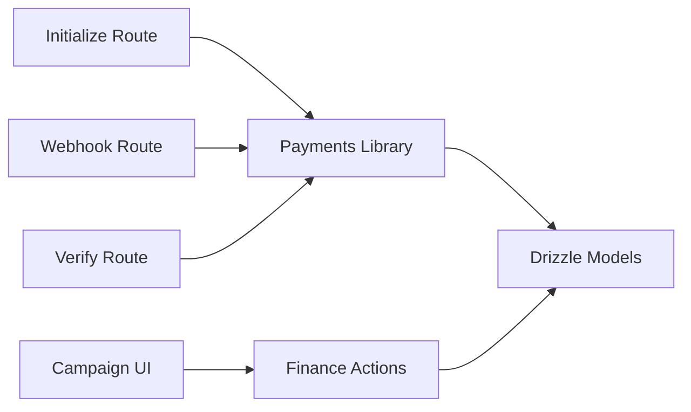

**Diagram sources**
- [initialize route:11-89](file://app/api/payments/initialize/route.ts#L11-L89)
- [paystack-webhook route:7-41](file://app/api/payments/paystack-webhook/route.ts#L7-L41)
- [verify route:70-95](file://app/api/payments/verify/route.ts#L70-L95)
- [payments.ts:18-190](file://lib/payments.ts#L18-L190)
- [finance actions:134-276](file://lib/actions/finance.ts#L134-L276)

**Section sources**
- [initialize route:11-89](file://app/api/payments/initialize/route.ts#L11-L89)
- [paystack-webhook route:7-41](file://app/api/payments/paystack-webhook/route.ts#L7-L41)
- [verify route:70-95](file://app/api/payments/verify/route.ts#L70-L95)
- [payments.ts:18-190](file://lib/payments.ts#L18-L190)
- [finance actions:134-276](file://lib/actions/finance.ts#L134-L276)

## Performance Considerations
- Use batched queries for analytics to avoid cartesian explosion when joining budgets and items.
- Prefer targeted selects and indexes on frequently queried fields (organizationId, status, createdAt).
- Avoid synchronous heavy operations in webhooks; acknowledge quickly and process asynchronously if needed.
- Cache static configuration (e.g., bank lists) if accessed frequently.

[No sources needed since this section provides general guidance]

## Troubleshooting Guide
Common issues and resolutions:
- Signature mismatch in webhooks: Ensure PAYSTACK_SECRET_KEY matches and payload hashing uses correct algorithm and encoding.
- Pending payments not updating: Use sync endpoint to re-verify references; check Paystack API availability and network errors.
- Campaign progress not increasing: Confirm payment status transitions to SUCCESS and campaignId is set; verify raisedAmount increment logic.
- Currency display anomalies: Validate stored currency and client formatter locale; ensure amount is numeric before formatting.

**Section sources**
- [paystack-webhook route:7-41](file://app/api/payments/paystack-webhook/route.ts#L7-L41)
- [payments.ts:60-96](file://lib/payments.ts#L60-L96)
- [payments.ts:152-186](file://lib/payments.ts#L152-L186)
- [client currency component:12-40](file://components/ui/client-currency.tsx#L12-L40)

## Conclusion
The financial and payment data model provides a robust foundation for processing transactions, managing fundraising campaigns, and maintaining accurate financial records. With clear payment types, status tracking, Paystack integration, and comprehensive audit trails, the system supports transparent reporting and secure operations. Budgets and fund requests introduce controlled spending workflows, while analytics enable ongoing insights into revenue trends and compliance.

[No sources needed since this section summarizes without analyzing specific files]

## Appendices

### Payments Table Schema Summary
- Identities: id, userId, organizationId, memberId, campaignId
- Amounts: amount, currency (default NGN)
- Status: PENDING, SUCCESS, FAILED, CANCELLED, REFUNDED
- Type: MEMBERSHIP_FEE, RENEWAL, DONATION, EVENT_FEE, BURIAL_FEE, LEVY, CONTEST_FEE, OTHER
- Integration: paystackRef (unique), paystackResponse (JSON)
- Metadata: description, metadata (JSON), paidAt, timestamps

**Section sources**
- [schema.prisma:398-475](file://prisma/schema.prisma#L398-L475)

### Campaign Progress Calculation
- Percentage = min((raisedAmount / targetAmount) * 100, 100)
- Recent donations filtered by SUCCESS status and ordered by creation time

**Section sources**
- [campaign detail page:35-134](file://app/[jurisdiction]/campaigns/[slug]/page.tsx#L35-L134)

### Security and Compliance Notes
- Store only non-sensitive identifiers and references; avoid storing raw card details.
- Use HTTPS and signed webhooks to validate provider callbacks.
- Maintain audit logs for all financial actions to support compliance audits.
- Restrict access to financial endpoints via authentication and role-based checks.

**Section sources**
- [audit log model:511-530](file://prisma/schema.prisma#L511-L530)
- [initialize route:11-89](file://app/api/payments/initialize/route.ts#L11-L89)
- [paystack-webhook route:7-41](file://app/api/payments/paystack-webhook/route.ts#L7-L41)