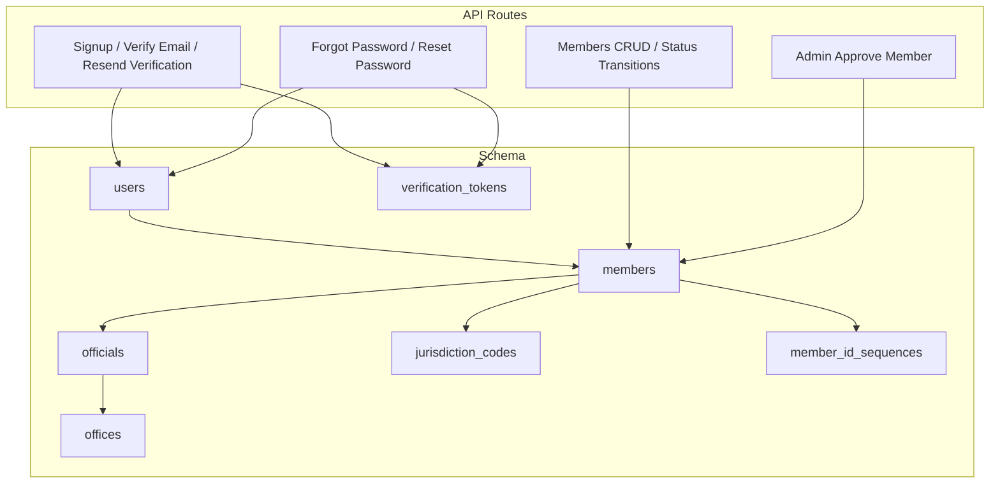
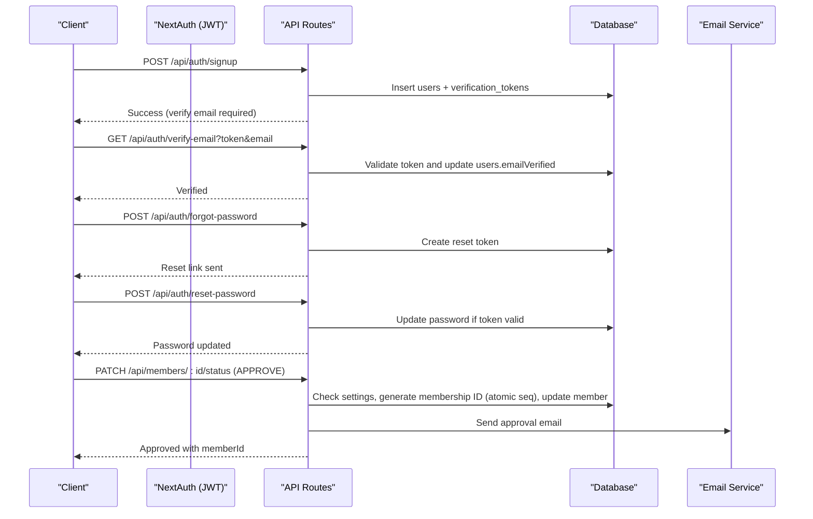
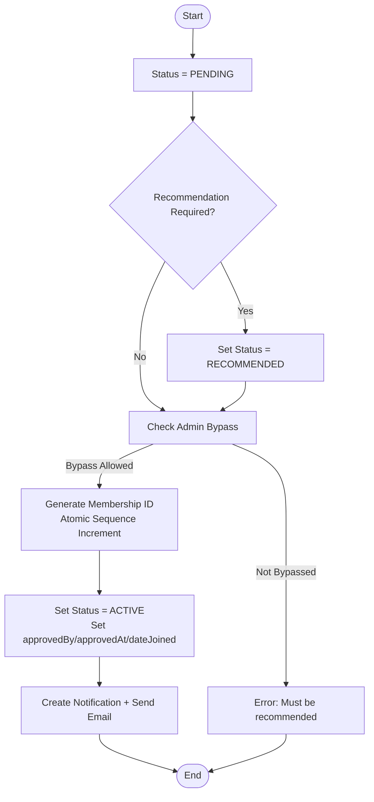
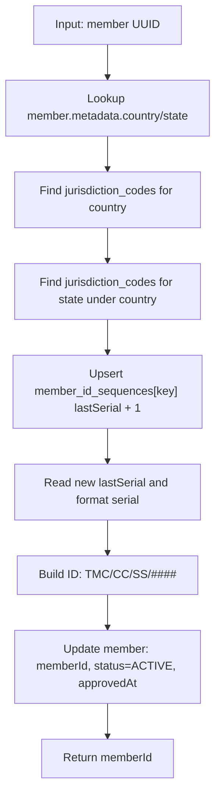
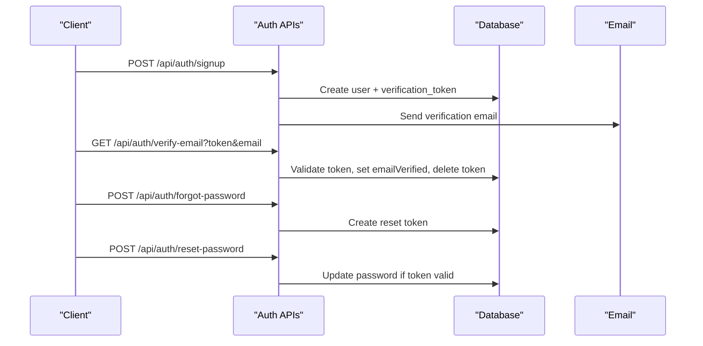
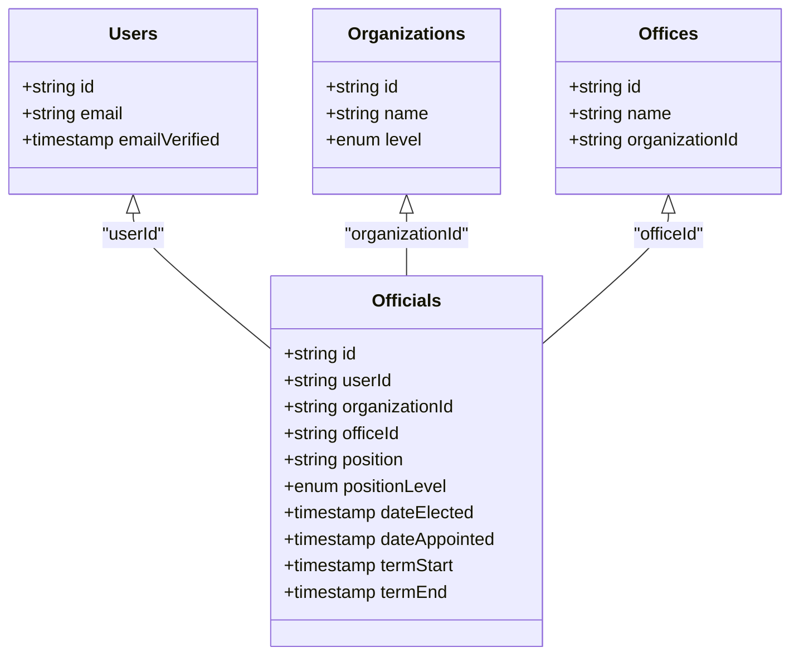
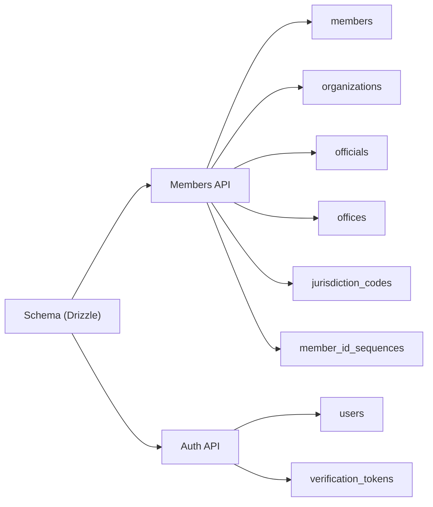

# Membership & User Data Model

<cite>
**Referenced Files in This Document**
- [schema.ts](file://lib/db/schema.ts)
- [membership-id.ts](file://lib/actions/membership-id.ts)
- [create-jurisdiction-tables.ts](file://scripts/create-jurisdiction-tables.ts)
- [route.ts (members)](file://app/api/members/route.ts)
- [route.ts (approve member)](file://app/api/admin/members/[id]/approve/route.ts)
- [route.ts (member status)](file://app/api/members/[id]/status/route.ts)
- [route.ts (signup)](file://app/api/auth/signup/route.ts)
- [route.ts (verify email)](file://app/api/auth/verify-email/route.ts)
- [route.ts (resend verification)](file://app/api/auth/resend-verification/route.ts)
- [route.ts (forgot password)](file://app/api/auth/forgot-password/route.ts)
- [route.ts (reset password)](file://app/api/auth/reset-password/route.ts)
- [auth.config.ts](file://lib/auth.config.ts)
- [auth.ts](file://lib/auth.ts)
</cite>

## Table of Contents
1. Introduction
2. Project Structure
3. Core Components
4. Architecture Overview
5. Detailed Component Analysis
6. Dependency Analysis
7. Performance Considerations
8. Troubleshooting Guide
9. Conclusion

## Introduction
This document describes the membership and user data model with a focus on:
- Member lifecycle management and approval workflows
- User authentication, email verification, password reset, and session handling via NextAuth
- Membership ID generation using jurisdiction-based coding and sequence management
- Official appointments, office assignments, and term management
- Data validation rules, business constraints, and referential integrity between users, members, and officials
- Privacy considerations, data retention policies, and compliance requirements for personal information

## Project Structure
The membership and user domain spans database schema definitions, API routes for authentication and membership operations, and supporting scripts for jurisdiction tables and sequences.

**Diagram sources**
- [schema.ts:84-146](file://lib/db/schema.ts#L84-L146)
- [schema.ts:230-244](file://lib/db/schema.ts#L230-L244)
- [schema.ts:247-290](file://lib/db/schema.ts#L247-L290)
- [route.ts (signup):1-141](file://app/api/auth/signup/route.ts#L1-L141)
- [route.ts (verify email):1-63](file://app/api/auth/verify-email/route.ts#L1-L63)
- [route.ts (resend verification):1-67](file://app/api/auth/resend-verification/route.ts#L1-L67)
- [route.ts (forgot password):1-44](file://app/api/auth/forgot-password/route.ts#L1-L44)
- [route.ts (reset password):1-41](file://app/api/auth/reset-password/route.ts#L1-L41)
- [route.ts (members):1-203](file://app/api/members/route.ts#L1-L203)
- [route.ts (member status):1-184](file://app/api/members/[id]/status/route.ts#L1-L184)
- [route.ts (approve member):1-85](file://app/api/admin/members/[id]/approve/route.ts#L1-L85)

**Section sources**
- [schema.ts:84-146](file://lib/db/schema.ts#L84-L146)
- [schema.ts:230-244](file://lib/db/schema.ts#L230-L244)
- [schema.ts:247-290](file://lib/db/schema.ts#L247-L290)
- [route.ts (signup):1-141](file://app/api/auth/signup/route.ts#L1-L141)
- [route.ts (verify email):1-63](file://app/api/auth/verify-email/route.ts#L1-L63)
- [route.ts (resend verification):1-67](file://app/api/auth/resend-verification/route.ts#L1-L67)
- [route.ts (forgot password):1-44](file://app/api/auth/forgot-password/route.ts#L1-L44)
- [route.ts (reset password):1-41](file://app/api/auth/reset-password/route.ts#L1-L41)
- [route.ts (members):1-203](file://app/api/members/route.ts#L1-L203)
- [route.ts (member status):1-184](file://app/api/members/[id]/status/route.ts#L1-L184)
- [route.ts (approve member):1-85](file://app/api/admin/members/[id]/approve/route.ts#L1-L85)

## Core Components
- Users and sessions:
  - users table stores identity and optional E2EE fields; sessions and accounts are managed by NextAuth; verification tokens support email verification and password resets.
- Members:
  - members table tracks membership lifecycle, type, dates, and approval metadata; references to users and organizations enforce referential integrity.
- Officials and offices:
  - officials records bind a user to an organization and office with position and term dates; offices define roles within an organization.
- Jurisdiction codes and sequences:
  - jurisdiction_codes store country/state codes used in membership IDs; member_id_sequences provide per-country-state serial counters.

Key enums and constraints:
- Member status: PENDING, RECOMMENDED, ACTIVE, SUSPENDED, EXPIRED, INACTIVE, REJECTED
- Membership type: REGULAR, ASSOCIATE, HONORARY, LIFETIME
- Official level: NATIONAL, STATE, LOCAL_GOVERNMENT, BRANCH

**Section sources**
- [schema.ts:21-27](file://lib/db/schema.ts#L21-L27)
- [schema.ts:84-146](file://lib/db/schema.ts#L84-L146)
- [schema.ts:230-244](file://lib/db/schema.ts#L230-L244)
- [schema.ts:247-290](file://lib/db/schema.ts#L247-L290)

## Architecture Overview
The system integrates NextAuth for authentication, Drizzle ORM for schema access, and API routes to orchestrate user signup, email verification, password reset, and membership approvals. Membership IDs are generated using jurisdiction codes and atomic sequences.

**Diagram sources**
- [route.ts (signup):1-141](file://app/api/auth/signup/route.ts#L1-L141)
- [route.ts (verify email):1-63](file://app/api/auth/verify-email/route.ts#L1-L63)
- [route.ts (forgot password):1-44](file://app/api/auth/forgot-password/route.ts#L1-L44)
- [route.ts (reset password):1-41](file://app/api/auth/reset-password/route.ts#L1-L41)
- [route.ts (member status):1-184](file://app/api/members/[id]/status/route.ts#L1-L184)
- [membership-id.ts:1-98](file://lib/actions/membership-id.ts#L1-L98)
- [auth.config.ts:1-12](file://lib/auth.config.ts#L1-L12)
- [auth.ts:154-195](file://lib/auth.ts#L154-L195)

## Detailed Component Analysis

### Membership Lifecycle and Approval Workflow
- States and transitions:
  - PENDING -> RECOMMENDED (by authorized official or admin)
  - RECOMMENDED -> ACTIVE (on final approval; generates membership ID)
  - ACTIVE -> SUSPENDED/EXPIRED/INACTIVE (administrative actions)
  - Any state -> REJECTED (with reason)
- Approval workflow:
  - Recommendation step is configurable; admins can bypass when configured.
  - On approval, membership ID is generated and stored; notification and email are sent.
- Business constraints:
  - Requires recommendation unless bypassed by admin/super-admin.
  - Membership ID generation requires valid jurisdiction codes and atomic sequence increment.

**Diagram sources**
- [route.ts (member status):1-184](file://app/api/members/[id]/status/route.ts#L1-L184)
- [membership-id.ts:1-98](file://lib/actions/membership-id.ts#L1-L98)

**Section sources**
- [route.ts (member status):1-184](file://app/api/members/[id]/status/route.ts#L1-L184)
- [membership-id.ts:1-98](file://lib/actions/membership-id.ts#L1-L98)

### Membership ID Generation System
- Format: TMC/{CountryCode}/{StateCode}/{Serial}
- Steps:
  - Resolve country code from jurisdiction_codes by name
  - Resolve state code under the country
  - Atomically increment per-country-state sequence in member_id_sequences
  - Pad serial to fixed width and assign to member
  - Mark member as ACTIVE and set approval timestamps
- Constraints:
  - Prevents duplicate ID assignment
  - Requires valid jurisdiction entries; errors otherwise

**Diagram sources**
- [membership-id.ts:1-98](file://lib/actions/membership-id.ts#L1-L98)
- [create-jurisdiction-tables.ts:1-45](file://scripts/create-jurisdiction-tables.ts#L1-L45)

**Section sources**
- [membership-id.ts:1-98](file://lib/actions/membership-id.ts#L1-L98)
- [create-jurisdiction-tables.ts:1-45](file://scripts/create-jurisdiction-tables.ts#L1-L45)

### User Authentication and Session Handling (NextAuth)
- Signup flow:
  - Validates input, hashes password, creates user, issues verification token, sends verification email.
- Email verification:
  - Validates token, marks email verified, deletes token.
- Password reset:
  - Generates time-bound reset token; validates and updates password.
- Session strategy:
  - JWT-based sessions; callbacks populate token with user data.

**Diagram sources**
- [route.ts (signup):1-141](file://app/api/auth/signup/route.ts#L1-L141)
- [route.ts (verify email):1-63](file://app/api/auth/verify-email/route.ts#L1-L63)
- [route.ts (forgot password):1-44](file://app/api/auth/forgot-password/route.ts#L1-L44)
- [route.ts (reset password):1-41](file://app/api/auth/reset-password/route.ts#L1-L41)
- [auth.config.ts:1-12](file://lib/auth.config.ts#L1-L12)
- [auth.ts:154-195](file://lib/auth.ts#L154-L195)

**Section sources**
- [route.ts (signup):1-141](file://app/api/auth/signup/route.ts#L1-L141)
- [route.ts (verify email):1-63](file://app/api/auth/verify-email/route.ts#L1-L63)
- [route.ts (forgot password):1-44](file://app/api/auth/forgot-password/route.ts#L1-L44)
- [route.ts (reset password):1-41](file://app/api/auth/reset-password/route.ts#L1-L41)
- [auth.config.ts:1-12](file://lib/auth.config.ts#L1-L12)
- [auth.ts:154-195](file://lib/auth.ts#L154-L195)

### Official Appointments, Office Assignments, and Term Management
- Officials bind a user to an organization and optionally an office with:
  - Position and position level
  - Election/appointment dates
  - Term start and end dates
- Offices define organizational roles and are scoped to organizations.
- Referential integrity:
  - officials.userId references users.id (unique)
  - officials.organizationId references organizations.id
  - officials.officeId references offices.id

**Diagram sources**
- [schema.ts:273-302](file://lib/db/schema.ts#L273-L302)

**Section sources**
- [schema.ts:273-302](file://lib/db/schema.ts#L273-L302)

### Data Validation Rules and Business Constraints
- Input validation:
  - Signup uses schema validation for required fields and password length.
  - Reset password enforces minimum password length and token validity.
- Membership constraints:
  - Recommendation requirement enforced before approval unless bypassed by admin/super-admin.
  - Membership ID generation requires valid jurisdiction codes and atomic sequence increments.
- Referential integrity:
  - Foreign keys ensure consistency across users, members, officials, organizations, and offices.
  - Unique constraints prevent duplicate emails and membership IDs.

**Section sources**
- [route.ts (signup):15-23](file://app/api/auth/signup/route.ts#L15-L23)
- [route.ts (reset password):10-20](file://app/api/auth/reset-password/route.ts#L10-L20)
- [route.ts (member status):75-101](file://app/api/members/[id]/status/route.ts#L75-L101)
- [membership-id.ts:13-98](file://lib/actions/membership-id.ts#L13-L98)
- [schema.ts:84-146](file://lib/db/schema.ts#L84-L146)
- [schema.ts:230-244](file://lib/db/schema.ts#L230-L244)
- [schema.ts:247-290](file://lib/db/schema.ts#L247-L290)

### Privacy, Data Retention, and Compliance
- Personal data fields:
  - Users and members store contact details, demographics, and emergency contacts.
  - Members include metadata for jurisdictional context.
- Security measures:
  - Passwords hashed before storage.
  - Verification tokens are time-bound and deleted after use.
  - Optional E2EE fields exist for secure messaging contexts.
- Retention considerations:
  - Tokens have expiration times; implement cleanup jobs to purge expired tokens and logs.
  - Audit logs capture sensitive actions; consider retention policies aligned with compliance.
- Compliance recommendations:
  - Minimize collection of sensitive personal data.
  - Provide mechanisms for data export and deletion upon request.
  - Encrypt sensitive fields at rest where feasible and restrict access via RBAC.

[No sources needed since this section provides general guidance]

## Dependency Analysis
The following diagram shows key dependencies among core components involved in membership and user data management.

**Diagram sources**
- [schema.ts:84-146](file://lib/db/schema.ts#L84-L146)
- [schema.ts:230-244](file://lib/db/schema.ts#L230-L244)
- [schema.ts:247-290](file://lib/db/schema.ts#L247-L290)
- [route.ts (members):1-203](file://app/api/members/route.ts#L1-L203)
- [route.ts (member status):1-184](file://app/api/members/[id]/status/route.ts#L1-L184)
- [route.ts (signup):1-141](file://app/api/auth/signup/route.ts#L1-L141)

**Section sources**
- [schema.ts:84-146](file://lib/db/schema.ts#L84-L146)
- [schema.ts:230-244](file://lib/db/schema.ts#L230-L244)
- [schema.ts:247-290](file://lib/db/schema.ts#L247-L290)
- [route.ts (members):1-203](file://app/api/members/route.ts#L1-L203)
- [route.ts (member status):1-184](file://app/api/members/[id]/status/route.ts#L1-L184)
- [route.ts (signup):1-141](file://app/api/auth/signup/route.ts#L1-L141)

## Performance Considerations
- Use transactions for multi-step operations (e.g., creating user and member together).
- Prefer indexed queries for frequent filters (e.g., email, organizationId, status).
- Avoid unnecessary joins; fetch related data only when needed.
- Implement background jobs for email sending and token cleanup to reduce request latency.
- Cache frequently accessed configuration (e.g., membership settings) to reduce DB load.

[No sources needed since this section provides general guidance]

## Troubleshooting Guide
Common issues and resolutions:
- Invalid or expired verification/reset token:
  - Ensure token exists and has not expired; regenerate if necessary.
- Missing jurisdiction codes:
  - Populate jurisdiction_codes for all countries/states; validate names and parent relationships.
- Duplicate email or membership ID:
  - Enforce unique constraints at the database level; handle conflicts gracefully in API responses.
- Recommendation requirement blocking approval:
  - Configure settings to require recommendation or allow admin bypass; verify permissions.
- Email delivery failures:
  - Check email service configuration and templates; review email_logs for errors.

**Section sources**
- [route.ts (verify email):1-63](file://app/api/auth/verify-email/route.ts#L1-L63)
- [route.ts (forgot password):1-44](file://app/api/auth/forgot-password/route.ts#L1-L44)
- [route.ts (reset password):1-41](file://app/api/auth/reset-password/route.ts#L1-L41)
- [membership-id.ts:13-98](file://lib/actions/membership-id.ts#L13-L98)
- [route.ts (member status):75-101](file://app/api/members/[id]/status/route.ts#L75-L101)

## Conclusion
The membership and user data model provides a robust foundation for managing member lifecycles, authentication, and official appointments. It leverages NextAuth for secure sessions, Drizzle for schema integrity, and jurisdiction-based membership IDs with atomic sequences. Strong validation, referential integrity, and clear workflows ensure reliable operations while supporting privacy and compliance needs.

[No sources needed since this section summarizes without analyzing specific files]