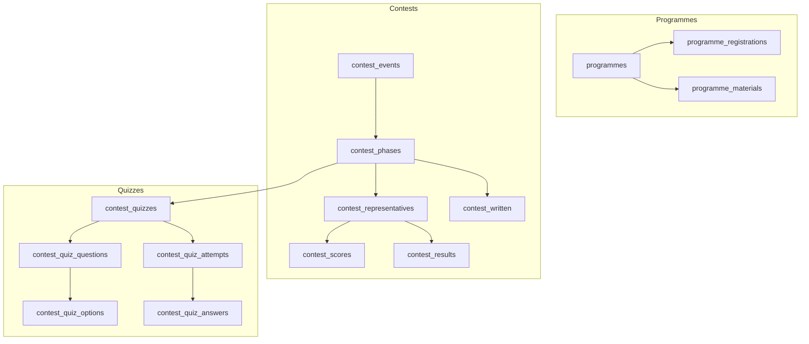
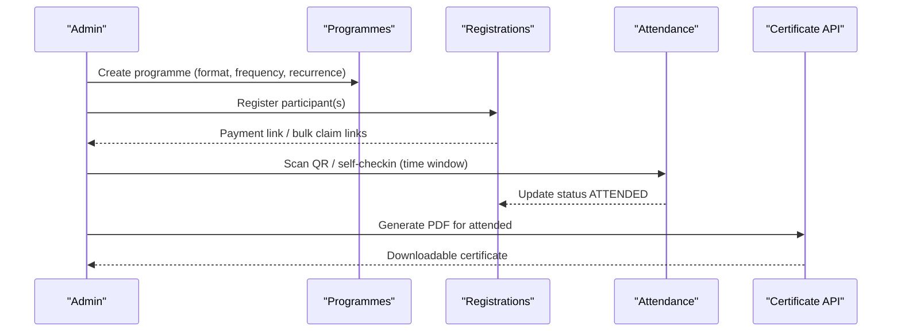
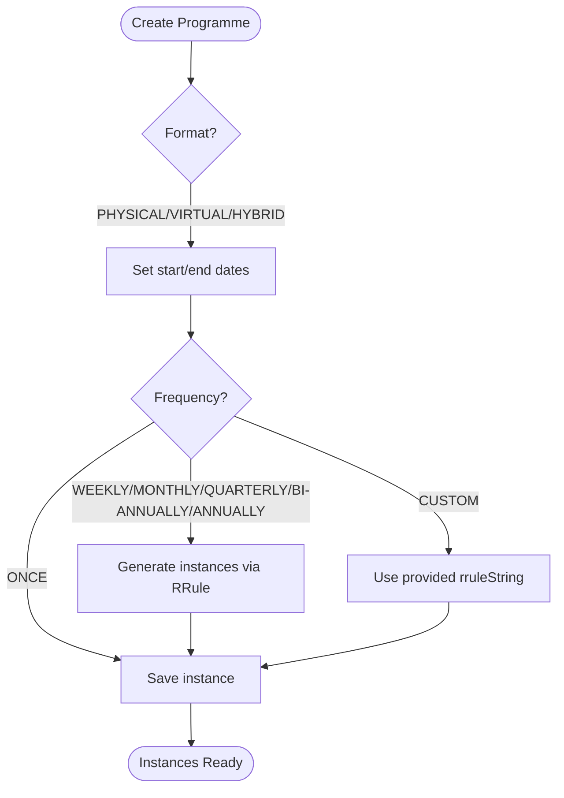
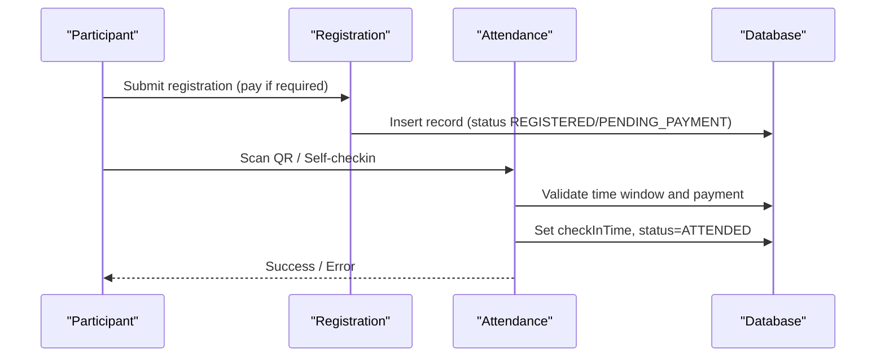
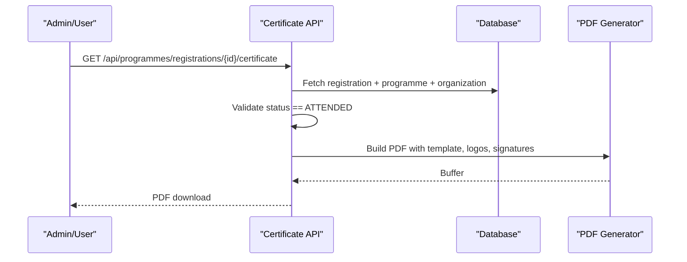
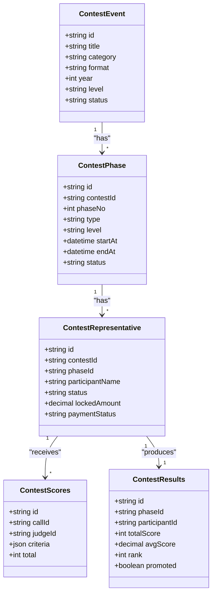
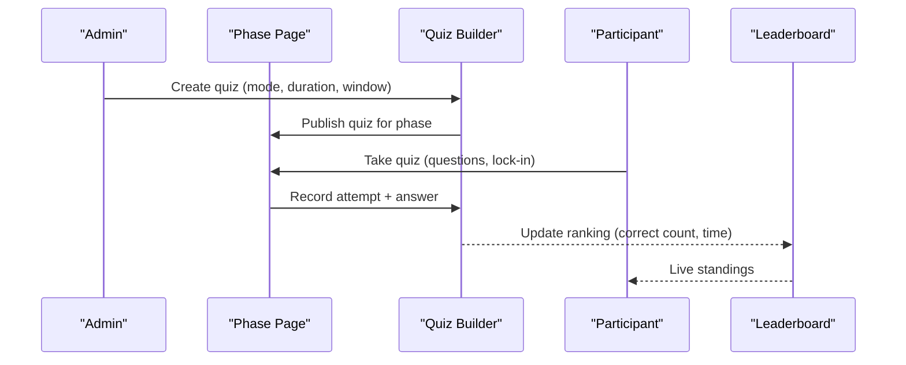
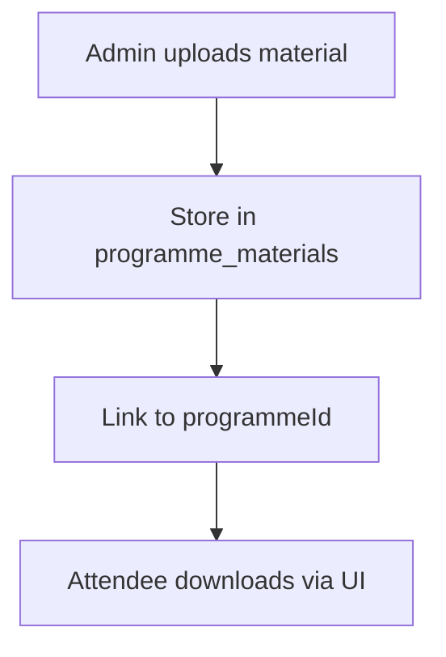
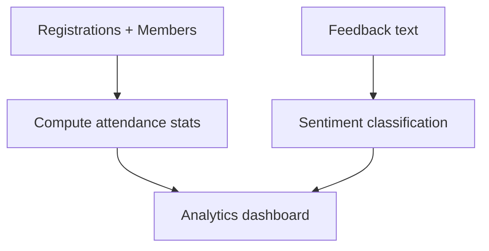
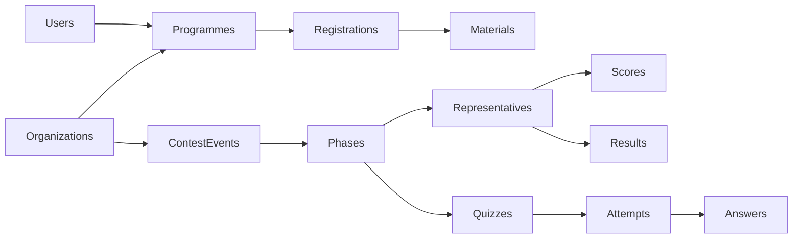

# Program & Event Data Model

<cite>
**Referenced Files in This Document**
- [0008_contests.sql](file://drizzle/0008_contests.sql)
- [0010_contest_quiz.sql](file://drizzle/0010_contest_quiz.sql)
- [0012_programme_recurrence.sql](file://drizzle/0012_programme_recurrence.sql)
- [0011_bulk_registration.sql](file://drizzle/0011_bulk_registration.sql)
- [schema.prisma](file://prisma/schema.prisma)
- [programmes.ts](file://lib/actions/programmes.ts)
- [certificate route.ts](file://app/api/programmes/registrations/[id]/certificate/route.ts)
- [quiz page.tsx](file://app/dashboard/contests/[id]/phases/[phaseId]/quiz/page.tsx)
- [quiz leaderboard.tsx](file://components/contests-live/quiz/quiz-leaderboard.tsx)
- [programme materials download.tsx](file://components/programme/programme-materials-download.tsx)
- [programme analytics page.tsx](file://app/dashboard/admin/programmes/[id]/analytics/page.tsx)
</cite>

## Table of Contents
1. Introduction
2. Project Structure
3. Core Components
4. Architecture Overview
5. Detailed Component Analysis
6. Dependency Analysis
7. Performance Considerations
8. Troubleshooting Guide
9. Conclusion

## Introduction
This document explains the program and event data model with a focus on:
- Programme scheduling, formats, frequencies, and recurrence patterns
- Registration management including participant tracking, attendance recording, and certificate generation
- Contest and competition structures covering phases, scoring, and leaderboards
- Quiz functionality for question management, real-time scoring, and result aggregation
- Programme materials management, resource allocation, and capacity planning
- Programme analytics, participation metrics, and reporting capabilities

## Project Structure
The system is organized around database migrations that define core tables for programmes, registrations, contests, phases, quizzes, and related entities. Server actions implement business logic (registration, attendance, materials), while API routes generate certificates and pages orchestrate quiz flows and analytics.

**Diagram sources**
- [0008_contests.sql:4-141](file://drizzle/0008_contests.sql#L4-L141)
- [0010_contest_quiz.sql:2-73](file://drizzle/0010_contest_quiz.sql#L2-L73)
- [0012_programme_recurrence.sql:1-5](file://drizzle/0012_programme_recurrence.sql#L1-L5)
- [0011_bulk_registration.sql:1-36](file://drizzle/0011_bulk_registration.sql#L1-L36)

**Section sources**
- [0008_contests.sql:4-141](file://drizzle/0008_contests.sql#L4-L141)
- [0010_contest_quiz.sql:2-73](file://drizzle/0010_contest_quiz.sql#L2-L73)
- [0012_programme_recurrence.sql:1-5](file://drizzle/0012_programme_recurrence.sql#L1-L5)
- [0011_bulk_registration.sql:1-36](file://drizzle/0011_bulk_registration.sql#L1-L36)

## Core Components
- Programme scheduling and recurrence: supports formats (PHYSICAL, VIRTUAL, HYBRID), frequencies (WEEKLY, MONTHLY, QUARTERLY, BI-ANNUALLY, ANNUALLY, ONCE, CUSTOM), and RRule-based recurrence with weekday-based monthly options.
- Registrations and attendance: tracks participants, payment status, check-in/out windows, bulk registration groups, and claim tokens.
- Certificates: generates PDFs for attended participants with configurable templates and partner branding.
- Contests and phases: organizes multi-level competitions with representative management, timetables, calls, scoring, results, and written submissions.
- Quizzes: supports LIVE_SYNC_RACE and ASYNC_STANDARD modes with questions, options, attempts, answers, and leaderboards.
- Materials and resources: associates downloadable materials with programmes; supports admin upload and attendee access.
- Analytics: aggregates participation metrics, attendance timing, and feedback sentiment for evaluation.

**Section sources**
- [programmes.ts:33-97](file://lib/actions/programmes.ts#L33-L97)
- [certificate route.ts:49-72](file://app/api/programmes/registrations/[id]/certificate/route.ts#L49-L72)
- [0008_contests.sql:32-141](file://drizzle/0008_contests.sql#L32-L141)
- [0010_contest_quiz.sql:2-73](file://drizzle/0010_contest_quiz.sql#L2-L73)
- [programme analytics page.tsx:11-25](file://app/dashboard/admin/programmes/[id]/analytics/page.tsx#L11-L25)

## Architecture Overview
High-level flow across modules:
- Programmes are created with scheduling and recurrence rules; attendees register and pay; attendance is recorded within configured windows; certificates are generated post-attendance.
- Contests are structured into phases; representatives are registered per phase; live or async quizzes run per phase with attempts and answers; scores feed leaderboards and results.

**Diagram sources**
- [programmes.ts:33-97](file://lib/actions/programmes.ts#L33-L97)
- [certificate route.ts:49-72](file://app/api/programmes/registrations/[id]/certificate/route.ts#L49-L72)

## Detailed Component Analysis

### Programme Scheduling and Recurrence
- Formats: PHYSICAL, VIRTUAL, HYBRID
- Frequencies: WEEKLY, MONTHLY, QUARTERLY, BI-ANNUALLY, ANNUALLY, ONCE, CUSTOM
- Recurrence: RRule-based generation with BY_DATE and BY_DAY_OF_WEEK; supports weekDay and weekOrdinal for weekday-based monthly recurrences.

**Diagram sources**
- [0012_programme_recurrence.sql:1-5](file://drizzle/0012_programme_recurrence.sql#L1-L5)
- [programmes.ts:589-641](file://lib/actions/programmes.ts#L589-L641)

**Section sources**
- [0012_programme_recurrence.sql:1-5](file://drizzle/0012_programme_recurrence.sql#L1-L5)
- [programmes.ts:589-641](file://lib/actions/programmes.ts#L589-L641)

### Registration Management and Attendance
- Participant tracking: stores name, email, phone, user/member IDs, payment reference, and status transitions (REGISTERED, PAID, ATTENDED, CANCELLED).
- Bulk registration: groups with paymaster details, per-attendee amounts, total amount, currency, and claim tokens to distribute individual registrations.
- Attendance: enforces time windows before start and after end; toggles check-in/check-out; requires paid status; supports static/dynamic tokens.

**Diagram sources**
- [programmes.ts:33-97](file://lib/actions/programmes.ts#L33-L97)
- [0011_bulk_registration.sql:1-36](file://drizzle/0011_bulk_registration.sql#L1-L36)

**Section sources**
- [programmes.ts:33-97](file://lib/actions/programmes.ts#L33-L97)
- [0011_bulk_registration.sql:1-36](file://drizzle/0011_bulk_registration.sql#L1-L36)

### Certificate Generation
- Only available for attended participants.
- Supports TMC_ONLY, PARTNER_ONLY, and BOTH templates with logos and signatures.
- Generates PDF with borders, watermark, and dynamic content (name, programme title, date).

**Diagram sources**
- [certificate route.ts:49-72](file://app/api/programmes/registrations/[id]/certificate/route.ts#L49-L72)
- [certificate route.ts:74-254](file://app/api/programmes/registrations/[id]/certificate/route.ts#L74-L254)

**Section sources**
- [certificate route.ts:49-72](file://app/api/programmes/registrations/[id]/certificate/route.ts#L49-L72)
- [certificate route.ts:74-254](file://app/api/programmes/registrations/[id]/certificate/route.ts#L74-L254)

### Contest and Competition Structures
- Events: category (QURAN, DEBATE, WRITTEN, OTHER), format (PHYSICAL, VIRTUAL, HYBRID), level (NATIONAL, STATE, LOCAL_GOVERNMENT, BRANCH), status lifecycle (DRAFT, OPEN, ONGOING, CLOSED, COMPLETED).
- Phases: PRELIM, SEMI, FINAL with scheduled times and venue.
- Representatives: per-phase participant records with status and payment fields.
- Timetable and Calls: slot scheduling and queue management for live sessions.
- Scoring and Results: judge criteria JSON, totals, averages, ranks, promotion flags.
- Written submissions: prompts, answers (JSON/HTML/plain text), timestamps, duration.

**Diagram sources**
- [0008_contests.sql:4-141](file://drizzle/0008_contests.sql#L4-L141)

**Section sources**
- [0008_contests.sql:4-141](file://drizzle/0008_contests.sql#L4-L141)

### Quiz Functionality
- Modes: LIVE_SYNC_RACE (speed-based correct-first) and ASYNC_STANDARD (score-based).
- Questions and options: multiple-choice with points and explanations.
- Attempts and answers: track per-participant attempts, correctness, points earned, and timing.
- Leaderboard: refreshes periodically to show rankings by mode rules.

**Diagram sources**
- [0010_contest_quiz.sql:2-73](file://drizzle/0010_contest_quiz.sql#L2-L73)
- [quiz page.tsx:17-29](file://app/dashboard/contests/[id]/phases/[phaseId]/quiz/page.tsx#L17-L29)
- [quiz leaderboard.tsx:1-23](file://components/contests-live/quiz/quiz-leaderboard.tsx#L1-L23)

**Section sources**
- [0010_contest_quiz.sql:2-73](file://drizzle/0010_contest_quiz.sql#L2-L73)
- [quiz page.tsx:17-29](file://app/dashboard/contests/[id]/phases/[phaseId]/quiz/page.tsx#L17-L29)
- [quiz leaderboard.tsx:1-23](file://components/contests-live/quiz/quiz-leaderboard.tsx#L1-L23)

### Programme Materials Management
- Admins attach materials (title, URL, file type) to programmes.
- Attendees can download materials from their programme view.

**Diagram sources**
- [programme materials download.tsx:1-43](file://components/programme/programme-materials-download.tsx#L1-L43)
- [programmes.ts:2063-2098](file://lib/actions/programmes.ts#L2063-L2098)

**Section sources**
- [programme materials download.tsx:1-43](file://components/programme/programme-materials-download.tsx#L1-L43)
- [programmes.ts:2063-2098](file://lib/actions/programmes.ts#L2063-L2098)

### Resource Allocation and Capacity Planning
- Early bird pricing and deadlines support demand shaping.
- Installment options allow flexible payment plans.
- Attendance windows and end-date constraints help manage capacity and session boundaries.
- Bulk registration groups enable centralized payment and distribution of claim links for large cohorts.

**Section sources**
- [schema.prisma:1678-1700](file://prisma/schema.prisma#L1678-L1700)
- [0011_bulk_registration.sql:1-36](file://drizzle/0011_bulk_registration.sql#L1-L36)
- [programmes.ts:33-97](file://lib/actions/programmes.ts#L33-L97)

### Programme Analytics and Reporting
- Aggregates registrations, attendance timestamps, and member associations.
- Feedback sentiment analysis uses keyword scoring to classify responses.
- Provides dashboards for administrators to evaluate effectiveness and participation trends.

**Diagram sources**
- [programme analytics page.tsx:11-25](file://app/dashboard/admin/programmes/[id]/analytics/page.tsx#L11-L25)

**Section sources**
- [programme analytics page.tsx:11-25](file://app/dashboard/admin/programmes/[id]/analytics/page.tsx#L11-L25)

## Dependency Analysis
Key relationships:
- Programmes depend on organisations and users; registrations link to programmes and optionally members/users.
- Contests depend on organisations and users; phases depend on events; representatives depend on phases; scores and results depend on representatives; quizzes depend on phases; attempts and answers depend on quizzes and representatives.
- Materials depend on programmes.

**Diagram sources**
- [0008_contests.sql:4-141](file://drizzle/0008_contests.sql#L4-L141)
- [0010_contest_quiz.sql:2-73](file://drizzle/0010_contest_quiz.sql#L2-L73)
- [0011_bulk_registration.sql:1-36](file://drizzle/0011_bulk_registration.sql#L1-L36)

**Section sources**
- [0008_contests.sql:4-141](file://drizzle/0008_contests.sql#L4-L141)
- [0010_contest_quiz.sql:2-73](file://drizzle/0010_contest_quiz.sql#L2-L73)
- [0011_bulk_registration.sql:1-36](file://drizzle/0011_bulk_registration.sql#L1-L36)

## Performance Considerations
- Recurrence generation: pre-generate instances using RRule to avoid runtime computation during peak usage.
- Attendance checks: enforce tight time windows and minimal DB writes (toggle check-in/out).
- Certificate generation: cache logo assets and minimize image processing overhead.
- Quiz leaderboards: poll at reasonable intervals (e.g., every 15 seconds) to balance freshness and load.
- Bulk registrations: batch operations and unique claim tokens reduce duplicate claims and improve throughput.

[No sources needed since this section provides general guidance]

## Troubleshooting Guide
Common issues and resolutions:
- Attendance outside window: ensure current time is within allowed hours before start and before end date; verify programme settings.
- Payment required: confirm registration status is not PENDING_PAYMENT before allowing check-in.
- Invalid QR/token: validate dynamic token or static token against programme configuration.
- Certificate unavailable: only attended participants can download certificates; verify status transition to ATTENDED.
- Quiz leaderboard stale: refresh interval may delay updates; ensure client polling is active.

**Section sources**
- [programmes.ts:33-97](file://lib/actions/programmes.ts#L33-L97)
- [certificate route.ts:49-72](file://app/api/programmes/registrations/[id]/certificate/route.ts#L49-L72)
- [quiz leaderboard.tsx:1-23](file://components/contests-live/quiz/quiz-leaderboard.tsx#L1-L23)

## Conclusion
The data model integrates robust programme scheduling with flexible recurrence, comprehensive registration and attendance workflows, and powerful contest and quiz systems. It supports scalable resource allocation, clear reporting, and effective analytics to evaluate programme impact. The modular design enables independent evolution of each component while maintaining strong relational integrity.