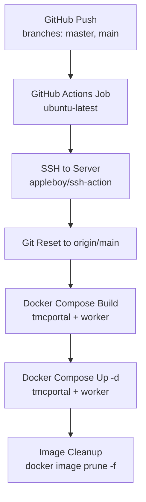
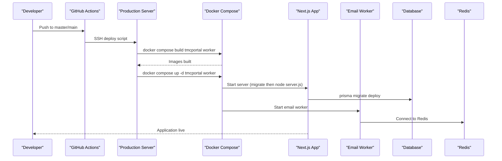
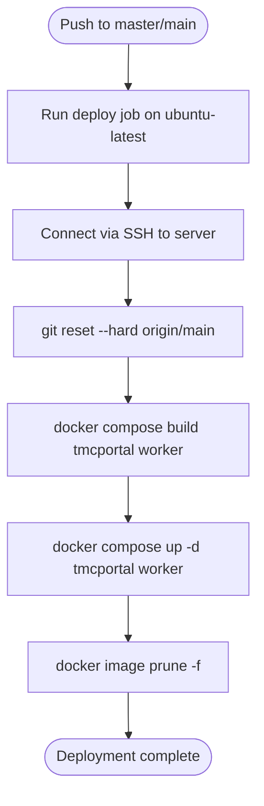
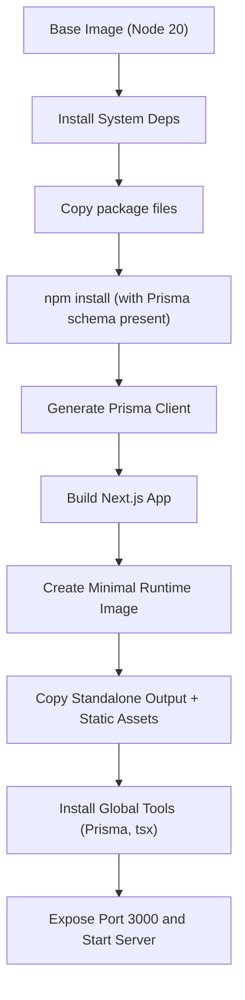
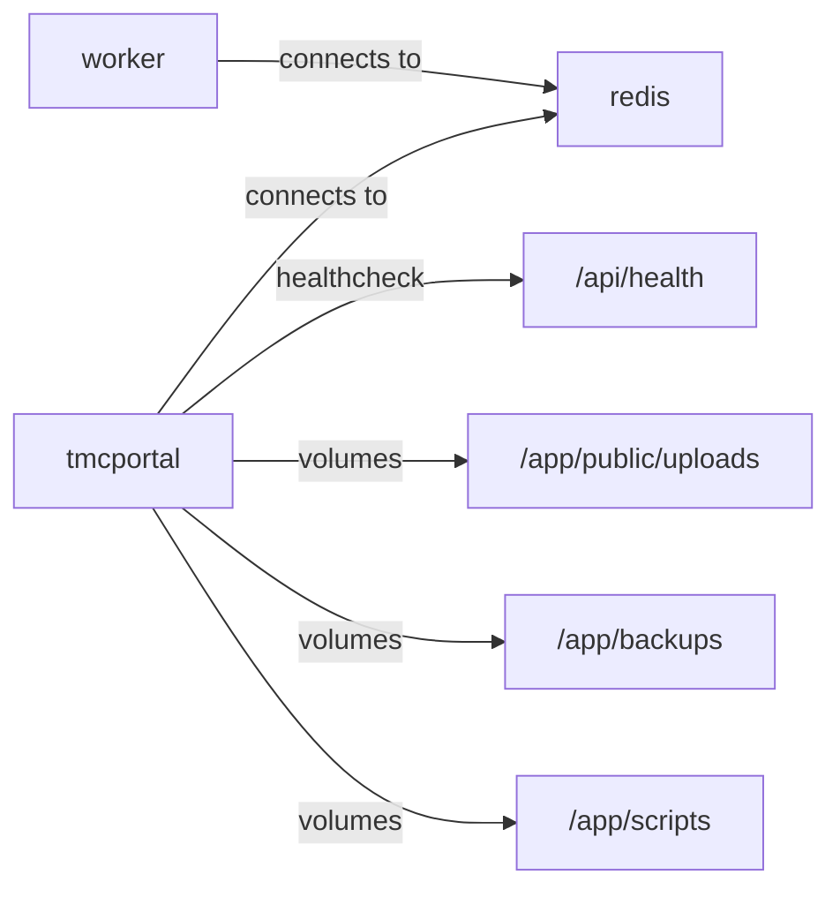
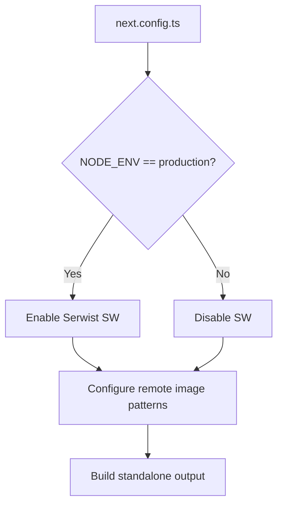
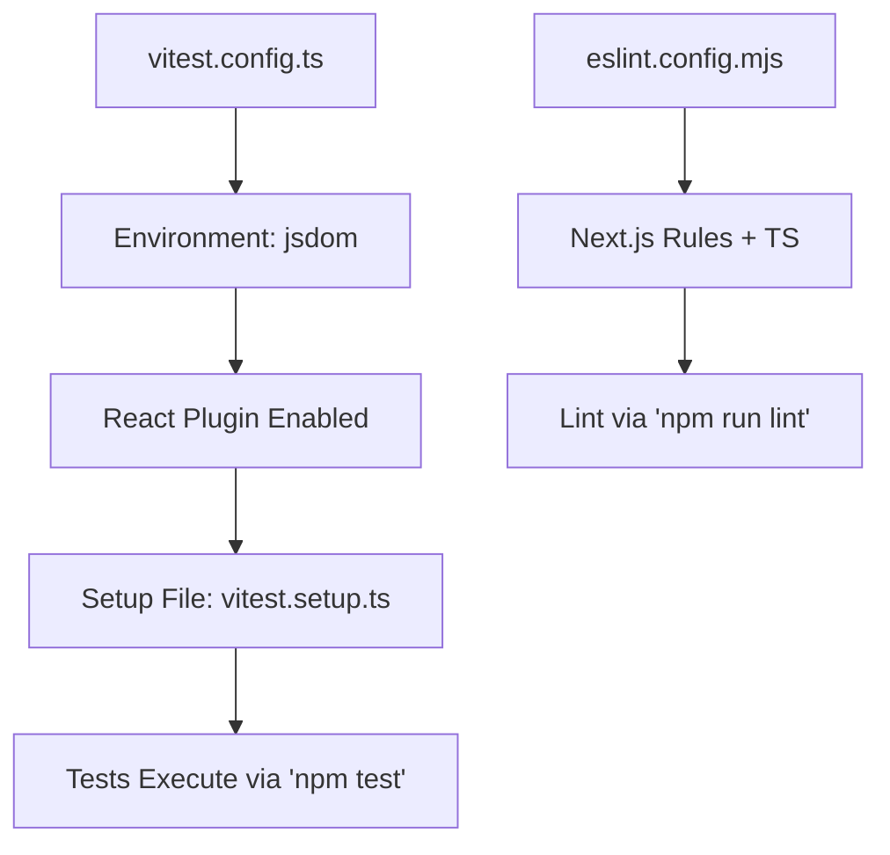
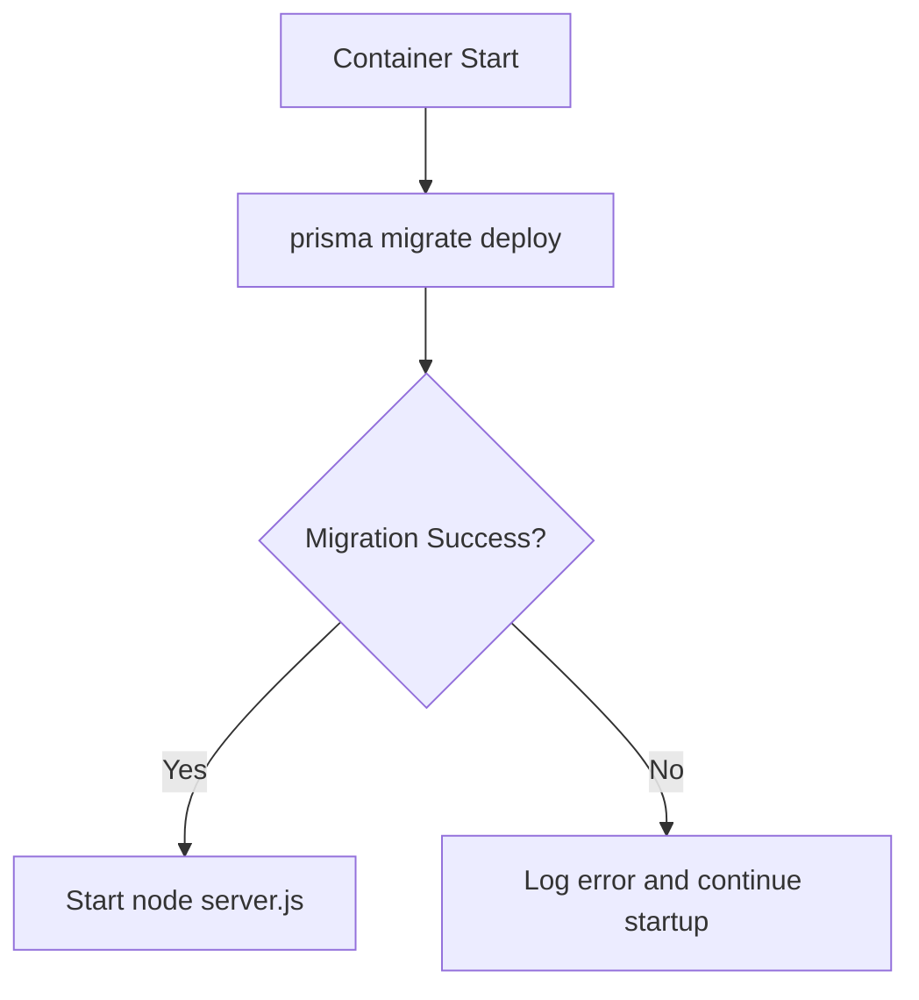
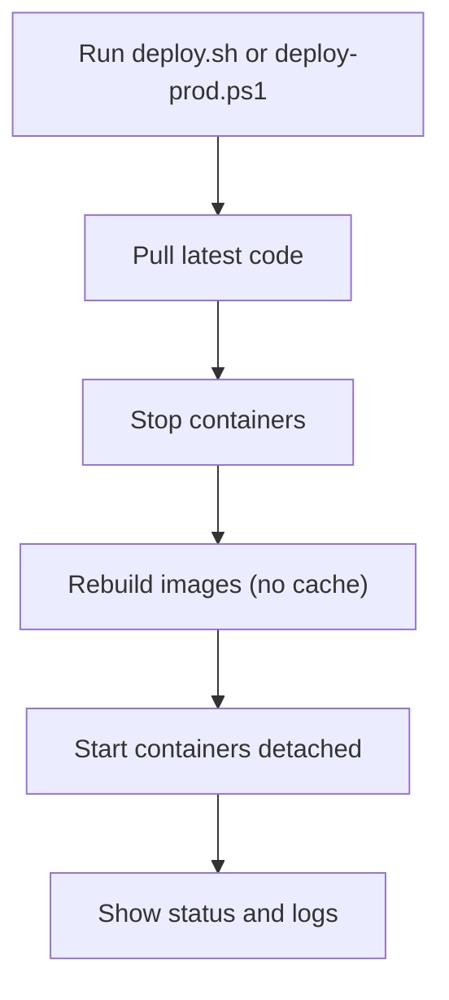
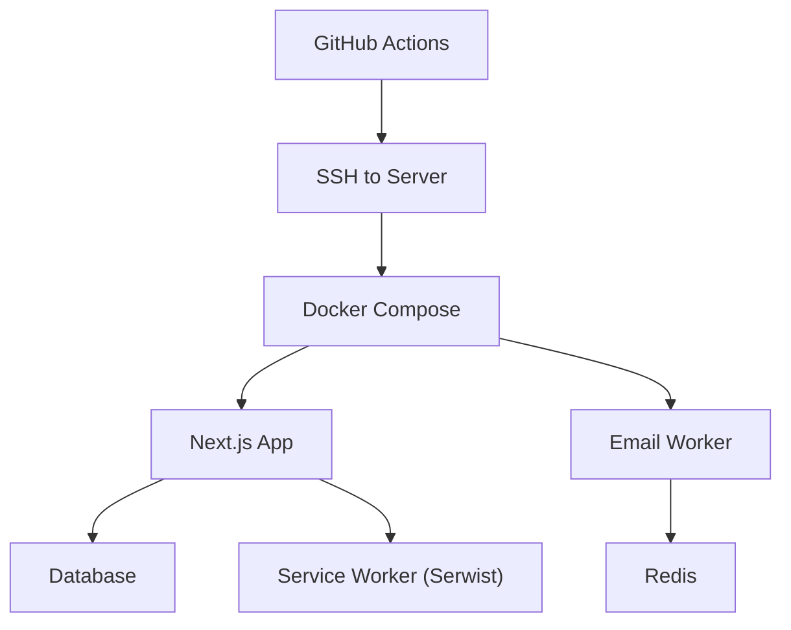

# CI/CD Pipeline & Automation

<cite>
**Referenced Files in This Document**
- [deploy.yml](file://.github/workflows/deploy.yml)
- [Dockerfile](file://Dockerfile)
- [docker-compose.yml](file://docker-compose.yml)
- [package.json](file://package.json)
- [next.config.ts](file://next.config.ts)
- [vitest.config.ts](file://vitest.config.ts)
- [vitest.setup.ts](file://vitest.setup.ts)
- [eslint.config.mjs](file://eslint.config.mjs)
- [drizzle.config.ts](file://drizzle.config.ts)
- [deploy.sh](file://deploy.sh)
- [scripts/deploy-prod.ps1](file://scripts/deploy-prod.ps1)
</cite>

## Table of Contents
1. [Introduction](#introduction)
2. [Project Structure](#project-structure)
3. [Core Components](#core-components)
4. [Architecture Overview](#architecture-overview)
5. [Detailed Component Analysis](#detailed-component-analysis)
6. [Dependency Analysis](#dependency-analysis)
7. [Performance Considerations](#performance-considerations)
8. [Troubleshooting Guide](#troubleshooting-guide)
9. [Conclusion](#conclusion)
10. [Appendices](#appendices)

## Introduction
This document describes the CI/CD pipeline for the TMC Portal, focusing on automated testing, building, and deployment workflows. It explains how GitHub Actions triggers deployments to production, how the Next.js application is built with optimization and static assets, how Docker images are constructed and run, and how environment-specific configurations and database migrations are handled. It also provides guidance on debugging failed builds, optimizing pipeline performance, and managing rollbacks.

## Project Structure
The CI/CD pipeline is centered around a single GitHub Actions workflow that deploys to a VPS via SSH. The application is containerized using a multi-stage Docker build that generates Prisma client artifacts, builds the Next.js app into standalone output, and runs both the web server and background workers. Database migrations are executed at runtime by the main service, while Redis is used as a job store for background tasks.

**Diagram sources**
- [deploy.yml:1-26](file://.github/workflows/deploy.yml#L1-L26)

**Section sources**
- [deploy.yml:1-26](file://.github/workflows/deploy.yml#L1-L26)

## Core Components
- GitHub Actions workflow: Triggers on pushes to master/main and performs an SSH-based deploy to the server.
- Dockerfile: Multi-stage build that installs dependencies, generates Prisma client, builds Next.js, and produces a minimal runtime image.
- docker-compose.yml: Defines services (web app, email worker, Redis), environment variables, health checks, and volumes.
- Next.js configuration: Outputs standalone build, configures image domains, and integrates a service worker for caching.
- Testing setup: Vitest with jsdom environment and React plugin; ESLint configured with Next.js rules.
- Drizzle configuration: Points to schema and database credentials for migrations and tooling.

**Section sources**
- [deploy.yml:1-26](file://.github/workflows/deploy.yml#L1-L26)
- [Dockerfile:1-95](file://Dockerfile#L1-L95)
- [docker-compose.yml:1-69](file://docker-compose.yml#L1-L69)
- [next.config.ts:1-41](file://next.config.ts#L1-L41)
- [vitest.config.ts:1-18](file://vitest.config.ts#L1-L18)
- [vitest.setup.ts:1-2](file://vitest.setup.ts#L1-L2)
- [eslint.config.mjs:1-19](file://eslint.config.mjs#L1-L19)
- [drizzle.config.ts:1-14](file://drizzle.config.ts#L1-L14)

## Architecture Overview
The deployment architecture uses GitHub Actions to push changes to production via SSH. On the server, Docker Compose orchestrates the Next.js server and a background worker process, backed by Redis. Migrations run before starting the server to ensure schema consistency.

**Diagram sources**
- [deploy.yml:13-25](file://.github/workflows/deploy.yml#L13-L25)
- [docker-compose.yml:21-22](file://docker-compose.yml#L21-L22)
- [docker-compose.yml:37-52](file://docker-compose.yml#L37-L52)

## Detailed Component Analysis

### GitHub Actions Deployment Workflow
- Trigger: Push events to master and main branches.
- Execution: Runs on ubuntu-latest and uses SSH action to connect to the server.
- Steps: Resets to origin/main, builds Docker images for tmcportal and worker, starts them detached, and prunes unused images.

**Diagram sources**
- [deploy.yml:1-26](file://.github/workflows/deploy.yml#L1-L26)

**Section sources**
- [deploy.yml:1-26](file://.github/workflows/deploy.yml#L1-L26)

### Docker Build and Runtime Image
- Base image: Node 20 slim with OpenSSL, MySQL client, and utilities.
- Dependency stage: Installs npm packages and copies Prisma schema prior to install to satisfy postinstall scripts.
- Builder stage: Generates Prisma client with a dummy DATABASE_URL for build-time validation, then runs the Next.js build.
- Runner stage: Copies standalone build output, static assets, public files, and required source directories; installs Prisma CLI globally; sets non-root user; exposes port 3000.

**Diagram sources**
- [Dockerfile:1-95](file://Dockerfile#L1-L95)

**Section sources**
- [Dockerfile:1-95](file://Dockerfile#L1-L95)

### Docker Compose Services and Migrations
- tmcportal service: Builds from Dockerfile, reads .env.production, sets environment variables, runs migrations before starting the server, mounts volumes for uploads/backups/scripts, depends on Redis, and includes a health check against /api/health.
- worker service: Uses the same image, runs the email worker command, connects to Redis.
- redis service: Provides persistent storage for jobs.

**Diagram sources**
- [docker-compose.yml:3-35](file://docker-compose.yml#L3-L35)
- [docker-compose.yml:37-52](file://docker-compose.yml#L37-L52)
- [docker-compose.yml:54-61](file://docker-compose.yml#L54-L61)

**Section sources**
- [docker-compose.yml:1-69](file://docker-compose.yml#L1-L69)

### Next.js Build Configuration and Asset Handling
- Output mode: standalone for efficient production runtime.
- Service worker: Integrated via Serwist to enable precaching and runtime caching; disabled in non-production environments.
- Images: Remote patterns allow loading from specific hosts; unoptimized flag set for compatibility.
- External packages: Prisma client is externalized to avoid bundling issues.

**Diagram sources**
- [next.config.ts:1-41](file://next.config.ts#L1-L41)

**Section sources**
- [next.config.ts:1-41](file://next.config.ts#L1-L41)

### Testing Setup and Code Quality
- Unit tests: Vitest configured with jsdom environment, React plugin, global helpers, and alias resolution. Test setup imports DOM matchers.
- Linting: ESLint configured with Next.js core web vitals and TypeScript rules; ignores generated/build folders.
- Scripts: test and lint commands available via package.json.

**Diagram sources**
- [vitest.config.ts:1-18](file://vitest.config.ts#L1-L18)
- [vitest.setup.ts:1-2](file://vitest.setup.ts#L1-L2)
- [eslint.config.mjs:1-19](file://eslint.config.mjs#L1-L19)
- [package.json:5-12](file://package.json#L5-L12)

**Section sources**
- [vitest.config.ts:1-18](file://vitest.config.ts#L1-L18)
- [vitest.setup.ts:1-2](file://vitest.setup.ts#L1-L2)
- [eslint.config.mjs:1-19](file://eslint.config.mjs#L1-L19)
- [package.json:5-12](file://package.json#L5-L12)

### Database Migrations and Schema Tooling
- Runtime migration: The tmcportal service runs prisma migrate deploy before starting the server to ensure schema alignment.
- Drizzle config: Points to schema file and database URL for Drizzle tooling.
- Environment: DATABASE_URL must be provided at runtime for migrations to succeed.

**Diagram sources**
- [docker-compose.yml:21-22](file://docker-compose.yml#L21-L22)
- [drizzle.config.ts:6-13](file://drizzle.config.ts#L6-L13)

**Section sources**
- [docker-compose.yml:21-22](file://docker-compose.yml#L21-L22)
- [drizzle.config.ts:1-14](file://drizzle.config.ts#L1-L14)

### Local and Alternative Deployment Scripts
- Shell script: Pulls latest code, stops containers, rebuilds without cache, starts services, shows status/logs.
- PowerShell script: Connects to a specified server and executes a similar sequence of commands.

**Diagram sources**
- [deploy.sh:1-28](file://deploy.sh#L1-L28)
- [scripts/deploy-prod.ps1:1-17](file://scripts/deploy-prod.ps1#L1-L17)

**Section sources**
- [deploy.sh:1-28](file://deploy.sh#L1-L28)
- [scripts/deploy-prod.ps1:1-17](file://scripts/deploy-prod.ps1#L1-L17)

## Dependency Analysis
The pipeline components depend on each other as follows:
- GitHub Actions workflow depends on SSH access and Docker Compose availability on the server.
- Docker Compose depends on Redis for background jobs and on environment variables for database connectivity.
- Next.js build depends on Prisma client generation and correct configuration for images and service worker.
- Tests depend on Vitest and jsdom; linting depends on ESLint and Next.js configs.

**Diagram sources**
- [deploy.yml:13-25](file://.github/workflows/deploy.yml#L13-L25)
- [docker-compose.yml:3-61](file://docker-compose.yml#L3-L61)
- [next.config.ts:1-41](file://next.config.ts#L1-L41)

**Section sources**
- [deploy.yml:13-25](file://.github/workflows/deploy.yml#L13-L25)
- [docker-compose.yml:3-61](file://docker-compose.yml#L3-L61)
- [next.config.ts:1-41](file://next.config.ts#L1-L41)

## Performance Considerations
- Use multi-stage Docker builds to minimize runtime image size and speed up deployments.
- Leverage standalone output for faster cold starts and reduced memory footprint.
- Keep dependency installation separate from build steps to maximize layer caching.
- Avoid rebuilding images with cache when necessary; use no-cache selectively for clean builds during troubleshooting.
- Offload heavy tasks to background workers to keep the web server responsive.
- Configure health checks to detect unhealthy services early.

[No sources needed since this section provides general guidance]

## Troubleshooting Guide
Common issues and resolutions:
- Migration failures: Ensure DATABASE_URL is correctly set in .env.production and accessible from the container. Check logs for errors during prisma migrate deploy.
- Service not healthy: Verify /api/health endpoint responds; review container logs for startup errors.
- Worker connectivity: Confirm Redis is reachable and REDIS_URL is set correctly.
- Build failures: Validate Prisma schema and generate step; ensure all required environment variables are present during build.
- SSH deploy issues: Confirm SERVER_IP and SSH_PRIVATE_KEY secrets are configured in GitHub repository settings.

Recommended debugging steps:
- Inspect container logs using docker compose logs.
- Re-run migrations manually inside the container if needed.
- Temporarily disable service worker caching to rule out stale assets.
- Use local scripts to simulate deployment flow and isolate issues.

**Section sources**
- [docker-compose.yml:21-35](file://docker-compose.yml#L21-L35)
- [Dockerfile:36-46](file://Dockerfile#L36-L46)
- [deploy.yml:13-25](file://.github/workflows/deploy.yml#L13-L25)

## Conclusion
The TMC Portal’s CI/CD pipeline automates end-to-end delivery from code push to production deployment. GitHub Actions triggers SSH-based deployments that build and run containerized services with robust configuration for Next.js, background workers, and database migrations. With clear separation of concerns across build, runtime, and orchestration layers, the system supports reliable releases, easy rollbacks via git resets, and scalable operations through Docker Compose.

[No sources needed since this section summarizes without analyzing specific files]

## Appendices

### Workflow Triggers and Secrets
- Triggers: Push to master and main branches.
- Secrets required: SERVER_IP, SSH_PRIVATE_KEY.

**Section sources**
- [deploy.yml:3-18](file://.github/workflows/deploy.yml#L3-L18)

### Artifact Management
- Artifacts: Docker images built per service (tmcportal, worker).
- Cleanup: Unused images are pruned after deployment to conserve disk space.

**Section sources**
- [deploy.yml:23-25](file://.github/workflows/deploy.yml#L23-L25)

### Rollback Strategy
- Immediate rollback: Reset to previous commit on the server and restart containers.
- Long-term rollback: Tag releases and pin versions in docker-compose.yml or CI workflow for precise rollouts.

**Section sources**
- [deploy.yml:21-24](file://.github/workflows/deploy.yml#L21-L24)

### Security Scanning and Compliance
- Current state: No explicit security scanning steps are defined in the workflow.
- Recommendations: Add dependency vulnerability checks (e.g., npm audit), container image scanning, and policy checks to the pipeline to improve security posture.

[No sources needed since this section provides general guidance]