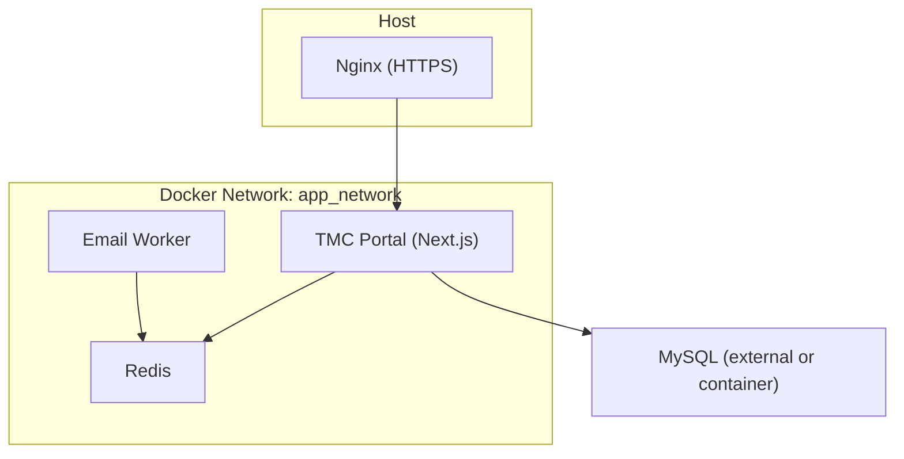
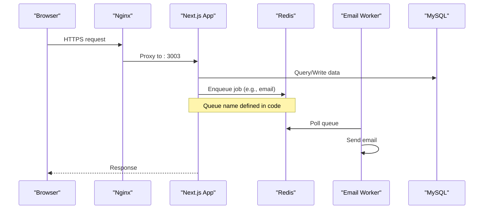
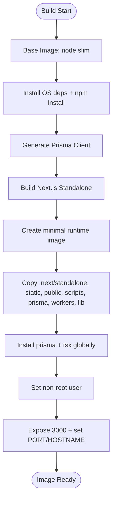
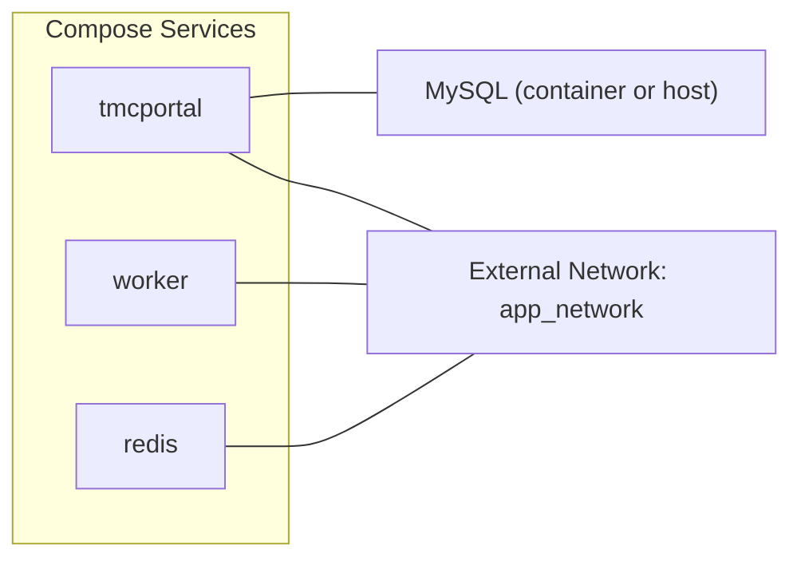
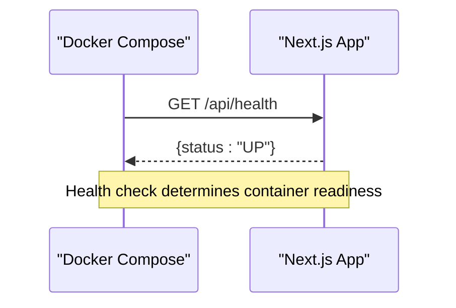
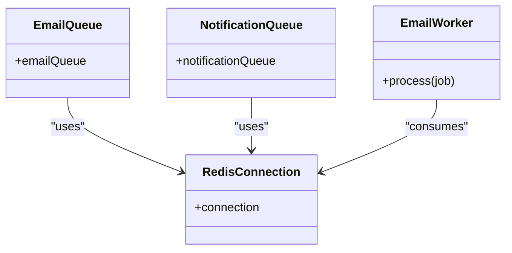
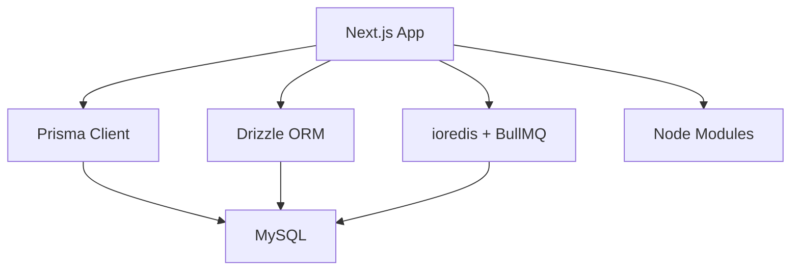

# Containerization & Docker Setup

<cite>
**Referenced Files in This Document**
- [Dockerfile](file://Dockerfile)
- [docker-compose.yml](file://docker-compose.yml)
- [.dockerignore](file://.dockerignore)
- [package.json](file://package.json)
- [next.config.ts](file://next.config.ts)
- [nginx_full_remote.conf](file://nginx_full_remote.conf)
- [nginx_tmcng.conf](file://nginx_tmcng.conf)
- [DEPLOYMENT_GUIDE_SERVER.md](file://DEPLOYMENT_GUIDE_SERVER.md)
- [SETUP.md](file://SETUP.md)
- [app/api/health/route.ts](file://app/api/health/route.ts)
- [workers/email-worker.ts](file://workers/email-worker.ts)
- [lib/redis.ts](file://lib/redis.ts)
- [lib/queue.ts](file://lib/queue.ts)
</cite>

## Table of Contents
1. [Introduction](#introduction)
2. [Project Structure](#project-structure)
3. [Core Components](#core-components)
4. [Architecture Overview](#architecture-overview)
5. [Detailed Component Analysis](#detailed-component-analysis)
6. [Dependency Analysis](#dependency-analysis)
7. [Performance Considerations](#performance-considerations)
8. [Troubleshooting Guide](#troubleshooting-guide)
9. [Conclusion](#conclusion)
10. [Appendices](#appendices)

## Introduction
This document provides comprehensive containerization guidance for the TMC Portal using Docker and Docker Compose. It explains the multi-stage build process, environment configuration, persistent volumes, networking, health checks, worker processes, and security best practices. It also includes troubleshooting tips and performance optimization recommendations tailored to this Next.js application stack with Redis-backed queues and MySQL database integration.

## Project Structure
The containerization setup centers around:
- A multi-stage Dockerfile that builds a production-ready Next.js standalone output
- A docker-compose file orchestrating the app, worker, and Redis services
- Nginx reverse proxy configurations for HTTPS and static assets
- Health check endpoints and background workers for email processing

**Diagram sources**
- [docker-compose.yml:4-68](file://docker-compose.yml#L4-L68)
- [nginx_full_remote.conf:129-165](file://nginx_full_remote.conf#L129-L165)
- [nginx_tmcng.conf:1-59](file://nginx_tmcng.conf#L1-L59)

**Section sources**
- [docker-compose.yml:1-69](file://docker-compose.yml#L1-L69)
- [nginx_full_remote.conf:1-187](file://nginx_full_remote.conf#L1-L187)
- [nginx_tmcng.conf:1-59](file://nginx_tmcng.conf#L1-L59)

## Core Components
- Multi-stage Dockerfile:
  - Base image selection: Node.js slim variant for smaller footprint
  - Dependency stage: Installs all dependencies including dev dependencies required for build
  - Build stage: Generates Prisma client and builds Next.js standalone output
  - Runtime stage: Runs as non-root user, copies only necessary artifacts, installs runtime tools globally
- Docker Compose:
  - App service: Builds/runs Next.js server, runs migrations on start, exposes port mapping, mounts volumes for uploads/backups/scripts
  - Worker service: Runs email worker consuming BullMQ jobs from Redis
  - Redis service: In-memory cache and job queue backend with persistent volume
- Environment variables:
  - DATABASE_URL, REDIS_URL, NEXT_PUBLIC_* keys, and other secrets are provided via env_file and environment overrides
- Networking:
  - All services share an external network named app_network; ensure your database container is connected to this network
- Health checks:
  - The app exposes /api/health for liveness probes
- Reverse proxy:
  - Nginx routes HTTPS traffic to the app on port 3003 and serves uploaded files directly from a host path

**Section sources**
- [Dockerfile:1-95](file://Dockerfile#L1-L95)
- [docker-compose.yml:4-68](file://docker-compose.yml#L4-L68)
- [app/api/health/route.ts:1-6](file://app/api/health/route.ts#L1-L6)
- [nginx_full_remote.conf:129-165](file://nginx_full_remote.conf#L129-L165)
- [nginx_tmcng.conf:1-59](file://nginx_tmcng.conf#L1-L59)

## Architecture Overview
The runtime architecture consists of:
- Next.js app serving HTTP requests and API routes
- Background worker processing emails via BullMQ and Redis
- Redis providing both caching and job queue storage
- MySQL database for persistence (hosted externally or in another container)
- Nginx handling TLS termination and proxying to the app

**Diagram sources**
- [docker-compose.yml:4-68](file://docker-compose.yml#L4-L68)
- [lib/queue.ts:1-18](file://lib/queue.ts#L1-L18)
- [workers/email-worker.ts:1-32](file://workers/email-worker.ts#L1-L32)
- [nginx_full_remote.conf:129-165](file://nginx_full_remote.conf#L129-L165)

## Detailed Component Analysis

### Multi-stage Docker Build Process
- Base image: Uses a slim Node.js distribution to minimize image size while retaining required system libraries
- System dependencies: Installs OpenSSL, CA certificates, wget, MySQL client, and zip utilities needed by Prisma and backup scripts
- Dependencies stage: Copies package manifests and installs all dependencies (including dev dependencies required for build)
- Build stage:
  - Generates Prisma client using a dummy DATABASE_URL to satisfy validation during build
  - Builds Next.js with standalone output enabled
- Runtime stage:
  - Creates a non-root user for improved security
  - Copies only the standalone build output, static assets, public directory, and necessary source files for workers and migrations
  - Installs Prisma CLI and tsx globally for migrations and worker execution
  - Exposes port 3000 and sets environment variables for production

**Diagram sources**
- [Dockerfile:1-95](file://Dockerfile#L1-L95)

**Section sources**
- [Dockerfile:1-95](file://Dockerfile#L1-L95)
- [next.config.ts:11-19](file://next.config.ts#L11-L19)

### Docker Compose Orchestration
- Services:
  - tmcportal: Builds and runs the Next.js app, runs migrations before starting, mounts local directories for uploads, backups, and scripts, defines health check against /api/health
  - worker: Runs the email worker consuming jobs from Redis
  - redis: Provides Redis with a persistent volume for durability across restarts
- Networking:
  - All services connect to an external network named app_network; ensure your database container is attached to this network so the app can reach it by hostname
- Environment:
  - App uses env_file for secrets and additional environment variables like NODE_ENV, HOSTNAME, REDIS_URL, and feature flags
- Volumes:
  - Local directories mounted into the app container for uploads, backups, and scripts to persist outside containers

**Diagram sources**
- [docker-compose.yml:4-68](file://docker-compose.yml#L4-L68)

**Section sources**
- [docker-compose.yml:1-69](file://docker-compose.yml#L1-L69)
- [DEPLOYMENT_GUIDE_SERVER.md:60-78](file://DEPLOYMENT_GUIDE_SERVER.md#L60-L78)

### Environment Variables Management
- Required variables include:
  - DATABASE_URL for MySQL connectivity
  - REDIS_URL for Redis connection used by BullMQ
  - NEXTAUTH_SECRET for authentication sessions
  - NEXT_PUBLIC_APP_URL for frontend URLs
  - NEXT_PUBLIC_PAYSTACK_PUBLIC_KEY passed as build arg and runtime env
- Secrets should be managed via:
  - env_file (.env.production) loaded by compose
  - Host-level secret stores or orchestration platforms (e.g., Kubernetes secrets)
- Public vs private keys:
  - NEXT_PUBLIC_* keys are intentionally exposed to the browser; keep sensitive values out of these

**Section sources**
- [docker-compose.yml:9-22](file://docker-compose.yml#L9-L22)
- [DEPLOYMENT_GUIDE_SERVER.md:28-56](file://DEPLOYMENT_GUIDE_SERVER.md#L28-L56)
- [SETUP.md:10-23](file://SETUP.md#L10-L23)

### Persistent Data and Volume Mounting
- Uploads:
  - Local ./uploads mapped to /app/public/uploads for persisted media files
- Backups:
  - Local ./backups mapped to /app/backups for database/file backups
- Scripts:
  - Local ./scripts mapped to /app/scripts to run maintenance tasks inside the container
- Redis data:
  - Named volume redis_data persists Redis state across container restarts

**Section sources**
- [docker-compose.yml:23-28](file://docker-compose.yml#L23-L28)
- [docker-compose.yml:54-61](file://docker-compose.yml#L54-L61)

### Network Configuration Between Containers
- External network:
  - The compose file declares app_network as external; create it once and attach all relevant containers
- Database connectivity:
  - If MySQL runs in another container, connect it to app_network and reference it by its container name in DATABASE_URL
- Nginx integration:
  - Nginx proxies HTTPS to localhost:3003 where the app listens within the container

**Section sources**
- [docker-compose.yml:27-30](file://docker-compose.yml#L27-L30)
- [docker-compose.yml:66-68](file://docker-compose.yml#L66-L68)
- [DEPLOYMENT_GUIDE_SERVER.md:60-78](file://DEPLOYMENT_GUIDE_SERVER.md#L60-L78)
- [nginx_full_remote.conf:129-165](file://nginx_full_remote.conf#L129-L165)

### Custom Docker Images and CI/CD
- Prebuilt images:
  - The compose references prebuilt images for the app and worker; you can build and push your own images using the provided Dockerfile
- Build args:
  - NEXT_PUBLIC_PAYSTACK_PUBLIC_KEY is passed at build time to embed public keys into the client bundle
- Recommended workflow:
  - Build image, tag with version, push to registry, then deploy via compose or platform-specific tooling

**Section sources**
- [docker-compose.yml:4-10](file://docker-compose.yml#L4-L10)
- [Dockerfile:36-43](file://Dockerfile#L36-L43)

### Health Checks and Readiness Probes
- Liveness endpoint:
  - GET /api/health returns a simple status response used by compose healthcheck
- Healthcheck configuration:
  - Interval, timeout, and retries are configured in compose to monitor app availability

**Diagram sources**
- [app/api/health/route.ts:1-6](file://app/api/health/route.ts#L1-L6)
- [docker-compose.yml:31-35](file://docker-compose.yml#L31-L35)

**Section sources**
- [app/api/health/route.ts:1-6](file://app/api/health/route.ts#L1-L6)
- [docker-compose.yml:31-35](file://docker-compose.yml#L31-L35)

### Background Workers and Queues
- Email worker:
  - Consumes jobs from the email-queue using BullMQ and Redis
  - Gracefully shuts down on SIGTERM
- Queue definitions:
  - Defines email and notification queues with shared Redis connection
- Redis connection:
  - Reads REDIS_URL from environment and configures BullMQ-compatible options

**Diagram sources**
- [lib/redis.ts:1-8](file://lib/redis.ts#L1-L8)
- [lib/queue.ts:1-18](file://lib/queue.ts#L1-L18)
- [workers/email-worker.ts:1-32](file://workers/email-worker.ts#L1-L32)

**Section sources**
- [lib/redis.ts:1-8](file://lib/redis.ts#L1-L8)
- [lib/queue.ts:1-18](file://lib/queue.ts#L1-L18)
- [workers/email-worker.ts:1-32](file://workers/email-worker.ts#L1-L32)

### Reverse Proxy and Static Assets
- Nginx configuration:
  - Proxies HTTPS traffic to the app running on port 3003
  - Serves uploaded files directly from a host path for performance
- SSL:
  - Certbot-managed certificates enable HTTPS

**Section sources**
- [nginx_full_remote.conf:129-165](file://nginx_full_remote.conf#L129-L165)
- [nginx_tmcng.conf:1-59](file://nginx_tmcng.conf#L1-L59)

## Dependency Analysis
- Application dependencies:
  - Next.js, React, Prisma, Drizzle ORM, BullMQ, ioredis, MySQL driver, and various UI libraries
- Build-time vs runtime:
  - Dev dependencies are included in the build stage but not copied into the final runtime image beyond what is needed for Prisma client generation and build
- External integrations:
  - Redis for queues and caching
  - MySQL for persistent data
  - Optional AI providers and payment gateways via environment variables

**Diagram sources**
- [package.json:17-102](file://package.json#L17-L102)
- [lib/redis.ts:1-8](file://lib/redis.ts#L1-L8)
- [lib/queue.ts:1-18](file://lib/queue.ts#L1-L18)

**Section sources**
- [package.json:1-127](file://package.json#L1-L127)
- [lib/redis.ts:1-8](file://lib/redis.ts#L1-L8)
- [lib/queue.ts:1-18](file://lib/queue.ts#L1-L18)

## Performance Considerations
- Use standalone output:
  - Next.js standalone mode reduces runtime overhead and improves cold starts
- Minimal base image:
  - Slim Node.js image reduces attack surface and improves pull/push times
- Caching layers:
  - Leverage Docker layer caching by copying package manifests first and installing dependencies before copying full source
- Static assets:
  - Serve uploads via Nginx to bypass Node.js for large file delivery
- Resource limits:
  - Set CPU and memory limits in your orchestration platform (e.g., Kubernetes or Docker Swarm) to prevent resource starvation
- Connection pooling:
  - Ensure database and Redis connections are pooled appropriately for high concurrency
- Image compression:
  - Feature flag SKIP_IMAGE_COMPRESSION can be toggled based on environment needs

[No sources needed since this section provides general guidance]

## Troubleshooting Guide
- Port conflicts:
  - If port 3000 is occupied, adjust PORT in environment and update Nginx proxy_pass accordingly
- Database connectivity:
  - Verify DATABASE_URL points to the correct host and credentials; ensure the database container is connected to app_network
- Migration failures:
  - Run migrations explicitly if they do not auto-run; use migrate deploy in production
- Redis connection issues:
  - Confirm REDIS_URL is correct and Redis is reachable; check logs for connection errors
- Health check failures:
  - Inspect /api/health response and container logs; ensure the app is listening on the expected port
- Nginx proxy:
  - Validate proxy headers and upstream address; confirm SSL certificates are valid and paths for uploads are correct

**Section sources**
- [DEPLOYMENT_GUIDE_SERVER.md:80-107](file://DEPLOYMENT_GUIDE_SERVER.md#L80-L107)
- [DEPLOYMENT_GUIDE_SERVER.md:109-145](file://DEPLOYMENT_GUIDE_SERVER.md#L109-L145)
- [docker-compose.yml:31-35](file://docker-compose.yml#L31-L35)

## Conclusion
The TMC Portal’s containerization leverages a secure, efficient multi-stage Docker build, orchestrated via Docker Compose with Redis-backed workers and a robust reverse proxy setup. By following the environment management, networking, and volume guidelines outlined here, you can reliably deploy and scale the application in development and production environments. Adhering to security best practices—non-root users, minimal base images, and careful secret handling—ensures a hardened deployment.

[No sources needed since this section summarizes without analyzing specific files]

## Appendices

### Security Best Practices Checklist
- Run as non-root user in the runtime image
- Use minimal base images (slim variants)
- Keep secrets out of images; use env_file or platform secret stores
- Limit exposed ports and enforce HTTPS via Nginx
- Regularly update base images and dependencies
- Scan images for vulnerabilities in CI/CD

[No sources needed since this section provides general guidance]

### Example Commands
- Build and run locally:
  - Create the external network and run compose up with build
- Execute migrations:
  - Use the provided command to deploy migrations in production
- Check logs:
  - Stream logs for the app and worker services

**Section sources**
- [DEPLOYMENT_GUIDE_SERVER.md:80-107](file://DEPLOYMENT_GUIDE_SERVER.md#L80-L107)
- [docker-compose.yml:21-22](file://docker-compose.yml#L21-L22)