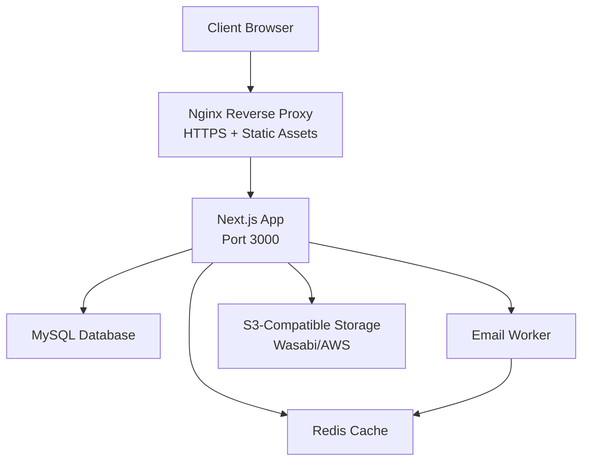
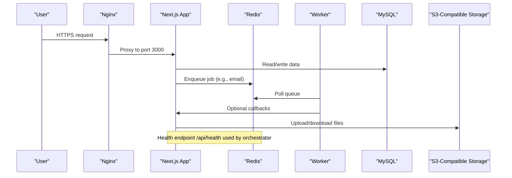
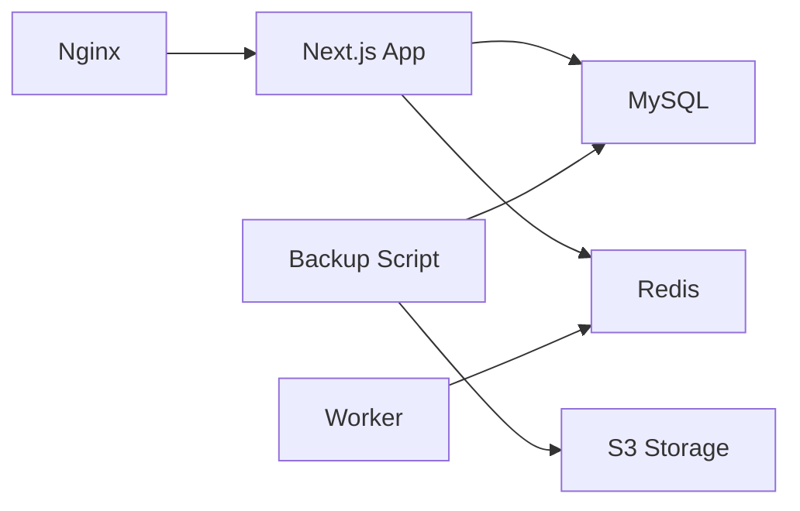

# Deployment & DevOps

<cite>
**Referenced Files in This Document**
- [Dockerfile](file://Dockerfile)
- [docker-compose.yml](file://docker-compose.yml)
- [.github/workflows/deploy.yml](file://.github/workflows/deploy.yml)
- [DEPLOYMENT_GUIDE_SERVER.md](file://DEPLOYMENT_GUIDE_SERVER.md)
- [deploy.sh](file://deploy.sh)
- [scripts/deploy-prod.ps1](file://scripts/deploy-prod.ps1)
- [nginx_tmcng.conf](file://nginx_tmcng.conf)
- [next.config.ts](file://next.config.ts)
- [package.json](file://package.json)
- [lib/redis.ts](file://lib/redis.ts)
- [app/api/health/route.ts](file://app/api/health/route.ts)
- [scripts/automated-backup.ts](file://scripts/automated-backup.ts)
</cite>

## Table of Contents
1. [Introduction](#introduction)
2. [Project Structure](#project-structure)
3. [Core Components](#core-components)
4. [Architecture Overview](#architecture-overview)
5. [Detailed Component Analysis](#detailed-component-analysis)
6. [Dependency Analysis](#dependency-analysis)
7. [Performance Considerations](#performance-considerations)
8. [Troubleshooting Guide](#troubleshooting-guide)
9. [Conclusion](#conclusion)
10. [Appendices](#appendices)

## Introduction
This document provides production deployment and DevOps guidance for the TMC Portal. It covers containerization with multi-stage Docker builds, environment configuration, service orchestration via docker-compose, CI/CD automation using GitHub Actions, database provisioning and migrations, caching with Redis, external integrations (S3-compatible storage), monitoring and logging strategies, scaling approaches, security hardening, disaster recovery, and rollback procedures. The goal is to enable reliable, repeatable deployments with clear operational runbooks.

## Project Structure
The deployment surface includes:
- Container image definition and runtime configuration
- Service orchestration for app, worker, and cache
- CI/CD pipeline for automated builds and deployments
- Nginx reverse proxy configuration for HTTPS and static assets
- Health check endpoint for orchestration and load balancers
- Backup automation for database and uploads to local archive and S3-compatible storage
- Environment variables and build-time arguments

**Diagram sources**
- [nginx_tmcng.conf:1-59](file://nginx_tmcng.conf#L1-L59)
- [docker-compose.yml:1-69](file://docker-compose.yml#L1-L69)
- [Dockerfile:1-95](file://Dockerfile#L1-L95)
- [scripts/automated-backup.ts:1-238](file://scripts/automated-backup.ts#L1-L238)

**Section sources**
- [docker-compose.yml:1-69](file://docker-compose.yml#L1-L69)
- [Dockerfile:1-95](file://Dockerfile#L1-L95)
- [nginx_tmcng.conf:1-59](file://nginx_tmcng.conf#L1-L59)

## Core Components
- Multi-stage Docker image optimized for Next.js standalone output
- docker-compose services for application, background worker, and Redis cache
- GitHub Actions workflow to deploy on push to main branches
- Nginx reverse proxy with SSL termination and upload aliasing
- Health check endpoint for readiness probes
- Automated backup script for database dumps and file archives

Key responsibilities:
- Build and packaging: Dockerfile stages for dependencies, build, and runtime
- Orchestration: docker-compose defines services, networking, volumes, and health checks
- CI/CD: GitHub Actions triggers SSH-based deployment and container rebuilds
- Runtime config: next.config.ts sets standalone output and image remote patterns
- Observability: health endpoint used by compose healthcheck
- Data protection: automated backups to local archive and S3-compatible storage

**Section sources**
- [Dockerfile:1-95](file://Dockerfile#L1-L95)
- [docker-compose.yml:1-69](file://docker-compose.yml#L1-L69)
- [.github/workflows/deploy.yml:1-26](file://.github/workflows/deploy.yml#L1-L26)
- [nginx_tmcng.conf:1-59](file://nginx_tmcng.conf#L1-L59)
- [next.config.ts:1-41](file://next.config.ts#L1-L41)
- [app/api/health/route.ts:1-6](file://app/api/health/route.ts#L1-L6)
- [scripts/automated-backup.ts:1-238](file://scripts/automated-backup.ts#L1-L238)

## Architecture Overview
The production stack runs a Next.js server behind Nginx with HTTPS, a Redis-backed queue for background jobs, and MySQL as the primary data store. Backups are performed by an automated script that dumps the database and zips uploads, storing results locally and optionally uploading to S3-compatible storage.

**Diagram sources**
- [nginx_tmcng.conf:1-59](file://nginx_tmcng.conf#L1-L59)
- [docker-compose.yml:1-69](file://docker-compose.yml#L1-L69)
- [lib/redis.ts:1-9](file://lib/redis.ts#L1-L9)
- [scripts/automated-backup.ts:1-238](file://scripts/automated-backup.ts#L1-L238)

## Detailed Component Analysis

### Container Image and Multi-stage Build
- Base image uses Node LTS slim with required system packages
- Dependency stage installs modules and generates Prisma client
- Builder stage compiles Next.js into standalone output
- Runner stage copies only necessary artifacts, sets non-root user, exposes port, and starts the server

Best practices applied:
- Separate dependency installation for better layer caching
- Minimal runtime image with only production dependencies
- Non-root user for improved security
- Explicit environment variables for build and runtime

**Section sources**
- [Dockerfile:1-95](file://Dockerfile#L1-L95)
- [package.json:1-127](file://package.json#L1-L127)

### Service Orchestration with docker-compose
- Application service runs migrations then starts the server
- Worker service consumes background jobs from Redis
- Redis service provides persistent cache volume
- Health check probes the application’s /api/health endpoint
- Volumes mount uploads and backups directories for persistence

Operational notes:
- Ensure external network exists or adjust compose to create it
- Map host ports carefully to avoid conflicts
- Use env_file for secrets and environment configuration

**Section sources**
- [docker-compose.yml:1-69](file://docker-compose.yml#L1-L69)
- [app/api/health/route.ts:1-6](file://app/api/health/route.ts#L1-L6)

### CI/CD Pipeline with GitHub Actions
- Triggered on push to master/main
- Uses SSH action to connect to server
- Pulls latest code, builds images, and starts services
- Cleans up unused images to save space

Recommendations:
- Add branch protection and require status checks before merge
- Integrate tests and linting steps prior to deployment
- Store secrets securely (SERVER_IP, SSH_PRIVATE_KEY)

**Section sources**
- [.github/workflows/deploy.yml:1-26](file://.github/workflows/deploy.yml#L1-L26)

### Reverse Proxy and SSL Termination
- Nginx proxies traffic to the Next.js app on the configured port
- Handles WebSocket upgrades for real-time features
- Serves uploaded files directly for performance
- SSL certificates managed by Certbot

Operational tips:
- Verify proxy headers for correct client IP and protocol forwarding
- Redirect HTTP to HTTPS where appropriate
- Keep certificate paths aligned with Certbot configuration

**Section sources**
- [nginx_tmcng.conf:1-59](file://nginx_tmcng.conf#L1-L59)

### Environment Configuration and Build-time Variables
- Application reads runtime environment variables for database, cache, and third-party services
- Build-time arguments include public keys needed during image build
- Standalone output reduces runtime footprint and improves startup time

Environment categories:
- Runtime: DATABASE_URL, REDIS_URL, NODE_ENV, PORT, NEXT_PUBLIC_APP_URL
- Build-time: NEXT_PUBLIC_PAYSTACK_PUBLIC_KEY passed as Docker ARG
- External services: S3-compatible credentials and endpoints

**Section sources**
- [DEPLOYMENT_GUIDE_SERVER.md:28-58](file://DEPLOYMENT_GUIDE_SERVER.md#L28-L58)
- [docker-compose.yml:1-69](file://docker-compose.yml#L1-L69)
- [next.config.ts:1-41](file://next.config.ts#L1-L41)
- [lib/redis.ts:1-9](file://lib/redis.ts#L1-L9)

### Background Workers and Queues
- Email worker runs as a separate service consuming jobs from Redis
- Shared Redis connection ensures consistent queue state across services
- Worker command defined in compose to start the email processing loop

Scaling considerations:
- Scale worker replicas horizontally based on queue depth
- Monitor queue metrics and adjust concurrency settings

**Section sources**
- [docker-compose.yml:37-52](file://docker-compose.yml#L1-L69)
- [lib/redis.ts:1-9](file://lib/redis.ts#L1-L9)
- [package.json:1-127](file://package.json#L1-L127)

### Monitoring and Health Checks
- Health endpoint returns a simple status for orchestrators and load balancers
- Compose healthcheck periodically probes the endpoint
- Logs can be collected via Docker logs or centralized logging solutions

Enhancements:
- Add structured logging with timestamps and correlation IDs
- Expose metrics endpoint for Prometheus scraping
- Integrate error tracking (e.g., Sentry) for unhandled exceptions

**Section sources**
- [app/api/health/route.ts:1-6](file://app/api/health/route.ts#L1-L6)
- [docker-compose.yml:31-35](file://docker-compose.yml#L1-L69)

### Backup Automation and Disaster Recovery
- Automated backup script performs:
  - Database dump via mysqldump
  - Zip of uploads directory
  - Local archival with retention policy
  - Optional upload to S3-compatible storage
  - Record creation in database for auditability
  - Cleanup of temporary files

Retention strategy:
- Local archive retains backups for a defined period
- Cloud storage retains backups for a defined period
- Old objects are deleted automatically

Disaster recovery steps:
- Restore database from latest SQL dump
- Restore uploads from zip archive
- Validate integrity and restart services

**Section sources**
- [scripts/automated-backup.ts:1-238](file://scripts/automated-backup.ts#L1-L238)

### Deployment Scripts and Rollback Strategies
- Shell script automates pull, down, build, up, and log inspection
- PowerShell script enables Windows-based initiation of deployments
- GitHub Actions provides repeatable, auditable deployments

Rollback approach:
- Maintain previous image tags and revert compose versions if needed
- Use database migration backward compatibility and versioned schema
- Keep backups immediately prior to major changes

**Section sources**
- [deploy.sh:1-28](file://deploy.sh#L1-L28)
- [scripts/deploy-prod.ps1:1-17](file://scripts/deploy-prod.ps1#L1-L17)
- [.github/workflows/deploy.yml:1-26](file://.github/workflows/deploy.yml#L1-L26)

## Dependency Analysis
Service relationships and data flows:
- Nginx depends on Next.js app for dynamic content and proxies static uploads
- Next.js depends on MySQL for persistence and Redis for queues/cache
- Worker depends on Redis for job consumption
- Backup script depends on MySQL client tools and S3 SDK

**Diagram sources**
- [nginx_tmcng.conf:1-59](file://nginx_tmcng.conf#L1-L59)
- [docker-compose.yml:1-69](file://docker-compose.yml#L1-L69)
- [scripts/automated-backup.ts:1-238](file://scripts/automated-backup.ts#L1-L238)

**Section sources**
- [docker-compose.yml:1-69](file://docker-compose.yml#L1-L69)
- [lib/redis.ts:1-9](file://lib/redis.ts#L1-L9)
- [scripts/automated-backup.ts:1-238](file://scripts/automated-backup.ts#L1-L238)

## Performance Considerations
- Use standalone output to minimize image size and improve cold start times
- Serve uploads directly via Nginx to reduce application load
- Configure Redis connection pooling and tune BullMQ concurrency for workers
- Enable compression and caching headers for static assets
- Monitor database query performance and add indexes as needed
- Use health checks to prevent routing traffic to unhealthy instances

[No sources needed since this section provides general guidance]

## Troubleshooting Guide
Common issues and resolutions:
- Port conflicts: Adjust PORT in environment and update Nginx proxy_pass accordingly
- Database connectivity: Verify DATABASE_URL and ensure containers share the same network
- Migration failures: Run migrate deploy explicitly and review error logs
- Worker not processing jobs: Check Redis connectivity and queue visibility
- Backup failures: Validate mysqldump permissions and S3 credentials

Diagnostic commands:
- Inspect container logs for errors
- Test database connectivity from within the app container
- Validate Nginx configuration syntax and reload after changes

**Section sources**
- [DEPLOYMENT_GUIDE_SERVER.md:92-145](file://DEPLOYMENT_GUIDE_SERVER.md#L92-L145)
- [docker-compose.yml:31-35](file://docker-compose.yml#L1-L69)

## Conclusion
The TMC Portal’s production deployment leverages multi-stage Docker builds, docker-compose orchestration, GitHub Actions automation, and robust backup procedures. With Nginx handling SSL and static assets, Redis powering background jobs, and automated backups ensuring data safety, the stack supports scalable and reliable operations. Follow the provided runbooks for environment setup, scaling, security hardening, and disaster recovery to maintain high availability and performance in production.

[No sources needed since this section summarizes without analyzing specific files]

## Appendices

### Production Environment Setup Checklist
- Create .env with required runtime variables
- Ensure external Docker network exists and databases are connected
- Apply database migrations and seed initial data
- Configure Nginx reverse proxy and SSL certificates
- Start services and verify health endpoint responses
- Schedule automated backups and validate cloud uploads

**Section sources**
- [DEPLOYMENT_GUIDE_SERVER.md:28-107](file://DEPLOYMENT_GUIDE_SERVER.md#L28-L107)
- [docker-compose.yml:1-69](file://docker-compose.yml#L1-L69)

### Scaling Strategies
- Horizontal scaling:
  - Run multiple app containers behind a load balancer
  - Scale worker replicas based on queue depth
- Load balancing:
  - Use Nginx or an external load balancer to distribute traffic
  - Sticky sessions if required by session storage
- Database clustering:
  - Use MySQL replication or managed database services
  - Implement read replicas for read-heavy workloads

[No sources needed since this section provides general guidance]

### Security Considerations
- SSL/TLS: Manage certificates with Certbot and enforce HTTPS redirects
- Firewall: Restrict inbound ports to 80/443; expose only necessary services
- Secrets management: Use environment files and CI/CD secrets; avoid committing sensitive values
- Scanning: Integrate vulnerability scanning in CI/CD pipelines
- Least privilege: Run containers as non-root users and limit capabilities

**Section sources**
- [nginx_tmcng.conf:28-33](file://nginx_tmcng.conf#L28-L33)
- [Dockerfile:56-88](file://Dockerfile#L56-L88)

### Disaster Recovery Procedures
- Restore database from latest backup
- Restore uploads from archived zip
- Validate data integrity and restart services
- Perform smoke tests to confirm functionality

**Section sources**
- [scripts/automated-backup.ts:118-200](file://scripts/automated-backup.ts#L118-L200)